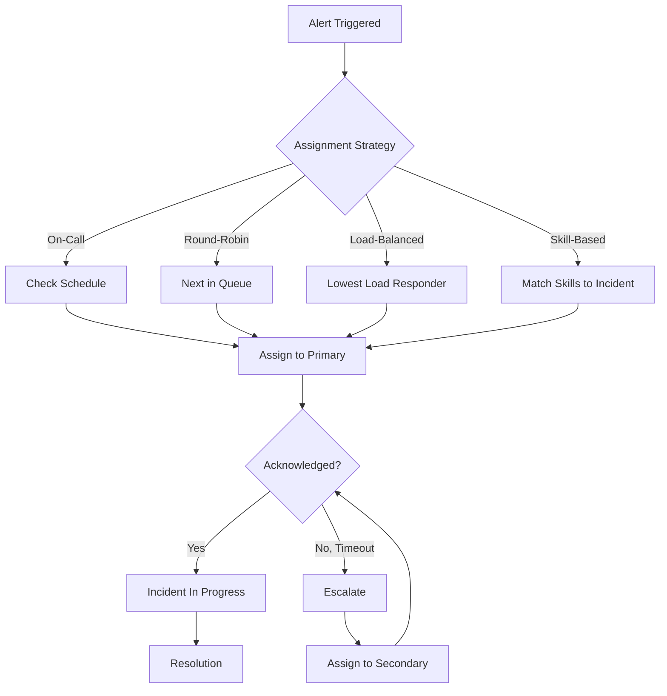
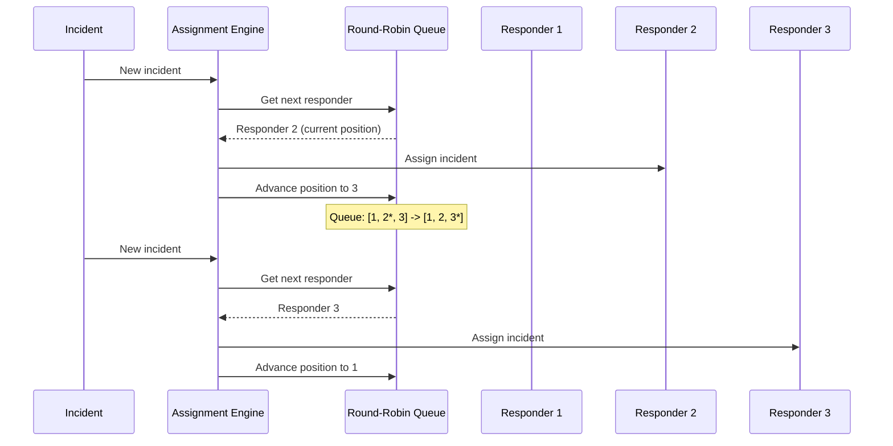
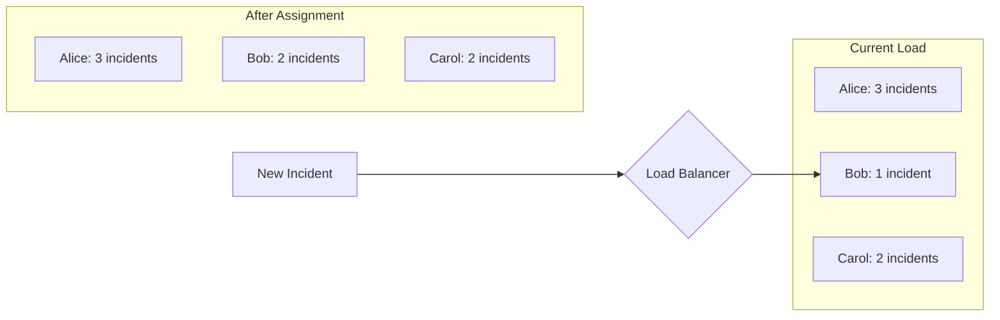
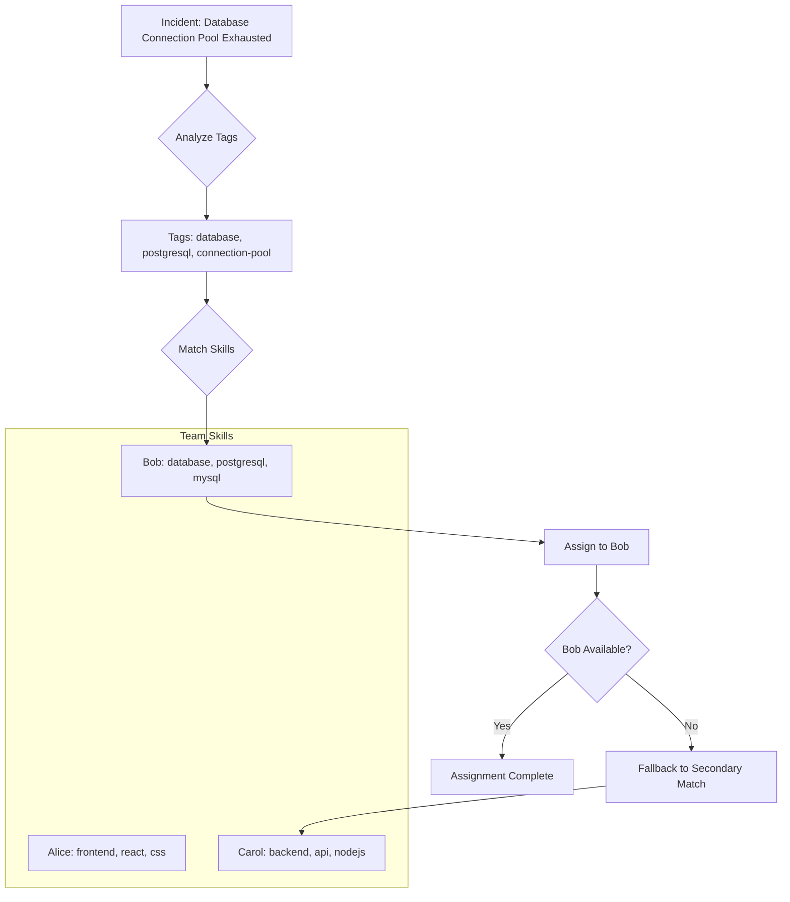
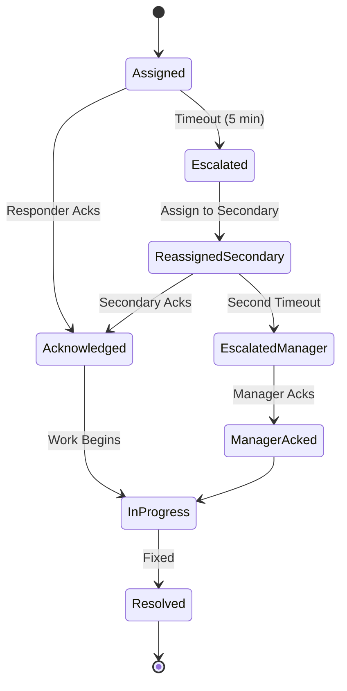

# How to Implement Incident Assignment

Author: [nawazdhandala](https://github.com/nawazdhandala)

Tags: Incident Management, SRE, On-Call, Operations

Description: Learn how to assign incidents to the appropriate responders effectively.

---

Incident assignment is the critical bridge between detection and resolution. When an alert fires at 3 AM, the system must route it to the right person with the right skills, without overwhelming any single responder. Poor assignment leads to delayed responses, alert fatigue, and burned-out engineers. Good assignment ensures fast acknowledgment, proper expertise, and sustainable on-call rotations.

## The Incident Assignment Flow

Before diving into implementation details, understand how assignment fits into the incident lifecycle.



## On-Call Schedule Integration

The most common assignment method ties incidents to on-call schedules. When an incident occurs, the system looks up who is currently on-call and assigns the incident to them.

### Data Model for On-Call Schedules

Start with a solid data model that supports multiple schedules, rotations, and overrides.

```typescript
// models/oncall.ts

interface OnCallSchedule {
  id: string;
  name: string;
  teamId: string;
  timezone: string;
  layers: OnCallLayer[];
}

interface OnCallLayer {
  id: string;
  name: string;
  priority: number; // Higher priority layers override lower ones
  rotationType: 'daily' | 'weekly' | 'custom';
  rotationStartTime: string; // ISO timestamp
  handoffTime: string; // Time of day for handoffs, e.g., "09:00"
  participants: OnCallParticipant[];
  restrictions?: TimeRestriction[]; // Optional time-based restrictions
}

interface OnCallParticipant {
  userId: string;
  position: number; // Order in rotation
}

interface TimeRestriction {
  type: 'weekday' | 'weekend' | 'custom';
  startTime?: string;
  endTime?: string;
  daysOfWeek?: number[]; // 0 = Sunday, 6 = Saturday
}

interface OnCallOverride {
  id: string;
  scheduleId: string;
  userId: string; // User taking over
  startTime: Date;
  endTime: Date;
  reason?: string;
}
```

### Resolving Current On-Call

The core function determines who is on-call at any given moment, accounting for layers, rotations, and overrides.

```typescript
// services/oncall-resolver.ts

import { DateTime } from 'luxon';

interface OnCallResolution {
  userId: string;
  scheduleId: string;
  layerId: string;
  isOverride: boolean;
  shiftStart: Date;
  shiftEnd: Date;
}

export class OnCallResolver {
  constructor(
    private scheduleRepository: ScheduleRepository,
    private overrideRepository: OverrideRepository
  ) {}

  async getCurrentOnCall(
    scheduleId: string,
    atTime: Date = new Date()
  ): Promise<OnCallResolution | null> {
    // Check for active overrides first
    const override = await this.overrideRepository.findActive(
      scheduleId,
      atTime
    );

    if (override) {
      return {
        userId: override.userId,
        scheduleId,
        layerId: 'override',
        isOverride: true,
        shiftStart: override.startTime,
        shiftEnd: override.endTime
      };
    }

    // Resolve from schedule layers
    const schedule = await this.scheduleRepository.findById(scheduleId);
    if (!schedule) return null;

    // Process layers in priority order (highest first)
    const sortedLayers = [...schedule.layers].sort(
      (a, b) => b.priority - a.priority
    );

    for (const layer of sortedLayers) {
      const resolution = this.resolveLayer(layer, schedule.timezone, atTime);
      if (resolution) {
        return {
          ...resolution,
          scheduleId,
          isOverride: false
        };
      }
    }

    return null;
  }

  private resolveLayer(
    layer: OnCallLayer,
    timezone: string,
    atTime: Date
  ): Omit<OnCallResolution, 'scheduleId' | 'isOverride'> | null {
    // Check time restrictions
    if (!this.isWithinRestrictions(layer.restrictions, atTime, timezone)) {
      return null;
    }

    const localTime = DateTime.fromJSDate(atTime).setZone(timezone);
    const rotationStart = DateTime.fromISO(layer.rotationStartTime).setZone(
      timezone
    );

    // Calculate which rotation we're in
    const rotationLengthHours = this.getRotationLength(layer.rotationType);
    const hoursSinceStart = localTime.diff(rotationStart, 'hours').hours;
    const rotationIndex = Math.floor(hoursSinceStart / rotationLengthHours);

    // Determine participant for this rotation
    const participantIndex = rotationIndex % layer.participants.length;
    const participant = layer.participants.find(
      p => p.position === participantIndex
    );

    if (!participant) return null;

    // Calculate shift boundaries
    const shiftStart = rotationStart.plus({
      hours: rotationIndex * rotationLengthHours
    });
    const shiftEnd = shiftStart.plus({ hours: rotationLengthHours });

    return {
      userId: participant.userId,
      layerId: layer.id,
      shiftStart: shiftStart.toJSDate(),
      shiftEnd: shiftEnd.toJSDate()
    };
  }

  private getRotationLength(type: string): number {
    switch (type) {
      case 'daily':
        return 24;
      case 'weekly':
        return 168;
      default:
        return 24;
    }
  }

  private isWithinRestrictions(
    restrictions: TimeRestriction[] | undefined,
    atTime: Date,
    timezone: string
  ): boolean {
    if (!restrictions || restrictions.length === 0) return true;

    const localTime = DateTime.fromJSDate(atTime).setZone(timezone);

    return restrictions.some(restriction => {
      if (restriction.type === 'weekday') {
        return localTime.weekday >= 1 && localTime.weekday <= 5;
      }
      if (restriction.type === 'weekend') {
        return localTime.weekday === 6 || localTime.weekday === 7;
      }
      if (restriction.daysOfWeek) {
        const jsWeekday = localTime.weekday % 7; // Convert to JS format
        return restriction.daysOfWeek.includes(jsWeekday);
      }
      return true;
    });
  }
}
```

## Round-Robin Assignment

Round-robin distributes incidents evenly across team members in sequence. This works well for teams without complex scheduling needs.



### Implementation

```typescript
// services/round-robin-assigner.ts

interface RoundRobinState {
  teamId: string;
  currentPosition: number;
  participantOrder: string[]; // User IDs in order
  lastUpdated: Date;
}

export class RoundRobinAssigner {
  constructor(
    private stateRepository: StateRepository,
    private userRepository: UserRepository
  ) {}

  async assignNext(
    teamId: string,
    incidentId: string
  ): Promise<string> {
    // Get or initialize state
    let state = await this.stateRepository.findByTeam(teamId);

    if (!state) {
      const teamMembers = await this.userRepository.findByTeam(teamId);
      state = {
        teamId,
        currentPosition: 0,
        participantOrder: teamMembers.map(m => m.id),
        lastUpdated: new Date()
      };
    }

    // Get next available responder
    const assignee = await this.findNextAvailable(state);

    // Update position atomically
    await this.stateRepository.updatePosition(
      teamId,
      (state.currentPosition + 1) % state.participantOrder.length
    );

    return assignee;
  }

  private async findNextAvailable(
    state: RoundRobinState
  ): Promise<string> {
    const { participantOrder, currentPosition } = state;

    // Try each participant starting from current position
    for (let i = 0; i < participantOrder.length; i++) {
      const index = (currentPosition + i) % participantOrder.length;
      const userId = participantOrder[index];

      const user = await this.userRepository.findById(userId);

      // Skip unavailable users
      if (user.status === 'available') {
        return userId;
      }
    }

    // Fallback to current position if no one is available
    return participantOrder[currentPosition];
  }

  // Allow manual reordering
  async updateOrder(teamId: string, newOrder: string[]): Promise<void> {
    await this.stateRepository.updateOrder(teamId, newOrder, new Date());
  }

  // Skip a responder temporarily
  async skipNext(teamId: string, reason: string): Promise<void> {
    const state = await this.stateRepository.findByTeam(teamId);
    if (!state) return;

    const newPosition =
      (state.currentPosition + 1) % state.participantOrder.length;

    await this.stateRepository.updatePosition(teamId, newPosition);

    // Log the skip for auditing
    console.log(`Skipped position ${state.currentPosition}: ${reason}`);
  }
}
```

## Load-Balanced Assignment

Load balancing considers each responder's current workload and assigns to the least loaded person. This prevents any single responder from being overwhelmed during incident storms.



### Implementation

```typescript
// services/load-balanced-assigner.ts

interface ResponderLoad {
  userId: string;
  activeIncidents: number;
  totalAssignedToday: number;
  averageResolutionTime: number; // minutes
  lastAssignedAt: Date | null;
}

interface LoadBalanceConfig {
  maxActiveIncidents: number;
  weightActiveIncidents: number;
  weightTotalToday: number;
  weightTimeSinceLastAssignment: number;
  cooldownMinutes: number;
}

const DEFAULT_CONFIG: LoadBalanceConfig = {
  maxActiveIncidents: 5,
  weightActiveIncidents: 0.5,
  weightTotalToday: 0.3,
  weightTimeSinceLastAssignment: 0.2,
  cooldownMinutes: 15
};

export class LoadBalancedAssigner {
  constructor(
    private incidentRepository: IncidentRepository,
    private userRepository: UserRepository,
    private config: LoadBalanceConfig = DEFAULT_CONFIG
  ) {}

  async assignToLowestLoad(
    teamId: string,
    incidentSeverity: string
  ): Promise<string> {
    const teamMembers = await this.userRepository.findByTeam(teamId);
    const loads = await Promise.all(
      teamMembers.map(m => this.calculateLoad(m.id))
    );

    // Filter out overloaded responders
    const available = loads.filter(
      l => l.activeIncidents < this.config.maxActiveIncidents
    );

    if (available.length === 0) {
      // Everyone is at capacity, find least loaded anyway
      console.warn(`Team ${teamId} at capacity, forcing assignment`);
      return this.selectLowestScore(loads);
    }

    // For critical incidents, consider resolution time
    if (incidentSeverity === 'critical') {
      return this.selectFastestResolver(available);
    }

    return this.selectLowestScore(available);
  }

  private async calculateLoad(userId: string): Promise<ResponderLoad> {
    const now = new Date();
    const todayStart = new Date(now);
    todayStart.setHours(0, 0, 0, 0);

    const activeIncidents = await this.incidentRepository.countActive(userId);
    const todayIncidents = await this.incidentRepository.countSince(
      userId,
      todayStart
    );
    const lastAssignment = await this.incidentRepository.findLastAssigned(
      userId
    );
    const avgResolution = await this.incidentRepository.averageResolutionTime(
      userId,
      30 // Last 30 days
    );

    return {
      userId,
      activeIncidents,
      totalAssignedToday: todayIncidents,
      averageResolutionTime: avgResolution,
      lastAssignedAt: lastAssignment?.assignedAt || null
    };
  }

  private selectLowestScore(loads: ResponderLoad[]): string {
    const now = new Date();

    const scored = loads.map(load => {
      // Calculate time since last assignment (higher = better)
      const minutesSinceLast = load.lastAssignedAt
        ? (now.getTime() - load.lastAssignedAt.getTime()) / 60000
        : 1000; // Never assigned = high value

      // Apply cooldown
      const cooldownPenalty = minutesSinceLast < this.config.cooldownMinutes
        ? 100
        : 0;

      // Lower score = better candidate
      const score =
        load.activeIncidents * this.config.weightActiveIncidents +
        load.totalAssignedToday * this.config.weightTotalToday -
        Math.min(minutesSinceLast, 60) * this.config.weightTimeSinceLastAssignment +
        cooldownPenalty;

      return { userId: load.userId, score };
    });

    // Sort by score ascending
    scored.sort((a, b) => a.score - b.score);

    return scored[0].userId;
  }

  private selectFastestResolver(loads: ResponderLoad[]): string {
    // For critical incidents, prefer responders with faster resolution times
    const sorted = [...loads].sort(
      (a, b) => a.averageResolutionTime - b.averageResolutionTime
    );

    // But don't assign to someone already overwhelmed
    for (const load of sorted) {
      if (load.activeIncidents < this.config.maxActiveIncidents - 1) {
        return load.userId;
      }
    }

    return sorted[0].userId;
  }
}
```

## Skill-Based Assignment

Skill-based routing matches incident characteristics to responder expertise. A database incident should go to someone with database skills, not a frontend engineer.



### Implementation

```typescript
// services/skill-based-assigner.ts

interface Skill {
  name: string;
  level: 'beginner' | 'intermediate' | 'expert';
  weight: number; // Computed from level
}

interface UserSkills {
  userId: string;
  skills: Skill[];
}

interface IncidentContext {
  id: string;
  title: string;
  tags: string[];
  affectedService: string;
  severity: string;
}

export class SkillBasedAssigner {
  private skillWeights = {
    beginner: 1,
    intermediate: 2,
    expert: 3
  };

  constructor(
    private skillRepository: SkillRepository,
    private serviceOwnerRepository: ServiceOwnerRepository,
    private fallbackAssigner: LoadBalancedAssigner
  ) {}

  async assignBySkill(
    teamId: string,
    incident: IncidentContext
  ): Promise<{ userId: string; matchScore: number; matchedSkills: string[] }> {
    // Get required skills from incident
    const requiredSkills = await this.extractRequiredSkills(incident);

    if (requiredSkills.length === 0) {
      // No skill requirements, fall back to load balancing
      const userId = await this.fallbackAssigner.assignToLowestLoad(
        teamId,
        incident.severity
      );
      return { userId, matchScore: 0, matchedSkills: [] };
    }

    // Get all team members' skills
    const teamSkills = await this.skillRepository.findByTeam(teamId);

    // Score each team member
    const scored = teamSkills.map(userSkill => {
      const { score, matched } = this.calculateSkillMatch(
        userSkill,
        requiredSkills
      );
      return {
        userId: userSkill.userId,
        matchScore: score,
        matchedSkills: matched
      };
    });

    // Sort by match score descending
    scored.sort((a, b) => b.matchScore - a.matchScore);

    // Return best match if score is above threshold
    if (scored[0] && scored[0].matchScore > 0) {
      return scored[0];
    }

    // No skill match, fall back
    const fallbackUserId = await this.fallbackAssigner.assignToLowestLoad(
      teamId,
      incident.severity
    );
    return { userId: fallbackUserId, matchScore: 0, matchedSkills: [] };
  }

  private async extractRequiredSkills(
    incident: IncidentContext
  ): Promise<string[]> {
    const skills: Set<string> = new Set();

    // Add incident tags as skills
    incident.tags.forEach(tag => skills.add(tag.toLowerCase()));

    // Look up service-specific skills
    const serviceSkills = await this.serviceOwnerRepository.getSkillsForService(
      incident.affectedService
    );
    serviceSkills.forEach(s => skills.add(s.toLowerCase()));

    // Extract skills from title keywords
    const titleKeywords = this.extractKeywords(incident.title);
    titleKeywords.forEach(k => skills.add(k));

    return Array.from(skills);
  }

  private extractKeywords(title: string): string[] {
    const keywords: string[] = [];
    const lowerTitle = title.toLowerCase();

    // Common technology keywords
    const techPatterns = [
      'kubernetes', 'k8s', 'docker', 'postgres', 'postgresql',
      'mysql', 'redis', 'mongodb', 'elasticsearch', 'kafka',
      'aws', 'gcp', 'azure', 'nginx', 'api', 'frontend',
      'backend', 'database', 'network', 'dns', 'ssl', 'auth'
    ];

    techPatterns.forEach(pattern => {
      if (lowerTitle.includes(pattern)) {
        keywords.push(pattern);
      }
    });

    return keywords;
  }

  private calculateSkillMatch(
    userSkill: UserSkills,
    requiredSkills: string[]
  ): { score: number; matched: string[] } {
    let score = 0;
    const matched: string[] = [];

    for (const required of requiredSkills) {
      const userHasSkill = userSkill.skills.find(
        s => s.name.toLowerCase() === required
      );

      if (userHasSkill) {
        score += this.skillWeights[userHasSkill.level];
        matched.push(required);
      }
    }

    // Bonus for matching multiple skills
    if (matched.length > 1) {
      score *= 1 + (matched.length - 1) * 0.1;
    }

    return { score, matched };
  }
}
```

## Acknowledgment Tracking

Assignments mean nothing without acknowledgment. Track when responders acknowledge incidents and escalate if they do not.



### Implementation

```typescript
// services/acknowledgment-tracker.ts

interface AcknowledgmentConfig {
  primaryTimeoutMinutes: number;
  secondaryTimeoutMinutes: number;
  maxEscalationLevel: number;
}

interface IncidentAssignment {
  incidentId: string;
  userId: string;
  assignedAt: Date;
  acknowledgedAt: Date | null;
  escalationLevel: number;
  notificationsSent: number;
}

export class AcknowledgmentTracker {
  private config: AcknowledgmentConfig = {
    primaryTimeoutMinutes: 5,
    secondaryTimeoutMinutes: 10,
    maxEscalationLevel: 3
  };

  constructor(
    private assignmentRepository: AssignmentRepository,
    private escalationService: EscalationService,
    private notificationService: NotificationService
  ) {}

  async trackAssignment(
    incidentId: string,
    userId: string
  ): Promise<IncidentAssignment> {
    const assignment: IncidentAssignment = {
      incidentId,
      userId,
      assignedAt: new Date(),
      acknowledgedAt: null,
      escalationLevel: 0,
      notificationsSent: 1
    };

    await this.assignmentRepository.create(assignment);

    // Send initial notification
    await this.notificationService.notifyAssignment(incidentId, userId);

    // Schedule timeout check
    this.scheduleTimeoutCheck(incidentId, assignment.escalationLevel);

    return assignment;
  }

  async acknowledge(
    incidentId: string,
    userId: string
  ): Promise<{ success: boolean; message: string }> {
    const assignment = await this.assignmentRepository.findByIncident(
      incidentId
    );

    if (!assignment) {
      return { success: false, message: 'No assignment found' };
    }

    if (assignment.userId !== userId) {
      return {
        success: false,
        message: 'Can only acknowledge incidents assigned to you'
      };
    }

    if (assignment.acknowledgedAt) {
      return { success: true, message: 'Already acknowledged' };
    }

    // Record acknowledgment
    assignment.acknowledgedAt = new Date();
    await this.assignmentRepository.update(assignment);

    // Calculate response time
    const responseTimeMs =
      assignment.acknowledgedAt.getTime() - assignment.assignedAt.getTime();

    // Log metrics
    console.log(`Incident ${incidentId} acknowledged`, {
      userId,
      responseTimeMs,
      escalationLevel: assignment.escalationLevel
    });

    return {
      success: true,
      message: `Acknowledged in ${Math.round(responseTimeMs / 1000)}s`
    };
  }

  private async scheduleTimeoutCheck(
    incidentId: string,
    escalationLevel: number
  ): Promise<void> {
    const timeoutMinutes = escalationLevel === 0
      ? this.config.primaryTimeoutMinutes
      : this.config.secondaryTimeoutMinutes;

    // In production, use a job scheduler like BullMQ
    setTimeout(async () => {
      await this.checkTimeout(incidentId);
    }, timeoutMinutes * 60 * 1000);
  }

  private async checkTimeout(incidentId: string): Promise<void> {
    const assignment = await this.assignmentRepository.findByIncident(
      incidentId
    );

    if (!assignment || assignment.acknowledgedAt) {
      return; // Already acknowledged or no assignment
    }

    // Check if incident is still open
    const incident = await this.assignmentRepository.getIncident(incidentId);
    if (incident.status === 'resolved') {
      return;
    }

    // Escalate
    if (assignment.escalationLevel < this.config.maxEscalationLevel) {
      await this.escalate(incidentId, assignment);
    } else {
      // Max escalation reached, send urgent notification
      await this.notificationService.sendUrgent(
        incidentId,
        'Maximum escalation reached - immediate attention required'
      );
    }
  }

  private async escalate(
    incidentId: string,
    currentAssignment: IncidentAssignment
  ): Promise<void> {
    const newLevel = currentAssignment.escalationLevel + 1;

    // Get next escalation target
    const escalationTarget = await this.escalationService.getTarget(
      incidentId,
      newLevel
    );

    // Create new assignment
    const newAssignment: IncidentAssignment = {
      incidentId,
      userId: escalationTarget.userId,
      assignedAt: new Date(),
      acknowledgedAt: null,
      escalationLevel: newLevel,
      notificationsSent: 1
    };

    await this.assignmentRepository.create(newAssignment);

    // Notify new assignee
    await this.notificationService.notifyEscalation(
      incidentId,
      escalationTarget.userId,
      newLevel
    );

    // Schedule next timeout
    this.scheduleTimeoutCheck(incidentId, newLevel);

    console.log(`Incident ${incidentId} escalated to level ${newLevel}`, {
      previousAssignee: currentAssignment.userId,
      newAssignee: escalationTarget.userId
    });
  }
}
```

## Reassignment Workflows

Sometimes incidents need to be reassigned. The current responder may lack the skills, be overwhelmed, or simply need to hand off to the next shift.

```typescript
// services/reassignment-service.ts

interface ReassignmentRequest {
  incidentId: string;
  fromUserId: string;
  toUserId?: string; // Optional - if not provided, use assignment strategy
  reason: ReassignmentReason;
  notes?: string;
}

type ReassignmentReason =
  | 'skill_mismatch'
  | 'workload'
  | 'shift_handoff'
  | 'escalation'
  | 'vacation'
  | 'other';

interface ReassignmentResult {
  success: boolean;
  newAssigneeId: string;
  message: string;
}

export class ReassignmentService {
  constructor(
    private assignmentRepository: AssignmentRepository,
    private onCallResolver: OnCallResolver,
    private loadBalancedAssigner: LoadBalancedAssigner,
    private skillBasedAssigner: SkillBasedAssigner,
    private notificationService: NotificationService,
    private auditLogger: AuditLogger
  ) {}

  async reassign(request: ReassignmentRequest): Promise<ReassignmentResult> {
    const { incidentId, fromUserId, toUserId, reason, notes } = request;

    // Validate current assignment
    const currentAssignment = await this.assignmentRepository.findByIncident(
      incidentId
    );

    if (!currentAssignment || currentAssignment.userId !== fromUserId) {
      return {
        success: false,
        newAssigneeId: '',
        message: 'Incident not currently assigned to this user'
      };
    }

    // Determine new assignee
    let newAssigneeId: string;

    if (toUserId) {
      // Direct reassignment to specified user
      newAssigneeId = toUserId;
    } else {
      // Auto-select based on reason
      newAssigneeId = await this.selectNewAssignee(incidentId, reason);
    }

    // Prevent self-assignment
    if (newAssigneeId === fromUserId) {
      return {
        success: false,
        newAssigneeId: '',
        message: 'Cannot reassign to the same user'
      };
    }

    // Perform reassignment
    await this.performReassignment(
      incidentId,
      fromUserId,
      newAssigneeId,
      reason,
      notes
    );

    return {
      success: true,
      newAssigneeId,
      message: `Incident reassigned to ${newAssigneeId}`
    };
  }

  private async selectNewAssignee(
    incidentId: string,
    reason: ReassignmentReason
  ): Promise<string> {
    const incident = await this.assignmentRepository.getIncident(incidentId);
    const teamId = incident.teamId;

    switch (reason) {
      case 'skill_mismatch':
        // Use skill-based assignment
        const skillMatch = await this.skillBasedAssigner.assignBySkill(
          teamId,
          incident
        );
        return skillMatch.userId;

      case 'shift_handoff':
        // Get current on-call
        const onCall = await this.onCallResolver.getCurrentOnCall(
          incident.scheduleId
        );
        return onCall?.userId || await this.loadBalancedAssigner.assignToLowestLoad(
          teamId,
          incident.severity
        );

      case 'workload':
      case 'vacation':
      default:
        // Use load balancing
        return await this.loadBalancedAssigner.assignToLowestLoad(
          teamId,
          incident.severity
        );
    }
  }

  private async performReassignment(
    incidentId: string,
    fromUserId: string,
    toUserId: string,
    reason: ReassignmentReason,
    notes?: string
  ): Promise<void> {
    // Create new assignment
    const newAssignment = {
      incidentId,
      userId: toUserId,
      assignedAt: new Date(),
      acknowledgedAt: null,
      escalationLevel: 0,
      notificationsSent: 1,
      previousAssignee: fromUserId,
      reassignmentReason: reason
    };

    await this.assignmentRepository.create(newAssignment);

    // Notify both parties
    await Promise.all([
      this.notificationService.notifyReassignmentFrom(
        incidentId,
        fromUserId,
        toUserId,
        reason
      ),
      this.notificationService.notifyReassignmentTo(
        incidentId,
        toUserId,
        fromUserId,
        reason
      )
    ]);

    // Audit log
    await this.auditLogger.log({
      action: 'incident_reassigned',
      incidentId,
      fromUserId,
      toUserId,
      reason,
      notes,
      timestamp: new Date()
    });
  }

  // Bulk reassignment for shift handoffs
  async bulkReassign(
    fromUserId: string,
    toUserId: string,
    reason: ReassignmentReason
  ): Promise<{ reassigned: number; failed: number }> {
    const activeIncidents = await this.assignmentRepository.findActiveByUser(
      fromUserId
    );

    let reassigned = 0;
    let failed = 0;

    for (const incident of activeIncidents) {
      const result = await this.reassign({
        incidentId: incident.id,
        fromUserId,
        toUserId,
        reason
      });

      if (result.success) {
        reassigned++;
      } else {
        failed++;
      }
    }

    return { reassigned, failed };
  }
}
```

## Complete Assignment Engine

Combine all strategies into a unified assignment engine that selects the right approach based on configuration and incident context.

```typescript
// services/assignment-engine.ts

type AssignmentStrategy =
  | 'oncall'
  | 'round_robin'
  | 'load_balanced'
  | 'skill_based'
  | 'hybrid';

interface AssignmentConfig {
  defaultStrategy: AssignmentStrategy;
  strategyByService: Map<string, AssignmentStrategy>;
  strategyBySeverity: Map<string, AssignmentStrategy>;
}

interface AssignmentResult {
  userId: string;
  strategy: AssignmentStrategy;
  metadata: Record<string, unknown>;
}

export class AssignmentEngine {
  constructor(
    private config: AssignmentConfig,
    private onCallResolver: OnCallResolver,
    private roundRobinAssigner: RoundRobinAssigner,
    private loadBalancedAssigner: LoadBalancedAssigner,
    private skillBasedAssigner: SkillBasedAssigner,
    private acknowledgmentTracker: AcknowledgmentTracker
  ) {}

  async assign(incident: IncidentContext): Promise<AssignmentResult> {
    // Determine strategy
    const strategy = this.selectStrategy(incident);

    // Execute assignment
    const result = await this.executeStrategy(strategy, incident);

    // Track for acknowledgment
    await this.acknowledgmentTracker.trackAssignment(
      incident.id,
      result.userId
    );

    // Log assignment
    console.log(`Incident ${incident.id} assigned`, {
      userId: result.userId,
      strategy,
      severity: incident.severity,
      service: incident.affectedService
    });

    return result;
  }

  private selectStrategy(incident: IncidentContext): AssignmentStrategy {
    // Check severity-specific strategy first
    if (this.config.strategyBySeverity.has(incident.severity)) {
      return this.config.strategyBySeverity.get(incident.severity)!;
    }

    // Check service-specific strategy
    if (this.config.strategyByService.has(incident.affectedService)) {
      return this.config.strategyByService.get(incident.affectedService)!;
    }

    // Use default
    return this.config.defaultStrategy;
  }

  private async executeStrategy(
    strategy: AssignmentStrategy,
    incident: IncidentContext
  ): Promise<AssignmentResult> {
    switch (strategy) {
      case 'oncall': {
        const onCall = await this.onCallResolver.getCurrentOnCall(
          incident.scheduleId
        );
        return {
          userId: onCall!.userId,
          strategy,
          metadata: {
            scheduleId: incident.scheduleId,
            isOverride: onCall!.isOverride
          }
        };
      }

      case 'round_robin': {
        const userId = await this.roundRobinAssigner.assignNext(
          incident.teamId,
          incident.id
        );
        return {
          userId,
          strategy,
          metadata: {}
        };
      }

      case 'load_balanced': {
        const userId = await this.loadBalancedAssigner.assignToLowestLoad(
          incident.teamId,
          incident.severity
        );
        return {
          userId,
          strategy,
          metadata: {}
        };
      }

      case 'skill_based': {
        const match = await this.skillBasedAssigner.assignBySkill(
          incident.teamId,
          incident
        );
        return {
          userId: match.userId,
          strategy,
          metadata: {
            matchScore: match.matchScore,
            matchedSkills: match.matchedSkills
          }
        };
      }

      case 'hybrid': {
        // Combine skill matching with load balancing
        const skillMatch = await this.skillBasedAssigner.assignBySkill(
          incident.teamId,
          incident
        );

        // If good skill match, use it
        if (skillMatch.matchScore > 2) {
          return {
            userId: skillMatch.userId,
            strategy: 'skill_based',
            metadata: {
              matchScore: skillMatch.matchScore,
              matchedSkills: skillMatch.matchedSkills,
              hybridDecision: 'skill_match_sufficient'
            }
          };
        }

        // Otherwise, fall back to load balancing
        const userId = await this.loadBalancedAssigner.assignToLowestLoad(
          incident.teamId,
          incident.severity
        );
        return {
          userId,
          strategy: 'load_balanced',
          metadata: {
            hybridDecision: 'skill_match_insufficient',
            originalSkillScore: skillMatch.matchScore
          }
        };
      }
    }
  }
}
```

## API Endpoints

Expose assignment functionality through REST endpoints.

```typescript
// routes/assignment.ts

import { Router } from 'express';
import { AssignmentEngine } from '../services/assignment-engine';
import { ReassignmentService } from '../services/reassignment-service';
import { AcknowledgmentTracker } from '../services/acknowledgment-tracker';

export function createAssignmentRouter(
  assignmentEngine: AssignmentEngine,
  reassignmentService: ReassignmentService,
  acknowledgmentTracker: AcknowledgmentTracker
): Router {
  const router = Router();

  // Assign an incident
  router.post('/incidents/:id/assign', async (req, res) => {
    try {
      const incident = await getIncident(req.params.id);
      const result = await assignmentEngine.assign(incident);

      res.json({
        success: true,
        assignedTo: result.userId,
        strategy: result.strategy,
        metadata: result.metadata
      });
    } catch (error) {
      res.status(500).json({
        success: false,
        error: (error as Error).message
      });
    }
  });

  // Acknowledge an incident
  router.post('/incidents/:id/acknowledge', async (req, res) => {
    const userId = req.user.id; // From auth middleware

    const result = await acknowledgmentTracker.acknowledge(
      req.params.id,
      userId
    );

    res.json(result);
  });

  // Reassign an incident
  router.post('/incidents/:id/reassign', async (req, res) => {
    const { toUserId, reason, notes } = req.body;
    const fromUserId = req.user.id;

    const result = await reassignmentService.reassign({
      incidentId: req.params.id,
      fromUserId,
      toUserId,
      reason,
      notes
    });

    res.json(result);
  });

  // Get current on-call
  router.get('/schedules/:id/oncall', async (req, res) => {
    const onCall = await assignmentEngine.onCallResolver.getCurrentOnCall(
      req.params.id
    );

    if (!onCall) {
      return res.status(404).json({ error: 'No on-call found' });
    }

    res.json(onCall);
  });

  return router;
}
```

## Best Practices

**Start simple, then evolve.** Begin with on-call schedules, add load balancing when you have data, and introduce skill-based routing as your team grows.

**Track assignment metrics.** Measure time-to-acknowledge, reassignment rates, and assignment distribution. These metrics reveal problems before engineers burn out.

**Respect human factors.** Build in cooldowns between assignments, honor vacation schedules automatically, and cap the number of concurrent incidents per person.

**Make reassignment easy.** Responders should be able to hand off incidents without guilt. A frictionless reassignment process leads to better outcomes.

**Test your escalation paths.** Run regular drills where the primary does not acknowledge to verify escalation works correctly.

**Document your strategy.** Engineers should understand how incidents get routed to them. Transparency builds trust in the system.

---

Incident assignment is where automation meets human judgment. The right system distributes work fairly, routes complex issues to experts, and ensures no alert goes unacknowledged. Build incrementally, measure continuously, and always prioritize responder well-being alongside incident resolution.
