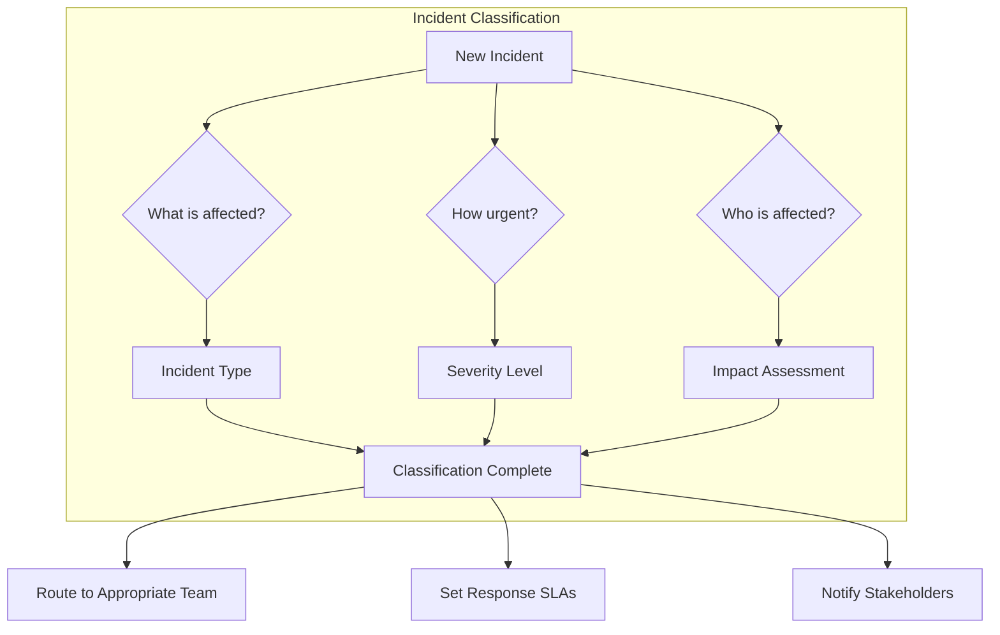
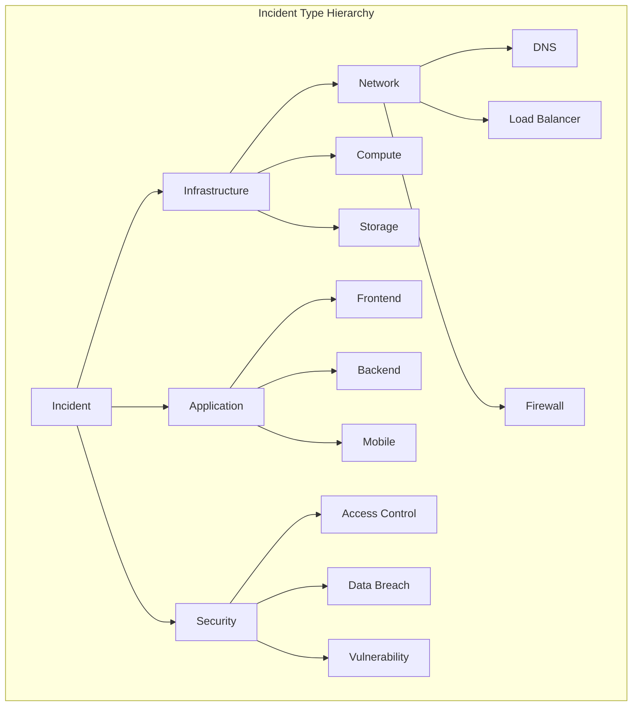
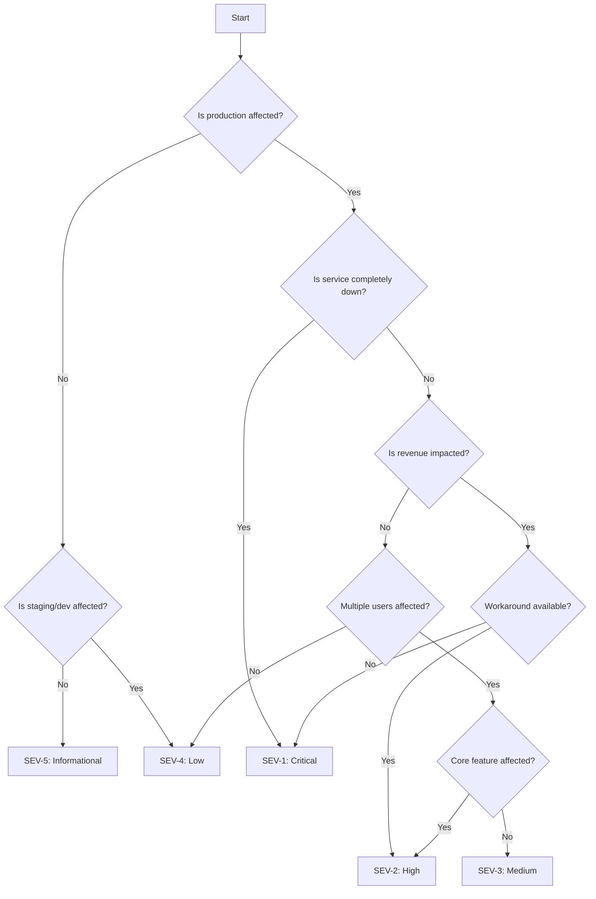
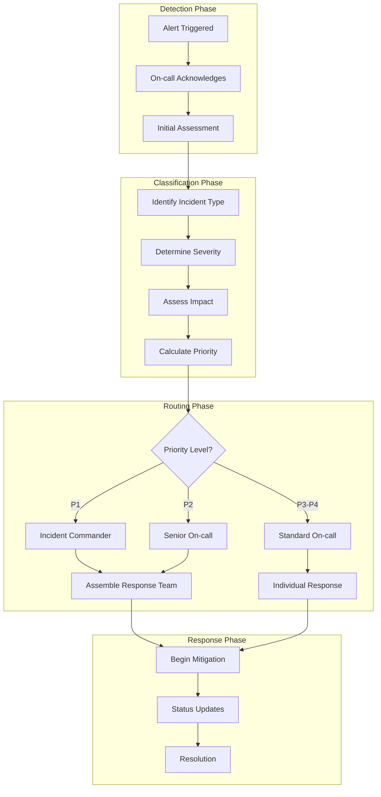
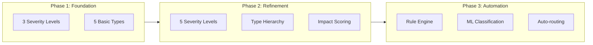
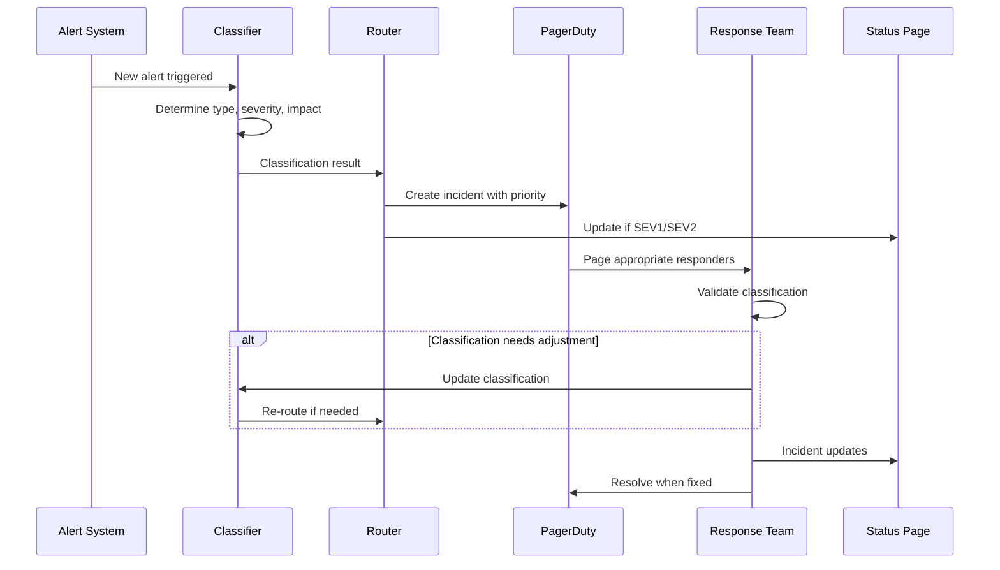

# How to Create Incident Classification

Author: [nawazdhandala](https://github.com/nawazdhandala)

Tags: Incident Management, SRE, Process, Best Practices

Description: Learn how to classify incidents by type, severity, and impact for effective triage and response.

---

Incident classification is the foundation of effective incident management. When an incident occurs, teams need a systematic way to understand its nature, urgency, and required response. Without proper classification, teams waste valuable time during critical moments, struggle to prioritize competing issues, and fail to allocate resources effectively.

This guide walks you through creating a comprehensive incident classification system that scales with your organization.

## Why Incident Classification Matters

A well-designed classification system provides several benefits:

- **Faster Triage**: Responders immediately understand the incident scope and required expertise
- **Consistent Response**: Similar incidents receive similar levels of attention and resources
- **Better Communication**: Stakeholders understand incident status without technical deep-dives
- **Improved Metrics**: Classification enables meaningful analysis of incident patterns
- **Resource Optimization**: Teams can staff appropriately based on historical classification data

## The Three Pillars of Incident Classification

Effective incident classification rests on three interconnected dimensions: type, severity, and impact. Each dimension answers a different question about the incident.



## Incident Types

Incident types categorize incidents by the nature of the problem. This helps route incidents to teams with the right expertise.

### Common Incident Type Categories

| Type | Description | Example |
|------|-------------|---------|
| Infrastructure | Hardware, network, or platform failures | Server crash, network partition |
| Application | Software bugs or configuration errors | Memory leak, null pointer exception |
| Security | Breaches, vulnerabilities, or attacks | DDoS attack, data breach |
| Performance | Degradation without complete failure | High latency, slow queries |
| Data | Data corruption, loss, or integrity issues | Database corruption, sync failures |
| Dependency | Third-party service or API failures | Payment provider outage |
| Capacity | Resource exhaustion | Disk full, connection pool exhausted |

### Incident Type Hierarchy

For larger organizations, a hierarchical type system provides more granular routing:



## Severity Matrix

Severity indicates how urgent the response needs to be. A clear severity matrix removes ambiguity and ensures consistent prioritization.

### Severity Level Definitions

| Severity | Name | Description | Response Time | Example |
|----------|------|-------------|---------------|---------|
| SEV-1 | Critical | Complete service outage affecting all users | Immediate (< 15 min) | Production database down |
| SEV-2 | High | Major feature unavailable or severe degradation | < 30 minutes | Payment processing failing |
| SEV-3 | Medium | Partial impact or workaround available | < 2 hours | Search feature slow |
| SEV-4 | Low | Minor issue with minimal user impact | < 24 hours | Cosmetic UI bug |
| SEV-5 | Informational | No current impact, potential future risk | Next business day | Security advisory |

### Severity Decision Tree

Use this decision tree to consistently assign severity levels:



## Impact Assessment

Impact measures the breadth and depth of an incident's effect on users and business operations.

### Impact Dimensions

Consider these dimensions when assessing impact:

1. **User Count**: How many users are affected?
2. **User Type**: Are these paying customers, enterprise accounts, or free users?
3. **Business Function**: Is this a revenue-generating or critical business process?
4. **Duration**: How long has the incident persisted?
5. **Data Risk**: Is there potential for data loss or exposure?

### Impact Scoring Matrix

| Score | User Impact | Business Impact | Data Risk |
|-------|-------------|-----------------|-----------|
| 5 | All users (100%) | Complete business halt | Data breach confirmed |
| 4 | Most users (> 50%) | Major revenue impact | Data at risk |
| 3 | Significant (10-50%) | Moderate revenue impact | Potential data exposure |
| 2 | Some users (1-10%) | Minor revenue impact | No data risk |
| 1 | Few users (< 1%) | Negligible impact | None |

### Combined Impact Formula

```
Total Impact Score = (User Impact * 0.4) + (Business Impact * 0.4) + (Data Risk * 0.2)
```

This weighted formula emphasizes user and business impact while ensuring data risks are not overlooked.

## Complete Classification Workflow

Here is the complete workflow for classifying an incident:



## Classification Automation

Manual classification works for low-volume environments, but automation becomes essential at scale. Here are examples for automating classification.

### Rule-Based Classification Engine

This Python example shows a rule-based classification engine:

```python
# incident_classifier.py
# A rule-based incident classification engine

from dataclasses import dataclass
from enum import Enum
from typing import List, Dict, Optional
import re


class IncidentType(Enum):
    """Enumeration of incident types for routing"""
    INFRASTRUCTURE = "infrastructure"
    APPLICATION = "application"
    SECURITY = "security"
    PERFORMANCE = "performance"
    DATA = "data"
    DEPENDENCY = "dependency"
    CAPACITY = "capacity"


class Severity(Enum):
    """Severity levels with numeric values for comparison"""
    SEV1 = 1  # Critical
    SEV2 = 2  # High
    SEV3 = 3  # Medium
    SEV4 = 4  # Low
    SEV5 = 5  # Informational


@dataclass
class IncidentClassification:
    """Represents the complete classification of an incident"""
    incident_type: IncidentType
    severity: Severity
    impact_score: float
    priority: int
    routing_team: str
    response_sla_minutes: int


@dataclass
class Alert:
    """Incoming alert data structure"""
    source: str           # Monitoring system that generated the alert
    service: str          # Affected service name
    message: str          # Alert description
    metric_value: float   # Current metric value
    threshold: float      # Threshold that was breached
    affected_users: int   # Estimated affected user count
    is_production: bool   # Production vs staging/dev


class IncidentClassifier:
    """
    Rule-based classifier that determines incident type, severity,
    and impact based on alert characteristics.
    """

    def __init__(self):
        # Define patterns for incident type detection
        # Each pattern maps keywords to incident types
        self.type_patterns: Dict[IncidentType, List[str]] = {
            IncidentType.INFRASTRUCTURE: [
                r"server", r"node", r"network", r"dns", r"load.?balancer",
                r"kubernetes", r"pod", r"container", r"vm", r"instance"
            ],
            IncidentType.APPLICATION: [
                r"exception", r"error.?rate", r"null.?pointer", r"crash",
                r"bug", r"500", r"4\d{2}", r"timeout"
            ],
            IncidentType.SECURITY: [
                r"unauthorized", r"breach", r"attack", r"ddos", r"injection",
                r"vulnerability", r"exploit", r"suspicious"
            ],
            IncidentType.PERFORMANCE: [
                r"latency", r"slow", r"degraded", r"response.?time",
                r"throughput", r"p99", r"p95"
            ],
            IncidentType.DATA: [
                r"corrupt", r"data.?loss", r"integrity", r"replication",
                r"sync", r"backup"
            ],
            IncidentType.DEPENDENCY: [
                r"third.?party", r"external", r"api.?failure", r"vendor",
                r"upstream", r"downstream"
            ],
            IncidentType.CAPACITY: [
                r"disk", r"memory", r"cpu", r"full", r"exhausted",
                r"quota", r"limit"
            ],
        }

        # Response SLAs in minutes for each severity level
        self.sla_matrix = {
            Severity.SEV1: 15,
            Severity.SEV2: 30,
            Severity.SEV3: 120,
            Severity.SEV4: 1440,    # 24 hours
            Severity.SEV5: 2880,    # 48 hours
        }

        # Team routing based on incident type
        self.team_routing = {
            IncidentType.INFRASTRUCTURE: "platform-team",
            IncidentType.APPLICATION: "application-team",
            IncidentType.SECURITY: "security-team",
            IncidentType.PERFORMANCE: "performance-team",
            IncidentType.DATA: "data-team",
            IncidentType.DEPENDENCY: "integrations-team",
            IncidentType.CAPACITY: "platform-team",
        }

    def classify(self, alert: Alert) -> IncidentClassification:
        """
        Main classification method that processes an alert and returns
        a complete classification with routing information.
        """
        # Step 1: Determine incident type from alert content
        incident_type = self._detect_type(alert)

        # Step 2: Calculate severity based on impact factors
        severity = self._calculate_severity(alert)

        # Step 3: Compute impact score using weighted formula
        impact_score = self._calculate_impact(alert)

        # Step 4: Derive priority from severity and impact
        priority = self._calculate_priority(severity, impact_score)

        # Step 5: Determine routing team
        routing_team = self.team_routing[incident_type]

        # Step 6: Get response SLA
        response_sla = self.sla_matrix[severity]

        return IncidentClassification(
            incident_type=incident_type,
            severity=severity,
            impact_score=impact_score,
            priority=priority,
            routing_team=routing_team,
            response_sla_minutes=response_sla
        )

    def _detect_type(self, alert: Alert) -> IncidentType:
        """
        Analyze alert message to determine incident type.
        Uses regex pattern matching against known keywords.
        """
        message_lower = alert.message.lower()
        source_lower = alert.source.lower()
        combined_text = f"{message_lower} {source_lower}"

        # Score each type based on pattern matches
        type_scores: Dict[IncidentType, int] = {}

        for incident_type, patterns in self.type_patterns.items():
            score = 0
            for pattern in patterns:
                if re.search(pattern, combined_text, re.IGNORECASE):
                    score += 1
            type_scores[incident_type] = score

        # Return type with highest score, default to APPLICATION
        if max(type_scores.values()) > 0:
            return max(type_scores, key=type_scores.get)
        return IncidentType.APPLICATION

    def _calculate_severity(self, alert: Alert) -> Severity:
        """
        Determine severity based on production status, user impact,
        and metric threshold breach magnitude.
        """
        # Non-production environments are lower severity
        if not alert.is_production:
            if alert.affected_users > 0:
                return Severity.SEV4
            return Severity.SEV5

        # Calculate breach magnitude (how much over threshold)
        if alert.threshold > 0:
            breach_ratio = alert.metric_value / alert.threshold
        else:
            breach_ratio = 1.0

        # Apply severity rules
        if alert.affected_users > 10000 or breach_ratio > 5.0:
            return Severity.SEV1
        elif alert.affected_users > 1000 or breach_ratio > 2.0:
            return Severity.SEV2
        elif alert.affected_users > 100 or breach_ratio > 1.5:
            return Severity.SEV3
        else:
            return Severity.SEV4

    def _calculate_impact(self, alert: Alert) -> float:
        """
        Calculate weighted impact score from 0.0 to 5.0.
        Uses user count, business criticality, and data risk.
        """
        # User impact scoring (0-5)
        if alert.affected_users >= 10000:
            user_impact = 5.0
        elif alert.affected_users >= 1000:
            user_impact = 4.0
        elif alert.affected_users >= 100:
            user_impact = 3.0
        elif alert.affected_users >= 10:
            user_impact = 2.0
        else:
            user_impact = 1.0

        # Business impact based on service criticality
        # In practice, this would come from a service catalog
        critical_services = ["payments", "auth", "checkout", "api-gateway"]
        if any(svc in alert.service.lower() for svc in critical_services):
            business_impact = 5.0
        else:
            business_impact = 3.0

        # Data risk based on incident type keywords
        data_risk_keywords = ["data", "database", "security", "breach"]
        if any(kw in alert.message.lower() for kw in data_risk_keywords):
            data_risk = 4.0
        else:
            data_risk = 1.0

        # Apply weighted formula
        # User: 40%, Business: 40%, Data: 20%
        return (user_impact * 0.4) + (business_impact * 0.4) + (data_risk * 0.2)

    def _calculate_priority(self, severity: Severity, impact_score: float) -> int:
        """
        Combine severity and impact into a single priority value (P1-P4).
        Lower number = higher priority.
        """
        # Base priority from severity
        severity_priority = {
            Severity.SEV1: 1,
            Severity.SEV2: 2,
            Severity.SEV3: 3,
            Severity.SEV4: 4,
            Severity.SEV5: 4,
        }

        base_priority = severity_priority[severity]

        # Adjust based on impact score
        # High impact can escalate priority by 1 level
        if impact_score >= 4.0 and base_priority > 1:
            return base_priority - 1

        return base_priority


# Example usage demonstrating the classifier
if __name__ == "__main__":
    classifier = IncidentClassifier()

    # Example 1: Critical production database issue
    alert1 = Alert(
        source="PostgreSQL Monitor",
        service="payments-db",
        message="Database connection pool exhausted, all connections in use",
        metric_value=100,
        threshold=80,
        affected_users=15000,
        is_production=True
    )

    result1 = classifier.classify(alert1)
    print(f"Alert 1 Classification:")
    print(f"  Type: {result1.incident_type.value}")
    print(f"  Severity: {result1.severity.name}")
    print(f"  Impact Score: {result1.impact_score:.2f}")
    print(f"  Priority: P{result1.priority}")
    print(f"  Route to: {result1.routing_team}")
    print(f"  Response SLA: {result1.response_sla_minutes} minutes")
    print()

    # Example 2: Minor performance degradation
    alert2 = Alert(
        source="APM",
        service="search-service",
        message="P95 latency increased above threshold",
        metric_value=250,
        threshold=200,
        affected_users=50,
        is_production=True
    )

    result2 = classifier.classify(alert2)
    print(f"Alert 2 Classification:")
    print(f"  Type: {result2.incident_type.value}")
    print(f"  Severity: {result2.severity.name}")
    print(f"  Impact Score: {result2.impact_score:.2f}")
    print(f"  Priority: P{result2.priority}")
    print(f"  Route to: {result2.routing_team}")
    print(f"  Response SLA: {result2.response_sla_minutes} minutes")
```

### Machine Learning Classification

For organizations with historical incident data, ML models can improve classification accuracy:

```python
# ml_classifier.py
# Machine learning based incident classifier using scikit-learn

from sklearn.feature_extraction.text import TfidfVectorizer
from sklearn.ensemble import RandomForestClassifier
from sklearn.pipeline import Pipeline
from sklearn.model_selection import train_test_split
from sklearn.metrics import classification_report
import numpy as np
from typing import List, Tuple
import pickle


class MLIncidentClassifier:
    """
    Machine learning classifier that learns from historical
    incident data to predict incident type and severity.
    """

    def __init__(self):
        # Pipeline for incident type classification
        # Combines TF-IDF text vectorization with Random Forest
        self.type_classifier = Pipeline([
            # Convert text to TF-IDF features
            # ngram_range=(1,2) captures both single words and pairs
            ('tfidf', TfidfVectorizer(
                max_features=5000,
                ngram_range=(1, 2),
                stop_words='english'
            )),
            # Random Forest handles multi-class well
            ('clf', RandomForestClassifier(
                n_estimators=100,
                max_depth=20,
                random_state=42
            ))
        ])

        # Separate pipeline for severity prediction
        self.severity_classifier = Pipeline([
            ('tfidf', TfidfVectorizer(
                max_features=5000,
                ngram_range=(1, 2),
                stop_words='english'
            )),
            ('clf', RandomForestClassifier(
                n_estimators=100,
                max_depth=15,
                random_state=42
            ))
        ])

        self.is_trained = False

    def train(
        self,
        incidents: List[str],
        types: List[str],
        severities: List[str]
    ) -> dict:
        """
        Train both classifiers on historical incident data.

        Args:
            incidents: List of incident descriptions/titles
            types: Corresponding incident types
            severities: Corresponding severity levels

        Returns:
            Dictionary containing training metrics
        """
        # Split data for training and validation
        X_train, X_test, y_type_train, y_type_test, y_sev_train, y_sev_test = \
            train_test_split(
                incidents, types, severities,
                test_size=0.2,
                random_state=42
            )

        # Train type classifier
        print("Training incident type classifier...")
        self.type_classifier.fit(X_train, y_type_train)
        type_predictions = self.type_classifier.predict(X_test)

        # Train severity classifier
        print("Training severity classifier...")
        self.severity_classifier.fit(X_train, y_sev_train)
        severity_predictions = self.severity_classifier.predict(X_test)

        self.is_trained = True

        # Generate evaluation metrics
        return {
            'type_report': classification_report(
                y_type_test, type_predictions, output_dict=True
            ),
            'severity_report': classification_report(
                y_sev_test, severity_predictions, output_dict=True
            )
        }

    def predict(self, incident_description: str) -> Tuple[str, str, float]:
        """
        Predict incident type and severity for a new incident.

        Args:
            incident_description: Text describing the incident

        Returns:
            Tuple of (predicted_type, predicted_severity, confidence)
        """
        if not self.is_trained:
            raise RuntimeError("Classifier must be trained before prediction")

        # Get type prediction with probability
        type_pred = self.type_classifier.predict([incident_description])[0]
        type_proba = max(
            self.type_classifier.predict_proba([incident_description])[0]
        )

        # Get severity prediction with probability
        sev_pred = self.severity_classifier.predict([incident_description])[0]
        sev_proba = max(
            self.severity_classifier.predict_proba([incident_description])[0]
        )

        # Use minimum confidence as overall confidence
        confidence = min(type_proba, sev_proba)

        return type_pred, sev_pred, confidence

    def save_model(self, filepath: str) -> None:
        """Save trained model to disk for production use."""
        with open(filepath, 'wb') as f:
            pickle.dump({
                'type_classifier': self.type_classifier,
                'severity_classifier': self.severity_classifier
            }, f)

    def load_model(self, filepath: str) -> None:
        """Load pre-trained model from disk."""
        with open(filepath, 'rb') as f:
            models = pickle.load(f)
            self.type_classifier = models['type_classifier']
            self.severity_classifier = models['severity_classifier']
            self.is_trained = True


# Example: Training with synthetic data
if __name__ == "__main__":
    # In practice, this data comes from your incident database
    sample_incidents = [
        "Database connection timeout affecting checkout",
        "Memory leak in payment service causing OOM",
        "DDoS attack detected on API gateway",
        "Slow response times on search endpoint",
        "Data replication lag between primary and replica",
        "Third-party payment API returning 503",
        "Disk usage at 95% on logging server",
        "SSL certificate expiring in 24 hours",
        "Kubernetes pod crashloopbackoff in production",
        "User authentication failing intermittently"
    ]

    sample_types = [
        "infrastructure", "application", "security",
        "performance", "data", "dependency",
        "capacity", "security", "infrastructure", "application"
    ]

    sample_severities = [
        "SEV1", "SEV2", "SEV1", "SEV3", "SEV2",
        "SEV2", "SEV3", "SEV4", "SEV2", "SEV2"
    ]

    # Note: In production, you need much more training data
    classifier = MLIncidentClassifier()

    print("Training with sample data...")
    print("(Production use requires hundreds/thousands of examples)")

    # This would work with sufficient real data
    # metrics = classifier.train(sample_incidents, sample_types, sample_severities)
    # print(f"Type Classification Accuracy: {metrics['type_report']['accuracy']:.2%}")
```

### Webhook Integration for Automated Classification

Integrate classification with your alerting pipeline:

```python
# classification_webhook.py
# Flask webhook endpoint for real-time incident classification

from flask import Flask, request, jsonify
from incident_classifier import IncidentClassifier, Alert
import logging
from datetime import datetime
import json

# Configure logging for audit trail
logging.basicConfig(
    level=logging.INFO,
    format='%(asctime)s - %(levelname)s - %(message)s'
)
logger = logging.getLogger(__name__)

app = Flask(__name__)

# Initialize the classifier once at startup
classifier = IncidentClassifier()


@app.route('/classify', methods=['POST'])
def classify_incident():
    """
    Webhook endpoint that receives alerts and returns classification.

    Expected payload:
    {
        "source": "prometheus",
        "service": "api-gateway",
        "message": "High error rate detected",
        "metric_value": 15.5,
        "threshold": 5.0,
        "affected_users": 5000,
        "is_production": true
    }
    """
    try:
        # Parse incoming alert payload
        data = request.get_json()

        # Validate required fields
        required_fields = [
            'source', 'service', 'message',
            'metric_value', 'threshold', 'affected_users'
        ]

        for field in required_fields:
            if field not in data:
                return jsonify({
                    'error': f'Missing required field: {field}'
                }), 400

        # Create Alert object from payload
        alert = Alert(
            source=data['source'],
            service=data['service'],
            message=data['message'],
            metric_value=float(data['metric_value']),
            threshold=float(data['threshold']),
            affected_users=int(data['affected_users']),
            is_production=data.get('is_production', True)
        )

        # Perform classification
        classification = classifier.classify(alert)

        # Build response with classification details
        response = {
            'classification': {
                'incident_type': classification.incident_type.value,
                'severity': classification.severity.name,
                'impact_score': round(classification.impact_score, 2),
                'priority': f'P{classification.priority}',
                'routing_team': classification.routing_team,
                'response_sla_minutes': classification.response_sla_minutes
            },
            'original_alert': data,
            'classified_at': datetime.utcnow().isoformat() + 'Z'
        }

        # Log for audit purposes
        logger.info(
            f"Classified incident: {classification.severity.name} "
            f"{classification.incident_type.value} -> {classification.routing_team}"
        )

        return jsonify(response), 200

    except Exception as e:
        logger.error(f"Classification error: {str(e)}")
        return jsonify({'error': str(e)}), 500


@app.route('/health', methods=['GET'])
def health_check():
    """Health check endpoint for load balancers."""
    return jsonify({'status': 'healthy'}), 200


if __name__ == '__main__':
    # Run with gunicorn in production:
    # gunicorn -w 4 -b 0.0.0.0:8080 classification_webhook:app
    app.run(host='0.0.0.0', port=8080, debug=False)
```

## Best Practices for Incident Classification

### 1. Start Simple, Iterate

Begin with basic categories and expand as needed:



### 2. Document Classification Criteria

Create clear, accessible documentation:

- Define each type and severity with specific examples
- Include edge cases and how to handle them
- Provide decision trees for common scenarios
- Update documentation based on retrospective feedback

### 3. Review and Calibrate Regularly

Schedule quarterly reviews to assess:

- Are incidents being classified consistently?
- Do the severity levels still make sense?
- Are new incident types emerging?
- Is the automation accurate?

### 4. Train Your Team

Ensure everyone understands the classification system:

- Include classification training in onboarding
- Run tabletop exercises with classification scenarios
- Review classification decisions in retrospectives
- Share examples of correct and incorrect classifications

## Integrating Classification with Incident Response

Classification flows directly into your incident response process:



## Measuring Classification Effectiveness

Track these metrics to evaluate your classification system:

| Metric | Description | Target |
|--------|-------------|--------|
| Classification Accuracy | Percentage of correctly classified incidents | > 90% |
| Time to Classify | Average time from alert to classification | < 2 minutes |
| Reclassification Rate | Incidents needing manual correction | < 10% |
| Response SLA Compliance | Incidents responded within SLA | > 95% |
| Routing Accuracy | Incidents reaching correct team first | > 85% |

## Conclusion

Effective incident classification transforms chaotic incident response into a structured, repeatable process. By defining clear incident types, establishing a severity matrix, and implementing impact assessment, teams can triage incidents quickly and consistently.

Start with manual classification to understand your incident patterns, then progressively automate as your process matures. Remember that classification is a means to an end: faster response times, reduced impact, and better outcomes for your users.

The key is continuous improvement. Review your classification decisions regularly, adjust thresholds based on real-world experience, and ensure your entire team understands and applies the classification system consistently.

## Further Reading

- [Effective Incident Postmortem Templates](https://oneuptime.com/blog/post/2025-09-09-effective-incident-postmortem-templates-ready-to-use-examples/view) - Learn how to document and learn from incidents
- [SRE Best Practices](https://oneuptime.com/blog/post/2025-11-28-sre-best-practices/view) - Comprehensive guide to site reliability engineering
- [What is MTTR, MTTD, MTBF and More](https://oneuptime.com/blog/post/2025-11-28-sre-metrics-to-track/view) - Understanding incident metrics
