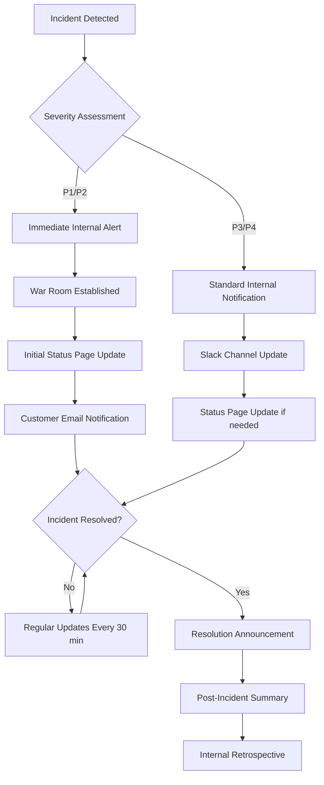

# How to Create Incident Communication Templates

Author: [nawazdhandala](https://github.com/nawazdhandala)

Tags: SRE, IncidentManagement, Communication, Templates

Description: Learn how to build effective incident communication templates that keep stakeholders informed during outages and service disruptions.

---

When an incident strikes, clear and timely communication can make the difference between a manageable situation and a full-blown crisis. Having pre-built communication templates ready ensures your team can focus on resolving the issue while stakeholders stay informed. This guide walks you through creating comprehensive incident communication templates for both internal teams and external customers.

## Why Incident Communication Templates Matter

During an incident, every minute counts. Without prepared templates, teams often:

- Waste valuable time crafting messages from scratch
- Provide inconsistent information across channels
- Forget critical details under pressure
- Miss key stakeholders in the communication chain

Templates solve these problems by providing a structured framework that anyone on your team can use to deliver professional, consistent updates.

## Communication Template Structure

Every incident communication should follow a consistent structure. Here is a base template that you can adapt for different audiences:

```yaml
# incident-communication-template.yaml
# Base structure for all incident communications

template:
  metadata:
    incident_id: "INC-XXXX"
    severity: "P1|P2|P3|P4"
    status: "investigating|identified|monitoring|resolved"
    created_at: "2026-01-30T10:00:00Z"
    updated_at: "2026-01-30T10:30:00Z"

  content:
    headline: "Brief description of the issue"
    current_status: "What we know right now"
    impact: "Who and what is affected"
    actions: "What we are doing about it"
    next_update: "When stakeholders can expect the next update"

  distribution:
    internal:
      - engineering
      - support
      - leadership
    external:
      - status_page
      - email
      - social_media
```

## Communication Flow During Incidents

Understanding when and how to communicate is just as important as what you communicate. The following diagram illustrates the typical flow of incident communications:



## Internal vs External Messaging

Internal and external communications serve different purposes and require different levels of detail. Here is a comparison and templates for each:

### Internal Communication Template

Internal messages should be detailed and technical, helping your team understand the full scope of the issue:

```markdown
# Internal Incident Update Template

**Incident ID:** INC-2026-0130-001
**Severity:** P1 - Critical
**Status:** Identified
**Incident Commander:** @jane.doe
**Time of Detection:** 2026-01-30 10:15 UTC

## Current Situation

The database primary node in us-east-1 is experiencing high CPU utilization
(95%+) causing query timeouts across all services.

## Technical Details

- Affected services: API Gateway, User Service, Payment Service
- Error rate: 45% of requests returning 5xx
- Latency: p99 increased from 200ms to 8s
- Root cause hypothesis: Runaway query from batch job deployment at 10:00 UTC

## Actions Taken

1. [10:20] Identified spike in DB connections from batch-processor service
2. [10:25] Killed long-running queries (PIDs: 4521, 4522, 4523)
3. [10:28] Scaled batch-processor replicas to 0
4. [10:30] CPU utilization dropping, currently at 75%

## Next Steps

- [ ] Continue monitoring DB recovery
- [ ] Review batch job query efficiency
- [ ] Implement query timeout guards

## Communication Log

| Time  | Channel       | Audience    | Message Sent |
|-------|---------------|-------------|--------------|
| 10:18 | Slack         | Engineering | Initial alert|
| 10:22 | Status Page   | Customers   | Investigating|
| 10:30 | Email         | Enterprise  | Update sent  |

**Next Update:** 11:00 UTC or sooner if status changes
```

### External Communication Template

External messages should be clear, empathetic, and free of technical jargon:

```markdown
# External Status Page Update Template

## Service Degradation - API Performance Issues

**Status:** Identified
**Posted:** January 30, 2026 at 10:22 AM UTC

### What is happening

We are currently experiencing performance issues affecting our API services.
Some requests may be slower than usual or may fail temporarily.

### Who is affected

Users making API calls may experience:
- Increased response times
- Intermittent timeout errors
- Delayed data processing

### What we are doing

Our engineering team has identified the cause and is actively working on
a fix. We expect to have this resolved within the next 30 minutes.

### Workarounds

If you experience failures, please retry your request after a brief wait.
Our system will automatically retry failed operations once service is restored.

**Next update in 30 minutes or when resolved.**

---

*Questions? Contact support@yourcompany.com*
```

## Status Page Update Templates

Status pages are often the first place customers check during an incident. Here are templates for each stage of an incident:

```python
# status_page_templates.py
# Templates for automated status page updates

from dataclasses import dataclass
from datetime import datetime
from enum import Enum
from typing import Optional

class IncidentStatus(Enum):
    INVESTIGATING = "investigating"
    IDENTIFIED = "identified"
    MONITORING = "monitoring"
    RESOLVED = "resolved"

@dataclass
class StatusPageUpdate:
    """
    Represents a single status page update.

    Attributes:
        status: Current incident status
        title: Brief incident title (max 100 chars)
        body: Detailed update message
        affected_components: List of affected service names
        timestamp: When this update was created
    """
    status: IncidentStatus
    title: str
    body: str
    affected_components: list[str]
    timestamp: datetime = None

    def __post_init__(self):
        if self.timestamp is None:
            self.timestamp = datetime.utcnow()

# Template definitions for each incident phase
TEMPLATES = {
    IncidentStatus.INVESTIGATING: StatusPageUpdate(
        status=IncidentStatus.INVESTIGATING,
        title="Investigating {service} Issues",
        body="""We are currently investigating reports of {issue_type}
with {service}. Our team is actively looking into this matter.

Affected functionality:
{affected_list}

We will provide an update within 30 minutes.""",
        affected_components=[]
    ),

    IncidentStatus.IDENTIFIED: StatusPageUpdate(
        status=IncidentStatus.IDENTIFIED,
        title="Issue Identified - {service}",
        body="""We have identified the cause of the {issue_type} affecting
{service}. Our engineering team is implementing a fix.

What we found: {root_cause_summary}

Expected resolution: {eta}

We apologize for any inconvenience this may cause.""",
        affected_components=[]
    ),

    IncidentStatus.MONITORING: StatusPageUpdate(
        status=IncidentStatus.MONITORING,
        title="Fix Deployed - Monitoring {service}",
        body="""We have deployed a fix for the {issue_type} affecting {service}.
We are now monitoring the system to ensure stability.

Services should be returning to normal operation. If you continue to
experience issues, please contact our support team.

We will provide a final update once we confirm full resolution.""",
        affected_components=[]
    ),

    IncidentStatus.RESOLVED: StatusPageUpdate(
        status=IncidentStatus.RESOLVED,
        title="Resolved - {service} {issue_type}",
        body="""The {issue_type} affecting {service} has been resolved.
All systems are operating normally.

Duration: {duration}
Impact: {impact_summary}

We apologize for any inconvenience caused. A detailed post-incident
report will be published within 48 hours.

Thank you for your patience.""",
        affected_components=[]
    )
}

def generate_update(
    status: IncidentStatus,
    service: str,
    issue_type: str,
    affected_components: list[str],
    **kwargs
) -> StatusPageUpdate:
    """
    Generate a status page update from a template.

    Args:
        status: Current incident status phase
        service: Name of the affected service
        issue_type: Type of issue (e.g., "performance degradation")
        affected_components: List of affected component names
        **kwargs: Additional template variables

    Returns:
        StatusPageUpdate object ready for posting

    Example:
        update = generate_update(
            status=IncidentStatus.INVESTIGATING,
            service="API Gateway",
            issue_type="increased latency",
            affected_components=["api", "webhooks"],
            affected_list="- API requests\\n- Webhook deliveries"
        )
    """
    template = TEMPLATES[status]

    # Build the context for string formatting
    context = {
        "service": service,
        "issue_type": issue_type,
        **kwargs
    }

    return StatusPageUpdate(
        status=status,
        title=template.title.format(**context),
        body=template.body.format(**context),
        affected_components=affected_components
    )
```

## Executive Summary Templates

Leadership needs concise, business-focused updates. Here is a template designed for executive stakeholders:

```markdown
# Executive Incident Summary Template

## Incident Summary: [Brief Title]

**Date:** January 30, 2026
**Duration:** 2 hours 15 minutes (10:15 - 12:30 UTC)
**Severity:** P1 - Critical

### Business Impact

| Metric                  | Value           |
|-------------------------|-----------------|
| Affected Customers      | ~12,000         |
| Failed Transactions     | 847             |
| Estimated Revenue Impact| $23,400         |
| SLA Credits Owed        | $4,200          |

### Timeline Summary

- **10:15** - Issue detected by monitoring
- **10:22** - Customer-facing status page updated
- **10:45** - Root cause identified
- **11:30** - Fix deployed to production
- **12:30** - Full service restoration confirmed

### Root Cause (Non-Technical)

A scheduled data processing job consumed more system resources than expected,
causing our API services to slow down and some requests to fail.

### Customer Communication

- Status page updated 4 times during incident
- 127 enterprise customers received direct email updates
- Support team handled 89 incoming tickets
- Social media response posted at 10:30 UTC

### Remediation Actions

1. **Immediate:** Resource limits added to batch processing jobs
2. **This Week:** Enhanced monitoring alerts for database performance
3. **This Month:** Architecture review of batch processing system

### Lessons Learned

- Detection was fast (automated monitoring worked well)
- Initial communication could have been faster (8 min delay)
- Enterprise customer notification process needs automation

---

*Full technical post-mortem available in Confluence: [Link]*
*Questions: Contact incident-commander@yourcompany.com*
```

## Automated Communication System

For larger organizations, automating parts of your incident communication is essential. Here is a practical implementation:

```typescript
// incident-communicator.ts
// Automated incident communication system

import { WebClient } from "@slack/web-api";

// Define types for our communication system
interface Incident {
  id: string;
  severity: "P1" | "P2" | "P3" | "P4";
  title: string;
  description: string;
  status: "investigating" | "identified" | "monitoring" | "resolved";
  affectedServices: string[];
  startTime: Date;
  resolvedTime?: Date;
}

interface CommunicationConfig {
  // Channels for each severity level
  slackChannels: Record<string, string[]>;
  // Email distribution lists
  emailLists: Record<string, string[]>;
  // Status page component IDs
  statusPageComponents: Record<string, string>;
}

// Configuration for different severity levels
const CONFIG: CommunicationConfig = {
  slackChannels: {
    P1: ["#incidents-critical", "#engineering-all", "#leadership"],
    P2: ["#incidents-critical", "#engineering-all"],
    P3: ["#incidents", "#engineering-oncall"],
    P4: ["#incidents"],
  },
  emailLists: {
    P1: ["engineering@company.com", "leadership@company.com"],
    P2: ["engineering@company.com"],
    P3: ["oncall@company.com"],
    P4: [],
  },
  statusPageComponents: {
    api: "component_abc123",
    dashboard: "component_def456",
    webhooks: "component_ghi789",
  },
};

/**
 * Main class for handling incident communications.
 * Coordinates messages across Slack, email, and status page.
 */
class IncidentCommunicator {
  private slack: WebClient;
  private config: CommunicationConfig;

  constructor(slackToken: string, config: CommunicationConfig) {
    this.slack = new WebClient(slackToken);
    this.config = config;
  }

  /**
   * Send the initial incident notification to all relevant channels.
   * This should be called as soon as an incident is declared.
   */
  async sendInitialNotification(incident: Incident): Promise<void> {
    const channels = this.config.slackChannels[incident.severity];

    // Build the Slack message with incident details
    const message = this.buildSlackMessage(incident);

    // Send to all configured channels in parallel
    const promises = channels.map((channel) =>
      this.slack.chat.postMessage({
        channel,
        text: message.fallback,
        blocks: message.blocks,
      })
    );

    await Promise.all(promises);

    // Log for audit trail
    console.log(`[${incident.id}] Initial notification sent to ${channels.length} channels`);
  }

  /**
   * Build a formatted Slack message for the incident.
   * Uses Block Kit for rich formatting.
   */
  private buildSlackMessage(incident: Incident): { fallback: string; blocks: any[] } {
    const severityEmoji = {
      P1: ":rotating_light:",
      P2: ":warning:",
      P3: ":large_yellow_circle:",
      P4: ":information_source:",
    };

    const statusColor = {
      investigating: "#ff0000",
      identified: "#ff9900",
      monitoring: "#ffff00",
      resolved: "#00ff00",
    };

    return {
      fallback: `[${incident.severity}] ${incident.title}`,
      blocks: [
        {
          type: "header",
          text: {
            type: "plain_text",
            text: `${severityEmoji[incident.severity]} ${incident.severity} Incident: ${incident.title}`,
          },
        },
        {
          type: "section",
          fields: [
            {
              type: "mrkdwn",
              text: `*Status:*\n${incident.status.charAt(0).toUpperCase() + incident.status.slice(1)}`,
            },
            {
              type: "mrkdwn",
              text: `*Incident ID:*\n${incident.id}`,
            },
            {
              type: "mrkdwn",
              text: `*Affected Services:*\n${incident.affectedServices.join(", ")}`,
            },
            {
              type: "mrkdwn",
              text: `*Started:*\n<!date^${Math.floor(incident.startTime.getTime() / 1000)}^{time}|${incident.startTime.toISOString()}>`,
            },
          ],
        },
        {
          type: "section",
          text: {
            type: "mrkdwn",
            text: `*Description:*\n${incident.description}`,
          },
        },
        {
          type: "actions",
          elements: [
            {
              type: "button",
              text: { type: "plain_text", text: "View Status Page" },
              url: `https://status.company.com/incidents/${incident.id}`,
            },
            {
              type: "button",
              text: { type: "plain_text", text: "Join War Room" },
              url: `https://meet.company.com/incident-${incident.id}`,
            },
          ],
        },
      ],
    };
  }

  /**
   * Generate a customer-facing status page update.
   * Removes technical jargon and focuses on impact and actions.
   */
  generateStatusPageUpdate(incident: Incident): string {
    const templates = {
      investigating: `We are currently investigating an issue affecting ${incident.affectedServices.join(" and ")}. Our team is actively looking into this and we will provide updates as we learn more.`,

      identified: `We have identified the cause of the issue affecting ${incident.affectedServices.join(" and ")}. Our team is working on a fix and we expect to have this resolved soon.`,

      monitoring: `A fix has been deployed for the issue affecting ${incident.affectedServices.join(" and ")}. We are monitoring the situation to ensure stability. Services should be returning to normal.`,

      resolved: `The issue affecting ${incident.affectedServices.join(" and ")} has been resolved. All services are operating normally. We apologize for any inconvenience caused.`,
    };

    return templates[incident.status];
  }
}

// Example usage
async function main() {
  const communicator = new IncidentCommunicator(
    process.env.SLACK_TOKEN!,
    CONFIG
  );

  const incident: Incident = {
    id: "INC-2026-0130-001",
    severity: "P1",
    title: "API Gateway Latency Spike",
    description: "Users experiencing slow API responses and timeouts",
    status: "investigating",
    affectedServices: ["API Gateway", "Webhooks"],
    startTime: new Date(),
  };

  await communicator.sendInitialNotification(incident);
}
```

## Communication Timing Guidelines

Knowing when to communicate is as important as what to communicate:

```mermaid
gantt
    title Incident Communication Timeline
    dateFormat HH:mm
    axisFormat %H:%M

    section Detection
    Incident Detected           :milestone, m1, 10:00, 0m

    section Internal
    Alert Engineering Team      :active, internal1, 10:00, 5m
    Establish War Room          :internal2, after internal1, 10m
    Leadership Briefing         :internal3, 10:20, 10m

    section External
    Initial Status Page Update  :crit, external1, 10:15, 5m
    Customer Email (P1 only)    :external2, 10:25, 10m
    Social Media Update         :external3, 10:30, 5m

    section Ongoing
    Regular Updates (30 min)    :ongoing1, 10:30, 120m
```



## Best Practices Checklist

Use this checklist when preparing your incident communication templates:

```yaml
# incident-communication-checklist.yaml

preparation:
  - Define severity levels and their communication requirements
  - Create templates for each severity level
  - Identify all stakeholder groups
  - Set up distribution lists and channels
  - Configure automated alerting tools
  - Train team members on using templates

during_incident:
  - Acknowledge the incident within 5 minutes
  - Post initial status page update within 15 minutes
  - Assign a dedicated communication lead
  - Provide updates at least every 30 minutes
  - Keep technical details in internal channels
  - Use simple language for customer communications

post_incident:
  - Send resolution notification to all channels
  - Provide incident duration and impact summary
  - Commit to follow-up post-mortem
  - Thank customers for their patience
  - Schedule internal retrospective
  - Update templates based on lessons learned
```

## Conclusion

Effective incident communication templates are a critical component of your incident management process. By preparing templates in advance, you ensure that your team can communicate quickly and consistently when it matters most.

Remember these key principles:

1. **Prepare before incidents happen** - Templates should be ready before you need them
2. **Tailor messages to your audience** - Technical details for engineers, business impact for executives, empathy for customers
3. **Automate where possible** - Use tools to speed up distribution and ensure nothing is missed
4. **Review and improve** - Update your templates based on lessons learned from each incident

With well-designed templates and clear processes, your team can maintain stakeholder trust even during the most challenging outages.

---

*Looking for a platform that handles incident communication automatically? [OneUptime](https://oneuptime.com) provides built-in status pages, automated notifications, and customizable templates to streamline your incident communication workflow.*
