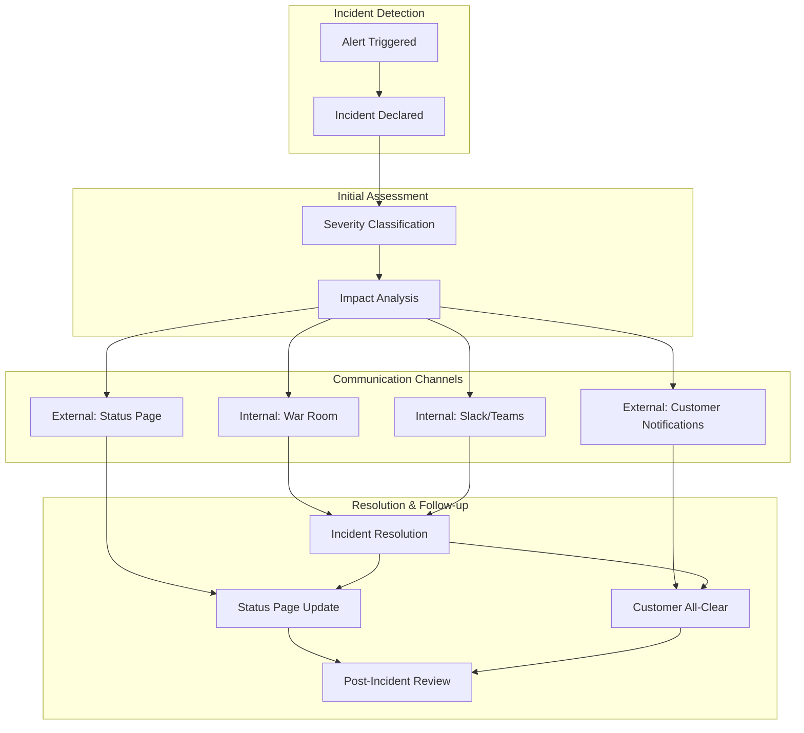
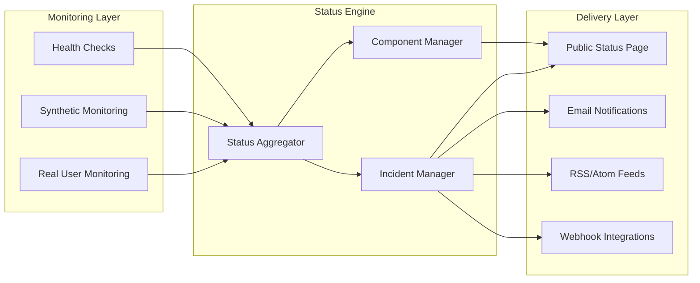
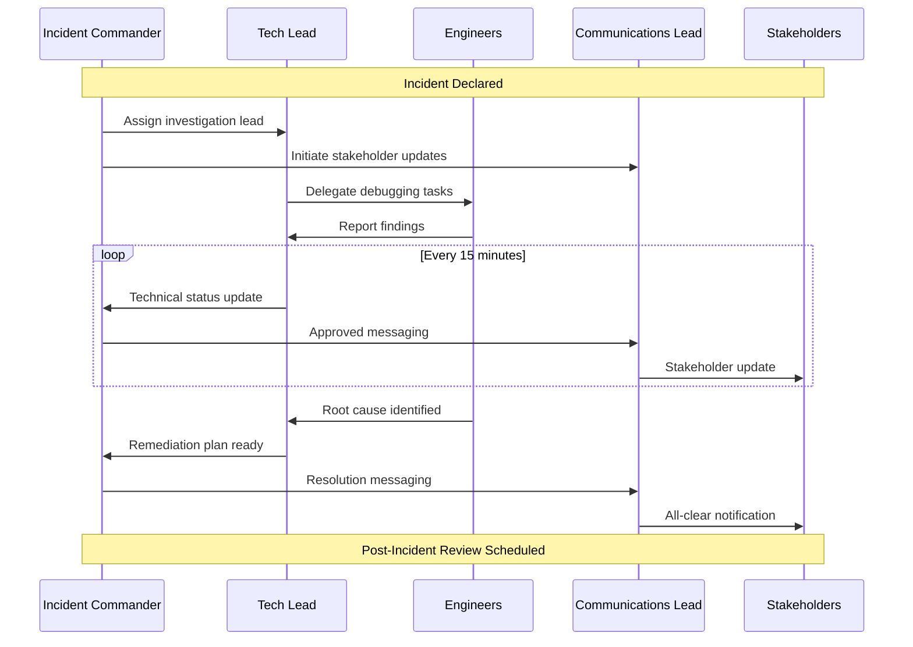
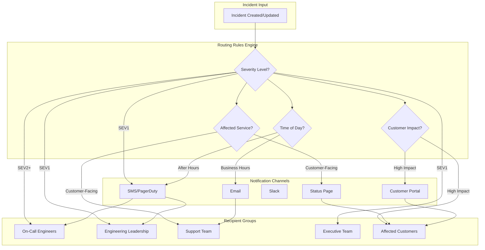

# How to Build Incident Communication

Author: [nawazdhandala](https://github.com/nawazdhandala)

Tags: Incident Management, SRE, Communication, Best Practices

Description: Learn how to communicate effectively during incidents with internal teams and external stakeholders.

---

When systems fail, clear communication becomes just as critical as technical remediation. Organizations that excel at incident response understand that keeping stakeholders informed reduces confusion, maintains trust, and accelerates resolution. This guide explores how to build robust incident communication strategies that serve both internal teams and external customers.

## The Anatomy of Incident Communication

Effective incident communication operates on multiple channels simultaneously. Each audience requires different levels of detail, timing, and tone.



## Understanding Your Audiences

Before diving into templates and tools, identify who needs to know what during an incident.

### Internal Stakeholders

- **Engineering Teams**: Need technical details, runbooks, and real-time debugging information
- **Support Teams**: Require customer-facing talking points and estimated timelines
- **Leadership**: Want business impact summaries and high-level status updates
- **Legal/Compliance**: May need involvement for data breaches or regulatory incidents

### External Stakeholders

- **Customers**: Expect honest, timely updates without excessive technical jargon
- **Partners**: Need to understand integration impacts
- **Media/Public**: Require carefully crafted statements for major incidents

## Building Your Status Page Strategy

A well-designed status page serves as the single source of truth for external communication. It reduces support ticket volume and demonstrates transparency.

### Status Page Architecture



### Automated Status Updates with Code

Here is a Python example that demonstrates how to automatically update your status page based on monitoring data:

```python
"""
Automated Status Page Updater

This module connects monitoring systems to status page updates,
ensuring customers receive timely information about service health.
"""

import requests
from datetime import datetime
from enum import Enum
from typing import Optional
from dataclasses import dataclass


class ComponentStatus(Enum):
    """
    Status levels for service components.
    These map to standard status page conventions.
    """
    OPERATIONAL = "operational"
    DEGRADED = "degraded_performance"
    PARTIAL_OUTAGE = "partial_outage"
    MAJOR_OUTAGE = "major_outage"
    MAINTENANCE = "under_maintenance"


class IncidentSeverity(Enum):
    """
    Incident severity levels that determine
    communication urgency and stakeholder notification.
    """
    SEV1 = "critical"      # Complete service outage
    SEV2 = "major"         # Significant feature unavailable
    SEV3 = "minor"         # Degraded performance
    SEV4 = "informational" # Minimal customer impact


@dataclass
class IncidentUpdate:
    """
    Represents a single update to an ongoing incident.
    Each update should provide new information to stakeholders.
    """
    status: str           # investigating, identified, monitoring, resolved
    message: str          # Customer-facing update message
    timestamp: datetime   # When this update was created
    internal_notes: str   # Notes visible only to internal teams


class StatusPageClient:
    """
    Client for managing status page updates.

    This class provides methods to:
    - Update component status based on monitoring data
    - Create and manage incident communications
    - Send subscriber notifications
    """

    def __init__(self, api_key: str, page_id: str, base_url: str = "https://api.statuspage.io/v1"):
        """
        Initialize the status page client.

        Args:
            api_key: Your status page API key
            page_id: The unique identifier for your status page
            base_url: API endpoint (defaults to standard StatusPage.io)
        """
        self.api_key = api_key
        self.page_id = page_id
        self.base_url = base_url
        self.headers = {
            "Authorization": f"OAuth {api_key}",
            "Content-Type": "application/json"
        }

    def update_component_status(
        self,
        component_id: str,
        status: ComponentStatus,
        description: Optional[str] = None
    ) -> dict:
        """
        Update the status of a specific component.

        This method should be called when monitoring detects
        a change in service health. It updates the public
        status page immediately.

        Args:
            component_id: Unique identifier for the component
            status: New status level for the component
            description: Optional description of current state

        Returns:
            API response containing updated component data
        """
        endpoint = f"{self.base_url}/pages/{self.page_id}/components/{component_id}"

        payload = {
            "component": {
                "status": status.value
            }
        }

        # Add description if provided
        if description:
            payload["component"]["description"] = description

        response = requests.patch(endpoint, json=payload, headers=self.headers)
        response.raise_for_status()

        return response.json()

    def create_incident(
        self,
        name: str,
        severity: IncidentSeverity,
        message: str,
        affected_components: list[str],
        notify_subscribers: bool = True
    ) -> dict:
        """
        Create a new incident on the status page.

        This method creates a public incident record and optionally
        notifies all subscribers. Use this when an issue requires
        customer communication.

        Args:
            name: Brief, descriptive incident title
            severity: Severity level determining notification urgency
            message: Initial customer-facing status message
            affected_components: List of component IDs impacted
            notify_subscribers: Whether to send email/webhook notifications

        Returns:
            API response containing the created incident data
        """
        endpoint = f"{self.base_url}/pages/{self.page_id}/incidents"

        # Build component status updates
        # Each affected component gets marked appropriately
        component_ids = {
            comp_id: self._severity_to_component_status(severity).value
            for comp_id in affected_components
        }

        payload = {
            "incident": {
                "name": name,
                "status": "investigating",
                "impact_override": severity.value,
                "body": message,
                "component_ids": component_ids,
                "deliver_notifications": notify_subscribers
            }
        }

        response = requests.post(endpoint, json=payload, headers=self.headers)
        response.raise_for_status()

        return response.json()

    def post_incident_update(
        self,
        incident_id: str,
        status: str,
        message: str,
        notify_subscribers: bool = True
    ) -> dict:
        """
        Post an update to an existing incident.

        Regular updates keep customers informed and reduce
        support ticket volume. Aim for updates every 30 minutes
        during active incidents.

        Args:
            incident_id: The incident to update
            status: New status (investigating/identified/monitoring/resolved)
            message: Customer-facing update message
            notify_subscribers: Whether to send notifications

        Returns:
            API response with updated incident data
        """
        endpoint = f"{self.base_url}/pages/{self.page_id}/incidents/{incident_id}"

        payload = {
            "incident": {
                "status": status,
                "body": message,
                "deliver_notifications": notify_subscribers
            }
        }

        response = requests.patch(endpoint, json=payload, headers=self.headers)
        response.raise_for_status()

        return response.json()

    def _severity_to_component_status(self, severity: IncidentSeverity) -> ComponentStatus:
        """
        Map incident severity to appropriate component status.

        This ensures consistency between incident severity
        and how components are displayed on the status page.
        """
        mapping = {
            IncidentSeverity.SEV1: ComponentStatus.MAJOR_OUTAGE,
            IncidentSeverity.SEV2: ComponentStatus.PARTIAL_OUTAGE,
            IncidentSeverity.SEV3: ComponentStatus.DEGRADED,
            IncidentSeverity.SEV4: ComponentStatus.OPERATIONAL
        }
        return mapping.get(severity, ComponentStatus.DEGRADED)


# Example usage demonstrating the complete workflow
if __name__ == "__main__":
    # Initialize the client with your credentials
    client = StatusPageClient(
        api_key="your-api-key-here",
        page_id="your-page-id-here"
    )

    # Create an incident when issues are detected
    incident = client.create_incident(
        name="Elevated API Response Times",
        severity=IncidentSeverity.SEV3,
        message=(
            "We are investigating reports of slower than normal "
            "API response times. Our team is actively looking into "
            "the cause. We will provide updates as we learn more."
        ),
        affected_components=["api-component-id"],
        notify_subscribers=True
    )

    print(f"Created incident: {incident['id']}")
```

## War Room Communication

During major incidents, establishing a dedicated war room (virtual or physical) ensures focused collaboration. The key is structured communication that does not impede technical work.

### War Room Communication Flow



### Incident Commander Responsibilities

The Incident Commander (IC) serves as the coordination point for all communication. Their responsibilities include:

1. **Declaring incident severity** and escalating as needed
2. **Assigning roles** to team members
3. **Approving external communications** before publication
4. **Maintaining the incident timeline** for post-mortem review
5. **Calling for help** when additional resources are needed

### Automated War Room Setup

Here is a script that automates war room creation when incidents are declared:

```python
"""
War Room Automation

Automatically creates and configures communication channels
when incidents are declared. Reduces setup time and ensures
consistent incident response procedures.
"""

import os
from datetime import datetime
from typing import Optional
from dataclasses import dataclass, field
from slack_sdk import WebClient
from slack_sdk.errors import SlackApiError


@dataclass
class IncidentContext:
    """
    Contains all relevant context for an incident.
    This data is used to configure war room channels
    and populate initial messages.
    """
    incident_id: str
    title: str
    severity: str
    description: str
    affected_services: list[str]
    declared_by: str
    declared_at: datetime = field(default_factory=datetime.utcnow)

    @property
    def channel_name(self) -> str:
        """
        Generate a standardized channel name for this incident.
        Format: inc-YYYYMMDD-<severity>-<short-id>
        """
        date_str = self.declared_at.strftime("%Y%m%d")
        short_id = self.incident_id[:8]
        return f"inc-{date_str}-{self.severity.lower()}-{short_id}"


class WarRoomManager:
    """
    Manages war room creation and configuration.

    This class handles:
    - Creating dedicated Slack channels for incidents
    - Inviting appropriate team members based on severity
    - Posting initial context and runbook links
    - Setting up recurring status update reminders
    """

    def __init__(self, slack_token: str):
        """
        Initialize the war room manager.

        Args:
            slack_token: Slack bot token with channel creation permissions
        """
        self.client = WebClient(token=slack_token)

        # Define escalation contacts by severity level
        # These user IDs should be configured for your organization
        self.escalation_contacts = {
            "sev1": ["@oncall-primary", "@oncall-secondary", "@engineering-lead", "@vp-engineering"],
            "sev2": ["@oncall-primary", "@oncall-secondary", "@engineering-lead"],
            "sev3": ["@oncall-primary", "@oncall-secondary"],
            "sev4": ["@oncall-primary"]
        }

        # Runbook locations for different service areas
        self.runbooks = {
            "api": "https://wiki.company.com/runbooks/api-incidents",
            "database": "https://wiki.company.com/runbooks/database-incidents",
            "authentication": "https://wiki.company.com/runbooks/auth-incidents",
            "payments": "https://wiki.company.com/runbooks/payment-incidents"
        }

    def create_war_room(self, incident: IncidentContext) -> dict:
        """
        Create a fully configured war room for an incident.

        This method:
        1. Creates a new Slack channel
        2. Sets the channel topic and description
        3. Invites appropriate team members
        4. Posts initial incident context
        5. Pins important messages

        Args:
            incident: Context object containing incident details

        Returns:
            Dictionary containing channel info and setup status
        """
        try:
            # Step 1: Create the channel
            channel_response = self.client.conversations_create(
                name=incident.channel_name,
                is_private=False  # Public for visibility
            )
            channel_id = channel_response["channel"]["id"]

            # Step 2: Set channel topic with key incident info
            topic = f"Severity: {incident.severity.upper()} | Status: Investigating | IC: TBD"
            self.client.conversations_setTopic(
                channel=channel_id,
                topic=topic
            )

            # Step 3: Set channel description
            purpose = f"War room for incident {incident.incident_id}: {incident.title}"
            self.client.conversations_setPurpose(
                channel=channel_id,
                purpose=purpose
            )

            # Step 4: Invite escalation contacts
            contacts = self.escalation_contacts.get(incident.severity.lower(), [])
            for contact in contacts:
                self._invite_user(channel_id, contact)

            # Step 5: Post initial context message
            context_message = self._build_context_message(incident)
            msg_response = self.client.chat_postMessage(
                channel=channel_id,
                text=context_message,
                unfurl_links=False
            )

            # Step 6: Pin the context message
            self.client.pins_add(
                channel=channel_id,
                timestamp=msg_response["ts"]
            )

            # Step 7: Post relevant runbook links
            runbook_message = self._build_runbook_message(incident.affected_services)
            if runbook_message:
                self.client.chat_postMessage(
                    channel=channel_id,
                    text=runbook_message,
                    unfurl_links=False
                )

            return {
                "success": True,
                "channel_id": channel_id,
                "channel_name": incident.channel_name,
                "invited_users": contacts
            }

        except SlackApiError as e:
            return {
                "success": False,
                "error": str(e),
                "channel_name": incident.channel_name
            }

    def _invite_user(self, channel_id: str, user_handle: str) -> bool:
        """
        Invite a user to the war room channel.

        Handles lookup of user ID from handle and gracefully
        handles cases where the user cannot be found.
        """
        try:
            # Remove @ prefix if present
            handle = user_handle.lstrip("@")

            # Look up user ID from handle
            user_response = self.client.users_lookupByEmail(
                email=f"{handle}@company.com"
            )
            user_id = user_response["user"]["id"]

            # Invite to channel
            self.client.conversations_invite(
                channel=channel_id,
                users=user_id
            )
            return True

        except SlackApiError:
            # User not found or already in channel
            return False

    def _build_context_message(self, incident: IncidentContext) -> str:
        """
        Build the initial context message for the war room.

        This message provides all relevant information for
        responders joining the channel.
        """
        affected_services = ", ".join(incident.affected_services) or "TBD"

        return f"""
:rotating_light: *INCIDENT DECLARED* :rotating_light:

*Incident ID:* `{incident.incident_id}`
*Title:* {incident.title}
*Severity:* {incident.severity.upper()}
*Declared By:* {incident.declared_by}
*Declared At:* {incident.declared_at.strftime("%Y-%m-%d %H:%M UTC")}

*Description:*
{incident.description}

*Affected Services:* {affected_services}

---

*Roles Needed:*
- [ ] Incident Commander (IC)
- [ ] Technical Lead
- [ ] Communications Lead

*First Responder Actions:*
1. Claim a role by editing this message
2. Review linked runbooks below
3. Post initial findings in thread
4. Update channel topic with current status

*Status Update Cadence:*
- Internal: Every 15 minutes
- External: Every 30 minutes (via Communications Lead)
"""

    def _build_runbook_message(self, affected_services: list[str]) -> Optional[str]:
        """
        Build a message with relevant runbook links.

        Searches for runbooks matching the affected services
        and compiles them into a single message.
        """
        relevant_runbooks = []

        for service in affected_services:
            service_lower = service.lower()
            for key, url in self.runbooks.items():
                if key in service_lower:
                    relevant_runbooks.append(f"- <{url}|{key.title()} Runbook>")

        if not relevant_runbooks:
            return None

        runbook_list = "\n".join(relevant_runbooks)
        return f"""
:book: *Relevant Runbooks:*
{runbook_list}
"""

    def post_status_reminder(self, channel_id: str) -> None:
        """
        Post a reminder for status updates.

        Call this method on a timer to ensure regular
        communication during incidents.
        """
        reminder = """
:alarm_clock: *Status Update Reminder*

It has been 15 minutes since the last update. Please provide:
1. Current investigation status
2. Any new findings
3. Estimated time to resolution (if known)
4. Whether escalation is needed

_Reply in thread to keep the channel organized._
"""
        self.client.chat_postMessage(
            channel=channel_id,
            text=reminder
        )


# Example: Creating a war room for a new incident
if __name__ == "__main__":
    manager = WarRoomManager(slack_token=os.environ["SLACK_BOT_TOKEN"])

    incident = IncidentContext(
        incident_id="inc-2024-001234",
        title="Database Connection Pool Exhaustion",
        severity="sev2",
        description=(
            "Users reporting intermittent 500 errors on API endpoints. "
            "Initial investigation suggests database connection pool "
            "is reaching maximum capacity during peak traffic."
        ),
        affected_services=["API Gateway", "Database", "User Service"],
        declared_by="@oncall-primary"
    )

    result = manager.create_war_room(incident)

    if result["success"]:
        print(f"War room created: #{result['channel_name']}")
    else:
        print(f"Failed to create war room: {result['error']}")
```

## Communication Templates

Having pre-approved templates accelerates response time and ensures consistent messaging. Here are templates for common scenarios.

### Initial Incident Notification

```
Subject: [Investigating] <Service Name> - <Brief Issue Description>

We are currently investigating an issue affecting <service/feature>.

What we know:
- Impact: <Describe customer-visible impact>
- Scope: <Percentage of users or specific regions affected>
- Start Time: <When the issue began, in UTC>

Our team is actively working on this issue. We will provide updates
every 30 minutes until resolved.

Current Status: Investigating
```

### Root Cause Identified

```
Subject: [Identified] <Service Name> - <Brief Issue Description>

We have identified the root cause of the issue affecting <service/feature>.

Root Cause:
<Brief, non-technical explanation of what went wrong>

Remediation Plan:
<High-level description of the fix being implemented>

Expected Resolution:
<Estimated time to resolution, or "within the next X hours">

We will continue to provide updates every 30 minutes.

Current Status: Identified
```

### Resolution Notification

```
Subject: [Resolved] <Service Name> - <Brief Issue Description>

The issue affecting <service/feature> has been resolved.

Summary:
- Duration: <Start time> to <End time> (<total duration>)
- Impact: <Summary of customer impact>
- Root Cause: <Brief explanation>
- Resolution: <What was done to fix it>

We apologize for any inconvenience this may have caused. We are
conducting a thorough post-incident review to prevent similar
issues in the future.

If you continue to experience issues, please contact our support
team at <support email/link>.

Current Status: Resolved
```

### Internal Executive Summary

```
Subject: [INTERNAL] Incident Summary: <Incident ID>

EXECUTIVE SUMMARY
-----------------
Incident: <ID>
Severity: <SEV1/2/3/4>
Duration: <Start> to <End> (<total>)
Customer Impact: <Number of affected customers/transactions>

BUSINESS IMPACT
---------------
- Revenue Impact: <Estimated $ or "Minimal">
- SLA Impact: <Any SLA breaches>
- Customer Escalations: <Number of escalations received>

TIMELINE
--------
<HH:MM> - Issue first detected
<HH:MM> - Incident declared
<HH:MM> - Root cause identified
<HH:MM> - Fix deployed
<HH:MM> - Full resolution confirmed

ROOT CAUSE
----------
<Technical explanation appropriate for executive audience>

ACTION ITEMS
------------
1. <Immediate follow-up action>
2. <Longer-term prevention measure>
3. <Process improvement>

Post-incident review scheduled for: <Date/Time>
```

## Automating Stakeholder Notifications

Different stakeholders need different information at different times. Automating this reduces manual work during high-stress incidents.

### Notification Routing System



### Notification Router Implementation

```python
"""
Incident Notification Router

Routes incident notifications to appropriate channels and recipients
based on severity, time, affected services, and customer impact.
"""

import os
from datetime import datetime, time
from enum import Enum
from typing import Optional
from dataclasses import dataclass
import requests


class NotificationChannel(Enum):
    """Available notification delivery channels."""
    EMAIL = "email"
    SMS = "sms"
    SLACK = "slack"
    PAGERDUTY = "pagerduty"
    STATUS_PAGE = "status_page"
    WEBHOOK = "webhook"


class RecipientGroup(Enum):
    """Predefined recipient groups for notifications."""
    ONCALL = "oncall"
    ENGINEERING_LEADS = "engineering_leads"
    SUPPORT = "support"
    EXECUTIVES = "executives"
    AFFECTED_CUSTOMERS = "affected_customers"
    ALL_CUSTOMERS = "all_customers"


@dataclass
class NotificationRule:
    """
    Defines when and how to send a notification.

    Rules are evaluated in priority order. Multiple rules
    can match for a single incident, resulting in notifications
    to multiple channels/recipients.
    """
    name: str
    channels: list[NotificationChannel]
    recipients: list[RecipientGroup]
    min_severity: int                    # 1=SEV1 (highest), 4=SEV4 (lowest)
    max_severity: int
    business_hours_only: bool = False
    customer_facing_only: bool = False
    enabled: bool = True


@dataclass
class IncidentNotification:
    """
    Represents a notification to be sent about an incident.
    """
    incident_id: str
    severity: int
    title: str
    message: str
    affected_services: list[str]
    is_customer_facing: bool
    timestamp: datetime


class NotificationRouter:
    """
    Routes incident notifications based on configurable rules.

    This router evaluates each notification against a set of rules
    and dispatches to the appropriate channels and recipients.
    """

    def __init__(self):
        """Initialize the router with default notification rules."""

        # Define business hours (customize for your organization)
        self.business_hours_start = time(9, 0)   # 9 AM
        self.business_hours_end = time(18, 0)    # 6 PM

        # Configure notification rules
        # Rules are evaluated in order; all matching rules trigger
        self.rules = [
            # SEV1: Page everyone immediately
            NotificationRule(
                name="sev1_critical_page",
                channels=[NotificationChannel.PAGERDUTY, NotificationChannel.SMS],
                recipients=[RecipientGroup.ONCALL, RecipientGroup.ENGINEERING_LEADS],
                min_severity=1,
                max_severity=1
            ),

            # SEV1: Executive notification
            NotificationRule(
                name="sev1_executive_alert",
                channels=[NotificationChannel.EMAIL, NotificationChannel.SLACK],
                recipients=[RecipientGroup.EXECUTIVES],
                min_severity=1,
                max_severity=1
            ),

            # SEV1-2: Public status page update
            NotificationRule(
                name="major_incident_status_page",
                channels=[NotificationChannel.STATUS_PAGE],
                recipients=[RecipientGroup.ALL_CUSTOMERS],
                min_severity=1,
                max_severity=2,
                customer_facing_only=True
            ),

            # SEV2: Page on-call
            NotificationRule(
                name="sev2_oncall_page",
                channels=[NotificationChannel.PAGERDUTY],
                recipients=[RecipientGroup.ONCALL],
                min_severity=2,
                max_severity=2
            ),

            # SEV2: Engineering leads during business hours
            NotificationRule(
                name="sev2_leads_notification",
                channels=[NotificationChannel.SLACK, NotificationChannel.EMAIL],
                recipients=[RecipientGroup.ENGINEERING_LEADS],
                min_severity=2,
                max_severity=2,
                business_hours_only=True
            ),

            # SEV3-4: On-call notification only
            NotificationRule(
                name="minor_incident_oncall",
                channels=[NotificationChannel.SLACK],
                recipients=[RecipientGroup.ONCALL],
                min_severity=3,
                max_severity=4
            ),

            # All customer-facing: Support team notification
            NotificationRule(
                name="customer_facing_support",
                channels=[NotificationChannel.SLACK],
                recipients=[RecipientGroup.SUPPORT],
                min_severity=1,
                max_severity=3,
                customer_facing_only=True
            ),
        ]

        # Channel handlers (would be actual implementations in production)
        self.channel_handlers = {
            NotificationChannel.EMAIL: self._send_email,
            NotificationChannel.SMS: self._send_sms,
            NotificationChannel.SLACK: self._send_slack,
            NotificationChannel.PAGERDUTY: self._send_pagerduty,
            NotificationChannel.STATUS_PAGE: self._update_status_page,
            NotificationChannel.WEBHOOK: self._send_webhook,
        }

    def route_notification(self, notification: IncidentNotification) -> dict:
        """
        Route a notification to all appropriate channels and recipients.

        Evaluates the notification against all configured rules and
        dispatches to matching channels.

        Args:
            notification: The incident notification to route

        Returns:
            Dictionary containing results for each channel/recipient
        """
        results = {
            "incident_id": notification.incident_id,
            "notifications_sent": [],
            "notifications_skipped": [],
            "errors": []
        }

        current_time = datetime.now().time()
        is_business_hours = self._is_business_hours(current_time)

        for rule in self.rules:
            # Check if rule is enabled
            if not rule.enabled:
                continue

            # Check severity range
            if not (rule.min_severity <= notification.severity <= rule.max_severity):
                continue

            # Check business hours constraint
            if rule.business_hours_only and not is_business_hours:
                results["notifications_skipped"].append({
                    "rule": rule.name,
                    "reason": "Outside business hours"
                })
                continue

            # Check customer-facing constraint
            if rule.customer_facing_only and not notification.is_customer_facing:
                results["notifications_skipped"].append({
                    "rule": rule.name,
                    "reason": "Not customer-facing"
                })
                continue

            # Rule matches - send to all channels and recipients
            for channel in rule.channels:
                for recipient_group in rule.recipients:
                    try:
                        handler = self.channel_handlers.get(channel)
                        if handler:
                            handler(notification, recipient_group)
                            results["notifications_sent"].append({
                                "rule": rule.name,
                                "channel": channel.value,
                                "recipient_group": recipient_group.value
                            })
                    except Exception as e:
                        results["errors"].append({
                            "rule": rule.name,
                            "channel": channel.value,
                            "recipient_group": recipient_group.value,
                            "error": str(e)
                        })

        return results

    def _is_business_hours(self, current_time: time) -> bool:
        """Check if the current time is within business hours."""
        return self.business_hours_start <= current_time <= self.business_hours_end

    def _send_email(
        self,
        notification: IncidentNotification,
        recipient_group: RecipientGroup
    ) -> None:
        """
        Send email notification to a recipient group.

        In production, this would integrate with your email
        service (SendGrid, SES, etc.).
        """
        # Get email addresses for the recipient group
        recipients = self._get_recipients(recipient_group, "email")

        # Format email content
        subject = f"[SEV{notification.severity}] {notification.title}"
        body = f"""
Incident: {notification.incident_id}
Severity: SEV{notification.severity}
Time: {notification.timestamp.strftime("%Y-%m-%d %H:%M UTC")}

{notification.message}

Affected Services: {", ".join(notification.affected_services)}
"""

        # Send via email service
        print(f"[EMAIL] Sending to {recipients}: {subject}")
        # requests.post("https://api.sendgrid.com/v3/mail/send", ...)

    def _send_sms(
        self,
        notification: IncidentNotification,
        recipient_group: RecipientGroup
    ) -> None:
        """
        Send SMS notification for urgent incidents.

        In production, this would integrate with Twilio or
        similar SMS service.
        """
        recipients = self._get_recipients(recipient_group, "phone")

        message = (
            f"[SEV{notification.severity}] {notification.title} - "
            f"Incident {notification.incident_id}. Check Slack for details."
        )

        print(f"[SMS] Sending to {recipients}: {message}")
        # twilio_client.messages.create(...)

    def _send_slack(
        self,
        notification: IncidentNotification,
        recipient_group: RecipientGroup
    ) -> None:
        """
        Send Slack notification to appropriate channels.

        Different recipient groups map to different Slack channels.
        """
        channel = self._get_slack_channel(recipient_group)

        # Format Slack message with blocks for rich formatting
        severity_emoji = {1: ":red_circle:", 2: ":large_orange_circle:",
                         3: ":large_yellow_circle:", 4: ":white_circle:"}

        message = (
            f"{severity_emoji.get(notification.severity, ':warning:')} "
            f"*[SEV{notification.severity}] {notification.title}*\n\n"
            f"_{notification.message}_\n\n"
            f"*Affected:* {', '.join(notification.affected_services)}\n"
            f"*Incident ID:* `{notification.incident_id}`"
        )

        print(f"[SLACK] Sending to #{channel}: {notification.title}")
        # slack_client.chat_postMessage(channel=channel, text=message)

    def _send_pagerduty(
        self,
        notification: IncidentNotification,
        recipient_group: RecipientGroup
    ) -> None:
        """
        Create PagerDuty incident to page on-call responders.

        Maps severity to PagerDuty urgency levels.
        """
        service_id = self._get_pagerduty_service(recipient_group)

        urgency = "high" if notification.severity <= 2 else "low"

        payload = {
            "incident": {
                "type": "incident",
                "title": f"[SEV{notification.severity}] {notification.title}",
                "service": {"id": service_id, "type": "service_reference"},
                "urgency": urgency,
                "body": {
                    "type": "incident_body",
                    "details": notification.message
                }
            }
        }

        print(f"[PAGERDUTY] Creating incident with urgency={urgency}")
        # requests.post("https://api.pagerduty.com/incidents", json=payload, ...)

    def _update_status_page(
        self,
        notification: IncidentNotification,
        recipient_group: RecipientGroup
    ) -> None:
        """
        Update the public status page with incident information.

        This makes the incident visible to all customers.
        """
        print(f"[STATUS_PAGE] Updating status page for incident {notification.incident_id}")
        # Use StatusPageClient from earlier example

    def _send_webhook(
        self,
        notification: IncidentNotification,
        recipient_group: RecipientGroup
    ) -> None:
        """
        Send notification via webhook for custom integrations.
        """
        webhook_url = os.environ.get("INCIDENT_WEBHOOK_URL")
        if not webhook_url:
            return

        payload = {
            "incident_id": notification.incident_id,
            "severity": notification.severity,
            "title": notification.title,
            "message": notification.message,
            "affected_services": notification.affected_services,
            "timestamp": notification.timestamp.isoformat()
        }

        print(f"[WEBHOOK] Sending to {webhook_url}")
        # requests.post(webhook_url, json=payload)

    def _get_recipients(self, group: RecipientGroup, contact_type: str) -> list[str]:
        """
        Get contact information for a recipient group.

        In production, this would query your user directory or
        on-call schedule service.
        """
        # Placeholder - would query actual user directory
        return [f"{group.value}@company.com"]

    def _get_slack_channel(self, group: RecipientGroup) -> str:
        """Map recipient groups to Slack channels."""
        channel_mapping = {
            RecipientGroup.ONCALL: "incidents",
            RecipientGroup.ENGINEERING_LEADS: "engineering-leads",
            RecipientGroup.SUPPORT: "support-escalations",
            RecipientGroup.EXECUTIVES: "exec-alerts",
        }
        return channel_mapping.get(group, "incidents")

    def _get_pagerduty_service(self, group: RecipientGroup) -> str:
        """Map recipient groups to PagerDuty service IDs."""
        service_mapping = {
            RecipientGroup.ONCALL: "P123ABC",
            RecipientGroup.ENGINEERING_LEADS: "P456DEF",
        }
        return service_mapping.get(group, "P123ABC")


# Example usage
if __name__ == "__main__":
    router = NotificationRouter()

    # Simulate a SEV2 customer-facing incident
    notification = IncidentNotification(
        incident_id="inc-2024-001234",
        severity=2,
        title="Payment Processing Delays",
        message=(
            "Some customers are experiencing delays when processing "
            "payments. Our team has identified the issue and is "
            "working on a fix."
        ),
        affected_services=["Payment Gateway", "Checkout"],
        is_customer_facing=True,
        timestamp=datetime.utcnow()
    )

    results = router.route_notification(notification)

    print("\n=== Notification Results ===")
    print(f"Notifications sent: {len(results['notifications_sent'])}")
    for sent in results["notifications_sent"]:
        print(f"  - {sent['rule']}: {sent['channel']} -> {sent['recipient_group']}")

    print(f"\nNotifications skipped: {len(results['notifications_skipped'])}")
    for skipped in results["notifications_skipped"]:
        print(f"  - {skipped['rule']}: {skipped['reason']}")
```

## Communication Timeline Best Practices

Timing matters as much as content. Here is a recommended timeline for incident communications:

```mermaid
gantt
    title Incident Communication Timeline
    dateFormat HH:mm
    axisFormat %H:%M

    section Detection
    Alert triggered           :milestone, 00:00, 0m
    Initial triage            :00:00, 5m

    section Declaration
    Incident declared         :milestone, 00:05, 0m
    War room created          :00:05, 2m
    Internal notification     :00:07, 3m

    section Investigation
    First status update       :00:15, 5m
    Status page updated       :00:20, 5m
    Second internal update    :00:30, 5m
    Customer notification     :00:35, 5m

    section Resolution
    Fix identified            :milestone, 01:00, 0m
    Fix deployed              :01:00, 15m
    Verification              :01:15, 15m
    Resolution announced      :01:30, 5m

    section Follow-up
    Initial summary sent      :02:00, 10m
    Post-mortem scheduled     :milestone, 02:10, 0m
```



### Update Frequency Guidelines

| Severity | Internal Updates | External Updates | Executive Updates |
|----------|-----------------|------------------|-------------------|
| SEV1     | Every 15 min    | Every 30 min     | Every 30 min      |
| SEV2     | Every 30 min    | Every 60 min     | Every 2 hours     |
| SEV3     | Every 60 min    | As needed        | Daily summary     |
| SEV4     | As needed       | None required    | Weekly summary    |

## Measuring Communication Effectiveness

Track these metrics to continuously improve your incident communication:

### Key Performance Indicators

1. **Time to First Customer Communication**: How quickly do you notify affected customers?
2. **Update Frequency Adherence**: Are you meeting your stated update intervals?
3. **Support Ticket Volume During Incidents**: Good communication should reduce ticket volume
4. **Customer Satisfaction Scores**: Post-incident surveys about communication quality
5. **Internal Escalation Response Time**: How quickly do the right people join the war room?

### Feedback Collection Template

After each major incident, gather feedback from stakeholders:

```
INCIDENT COMMUNICATION FEEDBACK FORM

Incident ID: _______________
Your Role: [ ] Customer [ ] Internal - Engineering [ ] Internal - Support
           [ ] Internal - Leadership [ ] Other: _______________

1. How satisfied were you with the timeliness of updates? (1-5)
   [ ] 1 - Very Unsatisfied  [ ] 2  [ ] 3  [ ] 4  [ ] 5 - Very Satisfied

2. How clear and understandable were the communications? (1-5)
   [ ] 1 - Very Unclear  [ ] 2  [ ] 3  [ ] 4  [ ] 5 - Very Clear

3. Did you receive the right level of detail for your needs? (1-5)
   [ ] 1 - Far Too Little  [ ] 2  [ ] 3  [ ] 4  [ ] 5 - Far Too Much

4. What information was missing that would have been helpful?
   ________________________________________________________________

5. What could we improve for next time?
   ________________________________________________________________
```

## Building a Communication-First Culture

Technical excellence in incident response means nothing if stakeholders are left in the dark. Building a communication-first culture requires:

1. **Training**: Include communication exercises in incident response drills
2. **Templates**: Maintain approved templates that anyone can use quickly
3. **Automation**: Reduce manual work so responders can focus on resolution
4. **Feedback Loops**: Continuously improve based on stakeholder feedback
5. **Documentation**: Make communication expectations clear in runbooks

### The Communication Lead Role

For major incidents, designate a dedicated Communications Lead whose responsibilities include:

- Drafting all external communications
- Coordinating with support teams on customer messaging
- Providing regular updates to executives
- Ensuring status page accuracy
- Collecting information for post-incident summary

This separation allows technical responders to focus entirely on resolution while ensuring stakeholders stay informed.

## Conclusion

Effective incident communication is not an afterthought; it is a core competency of mature operations teams. By implementing structured communication channels, automating routine notifications, and maintaining clear templates, you can transform incidents from trust-damaging events into opportunities to demonstrate reliability and transparency.

Start small: implement a status page, create basic templates, and establish update frequency commitments. As your processes mature, layer in automation and expand your communication capabilities. Your customers and stakeholders will notice the difference.

Remember: in incident response, silence is never golden. When systems fail, communication is your most powerful tool for maintaining trust and driving efficient resolution.
