# How to Build Incident Detection Strategies

Author: [nawazdhandala](https://github.com/nawazdhandala)

Tags: Incident Management, SRE, Monitoring, Observability

Description: Learn how to design incident detection strategies combining alerting, anomaly detection, and user reports.

---

Detecting incidents before users notice them is the gold standard of Site Reliability Engineering. Yet many teams still learn about outages from angry tweets or support tickets. The gap between "something broke" and "we know something broke" represents lost revenue, damaged trust, and unnecessary stress.

This guide walks through how to build comprehensive incident detection strategies that combine proactive monitoring, SLO-based alerting, anomaly detection, and user feedback channels into a cohesive system that catches problems early and reduces mean time to detect (MTTD).

---

## Table of Contents

1. Why Detection Strategy Matters
2. Proactive vs Reactive Detection
3. The Detection Landscape
4. SLO-Based Incident Detection
5. Alert Design Principles
6. Anomaly Detection Implementation
7. Synthetic Monitoring
8. User-Reported Incident Channels
9. Correlation and Signal Enrichment
10. Building Your Detection Pipeline
11. Detection Strategy Maturity Model
12. Common Pitfalls and Best Practices

---

## 1. Why Detection Strategy Matters

The time between an incident occurring and your team knowing about it directly impacts everything downstream:

| MTTD Impact | Business Effect |
|-------------|-----------------|
| < 1 minute | Minimal user impact, fast mitigation possible |
| 1-5 minutes | Some users affected, containable damage |
| 5-30 minutes | Significant user impact, potential SLA breach |
| > 30 minutes | Major outage, customer trust eroded |

Detection is not just about having alerts. It is about having the right signals, at the right sensitivity, reaching the right people, at the right time.

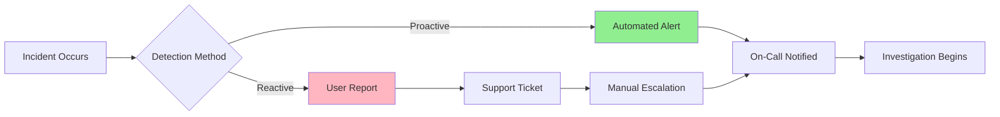

The goal is to shift as much detection as possible from the reactive path (user reports) to the proactive path (automated alerts).

---

## 2. Proactive vs Reactive Detection

Understanding the difference between proactive and reactive detection is fundamental to building an effective strategy.

### Proactive Detection

Proactive detection identifies problems before users experience them or immediately as they occur. This includes:

- **Threshold alerts**: CPU > 90%, error rate > 1%
- **SLO burn rate alerts**: Error budget consumption exceeding sustainable rate
- **Anomaly detection**: Unusual patterns in metrics or logs
- **Synthetic monitoring**: Simulated user transactions catching failures
- **Health checks**: Automated service availability verification

### Reactive Detection

Reactive detection relies on external signals that something is wrong:

- **User complaints**: Support tickets, social media mentions
- **Customer reports**: Direct escalations from enterprise clients
- **Partner notifications**: Downstream services reporting issues
- **Manual observation**: Engineers noticing problems during routine work

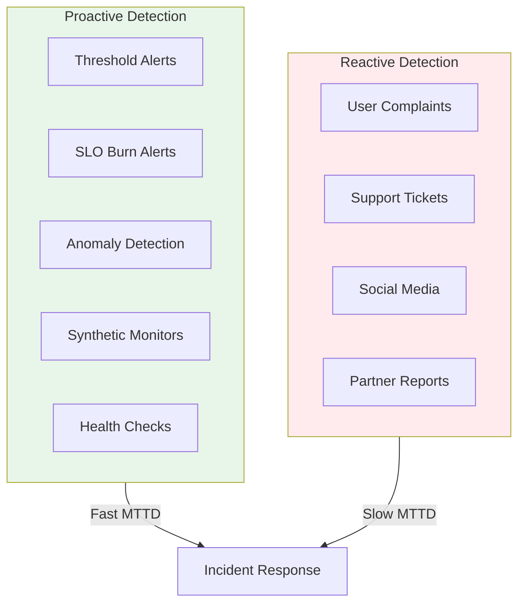

### The Detection Mix

Mature teams aim for 80% or more of incidents detected proactively. Track your detection source ratio:

```python
# detection_metrics.py
# Track the source of incident detection for continuous improvement

from dataclasses import dataclass
from datetime import datetime
from enum import Enum
from typing import List

class DetectionSource(Enum):
    """Categories of incident detection sources."""

    # Proactive sources - automated detection
    THRESHOLD_ALERT = "threshold_alert"
    SLO_BURN_ALERT = "slo_burn_alert"
    ANOMALY_DETECTION = "anomaly_detection"
    SYNTHETIC_MONITOR = "synthetic_monitor"
    HEALTH_CHECK = "health_check"

    # Reactive sources - human-reported
    USER_REPORT = "user_report"
    SUPPORT_TICKET = "support_ticket"
    SOCIAL_MEDIA = "social_media"
    PARTNER_REPORT = "partner_report"
    MANUAL_OBSERVATION = "manual_observation"


@dataclass
class IncidentDetection:
    """Record of how an incident was detected."""
    incident_id: str
    detected_at: datetime
    source: DetectionSource
    time_to_detect_seconds: int


def calculate_proactive_ratio(detections: List[IncidentDetection]) -> float:
    """
    Calculate the percentage of incidents detected proactively.

    Target: >= 80% proactive detection indicates mature monitoring.
    Below 50% suggests significant gaps in automated detection.
    """
    if not detections:
        return 0.0

    # Define which sources count as proactive
    proactive_sources = {
        DetectionSource.THRESHOLD_ALERT,
        DetectionSource.SLO_BURN_ALERT,
        DetectionSource.ANOMALY_DETECTION,
        DetectionSource.SYNTHETIC_MONITOR,
        DetectionSource.HEALTH_CHECK,
    }

    proactive_count = sum(
        1 for d in detections
        if d.source in proactive_sources
    )

    return (proactive_count / len(detections)) * 100


def calculate_mttd_by_source(
    detections: List[IncidentDetection]
) -> dict[DetectionSource, float]:
    """
    Calculate mean time to detect grouped by detection source.

    Useful for identifying which detection methods are fastest
    and where to invest in improvements.
    """
    source_times: dict[DetectionSource, List[int]] = {}

    for detection in detections:
        if detection.source not in source_times:
            source_times[detection.source] = []
        source_times[detection.source].append(detection.time_to_detect_seconds)

    # Return average MTTD for each source
    return {
        source: sum(times) / len(times)
        for source, times in source_times.items()
    }
```

---

## 3. The Detection Landscape

A comprehensive detection strategy uses multiple overlapping methods. Each method has different strengths and catches different types of incidents.

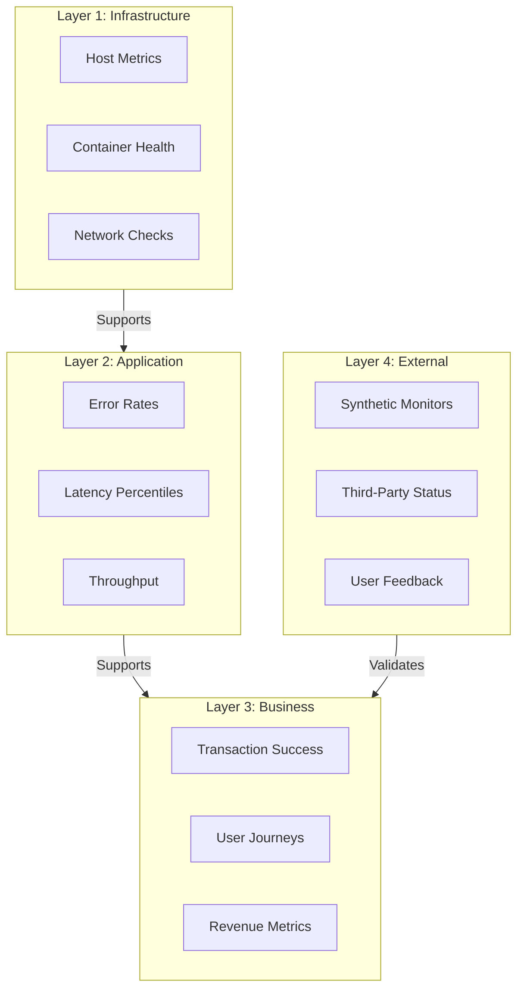

### Detection Method Comparison

| Method | Best For | Blind Spots | Typical MTTD |
|--------|----------|-------------|--------------|
| Threshold alerts | Known failure modes | Novel failures | Seconds |
| SLO burn alerts | User impact | Infrastructure issues | Minutes |
| Anomaly detection | Unknown unknowns | High false positives | Minutes |
| Synthetic monitors | User-facing flows | Internal services | Seconds |
| Log analysis | Root cause details | Aggregate trends | Minutes |
| User reports | Edge cases | Everything else | Hours |

---

## 4. SLO-Based Incident Detection

Service Level Objective (SLO) based detection focuses on what matters most: user experience. Instead of alerting on every infrastructure hiccup, SLO alerts fire when user happiness is actually at risk.

### Understanding Error Budgets

An error budget is the amount of unreliability you can tolerate while still meeting your SLO. If your SLO is 99.9% availability, your error budget is 0.1% of requests over the measurement window.

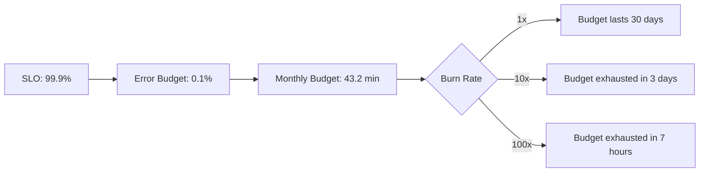

### Burn Rate Alerting

Burn rate measures how fast you are consuming your error budget relative to your SLO window. A burn rate of 1 means you will exactly exhaust your budget by the end of the period. A burn rate of 10 means you are burning budget 10x faster than sustainable.

```python
# slo_burn_rate.py
# Calculate SLO burn rates and determine if alerts should fire

from dataclasses import dataclass
from typing import Optional, List

@dataclass
class SLOConfig:
    """Configuration for a Service Level Objective."""
    name: str
    target: float       # e.g., 0.999 for 99.9%
    window_days: int    # e.g., 30 for monthly SLO


@dataclass
class BurnRateAlert:
    """Configuration for a multi-window burn rate alert."""
    short_window_minutes: int
    long_window_minutes: int
    burn_rate_threshold: float
    severity: str


# Multi-window burn rate alert configuration
# Based on Google SRE Workbook recommendations
BURN_RATE_ALERTS = [
    # Fast burn: catches severe outages quickly
    # At 14.4x burn rate, budget exhausts in ~2 hours
    BurnRateAlert(
        short_window_minutes=5,
        long_window_minutes=60,
        burn_rate_threshold=14.4,
        severity="critical"
    ),
    # Medium burn: catches significant degradation
    # At 6x burn rate, budget exhausts in ~5 days
    BurnRateAlert(
        short_window_minutes=30,
        long_window_minutes=360,
        burn_rate_threshold=6.0,
        severity="warning"
    ),
    # Slow burn: catches gradual degradation
    # At 3x burn rate, budget exhausts in ~10 days
    BurnRateAlert(
        short_window_minutes=120,
        long_window_minutes=1440,
        burn_rate_threshold=3.0,
        severity="warning"
    ),
]


def calculate_burn_rate(
    error_ratio: float,
    slo_target: float,
    window_days: int
) -> float:
    """
    Calculate the burn rate given current error ratio.

    Args:
        error_ratio: Current ratio of bad events to total events (0.0 to 1.0)
        slo_target: SLO target (e.g., 0.999 for 99.9%)
        window_days: SLO measurement window in days

    Returns:
        Burn rate multiplier. 1.0 means sustainable, >1 means burning too fast.
    """
    # Error budget is the acceptable error ratio
    error_budget = 1 - slo_target

    if error_budget == 0:
        return float('inf') if error_ratio > 0 else 0

    # Burn rate = actual errors / budgeted errors
    burn_rate = error_ratio / error_budget

    return burn_rate


def should_alert(
    short_window_burn_rate: float,
    long_window_burn_rate: float,
    alert_config: BurnRateAlert
) -> bool:
    """
    Determine if an alert should fire based on multi-window burn rate.

    Both windows must exceed threshold to avoid false positives from
    brief spikes (short window) or stale data (long window).
    """
    return (
        short_window_burn_rate >= alert_config.burn_rate_threshold
        and long_window_burn_rate >= alert_config.burn_rate_threshold
    )


def evaluate_slo_alerts(
    slo: SLOConfig,
    current_error_ratios: dict[int, float]
) -> List[dict]:
    """
    Evaluate all burn rate alerts for an SLO.

    Args:
        slo: SLO configuration
        current_error_ratios: Error ratios keyed by window in minutes

    Returns:
        List of alerts that should fire with severity and details
    """
    firing_alerts = []

    for alert in BURN_RATE_ALERTS:
        short_ratio = current_error_ratios.get(alert.short_window_minutes)
        long_ratio = current_error_ratios.get(alert.long_window_minutes)

        if short_ratio is None or long_ratio is None:
            continue

        short_burn = calculate_burn_rate(short_ratio, slo.target, slo.window_days)
        long_burn = calculate_burn_rate(long_ratio, slo.target, slo.window_days)

        if should_alert(short_burn, long_burn, alert):
            firing_alerts.append({
                "slo": slo.name,
                "severity": alert.severity,
                "short_window_burn_rate": round(short_burn, 2),
                "long_window_burn_rate": round(long_burn, 2),
                "threshold": alert.burn_rate_threshold,
                "message": (
                    f"SLO {slo.name} burning at {short_burn:.1f}x "
                    f"(threshold: {alert.burn_rate_threshold}x)"
                )
            })

    return firing_alerts
```

### Multi-Window Alert Strategy

Using multiple windows prevents both false positives and slow detection:

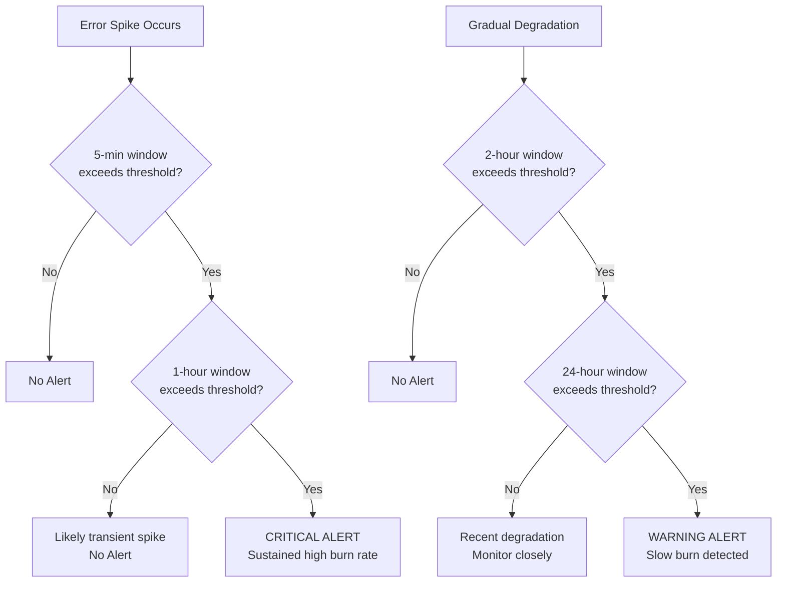

---

## 5. Alert Design Principles

Good alerts are actionable, meaningful, and respect on-call engineers' time. Bad alerts create noise, desensitize responders, and hide real incidents.

### The Alert Quality Framework

Every alert should pass this checklist:

1. **Actionable**: Can an engineer do something about it right now?
2. **Meaningful**: Does it represent real user impact or imminent risk?
3. **Timely**: Does it fire fast enough to make a difference?
4. **Understandable**: Can an engineer grasp the problem within 30 seconds?
5. **Unique**: Is this the only alert that will fire for this condition?

```python
# alert_config.py
# Example alert configuration following best practices

from dataclasses import dataclass, field
from typing import Optional, List
from enum import Enum


class AlertSeverity(Enum):
    """Alert severity levels with clear escalation paths."""
    CRITICAL = "critical"   # Page immediately, 24/7
    WARNING = "warning"     # Notify during business hours
    INFO = "info"           # Log for review, no notification


@dataclass
class AlertRule:
    """
    Configuration for a single alert rule.

    Includes metadata that helps responders act quickly without
    having to search for context during an incident.
    """
    name: str
    description: str
    severity: AlertSeverity

    # The actual alert condition
    query: str
    threshold: float
    comparison: str  # gt, lt, eq

    # Timing configuration
    evaluation_interval_seconds: int = 60
    for_duration_seconds: int = 300  # Must be true for this duration

    # Context for responders - these are required fields
    runbook_url: Optional[str] = None
    dashboard_url: Optional[str] = None
    owning_team: str = "platform"

    # Noise reduction
    labels: dict = field(default_factory=dict)
    inhibit_rules: List[str] = field(default_factory=list)

    def validate(self) -> List[str]:
        """Validate alert configuration against best practices."""
        issues = []

        # Every alert needs a runbook
        if not self.runbook_url:
            issues.append(f"Alert '{self.name}' missing runbook URL")

        # Critical alerts should not fire on transient spikes
        if (self.severity == AlertSeverity.CRITICAL
            and self.for_duration_seconds < 120):
            issues.append(
                f"Critical alert '{self.name}' has short duration "
                f"({self.for_duration_seconds}s), may cause false positives"
            )

        # Names should be descriptive
        if len(self.name) < 10:
            issues.append(f"Alert name '{self.name}' is too short")

        return issues


# Example: Well-designed alerts for an API service
API_ALERTS = [
    AlertRule(
        name="api-high-error-rate-slo-burn",
        description=(
            "API error rate is burning SLO budget faster than sustainable. "
            "Current burn rate exceeds 10x threshold for the past 5 minutes "
            "and 1 hour windows."
        ),
        severity=AlertSeverity.CRITICAL,
        query='sum(rate(http_requests_total{status=~"5.."}[5m])) / sum(rate(http_requests_total[5m]))',
        threshold=0.01,
        comparison="gt",
        for_duration_seconds=300,
        runbook_url="https://runbooks.example.com/api-errors",
        dashboard_url="https://grafana.example.com/d/api-health",
        owning_team="api-platform",
        labels={"service": "api", "slo": "availability"},
    ),
    AlertRule(
        name="api-latency-p99-degraded",
        description=(
            "99th percentile latency exceeds SLO threshold. "
            "Users are experiencing slow responses."
        ),
        severity=AlertSeverity.WARNING,
        query='histogram_quantile(0.99, sum(rate(http_request_duration_seconds_bucket[5m])) by (le))',
        threshold=2.0,
        comparison="gt",
        for_duration_seconds=600,
        runbook_url="https://runbooks.example.com/api-latency",
        dashboard_url="https://grafana.example.com/d/api-latency",
        owning_team="api-platform",
        labels={"service": "api", "slo": "latency"},
    ),
]
```

### Alert Deduplication and Grouping

When multiple related alerts fire, group them to prevent alert storms:

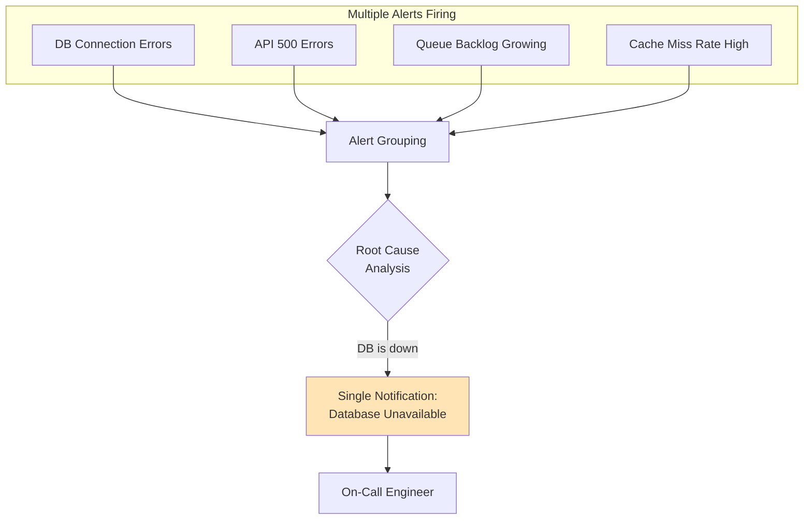

---

## 6. Anomaly Detection Implementation

Threshold-based alerts work well for known failure modes. Anomaly detection catches the unknown unknowns: unusual patterns that do not trigger static thresholds but indicate something is wrong.

### Types of Anomalies

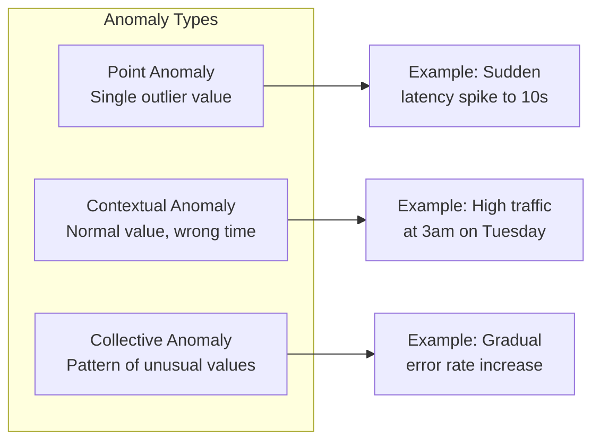

### Statistical Anomaly Detection

For metrics with predictable patterns, statistical methods provide a good balance of accuracy and interpretability:

```python
# anomaly_detection.py
# Statistical anomaly detection for time series metrics

import math
from dataclasses import dataclass
from typing import List, Optional, Tuple
from datetime import datetime, timedelta
from collections import deque


@dataclass
class AnomalyResult:
    """Result of anomaly detection analysis."""
    is_anomaly: bool
    value: float
    expected_value: float
    deviation_score: float   # Number of standard deviations from mean
    confidence: float        # 0.0 to 1.0


class RollingStatsDetector:
    """
    Detect anomalies using rolling statistics.

    Compares current values against historical mean and standard deviation.
    Simple but effective for metrics with relatively stable baselines.
    """

    def __init__(
        self,
        window_size: int = 60,       # Points to consider for baseline
        sensitivity: float = 3.0,     # Standard deviations for anomaly
        min_samples: int = 30         # Minimum samples before detecting
    ):
        self.window_size = window_size
        self.sensitivity = sensitivity
        self.min_samples = min_samples
        self.history: deque[float] = deque(maxlen=window_size)

    def _calculate_stats(self) -> Tuple[float, float]:
        """Calculate mean and standard deviation of history."""
        if len(self.history) < 2:
            return 0.0, 0.0

        n = len(self.history)
        mean = sum(self.history) / n

        # Sample standard deviation (n-1 for Bessel's correction)
        variance = sum((x - mean) ** 2 for x in self.history) / (n - 1)
        std_dev = math.sqrt(variance)

        return mean, std_dev

    def add_point(self, value: float) -> AnomalyResult:
        """
        Add a new data point and check if it is anomalous.

        The z-score approach compares the current value to the historical
        distribution. Values beyond the sensitivity threshold (typically
        3 standard deviations) are flagged as anomalies.
        """
        mean, std_dev = self._calculate_stats()

        # Not enough data to detect anomalies yet
        if len(self.history) < self.min_samples:
            self.history.append(value)
            return AnomalyResult(
                is_anomaly=False,
                value=value,
                expected_value=mean,
                deviation_score=0.0,
                confidence=0.0
            )

        # Calculate deviation score (z-score)
        if std_dev == 0:
            deviation_score = 0.0 if value == mean else float('inf')
        else:
            deviation_score = abs(value - mean) / std_dev

        is_anomaly = deviation_score > self.sensitivity

        # Confidence based on sample size
        confidence = min(1.0, len(self.history) / self.window_size)

        # Update history with new value
        self.history.append(value)

        return AnomalyResult(
            is_anomaly=is_anomaly,
            value=value,
            expected_value=mean,
            deviation_score=deviation_score,
            confidence=confidence
        )


class SeasonalDetector:
    """
    Detect anomalies accounting for seasonal patterns.

    Compares current values against the same time period in previous
    cycles (e.g., same hour yesterday, same day last week).
    """

    def __init__(
        self,
        cycle_length: int = 1440,     # Points per cycle (1440 = 1 day at 1min)
        num_cycles: int = 7,          # Historical cycles to consider
        sensitivity: float = 3.0
    ):
        self.cycle_length = cycle_length
        self.num_cycles = num_cycles
        self.sensitivity = sensitivity

        # Store historical values by position in cycle
        self.history: dict[int, deque[float]] = {}

    def _get_cycle_position(self, timestamp: datetime) -> int:
        """Get position within the cycle (0 to cycle_length-1)."""
        return (timestamp.hour * 60 + timestamp.minute) % self.cycle_length

    def add_point(self, timestamp: datetime, value: float) -> AnomalyResult:
        """
        Add a point and check for seasonal anomalies.

        This method compares the current value against historical values
        from the same position in previous cycles, accounting for daily
        or weekly patterns in the data.
        """
        position = self._get_cycle_position(timestamp)

        # Initialize history for this position if needed
        if position not in self.history:
            self.history[position] = deque(maxlen=self.num_cycles)

        historical_values = self.history[position]

        # Not enough historical data
        if len(historical_values) < 2:
            historical_values.append(value)
            return AnomalyResult(
                is_anomaly=False,
                value=value,
                expected_value=value,
                deviation_score=0.0,
                confidence=0.0
            )

        # Calculate expected value from same time in previous cycles
        mean = sum(historical_values) / len(historical_values)
        variance = sum((x - mean) ** 2 for x in historical_values) / len(historical_values)
        std_dev = math.sqrt(variance) if variance > 0 else 0.0

        # Calculate deviation
        if std_dev == 0:
            deviation_score = 0.0 if value == mean else 5.0
        else:
            deviation_score = abs(value - mean) / std_dev

        is_anomaly = deviation_score > self.sensitivity
        confidence = min(1.0, len(historical_values) / self.num_cycles)

        # Update history
        historical_values.append(value)

        return AnomalyResult(
            is_anomaly=is_anomaly,
            value=value,
            expected_value=mean,
            deviation_score=deviation_score,
            confidence=confidence
        )


class CompositeAnomalyDetector:
    """
    Combine multiple anomaly detection methods.

    Using multiple detectors reduces false positives by requiring
    agreement between methods before flagging an anomaly.
    """

    def __init__(self):
        self.rolling_detector = RollingStatsDetector(
            window_size=60,
            sensitivity=3.0
        )
        self.seasonal_detector = SeasonalDetector(
            cycle_length=1440,
            sensitivity=3.0
        )

    def check(self, timestamp: datetime, value: float) -> dict:
        """
        Check for anomalies using all methods.

        Returns combined result with individual detector outputs for
        debugging and tuning purposes.
        """
        rolling_result = self.rolling_detector.add_point(value)
        seasonal_result = self.seasonal_detector.add_point(timestamp, value)

        # Require both detectors to flag as anomaly for high confidence
        # Or one detector with very high deviation (> 5 sigma)
        is_anomaly = (
            (rolling_result.is_anomaly and seasonal_result.is_anomaly)
            or rolling_result.deviation_score > 5.0
            or seasonal_result.deviation_score > 5.0
        )

        return {
            "is_anomaly": is_anomaly,
            "value": value,
            "timestamp": timestamp.isoformat(),
            "rolling": {
                "is_anomaly": rolling_result.is_anomaly,
                "expected": round(rolling_result.expected_value, 2),
                "deviation": round(rolling_result.deviation_score, 2)
            },
            "seasonal": {
                "is_anomaly": seasonal_result.is_anomaly,
                "expected": round(seasonal_result.expected_value, 2),
                "deviation": round(seasonal_result.deviation_score, 2)
            }
        }
```

### When to Use Anomaly Detection

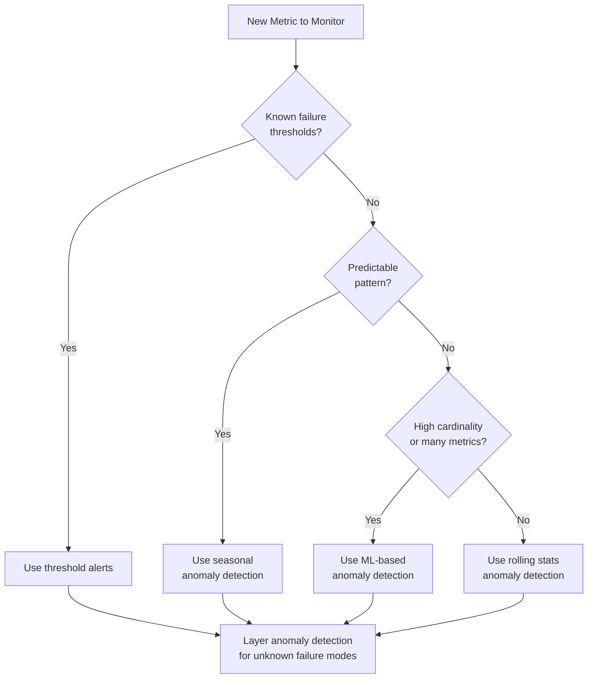

---

## 7. Synthetic Monitoring

Synthetic monitoring simulates user interactions to detect issues before real users encounter them. It provides consistent, controlled tests that can catch problems in specific user flows.

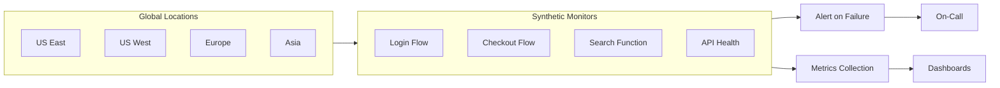

### Implementing Synthetic Checks

```python
# synthetic_monitor.py
# Framework for synthetic monitoring checks

import asyncio
import time
from dataclasses import dataclass, field
from typing import Callable, Optional, List, Any
from enum import Enum
from datetime import datetime


class CheckStatus(Enum):
    """Status of a synthetic check execution."""
    SUCCESS = "success"
    FAILURE = "failure"
    TIMEOUT = "timeout"
    ERROR = "error"


@dataclass
class CheckResult:
    """Result of running a synthetic check."""
    name: str
    status: CheckStatus
    duration_ms: float
    timestamp: datetime
    error_message: Optional[str] = None
    metadata: dict = field(default_factory=dict)


@dataclass
class SyntheticCheck:
    """
    Configuration for a synthetic monitoring check.

    Each check represents a user flow or API endpoint that should
    be tested regularly to detect outages before users report them.
    """
    name: str
    description: str
    check_function: Callable[[], Any]
    interval_seconds: int = 60
    timeout_seconds: int = 30

    # Alert configuration
    alert_after_failures: int = 2  # Alert after N consecutive failures

    # Runtime state
    consecutive_failures: int = 0
    last_result: Optional[CheckResult] = None


class SyntheticMonitor:
    """
    Run synthetic checks on a schedule and report results.

    This monitor executes check functions at configured intervals,
    tracks consecutive failures, and triggers alerts when thresholds
    are exceeded.
    """

    def __init__(self):
        self.checks: List[SyntheticCheck] = []
        self.results_callback: Optional[Callable[[CheckResult], None]] = None
        self.alert_callback: Optional[Callable[[SyntheticCheck, CheckResult], None]] = None

    def register_check(self, check: SyntheticCheck) -> None:
        """Register a new synthetic check to be executed."""
        self.checks.append(check)

    def on_result(self, callback: Callable[[CheckResult], None]) -> None:
        """Set callback for all check results (for metrics collection)."""
        self.results_callback = callback

    def on_alert(self, callback: Callable[[SyntheticCheck, CheckResult], None]) -> None:
        """Set callback for alert conditions."""
        self.alert_callback = callback

    async def run_check(self, check: SyntheticCheck) -> CheckResult:
        """Execute a single synthetic check with timeout handling."""
        start_time = time.time()

        try:
            # Run check with timeout
            await asyncio.wait_for(
                asyncio.to_thread(check.check_function),
                timeout=check.timeout_seconds
            )

            duration_ms = (time.time() - start_time) * 1000
            result = CheckResult(
                name=check.name,
                status=CheckStatus.SUCCESS,
                duration_ms=duration_ms,
                timestamp=datetime.utcnow()
            )

            # Reset failure counter on success
            check.consecutive_failures = 0

        except asyncio.TimeoutError:
            duration_ms = check.timeout_seconds * 1000
            result = CheckResult(
                name=check.name,
                status=CheckStatus.TIMEOUT,
                duration_ms=duration_ms,
                timestamp=datetime.utcnow(),
                error_message=f"Check timed out after {check.timeout_seconds}s"
            )
            check.consecutive_failures += 1

        except Exception as e:
            duration_ms = (time.time() - start_time) * 1000
            result = CheckResult(
                name=check.name,
                status=CheckStatus.ERROR,
                duration_ms=duration_ms,
                timestamp=datetime.utcnow(),
                error_message=str(e)
            )
            check.consecutive_failures += 1

        check.last_result = result

        # Send result to metrics callback
        if self.results_callback:
            self.results_callback(result)

        # Check alert condition
        if (check.consecutive_failures >= check.alert_after_failures
            and self.alert_callback):
            self.alert_callback(check, result)

        return result


def create_http_check(url: str, expected_status: int = 200) -> Callable:
    """
    Create a check that verifies an HTTP endpoint responds correctly.

    This is the simplest form of synthetic monitoring - just checking
    that an endpoint is reachable and returns the expected status code.
    """
    import urllib.request

    def check():
        req = urllib.request.Request(url, method='GET')
        with urllib.request.urlopen(req, timeout=10) as response:
            if response.status != expected_status:
                raise Exception(
                    f"Expected status {expected_status}, got {response.status}"
                )

    return check


def create_api_check(
    url: str,
    method: str = "GET",
    payload: Optional[dict] = None,
    expected_fields: Optional[List[str]] = None
) -> Callable:
    """
    Create a check that verifies an API endpoint returns expected data.

    Goes beyond simple HTTP checks to validate that the response
    contains expected fields, useful for API contract verification.
    """
    import urllib.request
    import json

    def check():
        data = json.dumps(payload).encode() if payload else None
        req = urllib.request.Request(
            url,
            method=method,
            data=data,
            headers={'Content-Type': 'application/json'} if data else {}
        )

        with urllib.request.urlopen(req, timeout=10) as response:
            body = json.loads(response.read())

            if expected_fields:
                for field in expected_fields:
                    if field not in body:
                        raise Exception(f"Missing expected field: {field}")

    return check
```

---

## 8. User-Reported Incident Channels

Despite best efforts at proactive detection, some incidents will first be noticed by users. Having clear channels for user reports ensures these signals reach the right team quickly.

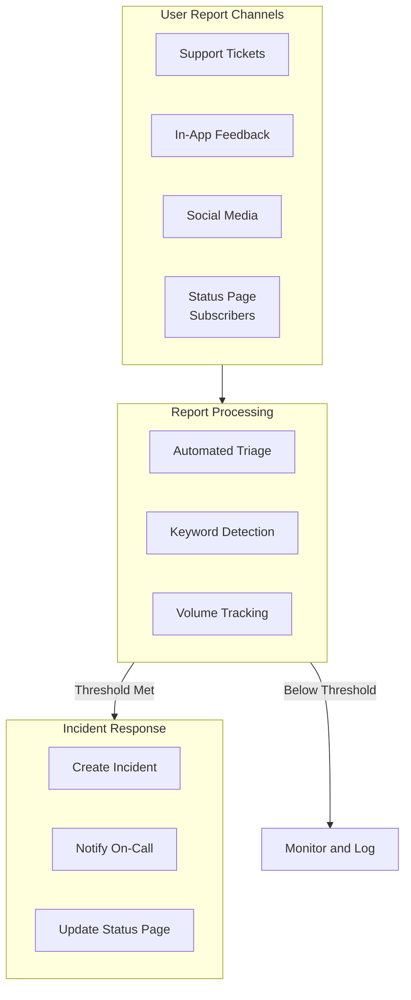

### Correlating User Reports with Monitoring Data

User reports become more valuable when correlated with your monitoring signals:

```python
# user_report_correlation.py
# Correlate user reports with monitoring data to identify incidents

from dataclasses import dataclass
from datetime import datetime, timedelta
from typing import List, Optional
from collections import defaultdict


@dataclass
class UserReport:
    """A report from a user about an issue."""
    id: str
    timestamp: datetime
    category: str       # e.g., "error", "slow", "outage"
    description: str
    user_id: Optional[str] = None
    severity: str = "unknown"


@dataclass
class MonitoringSignal:
    """A signal from the monitoring system."""
    timestamp: datetime
    signal_type: str    # e.g., "alert", "anomaly", "threshold_breach"
    service: str
    description: str
    severity: str


@dataclass
class CorrelatedIncident:
    """An incident identified by correlating multiple signals."""
    detected_at: datetime
    user_reports: List[UserReport]
    monitoring_signals: List[MonitoringSignal]
    confidence: float   # 0.0 to 1.0
    suggested_severity: str


class UserReportCorrelator:
    """
    Correlate user reports with monitoring data to identify incidents.

    This correlator watches for clusters of user reports within a time
    window and cross-references them with monitoring signals to determine
    if a real incident is occurring.
    """

    def __init__(
        self,
        report_threshold: int = 3,
        time_window_minutes: int = 15,
        monitoring_lookback_minutes: int = 30
    ):
        self.report_threshold = report_threshold
        self.time_window = timedelta(minutes=time_window_minutes)
        self.monitoring_lookback = timedelta(minutes=monitoring_lookback_minutes)

        self.reports: List[UserReport] = []
        self.monitoring_signals: List[MonitoringSignal] = []

    def add_report(self, report: UserReport) -> Optional[CorrelatedIncident]:
        """
        Add a user report and check if it correlates into an incident.

        Returns a CorrelatedIncident if the report threshold is met,
        indicating we should investigate further.
        """
        self.reports.append(report)
        self._cleanup_old_data()

        # Check for report clustering
        recent_reports = self._get_recent_reports(report.timestamp)

        if len(recent_reports) >= self.report_threshold:
            return self._create_correlated_incident(
                recent_reports, report.timestamp
            )

        return None

    def add_monitoring_signal(self, signal: MonitoringSignal) -> None:
        """Add a monitoring signal for correlation."""
        self.monitoring_signals.append(signal)
        self._cleanup_old_data()

    def _get_recent_reports(self, reference_time: datetime) -> List[UserReport]:
        """Get reports within the time window."""
        cutoff = reference_time - self.time_window
        return [r for r in self.reports if r.timestamp >= cutoff]

    def _get_related_signals(
        self, reference_time: datetime
    ) -> List[MonitoringSignal]:
        """Get monitoring signals that might be related."""
        start = reference_time - self.monitoring_lookback
        end = reference_time + timedelta(minutes=5)
        return [
            s for s in self.monitoring_signals
            if start <= s.timestamp <= end
        ]

    def _create_correlated_incident(
        self,
        reports: List[UserReport],
        reference_time: datetime
    ) -> CorrelatedIncident:
        """Create an incident from correlated reports and signals."""
        related_signals = self._get_related_signals(reference_time)

        # Calculate confidence based on signal correlation
        base_confidence = min(1.0, len(reports) / (self.report_threshold * 2))
        signal_boost = min(0.3, len(related_signals) * 0.1)
        confidence = min(1.0, base_confidence + signal_boost)

        # Determine severity from signals and report volume
        suggested_severity = self._determine_severity(reports, related_signals)

        return CorrelatedIncident(
            detected_at=reference_time,
            user_reports=reports,
            monitoring_signals=related_signals,
            confidence=confidence,
            suggested_severity=suggested_severity
        )

    def _determine_severity(
        self,
        reports: List[UserReport],
        signals: List[MonitoringSignal]
    ) -> str:
        """Determine incident severity from available data."""
        # Check if any signal is critical
        if any(s.severity == "critical" for s in signals):
            return "critical"

        # High volume of reports suggests higher severity
        if len(reports) >= self.report_threshold * 3:
            return "high"

        if len(reports) >= self.report_threshold * 2:
            return "medium"

        return "low"

    def _cleanup_old_data(self) -> None:
        """Remove data older than the lookback window."""
        cutoff = datetime.utcnow() - self.monitoring_lookback * 2
        self.reports = [r for r in self.reports if r.timestamp >= cutoff]
        self.monitoring_signals = [
            s for s in self.monitoring_signals if s.timestamp >= cutoff
        ]
```

---

## 9. Correlation and Signal Enrichment

Individual signals are useful. Correlated signals are powerful. Enriching alerts with context helps responders understand the situation faster.

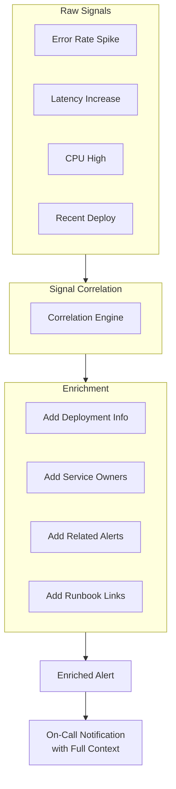

### Building an Enrichment Pipeline

```python
# alert_enrichment.py
# Enrich alerts with context to help responders

from dataclasses import dataclass, field
from datetime import datetime, timedelta
from typing import List, Optional, Dict


@dataclass
class RawAlert:
    """An alert before enrichment."""
    id: str
    name: str
    severity: str
    service: str
    timestamp: datetime
    description: str
    labels: Dict[str, str] = field(default_factory=dict)


@dataclass
class Deployment:
    """A recent deployment record."""
    id: str
    service: str
    timestamp: datetime
    commit_sha: str
    deployer: str
    changes: List[str]


@dataclass
class ServiceInfo:
    """Information about a service for alert routing."""
    name: str
    team: str
    on_call: List[str]
    runbook_url: str
    dashboard_url: str
    slack_channel: str


@dataclass
class EnrichedAlert:
    """An alert with full context for responders."""
    raw_alert: RawAlert
    related_alerts: List[RawAlert]
    recent_deployments: List[Deployment]
    service_info: Optional[ServiceInfo]
    suggested_actions: List[str]
    context_summary: str


class AlertEnrichmentPipeline:
    """
    Pipeline to enrich alerts with context from multiple sources.

    When an alert fires, responders need context to act quickly.
    This pipeline gathers relevant information from various sources
    and packages it with the alert.
    """

    def __init__(self):
        self.alert_store: List[RawAlert] = []
        self.deployment_store: List[Deployment] = []
        self.service_registry: Dict[str, ServiceInfo] = {}

    def register_service(self, service: ServiceInfo) -> None:
        """Register service information for enrichment."""
        self.service_registry[service.name] = service

    def record_deployment(self, deployment: Deployment) -> None:
        """Record a deployment for correlation with alerts."""
        self.deployment_store.append(deployment)

    def record_alert(self, alert: RawAlert) -> None:
        """Record an alert for correlation with other alerts."""
        self.alert_store.append(alert)

    def enrich(self, alert: RawAlert) -> EnrichedAlert:
        """
        Enrich an alert with all available context.

        This method gathers related alerts, recent deployments,
        service information, and generates suggested actions to
        help responders understand and resolve the issue quickly.
        """
        # Find related alerts (same service, recent timeframe)
        related_alerts = self._find_related_alerts(alert)

        # Find recent deployments that might be related
        recent_deployments = self._find_recent_deployments(alert)

        # Get service ownership and routing info
        service_info = self.service_registry.get(alert.service)

        # Generate suggested actions based on context
        suggested_actions = self._generate_suggestions(
            alert, related_alerts, recent_deployments
        )

        # Create human-readable context summary
        context_summary = self._create_summary(
            alert, related_alerts, recent_deployments, service_info
        )

        return EnrichedAlert(
            raw_alert=alert,
            related_alerts=related_alerts,
            recent_deployments=recent_deployments,
            service_info=service_info,
            suggested_actions=suggested_actions,
            context_summary=context_summary
        )

    def _find_related_alerts(self, alert: RawAlert) -> List[RawAlert]:
        """Find alerts that might be related to this one."""
        window = timedelta(minutes=30)
        cutoff = alert.timestamp - window

        related = []
        for stored_alert in self.alert_store:
            if stored_alert.id == alert.id:
                continue

            # Same service or same cluster/environment
            if (stored_alert.timestamp >= cutoff and
                (stored_alert.service == alert.service or
                 stored_alert.labels.get("cluster") == alert.labels.get("cluster"))):
                related.append(stored_alert)

        return related[:5]

    def _find_recent_deployments(self, alert: RawAlert) -> List[Deployment]:
        """Find recent deployments to the affected service."""
        window = timedelta(hours=2)
        cutoff = alert.timestamp - window

        deployments = [
            d for d in self.deployment_store
            if d.timestamp >= cutoff and d.service == alert.service
        ]

        return sorted(deployments, key=lambda d: d.timestamp, reverse=True)[:3]

    def _generate_suggestions(
        self,
        alert: RawAlert,
        related_alerts: List[RawAlert],
        deployments: List[Deployment]
    ) -> List[str]:
        """Generate suggested actions based on context."""
        suggestions = []

        # If recent deployment, suggest investigating changes
        if deployments:
            suggestions.append(
                f"Recent deployment detected ({deployments[0].commit_sha[:8]}). "
                f"Consider rollback if symptoms match changes."
            )

        # If multiple related alerts, suggest broader investigation
        if len(related_alerts) >= 3:
            suggestions.append(
                f"{len(related_alerts)} related alerts firing. "
                f"Look for common root cause (dependency, infrastructure)."
            )

        # Service-specific suggestions
        if "database" in alert.service.lower():
            suggestions.append("Check database connection pool and query latency.")

        if "api" in alert.service.lower():
            suggestions.append("Check downstream dependencies and circuit breaker state.")

        return suggestions

    def _create_summary(
        self,
        alert: RawAlert,
        related_alerts: List[RawAlert],
        deployments: List[Deployment],
        service_info: Optional[ServiceInfo]
    ) -> str:
        """Create a human-readable context summary."""
        parts = [f"Alert: {alert.name} on {alert.service}"]

        if deployments:
            parts.append(
                f"Recent deploy: {deployments[0].commit_sha[:8]} "
                f"by {deployments[0].deployer}"
            )

        if related_alerts:
            parts.append(f"Related alerts: {len(related_alerts)} firing")

        if service_info:
            parts.append(f"Team: {service_info.team}")

        return " | ".join(parts)
```

---

## 10. Building Your Detection Pipeline

Bringing all the components together into a cohesive detection pipeline:

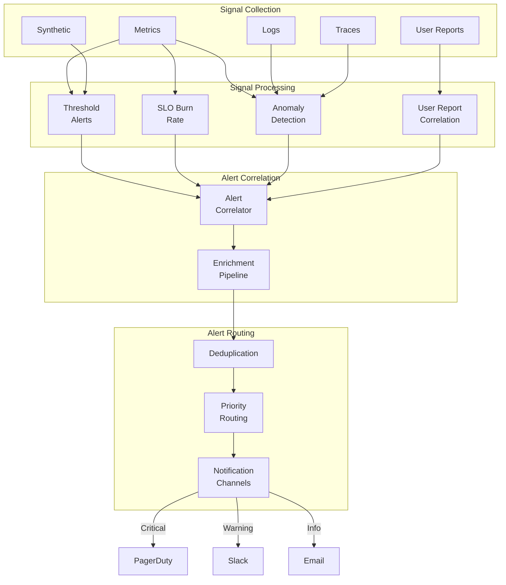

### Pipeline Implementation Architecture

```python
# detection_pipeline.py
# Complete detection pipeline orchestration

from dataclasses import dataclass
from datetime import datetime, timedelta
from typing import List, Optional, Callable, Any
from enum import Enum
import asyncio


class SignalType(Enum):
    """Types of signals that feed into detection."""
    METRIC = "metric"
    LOG = "log"
    TRACE = "trace"
    SYNTHETIC = "synthetic"
    USER_REPORT = "user_report"


class AlertChannel(Enum):
    """Notification channels for alerts."""
    PAGERDUTY = "pagerduty"
    SLACK = "slack"
    EMAIL = "email"


@dataclass
class Signal:
    """A raw signal from any source."""
    type: SignalType
    source: str
    timestamp: datetime
    data: dict


@dataclass
class ProcessedAlert:
    """An alert ready for routing."""
    id: str
    name: str
    severity: str
    service: str
    timestamp: datetime
    description: str
    context: dict
    channels: List[AlertChannel]


class DetectionPipeline:
    """
    Orchestrates the complete detection pipeline from
    raw signals to routed alerts.

    This pipeline connects signal processors, correlation engines,
    enrichment, and notification routing into a single flow.
    """

    def __init__(self):
        # Processors for different signal types
        self.processors: dict[SignalType, List[Callable]] = {
            signal_type: [] for signal_type in SignalType
        }

        # Alert handlers
        self.correlator: Optional[Callable] = None
        self.enricher: Optional[Callable] = None
        self.router: Optional[Callable] = None

        # Output channels
        self.channel_handlers: dict[AlertChannel, Callable] = {}

        # State for correlation
        self.recent_alerts: List[ProcessedAlert] = []

    def register_processor(
        self,
        signal_type: SignalType,
        processor: Callable[[Signal], Optional[ProcessedAlert]]
    ) -> None:
        """Register a processor for a signal type."""
        self.processors[signal_type].append(processor)

    def set_correlator(
        self,
        correlator: Callable[[ProcessedAlert, List[ProcessedAlert]], ProcessedAlert]
    ) -> None:
        """Set the alert correlator."""
        self.correlator = correlator

    def set_enricher(
        self,
        enricher: Callable[[ProcessedAlert], ProcessedAlert]
    ) -> None:
        """Set the alert enricher."""
        self.enricher = enricher

    def set_router(
        self,
        router: Callable[[ProcessedAlert], List[AlertChannel]]
    ) -> None:
        """Set the alert router."""
        self.router = router

    def register_channel(
        self,
        channel: AlertChannel,
        handler: Callable[[ProcessedAlert], None]
    ) -> None:
        """Register a notification channel handler."""
        self.channel_handlers[channel] = handler

    async def process_signal(self, signal: Signal) -> Optional[ProcessedAlert]:
        """
        Process a single signal through the pipeline.

        This method runs the signal through all registered processors,
        correlates any resulting alerts, enriches them with context,
        routes to appropriate channels, and sends notifications.
        """
        # Run through processors for this signal type
        alerts = []
        for processor in self.processors[signal.type]:
            alert = processor(signal)
            if alert:
                alerts.append(alert)

        if not alerts:
            return None

        # Take the first alert (could merge if multiple)
        alert = alerts[0]

        # Correlate with recent alerts
        if self.correlator:
            alert = self.correlator(alert, self.recent_alerts)

        # Enrich with context
        if self.enricher:
            alert = self.enricher(alert)

        # Route to channels
        if self.router:
            alert.channels = self.router(alert)

        # Send to channels
        for channel in alert.channels:
            handler = self.channel_handlers.get(channel)
            if handler:
                await asyncio.to_thread(handler, alert)

        # Store for correlation
        self.recent_alerts.append(alert)
        self._cleanup_old_alerts()

        return alert

    def _cleanup_old_alerts(self) -> None:
        """Remove alerts older than correlation window."""
        cutoff = datetime.utcnow() - timedelta(hours=1)
        self.recent_alerts = [
            a for a in self.recent_alerts
            if a.timestamp >= cutoff
        ]


def create_example_pipeline() -> DetectionPipeline:
    """
    Create and configure an example detection pipeline.

    This demonstrates how to wire up processors, routing,
    and notification channels.
    """
    pipeline = DetectionPipeline()

    # Metric threshold processor
    def metric_threshold_processor(signal: Signal) -> Optional[ProcessedAlert]:
        if signal.type != SignalType.METRIC:
            return None

        data = signal.data

        # Check error rate threshold
        if data.get("metric") == "error_rate" and data.get("value", 0) > 0.05:
            return ProcessedAlert(
                id=f"alert-{datetime.utcnow().timestamp()}",
                name=f"{data.get('service')}-high-error-rate",
                severity="critical" if data.get("value", 0) > 0.1 else "warning",
                service=data.get("service", "unknown"),
                timestamp=signal.timestamp,
                description=f"Error rate {data.get('value', 0):.1%} exceeds threshold",
                context=data,
                channels=[]
            )

        return None

    # Severity-based router
    def severity_router(alert: ProcessedAlert) -> List[AlertChannel]:
        if alert.severity == "critical":
            return [AlertChannel.PAGERDUTY, AlertChannel.SLACK]
        elif alert.severity == "warning":
            return [AlertChannel.SLACK]
        else:
            return [AlertChannel.EMAIL]

    # Register components
    pipeline.register_processor(SignalType.METRIC, metric_threshold_processor)
    pipeline.set_router(severity_router)

    # Register channel handlers (in production, these would send real notifications)
    pipeline.register_channel(
        AlertChannel.PAGERDUTY,
        lambda alert: print(f"[PAGERDUTY] {alert.severity.upper()}: {alert.name}")
    )
    pipeline.register_channel(
        AlertChannel.SLACK,
        lambda alert: print(f"[SLACK] {alert.severity}: {alert.name}")
    )
    pipeline.register_channel(
        AlertChannel.EMAIL,
        lambda alert: print(f"[EMAIL] {alert.severity}: {alert.name}")
    )

    return pipeline
```

---

## 11. Detection Strategy Maturity Model

Use this model to assess and improve your detection capabilities:

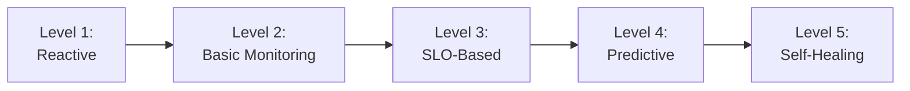

### Maturity Levels

| Level | Detection Method | Typical MTTD | Characteristics |
|-------|------------------|--------------|-----------------|
| 1: Reactive | User reports only | Hours | No monitoring, users discover issues |
| 2: Basic | Static thresholds | Minutes | CPU/memory alerts, high noise |
| 3: SLO-Based | Burn rate alerts | Minutes | User impact focus, lower noise |
| 4: Predictive | Anomaly detection + ML | Seconds | Catch unknown issues, proactive |
| 5: Self-Healing | Automated remediation | Seconds | Issues fixed before user impact |

### Assessment Checklist

**Level 1 to Level 2:**
- [ ] Basic infrastructure monitoring deployed
- [ ] Alerts configured for key services
- [ ] On-call rotation established

**Level 2 to Level 3:**
- [ ] SLIs defined for critical user journeys
- [ ] SLO targets set with error budgets
- [ ] Burn rate alerts replacing threshold alerts
- [ ] Alert noise reduced by 50%+

**Level 3 to Level 4:**
- [ ] Anomaly detection on key metrics
- [ ] Synthetic monitoring for user flows
- [ ] Alert correlation reducing duplicates
- [ ] ML models identifying patterns

**Level 4 to Level 5:**
- [ ] Automated remediation for known issues
- [ ] Predictive scaling based on traffic patterns
- [ ] Self-healing infrastructure
- [ ] Near-zero user-visible incidents

---

## 12. Common Pitfalls and Best Practices

### Pitfalls to Avoid

**Alert Fatigue**
Too many alerts desensitize responders. If your team ignores pages, you have a signal quality problem.

**Threshold Obsession**
Static thresholds miss context. A 90% CPU during peak traffic might be fine; 50% CPU at 3am might indicate a problem.

**Detection Without Action**
Alerts without runbooks waste time. Every alert should link to next steps.

**Monitoring the Monitor**
If your monitoring system goes down, you need to know. Implement health checks for your detection infrastructure.

### Best Practices

1. **Start with SLOs**: Define what matters to users before building alerts.

2. **Measure MTTD**: Track how incidents are detected and optimize the slowest paths.

3. **Review Alert Quality Monthly**: Delete alerts that never fire or always fire.

4. **Correlate Signals**: Multiple weak signals often indicate a strong incident.

5. **Test Your Detection**: Run game days to verify alerts fire when expected.

6. **Document Everything**: Runbooks, escalation paths, and service ownership must be current.

7. **Iterate Continuously**: Detection strategy is never "done." Improve based on postmortem findings.

---

## Conclusion

Building effective incident detection strategies requires combining multiple approaches: SLO-based alerting for user impact focus, anomaly detection for unknown issues, synthetic monitoring for proactive verification, and user feedback channels for edge cases.

The goal is not perfect detection but rather continuous improvement. Track your MTTD, measure proactive vs reactive detection ratio, and iterate based on what you learn from each incident.

Start with SLOs. Add burn rate alerts. Layer in anomaly detection. Correlate signals. Enrich alerts with context. Route to the right people.

Your users should never be the first to know about incidents. Your monitoring should be.

---

**Related Reading:**

- [The Ultimate SRE Reliability Checklist](https://oneuptime.com/blog/post/2025-09-10-sre-checklist/view)
- [18 SRE Metrics Worth Tracking](https://oneuptime.com/blog/post/2025-11-28-sre-metrics-to-track/view)
- [Effective Incident Postmortem Templates](https://oneuptime.com/blog/post/2025-09-09-effective-incident-postmortem-templates-ready-to-use-examples/view)

*Want to implement these detection strategies? [OneUptime](https://oneuptime.com) provides unified SLO monitoring, alerting, incident management, and status pages in a single platform.*
