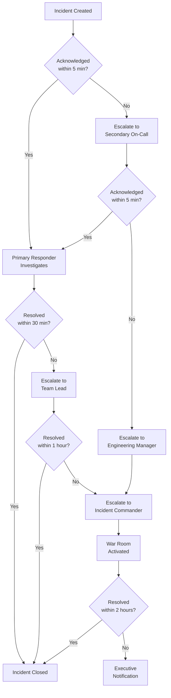
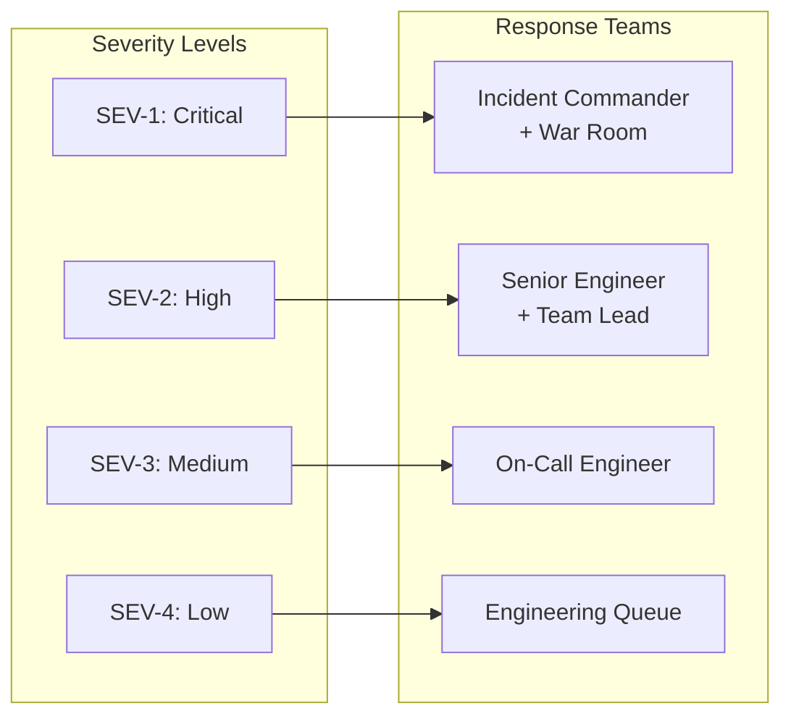
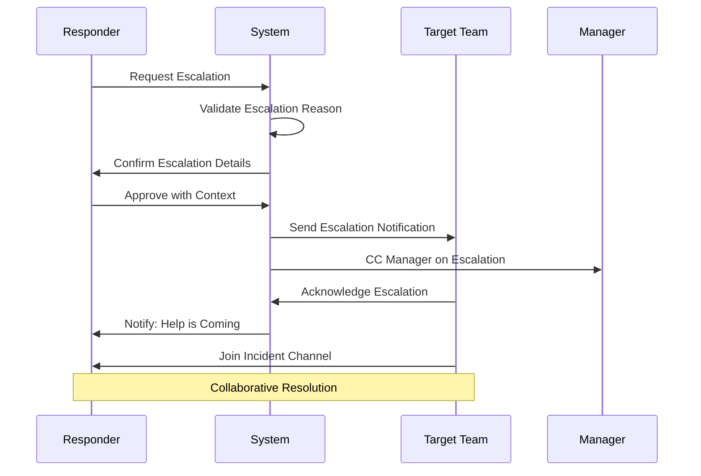
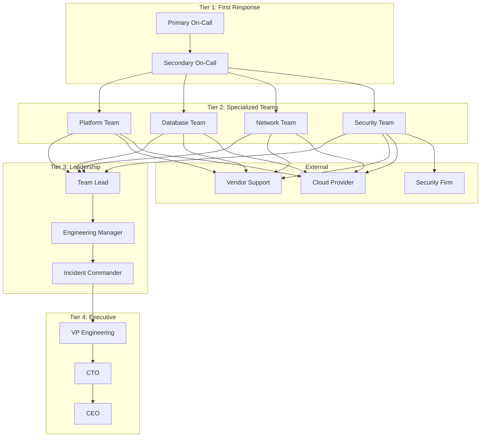
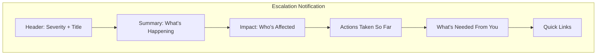

# How to Create Incident Escalation

Author: [nawazdhandala](https://github.com/nawazdhandala)

Tags: Incident Management, SRE, Escalation, Operations

Description: Learn how to implement escalation paths for incidents that need additional attention.

---

Incident escalation is the process of elevating an incident to higher levels of expertise, authority, or resources when the current response is insufficient. A well-designed escalation system ensures that critical incidents receive the attention they need without overwhelming teams with unnecessary notifications.

In this guide, we will walk through creating a robust incident escalation framework that balances speed with precision.

## Why Escalation Matters

Not all incidents are equal. Some can be resolved by a single on-call engineer, while others require coordination across multiple teams, executive involvement, or external vendor support. Without clear escalation paths:

- Critical incidents linger unresolved
- Wrong people get paged, causing alert fatigue
- Communication breaks down during high-pressure situations
- Recovery time increases, impacting SLAs and customer trust

---

## Escalation Trigger Conditions

The first step in building an escalation system is defining when escalation should occur. Triggers fall into three main categories:

### Automated Triggers

```yaml
# Example: OneUptime escalation rule configuration
escalation_rules:
  - name: "Unacknowledged Alert"
    condition:
      type: "no_acknowledgment"
      threshold_minutes: 5
    action:
      escalate_to: "tier_2"

  - name: "Prolonged Incident"
    condition:
      type: "incident_duration"
      threshold_minutes: 30
      severity: ["critical", "high"]
    action:
      escalate_to: "incident_commander"

  - name: "SLO Burn Rate"
    condition:
      type: "slo_breach"
      burn_rate_threshold: 10  # 10x normal error rate
    action:
      escalate_to: "engineering_lead"
      notify: ["status_page_team"]
```

### Condition Types

| Trigger Type | Description | Example Use Case |
|--------------|-------------|------------------|
| No Acknowledgment | Alert not acknowledged within threshold | Primary responder unavailable |
| No Resolution | Incident open beyond expected time | Complex issue requiring more expertise |
| Severity Threshold | Incident severity meets/exceeds level | Critical production outage |
| Impact Scope | Number of affected users/services | Widespread service degradation |
| SLO Breach | Error budget consumption rate | Rapid SLO burn threatening monthly target |
| Repeated Occurrence | Same incident type recurring | Systemic issue requiring architectural fix |

---

## Time-Based Escalation

Time-based escalation automatically elevates incidents that remain unresolved or unacknowledged after specified intervals. This ensures no incident falls through the cracks.

### Escalation Timeline Flow



### Implementation Example

```typescript
// Time-based escalation policy
interface EscalationPolicy {
  name: string;
  tiers: EscalationTier[];
}

interface EscalationTier {
  level: number;
  delayMinutes: number;
  targets: NotificationTarget[];
  repeatCount: number;
  repeatIntervalMinutes: number;
}

const criticalIncidentPolicy: EscalationPolicy = {
  name: "Critical Incident Escalation",
  tiers: [
    {
      level: 1,
      delayMinutes: 0,
      targets: [
        { type: "on_call_schedule", id: "primary-sre" },
        { type: "slack_channel", id: "#incidents-critical" }
      ],
      repeatCount: 2,
      repeatIntervalMinutes: 5
    },
    {
      level: 2,
      delayMinutes: 10,
      targets: [
        { type: "on_call_schedule", id: "secondary-sre" },
        { type: "user", id: "team-lead-oncall" }
      ],
      repeatCount: 2,
      repeatIntervalMinutes: 5
    },
    {
      level: 3,
      delayMinutes: 25,
      targets: [
        { type: "user", id: "engineering-manager" },
        { type: "slack_channel", id: "#incident-commanders" }
      ],
      repeatCount: 3,
      repeatIntervalMinutes: 10
    },
    {
      level: 4,
      delayMinutes: 60,
      targets: [
        { type: "user", id: "vp-engineering" },
        { type: "user", id: "cto" }
      ],
      repeatCount: 0,
      repeatIntervalMinutes: 0
    }
  ]
};
```

---

## Severity-Based Escalation

Different severity levels warrant different escalation paths. A severity-based system ensures appropriate response intensity.

### Severity Matrix



### Severity Definitions and Escalation Paths

```yaml
# Severity-based escalation configuration
severity_escalation:
  sev1_critical:
    description: "Complete service outage or data loss affecting all users"
    impact: ">50% users affected OR revenue-impacting"
    initial_response:
      - incident_commander
      - primary_oncall
      - secondary_oncall
    auto_notify:
      - engineering_leadership
      - customer_success
      - status_page_team
    response_time_target: 5_minutes
    resolution_target: 1_hour
    war_room: true

  sev2_high:
    description: "Major feature unavailable or significant degradation"
    impact: "10-50% users affected OR key feature broken"
    initial_response:
      - primary_oncall
      - service_owner
    auto_notify:
      - team_lead
    escalate_after: 30_minutes
    response_time_target: 15_minutes
    resolution_target: 4_hours

  sev3_medium:
    description: "Minor feature issues or limited user impact"
    impact: "<10% users affected OR workaround available"
    initial_response:
      - primary_oncall
    escalate_after: 2_hours
    response_time_target: 30_minutes
    resolution_target: 24_hours

  sev4_low:
    description: "Minor issues, cosmetic bugs, or improvements"
    impact: "Minimal user impact"
    initial_response:
      - engineering_queue
    escalate_after: 1_week
    response_time_target: 1_day
    resolution_target: 1_week
```

### Dynamic Severity Adjustment

Severity can change during an incident. Build automation to handle re-escalation:

```typescript
async function handleSeverityChange(
  incident: Incident,
  newSeverity: SeverityLevel,
  oldSeverity: SeverityLevel
): Promise<void> {
  // Log the severity change
  await incident.addTimelineEvent({
    type: 'severity_change',
    from: oldSeverity,
    to: newSeverity,
    changedBy: getCurrentUser(),
    timestamp: new Date()
  });

  if (newSeverity > oldSeverity) {
    // Escalating - notify additional stakeholders
    const escalationPolicy = getEscalationPolicy(newSeverity);
    await notifyTargets(escalationPolicy.initialResponse);

    // Update response expectations
    await incident.update({
      severity: newSeverity,
      responseTimeTarget: escalationPolicy.responseTimeTarget,
      resolutionTarget: escalationPolicy.resolutionTarget
    });

    // Activate war room for SEV-1
    if (newSeverity === SeverityLevel.SEV1) {
      await activateWarRoom(incident);
    }
  } else {
    // De-escalating - update status but keep responders engaged
    await incident.update({ severity: newSeverity });
    await notifyChannel(incident.slackChannel,
      `Incident de-escalated from ${oldSeverity} to ${newSeverity}`
    );
  }
}
```

---

## Manual Escalation Process

While automated escalation handles most cases, responders need the ability to manually escalate when they recognize the need for additional help.

### Manual Escalation Flow



### Escalation Request Template

```typescript
interface ManualEscalationRequest {
  incidentId: string;
  requestedBy: string;
  reason: EscalationReason;
  targetTeam: string;
  urgency: 'immediate' | 'soon' | 'when_available';
  context: {
    attemptedActions: string[];
    currentHypothesis: string;
    specificHelpNeeded: string;
    relevantLinks: string[];
  };
}

enum EscalationReason {
  EXPERTISE_NEEDED = "Need specialized expertise",
  AUTHORITY_NEEDED = "Need authorization for action",
  RESOURCES_NEEDED = "Need additional resources",
  VENDOR_REQUIRED = "Need vendor/external support",
  SCOPE_EXPANDED = "Incident scope has expanded",
  TIME_CRITICAL = "Running out of time",
  CUSTOMER_ESCALATION = "Customer requested escalation"
}

// Example escalation request
const escalationRequest: ManualEscalationRequest = {
  incidentId: "INC-2024-0142",
  requestedBy: "alice@company.com",
  reason: EscalationReason.EXPERTISE_NEEDED,
  targetTeam: "database-team",
  urgency: "immediate",
  context: {
    attemptedActions: [
      "Restarted primary database replica",
      "Cleared connection pool",
      "Rolled back recent migration"
    ],
    currentHypothesis: "Possible lock contention from batch job",
    specificHelpNeeded: "Need DBA to analyze query plans and lock waits",
    relevantLinks: [
      "https://grafana.internal/d/db-perf?from=now-1h",
      "https://logs.internal/search?query=db-timeout"
    ]
  }
};
```

---

## Multi-Tier Escalation Chains

Complex organizations need escalation chains that span multiple teams, regions, and management levels.

### Escalation Chain Architecture



### Multi-Tier Configuration

```yaml
# Complete escalation chain configuration
escalation_chains:
  production_incident:
    name: "Production Incident Chain"
    tiers:
      - tier: 1
        name: "First Response"
        members:
          - schedule: "primary-oncall"
            delay: 0
          - schedule: "secondary-oncall"
            delay: 5m
        timeout: 10m

      - tier: 2
        name: "Specialized Response"
        routing:
          - condition: "labels.component == 'database'"
            team: "database-team"
          - condition: "labels.component == 'network'"
            team: "network-team"
          - condition: "labels.security == true"
            team: "security-team"
          - default:
            team: "platform-team"
        timeout: 30m

      - tier: 3
        name: "Leadership"
        members:
          - user: "team-lead"
            delay: 0
          - user: "engineering-manager"
            delay: 15m
          - role: "incident-commander"
            delay: 30m
        timeout: 60m

      - tier: 4
        name: "Executive"
        condition: "severity == 'sev1' AND duration > 1h"
        members:
          - user: "vp-engineering"
          - user: "cto"
        timeout: null  # No further escalation

    external_escalation:
      - trigger: "labels.vendor == 'aws'"
        contact: "aws-enterprise-support"
        sla: "15m"
      - trigger: "labels.security_breach == true"
        contact: "security-response-firm"
        sla: "immediate"
```

### Cross-Team Escalation

```typescript
class EscalationManager {
  async escalateToTeam(
    incident: Incident,
    targetTeam: Team,
    context: EscalationContext
  ): Promise<void> {
    // Find the right person on the target team
    const responder = await this.findAvailableResponder(targetTeam, {
      preferOnCall: true,
      skillMatch: context.requiredSkills,
      timezone: context.preferredTimezone
    });

    // Create escalation record
    const escalation = await this.createEscalation({
      incident,
      sourceTeam: context.sourceTeam,
      targetTeam,
      responder,
      reason: context.reason,
      priority: context.priority
    });

    // Notify the responder
    await this.notifyResponder(responder, {
      incident,
      escalation,
      channel: incident.communicationChannel,
      runbook: await this.findRelevantRunbook(incident),
      dashboards: await this.getRelevantDashboards(incident)
    });

    // Update incident with escalation info
    await incident.addEscalation(escalation);

    // Set up escalation timeout
    this.scheduleEscalationTimeout(escalation, targetTeam.escalationTimeout);
  }

  private async findAvailableResponder(
    team: Team,
    preferences: ResponderPreferences
  ): Promise<User> {
    // Check on-call schedule first
    const onCallUser = await this.getOnCallUser(team);
    if (onCallUser && await this.isAvailable(onCallUser)) {
      return onCallUser;
    }

    // Fall back to team members with matching skills
    const teamMembers = await team.getMembers();
    const availableMembers = await Promise.all(
      teamMembers.map(async (member) => ({
        member,
        available: await this.isAvailable(member),
        skillMatch: this.calculateSkillMatch(member, preferences.skillMatch)
      }))
    );

    // Sort by availability and skill match
    const sortedMembers = availableMembers
      .filter(m => m.available)
      .sort((a, b) => b.skillMatch - a.skillMatch);

    if (sortedMembers.length === 0) {
      // No one available - escalate to team lead
      return team.lead;
    }

    return sortedMembers[0].member;
  }
}
```

---

## Escalation Notification Templates

Clear, actionable notifications are critical for effective escalation. Templates should provide context without overwhelming the recipient.

### Notification Template Structure



### Email Notification Template

```html
<!-- Escalation Email Template -->
<div style="font-family: -apple-system, sans-serif; max-width: 600px;">
  <!-- Header -->
  <div style="background: {{severity_color}}; color: white; padding: 16px;">
    <h1 style="margin: 0;">{{severity}} ESCALATION</h1>
    <p style="margin: 8px 0 0 0; font-size: 18px;">{{incident_title}}</p>
  </div>

  <!-- Body -->
  <div style="padding: 16px; background: #f9f9f9;">
    <table style="width: 100%; border-collapse: collapse;">
      <tr>
        <td style="padding: 8px; font-weight: bold;">Incident ID:</td>
        <td style="padding: 8px;">{{incident_id}}</td>
      </tr>
      <tr>
        <td style="padding: 8px; font-weight: bold;">Started:</td>
        <td style="padding: 8px;">{{start_time}} ({{duration}} ago)</td>
      </tr>
      <tr>
        <td style="padding: 8px; font-weight: bold;">Escalated By:</td>
        <td style="padding: 8px;">{{escalated_by}}</td>
      </tr>
      <tr>
        <td style="padding: 8px; font-weight: bold;">Reason:</td>
        <td style="padding: 8px;">{{escalation_reason}}</td>
      </tr>
    </table>

    <h3>Impact</h3>
    <p>{{impact_description}}</p>
    <ul>
      <li>Affected Users: {{affected_users}}</li>
      <li>Affected Services: {{affected_services}}</li>
      <li>Error Rate: {{error_rate}}</li>
    </ul>

    <h3>Actions Taken</h3>
    <ul>
      {{#each actions_taken}}
      <li>{{this}}</li>
      {{/each}}
    </ul>

    <h3>What We Need From You</h3>
    <p style="background: #fff3cd; padding: 12px; border-radius: 4px;">
      {{help_needed}}
    </p>

    <!-- Action Button -->
    <div style="text-align: center; margin: 24px 0;">
      <a href="{{incident_url}}"
         style="background: #007bff; color: white; padding: 12px 24px;
                text-decoration: none; border-radius: 4px; font-weight: bold;">
        Join Incident Response
      </a>
    </div>

    <h3>Quick Links</h3>
    <ul>
      <li><a href="{{slack_channel_url}}">Slack Channel</a></li>
      <li><a href="{{dashboard_url}}">Monitoring Dashboard</a></li>
      <li><a href="{{runbook_url}}">Runbook</a></li>
      <li><a href="{{logs_url}}">Relevant Logs</a></li>
    </ul>
  </div>
</div>
```

### Slack Notification Template

```typescript
const slackEscalationMessage = {
  blocks: [
    {
      type: "header",
      text: {
        type: "plain_text",
        text: `:rotating_light: ${incident.severity} Escalation: ${incident.title}`
      }
    },
    {
      type: "section",
      fields: [
        {
          type: "mrkdwn",
          text: `*Incident:*\n<${incident.url}|${incident.id}>`
        },
        {
          type: "mrkdwn",
          text: `*Duration:*\n${formatDuration(incident.duration)}`
        },
        {
          type: "mrkdwn",
          text: `*Escalated By:*\n<@${escalation.requestedBy}>`
        },
        {
          type: "mrkdwn",
          text: `*Reason:*\n${escalation.reason}`
        }
      ]
    },
    {
      type: "section",
      text: {
        type: "mrkdwn",
        text: `*Impact:*\n${incident.impactDescription}`
      }
    },
    {
      type: "section",
      text: {
        type: "mrkdwn",
        text: `*Help Needed:*\n${escalation.helpNeeded}`
      }
    },
    {
      type: "actions",
      elements: [
        {
          type: "button",
          text: { type: "plain_text", text: "Acknowledge" },
          style: "primary",
          action_id: "acknowledge_escalation",
          value: escalation.id
        },
        {
          type: "button",
          text: { type: "plain_text", text: "Join Channel" },
          url: incident.slackChannelUrl
        },
        {
          type: "button",
          text: { type: "plain_text", text: "View Dashboard" },
          url: incident.dashboardUrl
        }
      ]
    },
    {
      type: "context",
      elements: [
        {
          type: "mrkdwn",
          text: `Escalation will auto-advance in ${escalation.timeoutMinutes} minutes if not acknowledged`
        }
      ]
    }
  ]
};
```

### Phone/SMS Template

Keep phone and SMS notifications brief but actionable:

```
SMS Template:
[SEV-{{severity}}] {{incident_title}}
Duration: {{duration}}
Impact: {{affected_users}} users
Action: Reply ACK to acknowledge
Details: {{short_url}}

Phone Script:
"This is an automated escalation from OneUptime.
There is a severity {{severity}} incident: {{incident_title}}.
{{affected_users}} users are affected.
The incident has been ongoing for {{duration}}.
Press 1 to acknowledge, Press 2 to escalate further,
or Press 3 to hear this message again."
```

---

## Best Practices for Escalation Design

### Do's

1. **Start with reasonable defaults** - Begin with simple time-based escalation and refine based on data
2. **Test escalation paths** - Run regular drills to ensure escalation chains work
3. **Include context** - Every notification should have enough information to start investigating
4. **Allow manual override** - Responders should be able to escalate or de-escalate as needed
5. **Track escalation metrics** - Measure escalation frequency, time to acknowledge, and resolution by tier
6. **Review and iterate** - Use postmortems to identify escalation gaps

### Don'ts

1. **Don't over-escalate** - Avoid the temptation to page everyone for every incident
2. **Don't skip tiers** - Trust your first responders; give them time to resolve
3. **Don't create notification fatigue** - Too many notifications reduce their effectiveness
4. **Don't forget timezones** - Follow-the-sun escalation should respect working hours
5. **Don't hardcode contacts** - Use schedules and roles, not individual users

---

## Measuring Escalation Effectiveness

Track these metrics to evaluate and improve your escalation system:

| Metric | Target | Description |
|--------|--------|-------------|
| Escalation Rate | <20% | Percentage of incidents requiring escalation |
| Time to Acknowledge | <5 min | Time from escalation to acknowledgment |
| Escalation Accuracy | >90% | Escalations that reached the right team first try |
| False Escalations | <5% | Escalations that were unnecessary |
| Tier 3+ Rate | <5% | Incidents reaching leadership |
| Mean Time to Resolve by Tier | Varies | Resolution time segmented by escalation tier |

---

## Conclusion

Effective incident escalation is not about creating bureaucracy; it is about ensuring the right people are engaged at the right time with the right context. Start with simple time and severity-based rules, then refine based on your organization's needs and incident patterns.

Remember: the goal of escalation is faster resolution and better outcomes, not blame assignment or hierarchy enforcement. Build your escalation system to empower responders, not slow them down.

For more on incident management, check out our posts on [SRE On-Call Rotation Design](https://oneuptime.com/blog/post/sre-on-call-rotation-design/view) and [Effective Incident Postmortem Templates](https://oneuptime.com/blog/post/effective-incident-postmortem-templates/view).
