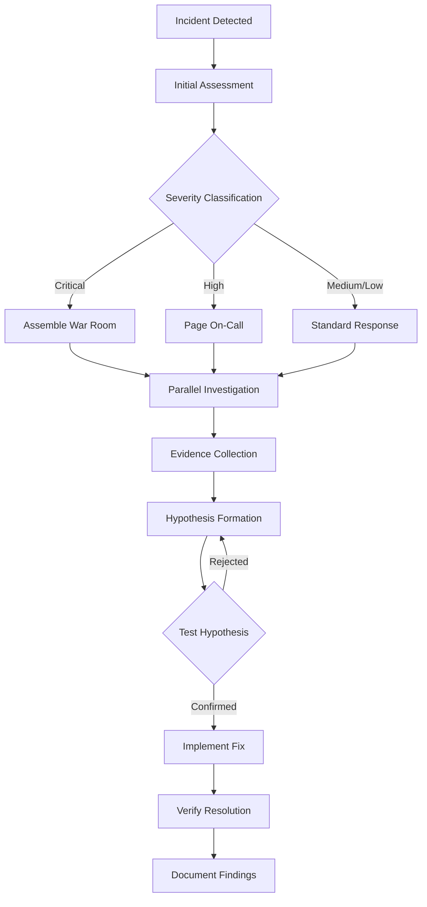
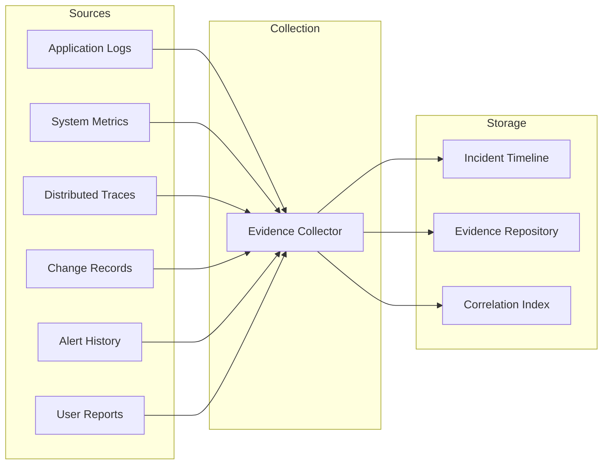
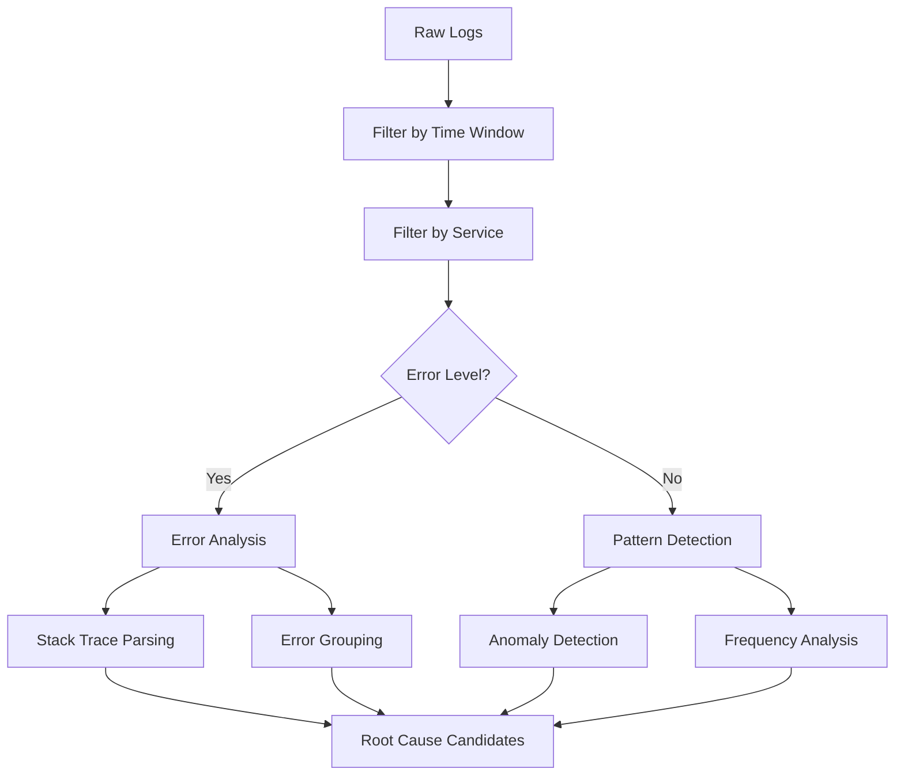
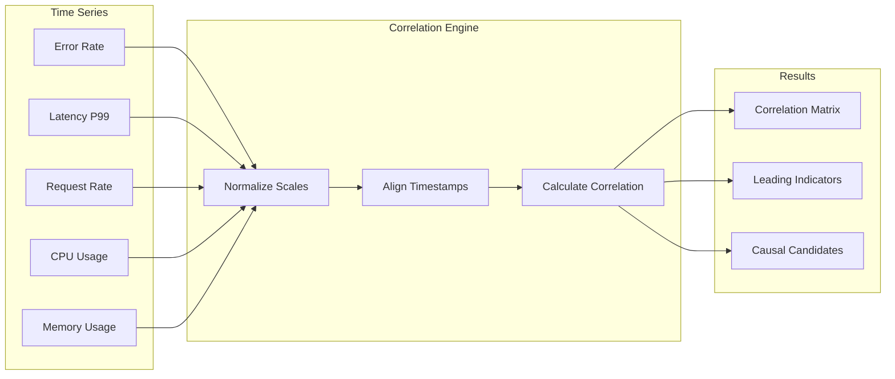
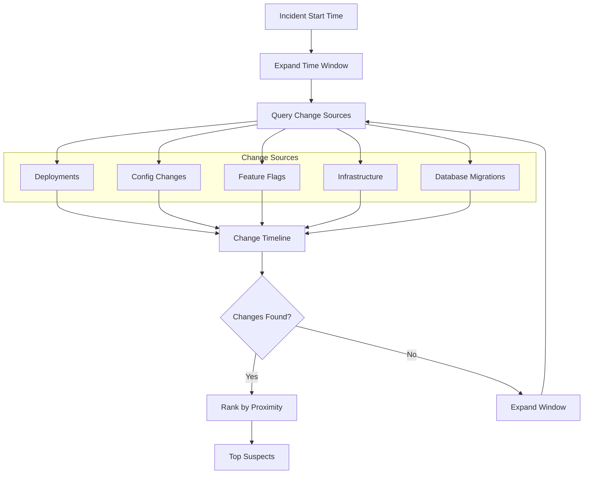
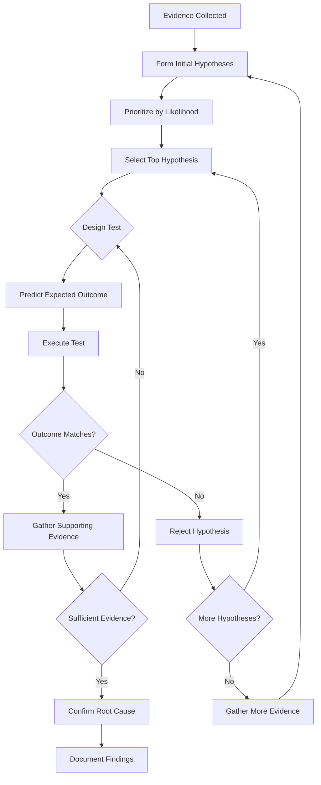
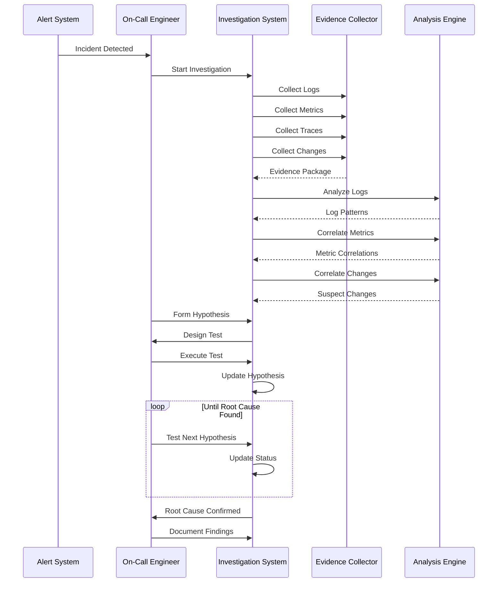

# How to Build Incident Investigation

Author: [nawazdhandala](https://github.com/nawazdhandala)

Tags: Incident Management, Investigation, SRE, Debugging

Description: Learn systematic approaches to investigating incidents effectively.

---

When an incident strikes, every second counts. The difference between a five-minute resolution and an hour-long outage often comes down to how systematically you investigate. This guide walks through building effective incident investigation processes that help you find root causes faster and prevent future occurrences.

---

## Investigation Methodology

A structured investigation methodology prevents chaos during incidents. Without a clear process, engineers waste time chasing symptoms instead of causes, duplicate effort, or miss critical evidence.

The following diagram shows the core investigation flow that high-performing teams follow.



Here is a practical implementation of an investigation tracker that keeps your team organized during an incident.

```typescript
// Investigation tracker for incident management
// Maintains state and timeline throughout the investigation
interface InvestigationState {
  incidentId: string;
  severity: 'critical' | 'high' | 'medium' | 'low';
  startTime: Date;
  currentPhase: InvestigationPhase;
  hypotheses: Hypothesis[];
  evidence: Evidence[];
  timeline: TimelineEntry[];
}

type InvestigationPhase =
  | 'detection'
  | 'assessment'
  | 'investigation'
  | 'mitigation'
  | 'resolution'
  | 'postmortem';

interface Hypothesis {
  id: string;
  description: string;
  status: 'active' | 'confirmed' | 'rejected';
  evidence: string[];  // References to Evidence ids
  createdBy: string;
  createdAt: Date;
}

interface Evidence {
  id: string;
  type: 'log' | 'metric' | 'trace' | 'change' | 'alert' | 'observation';
  source: string;
  content: string;
  timestamp: Date;
  relevance: 'high' | 'medium' | 'low';
}

interface TimelineEntry {
  timestamp: Date;
  action: string;
  actor: string;
  outcome?: string;
}

class IncidentInvestigation {
  private state: InvestigationState;

  constructor(incidentId: string, severity: InvestigationState['severity']) {
    this.state = {
      incidentId,
      severity,
      startTime: new Date(),
      currentPhase: 'detection',
      hypotheses: [],
      evidence: [],
      timeline: []
    };
    this.logAction('Incident investigation started', 'system');
  }

  // Advance to the next investigation phase
  advancePhase(newPhase: InvestigationPhase): void {
    const previousPhase = this.state.currentPhase;
    this.state.currentPhase = newPhase;
    this.logAction(
      `Phase transition: ${previousPhase} -> ${newPhase}`,
      'system'
    );
  }

  // Add a new hypothesis to investigate
  addHypothesis(description: string, createdBy: string): string {
    const hypothesis: Hypothesis = {
      id: `hyp-${Date.now()}`,
      description,
      status: 'active',
      evidence: [],
      createdBy,
      createdAt: new Date()
    };
    this.state.hypotheses.push(hypothesis);
    this.logAction(`New hypothesis: ${description}`, createdBy);
    return hypothesis.id;
  }

  // Record evidence found during investigation
  addEvidence(evidence: Omit<Evidence, 'id'>): string {
    const newEvidence: Evidence = {
      ...evidence,
      id: `ev-${Date.now()}`
    };
    this.state.evidence.push(newEvidence);
    this.logAction(
      `Evidence collected: ${evidence.type} from ${evidence.source}`,
      'system'
    );
    return newEvidence.id;
  }

  // Link evidence to a hypothesis
  linkEvidenceToHypothesis(
    hypothesisId: string,
    evidenceId: string
  ): void {
    const hypothesis = this.state.hypotheses.find(h => h.id === hypothesisId);
    if (hypothesis) {
      hypothesis.evidence.push(evidenceId);
    }
  }

  // Update hypothesis status after testing
  updateHypothesisStatus(
    hypothesisId: string,
    status: 'confirmed' | 'rejected',
    actor: string
  ): void {
    const hypothesis = this.state.hypotheses.find(h => h.id === hypothesisId);
    if (hypothesis) {
      hypothesis.status = status;
      this.logAction(
        `Hypothesis ${status}: ${hypothesis.description}`,
        actor
      );
    }
  }

  // Record an action in the timeline
  private logAction(action: string, actor: string, outcome?: string): void {
    this.state.timeline.push({
      timestamp: new Date(),
      action,
      actor,
      outcome
    });
  }

  // Get current investigation summary
  getSummary(): object {
    return {
      incidentId: this.state.incidentId,
      duration: Date.now() - this.state.startTime.getTime(),
      phase: this.state.currentPhase,
      activeHypotheses: this.state.hypotheses.filter(h => h.status === 'active').length,
      evidenceCount: this.state.evidence.length,
      timelineEntries: this.state.timeline.length
    };
  }
}
```

---

## Evidence Collection

Evidence collection is the foundation of effective investigation. Without proper evidence, you are guessing. The key is knowing what to collect, where to find it, and how to preserve it.



Here is a practical evidence collector that gathers data from multiple sources.

```python
# Evidence collector for incident investigation
# Aggregates data from logs, metrics, traces, and changes
from dataclasses import dataclass, field
from datetime import datetime, timedelta
from typing import List, Dict, Optional, Any
from enum import Enum
import asyncio

class EvidenceType(Enum):
    LOG = "log"
    METRIC = "metric"
    TRACE = "trace"
    CHANGE = "change"
    ALERT = "alert"
    OBSERVATION = "observation"

@dataclass
class Evidence:
    evidence_type: EvidenceType
    source: str
    timestamp: datetime
    content: Dict[str, Any]
    relevance_score: float = 0.0
    tags: List[str] = field(default_factory=list)

@dataclass
class EvidenceQuery:
    start_time: datetime
    end_time: datetime
    services: List[str]
    keywords: List[str] = field(default_factory=list)
    severity_filter: Optional[str] = None

class EvidenceCollector:
    """
    Collects and correlates evidence from multiple observability sources.
    Use this during incident investigation to gather relevant data points.
    """

    def __init__(self, config: Dict[str, Any]):
        self.log_client = config.get('log_client')
        self.metrics_client = config.get('metrics_client')
        self.trace_client = config.get('trace_client')
        self.change_client = config.get('change_client')
        self.collected_evidence: List[Evidence] = []

    async def collect_all(self, query: EvidenceQuery) -> List[Evidence]:
        """
        Collect evidence from all sources in parallel.
        Returns a time-sorted list of evidence items.
        """
        # Run all collectors concurrently for faster gathering
        results = await asyncio.gather(
            self._collect_logs(query),
            self._collect_metrics(query),
            self._collect_traces(query),
            self._collect_changes(query),
            return_exceptions=True
        )

        # Flatten results and filter out errors
        all_evidence = []
        for result in results:
            if isinstance(result, list):
                all_evidence.extend(result)
            elif isinstance(result, Exception):
                # Log collection error but continue with other sources
                print(f"Collection error: {result}")

        # Sort by timestamp and calculate relevance
        all_evidence.sort(key=lambda e: e.timestamp)
        self._calculate_relevance(all_evidence, query)

        self.collected_evidence = all_evidence
        return all_evidence

    async def _collect_logs(self, query: EvidenceQuery) -> List[Evidence]:
        """Collect log entries matching the query parameters."""
        evidence = []

        # Query logs for each service in the affected scope
        for service in query.services:
            logs = await self.log_client.query(
                service=service,
                start=query.start_time,
                end=query.end_time,
                level=['ERROR', 'WARN', 'FATAL'] if query.severity_filter else None
            )

            for log in logs:
                evidence.append(Evidence(
                    evidence_type=EvidenceType.LOG,
                    source=f"logs/{service}",
                    timestamp=log['timestamp'],
                    content={
                        'message': log['message'],
                        'level': log['level'],
                        'trace_id': log.get('trace_id'),
                        'attributes': log.get('attributes', {})
                    },
                    tags=[service, log['level']]
                ))

        return evidence

    async def _collect_metrics(self, query: EvidenceQuery) -> List[Evidence]:
        """Collect metric anomalies during the incident window."""
        evidence = []

        # Key metrics to check during any incident
        metric_queries = [
            'error_rate',
            'latency_p99',
            'request_rate',
            'cpu_utilization',
            'memory_utilization',
            'connection_pool_usage'
        ]

        for service in query.services:
            for metric_name in metric_queries:
                # Get metric data with anomaly detection
                metric_data = await self.metrics_client.query_with_anomalies(
                    metric=metric_name,
                    service=service,
                    start=query.start_time,
                    end=query.end_time
                )

                # Only include if anomalies detected
                if metric_data.get('anomalies'):
                    for anomaly in metric_data['anomalies']:
                        evidence.append(Evidence(
                            evidence_type=EvidenceType.METRIC,
                            source=f"metrics/{service}/{metric_name}",
                            timestamp=anomaly['timestamp'],
                            content={
                                'metric': metric_name,
                                'value': anomaly['value'],
                                'baseline': anomaly['baseline'],
                                'deviation': anomaly['deviation']
                            },
                            tags=[service, metric_name, 'anomaly']
                        ))

        return evidence

    async def _collect_traces(self, query: EvidenceQuery) -> List[Evidence]:
        """Collect error and slow traces from the incident window."""
        evidence = []

        # Query for error traces
        error_traces = await self.trace_client.query(
            services=query.services,
            start=query.start_time,
            end=query.end_time,
            status='ERROR'
        )

        for trace in error_traces:
            evidence.append(Evidence(
                evidence_type=EvidenceType.TRACE,
                source=f"traces/{trace['service']}",
                timestamp=trace['start_time'],
                content={
                    'trace_id': trace['trace_id'],
                    'duration_ms': trace['duration_ms'],
                    'error': trace.get('error'),
                    'span_count': trace['span_count'],
                    'services_involved': trace['services']
                },
                tags=trace['services'] + ['error']
            ))

        return evidence

    async def _collect_changes(self, query: EvidenceQuery) -> List[Evidence]:
        """Collect deployment and configuration changes."""
        evidence = []

        # Expand time window for changes - they often precede incidents
        change_start = query.start_time - timedelta(hours=2)

        changes = await self.change_client.query(
            services=query.services,
            start=change_start,
            end=query.end_time
        )

        for change in changes:
            evidence.append(Evidence(
                evidence_type=EvidenceType.CHANGE,
                source=f"changes/{change['service']}",
                timestamp=change['timestamp'],
                content={
                    'change_type': change['type'],
                    'description': change['description'],
                    'author': change['author'],
                    'commit': change.get('commit'),
                    'rollback_available': change.get('rollback_available', False)
                },
                tags=[change['service'], change['type']]
            ))

        return evidence

    def _calculate_relevance(
        self,
        evidence: List[Evidence],
        query: EvidenceQuery
    ) -> None:
        """
        Calculate relevance scores based on timing and content.
        Higher scores indicate more likely relation to the incident.
        """
        incident_midpoint = query.start_time + (query.end_time - query.start_time) / 2

        for item in evidence:
            score = 0.0

            # Time proximity to incident (closer = higher score)
            time_diff = abs((item.timestamp - incident_midpoint).total_seconds())
            max_diff = (query.end_time - query.start_time).total_seconds() / 2
            time_score = 1.0 - (time_diff / max_diff) if max_diff > 0 else 1.0
            score += time_score * 0.4

            # Keyword matches in content
            content_str = str(item.content).lower()
            keyword_matches = sum(
                1 for kw in query.keywords
                if kw.lower() in content_str
            )
            score += min(keyword_matches * 0.1, 0.3)

            # Type-based scoring
            type_weights = {
                EvidenceType.CHANGE: 0.2,  # Changes are often root causes
                EvidenceType.ALERT: 0.1,
                EvidenceType.LOG: 0.05,
                EvidenceType.TRACE: 0.1,
                EvidenceType.METRIC: 0.05
            }
            score += type_weights.get(item.evidence_type, 0)

            item.relevance_score = min(score, 1.0)
```

---

## Log Analysis Techniques

Logs are often the most detailed source of evidence during an incident. The challenge is finding the relevant entries among thousands of lines.



Here is a log analyzer that helps extract meaningful patterns from incident logs.

```typescript
// Log analysis utilities for incident investigation
// Provides filtering, pattern detection, and anomaly identification

interface LogEntry {
  timestamp: Date;
  level: string;
  service: string;
  message: string;
  traceId?: string;
  spanId?: string;
  attributes: Record<string, any>;
}

interface LogPattern {
  pattern: string;
  count: number;
  firstSeen: Date;
  lastSeen: Date;
  examples: LogEntry[];
  services: Set<string>;
}

interface AnalysisResult {
  totalLogs: number;
  errorCount: number;
  warningCount: number;
  patterns: LogPattern[];
  anomalies: LogEntry[];
  timeline: Map<string, number>;
}

class LogAnalyzer {
  private logs: LogEntry[] = [];
  private baselinePatterns: Map<string, number> = new Map();

  constructor(baselinePatterns?: Map<string, number>) {
    if (baselinePatterns) {
      this.baselinePatterns = baselinePatterns;
    }
  }

  // Load logs for analysis
  loadLogs(logs: LogEntry[]): void {
    this.logs = logs.sort(
      (a, b) => a.timestamp.getTime() - b.timestamp.getTime()
    );
  }

  // Run full analysis on loaded logs
  analyze(): AnalysisResult {
    const errorLogs = this.logs.filter(l => l.level === 'ERROR');
    const warningLogs = this.logs.filter(l => l.level === 'WARN');

    return {
      totalLogs: this.logs.length,
      errorCount: errorLogs.length,
      warningCount: warningLogs.length,
      patterns: this.detectPatterns(),
      anomalies: this.detectAnomalies(),
      timeline: this.buildTimeline()
    };
  }

  // Extract patterns from log messages
  private detectPatterns(): LogPattern[] {
    const patterns = new Map<string, LogPattern>();

    for (const log of this.logs) {
      // Normalize the message to create a pattern
      const normalized = this.normalizeMessage(log.message);

      if (patterns.has(normalized)) {
        const pattern = patterns.get(normalized)!;
        pattern.count++;
        pattern.lastSeen = log.timestamp;
        pattern.services.add(log.service);
        // Keep up to 5 examples
        if (pattern.examples.length < 5) {
          pattern.examples.push(log);
        }
      } else {
        patterns.set(normalized, {
          pattern: normalized,
          count: 1,
          firstSeen: log.timestamp,
          lastSeen: log.timestamp,
          examples: [log],
          services: new Set([log.service])
        });
      }
    }

    // Sort by count descending
    return Array.from(patterns.values())
      .sort((a, b) => b.count - a.count);
  }

  // Normalize message by replacing variable parts
  private normalizeMessage(message: string): string {
    return message
      // Replace UUIDs
      .replace(
        /[0-9a-f]{8}-[0-9a-f]{4}-[0-9a-f]{4}-[0-9a-f]{4}-[0-9a-f]{12}/gi,
        '{uuid}'
      )
      // Replace hex IDs
      .replace(/\b[0-9a-f]{16,}\b/gi, '{id}')
      // Replace numbers
      .replace(/\b\d+\b/g, '{n}')
      // Replace IP addresses
      .replace(/\d{1,3}\.\d{1,3}\.\d{1,3}\.\d{1,3}/g, '{ip}')
      // Replace timestamps
      .replace(
        /\d{4}-\d{2}-\d{2}[T ]\d{2}:\d{2}:\d{2}/g,
        '{timestamp}'
      )
      // Normalize whitespace
      .replace(/\s+/g, ' ')
      .trim();
  }

  // Detect anomalous log entries
  private detectAnomalies(): LogEntry[] {
    const anomalies: LogEntry[] = [];
    const patternCounts = new Map<string, number>();

    // Count patterns in current logs
    for (const log of this.logs) {
      const normalized = this.normalizeMessage(log.message);
      patternCounts.set(
        normalized,
        (patternCounts.get(normalized) || 0) + 1
      );
    }

    // Compare against baseline
    for (const log of this.logs) {
      const normalized = this.normalizeMessage(log.message);
      const currentCount = patternCounts.get(normalized) || 0;
      const baselineCount = this.baselinePatterns.get(normalized) || 0;

      // Flag as anomaly if pattern is new or significantly increased
      const isNewPattern = baselineCount === 0 && currentCount > 5;
      const isSpike = baselineCount > 0 &&
                      currentCount > baselineCount * 10;

      if (isNewPattern || isSpike) {
        if (!anomalies.find(a =>
          this.normalizeMessage(a.message) === normalized
        )) {
          anomalies.push(log);
        }
      }
    }

    return anomalies;
  }

  // Build a timeline of log frequency
  private buildTimeline(): Map<string, number> {
    const timeline = new Map<string, number>();
    const bucketSize = 60000; // 1 minute buckets

    for (const log of this.logs) {
      const bucket = Math.floor(
        log.timestamp.getTime() / bucketSize
      ) * bucketSize;
      const key = new Date(bucket).toISOString();
      timeline.set(key, (timeline.get(key) || 0) + 1);
    }

    return timeline;
  }

  // Search logs for specific patterns
  searchLogs(query: {
    keywords?: string[];
    level?: string;
    service?: string;
    traceId?: string;
    startTime?: Date;
    endTime?: Date;
  }): LogEntry[] {
    return this.logs.filter(log => {
      if (query.level && log.level !== query.level) return false;
      if (query.service && log.service !== query.service) return false;
      if (query.traceId && log.traceId !== query.traceId) return false;
      if (query.startTime && log.timestamp < query.startTime) return false;
      if (query.endTime && log.timestamp > query.endTime) return false;
      if (query.keywords?.length) {
        const messageL = log.message.toLowerCase();
        return query.keywords.some(kw => messageL.includes(kw.toLowerCase()));
      }
      return true;
    });
  }
}
```

---

## Metric Correlation

Metrics provide quantitative evidence of system behavior. During an incident, correlating metrics helps identify what changed and when.



Here is a metric correlator that helps identify related signals during an incident.

```python
# Metric correlation for incident investigation
# Identifies relationships between different metrics during incidents
import numpy as np
from dataclasses import dataclass
from typing import List, Dict, Tuple, Optional
from datetime import datetime, timedelta

@dataclass
class MetricSeries:
    name: str
    service: str
    timestamps: List[datetime]
    values: List[float]
    unit: str

@dataclass
class CorrelationResult:
    metric_a: str
    metric_b: str
    correlation: float
    lag_seconds: int  # Positive = A leads B
    significance: float

class MetricCorrelator:
    """
    Correlates metrics to identify relationships during incidents.
    Helps find leading indicators and potential root causes.
    """

    def __init__(self, max_lag_seconds: int = 300):
        self.max_lag = max_lag_seconds
        self.metrics: Dict[str, MetricSeries] = {}

    def add_metric(self, metric: MetricSeries) -> None:
        """Add a metric series for correlation analysis."""
        key = f"{metric.service}/{metric.name}"
        self.metrics[key] = metric

    def correlate_all(self) -> List[CorrelationResult]:
        """
        Calculate correlations between all metric pairs.
        Returns results sorted by correlation strength.
        """
        results = []
        metric_keys = list(self.metrics.keys())

        for i, key_a in enumerate(metric_keys):
            for key_b in metric_keys[i + 1:]:
                result = self._correlate_pair(key_a, key_b)
                if result:
                    results.append(result)

        # Sort by absolute correlation value
        results.sort(key=lambda r: abs(r.correlation), reverse=True)
        return results

    def find_leading_indicators(
        self,
        target_metric: str
    ) -> List[CorrelationResult]:
        """
        Find metrics that change before the target metric.
        Useful for identifying early warning signals.
        """
        results = []

        for key in self.metrics:
            if key == target_metric:
                continue

            result = self._correlate_pair(key, target_metric)
            if result and result.lag_seconds > 0:
                # Positive lag means the other metric leads
                results.append(result)

        # Sort by lag time (earliest indicator first)
        results.sort(key=lambda r: r.lag_seconds, reverse=True)
        return results

    def _correlate_pair(
        self,
        key_a: str,
        key_b: str
    ) -> Optional[CorrelationResult]:
        """Calculate cross-correlation between two metric series."""
        metric_a = self.metrics[key_a]
        metric_b = self.metrics[key_b]

        # Align time series to common timestamps
        aligned_a, aligned_b = self._align_series(metric_a, metric_b)

        if len(aligned_a) < 10:
            return None  # Not enough data points

        # Normalize the series
        norm_a = self._normalize(aligned_a)
        norm_b = self._normalize(aligned_b)

        # Calculate cross-correlation at different lags
        best_corr = 0.0
        best_lag = 0

        lag_range = range(
            -self.max_lag // 60,
            self.max_lag // 60 + 1
        )

        for lag in lag_range:
            if lag < 0:
                corr = np.corrcoef(norm_a[:lag], norm_b[-lag:])[0, 1]
            elif lag > 0:
                corr = np.corrcoef(norm_a[lag:], norm_b[:-lag])[0, 1]
            else:
                corr = np.corrcoef(norm_a, norm_b)[0, 1]

            if not np.isnan(corr) and abs(corr) > abs(best_corr):
                best_corr = corr
                best_lag = lag * 60  # Convert to seconds

        # Calculate significance (simplified)
        n = len(aligned_a)
        if abs(best_corr) < 1:
            t_stat = best_corr * np.sqrt(n - 2) / np.sqrt(1 - best_corr**2)
            significance = min(abs(t_stat) / 10, 1.0)
        else:
            significance = 1.0

        return CorrelationResult(
            metric_a=key_a,
            metric_b=key_b,
            correlation=best_corr,
            lag_seconds=best_lag,
            significance=significance
        )

    def _align_series(
        self,
        a: MetricSeries,
        b: MetricSeries
    ) -> Tuple[np.ndarray, np.ndarray]:
        """Align two series to common timestamps via interpolation."""
        # Find common time range
        start = max(min(a.timestamps), min(b.timestamps))
        end = min(max(a.timestamps), max(b.timestamps))

        # Create common timestamp grid (1-minute resolution)
        common_times = []
        current = start
        while current <= end:
            common_times.append(current)
            current += timedelta(minutes=1)

        # Interpolate both series to common grid
        aligned_a = self._interpolate(a, common_times)
        aligned_b = self._interpolate(b, common_times)

        return np.array(aligned_a), np.array(aligned_b)

    def _interpolate(
        self,
        series: MetricSeries,
        target_times: List[datetime]
    ) -> List[float]:
        """Linear interpolation of metric series to target timestamps."""
        result = []

        for target in target_times:
            # Find surrounding points
            before_idx = None
            after_idx = None

            for i, ts in enumerate(series.timestamps):
                if ts <= target:
                    before_idx = i
                if ts >= target and after_idx is None:
                    after_idx = i
                    break

            if before_idx is None:
                result.append(series.values[0])
            elif after_idx is None:
                result.append(series.values[-1])
            elif before_idx == after_idx:
                result.append(series.values[before_idx])
            else:
                # Linear interpolation
                t1 = series.timestamps[before_idx].timestamp()
                t2 = series.timestamps[after_idx].timestamp()
                t = target.timestamp()
                v1 = series.values[before_idx]
                v2 = series.values[after_idx]

                ratio = (t - t1) / (t2 - t1) if t2 != t1 else 0
                result.append(v1 + ratio * (v2 - v1))

        return result

    def _normalize(self, values: np.ndarray) -> np.ndarray:
        """Normalize to zero mean and unit variance."""
        mean = np.mean(values)
        std = np.std(values)
        if std == 0:
            return values - mean
        return (values - mean) / std
```

---

## Change Correlation

Changes are frequently the root cause of incidents. Correlating changes with incident timing is a critical investigation technique.



Here is a change correlator implementation.

```typescript
// Change correlation for incident investigation
// Links incidents to recent deployments and configuration changes

interface Change {
  id: string;
  timestamp: Date;
  type: 'deployment' | 'config' | 'feature_flag' | 'infrastructure' | 'database';
  service: string;
  description: string;
  author: string;
  metadata: {
    commit?: string;
    version?: string;
    previousVersion?: string;
    rollbackAvailable?: boolean;
    affectedComponents?: string[];
  };
}

interface ChangeCorrelation {
  change: Change;
  score: number;
  factors: string[];
  timeDelta: number;  // Seconds between change and incident
}

interface IncidentContext {
  startTime: Date;
  affectedServices: string[];
  symptoms: string[];
  errorPatterns: string[];
}

class ChangeCorrelator {
  private changes: Change[] = [];
  private lookbackWindow: number = 2 * 60 * 60 * 1000; // 2 hours default

  constructor(lookbackMs?: number) {
    if (lookbackMs) {
      this.lookbackWindow = lookbackMs;
    }
  }

  // Load changes from multiple sources
  async loadChanges(
    sources: {
      deployments?: Change[];
      configs?: Change[];
      featureFlags?: Change[];
      infrastructure?: Change[];
      database?: Change[];
    }
  ): Promise<void> {
    this.changes = [
      ...(sources.deployments || []),
      ...(sources.configs || []),
      ...(sources.featureFlags || []),
      ...(sources.infrastructure || []),
      ...(sources.database || [])
    ].sort((a, b) => b.timestamp.getTime() - a.timestamp.getTime());
  }

  // Find changes correlated with an incident
  correlate(context: IncidentContext): ChangeCorrelation[] {
    const windowStart = new Date(
      context.startTime.getTime() - this.lookbackWindow
    );

    // Filter changes within the lookback window
    const relevantChanges = this.changes.filter(change =>
      change.timestamp >= windowStart &&
      change.timestamp <= context.startTime
    );

    // Score each change
    const correlations: ChangeCorrelation[] = relevantChanges.map(change => {
      const { score, factors } = this.scoreChange(change, context);
      return {
        change,
        score,
        factors,
        timeDelta: Math.round(
          (context.startTime.getTime() - change.timestamp.getTime()) / 1000
        )
      };
    });

    // Sort by score descending
    return correlations.sort((a, b) => b.score - a.score);
  }

  // Calculate correlation score for a change
  private scoreChange(
    change: Change,
    context: IncidentContext
  ): { score: number; factors: string[] } {
    let score = 0;
    const factors: string[] = [];

    // Time proximity (closer = higher score)
    const timeDelta = context.startTime.getTime() - change.timestamp.getTime();
    const timeScore = 1 - (timeDelta / this.lookbackWindow);
    score += timeScore * 30;
    factors.push(`Time proximity: ${Math.round(timeScore * 100)}%`);

    // Service overlap
    const affectedByChange = new Set(
      change.metadata.affectedComponents || [change.service]
    );
    const serviceOverlap = context.affectedServices.filter(
      s => affectedByChange.has(s)
    );
    if (serviceOverlap.length > 0) {
      const overlapScore = serviceOverlap.length / context.affectedServices.length;
      score += overlapScore * 40;
      factors.push(`Service overlap: ${serviceOverlap.join(', ')}`);
    }

    // Change type risk scoring
    const typeRisk: Record<string, number> = {
      deployment: 25,
      database: 20,
      infrastructure: 15,
      config: 10,
      feature_flag: 5
    };
    score += typeRisk[change.type] || 5;
    factors.push(`Change type: ${change.type}`);

    // Check for keyword matches in description
    const descLower = change.description.toLowerCase();
    const matchingSymptoms = context.symptoms.filter(
      s => descLower.includes(s.toLowerCase())
    );
    if (matchingSymptoms.length > 0) {
      score += 15;
      factors.push(`Keyword matches: ${matchingSymptoms.join(', ')}`);
    }

    // Boost if rollback is available (indicates it might be the cause)
    if (change.metadata.rollbackAvailable) {
      factors.push('Rollback available');
    }

    return { score: Math.min(score, 100), factors };
  }

  // Get changes that affected a specific service
  getChangesForService(
    service: string,
    since: Date
  ): Change[] {
    return this.changes.filter(change => {
      const affectsService =
        change.service === service ||
        change.metadata.affectedComponents?.includes(service);
      return affectsService && change.timestamp >= since;
    });
  }

  // Generate a timeline of changes
  getChangeTimeline(
    startTime: Date,
    endTime: Date
  ): Map<string, Change[]> {
    const timeline = new Map<string, Change[]>();

    for (const change of this.changes) {
      if (change.timestamp >= startTime && change.timestamp <= endTime) {
        const hour = new Date(change.timestamp);
        hour.setMinutes(0, 0, 0);
        const key = hour.toISOString();

        if (!timeline.has(key)) {
          timeline.set(key, []);
        }
        timeline.get(key)!.push(change);
      }
    }

    return timeline;
  }
}
```

---

## Hypothesis Testing

Effective incident investigation requires forming and testing hypotheses systematically. This prevents tunnel vision and ensures you consider multiple potential causes.



Here is a hypothesis testing framework for incident investigation.

```python
# Hypothesis testing framework for incident investigation
# Provides structured approach to root cause analysis
from dataclasses import dataclass, field
from datetime import datetime
from typing import List, Dict, Optional, Callable, Any
from enum import Enum

class HypothesisStatus(Enum):
    PROPOSED = "proposed"
    TESTING = "testing"
    CONFIRMED = "confirmed"
    REJECTED = "rejected"
    INCONCLUSIVE = "inconclusive"

class TestType(Enum):
    LOG_SEARCH = "log_search"
    METRIC_CHECK = "metric_check"
    TRACE_ANALYSIS = "trace_analysis"
    CONFIG_COMPARE = "config_compare"
    ROLLBACK_TEST = "rollback_test"
    CANARY_DEPLOY = "canary_deploy"

@dataclass
class Test:
    test_type: TestType
    description: str
    expected_outcome: str
    actual_outcome: Optional[str] = None
    passed: Optional[bool] = None
    executed_at: Optional[datetime] = None
    executed_by: Optional[str] = None

@dataclass
class Hypothesis:
    id: str
    description: str
    proposed_by: str
    proposed_at: datetime
    status: HypothesisStatus = HypothesisStatus.PROPOSED
    likelihood: float = 0.5  # 0.0 to 1.0
    supporting_evidence: List[str] = field(default_factory=list)
    contradicting_evidence: List[str] = field(default_factory=list)
    tests: List[Test] = field(default_factory=list)
    notes: List[str] = field(default_factory=list)

class HypothesisManager:
    """
    Manages hypotheses during incident investigation.
    Provides structured approach to testing and elimination.
    """

    def __init__(self, incident_id: str):
        self.incident_id = incident_id
        self.hypotheses: Dict[str, Hypothesis] = {}
        self.hypothesis_counter = 0

    def propose(
        self,
        description: str,
        proposed_by: str,
        initial_evidence: List[str] = None,
        likelihood: float = 0.5
    ) -> str:
        """Propose a new hypothesis for investigation."""
        self.hypothesis_counter += 1
        hyp_id = f"H{self.hypothesis_counter}"

        hypothesis = Hypothesis(
            id=hyp_id,
            description=description,
            proposed_by=proposed_by,
            proposed_at=datetime.now(),
            likelihood=likelihood,
            supporting_evidence=initial_evidence or []
        )

        self.hypotheses[hyp_id] = hypothesis
        return hyp_id

    def add_evidence(
        self,
        hypothesis_id: str,
        evidence: str,
        supports: bool
    ) -> None:
        """Add supporting or contradicting evidence to a hypothesis."""
        hyp = self.hypotheses.get(hypothesis_id)
        if not hyp:
            return

        if supports:
            hyp.supporting_evidence.append(evidence)
            # Increase likelihood based on supporting evidence
            hyp.likelihood = min(hyp.likelihood + 0.1, 0.95)
        else:
            hyp.contradicting_evidence.append(evidence)
            # Decrease likelihood based on contradicting evidence
            hyp.likelihood = max(hyp.likelihood - 0.15, 0.05)

    def design_test(
        self,
        hypothesis_id: str,
        test_type: TestType,
        description: str,
        expected_outcome: str
    ) -> int:
        """Design a test to validate or invalidate a hypothesis."""
        hyp = self.hypotheses.get(hypothesis_id)
        if not hyp:
            return -1

        test = Test(
            test_type=test_type,
            description=description,
            expected_outcome=expected_outcome
        )
        hyp.tests.append(test)
        return len(hyp.tests) - 1

    def record_test_result(
        self,
        hypothesis_id: str,
        test_index: int,
        actual_outcome: str,
        passed: bool,
        executed_by: str
    ) -> None:
        """Record the result of a hypothesis test."""
        hyp = self.hypotheses.get(hypothesis_id)
        if not hyp or test_index >= len(hyp.tests):
            return

        test = hyp.tests[test_index]
        test.actual_outcome = actual_outcome
        test.passed = passed
        test.executed_at = datetime.now()
        test.executed_by = executed_by

        # Update hypothesis status and likelihood
        hyp.status = HypothesisStatus.TESTING

        if passed:
            hyp.likelihood = min(hyp.likelihood + 0.2, 0.95)
        else:
            hyp.likelihood = max(hyp.likelihood - 0.3, 0.05)

        # Check if we should update status
        self._evaluate_hypothesis_status(hypothesis_id)

    def _evaluate_hypothesis_status(self, hypothesis_id: str) -> None:
        """Evaluate whether hypothesis should be confirmed or rejected."""
        hyp = self.hypotheses.get(hypothesis_id)
        if not hyp:
            return

        completed_tests = [t for t in hyp.tests if t.passed is not None]

        if len(completed_tests) >= 2:
            passed_tests = [t for t in completed_tests if t.passed]
            failed_tests = [t for t in completed_tests if not t.passed]

            # Confirm if high likelihood and multiple passing tests
            if hyp.likelihood >= 0.8 and len(passed_tests) >= 2:
                hyp.status = HypothesisStatus.CONFIRMED

            # Reject if low likelihood and multiple failing tests
            elif hyp.likelihood <= 0.2 and len(failed_tests) >= 2:
                hyp.status = HypothesisStatus.REJECTED

    def confirm(self, hypothesis_id: str, notes: str = None) -> None:
        """Manually confirm a hypothesis as the root cause."""
        hyp = self.hypotheses.get(hypothesis_id)
        if hyp:
            hyp.status = HypothesisStatus.CONFIRMED
            hyp.likelihood = 1.0
            if notes:
                hyp.notes.append(f"Confirmed: {notes}")

    def reject(self, hypothesis_id: str, reason: str = None) -> None:
        """Manually reject a hypothesis."""
        hyp = self.hypotheses.get(hypothesis_id)
        if hyp:
            hyp.status = HypothesisStatus.REJECTED
            hyp.likelihood = 0.0
            if reason:
                hyp.notes.append(f"Rejected: {reason}")

    def get_ranked_hypotheses(self) -> List[Hypothesis]:
        """Get hypotheses ranked by likelihood."""
        active = [
            h for h in self.hypotheses.values()
            if h.status not in [HypothesisStatus.REJECTED, HypothesisStatus.CONFIRMED]
        ]
        return sorted(active, key=lambda h: h.likelihood, reverse=True)

    def get_confirmed(self) -> Optional[Hypothesis]:
        """Get the confirmed root cause hypothesis, if any."""
        for hyp in self.hypotheses.values():
            if hyp.status == HypothesisStatus.CONFIRMED:
                return hyp
        return None

    def generate_summary(self) -> Dict[str, Any]:
        """Generate a summary of the hypothesis investigation."""
        confirmed = self.get_confirmed()

        return {
            "incident_id": self.incident_id,
            "total_hypotheses": len(self.hypotheses),
            "confirmed": confirmed.description if confirmed else None,
            "rejected_count": len([
                h for h in self.hypotheses.values()
                if h.status == HypothesisStatus.REJECTED
            ]),
            "active_hypotheses": [
                {
                    "id": h.id,
                    "description": h.description,
                    "likelihood": h.likelihood,
                    "tests_run": len([t for t in h.tests if t.passed is not None])
                }
                for h in self.get_ranked_hypotheses()
            ]
        }
```

---

## Putting It All Together

Here is how these components work together in a complete incident investigation workflow.



---

## Key Takeaways

Building effective incident investigation requires:

- **Structured methodology**: Follow a consistent process that prevents chaos and ensures thoroughness
- **Comprehensive evidence collection**: Gather logs, metrics, traces, and changes from all relevant sources
- **Correlation analysis**: Connect different signals to identify patterns and relationships
- **Systematic hypothesis testing**: Form hypotheses based on evidence and test them methodically
- **Documentation**: Record findings throughout the investigation for postmortems and future reference

The investment in building these capabilities pays dividends every time an incident occurs. Teams with strong investigation processes resolve incidents faster, find true root causes more often, and build lasting reliability improvements.

---

**Related Reading:**

- [Effective Incident Postmortem Templates: Ready-to-Use Examples](https://oneuptime.com/blog/post/2025-09-09-effective-incident-postmortem-templates-ready-to-use-examples/view)
- [The Five Stages of SRE Maturity](https://oneuptime.com/blog/post/2025-09-01-the-five-stages-of-sre-maturity/view)
- [Three Pillars of Observability: Logs, Metrics, Traces](https://oneuptime.com/blog/post/2025-08-20-three-pillars-of-observability-logs-metrics-traces/view)
