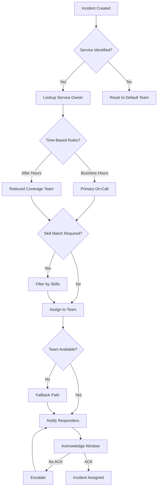
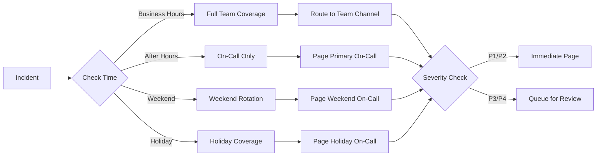
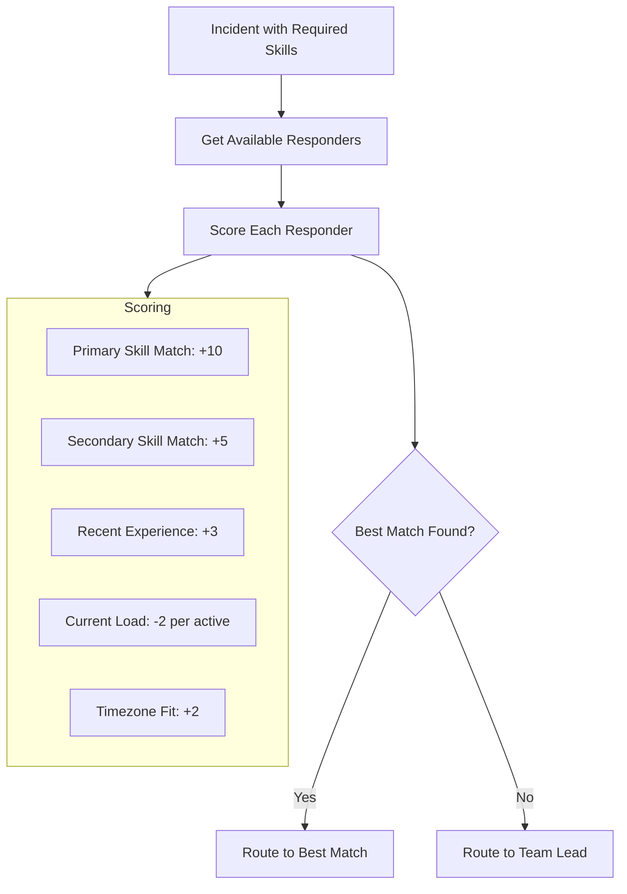
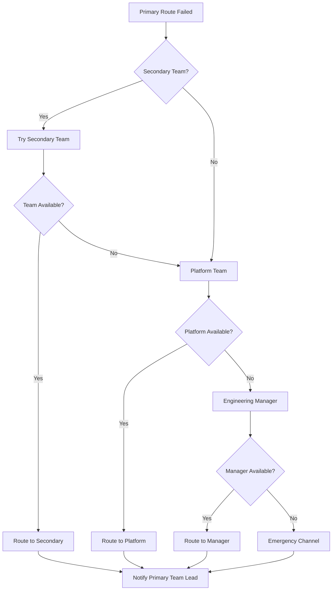
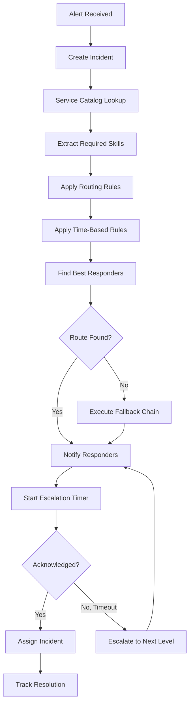

# How to Build Incident Routing

Author: [nawazdhandala](https://github.com/nawazdhandala)

Tags: Incident Management, SRE, Routing, Operations

Description: Learn how to route incidents to the right teams automatically.

---

Getting incidents to the right team quickly is the difference between a minor blip and a major outage. Manual routing wastes precious minutes during incidents when every second counts. This guide walks through building an automated incident routing system that directs alerts to the appropriate responders based on service ownership, time of day, skill requirements, and escalation policies.

For related context on on-call rotations, see our guide on [designing SRE on-call rotations](https://oneuptime.com/blog/post/2025-11-28-sre-on-call-rotation-design/view).

---

## Why Incident Routing Matters

Without proper routing:

- **Delayed response**: Incidents bounce between teams before reaching the right people
- **Alert fatigue**: Teams receive incidents they cannot resolve
- **Unclear ownership**: Nobody knows who should respond
- **Extended outages**: Resolution time increases as incidents wait in queue

A well-designed routing system ensures incidents reach the right team within seconds, not minutes.

---

## Routing Architecture Overview



---

## Service-to-Team Mapping

The foundation of incident routing is knowing which team owns which service. Create a service catalog that maps every monitored service to its owning team.

### Service Catalog Schema

```typescript
interface Service {
  id: string;
  name: string;
  description: string;
  tier: 'critical' | 'high' | 'medium' | 'low';
  primaryTeam: Team;
  secondaryTeam?: Team;
  escalationPolicy: EscalationPolicy;
  tags: string[];
  oncallSchedule: Schedule;
}

interface Team {
  id: string;
  name: string;
  slackChannel: string;
  email: string;
  members: TeamMember[];
  skills: string[];
}

interface TeamMember {
  id: string;
  name: string;
  email: string;
  phone: string;
  skills: string[];
  timezone: string;
}
```

### Service Catalog Configuration

```yaml
# service-catalog.yaml
services:
  - id: payment-api
    name: Payment API
    tier: critical
    primaryTeam: payments-team
    secondaryTeam: platform-team
    tags:
      - payments
      - pci
      - customer-facing
    escalationPolicy: critical-escalation
    oncallSchedule: payments-oncall

  - id: user-service
    name: User Service
    tier: high
    primaryTeam: identity-team
    tags:
      - authentication
      - customer-facing
    escalationPolicy: standard-escalation
    oncallSchedule: identity-oncall

  - id: analytics-pipeline
    name: Analytics Pipeline
    tier: medium
    primaryTeam: data-team
    tags:
      - batch-processing
      - internal
    escalationPolicy: business-hours-only
    oncallSchedule: data-oncall

teams:
  - id: payments-team
    name: Payments Team
    slackChannel: "#payments-oncall"
    email: payments-team@company.com
    skills:
      - payment-processing
      - pci-compliance
      - stripe-api

  - id: identity-team
    name: Identity Team
    slackChannel: "#identity-oncall"
    email: identity-team@company.com
    skills:
      - authentication
      - oauth
      - user-management

  - id: data-team
    name: Data Engineering
    slackChannel: "#data-oncall"
    email: data-team@company.com
    skills:
      - spark
      - kafka
      - data-pipelines
```

### Service Lookup Implementation

```typescript
class ServiceCatalog {
  private services: Map<string, Service> = new Map();
  private tagIndex: Map<string, Set<string>> = new Map();

  constructor(config: ServiceCatalogConfig) {
    this.loadServices(config);
    this.buildTagIndex();
  }

  // Find service by exact ID
  getService(serviceId: string): Service | undefined {
    return this.services.get(serviceId);
  }

  // Find services by tag
  getServicesByTag(tag: string): Service[] {
    const serviceIds = this.tagIndex.get(tag) || new Set();
    return Array.from(serviceIds)
      .map(id => this.services.get(id))
      .filter((s): s is Service => s !== undefined);
  }

  // Find owner team for a service
  getOwnerTeam(serviceId: string): Team | undefined {
    const service = this.services.get(serviceId);
    return service?.primaryTeam;
  }

  // Find service from alert metadata
  resolveServiceFromAlert(alert: Alert): Service | undefined {
    // Try exact service ID match
    if (alert.serviceId && this.services.has(alert.serviceId)) {
      return this.services.get(alert.serviceId);
    }

    // Try matching by labels/tags
    for (const [key, value] of Object.entries(alert.labels || {})) {
      if (key === 'service' || key === 'app') {
        const service = this.services.get(value);
        if (service) return service;
      }
    }

    // Try matching by hostname pattern
    if (alert.source) {
      for (const service of this.services.values()) {
        if (this.matchesHostnamePattern(alert.source, service)) {
          return service;
        }
      }
    }

    return undefined;
  }

  private matchesHostnamePattern(source: string, service: Service): boolean {
    // Match patterns like "payment-api-prod-1" to "payment-api"
    return source.startsWith(service.id);
  }
}
```

---

## Routing Rule Configuration

Routing rules determine how incidents flow from detection to assignment. Rules can be based on service ownership, alert severity, time of day, or custom conditions.

### Routing Rule Schema

```typescript
interface RoutingRule {
  id: string;
  name: string;
  priority: number;  // Lower = higher priority
  conditions: RuleCondition[];
  actions: RuleAction[];
  enabled: boolean;
}

interface RuleCondition {
  field: string;
  operator: 'equals' | 'contains' | 'matches' | 'in' | 'not_in';
  value: string | string[];
}

interface RuleAction {
  type: 'route_to_team' | 'route_to_schedule' | 'add_responder' | 'set_priority' | 'add_tag';
  target: string;
  parameters?: Record<string, any>;
}
```

### Routing Rules Configuration

```yaml
# routing-rules.yaml
rules:
  # Critical payment alerts go directly to payments lead
  - id: critical-payments
    name: Critical Payment Alerts
    priority: 1
    conditions:
      - field: service.tags
        operator: contains
        value: payments
      - field: severity
        operator: equals
        value: critical
    actions:
      - type: route_to_team
        target: payments-team
      - type: add_responder
        target: payments-lead
      - type: set_priority
        target: P1

  # Database alerts route to DBA team
  - id: database-alerts
    name: Database Alerts
    priority: 10
    conditions:
      - field: alert.type
        operator: in
        value:
          - database_connection
          - replication_lag
          - storage_full
    actions:
      - type: route_to_team
        target: dba-team
      - type: add_tag
        target: database

  # Security alerts have special routing
  - id: security-alerts
    name: Security Alerts
    priority: 5
    conditions:
      - field: alert.category
        operator: equals
        value: security
    actions:
      - type: route_to_team
        target: security-team
      - type: add_responder
        target: security-oncall
      - type: set_priority
        target: P1

  # Default routing based on service ownership
  - id: default-service-routing
    name: Default Service Routing
    priority: 100
    conditions:
      - field: service.id
        operator: matches
        value: ".*"
    actions:
      - type: route_to_schedule
        target: service.oncallSchedule
```

### Routing Engine Implementation

```typescript
class RoutingEngine {
  private rules: RoutingRule[];
  private serviceCatalog: ServiceCatalog;

  constructor(rules: RoutingRule[], catalog: ServiceCatalog) {
    this.rules = rules.sort((a, b) => a.priority - b.priority);
    this.serviceCatalog = catalog;
  }

  async routeIncident(incident: Incident): Promise<RoutingDecision> {
    const context = this.buildRoutingContext(incident);
    const decision: RoutingDecision = {
      teams: [],
      responders: [],
      priority: incident.priority,
      tags: [...incident.tags],
      matchedRules: [],
    };

    for (const rule of this.rules) {
      if (!rule.enabled) continue;

      if (this.evaluateConditions(rule.conditions, context)) {
        decision.matchedRules.push(rule.id);
        await this.applyActions(rule.actions, context, decision);
      }
    }

    // Apply fallback if no teams assigned
    if (decision.teams.length === 0) {
      decision.teams.push(this.getFallbackTeam(incident));
      decision.usedFallback = true;
    }

    return decision;
  }

  private buildRoutingContext(incident: Incident): RoutingContext {
    const service = this.serviceCatalog.resolveServiceFromAlert(incident.alert);

    return {
      incident,
      service,
      alert: incident.alert,
      severity: incident.severity,
      currentTime: new Date(),
      dayOfWeek: new Date().getDay(),
      isBusinessHours: this.isBusinessHours(),
    };
  }

  private evaluateConditions(
    conditions: RuleCondition[],
    context: RoutingContext
  ): boolean {
    return conditions.every(condition => {
      const value = this.getFieldValue(condition.field, context);
      return this.evaluateCondition(condition, value);
    });
  }

  private evaluateCondition(condition: RuleCondition, value: any): boolean {
    switch (condition.operator) {
      case 'equals':
        return value === condition.value;
      case 'contains':
        return Array.isArray(value)
          ? value.includes(condition.value)
          : String(value).includes(String(condition.value));
      case 'matches':
        return new RegExp(condition.value as string).test(String(value));
      case 'in':
        return (condition.value as string[]).includes(value);
      case 'not_in':
        return !(condition.value as string[]).includes(value);
      default:
        return false;
    }
  }

  private getFieldValue(field: string, context: RoutingContext): any {
    const parts = field.split('.');
    let current: any = context;

    for (const part of parts) {
      if (current === undefined || current === null) return undefined;
      current = current[part];
    }

    return current;
  }

  private async applyActions(
    actions: RuleAction[],
    context: RoutingContext,
    decision: RoutingDecision
  ): Promise<void> {
    for (const action of actions) {
      switch (action.type) {
        case 'route_to_team':
          const team = await this.resolveTeam(action.target, context);
          if (team && !decision.teams.includes(team)) {
            decision.teams.push(team);
          }
          break;
        case 'route_to_schedule':
          const schedule = this.resolveSchedule(action.target, context);
          if (schedule) {
            decision.schedule = schedule;
          }
          break;
        case 'add_responder':
          decision.responders.push(action.target);
          break;
        case 'set_priority':
          decision.priority = action.target as Priority;
          break;
        case 'add_tag':
          decision.tags.push(action.target);
          break;
      }
    }
  }

  private isBusinessHours(): boolean {
    const now = new Date();
    const hour = now.getHours();
    const day = now.getDay();

    // Monday-Friday, 9 AM - 6 PM
    return day >= 1 && day <= 5 && hour >= 9 && hour < 18;
  }

  private getFallbackTeam(incident: Incident): Team {
    // Return platform/SRE team as fallback
    return this.serviceCatalog.getTeamById('platform-sre');
  }
}
```

---

## Time-Based Routing

Different times require different routing strategies. Business hours might have full team coverage, while nights and weekends use reduced on-call rotations.

### Time-Based Routing Flow



### Time-Based Router Implementation

```typescript
interface TimeWindow {
  name: string;
  schedule: WeeklySchedule;
  timezone: string;
  routingStrategy: RoutingStrategy;
}

interface WeeklySchedule {
  monday?: DaySchedule;
  tuesday?: DaySchedule;
  wednesday?: DaySchedule;
  thursday?: DaySchedule;
  friday?: DaySchedule;
  saturday?: DaySchedule;
  sunday?: DaySchedule;
}

interface DaySchedule {
  start: string;  // "09:00"
  end: string;    // "18:00"
}

class TimeBasedRouter {
  private windows: TimeWindow[];
  private holidays: Date[];

  constructor(config: TimeBasedRoutingConfig) {
    this.windows = config.windows;
    this.holidays = config.holidays.map(h => new Date(h));
  }

  getActiveWindow(timestamp: Date = new Date()): TimeWindow {
    // Check for holiday first
    if (this.isHoliday(timestamp)) {
      return this.getHolidayWindow();
    }

    // Find matching time window
    for (const window of this.windows) {
      if (this.isWithinWindow(timestamp, window)) {
        return window;
      }
    }

    // Default to after-hours window
    return this.getAfterHoursWindow();
  }

  private isHoliday(date: Date): boolean {
    return this.holidays.some(holiday =>
      holiday.toDateString() === date.toDateString()
    );
  }

  private isWithinWindow(timestamp: Date, window: TimeWindow): boolean {
    const localTime = this.convertToTimezone(timestamp, window.timezone);
    const dayName = this.getDayName(localTime);
    const daySchedule = window.schedule[dayName];

    if (!daySchedule) return false;

    const currentTime = this.getTimeString(localTime);
    return currentTime >= daySchedule.start && currentTime < daySchedule.end;
  }

  private getDayName(date: Date): keyof WeeklySchedule {
    const days: (keyof WeeklySchedule)[] = [
      'sunday', 'monday', 'tuesday', 'wednesday',
      'thursday', 'friday', 'saturday'
    ];
    return days[date.getDay()];
  }

  private getTimeString(date: Date): string {
    return `${date.getHours().toString().padStart(2, '0')}:${date.getMinutes().toString().padStart(2, '0')}`;
  }

  applyTimeBasedRouting(
    decision: RoutingDecision,
    incident: Incident
  ): RoutingDecision {
    const window = this.getActiveWindow();

    switch (window.routingStrategy) {
      case 'full-team':
        // Route to team channel, notify all
        decision.notificationMethod = 'channel';
        decision.urgency = this.mapSeverityToUrgency(incident.severity);
        break;

      case 'oncall-only':
        // Page only on-call responders
        decision.notificationMethod = 'page';
        decision.urgency = 'high';
        decision.responders = decision.responders.filter(r =>
          this.isOnCall(r, window)
        );
        break;

      case 'reduced':
        // Reduced coverage - only critical incidents page
        if (incident.severity === 'critical') {
          decision.notificationMethod = 'page';
        } else {
          decision.notificationMethod = 'queue';
          decision.queueUntil = this.getNextBusinessHours();
        }
        break;
    }

    decision.activeWindow = window.name;
    return decision;
  }

  private mapSeverityToUrgency(severity: Severity): Urgency {
    switch (severity) {
      case 'critical': return 'high';
      case 'high': return 'high';
      case 'medium': return 'medium';
      case 'low': return 'low';
      default: return 'low';
    }
  }
}
```

### Time Window Configuration

```yaml
# time-windows.yaml
windows:
  - name: business-hours
    timezone: America/New_York
    routingStrategy: full-team
    schedule:
      monday: { start: "09:00", end: "18:00" }
      tuesday: { start: "09:00", end: "18:00" }
      wednesday: { start: "09:00", end: "18:00" }
      thursday: { start: "09:00", end: "18:00" }
      friday: { start: "09:00", end: "18:00" }

  - name: after-hours
    timezone: America/New_York
    routingStrategy: oncall-only
    schedule:
      monday: { start: "18:00", end: "23:59" }
      tuesday: { start: "00:00", end: "09:00" }
      # ... evening/night hours

  - name: weekend
    timezone: America/New_York
    routingStrategy: reduced
    schedule:
      saturday: { start: "00:00", end: "23:59" }
      sunday: { start: "00:00", end: "23:59" }

holidays:
  - "2026-01-01"  # New Year's Day
  - "2026-07-04"  # Independence Day
  - "2026-12-25"  # Christmas Day
```

---

## Skill-Based Routing

Some incidents require specific expertise. Skill-based routing matches incidents to responders with the right knowledge.

### Skill Matching System



### Skill Router Implementation

```typescript
interface Skill {
  id: string;
  name: string;
  category: string;
}

interface ResponderProfile {
  userId: string;
  name: string;
  primarySkills: string[];
  secondarySkills: string[];
  recentIncidents: IncidentHistory[];
  currentLoad: number;
  timezone: string;
}

class SkillBasedRouter {
  private responderProfiles: Map<string, ResponderProfile>;

  constructor(profiles: ResponderProfile[]) {
    this.responderProfiles = new Map(
      profiles.map(p => [p.userId, p])
    );
  }

  findBestResponders(
    requiredSkills: string[],
    availableResponders: string[],
    count: number = 1
  ): RankedResponder[] {
    const scored = availableResponders
      .map(id => this.responderProfiles.get(id))
      .filter((p): p is ResponderProfile => p !== undefined)
      .map(profile => ({
        profile,
        score: this.calculateScore(profile, requiredSkills),
      }))
      .sort((a, b) => b.score - a.score);

    return scored.slice(0, count).map(s => ({
      userId: s.profile.userId,
      name: s.profile.name,
      score: s.score,
      matchedSkills: this.getMatchedSkills(s.profile, requiredSkills),
    }));
  }

  private calculateScore(
    profile: ResponderProfile,
    requiredSkills: string[]
  ): number {
    let score = 0;

    // Primary skill matches (+10 each)
    for (const skill of requiredSkills) {
      if (profile.primarySkills.includes(skill)) {
        score += 10;
      }
    }

    // Secondary skill matches (+5 each)
    for (const skill of requiredSkills) {
      if (profile.secondarySkills.includes(skill)) {
        score += 5;
      }
    }

    // Recent experience bonus
    const recentRelevant = profile.recentIncidents.filter(inc =>
      inc.tags.some(tag => requiredSkills.includes(tag))
    );
    score += Math.min(recentRelevant.length * 3, 15);

    // Current load penalty
    score -= profile.currentLoad * 2;

    // Timezone fit bonus (if during their working hours)
    if (this.isWorkingHours(profile.timezone)) {
      score += 2;
    }

    return Math.max(score, 0);
  }

  private getMatchedSkills(
    profile: ResponderProfile,
    requiredSkills: string[]
  ): string[] {
    return requiredSkills.filter(skill =>
      profile.primarySkills.includes(skill) ||
      profile.secondarySkills.includes(skill)
    );
  }

  private isWorkingHours(timezone: string): boolean {
    const now = new Date();
    const formatter = new Intl.DateTimeFormat('en-US', {
      timeZone: timezone,
      hour: 'numeric',
      hour12: false,
    });
    const hour = parseInt(formatter.format(now), 10);
    return hour >= 9 && hour < 18;
  }
}

// Determine required skills from incident
class SkillExtractor {
  private skillPatterns: Map<string, RegExp[]> = new Map([
    ['database', [/postgres/i, /mysql/i, /mongodb/i, /replication/i]],
    ['kubernetes', [/k8s/i, /pod/i, /deployment/i, /helm/i]],
    ['networking', [/dns/i, /loadbalancer/i, /firewall/i, /vpn/i]],
    ['security', [/auth/i, /ssl/i, /certificate/i, /breach/i]],
    ['payments', [/stripe/i, /payment/i, /billing/i, /transaction/i]],
  ]);

  extractRequiredSkills(incident: Incident): string[] {
    const skills = new Set<string>();

    // Extract from service tags
    if (incident.service?.tags) {
      for (const tag of incident.service.tags) {
        skills.add(tag);
      }
    }

    // Extract from alert content
    const content = `${incident.title} ${incident.description}`;
    for (const [skill, patterns] of this.skillPatterns) {
      if (patterns.some(p => p.test(content))) {
        skills.add(skill);
      }
    }

    // Extract from explicit labels
    if (incident.labels?.requiredSkills) {
      for (const skill of incident.labels.requiredSkills) {
        skills.add(skill);
      }
    }

    return Array.from(skills);
  }
}
```

### Skill Configuration

```yaml
# skills.yaml
skills:
  - id: database
    name: Database Administration
    category: infrastructure
    keywords:
      - postgres
      - mysql
      - mongodb
      - replication
      - backup

  - id: kubernetes
    name: Kubernetes Operations
    category: infrastructure
    keywords:
      - k8s
      - pod
      - deployment
      - helm
      - ingress

  - id: security
    name: Security Operations
    category: security
    keywords:
      - authentication
      - authorization
      - ssl
      - certificate
      - breach

responders:
  - userId: alice
    name: Alice Chen
    primarySkills:
      - database
      - backup-recovery
    secondarySkills:
      - kubernetes
      - monitoring

  - userId: bob
    name: Bob Martinez
    primarySkills:
      - kubernetes
      - networking
    secondarySkills:
      - database
      - security

  - userId: carol
    name: Carol Johnson
    primarySkills:
      - security
      - compliance
    secondarySkills:
      - authentication
      - networking
```

---

## Fallback Routing Paths

When primary routing fails, fallback paths ensure incidents never get lost.

### Fallback Chain



### Fallback Router Implementation

```typescript
interface FallbackChain {
  id: string;
  name: string;
  steps: FallbackStep[];
  maxAttempts: number;
  escalationDelay: number;  // seconds between attempts
}

interface FallbackStep {
  type: 'team' | 'schedule' | 'user' | 'channel';
  target: string;
  condition?: FallbackCondition;
}

interface FallbackCondition {
  minAvailable?: number;
  mustAcknowledge?: boolean;
  timeout?: number;
}

class FallbackRouter {
  private chains: Map<string, FallbackChain>;
  private availabilityChecker: AvailabilityChecker;

  constructor(
    chains: FallbackChain[],
    checker: AvailabilityChecker
  ) {
    this.chains = new Map(chains.map(c => [c.id, c]));
    this.availabilityChecker = checker;
  }

  async findAvailableRoute(
    chainId: string,
    incident: Incident
  ): Promise<FallbackResult> {
    const chain = this.chains.get(chainId);
    if (!chain) {
      return this.getEmergencyFallback();
    }

    const attempts: FallbackAttempt[] = [];

    for (const step of chain.steps) {
      const attempt = await this.tryStep(step, incident);
      attempts.push(attempt);

      if (attempt.success) {
        return {
          success: true,
          route: attempt.route,
          attempts,
          stepUsed: step,
        };
      }
    }

    // All steps failed - use emergency fallback
    const emergency = this.getEmergencyFallback();
    return {
      success: true,
      route: emergency.route,
      attempts,
      usedEmergency: true,
    };
  }

  private async tryStep(
    step: FallbackStep,
    incident: Incident
  ): Promise<FallbackAttempt> {
    const startTime = Date.now();

    try {
      switch (step.type) {
        case 'team':
          return await this.tryTeamRoute(step, incident);
        case 'schedule':
          return await this.tryScheduleRoute(step, incident);
        case 'user':
          return await this.tryUserRoute(step, incident);
        case 'channel':
          return await this.tryChannelRoute(step, incident);
        default:
          return { success: false, reason: 'Unknown step type' };
      }
    } catch (error) {
      return {
        success: false,
        reason: error.message,
        duration: Date.now() - startTime,
      };
    }
  }

  private async tryTeamRoute(
    step: FallbackStep,
    incident: Incident
  ): Promise<FallbackAttempt> {
    const team = await this.availabilityChecker.getTeam(step.target);
    if (!team) {
      return { success: false, reason: 'Team not found' };
    }

    const availableMembers = await this.availabilityChecker
      .getAvailableMembers(team.id);

    const minRequired = step.condition?.minAvailable || 1;
    if (availableMembers.length < minRequired) {
      return {
        success: false,
        reason: `Only ${availableMembers.length} members available, need ${minRequired}`,
      };
    }

    return {
      success: true,
      route: {
        type: 'team',
        teamId: team.id,
        responders: availableMembers.map(m => m.userId),
      },
    };
  }

  private async tryScheduleRoute(
    step: FallbackStep,
    incident: Incident
  ): Promise<FallbackAttempt> {
    const oncall = await this.availabilityChecker
      .getCurrentOnCall(step.target);

    if (!oncall || oncall.length === 0) {
      return { success: false, reason: 'No one on-call' };
    }

    // Check if on-call responders are actually available
    const available = await Promise.all(
      oncall.map(async (userId) => ({
        userId,
        available: await this.availabilityChecker.isAvailable(userId),
      }))
    );

    const availableOncall = available
      .filter(a => a.available)
      .map(a => a.userId);

    if (availableOncall.length === 0) {
      return { success: false, reason: 'On-call responders unavailable' };
    }

    return {
      success: true,
      route: {
        type: 'schedule',
        scheduleId: step.target,
        responders: availableOncall,
      },
    };
  }

  private getEmergencyFallback(): FallbackResult {
    return {
      success: true,
      route: {
        type: 'channel',
        channelId: 'emergency-oncall',
        broadcast: true,
      },
      usedEmergency: true,
    };
  }
}
```

### Fallback Configuration

```yaml
# fallback-chains.yaml
chains:
  - id: standard-fallback
    name: Standard Fallback Chain
    maxAttempts: 5
    escalationDelay: 300  # 5 minutes
    steps:
      - type: team
        target: primary-team
        condition:
          minAvailable: 1

      - type: team
        target: secondary-team
        condition:
          minAvailable: 1

      - type: schedule
        target: platform-oncall
        condition:
          mustAcknowledge: true
          timeout: 300

      - type: user
        target: engineering-manager
        condition:
          timeout: 300

      - type: channel
        target: emergency-all-hands

  - id: critical-fallback
    name: Critical Incident Fallback
    maxAttempts: 3
    escalationDelay: 60  # 1 minute for critical
    steps:
      - type: schedule
        target: primary-oncall
        condition:
          mustAcknowledge: true
          timeout: 60

      - type: team
        target: incident-commanders
        condition:
          minAvailable: 1

      - type: channel
        target: critical-broadcast
```

---

## Cross-Team Escalation

Complex incidents often require multiple teams. Cross-team escalation brings in additional expertise without losing ownership clarity.

### Escalation Policies

```typescript
interface EscalationPolicy {
  id: string;
  name: string;
  levels: EscalationLevel[];
  repeatAfter?: number;  // Restart from level 1 after N minutes
}

interface EscalationLevel {
  level: number;
  delay: number;  // Seconds to wait before escalating
  targets: EscalationTarget[];
  notifyPrevious: boolean;
}

interface EscalationTarget {
  type: 'user' | 'team' | 'schedule' | 'manager';
  target: string;
  notificationMethod: 'page' | 'sms' | 'email' | 'slack';
}

class EscalationManager {
  private policies: Map<string, EscalationPolicy>;
  private activeEscalations: Map<string, EscalationState>;

  constructor(policies: EscalationPolicy[]) {
    this.policies = new Map(policies.map(p => [p.id, p]));
    this.activeEscalations = new Map();
  }

  startEscalation(
    incident: Incident,
    policyId: string
  ): EscalationState {
    const policy = this.policies.get(policyId);
    if (!policy) {
      throw new Error(`Escalation policy ${policyId} not found`);
    }

    const state: EscalationState = {
      incidentId: incident.id,
      policyId,
      currentLevel: 1,
      startedAt: new Date(),
      lastEscalationAt: new Date(),
      notifiedTargets: [],
      acknowledged: false,
    };

    this.activeEscalations.set(incident.id, state);
    this.notifyLevel(incident, policy, 1);
    this.scheduleNextEscalation(incident.id, policy);

    return state;
  }

  acknowledgeEscalation(incidentId: string, userId: string): void {
    const state = this.activeEscalations.get(incidentId);
    if (state) {
      state.acknowledged = true;
      state.acknowledgedBy = userId;
      state.acknowledgedAt = new Date();
      this.cancelScheduledEscalation(incidentId);
    }
  }

  private async notifyLevel(
    incident: Incident,
    policy: EscalationPolicy,
    level: number
  ): Promise<void> {
    const levelConfig = policy.levels.find(l => l.level === level);
    if (!levelConfig) return;

    for (const target of levelConfig.targets) {
      await this.notifyTarget(incident, target);

      const state = this.activeEscalations.get(incident.id);
      if (state) {
        state.notifiedTargets.push({
          target: target.target,
          level,
          notifiedAt: new Date(),
        });
      }
    }
  }

  private async notifyTarget(
    incident: Incident,
    target: EscalationTarget
  ): Promise<void> {
    const notification = {
      incidentId: incident.id,
      title: incident.title,
      severity: incident.severity,
      escalationLevel: target.type,
    };

    switch (target.notificationMethod) {
      case 'page':
        await this.sendPage(target.target, notification);
        break;
      case 'sms':
        await this.sendSMS(target.target, notification);
        break;
      case 'email':
        await this.sendEmail(target.target, notification);
        break;
      case 'slack':
        await this.sendSlack(target.target, notification);
        break;
    }
  }

  private scheduleNextEscalation(
    incidentId: string,
    policy: EscalationPolicy
  ): void {
    const state = this.activeEscalations.get(incidentId);
    if (!state || state.acknowledged) return;

    const currentLevelConfig = policy.levels.find(
      l => l.level === state.currentLevel
    );
    if (!currentLevelConfig) return;

    const nextLevel = state.currentLevel + 1;
    const hasNextLevel = policy.levels.some(l => l.level === nextLevel);

    setTimeout(async () => {
      const currentState = this.activeEscalations.get(incidentId);
      if (!currentState || currentState.acknowledged) return;

      if (hasNextLevel) {
        currentState.currentLevel = nextLevel;
        currentState.lastEscalationAt = new Date();

        const incident = await this.getIncident(incidentId);
        await this.notifyLevel(incident, policy, nextLevel);
        this.scheduleNextEscalation(incidentId, policy);
      } else if (policy.repeatAfter) {
        // Restart from level 1
        currentState.currentLevel = 1;
        currentState.lastEscalationAt = new Date();

        const incident = await this.getIncident(incidentId);
        await this.notifyLevel(incident, policy, 1);
        this.scheduleNextEscalation(incidentId, policy);
      }
    }, currentLevelConfig.delay * 1000);
  }
}
```

### Escalation Policy Configuration

```yaml
# escalation-policies.yaml
policies:
  - id: critical-escalation
    name: Critical Incident Escalation
    levels:
      - level: 1
        delay: 0  # Immediate
        targets:
          - type: schedule
            target: primary-oncall
            notificationMethod: page
        notifyPrevious: false

      - level: 2
        delay: 300  # 5 minutes
        targets:
          - type: schedule
            target: secondary-oncall
            notificationMethod: page
          - type: team
            target: service-team
            notificationMethod: slack
        notifyPrevious: true

      - level: 3
        delay: 600  # 10 minutes
        targets:
          - type: manager
            target: engineering-manager
            notificationMethod: page
          - type: user
            target: incident-commander
            notificationMethod: page
        notifyPrevious: true

      - level: 4
        delay: 900  # 15 minutes
        targets:
          - type: user
            target: vp-engineering
            notificationMethod: sms
          - type: channel
            target: executive-alerts
            notificationMethod: slack
        notifyPrevious: true

    repeatAfter: 1800  # Repeat cycle after 30 minutes

  - id: standard-escalation
    name: Standard Incident Escalation
    levels:
      - level: 1
        delay: 0
        targets:
          - type: schedule
            target: primary-oncall
            notificationMethod: page

      - level: 2
        delay: 900  # 15 minutes
        targets:
          - type: team
            target: service-team
            notificationMethod: slack

      - level: 3
        delay: 1800  # 30 minutes
        targets:
          - type: manager
            target: team-lead
            notificationMethod: email

  - id: business-hours-only
    name: Business Hours Escalation
    levels:
      - level: 1
        delay: 0
        targets:
          - type: team
            target: service-team
            notificationMethod: slack

      - level: 2
        delay: 3600  # 1 hour
        targets:
          - type: manager
            target: team-lead
            notificationMethod: email
```

---

## Complete Routing Pipeline

Bringing all components together into a unified routing pipeline.



### Unified Router Implementation

```typescript
class IncidentRouter {
  private serviceCatalog: ServiceCatalog;
  private routingEngine: RoutingEngine;
  private timeBasedRouter: TimeBasedRouter;
  private skillRouter: SkillBasedRouter;
  private fallbackRouter: FallbackRouter;
  private escalationManager: EscalationManager;
  private notificationService: NotificationService;

  constructor(config: RouterConfig) {
    this.serviceCatalog = new ServiceCatalog(config.serviceCatalog);
    this.routingEngine = new RoutingEngine(config.rules, this.serviceCatalog);
    this.timeBasedRouter = new TimeBasedRouter(config.timeWindows);
    this.skillRouter = new SkillBasedRouter(config.responderProfiles);
    this.fallbackRouter = new FallbackRouter(
      config.fallbackChains,
      new AvailabilityChecker()
    );
    this.escalationManager = new EscalationManager(config.escalationPolicies);
    this.notificationService = new NotificationService(config.notifications);
  }

  async routeIncident(incident: Incident): Promise<RoutingResult> {
    const startTime = Date.now();
    const trace: RoutingTrace = { steps: [] };

    try {
      // Step 1: Resolve service
      trace.steps.push({ name: 'service-lookup', startTime: Date.now() });
      const service = this.serviceCatalog.resolveServiceFromAlert(incident.alert);
      incident.service = service;
      trace.steps[0].endTime = Date.now();
      trace.steps[0].result = service?.id || 'not-found';

      // Step 2: Extract required skills
      trace.steps.push({ name: 'skill-extraction', startTime: Date.now() });
      const skillExtractor = new SkillExtractor();
      const requiredSkills = skillExtractor.extractRequiredSkills(incident);
      trace.steps[1].endTime = Date.now();
      trace.steps[1].result = requiredSkills;

      // Step 3: Apply routing rules
      trace.steps.push({ name: 'routing-rules', startTime: Date.now() });
      let decision = await this.routingEngine.routeIncident(incident);
      trace.steps[2].endTime = Date.now();
      trace.steps[2].result = decision.matchedRules;

      // Step 4: Apply time-based routing
      trace.steps.push({ name: 'time-based-routing', startTime: Date.now() });
      decision = this.timeBasedRouter.applyTimeBasedRouting(decision, incident);
      trace.steps[3].endTime = Date.now();
      trace.steps[3].result = decision.activeWindow;

      // Step 5: Find best responders by skill
      trace.steps.push({ name: 'skill-matching', startTime: Date.now() });
      if (requiredSkills.length > 0 && decision.teams.length > 0) {
        const teamMembers = decision.teams.flatMap(t => t.members.map(m => m.id));
        const bestResponders = this.skillRouter.findBestResponders(
          requiredSkills,
          teamMembers,
          2
        );
        decision.rankedResponders = bestResponders;
      }
      trace.steps[4].endTime = Date.now();
      trace.steps[4].result = decision.rankedResponders?.map(r => r.userId);

      // Step 6: Execute fallback if needed
      if (decision.teams.length === 0 && decision.responders.length === 0) {
        trace.steps.push({ name: 'fallback-routing', startTime: Date.now() });
        const fallbackResult = await this.fallbackRouter.findAvailableRoute(
          service?.escalationPolicy || 'standard-fallback',
          incident
        );
        decision.fallbackUsed = true;
        decision.fallbackRoute = fallbackResult.route;
        trace.steps[5].endTime = Date.now();
        trace.steps[5].result = fallbackResult;
      }

      // Step 7: Send notifications
      trace.steps.push({ name: 'notifications', startTime: Date.now() });
      await this.notifyResponders(incident, decision);
      trace.steps[trace.steps.length - 1].endTime = Date.now();

      // Step 8: Start escalation
      trace.steps.push({ name: 'escalation-start', startTime: Date.now() });
      const escalationPolicy = service?.escalationPolicy || 'standard-escalation';
      this.escalationManager.startEscalation(incident, escalationPolicy);
      trace.steps[trace.steps.length - 1].endTime = Date.now();

      return {
        success: true,
        decision,
        trace,
        duration: Date.now() - startTime,
      };
    } catch (error) {
      return {
        success: false,
        error: error.message,
        trace,
        duration: Date.now() - startTime,
      };
    }
  }

  private async notifyResponders(
    incident: Incident,
    decision: RoutingDecision
  ): Promise<void> {
    const notifications: Promise<void>[] = [];

    // Notify teams
    for (const team of decision.teams) {
      notifications.push(
        this.notificationService.notifyTeam(team, incident, decision)
      );
    }

    // Notify individual responders
    for (const responder of decision.responders) {
      notifications.push(
        this.notificationService.notifyUser(responder, incident, decision)
      );
    }

    // Notify ranked responders (skill-matched)
    if (decision.rankedResponders) {
      for (const ranked of decision.rankedResponders) {
        notifications.push(
          this.notificationService.notifyUser(ranked.userId, incident, {
            ...decision,
            skillMatch: ranked.matchedSkills,
          })
        );
      }
    }

    await Promise.all(notifications);
  }
}

// Usage
const router = new IncidentRouter(routerConfig);

// When an alert arrives
alertHandler.on('alert', async (alert: Alert) => {
  const incident = await createIncident(alert);
  const result = await router.routeIncident(incident);

  console.log('Routing completed', {
    incidentId: incident.id,
    duration: result.duration,
    teams: result.decision?.teams.map(t => t.name),
    responders: result.decision?.responders,
    fallbackUsed: result.decision?.fallbackUsed,
  });
});
```

---

## Monitoring Routing Performance

Track routing metrics to identify bottlenecks and improve efficiency.

```typescript
class RoutingMetrics {
  private metricsClient: MetricsClient;

  constructor(client: MetricsClient) {
    this.metricsClient = client;
  }

  recordRoutingDecision(result: RoutingResult): void {
    // Routing duration
    this.metricsClient.histogram(
      'incident_routing_duration_ms',
      result.duration,
      { success: String(result.success) }
    );

    // Fallback usage
    if (result.decision?.fallbackUsed) {
      this.metricsClient.increment('incident_routing_fallback_used');
    }

    // Rules matched
    if (result.decision?.matchedRules) {
      for (const rule of result.decision.matchedRules) {
        this.metricsClient.increment('incident_routing_rule_matched', {
          rule_id: rule,
        });
      }
    }

    // Time window distribution
    if (result.decision?.activeWindow) {
      this.metricsClient.increment('incident_routing_by_window', {
        window: result.decision.activeWindow,
      });
    }
  }

  recordEscalation(incident: Incident, level: number): void {
    this.metricsClient.increment('incident_escalation_triggered', {
      incident_severity: incident.severity,
      escalation_level: String(level),
    });
  }

  recordAcknowledgement(incident: Incident, ackTime: number): void {
    this.metricsClient.histogram(
      'incident_acknowledgement_time_seconds',
      ackTime,
      {
        severity: incident.severity,
        team: incident.assignedTeam?.name || 'unknown',
      }
    );
  }
}
```

---

## Summary

| Component | Purpose | Key Configuration |
|-----------|---------|-------------------|
| **Service Catalog** | Map services to teams | Service definitions, team ownership |
| **Routing Rules** | Match incidents to handlers | Conditions, priorities, actions |
| **Time-Based Routing** | Adjust for business hours | Time windows, coverage strategies |
| **Skill-Based Routing** | Match expertise to incidents | Skill profiles, scoring weights |
| **Fallback Routing** | Handle routing failures | Fallback chains, emergency contacts |
| **Escalation Policies** | Ensure acknowledgement | Escalation levels, timeouts |

Effective incident routing reduces MTTR by getting the right people engaged quickly. Start with service-to-team mapping, add time-based rules for coverage patterns, layer in skill matching for complex incidents, and ensure fallback paths prevent incidents from getting lost. Monitor routing performance continuously to identify improvements.

The routing system should be as reliable as the services it protects. Test fallback paths regularly, keep service catalog ownership current, and review escalation policies quarterly to ensure they match your organization's current structure and response capabilities.
