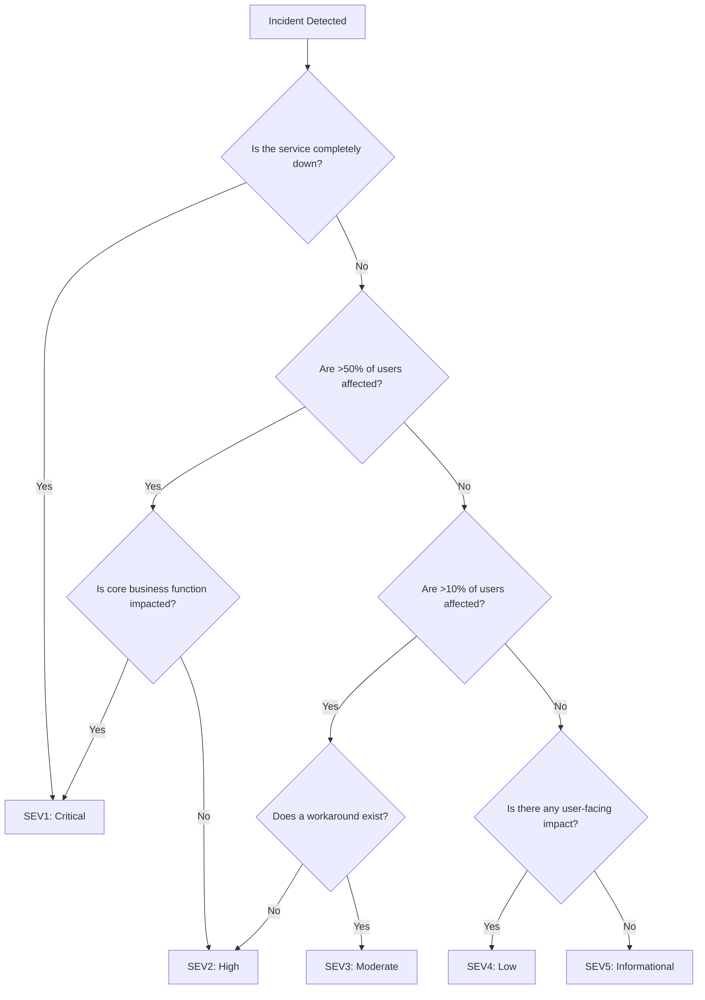
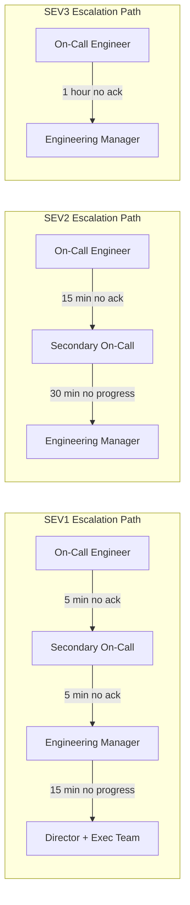

# How to Build Incident Severity Definitions

Author: [nawazdhandala](https://github.com/nawazdhandala)

Tags: SRE, IncidentManagement, Severity, OnCall

Description: A practical guide to defining incident severity levels that enable fast triage, clear escalation, and consistent response across your organization.

---

## Why Severity Definitions Matter

Without clear severity definitions, every incident becomes an argument. Engineers debate whether a problem is "really that bad" while customers wait. Good severity definitions remove ambiguity, speed up triage, and set clear expectations for response times and escalation paths.

This guide provides a framework for building severity definitions that work in practice. We will cover the standard five-tier model (SEV1 through SEV5), show you how to combine impact and urgency into a decision matrix, and provide code examples you can adapt for your own systems.

---

## Severity Level Definitions

The following definitions use a five-tier model common across SRE organizations. Adapt the specifics to your business context.

### SEV1: Critical

**Definition:** Complete service outage or security breach affecting all users. Core business functionality is unavailable.

**Examples:**
- Production database is down and unrecoverable
- Payment processing is completely broken
- Active security breach with data exfiltration
- All users cannot log in

**Response:** All hands on deck. Wake people up. Executive communication required.

---

### SEV2: High

**Definition:** Major functionality degraded or unavailable for a significant portion of users. Revenue or reputation impact is occurring now.

**Examples:**
- Primary region failover, running on backup
- 50% of API requests returning errors
- Critical feature broken for enterprise customers
- Performance degraded beyond SLA thresholds

**Response:** Immediate response during business hours. Page on-call after hours. Customer communication likely needed.

---

### SEV3: Moderate

**Definition:** Partial degradation of non-critical functionality. Workarounds exist. Limited user impact.

**Examples:**
- Search results slower than normal but functional
- Email notifications delayed by 30 minutes
- Admin dashboard returning intermittent errors
- Non-critical third-party integration down

**Response:** Address during business hours. No after-hours paging unless degradation worsens.

---

### SEV4: Low

**Definition:** Minor issues with minimal user impact. Cosmetic bugs or edge cases.

**Examples:**
- UI rendering issues in specific browser versions
- Rare error conditions affecting less than 0.1% of requests
- Documentation out of sync with feature behavior
- Slow performance in internal tools

**Response:** Address in next sprint or as time permits. Track in backlog.

---

### SEV5: Informational

**Definition:** No current impact. Observations, warnings, or technical debt that could become problems.

**Examples:**
- Disk usage trending upward but not critical
- Deprecated API still in use by some clients
- Certificate expiring in 60 days
- Minor code quality issues flagged by linting

**Response:** Track for future work. Review in weekly maintenance planning.

---

## Impact and Urgency Matrix

Severity is the combination of two factors: how many users or systems are affected (impact) and how quickly it needs resolution (urgency).

### The Matrix

| | **Urgency: Critical** | **Urgency: High** | **Urgency: Medium** | **Urgency: Low** |
|---|---|---|---|---|
| **Impact: Critical** | SEV1 | SEV1 | SEV2 | SEV3 |
| **Impact: High** | SEV1 | SEV2 | SEV2 | SEV3 |
| **Impact: Medium** | SEV2 | SEV2 | SEV3 | SEV4 |
| **Impact: Low** | SEV3 | SEV3 | SEV4 | SEV5 |

### Defining Impact

- **Critical:** All users affected, or core business function unavailable
- **High:** Large segment of users affected (>25%), or revenue-impacting function degraded
- **Medium:** Subset of users affected (<25%), or non-critical function unavailable
- **Low:** Individual users or edge cases, no business function impact

### Defining Urgency

- **Critical:** Must resolve immediately, every minute costs money or reputation
- **High:** Must resolve within hours, significant ongoing damage
- **Medium:** Should resolve within one business day, manageable workarounds exist
- **Low:** Can wait for scheduled maintenance window

---

## Severity Decision Tree

Use this decision tree to quickly classify incidents during triage.



---

## Response Time Expectations by Severity

Clear response time expectations set the right urgency without burning out your team.

| Severity | Acknowledge | First Update | Target Resolution | Escalation Trigger |
|----------|-------------|--------------|-------------------|-------------------|
| **SEV1** | 5 minutes | 15 minutes | 1 hour | No ack in 5 min |
| **SEV2** | 15 minutes | 30 minutes | 4 hours | No ack in 15 min |
| **SEV3** | 1 hour | 2 hours | 24 hours | No ack in 1 hour |
| **SEV4** | 4 hours | 8 hours | 1 week | No update in 24h |
| **SEV5** | Next business day | N/A | Best effort | N/A |

### What Each Column Means

- **Acknowledge:** Time until someone confirms they are looking at the incident
- **First Update:** Time until stakeholders receive initial assessment
- **Target Resolution:** Expected time to resolve or implement a workaround
- **Escalation Trigger:** Condition that automatically escalates to the next tier

---

## Escalation Triggers

Escalation is not failure. It is a mechanism to ensure the right resources engage at the right time.

### Automatic Escalation Rules



### Manual Escalation Criteria

Engineers should escalate when:

1. **Skill gap:** The problem requires expertise they do not have
2. **Authority gap:** Resolution requires decisions above their authority level
3. **Resource gap:** More people are needed than currently engaged
4. **Time pressure:** Resolution is taking longer than expected and SLA is at risk
5. **Uncertainty:** The scope or blast radius is unclear and growing

---

## Practical Code Examples

### Severity Classification Function

This TypeScript function implements the decision matrix for automated triage.

```typescript
// Incident severity classifier based on impact and urgency
// Returns a severity level from 1 (critical) to 5 (informational)

type Impact = 'critical' | 'high' | 'medium' | 'low';
type Urgency = 'critical' | 'high' | 'medium' | 'low';
type SeverityLevel = 1 | 2 | 3 | 4 | 5;

interface IncidentInput {
  affectedUsersPercent: number;      // 0-100, percentage of users impacted
  coreBusinessFunction: boolean;      // true if core revenue function is affected
  workaroundExists: boolean;          // true if users can accomplish their goal another way
  revenueImpactPerMinute: number;     // estimated dollar impact per minute
  securityBreach: boolean;            // true if data integrity or confidentiality at risk
}

// Determine impact level based on user and business metrics
function calculateImpact(input: IncidentInput): Impact {
  // Security breaches and core function outages are always critical impact
  if (input.securityBreach || (input.coreBusinessFunction && input.affectedUsersPercent > 90)) {
    return 'critical';
  }

  // High impact: significant user base or revenue function affected
  if (input.affectedUsersPercent > 25 || (input.coreBusinessFunction && input.affectedUsersPercent > 10)) {
    return 'high';
  }

  // Medium impact: noticeable but limited scope
  if (input.affectedUsersPercent > 5 || input.coreBusinessFunction) {
    return 'medium';
  }

  // Low impact: edge cases and minor issues
  return 'low';
}

// Determine urgency based on time sensitivity and workaround availability
function calculateUrgency(input: IncidentInput): Urgency {
  // Critical urgency: high revenue impact or security breach
  if (input.revenueImpactPerMinute > 1000 || input.securityBreach) {
    return 'critical';
  }

  // High urgency: significant revenue impact and no workaround
  if (input.revenueImpactPerMinute > 100 && !input.workaroundExists) {
    return 'high';
  }

  // Medium urgency: some revenue impact or no workaround for visible issues
  if (input.revenueImpactPerMinute > 10 || !input.workaroundExists) {
    return 'medium';
  }

  // Low urgency: workarounds exist and minimal ongoing cost
  return 'low';
}

// The severity matrix encoded as nested lookups
const SEVERITY_MATRIX: Record<Impact, Record<Urgency, SeverityLevel>> = {
  critical: { critical: 1, high: 1, medium: 2, low: 3 },
  high:     { critical: 1, high: 2, medium: 2, low: 3 },
  medium:   { critical: 2, high: 2, medium: 3, low: 4 },
  low:      { critical: 3, high: 3, medium: 4, low: 5 },
};

// Main function: classify an incident and return severity with explanation
function classifyIncident(input: IncidentInput): {
  severity: SeverityLevel;
  impact: Impact;
  urgency: Urgency;
  reasoning: string;
} {
  const impact = calculateImpact(input);
  const urgency = calculateUrgency(input);
  const severity = SEVERITY_MATRIX[impact][urgency];

  // Build human-readable reasoning for the classification
  const reasoning = `Impact: ${impact} (${input.affectedUsersPercent}% users, ` +
    `core function: ${input.coreBusinessFunction}). ` +
    `Urgency: ${urgency} ($${input.revenueImpactPerMinute}/min, ` +
    `workaround: ${input.workaroundExists}). ` +
    `Result: SEV${severity}`;

  return { severity, impact, urgency, reasoning };
}

// Example usage
const incident = {
  affectedUsersPercent: 30,
  coreBusinessFunction: true,
  workaroundExists: false,
  revenueImpactPerMinute: 500,
  securityBreach: false,
};

const result = classifyIncident(incident);
console.log(result);
// Output: { severity: 2, impact: 'high', urgency: 'high', reasoning: '...' }
```

### Alert Routing by Severity

This example shows how to route alerts to different channels based on severity.

```typescript
// Route alerts to appropriate channels based on severity
// Integrates with common alerting platforms

interface Alert {
  id: string;
  title: string;
  severity: SeverityLevel;
  service: string;
  timestamp: Date;
}

interface AlertRouting {
  channels: string[];           // Notification channels to use
  escalationDelayMinutes: number;  // Time before escalation
  requiresAck: boolean;         // Whether acknowledgment is required
  notifyExecutives: boolean;    // Whether to include leadership
}

// Define routing rules for each severity level
function getAlertRouting(severity: SeverityLevel): AlertRouting {
  switch (severity) {
    case 1:
      // SEV1: All channels, immediate escalation, executive visibility
      return {
        channels: ['pagerduty', 'slack-incidents', 'phone', 'email'],
        escalationDelayMinutes: 5,
        requiresAck: true,
        notifyExecutives: true,
      };

    case 2:
      // SEV2: Urgent but not all-hands
      return {
        channels: ['pagerduty', 'slack-incidents', 'email'],
        escalationDelayMinutes: 15,
        requiresAck: true,
        notifyExecutives: false,
      };

    case 3:
      // SEV3: Business hours response
      return {
        channels: ['slack-incidents', 'email'],
        escalationDelayMinutes: 60,
        requiresAck: true,
        notifyExecutives: false,
      };

    case 4:
      // SEV4: Track but do not interrupt
      return {
        channels: ['slack-alerts', 'email'],
        escalationDelayMinutes: 240,
        requiresAck: false,
        notifyExecutives: false,
      };

    case 5:
      // SEV5: Log for review
      return {
        channels: ['slack-alerts'],
        escalationDelayMinutes: 0,  // No escalation
        requiresAck: false,
        notifyExecutives: false,
      };
  }
}

// Send alert to configured channels
async function routeAlert(alert: Alert): Promise<void> {
  const routing = getAlertRouting(alert.severity);

  console.log(`Routing SEV${alert.severity} alert: ${alert.title}`);
  console.log(`Channels: ${routing.channels.join(', ')}`);

  // Send to each configured channel
  for (const channel of routing.channels) {
    await sendToChannel(channel, alert, routing);
  }

  // Schedule escalation if acknowledgment is required
  if (routing.requiresAck && routing.escalationDelayMinutes > 0) {
    scheduleEscalation(alert, routing.escalationDelayMinutes);
  }
}

// Placeholder functions for actual integrations
async function sendToChannel(channel: string, alert: Alert, routing: AlertRouting): Promise<void> {
  // Implementation would integrate with PagerDuty, Slack, etc.
  console.log(`Sending to ${channel}: [SEV${alert.severity}] ${alert.title}`);
}

function scheduleEscalation(alert: Alert, delayMinutes: number): void {
  // Implementation would schedule a check for acknowledgment
  console.log(`Escalation scheduled in ${delayMinutes} minutes if not acknowledged`);
}
```

### Severity Override Rules

Sometimes automated classification needs human override. This example shows how to handle that.

```typescript
// Handle severity overrides with audit trail
// Ensures changes are tracked and justified

interface SeverityOverride {
  incidentId: string;
  originalSeverity: SeverityLevel;
  newSeverity: SeverityLevel;
  reason: string;
  overriddenBy: string;
  timestamp: Date;
}

// Valid reasons for overriding automated severity
const VALID_OVERRIDE_REASONS = [
  'customer_escalation',      // Customer or sales escalated the issue
  'executive_request',        // Leadership requested higher priority
  'additional_context',       // New information changes the assessment
  'false_positive',           // Automated detection was incorrect
  'planned_maintenance',      // Issue is expected during maintenance
  'duplicate_incident',       // Already tracked under another incident
] as const;

type OverrideReason = typeof VALID_OVERRIDE_REASONS[number];

// Validate and apply a severity override
function applySeverityOverride(
  incidentId: string,
  currentSeverity: SeverityLevel,
  newSeverity: SeverityLevel,
  reason: OverrideReason,
  userId: string
): SeverityOverride {
  // Validate the override is meaningful
  if (currentSeverity === newSeverity) {
    throw new Error('New severity must differ from current severity');
  }

  // Require stronger justification for upgrading to SEV1
  if (newSeverity === 1 && !['customer_escalation', 'executive_request', 'additional_context'].includes(reason)) {
    throw new Error('Upgrading to SEV1 requires customer escalation, executive request, or additional context');
  }

  // Require approval for downgrading from SEV1
  if (currentSeverity === 1 && newSeverity > 2) {
    throw new Error('Downgrading from SEV1 to SEV3 or lower requires manager approval');
  }

  // Create the override record
  const override: SeverityOverride = {
    incidentId,
    originalSeverity: currentSeverity,
    newSeverity,
    reason,
    overriddenBy: userId,
    timestamp: new Date(),
  };

  // Log for audit trail
  console.log(`Severity override: Incident ${incidentId} changed from SEV${currentSeverity} to SEV${newSeverity}`);
  console.log(`Reason: ${reason}, By: ${userId}`);

  return override;
}
```

---

## Implementing Severity Definitions in Your Organization

### Step 1: Start with Your Business Context

Generic definitions do not work. Ask these questions:

- What does "complete outage" mean for your product?
- Which features generate revenue? Which are nice-to-have?
- What SLAs have you committed to customers?
- What is your on-call capacity?

### Step 2: Draft and Socialize

Write your first draft of severity definitions. Share it with:

- Engineering teams (they will use it daily)
- Customer support (they will translate customer reports into severities)
- Leadership (they need to understand what each level means)

Gather feedback. Revise. Repeat.

### Step 3: Integrate with Tooling

Severity definitions only work if they are embedded in your workflow:

- Configure alerting thresholds to match severity levels
- Set up escalation policies in your incident management tool
- Add severity as a required field when creating incidents
- Build dashboards that show incident distribution by severity

### Step 4: Review and Iterate

After 30 days:

- Are incidents being classified consistently?
- Are SEV1s truly critical? Are SEV4s truly low priority?
- Is the on-call team being woken up for the right things?

Adjust definitions based on real-world usage.

---

## Common Pitfalls to Avoid

**Everything is SEV1:** If 30% of your incidents are SEV1, you have lost the signal. Review your criteria.

**Severity inflation:** Teams sometimes over-classify to get faster response. Combat this with clear definitions and periodic audits.

**Severity deflation:** Teams sometimes under-classify to avoid paging. This leads to customer complaints. Monitor customer feedback against incident severity.

**Static definitions:** Your product changes. Your customer base changes. Review severity definitions quarterly.

**Missing escalation paths:** A severity level without a clear response expectation is useless. Always define who gets paged and when.

---

## Conclusion

Good severity definitions are a foundation of incident management. They enable fast triage, appropriate response, and clear communication. The framework in this guide gives you a starting point, but the real work is adapting it to your organization and iterating based on experience.

Start with the five-tier model. Build the impact and urgency matrix. Implement it in code. Then watch how your team uses it and refine accordingly. The goal is not perfect classification but consistent, fast, and appropriate response to the incidents that matter most.
