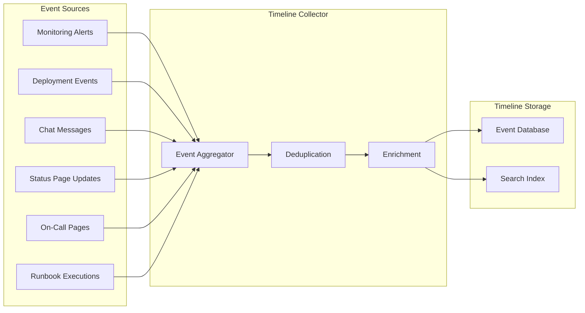
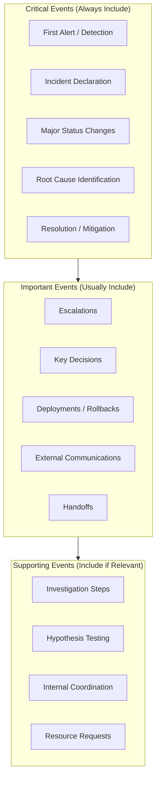
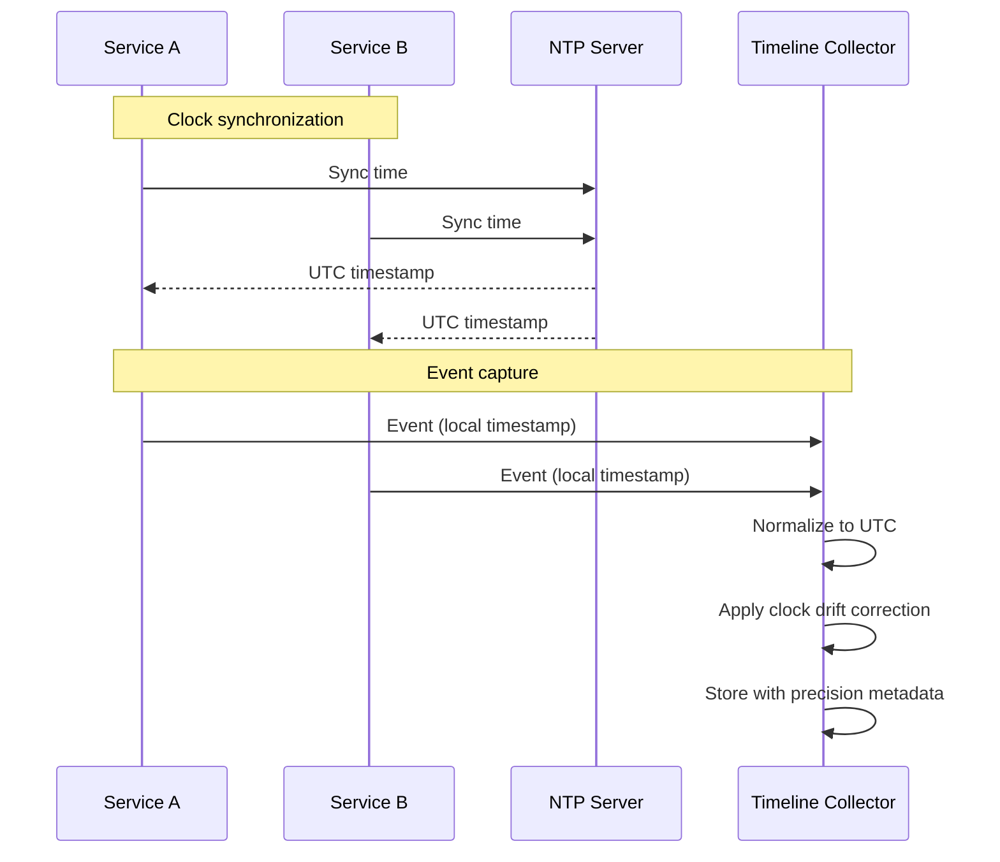
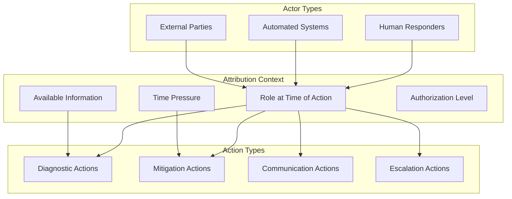
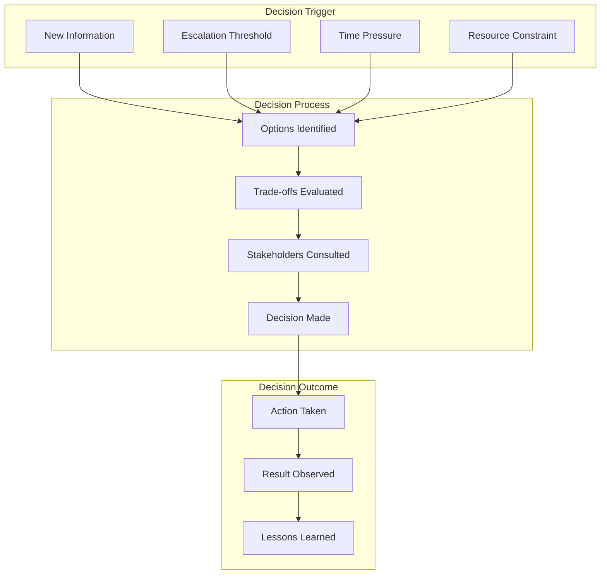
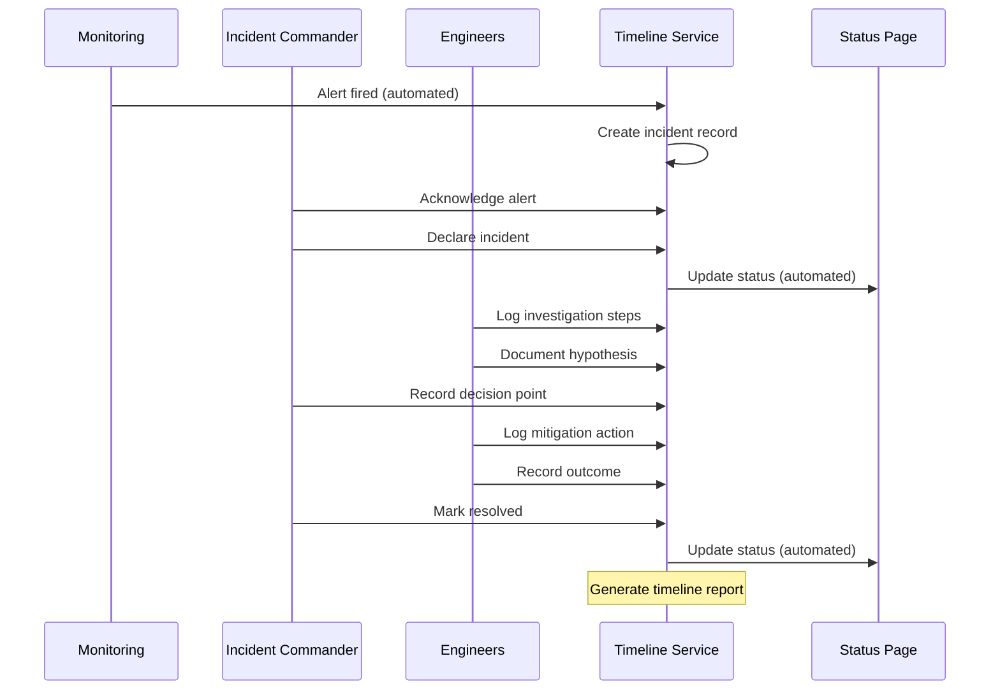
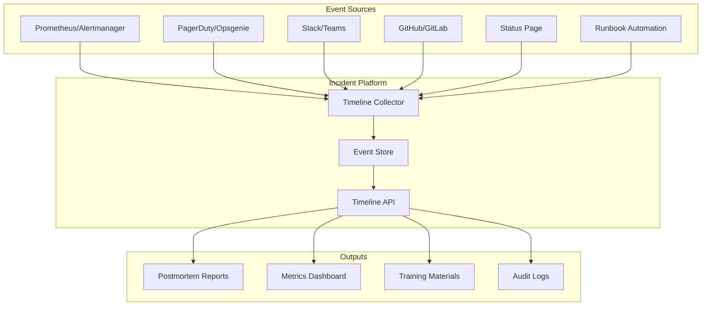

# How to Create Incident Timeline Documentation

Author: [nawazdhandala](https://github.com/nawazdhandala)

Tags: Incident Management, Documentation, SRE, Postmortems

Description: Learn how to document incident timelines for effective post-incident analysis.

---

Incident timeline documentation is one of the most valuable artifacts produced during and after an incident. A well-constructed timeline provides a factual record of events, helps identify process gaps, and serves as the foundation for effective postmortems. This guide covers practical techniques for capturing, structuring, and visualizing incident timelines that drive meaningful improvements.

---

## Table of Contents

1. Why Timeline Documentation Matters
2. Automated Timeline Capture
3. Key Event Identification
4. Timestamp Accuracy
5. Action Attribution
6. Decision Point Documentation
7. Timeline Visualization
8. Practical Implementation Examples
9. Common Pitfalls and Best Practices
10. Tools and Integration

---

## 1. Why Timeline Documentation Matters

A comprehensive incident timeline serves multiple purposes:

| Purpose | Benefit |
|---------|---------|
| Factual Record | Provides an objective account of what happened, free from memory bias |
| Root Cause Analysis | Helps identify causal chains and contributing factors |
| Process Improvement | Reveals gaps in detection, escalation, and response procedures |
| Training Material | Serves as real-world scenarios for onboarding and incident response training |
| Compliance | Meets audit requirements for incident documentation |
| Blameless Culture | Focuses on events and systems rather than individuals |

Without a detailed timeline, postmortems become exercises in speculation rather than analysis.

---

## 2. Automated Timeline Capture

Manual timeline documentation during an incident is error-prone and distracts responders from resolution. Automated capture ensures accuracy and completeness.

### Core Components of Automated Capture



### Implementation: Event Collector Service

```typescript
// incident-timeline-collector.ts
import { EventEmitter } from 'events';

interface TimelineEvent {
  id: string;
  incidentId: string;
  timestamp: Date;
  source: EventSource;
  type: EventType;
  actor?: Actor;
  description: string;
  metadata: Record<string, unknown>;
  confidence: 'automated' | 'manual' | 'inferred';
}

interface Actor {
  type: 'human' | 'system' | 'automation';
  id: string;
  name: string;
}

type EventSource =
  | 'monitoring'
  | 'deployment'
  | 'chat'
  | 'status_page'
  | 'paging'
  | 'runbook'
  | 'manual';

type EventType =
  | 'alert_fired'
  | 'alert_acknowledged'
  | 'alert_resolved'
  | 'deployment_started'
  | 'deployment_completed'
  | 'rollback_initiated'
  | 'escalation'
  | 'communication'
  | 'status_change'
  | 'action_taken'
  | 'decision_made'
  | 'root_cause_identified';

class TimelineCollector extends EventEmitter {
  private events: Map<string, TimelineEvent[]> = new Map();
  private eventSources: Map<EventSource, EventSourceHandler> = new Map();

  constructor() {
    super();
    this.registerDefaultSources();
  }

  private registerDefaultSources(): void {
    // Register monitoring integration
    this.eventSources.set('monitoring', {
      name: 'Monitoring System',
      transform: (raw: any) => ({
        type: this.inferEventType(raw),
        description: raw.alertName || raw.message,
        metadata: {
          severity: raw.severity,
          service: raw.service,
          metric: raw.metric,
          threshold: raw.threshold,
          currentValue: raw.currentValue,
        },
        confidence: 'automated' as const,
      }),
    });

    // Register deployment integration
    this.eventSources.set('deployment', {
      name: 'Deployment Pipeline',
      transform: (raw: any) => ({
        type: raw.status === 'started' ? 'deployment_started' : 'deployment_completed',
        description: `Deployment ${raw.version} to ${raw.environment}`,
        metadata: {
          version: raw.version,
          environment: raw.environment,
          commitSha: raw.commitSha,
          deployer: raw.triggeredBy,
        },
        confidence: 'automated' as const,
      }),
    });
  }

  private inferEventType(raw: any): EventType {
    if (raw.status === 'firing') return 'alert_fired';
    if (raw.status === 'resolved') return 'alert_resolved';
    if (raw.acknowledged) return 'alert_acknowledged';
    return 'action_taken';
  }

  async addEvent(
    incidentId: string,
    source: EventSource,
    rawEvent: any,
    overrides?: Partial<TimelineEvent>
  ): Promise<TimelineEvent> {
    const handler = this.eventSources.get(source);
    if (!handler) {
      throw new Error(`Unknown event source: ${source}`);
    }

    const transformed = handler.transform(rawEvent);
    const event: TimelineEvent = {
      id: this.generateEventId(),
      incidentId,
      timestamp: rawEvent.timestamp ? new Date(rawEvent.timestamp) : new Date(),
      source,
      ...transformed,
      ...overrides,
    };

    // Store event
    const incidentEvents = this.events.get(incidentId) || [];
    incidentEvents.push(event);
    incidentEvents.sort((a, b) => a.timestamp.getTime() - b.timestamp.getTime());
    this.events.set(incidentId, incidentEvents);

    // Emit for real-time subscribers
    this.emit('event', event);

    return event;
  }

  async addManualEvent(
    incidentId: string,
    description: string,
    actor: Actor,
    type: EventType = 'action_taken',
    timestamp?: Date
  ): Promise<TimelineEvent> {
    const event: TimelineEvent = {
      id: this.generateEventId(),
      incidentId,
      timestamp: timestamp || new Date(),
      source: 'manual',
      type,
      actor,
      description,
      metadata: {},
      confidence: 'manual',
    };

    const incidentEvents = this.events.get(incidentId) || [];
    incidentEvents.push(event);
    incidentEvents.sort((a, b) => a.timestamp.getTime() - b.timestamp.getTime());
    this.events.set(incidentId, incidentEvents);

    this.emit('event', event);
    return event;
  }

  getTimeline(incidentId: string): TimelineEvent[] {
    return this.events.get(incidentId) || [];
  }

  private generateEventId(): string {
    return `evt_${Date.now()}_${Math.random().toString(36).substr(2, 9)}`;
  }
}

interface EventSourceHandler {
  name: string;
  transform: (raw: any) => Partial<TimelineEvent>;
}

export { TimelineCollector, TimelineEvent, Actor, EventSource, EventType };
```

### Webhook Integration for Automated Capture

```typescript
// timeline-webhook-handler.ts
import express from 'express';
import { TimelineCollector, EventSource } from './incident-timeline-collector';

const app = express();
const collector = new TimelineCollector();

app.use(express.json());

// Generic webhook endpoint for timeline events
app.post('/api/incidents/:incidentId/timeline/events', async (req, res) => {
  const { incidentId } = req.params;
  const { source, event } = req.body;

  try {
    const timelineEvent = await collector.addEvent(
      incidentId,
      source as EventSource,
      event
    );
    res.json({ success: true, event: timelineEvent });
  } catch (error) {
    res.status(400).json({ success: false, error: (error as Error).message });
  }
});

// Prometheus Alertmanager webhook
app.post('/webhooks/alertmanager', async (req, res) => {
  const { alerts, commonLabels } = req.body;
  const incidentId = commonLabels?.incident_id;

  if (!incidentId) {
    return res.status(400).json({ error: 'Missing incident_id label' });
  }

  for (const alert of alerts) {
    await collector.addEvent(incidentId, 'monitoring', {
      alertName: alert.labels.alertname,
      status: alert.status,
      severity: alert.labels.severity,
      service: alert.labels.service,
      message: alert.annotations?.description,
      timestamp: alert.startsAt,
    });
  }

  res.json({ success: true, processed: alerts.length });
});

// Slack event subscription for chat messages
app.post('/webhooks/slack', async (req, res) => {
  const { event, challenge } = req.body;

  // Handle Slack URL verification
  if (challenge) {
    return res.json({ challenge });
  }

  // Extract incident ID from channel name or message content
  const incidentId = extractIncidentId(event.channel, event.text);
  if (!incidentId) {
    return res.json({ success: true, skipped: true });
  }

  await collector.addEvent(incidentId, 'chat', {
    message: event.text,
    user: event.user,
    channel: event.channel,
    timestamp: new Date(parseFloat(event.ts) * 1000),
  });

  res.json({ success: true });
});

function extractIncidentId(channel: string, text: string): string | null {
  // Check channel name pattern: incident-INC-12345
  const channelMatch = channel.match(/incident-(INC-\d+)/);
  if (channelMatch) return channelMatch[1];

  // Check message content for incident references
  const textMatch = text.match(/INC-\d+/);
  return textMatch ? textMatch[0] : null;
}

app.listen(3000, () => console.log('Timeline webhook handler running on :3000'));
```

---

## 3. Key Event Identification

Not all events during an incident are equally important. Identifying key events helps create a focused timeline that highlights critical moments.

### Event Categories and Priority



### Event Classification System

```typescript
// event-classifier.ts

interface ClassificationRule {
  name: string;
  priority: 'critical' | 'important' | 'supporting';
  conditions: EventCondition[];
  autoInclude: boolean;
}

interface EventCondition {
  field: string;
  operator: 'equals' | 'contains' | 'matches' | 'exists';
  value?: string | RegExp;
}

const classificationRules: ClassificationRule[] = [
  // Critical events - always include
  {
    name: 'First Detection',
    priority: 'critical',
    conditions: [
      { field: 'type', operator: 'equals', value: 'alert_fired' },
      { field: 'metadata.isFirstAlert', operator: 'equals', value: 'true' },
    ],
    autoInclude: true,
  },
  {
    name: 'Incident Declaration',
    priority: 'critical',
    conditions: [
      { field: 'type', operator: 'equals', value: 'status_change' },
      { field: 'description', operator: 'contains', value: 'declared' },
    ],
    autoInclude: true,
  },
  {
    name: 'Root Cause Identified',
    priority: 'critical',
    conditions: [
      { field: 'type', operator: 'equals', value: 'root_cause_identified' },
    ],
    autoInclude: true,
  },
  {
    name: 'Resolution',
    priority: 'critical',
    conditions: [
      { field: 'type', operator: 'equals', value: 'status_change' },
      { field: 'metadata.newStatus', operator: 'matches', value: /resolved|mitigated/i },
    ],
    autoInclude: true,
  },

  // Important events - usually include
  {
    name: 'Escalation',
    priority: 'important',
    conditions: [{ field: 'type', operator: 'equals', value: 'escalation' }],
    autoInclude: true,
  },
  {
    name: 'Deployment Activity',
    priority: 'important',
    conditions: [
      { field: 'type', operator: 'matches', value: /deployment|rollback/i },
    ],
    autoInclude: true,
  },
  {
    name: 'External Communication',
    priority: 'important',
    conditions: [
      { field: 'source', operator: 'equals', value: 'status_page' },
    ],
    autoInclude: true,
  },
  {
    name: 'Key Decision',
    priority: 'important',
    conditions: [
      { field: 'type', operator: 'equals', value: 'decision_made' },
    ],
    autoInclude: true,
  },

  // Supporting events - include if relevant
  {
    name: 'Investigation Step',
    priority: 'supporting',
    conditions: [
      { field: 'description', operator: 'matches', value: /investigated|checked|verified|tested/i },
    ],
    autoInclude: false,
  },
];

function classifyEvent(event: any): ClassificationRule | null {
  for (const rule of classificationRules) {
    if (matchesAllConditions(event, rule.conditions)) {
      return rule;
    }
  }
  return null;
}

function matchesAllConditions(event: any, conditions: EventCondition[]): boolean {
  return conditions.every(condition => {
    const fieldValue = getNestedValue(event, condition.field);

    switch (condition.operator) {
      case 'equals':
        return fieldValue === condition.value;
      case 'contains':
        return typeof fieldValue === 'string' &&
               fieldValue.includes(condition.value as string);
      case 'matches':
        return typeof fieldValue === 'string' &&
               (condition.value as RegExp).test(fieldValue);
      case 'exists':
        return fieldValue !== undefined && fieldValue !== null;
      default:
        return false;
    }
  });
}

function getNestedValue(obj: any, path: string): any {
  return path.split('.').reduce((current, key) => current?.[key], obj);
}

function filterKeyEvents(events: any[]): any[] {
  return events.filter(event => {
    const classification = classifyEvent(event);
    return classification?.autoInclude ?? false;
  });
}

export { classifyEvent, filterKeyEvents, classificationRules };
```

---

## 4. Timestamp Accuracy

Accurate timestamps are essential for understanding the sequence of events and measuring response times. Different systems may use different time sources, leading to clock drift issues.

### Timestamp Synchronization Strategy



### Timestamp Normalization Service

```typescript
// timestamp-normalizer.ts

interface NormalizedTimestamp {
  utc: Date;
  originalTimestamp: string;
  originalTimezone: string;
  precision: TimestampPrecision;
  confidence: number; // 0-1, how confident we are in accuracy
  clockDriftMs?: number;
}

type TimestampPrecision =
  | 'millisecond'
  | 'second'
  | 'minute'
  | 'approximate';

interface ClockDriftRecord {
  sourceId: string;
  measuredDriftMs: number;
  measuredAt: Date;
  confidence: number;
}

class TimestampNormalizer {
  private clockDriftCache: Map<string, ClockDriftRecord> = new Map();

  /**
   * Normalizes a timestamp from various formats to a consistent UTC representation
   */
  normalize(
    timestamp: string | number | Date,
    sourceId: string,
    options: NormalizationOptions = {}
  ): NormalizedTimestamp {
    const {
      assumedTimezone = 'UTC',
      applyDriftCorrection = true,
    } = options;

    // Parse the timestamp
    const { parsed, precision, originalFormat } = this.parseTimestamp(timestamp);

    // Convert to UTC
    const utc = this.convertToUTC(parsed, assumedTimezone);

    // Apply clock drift correction if available
    let correctedUtc = utc;
    let driftMs: number | undefined;

    if (applyDriftCorrection) {
      const driftRecord = this.clockDriftCache.get(sourceId);
      if (driftRecord && this.isDriftRecordValid(driftRecord)) {
        driftMs = driftRecord.measuredDriftMs;
        correctedUtc = new Date(utc.getTime() - driftMs);
      }
    }

    return {
      utc: correctedUtc,
      originalTimestamp: String(timestamp),
      originalTimezone: assumedTimezone,
      precision,
      confidence: this.calculateConfidence(precision, driftMs),
      clockDriftMs: driftMs,
    };
  }

  private parseTimestamp(timestamp: string | number | Date): ParseResult {
    // Handle Date objects
    if (timestamp instanceof Date) {
      return {
        parsed: timestamp,
        precision: 'millisecond',
        originalFormat: 'Date object',
      };
    }

    // Handle Unix timestamps (seconds or milliseconds)
    if (typeof timestamp === 'number') {
      const isMilliseconds = timestamp > 1e12;
      return {
        parsed: new Date(isMilliseconds ? timestamp : timestamp * 1000),
        precision: isMilliseconds ? 'millisecond' : 'second',
        originalFormat: isMilliseconds ? 'Unix ms' : 'Unix seconds',
      };
    }

    // Handle ISO 8601 strings
    const isoMatch = timestamp.match(
      /^\d{4}-\d{2}-\d{2}T\d{2}:\d{2}:\d{2}(\.\d{1,3})?(Z|[+-]\d{2}:\d{2})?$/
    );
    if (isoMatch) {
      const hasMilliseconds = !!isoMatch[1];
      return {
        parsed: new Date(timestamp),
        precision: hasMilliseconds ? 'millisecond' : 'second',
        originalFormat: 'ISO 8601',
      };
    }

    // Handle human-readable formats (less precise)
    const parsed = new Date(timestamp);
    if (!isNaN(parsed.getTime())) {
      return {
        parsed,
        precision: 'minute',
        originalFormat: 'human-readable',
      };
    }

    // Fallback: use current time with low confidence
    return {
      parsed: new Date(),
      precision: 'approximate',
      originalFormat: 'unparseable',
    };
  }

  private convertToUTC(date: Date, timezone: string): Date {
    if (timezone === 'UTC') {
      return date;
    }

    // Use Intl API for timezone conversion
    try {
      const formatter = new Intl.DateTimeFormat('en-US', {
        timeZone: timezone,
        year: 'numeric',
        month: '2-digit',
        day: '2-digit',
        hour: '2-digit',
        minute: '2-digit',
        second: '2-digit',
        hour12: false,
      });

      // This is a simplified conversion - production code should use
      // a library like luxon or date-fns-tz for accurate conversion
      return date;
    } catch {
      return date;
    }
  }

  /**
   * Records measured clock drift for a source
   * Call this periodically or when events can be correlated
   */
  recordClockDrift(sourceId: string, measuredDriftMs: number, confidence: number): void {
    this.clockDriftCache.set(sourceId, {
      sourceId,
      measuredDriftMs,
      measuredAt: new Date(),
      confidence,
    });
  }

  private isDriftRecordValid(record: ClockDriftRecord): boolean {
    const maxAge = 24 * 60 * 60 * 1000; // 24 hours
    const age = Date.now() - record.measuredAt.getTime();
    return age < maxAge && record.confidence > 0.5;
  }

  private calculateConfidence(precision: TimestampPrecision, driftMs?: number): number {
    const precisionConfidence: Record<TimestampPrecision, number> = {
      millisecond: 1.0,
      second: 0.95,
      minute: 0.7,
      approximate: 0.3,
    };

    let confidence = precisionConfidence[precision];

    // Reduce confidence if drift correction was applied
    if (driftMs !== undefined && Math.abs(driftMs) > 1000) {
      confidence *= 0.9;
    }

    return confidence;
  }
}

interface NormalizationOptions {
  assumedTimezone?: string;
  applyDriftCorrection?: boolean;
}

interface ParseResult {
  parsed: Date;
  precision: TimestampPrecision;
  originalFormat: string;
}

export { TimestampNormalizer, NormalizedTimestamp, TimestampPrecision };
```

### Best Practices for Timestamp Accuracy

| Practice | Implementation |
|----------|----------------|
| Use UTC everywhere | Store and transmit all timestamps in UTC |
| Include timezone metadata | When receiving local times, record the source timezone |
| Prefer high-precision sources | Prioritize system logs over human reports |
| Measure clock drift | Periodically check drift between distributed systems |
| Record precision level | Track whether timestamps are exact or approximate |
| Use monotonic clocks for durations | Avoid wall-clock issues for elapsed time |

---

## 5. Action Attribution

Knowing who did what during an incident is crucial for understanding decision-making and improving processes. Action attribution must balance accountability with a blameless culture.

### Attribution Model



### Attribution Service Implementation

```typescript
// action-attribution.ts

interface AttributedAction {
  id: string;
  incidentId: string;
  timestamp: Date;
  actor: Actor;
  actionType: ActionType;
  description: string;
  context: ActionContext;
  outcome?: ActionOutcome;
}

interface Actor {
  type: 'human' | 'system' | 'automation' | 'external';
  id: string;
  displayName: string;
  role?: string; // Role at time of action (e.g., "Incident Commander", "On-Call Engineer")
  team?: string;
}

type ActionType =
  | 'diagnostic'      // Investigating, checking logs, querying metrics
  | 'mitigation'      // Actions to reduce impact
  | 'remediation'     // Actions to fix root cause
  | 'communication'   // Status updates, notifications
  | 'escalation'      // Bringing in additional responders
  | 'decision'        // Making a call on approach
  | 'coordination';   // Organizing response efforts

interface ActionContext {
  availableInformation: string[];      // What the actor knew at the time
  precedingEvents: string[];           // Recent events that informed the action
  alternatives?: string[];             // Other options that were considered
  constraints?: string[];              // Limitations (time, access, knowledge)
  authorization?: AuthorizationLevel;
}

type AuthorizationLevel =
  | 'self_authorized'    // Actor could take action independently
  | 'approved'           // Required approval from IC or management
  | 'emergency_override' // Bypassed normal approval due to urgency
  | 'automated';         // No human approval needed

interface ActionOutcome {
  result: 'successful' | 'unsuccessful' | 'partial' | 'unknown';
  impact?: string;
  duration?: number; // How long the action took in ms
  followUpRequired?: boolean;
}

class ActionAttributionService {
  private actions: Map<string, AttributedAction[]> = new Map();

  async recordAction(
    incidentId: string,
    actor: Actor,
    actionType: ActionType,
    description: string,
    context: Partial<ActionContext> = {}
  ): Promise<AttributedAction> {
    const action: AttributedAction = {
      id: this.generateActionId(),
      incidentId,
      timestamp: new Date(),
      actor: this.enrichActor(actor),
      actionType,
      description,
      context: {
        availableInformation: context.availableInformation || [],
        precedingEvents: context.precedingEvents || [],
        alternatives: context.alternatives,
        constraints: context.constraints,
        authorization: context.authorization || 'self_authorized',
      },
    };

    const incidentActions = this.actions.get(incidentId) || [];
    incidentActions.push(action);
    this.actions.set(incidentId, incidentActions);

    return action;
  }

  async recordActionOutcome(
    actionId: string,
    incidentId: string,
    outcome: ActionOutcome
  ): Promise<void> {
    const incidentActions = this.actions.get(incidentId);
    if (!incidentActions) return;

    const action = incidentActions.find(a => a.id === actionId);
    if (action) {
      action.outcome = outcome;
    }
  }

  /**
   * Get all actions for an incident, optionally filtered
   */
  getActions(incidentId: string, filter?: ActionFilter): AttributedAction[] {
    const actions = this.actions.get(incidentId) || [];

    if (!filter) return actions;

    return actions.filter(action => {
      if (filter.actorType && action.actor.type !== filter.actorType) return false;
      if (filter.actionType && action.actionType !== filter.actionType) return false;
      if (filter.actorId && action.actor.id !== filter.actorId) return false;
      return true;
    });
  }

  /**
   * Generate a summary of who did what
   */
  generateAttributionSummary(incidentId: string): AttributionSummary {
    const actions = this.actions.get(incidentId) || [];

    const byActor = new Map<string, AttributedAction[]>();
    const byType = new Map<ActionType, AttributedAction[]>();

    for (const action of actions) {
      // Group by actor
      const actorKey = `${action.actor.type}:${action.actor.id}`;
      const actorActions = byActor.get(actorKey) || [];
      actorActions.push(action);
      byActor.set(actorKey, actorActions);

      // Group by type
      const typeActions = byType.get(action.actionType) || [];
      typeActions.push(action);
      byType.set(action.actionType, typeActions);
    }

    return {
      totalActions: actions.length,
      actorBreakdown: Array.from(byActor.entries()).map(([key, acts]) => ({
        actor: acts[0].actor,
        actionCount: acts.length,
        actionTypes: [...new Set(acts.map(a => a.actionType))],
      })),
      typeBreakdown: Array.from(byType.entries()).map(([type, acts]) => ({
        type,
        count: acts.length,
        successRate: this.calculateSuccessRate(acts),
      })),
    };
  }

  private enrichActor(actor: Actor): Actor {
    // In production, this would look up current role assignments,
    // team memberships, etc. from an identity service
    return {
      ...actor,
      role: actor.role || this.inferRole(actor),
    };
  }

  private inferRole(actor: Actor): string | undefined {
    if (actor.type === 'system') return 'Automated System';
    if (actor.type === 'automation') return 'Automation';
    // Could look up on-call schedule, etc.
    return undefined;
  }

  private calculateSuccessRate(actions: AttributedAction[]): number {
    const withOutcome = actions.filter(a => a.outcome);
    if (withOutcome.length === 0) return 0;

    const successful = withOutcome.filter(
      a => a.outcome?.result === 'successful' || a.outcome?.result === 'partial'
    );
    return successful.length / withOutcome.length;
  }

  private generateActionId(): string {
    return `act_${Date.now()}_${Math.random().toString(36).substr(2, 9)}`;
  }
}

interface ActionFilter {
  actorType?: Actor['type'];
  actionType?: ActionType;
  actorId?: string;
}

interface AttributionSummary {
  totalActions: number;
  actorBreakdown: {
    actor: Actor;
    actionCount: number;
    actionTypes: ActionType[];
  }[];
  typeBreakdown: {
    type: ActionType;
    count: number;
    successRate: number;
  }[];
}

export {
  ActionAttributionService,
  AttributedAction,
  Actor,
  ActionType,
  ActionContext,
  ActionOutcome
};
```

---

## 6. Decision Point Documentation

Decisions made during incidents often determine outcomes. Documenting decisions with their context helps improve future decision-making.

### Decision Documentation Model



### Decision Point Service

```typescript
// decision-documentation.ts

interface DecisionPoint {
  id: string;
  incidentId: string;
  timestamp: Date;
  decisionMaker: Actor;

  // The decision itself
  question: string;           // What needed to be decided
  decision: string;           // What was decided
  rationale: string;          // Why this decision was made

  // Context at decision time
  context: DecisionContext;

  // Options considered
  options: DecisionOption[];

  // Outcome tracking
  outcome?: DecisionOutcome;
}

interface DecisionContext {
  availableInformation: string[];
  unknowns: string[];
  timeConstraint?: string;           // e.g., "Customer SLA breach in 15 min"
  resourceConstraints?: string[];
  previousDecisions?: string[];      // IDs of related prior decisions
  stakeholdersConsulted?: string[];
}

interface DecisionOption {
  description: string;
  pros: string[];
  cons: string[];
  riskLevel: 'low' | 'medium' | 'high';
  estimatedTime?: string;
  wasChosen: boolean;
  whyNotChosen?: string;  // For options not selected
}

interface DecisionOutcome {
  wasEffective: boolean;
  actualResult: string;
  unexpectedConsequences?: string[];
  wouldDecideDifferently?: boolean;
  lessonsLearned?: string;
}

interface Actor {
  type: 'human' | 'system' | 'automation' | 'external';
  id: string;
  displayName: string;
  role?: string;
}

class DecisionDocumentationService {
  private decisions: Map<string, DecisionPoint[]> = new Map();

  async documentDecision(
    incidentId: string,
    decisionMaker: Actor,
    params: {
      question: string;
      decision: string;
      rationale: string;
      context: Partial<DecisionContext>;
      options: Omit<DecisionOption, 'wasChosen'>[];
      chosenOptionIndex: number;
    }
  ): Promise<DecisionPoint> {
    const { question, decision, rationale, context, options, chosenOptionIndex } = params;

    // Mark which option was chosen and add reason for rejection to others
    const enrichedOptions: DecisionOption[] = options.map((opt, index) => ({
      ...opt,
      wasChosen: index === chosenOptionIndex,
      whyNotChosen: index !== chosenOptionIndex
        ? this.inferRejectionReason(opt, options[chosenOptionIndex])
        : undefined,
    }));

    const decisionPoint: DecisionPoint = {
      id: this.generateDecisionId(),
      incidentId,
      timestamp: new Date(),
      decisionMaker,
      question,
      decision,
      rationale,
      context: {
        availableInformation: context.availableInformation || [],
        unknowns: context.unknowns || [],
        timeConstraint: context.timeConstraint,
        resourceConstraints: context.resourceConstraints,
        previousDecisions: context.previousDecisions,
        stakeholdersConsulted: context.stakeholdersConsulted,
      },
      options: enrichedOptions,
    };

    const incidentDecisions = this.decisions.get(incidentId) || [];
    incidentDecisions.push(decisionPoint);
    this.decisions.set(incidentId, incidentDecisions);

    return decisionPoint;
  }

  async recordDecisionOutcome(
    decisionId: string,
    incidentId: string,
    outcome: DecisionOutcome
  ): Promise<void> {
    const incidentDecisions = this.decisions.get(incidentId);
    if (!incidentDecisions) return;

    const decision = incidentDecisions.find(d => d.id === decisionId);
    if (decision) {
      decision.outcome = outcome;
    }
  }

  getDecisions(incidentId: string): DecisionPoint[] {
    return this.decisions.get(incidentId) || [];
  }

  /**
   * Generate a decision tree for visualization
   */
  generateDecisionTree(incidentId: string): DecisionTreeNode[] {
    const decisions = this.decisions.get(incidentId) || [];
    return decisions.map(d => ({
      id: d.id,
      question: d.question,
      decision: d.decision,
      timestamp: d.timestamp,
      decisionMaker: d.decisionMaker.displayName,
      optionCount: d.options.length,
      wasEffective: d.outcome?.wasEffective,
    }));
  }

  private inferRejectionReason(
    rejected: Omit<DecisionOption, 'wasChosen'>,
    chosen: Omit<DecisionOption, 'wasChosen'>
  ): string {
    if (rejected.riskLevel === 'high' && chosen.riskLevel !== 'high') {
      return 'Higher risk than alternative';
    }
    if (rejected.cons.length > chosen.cons.length) {
      return 'More significant drawbacks';
    }
    return 'Alternative better suited to constraints';
  }

  private generateDecisionId(): string {
    return `dec_${Date.now()}_${Math.random().toString(36).substr(2, 9)}`;
  }
}

interface DecisionTreeNode {
  id: string;
  question: string;
  decision: string;
  timestamp: Date;
  decisionMaker: string;
  optionCount: number;
  wasEffective?: boolean;
}

export {
  DecisionDocumentationService,
  DecisionPoint,
  DecisionOption,
  DecisionContext,
  DecisionOutcome
};
```

### Decision Documentation Template

When documenting decisions during an incident, capture:

```markdown
## Decision: [Brief title]

**Time**: 2026-01-30 14:23 UTC
**Decision Maker**: Jane Smith (Incident Commander)

### Question
Should we proceed with a full rollback or attempt a forward fix?

### Context
- Service latency increased 10x following deployment v2.3.4
- 15% of requests failing with timeout errors
- Root cause identified: N+1 query in new user preferences feature
- Customer SLA breach in 25 minutes if not resolved

### Options Considered

| Option | Pros | Cons | Risk |
|--------|------|------|------|
| Full rollback | Fastest path to stable state, known good version | Loses all v2.3.4 features, requires re-deployment later | Low |
| Forward fix (disable feature) | Preserves other features, faster than full rollback | Untested in production, might not fully resolve | Medium |
| Forward fix (query optimization) | Addresses root cause | Development time needed, high risk under pressure | High |

### Decision
Proceed with forward fix - disable user preferences feature via feature flag.

### Rationale
- Feature flag already exists and tested
- Other v2.3.4 features are critical for business operations
- Lower impact on users than full rollback
- Can escalate to full rollback if ineffective within 5 minutes

### Outcome (Post-incident)
- Decision was effective - latency returned to normal within 2 minutes
- No SLA breach occurred
- Feature was properly fixed and re-enabled 2 days later
```

---

## 7. Timeline Visualization

Visual timelines make it easier to understand the flow of events and identify patterns.

### Timeline Visualization Types

```mermaid
gantt
    title Incident Timeline: Database Connection Pool Exhaustion
    dateFormat HH:mm
    axisFormat %H:%M

    section Detection
    First alert fires           :milestone, 14:23, 0d
    Alert acknowledged          :milestone, 14:25, 0d

    section Investigation
    Log analysis                :14:25, 10m
    Metric review               :14:30, 8m
    Root cause identified       :milestone, 14:38, 0d

    section Mitigation
    Connection pool increased   :14:40, 5m
    Service restarted          :14:42, 3m
    Verification               :14:45, 5m

    section Resolution
    Incident resolved          :milestone, 14:50, 0d
```



### Timeline Renderer Implementation

```typescript
// timeline-renderer.ts

interface TimelineEvent {
  id: string;
  timestamp: Date;
  type: string;
  description: string;
  actor?: { displayName: string };
  metadata?: Record<string, unknown>;
}

interface RenderOptions {
  format: 'mermaid' | 'markdown' | 'json' | 'html';
  includeMetadata?: boolean;
  groupByPhase?: boolean;
  timezone?: string;
}

class TimelineRenderer {
  /**
   * Render timeline in various formats
   */
  render(events: TimelineEvent[], options: RenderOptions): string {
    const sortedEvents = [...events].sort(
      (a, b) => a.timestamp.getTime() - b.timestamp.getTime()
    );

    switch (options.format) {
      case 'mermaid':
        return this.renderMermaid(sortedEvents, options);
      case 'markdown':
        return this.renderMarkdown(sortedEvents, options);
      case 'json':
        return this.renderJson(sortedEvents, options);
      case 'html':
        return this.renderHtml(sortedEvents, options);
      default:
        throw new Error(`Unknown format: ${options.format}`);
    }
  }

  private renderMermaid(events: TimelineEvent[], options: RenderOptions): string {
    const lines: string[] = [
      '```mermaid',
      'timeline',
      '    title Incident Timeline',
    ];

    if (options.groupByPhase) {
      const phases = this.groupByPhase(events);
      for (const [phase, phaseEvents] of Object.entries(phases)) {
        lines.push(`    section ${phase}`);
        for (const event of phaseEvents) {
          const time = this.formatTime(event.timestamp, options.timezone);
          lines.push(`        ${time} : ${event.description}`);
        }
      }
    } else {
      for (const event of events) {
        const time = this.formatTime(event.timestamp, options.timezone);
        lines.push(`    ${time} : ${event.description}`);
      }
    }

    lines.push('```');
    return lines.join('\n');
  }

  private renderMarkdown(events: TimelineEvent[], options: RenderOptions): string {
    const lines: string[] = ['## Incident Timeline', ''];

    if (options.groupByPhase) {
      const phases = this.groupByPhase(events);
      for (const [phase, phaseEvents] of Object.entries(phases)) {
        lines.push(`### ${phase}`, '');
        lines.push('| Time | Event | Actor |');
        lines.push('|------|-------|-------|');
        for (const event of phaseEvents) {
          const time = this.formatTime(event.timestamp, options.timezone);
          const actor = event.actor?.displayName || 'System';
          lines.push(`| ${time} | ${event.description} | ${actor} |`);
        }
        lines.push('');
      }
    } else {
      lines.push('| Time | Event | Actor |');
      lines.push('|------|-------|-------|');
      for (const event of events) {
        const time = this.formatTime(event.timestamp, options.timezone);
        const actor = event.actor?.displayName || 'System';
        lines.push(`| ${time} | ${event.description} | ${actor} |`);
      }
    }

    return lines.join('\n');
  }

  private renderJson(events: TimelineEvent[], options: RenderOptions): string {
    const output = events.map(event => ({
      timestamp: event.timestamp.toISOString(),
      type: event.type,
      description: event.description,
      actor: event.actor?.displayName,
      ...(options.includeMetadata ? { metadata: event.metadata } : {}),
    }));

    return JSON.stringify(output, null, 2);
  }

  private renderHtml(events: TimelineEvent[], options: RenderOptions): string {
    const rows = events.map(event => {
      const time = this.formatTime(event.timestamp, options.timezone);
      const actor = event.actor?.displayName || 'System';
      return `
        <tr>
          <td class="time">${time}</td>
          <td class="event">${this.escapeHtml(event.description)}</td>
          <td class="actor">${this.escapeHtml(actor)}</td>
        </tr>
      `;
    }).join('');

    return `
      <table class="incident-timeline">
        <thead>
          <tr>
            <th>Time</th>
            <th>Event</th>
            <th>Actor</th>
          </tr>
        </thead>
        <tbody>
          ${rows}
        </tbody>
      </table>
    `;
  }

  private groupByPhase(events: TimelineEvent[]): Record<string, TimelineEvent[]> {
    const phases: Record<string, TimelineEvent[]> = {
      Detection: [],
      Investigation: [],
      Mitigation: [],
      Resolution: [],
      'Post-Incident': [],
    };

    for (const event of events) {
      const phase = this.inferPhase(event);
      if (phases[phase]) {
        phases[phase].push(event);
      }
    }

    // Remove empty phases
    for (const phase of Object.keys(phases)) {
      if (phases[phase].length === 0) {
        delete phases[phase];
      }
    }

    return phases;
  }

  private inferPhase(event: TimelineEvent): string {
    const type = event.type.toLowerCase();
    const desc = event.description.toLowerCase();

    if (type.includes('alert') || desc.includes('detected') || desc.includes('triggered')) {
      return 'Detection';
    }
    if (desc.includes('investigating') || desc.includes('analyzing') || desc.includes('root cause')) {
      return 'Investigation';
    }
    if (desc.includes('mitigation') || desc.includes('rollback') || desc.includes('restart')) {
      return 'Mitigation';
    }
    if (desc.includes('resolved') || desc.includes('recovered')) {
      return 'Resolution';
    }
    return 'Post-Incident';
  }

  private formatTime(date: Date, timezone?: string): string {
    const options: Intl.DateTimeFormatOptions = {
      hour: '2-digit',
      minute: '2-digit',
      second: '2-digit',
      hour12: false,
      timeZone: timezone || 'UTC',
    };
    return date.toLocaleTimeString('en-US', options);
  }

  private escapeHtml(text: string): string {
    return text
      .replace(/&/g, '&amp;')
      .replace(/</g, '&lt;')
      .replace(/>/g, '&gt;')
      .replace(/"/g, '&quot;')
      .replace(/'/g, '&#039;');
  }
}

export { TimelineRenderer, TimelineEvent, RenderOptions };
```

### Interactive Timeline Component (React)

```typescript
// TimelineViewer.tsx
import React, { useState, useMemo } from 'react';

interface TimelineEvent {
  id: string;
  timestamp: Date;
  type: string;
  description: string;
  actor?: { displayName: string };
  metadata?: Record<string, unknown>;
}

interface TimelineViewerProps {
  events: TimelineEvent[];
  incidentId: string;
}

export function TimelineViewer({ events, incidentId }: TimelineViewerProps) {
  const [selectedEvent, setSelectedEvent] = useState<TimelineEvent | null>(null);
  const [filterType, setFilterType] = useState<string>('all');

  const sortedEvents = useMemo(() => {
    let filtered = [...events].sort(
      (a, b) => a.timestamp.getTime() - b.timestamp.getTime()
    );

    if (filterType !== 'all') {
      filtered = filtered.filter(e => e.type === filterType);
    }

    return filtered;
  }, [events, filterType]);

  const eventTypes = useMemo(() => {
    const types = new Set(events.map(e => e.type));
    return ['all', ...Array.from(types)];
  }, [events]);

  const timeRange = useMemo(() => {
    if (sortedEvents.length === 0) return { start: new Date(), end: new Date() };
    return {
      start: sortedEvents[0].timestamp,
      end: sortedEvents[sortedEvents.length - 1].timestamp,
    };
  }, [sortedEvents]);

  const getEventPosition = (event: TimelineEvent): number => {
    const totalDuration = timeRange.end.getTime() - timeRange.start.getTime();
    const eventOffset = event.timestamp.getTime() - timeRange.start.getTime();
    return (eventOffset / totalDuration) * 100;
  };

  return (
    <div className="timeline-viewer">
      <div className="timeline-header">
        <h2>Incident {incidentId} Timeline</h2>
        <select
          value={filterType}
          onChange={(e) => setFilterType(e.target.value)}
        >
          {eventTypes.map(type => (
            <option key={type} value={type}>
              {type === 'all' ? 'All Events' : type}
            </option>
          ))}
        </select>
      </div>

      <div className="timeline-track">
        {sortedEvents.map(event => (
          <div
            key={event.id}
            className={`timeline-event ${event.type}`}
            style={{ left: `${getEventPosition(event)}%` }}
            onClick={() => setSelectedEvent(event)}
            title={event.description}
          >
            <div className="event-marker" />
            <div className="event-time">
              {event.timestamp.toLocaleTimeString()}
            </div>
          </div>
        ))}
      </div>

      {selectedEvent && (
        <div className="event-detail-panel">
          <h3>{selectedEvent.type}</h3>
          <p className="event-time">
            {selectedEvent.timestamp.toLocaleString()}
          </p>
          <p className="event-description">{selectedEvent.description}</p>
          {selectedEvent.actor && (
            <p className="event-actor">
              Actor: {selectedEvent.actor.displayName}
            </p>
          )}
          {selectedEvent.metadata && (
            <pre className="event-metadata">
              {JSON.stringify(selectedEvent.metadata, null, 2)}
            </pre>
          )}
          <button onClick={() => setSelectedEvent(null)}>Close</button>
        </div>
      )}

      <div className="timeline-summary">
        <p>Total events: {sortedEvents.length}</p>
        <p>Duration: {formatDuration(timeRange.start, timeRange.end)}</p>
      </div>
    </div>
  );
}

function formatDuration(start: Date, end: Date): string {
  const durationMs = end.getTime() - start.getTime();
  const minutes = Math.floor(durationMs / 60000);
  const hours = Math.floor(minutes / 60);

  if (hours > 0) {
    return `${hours}h ${minutes % 60}m`;
  }
  return `${minutes}m`;
}
```

---

## 8. Practical Implementation Examples

### Complete Incident Timeline Workflow



### Full Implementation Example

```typescript
// incident-timeline-workflow.ts

import { TimelineCollector, TimelineEvent } from './incident-timeline-collector';
import { ActionAttributionService, Actor, ActionType } from './action-attribution';
import { DecisionDocumentationService } from './decision-documentation';
import { TimestampNormalizer } from './timestamp-normalizer';
import { TimelineRenderer } from './timeline-renderer';

interface Incident {
  id: string;
  title: string;
  severity: 'critical' | 'high' | 'medium' | 'low';
  status: 'investigating' | 'identified' | 'monitoring' | 'resolved';
  createdAt: Date;
  resolvedAt?: Date;
}

class IncidentTimelineWorkflow {
  private collector: TimelineCollector;
  private attribution: ActionAttributionService;
  private decisions: DecisionDocumentationService;
  private normalizer: TimestampNormalizer;
  private renderer: TimelineRenderer;
  private incidents: Map<string, Incident> = new Map();

  constructor() {
    this.collector = new TimelineCollector();
    this.attribution = new ActionAttributionService();
    this.decisions = new DecisionDocumentationService();
    this.normalizer = new TimestampNormalizer();
    this.renderer = new TimelineRenderer();
  }

  /**
   * Create a new incident from an alert
   */
  async createIncidentFromAlert(alert: AlertPayload): Promise<Incident> {
    const incident: Incident = {
      id: `INC-${Date.now()}`,
      title: alert.title,
      severity: this.mapSeverity(alert.severity),
      status: 'investigating',
      createdAt: new Date(),
    };

    this.incidents.set(incident.id, incident);

    // Record the initial alert event
    await this.collector.addEvent(incident.id, 'monitoring', {
      alertName: alert.title,
      status: 'firing',
      severity: alert.severity,
      service: alert.service,
      message: alert.description,
      timestamp: alert.timestamp,
      isFirstAlert: true,
    });

    return incident;
  }

  /**
   * Acknowledge an incident
   */
  async acknowledgeIncident(
    incidentId: string,
    responder: Actor
  ): Promise<void> {
    await this.collector.addManualEvent(
      incidentId,
      `Incident acknowledged by ${responder.displayName}`,
      responder,
      'alert_acknowledged'
    );

    await this.attribution.recordAction(
      incidentId,
      responder,
      'coordination',
      'Acknowledged incident and began initial assessment'
    );
  }

  /**
   * Record an investigation step
   */
  async recordInvestigation(
    incidentId: string,
    investigator: Actor,
    description: string,
    findings?: string
  ): Promise<void> {
    await this.collector.addManualEvent(
      incidentId,
      description,
      investigator,
      'action_taken'
    );

    await this.attribution.recordAction(
      incidentId,
      investigator,
      'diagnostic',
      description,
      {
        availableInformation: findings ? [findings] : [],
      }
    );
  }

  /**
   * Document a decision point
   */
  async documentDecision(
    incidentId: string,
    decisionMaker: Actor,
    params: {
      question: string;
      decision: string;
      rationale: string;
      options: { description: string; pros: string[]; cons: string[]; riskLevel: 'low' | 'medium' | 'high' }[];
      chosenOptionIndex: number;
      timeConstraint?: string;
    }
  ): Promise<void> {
    await this.decisions.documentDecision(incidentId, decisionMaker, {
      ...params,
      context: {
        timeConstraint: params.timeConstraint,
      },
    });

    await this.collector.addManualEvent(
      incidentId,
      `Decision: ${params.decision}`,
      decisionMaker,
      'decision_made'
    );
  }

  /**
   * Record a mitigation action
   */
  async recordMitigation(
    incidentId: string,
    actor: Actor,
    action: string,
    successful: boolean
  ): Promise<void> {
    const actionRecord = await this.attribution.recordAction(
      incidentId,
      actor,
      'mitigation',
      action
    );

    await this.attribution.recordActionOutcome(
      actionRecord.id,
      incidentId,
      {
        result: successful ? 'successful' : 'unsuccessful',
        actualResult: successful ? 'Issue mitigated' : 'Mitigation did not resolve issue',
      }
    );

    await this.collector.addManualEvent(
      incidentId,
      `${action} - ${successful ? 'Successful' : 'Unsuccessful'}`,
      actor,
      'action_taken'
    );

    if (successful) {
      const incident = this.incidents.get(incidentId);
      if (incident) {
        incident.status = 'monitoring';
      }
    }
  }

  /**
   * Resolve the incident
   */
  async resolveIncident(
    incidentId: string,
    resolver: Actor,
    rootCause: string
  ): Promise<void> {
    const incident = this.incidents.get(incidentId);
    if (!incident) {
      throw new Error(`Incident ${incidentId} not found`);
    }

    incident.status = 'resolved';
    incident.resolvedAt = new Date();

    await this.collector.addManualEvent(
      incidentId,
      `Root cause identified: ${rootCause}`,
      resolver,
      'root_cause_identified'
    );

    await this.collector.addManualEvent(
      incidentId,
      'Incident resolved',
      resolver,
      'status_change'
    );
  }

  /**
   * Generate a complete timeline report
   */
  generateReport(incidentId: string, format: 'mermaid' | 'markdown' | 'json' = 'markdown'): string {
    const incident = this.incidents.get(incidentId);
    if (!incident) {
      throw new Error(`Incident ${incidentId} not found`);
    }

    const events = this.collector.getTimeline(incidentId);
    const decisions = this.decisions.getDecisions(incidentId);
    const attributionSummary = this.attribution.generateAttributionSummary(incidentId);

    if (format === 'markdown') {
      return this.generateMarkdownReport(incident, events, decisions, attributionSummary);
    }

    return this.renderer.render(events, { format, groupByPhase: true });
  }

  private generateMarkdownReport(
    incident: Incident,
    events: TimelineEvent[],
    decisions: any[],
    attribution: any
  ): string {
    const duration = incident.resolvedAt
      ? Math.round((incident.resolvedAt.getTime() - incident.createdAt.getTime()) / 60000)
      : 'Ongoing';

    return `
# Incident Timeline Report: ${incident.id}

## Summary
- **Title**: ${incident.title}
- **Severity**: ${incident.severity}
- **Status**: ${incident.status}
- **Duration**: ${duration} minutes
- **Total Events**: ${events.length}
- **Key Decisions**: ${decisions.length}

## Timeline

${this.renderer.render(events, { format: 'markdown', groupByPhase: true })}

## Key Decisions

${decisions.map(d => `
### ${d.question}
- **Decision**: ${d.decision}
- **Rationale**: ${d.rationale}
- **Made by**: ${d.decisionMaker.displayName}
- **Time**: ${d.timestamp.toISOString()}
`).join('\n')}

## Responder Summary

| Responder | Actions | Types |
|-----------|---------|-------|
${attribution.actorBreakdown.map((a: any) =>
  `| ${a.actor.displayName} | ${a.actionCount} | ${a.actionTypes.join(', ')} |`
).join('\n')}

---
*Generated at ${new Date().toISOString()}*
    `.trim();
  }

  private mapSeverity(alertSeverity: string): Incident['severity'] {
    const mapping: Record<string, Incident['severity']> = {
      critical: 'critical',
      high: 'high',
      warning: 'medium',
      low: 'low',
    };
    return mapping[alertSeverity.toLowerCase()] || 'medium';
  }
}

interface AlertPayload {
  title: string;
  description: string;
  severity: string;
  service: string;
  timestamp: string;
}

export { IncidentTimelineWorkflow, Incident };
```

### Example Usage

```typescript
// example-usage.ts

import { IncidentTimelineWorkflow } from './incident-timeline-workflow';

async function exampleIncidentWorkflow() {
  const workflow = new IncidentTimelineWorkflow();

  // 1. Alert triggers incident creation
  const incident = await workflow.createIncidentFromAlert({
    title: 'High Error Rate on Payment Service',
    description: 'Error rate exceeded 5% threshold',
    severity: 'critical',
    service: 'payment-service',
    timestamp: new Date().toISOString(),
  });

  console.log(`Created incident: ${incident.id}`);

  // 2. On-call engineer acknowledges
  const responder = {
    type: 'human' as const,
    id: 'eng-001',
    displayName: 'Jane Smith',
    role: 'On-Call Engineer',
  };

  await workflow.acknowledgeIncident(incident.id, responder);

  // 3. Investigation begins
  await workflow.recordInvestigation(
    incident.id,
    responder,
    'Reviewing error logs for payment-service',
    'Found connection timeout errors to payment processor'
  );

  await workflow.recordInvestigation(
    incident.id,
    responder,
    'Checking payment processor status',
    'Payment processor status page shows degraded performance'
  );

  // 4. Decision point
  const incidentCommander = {
    type: 'human' as const,
    id: 'eng-002',
    displayName: 'Bob Johnson',
    role: 'Incident Commander',
  };

  await workflow.documentDecision(incident.id, incidentCommander, {
    question: 'How to handle payment processor degradation?',
    decision: 'Enable circuit breaker and queue failed payments for retry',
    rationale: 'Minimizes customer impact while payment processor recovers',
    options: [
      {
        description: 'Enable circuit breaker and queue for retry',
        pros: ['Minimizes failed transactions', 'Automatic recovery when processor recovers'],
        cons: ['Some payment delays', 'Queue could grow large'],
        riskLevel: 'low',
      },
      {
        description: 'Fail all payments until processor recovers',
        pros: ['Simple implementation', 'Clear error messages'],
        cons: ['High customer impact', 'Revenue loss'],
        riskLevel: 'high',
      },
      {
        description: 'Switch to backup payment processor',
        pros: ['Maintains payment flow', 'No customer-facing impact'],
        cons: ['Higher transaction fees', 'Limited testing with backup'],
        riskLevel: 'medium',
      },
    ],
    chosenOptionIndex: 0,
    timeConstraint: 'Every minute of degradation affects $10k in transactions',
  });

  // 5. Mitigation
  await workflow.recordMitigation(
    incident.id,
    responder,
    'Enabled circuit breaker on payment service',
    true
  );

  await workflow.recordMitigation(
    incident.id,
    responder,
    'Deployed payment queue processor',
    true
  );

  // 6. Resolution
  await workflow.resolveIncident(
    incident.id,
    incidentCommander,
    'Payment processor recovered from degradation. Circuit breaker automatically resumed normal flow. All queued payments processed successfully.'
  );

  // 7. Generate report
  const report = workflow.generateReport(incident.id, 'markdown');
  console.log(report);
}

exampleIncidentWorkflow().catch(console.error);
```

---

## 9. Common Pitfalls and Best Practices

### Pitfalls to Avoid

| Pitfall | Impact | Solution |
|---------|--------|----------|
| Incomplete timestamps | Cannot establish accurate sequence | Use automated capture with high-precision clocks |
| Missing context | Decisions seem arbitrary in hindsight | Document reasoning, not just actions |
| Attribution without context | Fosters blame culture | Always include situation awareness and constraints |
| Over-documentation | Timeline becomes noise | Focus on key events, use filters |
| Under-documentation | Missing critical details for analysis | Ensure automated capture of all system events |
| Inconsistent formats | Difficult to aggregate and analyze | Standardize event schemas across sources |

### Best Practices Checklist

```markdown
## Timeline Documentation Checklist

### During Incident
- [ ] Automated event capture enabled
- [ ] All responders identified with roles
- [ ] Key decisions documented with rationale
- [ ] Timestamps verified for accuracy
- [ ] Status updates captured

### Immediately After (within 24 hours)
- [ ] Fill gaps in timeline
- [ ] Verify event sequence accuracy
- [ ] Add context to key decisions
- [ ] Document any undocumented actions
- [ ] Tag events by phase (detection, investigation, mitigation, resolution)

### For Postmortem
- [ ] Generate timeline visualization
- [ ] Identify key inflection points
- [ ] Calculate response metrics (TTD, TTM, TTR)
- [ ] Link decisions to outcomes
- [ ] Extract lessons learned

### Long-term
- [ ] Archive timeline for future reference
- [ ] Add to incident database for pattern analysis
- [ ] Update runbooks based on findings
- [ ] Train new team members on timeline patterns
```

---

## 10. Tools and Integration

### Integration Architecture



### Configuration Example

```yaml
# timeline-collector-config.yaml
version: "1.0"

incident:
  id_pattern: "INC-{timestamp}-{random}"
  auto_create_from:
    - alertmanager
    - pagerduty

sources:
  alertmanager:
    enabled: true
    webhook_path: "/webhooks/alertmanager"
    labels_to_extract:
      - service
      - severity
      - alertname

  pagerduty:
    enabled: true
    webhook_path: "/webhooks/pagerduty"
    events:
      - incident.triggered
      - incident.acknowledged
      - incident.resolved
      - incident.escalated

  slack:
    enabled: true
    webhook_path: "/webhooks/slack"
    channel_patterns:
      - "incident-*"
      - "sev1-*"
    bot_token_env: "SLACK_BOT_TOKEN"

  github:
    enabled: true
    webhook_path: "/webhooks/github"
    events:
      - deployment_status
      - workflow_run

  status_page:
    enabled: true
    api_key_env: "STATUS_PAGE_API_KEY"
    poll_interval: 30s

event_processing:
  deduplication:
    enabled: true
    window: 5s
    fields:
      - source
      - type
      - description

  enrichment:
    - type: service_lookup
      source: service_catalog
    - type: user_lookup
      source: identity_provider

storage:
  type: postgresql
  connection_string_env: "DATABASE_URL"
  retention_days: 365

export:
  formats:
    - markdown
    - json
    - mermaid

  destinations:
    - type: s3
      bucket_env: "TIMELINE_BUCKET"
      path_template: "incidents/{year}/{month}/{incident_id}/"
```

---

## Conclusion

Effective incident timeline documentation transforms chaotic incident response into structured learning opportunities. By implementing automated capture, ensuring timestamp accuracy, properly attributing actions, and documenting decision points, teams can build a comprehensive record that drives continuous improvement.

Key takeaways:

1. **Automate capture**: Manual documentation during incidents is error-prone and distracting
2. **Focus on key events**: Not every action needs documentation - prioritize critical moments
3. **Preserve context**: Decisions make sense with context, seem arbitrary without it
4. **Standardize formats**: Consistent schemas enable aggregation and pattern analysis
5. **Visualize effectively**: Good visualizations reveal patterns that text obscures

Start with basic automated capture and incrementally add sophistication as your incident response process matures. The goal is not perfect documentation but sufficient documentation to learn and improve.

---

*For more on incident management and postmortems, check out [Effective Incident Postmortem Templates](https://oneuptime.com/blog/post/2025-09-09-effective-incident-postmortem-templates-ready-to-use-examples/view) and [SRE Best Practices](https://oneuptime.com/blog/post/2025-11-28-sre-best-practices/view).*
