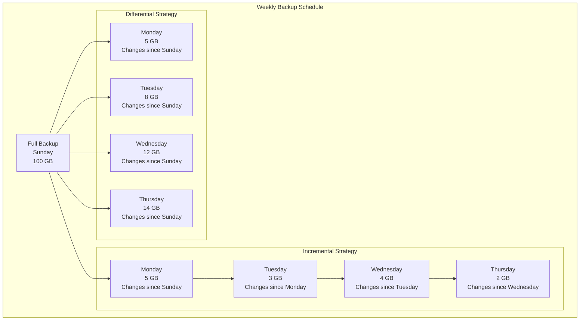
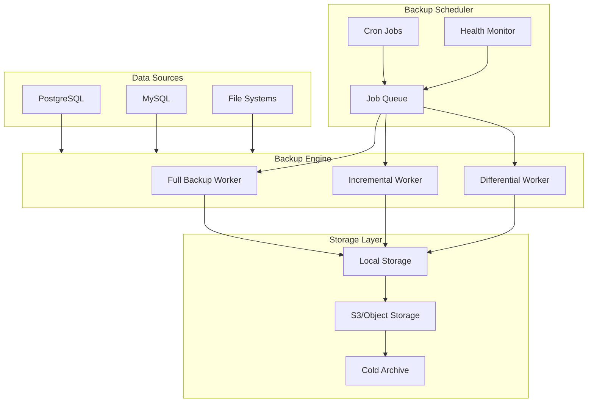
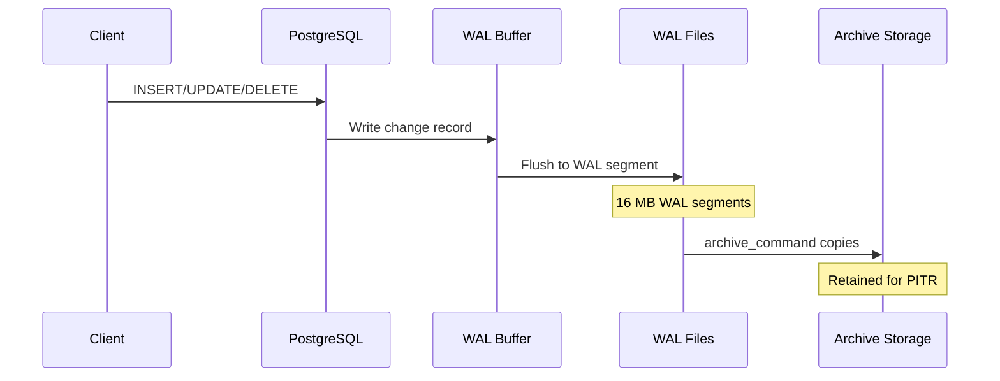
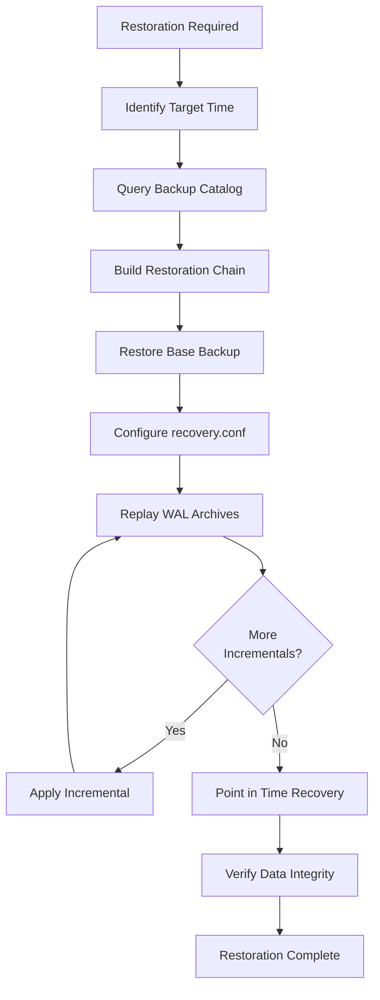

# How to Create Incremental Backup Scheduling

Author: [nawazdhandala](https://github.com/nawazdhandala)

Tags: Backup, Data Protection, Database, SRE

Description: Learn how to implement incremental backup strategies for efficient data protection.

---

Data loss can cripple businesses, making robust backup strategies essential for any organization. While full backups provide complete data copies, they consume significant storage and time. Incremental backups offer an efficient alternative by capturing only the changes since the last backup, dramatically reducing resource usage while maintaining data integrity.

## Understanding Backup Types

Before diving into implementation, let us clarify the key backup strategies:

### Full Backup
A complete copy of all data at a specific point in time. While comprehensive, full backups require substantial storage and time.

### Incremental Backup
Captures only data that has changed since the **last backup of any type**. This approach minimizes storage requirements and backup duration.

### Differential Backup
Captures all changes since the **last full backup**. Differential backups grow larger over time but simplify restoration compared to incremental backups.

## Incremental vs Differential Backups

The following diagram illustrates how these backup types differ in their data capture approach:



### Comparison Summary

| Aspect | Incremental | Differential |
|--------|-------------|--------------|
| Storage Usage | Lower (only changes since last backup) | Higher (cumulative changes) |
| Backup Speed | Faster | Slower over time |
| Restoration | Requires full backup + all incrementals | Requires full backup + latest differential |
| Complexity | Higher | Lower |

## Backup Scheduling Architecture

A well designed backup system requires careful orchestration of components:



## PostgreSQL WAL Archiving for Incremental Backups

PostgreSQL provides Write Ahead Logging (WAL) that enables point in time recovery and incremental backup strategies. WAL records all changes to the database, allowing you to replay transactions from a base backup.

### Understanding WAL Architecture



### Configuring WAL Archiving

First, configure PostgreSQL to enable WAL archiving. Edit your `postgresql.conf`:

```bash
# postgresql.conf - WAL Archiving Configuration

# Enable WAL archiving
# This tells PostgreSQL to keep WAL files for archiving
wal_level = replica

# Enable archive mode
# Required for WAL archiving to function
archive_mode = on

# Command to archive WAL segments
# %p = path to WAL file, %f = filename only
# This example copies to a local directory; adjust for your storage
archive_command = 'cp %p /var/lib/postgresql/wal_archive/%f'

# Alternative: Archive to S3 using aws cli
# archive_command = 'aws s3 cp %p s3://my-backup-bucket/wal/%f'

# Maximum WAL size before checkpoint
# Larger values mean fewer checkpoints but more recovery time
max_wal_size = 1GB

# Minimum WAL size to retain
min_wal_size = 80MB

# Number of WAL senders for streaming replication
# Set higher if using multiple standbys
max_wal_senders = 3

# Keep WAL segments for replication slots
wal_keep_size = 256MB
```

### Creating a Base Backup Script

The following script creates a base backup that serves as the foundation for incremental restoration:

```bash
#!/bin/bash
# base_backup.sh - Create a PostgreSQL base backup for PITR

# Configuration variables
# Adjust these to match your environment
BACKUP_DIR="/var/backups/postgresql"
PG_HOST="localhost"
PG_PORT="5432"
PG_USER="backup_user"
TIMESTAMP=$(date +%Y%m%d_%H%M%S)
BACKUP_NAME="base_backup_${TIMESTAMP}"
BACKUP_PATH="${BACKUP_DIR}/${BACKUP_NAME}"

# Logging function for consistent output
log() {
    echo "[$(date '+%Y-%m-%d %H:%M:%S')] $1"
}

# Error handling function
handle_error() {
    log "ERROR: $1"
    exit 1
}

# Create backup directory if it does not exist
mkdir -p "${BACKUP_DIR}" || handle_error "Failed to create backup directory"

log "Starting base backup: ${BACKUP_NAME}"

# Use pg_basebackup for consistent base backup
# -D: target directory
# -Ft: tar format
# -z: compress with gzip
# -P: show progress
# -X stream: include WAL files during backup
pg_basebackup \
    -h "${PG_HOST}" \
    -p "${PG_PORT}" \
    -U "${PG_USER}" \
    -D "${BACKUP_PATH}" \
    -Ft \
    -z \
    -P \
    -X stream \
    --checkpoint=fast \
    || handle_error "pg_basebackup failed"

# Record the backup label for tracking
BACKUP_LABEL="${BACKUP_PATH}/backup_label.txt"
echo "Backup: ${BACKUP_NAME}" > "${BACKUP_LABEL}"
echo "Timestamp: ${TIMESTAMP}" >> "${BACKUP_LABEL}"
echo "Host: ${PG_HOST}" >> "${BACKUP_LABEL}"

# Calculate and store backup size for monitoring
BACKUP_SIZE=$(du -sh "${BACKUP_PATH}" | cut -f1)
echo "Size: ${BACKUP_SIZE}" >> "${BACKUP_LABEL}"

log "Base backup completed: ${BACKUP_NAME} (${BACKUP_SIZE})"

# Optional: Upload to remote storage
# aws s3 sync "${BACKUP_PATH}" "s3://my-backup-bucket/base/${BACKUP_NAME}/"

# Clean old backups (keep last 7 days)
find "${BACKUP_DIR}" -name "base_backup_*" -type d -mtime +7 -exec rm -rf {} \;

log "Backup process completed successfully"
```

### WAL Archive Management Script

This script manages WAL archives and implements retention policies:

```bash
#!/bin/bash
# wal_archive_manager.sh - Manage WAL archives with retention policy

# Configuration
WAL_ARCHIVE_DIR="/var/lib/postgresql/wal_archive"
REMOTE_STORAGE="s3://my-backup-bucket/wal"
RETENTION_DAYS=14
LOG_FILE="/var/log/postgresql/wal_archive.log"

# Logging function
log() {
    local message="[$(date '+%Y-%m-%d %H:%M:%S')] $1"
    echo "${message}" | tee -a "${LOG_FILE}"
}

# Archive WAL to remote storage
# This function is called by archive_command in postgresql.conf
archive_wal() {
    local wal_file="$1"
    local wal_name=$(basename "${wal_file}")

    log "Archiving WAL segment: ${wal_name}"

    # Copy to local archive first
    cp "${wal_file}" "${WAL_ARCHIVE_DIR}/${wal_name}" || {
        log "ERROR: Failed to copy WAL to local archive"
        return 1
    }

    # Compress the archived WAL file
    gzip -f "${WAL_ARCHIVE_DIR}/${wal_name}" || {
        log "ERROR: Failed to compress WAL file"
        return 1
    }

    # Upload to remote storage
    aws s3 cp "${WAL_ARCHIVE_DIR}/${wal_name}.gz" \
        "${REMOTE_STORAGE}/${wal_name}.gz" \
        --storage-class STANDARD_IA || {
        log "ERROR: Failed to upload WAL to S3"
        return 1
    }

    log "Successfully archived: ${wal_name}"
    return 0
}

# Clean old WAL archives based on retention policy
cleanup_old_archives() {
    log "Starting WAL archive cleanup (retention: ${RETENTION_DAYS} days)"

    # Remove local archives older than retention period
    local deleted_count=$(find "${WAL_ARCHIVE_DIR}" -name "*.gz" \
        -mtime +${RETENTION_DAYS} -delete -print | wc -l)

    log "Deleted ${deleted_count} local WAL archives"

    # Clean remote archives using S3 lifecycle or manual deletion
    # This example uses aws cli to list and delete old files
    local cutoff_date=$(date -d "-${RETENTION_DAYS} days" +%Y-%m-%d)

    aws s3 ls "${REMOTE_STORAGE}/" | while read -r line; do
        local file_date=$(echo "${line}" | awk '{print $1}')
        local file_name=$(echo "${line}" | awk '{print $4}')

        if [[ "${file_date}" < "${cutoff_date}" ]]; then
            aws s3 rm "${REMOTE_STORAGE}/${file_name}"
            log "Deleted remote archive: ${file_name}"
        fi
    done

    log "WAL archive cleanup completed"
}

# Verify archive integrity
verify_archives() {
    log "Verifying WAL archive integrity"

    local error_count=0

    for archive in "${WAL_ARCHIVE_DIR}"/*.gz; do
        if ! gzip -t "${archive}" 2>/dev/null; then
            log "ERROR: Corrupted archive: ${archive}"
            ((error_count++))
        fi
    done

    if [[ ${error_count} -eq 0 ]]; then
        log "All archives verified successfully"
    else
        log "WARNING: Found ${error_count} corrupted archives"
    fi

    return ${error_count}
}

# Main execution
case "$1" in
    archive)
        archive_wal "$2"
        ;;
    cleanup)
        cleanup_old_archives
        ;;
    verify)
        verify_archives
        ;;
    *)
        echo "Usage: $0 {archive <wal_file>|cleanup|verify}"
        exit 1
        ;;
esac
```

## Implementing a Complete Backup Scheduler

The following Python script implements a comprehensive backup scheduler with support for incremental backups:

```python
#!/usr/bin/env python3
"""
backup_scheduler.py - Incremental Backup Scheduling System

This module implements a flexible backup scheduler supporting:
- Full backups
- Incremental backups
- Differential backups
- Retention policies
- Health monitoring
"""

import os
import subprocess
import logging
import json
from datetime import datetime, timedelta
from dataclasses import dataclass, field
from typing import Optional, List, Dict
from enum import Enum
import hashlib
import shutil

# Configure logging
logging.basicConfig(
    level=logging.INFO,
    format='%(asctime)s - %(levelname)s - %(message)s',
    handlers=[
        logging.FileHandler('/var/log/backup_scheduler.log'),
        logging.StreamHandler()
    ]
)
logger = logging.getLogger(__name__)


class BackupType(Enum):
    """Enumeration of supported backup types."""
    FULL = "full"
    INCREMENTAL = "incremental"
    DIFFERENTIAL = "differential"


@dataclass
class BackupConfig:
    """Configuration for backup operations."""

    # Database connection settings
    db_host: str = "localhost"
    db_port: int = 5432
    db_name: str = "production"
    db_user: str = "backup_user"

    # Storage paths
    backup_dir: str = "/var/backups/postgresql"
    wal_archive_dir: str = "/var/lib/postgresql/wal_archive"

    # Remote storage settings
    s3_bucket: str = "my-backup-bucket"
    s3_prefix: str = "backups"

    # Retention settings (in days)
    full_backup_retention: int = 30
    incremental_retention: int = 7
    wal_retention: int = 14

    # Schedule settings
    full_backup_day: int = 0  # Monday
    full_backup_hour: int = 2  # 2 AM
    incremental_interval_hours: int = 6


@dataclass
class BackupMetadata:
    """Metadata for a backup operation."""

    backup_id: str
    backup_type: BackupType
    timestamp: datetime
    size_bytes: int
    parent_backup_id: Optional[str] = None
    wal_start: Optional[str] = None
    wal_end: Optional[str] = None
    checksum: Optional[str] = None
    status: str = "pending"

    def to_dict(self) -> Dict:
        """Convert metadata to dictionary for JSON serialization."""
        return {
            "backup_id": self.backup_id,
            "backup_type": self.backup_type.value,
            "timestamp": self.timestamp.isoformat(),
            "size_bytes": self.size_bytes,
            "parent_backup_id": self.parent_backup_id,
            "wal_start": self.wal_start,
            "wal_end": self.wal_end,
            "checksum": self.checksum,
            "status": self.status
        }


class BackupCatalog:
    """
    Manages backup metadata and provides lookup functionality.

    The catalog tracks all backups and their relationships,
    enabling proper restoration chain identification.
    """

    def __init__(self, catalog_path: str):
        self.catalog_path = catalog_path
        self.backups: Dict[str, BackupMetadata] = {}
        self._load_catalog()

    def _load_catalog(self) -> None:
        """Load existing catalog from disk."""
        if os.path.exists(self.catalog_path):
            with open(self.catalog_path, 'r') as f:
                data = json.load(f)
                for backup_data in data.get('backups', []):
                    metadata = BackupMetadata(
                        backup_id=backup_data['backup_id'],
                        backup_type=BackupType(backup_data['backup_type']),
                        timestamp=datetime.fromisoformat(backup_data['timestamp']),
                        size_bytes=backup_data['size_bytes'],
                        parent_backup_id=backup_data.get('parent_backup_id'),
                        wal_start=backup_data.get('wal_start'),
                        wal_end=backup_data.get('wal_end'),
                        checksum=backup_data.get('checksum'),
                        status=backup_data.get('status', 'unknown')
                    )
                    self.backups[metadata.backup_id] = metadata

    def _save_catalog(self) -> None:
        """Persist catalog to disk."""
        data = {
            'backups': [b.to_dict() for b in self.backups.values()],
            'last_updated': datetime.now().isoformat()
        }

        # Write to temporary file first for atomic operation
        temp_path = f"{self.catalog_path}.tmp"
        with open(temp_path, 'w') as f:
            json.dump(data, f, indent=2)

        os.rename(temp_path, self.catalog_path)

    def add_backup(self, metadata: BackupMetadata) -> None:
        """Register a new backup in the catalog."""
        self.backups[metadata.backup_id] = metadata
        self._save_catalog()
        logger.info(f"Added backup to catalog: {metadata.backup_id}")

    def get_latest_full_backup(self) -> Optional[BackupMetadata]:
        """Retrieve the most recent successful full backup."""
        full_backups = [
            b for b in self.backups.values()
            if b.backup_type == BackupType.FULL and b.status == "completed"
        ]

        if not full_backups:
            return None

        return max(full_backups, key=lambda b: b.timestamp)

    def get_restoration_chain(
        self,
        target_time: datetime
    ) -> List[BackupMetadata]:
        """
        Build the chain of backups needed to restore to a target time.

        Returns an ordered list starting with the full backup,
        followed by incremental backups in chronological order.
        """
        # Find the most recent full backup before target time
        full_backups = [
            b for b in self.backups.values()
            if b.backup_type == BackupType.FULL
            and b.status == "completed"
            and b.timestamp <= target_time
        ]

        if not full_backups:
            raise ValueError("No full backup found before target time")

        base_backup = max(full_backups, key=lambda b: b.timestamp)
        chain = [base_backup]

        # Find all incremental backups between full backup and target
        incrementals = [
            b for b in self.backups.values()
            if b.backup_type == BackupType.INCREMENTAL
            and b.status == "completed"
            and base_backup.timestamp < b.timestamp <= target_time
        ]

        # Sort by timestamp to ensure correct order
        incrementals.sort(key=lambda b: b.timestamp)
        chain.extend(incrementals)

        return chain


class IncrementalBackupScheduler:
    """
    Main backup scheduler implementing incremental backup strategies.

    This scheduler coordinates full and incremental backups,
    manages WAL archiving, and enforces retention policies.
    """

    def __init__(self, config: BackupConfig):
        self.config = config
        self.catalog = BackupCatalog(
            os.path.join(config.backup_dir, 'backup_catalog.json')
        )

        # Ensure directories exist
        os.makedirs(config.backup_dir, exist_ok=True)
        os.makedirs(config.wal_archive_dir, exist_ok=True)

    def _generate_backup_id(self, backup_type: BackupType) -> str:
        """Generate unique backup identifier."""
        timestamp = datetime.now().strftime('%Y%m%d_%H%M%S')
        return f"{backup_type.value}_{timestamp}"

    def _calculate_checksum(self, file_path: str) -> str:
        """Calculate SHA256 checksum for backup verification."""
        sha256_hash = hashlib.sha256()

        with open(file_path, "rb") as f:
            # Read in chunks to handle large files
            for chunk in iter(lambda: f.read(4096), b""):
                sha256_hash.update(chunk)

        return sha256_hash.hexdigest()

    def _get_directory_size(self, path: str) -> int:
        """Calculate total size of a directory in bytes."""
        total_size = 0

        for dirpath, dirnames, filenames in os.walk(path):
            for filename in filenames:
                file_path = os.path.join(dirpath, filename)
                total_size += os.path.getsize(file_path)

        return total_size

    def create_full_backup(self) -> BackupMetadata:
        """
        Create a full base backup using pg_basebackup.

        This backup serves as the foundation for subsequent
        incremental backups and point in time recovery.
        """
        backup_id = self._generate_backup_id(BackupType.FULL)
        backup_path = os.path.join(self.config.backup_dir, backup_id)

        logger.info(f"Starting full backup: {backup_id}")

        # Create backup metadata
        metadata = BackupMetadata(
            backup_id=backup_id,
            backup_type=BackupType.FULL,
            timestamp=datetime.now(),
            size_bytes=0,
            status="in_progress"
        )

        try:
            # Execute pg_basebackup command
            cmd = [
                'pg_basebackup',
                '-h', self.config.db_host,
                '-p', str(self.config.db_port),
                '-U', self.config.db_user,
                '-D', backup_path,
                '-Ft',  # Tar format
                '-z',   # Compress with gzip
                '-X', 'stream',  # Include WAL
                '--checkpoint=fast',
                '-P'    # Show progress
            ]

            result = subprocess.run(
                cmd,
                capture_output=True,
                text=True,
                check=True
            )

            # Calculate backup size and checksum
            metadata.size_bytes = self._get_directory_size(backup_path)

            # Find and checksum the base tar file
            base_tar = os.path.join(backup_path, 'base.tar.gz')
            if os.path.exists(base_tar):
                metadata.checksum = self._calculate_checksum(base_tar)

            metadata.status = "completed"
            logger.info(
                f"Full backup completed: {backup_id} "
                f"({metadata.size_bytes / (1024**3):.2f} GB)"
            )

        except subprocess.CalledProcessError as e:
            metadata.status = "failed"
            logger.error(f"Full backup failed: {e.stderr}")
            raise

        finally:
            self.catalog.add_backup(metadata)

        return metadata

    def create_incremental_backup(self) -> BackupMetadata:
        """
        Create an incremental backup by archiving new WAL segments.

        This method captures all WAL changes since the last backup,
        providing an efficient way to maintain data protection.
        """
        # Find the latest backup to build upon
        latest_full = self.catalog.get_latest_full_backup()

        if not latest_full:
            logger.warning("No full backup found, creating one first")
            return self.create_full_backup()

        backup_id = self._generate_backup_id(BackupType.INCREMENTAL)
        backup_path = os.path.join(self.config.backup_dir, backup_id)
        os.makedirs(backup_path, exist_ok=True)

        logger.info(f"Starting incremental backup: {backup_id}")

        metadata = BackupMetadata(
            backup_id=backup_id,
            backup_type=BackupType.INCREMENTAL,
            timestamp=datetime.now(),
            size_bytes=0,
            parent_backup_id=latest_full.backup_id,
            status="in_progress"
        )

        try:
            # Force a WAL switch to ensure all changes are archived
            switch_cmd = [
                'psql',
                '-h', self.config.db_host,
                '-p', str(self.config.db_port),
                '-U', self.config.db_user,
                '-d', self.config.db_name,
                '-c', 'SELECT pg_switch_wal();'
            ]

            subprocess.run(switch_cmd, capture_output=True, check=True)

            # Get current WAL position for metadata
            wal_cmd = [
                'psql',
                '-h', self.config.db_host,
                '-p', str(self.config.db_port),
                '-U', self.config.db_user,
                '-d', self.config.db_name,
                '-t', '-c', 'SELECT pg_current_wal_lsn();'
            ]

            result = subprocess.run(wal_cmd, capture_output=True, text=True, check=True)
            metadata.wal_end = result.stdout.strip()

            # Copy new WAL files to incremental backup directory
            # Find WAL files modified since last backup
            last_backup_time = latest_full.timestamp

            wal_files_copied = 0
            for wal_file in os.listdir(self.config.wal_archive_dir):
                wal_path = os.path.join(self.config.wal_archive_dir, wal_file)

                if os.path.isfile(wal_path):
                    mtime = datetime.fromtimestamp(os.path.getmtime(wal_path))

                    if mtime > last_backup_time:
                        shutil.copy2(wal_path, backup_path)
                        wal_files_copied += 1

            metadata.size_bytes = self._get_directory_size(backup_path)
            metadata.status = "completed"

            logger.info(
                f"Incremental backup completed: {backup_id} "
                f"({wal_files_copied} WAL files, "
                f"{metadata.size_bytes / (1024**2):.2f} MB)"
            )

        except subprocess.CalledProcessError as e:
            metadata.status = "failed"
            logger.error(f"Incremental backup failed: {e}")
            raise

        finally:
            self.catalog.add_backup(metadata)

        return metadata

    def apply_retention_policy(self) -> Dict[str, int]:
        """
        Remove old backups according to retention settings.

        Returns a summary of deleted backups by type.
        """
        logger.info("Applying retention policy")

        deleted = {"full": 0, "incremental": 0, "wal": 0}
        now = datetime.now()

        # Calculate cutoff dates
        full_cutoff = now - timedelta(days=self.config.full_backup_retention)
        incr_cutoff = now - timedelta(days=self.config.incremental_retention)
        wal_cutoff = now - timedelta(days=self.config.wal_retention)

        # Process each backup
        for backup_id, metadata in list(self.catalog.backups.items()):
            should_delete = False

            if metadata.backup_type == BackupType.FULL:
                if metadata.timestamp < full_cutoff:
                    should_delete = True
                    deleted["full"] += 1

            elif metadata.backup_type == BackupType.INCREMENTAL:
                if metadata.timestamp < incr_cutoff:
                    should_delete = True
                    deleted["incremental"] += 1

            if should_delete:
                # Remove backup files
                backup_path = os.path.join(self.config.backup_dir, backup_id)
                if os.path.exists(backup_path):
                    shutil.rmtree(backup_path)
                    logger.info(f"Deleted expired backup: {backup_id}")

                # Remove from catalog
                del self.catalog.backups[backup_id]

        # Clean old WAL archives
        for wal_file in os.listdir(self.config.wal_archive_dir):
            wal_path = os.path.join(self.config.wal_archive_dir, wal_file)

            if os.path.isfile(wal_path):
                mtime = datetime.fromtimestamp(os.path.getmtime(wal_path))

                if mtime < wal_cutoff:
                    os.remove(wal_path)
                    deleted["wal"] += 1

        self.catalog._save_catalog()

        logger.info(
            f"Retention policy applied: "
            f"{deleted['full']} full, "
            f"{deleted['incremental']} incremental, "
            f"{deleted['wal']} WAL files deleted"
        )

        return deleted

    def should_run_full_backup(self) -> bool:
        """Determine if a full backup should run based on schedule."""
        now = datetime.now()

        # Check if it is the scheduled day and hour
        if now.weekday() != self.config.full_backup_day:
            return False

        if now.hour != self.config.full_backup_hour:
            return False

        # Check if we already have a full backup today
        latest = self.catalog.get_latest_full_backup()

        if latest and latest.timestamp.date() == now.date():
            return False

        return True

    def should_run_incremental_backup(self) -> bool:
        """Determine if an incremental backup should run."""
        # Must have at least one full backup
        if not self.catalog.get_latest_full_backup():
            return False

        now = datetime.now()

        # Find most recent backup of any type
        all_backups = [
            b for b in self.catalog.backups.values()
            if b.status == "completed"
        ]

        if not all_backups:
            return True

        latest = max(all_backups, key=lambda b: b.timestamp)

        # Check if enough time has passed
        hours_since_last = (now - latest.timestamp).total_seconds() / 3600

        return hours_since_last >= self.config.incremental_interval_hours

    def run_scheduled_backup(self) -> Optional[BackupMetadata]:
        """
        Execute the appropriate backup based on current schedule.

        This is the main entry point for scheduled backup execution.
        """
        if self.should_run_full_backup():
            return self.create_full_backup()

        elif self.should_run_incremental_backup():
            return self.create_incremental_backup()

        logger.debug("No backup needed at this time")
        return None


def main():
    """Main entry point for the backup scheduler."""

    # Load configuration
    config = BackupConfig(
        db_host=os.getenv('PGHOST', 'localhost'),
        db_port=int(os.getenv('PGPORT', '5432')),
        db_name=os.getenv('PGDATABASE', 'production'),
        db_user=os.getenv('PGUSER', 'backup_user'),
        backup_dir=os.getenv('BACKUP_DIR', '/var/backups/postgresql'),
        s3_bucket=os.getenv('S3_BUCKET', 'my-backup-bucket')
    )

    scheduler = IncrementalBackupScheduler(config)

    # Run scheduled backup
    result = scheduler.run_scheduled_backup()

    if result:
        print(f"Backup completed: {result.backup_id}")

    # Apply retention policy
    scheduler.apply_retention_policy()


if __name__ == '__main__':
    main()
```

## Setting Up Cron Jobs for Automated Scheduling

Create the following crontab entries to automate the backup schedule:

```bash
# /etc/cron.d/postgresql-backup
# Crontab entries for PostgreSQL incremental backup scheduling

# Environment variables for PostgreSQL connection
PGHOST=localhost
PGPORT=5432
PGDATABASE=production
PGUSER=backup_user
BACKUP_DIR=/var/backups/postgresql
S3_BUCKET=my-backup-bucket

# Full backup every Sunday at 2:00 AM
# This creates the base for all incremental backups during the week
0 2 * * 0 postgres /opt/scripts/backup_scheduler.py full >> /var/log/backup_full.log 2>&1

# Incremental backup every 6 hours (except during full backup time on Sunday)
# 0:00, 6:00, 12:00, 18:00 daily
0 0,6,12,18 * * 1-6 postgres /opt/scripts/backup_scheduler.py incremental >> /var/log/backup_incr.log 2>&1
0 6,12,18 * * 0 postgres /opt/scripts/backup_scheduler.py incremental >> /var/log/backup_incr.log 2>&1

# WAL archive cleanup daily at 3:00 AM
0 3 * * * postgres /opt/scripts/wal_archive_manager.sh cleanup >> /var/log/wal_cleanup.log 2>&1

# Verify backup integrity weekly on Saturday at 4:00 AM
0 4 * * 6 postgres /opt/scripts/verify_backups.sh >> /var/log/backup_verify.log 2>&1

# Upload backups to S3 every hour
0 * * * * postgres /opt/scripts/sync_to_s3.sh >> /var/log/backup_sync.log 2>&1
```

## Restoration Process

Understanding the restoration workflow is crucial for validating your backup strategy:



### Restoration Script Example

```bash
#!/bin/bash
# restore_pitr.sh - Point in Time Recovery Script

# Configuration
BACKUP_DIR="/var/backups/postgresql"
RESTORE_DIR="/var/lib/postgresql/16/main"
WAL_ARCHIVE="/var/lib/postgresql/wal_archive"
CATALOG_FILE="${BACKUP_DIR}/backup_catalog.json"

# Target recovery time (ISO 8601 format)
TARGET_TIME="${1:-$(date -Iseconds)}"

log() {
    echo "[$(date '+%Y-%m-%d %H:%M:%S')] $1"
}

# Validate target time
if ! date -d "${TARGET_TIME}" &>/dev/null; then
    echo "Invalid target time format. Use ISO 8601 (e.g., 2024-01-15T14:30:00)"
    exit 1
fi

log "Starting PITR restoration to: ${TARGET_TIME}"

# Stop PostgreSQL if running
if systemctl is-active --quiet postgresql; then
    log "Stopping PostgreSQL service"
    sudo systemctl stop postgresql
fi

# Find the appropriate full backup from catalog
# Using jq to parse the JSON catalog
FULL_BACKUP=$(jq -r --arg target "${TARGET_TIME}" '
    .backups
    | map(select(.backup_type == "full" and .status == "completed" and .timestamp <= $target))
    | sort_by(.timestamp)
    | last
    | .backup_id
' "${CATALOG_FILE}")

if [[ -z "${FULL_BACKUP}" || "${FULL_BACKUP}" == "null" ]]; then
    log "ERROR: No suitable full backup found"
    exit 1
fi

log "Using full backup: ${FULL_BACKUP}"

# Clear existing data directory (with safety check)
if [[ -d "${RESTORE_DIR}" ]]; then
    log "Clearing existing data directory"
    rm -rf "${RESTORE_DIR:?}"/*
fi

# Extract base backup
BACKUP_PATH="${BACKUP_DIR}/${FULL_BACKUP}"
log "Extracting base backup from ${BACKUP_PATH}"

cd "${RESTORE_DIR}" || exit 1
tar -xzf "${BACKUP_PATH}/base.tar.gz"

# Extract pg_wal if present
if [[ -f "${BACKUP_PATH}/pg_wal.tar.gz" ]]; then
    tar -xzf "${BACKUP_PATH}/pg_wal.tar.gz" -C pg_wal/
fi

# Create recovery configuration
# For PostgreSQL 12+, use postgresql.conf and recovery.signal
log "Configuring recovery settings"

cat > "${RESTORE_DIR}/postgresql.auto.conf" << EOF
# Recovery configuration for PITR
restore_command = 'cp ${WAL_ARCHIVE}/%f %p'
recovery_target_time = '${TARGET_TIME}'
recovery_target_action = 'promote'
EOF

# Create recovery signal file
touch "${RESTORE_DIR}/recovery.signal"

# Set correct ownership
sudo chown -R postgres:postgres "${RESTORE_DIR}"

# Start PostgreSQL to begin recovery
log "Starting PostgreSQL for recovery"
sudo systemctl start postgresql

# Monitor recovery progress
log "Monitoring recovery progress..."
while [[ -f "${RESTORE_DIR}/recovery.signal" ]]; do
    sleep 5
    # Check if PostgreSQL is still recovering
    if ! systemctl is-active --quiet postgresql; then
        log "ERROR: PostgreSQL stopped during recovery"
        exit 1
    fi
done

log "Recovery completed successfully"

# Verify database is accessible
if psql -c "SELECT 1;" &>/dev/null; then
    log "Database is accessible and operational"
else
    log "WARNING: Database may require additional verification"
fi
```

## Monitoring and Alerting

Implement monitoring to ensure backup health:

```python
#!/usr/bin/env python3
"""
backup_monitor.py - Monitor backup health and send alerts
"""

import os
import json
import smtplib
from datetime import datetime, timedelta
from email.mime.text import MIMEText
from typing import List, Dict


class BackupMonitor:
    """Monitor backup operations and alert on issues."""

    def __init__(self, catalog_path: str, config: Dict):
        self.catalog_path = catalog_path
        self.config = config
        self.alerts: List[str] = []

    def check_backup_freshness(self) -> bool:
        """Verify backups are running on schedule."""
        with open(self.catalog_path) as f:
            catalog = json.load(f)

        now = datetime.now()
        issues_found = False

        # Check for recent full backup (within 7 days)
        full_backups = [
            b for b in catalog['backups']
            if b['backup_type'] == 'full' and b['status'] == 'completed'
        ]

        if full_backups:
            latest_full = max(
                full_backups,
                key=lambda b: datetime.fromisoformat(b['timestamp'])
            )
            full_age = now - datetime.fromisoformat(latest_full['timestamp'])

            if full_age > timedelta(days=7):
                self.alerts.append(
                    f"CRITICAL: Last full backup is {full_age.days} days old"
                )
                issues_found = True
        else:
            self.alerts.append("CRITICAL: No full backup found")
            issues_found = True

        # Check for recent incremental backup (within 12 hours)
        incr_backups = [
            b for b in catalog['backups']
            if b['backup_type'] == 'incremental' and b['status'] == 'completed'
        ]

        if incr_backups:
            latest_incr = max(
                incr_backups,
                key=lambda b: datetime.fromisoformat(b['timestamp'])
            )
            incr_age = now - datetime.fromisoformat(latest_incr['timestamp'])

            if incr_age > timedelta(hours=12):
                self.alerts.append(
                    f"WARNING: Last incremental backup is {incr_age.total_seconds() / 3600:.1f} hours old"
                )
                issues_found = True

        return not issues_found

    def check_storage_usage(self) -> bool:
        """Verify storage has sufficient space for backups."""
        backup_dir = self.config.get('backup_dir', '/var/backups/postgresql')

        # Get filesystem statistics
        stat = os.statvfs(backup_dir)
        free_gb = (stat.f_bavail * stat.f_frsize) / (1024 ** 3)
        total_gb = (stat.f_blocks * stat.f_frsize) / (1024 ** 3)
        usage_percent = ((total_gb - free_gb) / total_gb) * 100

        if usage_percent > 90:
            self.alerts.append(
                f"CRITICAL: Backup storage is {usage_percent:.1f}% full "
                f"({free_gb:.1f} GB remaining)"
            )
            return False
        elif usage_percent > 80:
            self.alerts.append(
                f"WARNING: Backup storage is {usage_percent:.1f}% full"
            )

        return True

    def check_failed_backups(self) -> bool:
        """Check for recent backup failures."""
        with open(self.catalog_path) as f:
            catalog = json.load(f)

        # Check last 10 backups for failures
        recent_backups = sorted(
            catalog['backups'],
            key=lambda b: b['timestamp'],
            reverse=True
        )[:10]

        failed = [b for b in recent_backups if b['status'] == 'failed']

        if len(failed) >= 3:
            self.alerts.append(
                f"CRITICAL: {len(failed)} of last 10 backups have failed"
            )
            return False
        elif failed:
            self.alerts.append(
                f"WARNING: {len(failed)} recent backup(s) failed"
            )

        return True

    def send_alert_email(self) -> None:
        """Send alert email if issues were found."""
        if not self.alerts:
            return

        # Compose email
        subject = "Backup Alert: Issues Detected"
        body = "The following backup issues were detected:\n\n"
        body += "\n".join(f"- {alert}" for alert in self.alerts)
        body += f"\n\nTimestamp: {datetime.now().isoformat()}"

        msg = MIMEText(body)
        msg['Subject'] = subject
        msg['From'] = self.config.get('alert_from', 'backup@example.com')
        msg['To'] = self.config.get('alert_to', 'ops@example.com')

        # Send email
        try:
            with smtplib.SMTP(self.config.get('smtp_host', 'localhost')) as smtp:
                smtp.send_message(msg)
        except Exception as e:
            print(f"Failed to send alert email: {e}")

    def run_all_checks(self) -> bool:
        """Execute all monitoring checks."""
        results = [
            self.check_backup_freshness(),
            self.check_storage_usage(),
            self.check_failed_backups()
        ]

        if self.alerts:
            self.send_alert_email()

        return all(results)
```

## Best Practices

1. **Test Restorations Regularly**: Schedule periodic restoration tests to verify backup integrity and practice the recovery process.

2. **Use the 3-2-1 Rule**: Maintain at least 3 copies of data, on 2 different storage types, with 1 copy offsite.

3. **Encrypt Sensitive Backups**: Use encryption for backups containing sensitive data, especially when storing offsite.

4. **Monitor Backup Jobs**: Implement alerting for backup failures and storage capacity issues.

5. **Document Recovery Procedures**: Maintain clear, tested documentation for restoration processes.

6. **Validate WAL Continuity**: Ensure no gaps exist in WAL archives that would prevent point in time recovery.

7. **Consider RTO and RPO**: Design your backup schedule around your Recovery Time Objective and Recovery Point Objective requirements.

## Conclusion

Incremental backup scheduling provides an efficient approach to data protection by minimizing storage usage and backup windows while maintaining comprehensive recovery capabilities. By leveraging PostgreSQL WAL archiving, you can achieve point in time recovery with minimal data loss.

The key to successful incremental backup implementation lies in proper planning, consistent monitoring, and regular testing of restoration procedures. With the scripts and strategies outlined in this guide, you can build a robust backup system that protects your critical data while optimizing resource utilization.
