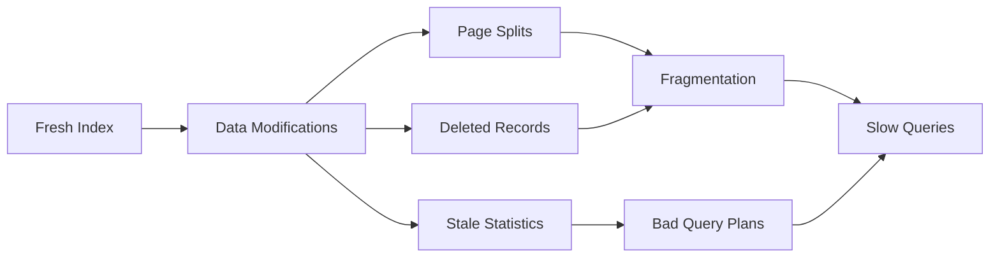
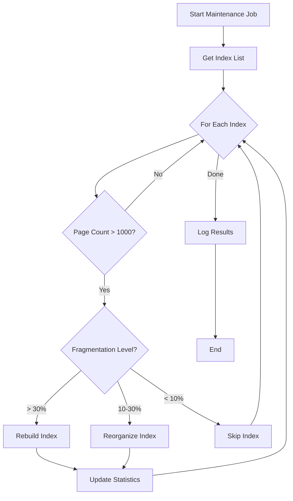
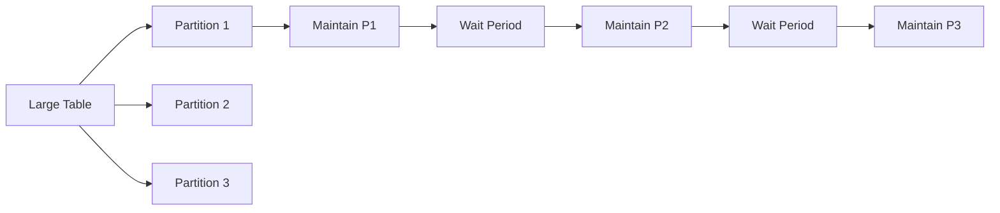

# How to Build Index Maintenance Strategies

Author: [nawazdhandala](https://github.com/nawazdhandala)

Tags: Database, Indexing, Maintenance, DBA

Description: Learn to build index maintenance strategies for keeping indexes healthy and performant over time.

---

Database indexes degrade over time. Insert, update, and delete operations cause fragmentation, bloat, and stale statistics. Without proper maintenance, query performance slowly degrades until your application starts timing out. This guide covers practical strategies for building automated index maintenance that keeps your databases running smoothly.

## Why Indexes Need Maintenance

When you modify data, indexes must be updated too. These operations leave gaps in index pages, create imbalanced tree structures, and cause statistics to become outdated. The result is slower queries and wasted storage space.

Here is how index degradation happens over time:



## Key Metrics to Monitor

Before building maintenance strategies, you need to know what to measure. These metrics tell you when an index needs attention.

| Metric | Description | Action Threshold |
|--------|-------------|------------------|
| Fragmentation | Percentage of pages out of order | > 30% rebuild, 10-30% reorganize |
| Page Fullness | Average fill percentage of pages | < 60% indicates bloat |
| Index Size Ratio | Index size vs actual data size | > 3x needs investigation |
| Statistics Age | Days since last statistics update | > 7 days for active tables |
| Unused Indexes | Indexes with zero reads | Remove after verification |

## Building a Fragmentation Check Script

This SQL Server script identifies indexes that need maintenance by checking fragmentation levels and page counts.

```sql
-- Check fragmentation for all indexes in current database
-- Returns indexes sorted by fragmentation percentage
SELECT
    OBJECT_SCHEMA_NAME(ips.object_id) AS schema_name,
    OBJECT_NAME(ips.object_id) AS table_name,
    i.name AS index_name,
    ips.index_type_desc AS index_type,
    ips.avg_fragmentation_in_percent AS fragmentation_pct,
    ips.page_count,
    ips.avg_page_space_used_in_percent AS page_fullness,
    -- Determine recommended action based on fragmentation
    CASE
        WHEN ips.avg_fragmentation_in_percent > 30 THEN 'REBUILD'
        WHEN ips.avg_fragmentation_in_percent > 10 THEN 'REORGANIZE'
        ELSE 'OK'
    END AS recommended_action
FROM sys.dm_db_index_physical_stats(
    DB_ID(),
    NULL,
    NULL,
    NULL,
    'LIMITED'
) ips
INNER JOIN sys.indexes i
    ON ips.object_id = i.object_id
    AND ips.index_id = i.index_id
WHERE ips.page_count > 1000  -- Skip small indexes
    AND ips.index_id > 0      -- Skip heaps
ORDER BY ips.avg_fragmentation_in_percent DESC;
```

## Automated Maintenance Workflow

The maintenance workflow should run during low-traffic periods and handle indexes based on their fragmentation level. Here is the decision process:



## PostgreSQL Maintenance Script

PostgreSQL uses REINDEX and VACUUM instead of rebuild and reorganize. This script identifies bloated indexes and generates maintenance commands.

```sql
-- Find bloated indexes in PostgreSQL
-- Uses pg_stat_user_indexes to identify candidates
WITH index_stats AS (
    SELECT
        schemaname,
        tablename,
        indexrelname AS index_name,
        idx_scan AS index_scans,
        pg_size_pretty(pg_relation_size(indexrelid)) AS index_size,
        pg_relation_size(indexrelid) AS index_size_bytes
    FROM pg_stat_user_indexes
    WHERE idx_scan > 0  -- Only active indexes
)
SELECT
    schemaname,
    tablename,
    index_name,
    index_scans,
    index_size,
    -- Generate maintenance command
    'REINDEX INDEX CONCURRENTLY ' ||
        quote_ident(schemaname) || '.' ||
        quote_ident(index_name) || ';' AS reindex_command
FROM index_stats
WHERE index_size_bytes > 10485760  -- Larger than 10MB
ORDER BY index_size_bytes DESC;
```

For automated vacuuming in PostgreSQL, configure these parameters based on your workload:

```sql
-- Recommended autovacuum settings for active tables
ALTER TABLE orders SET (
    autovacuum_vacuum_scale_factor = 0.05,  -- Vacuum at 5% dead tuples
    autovacuum_analyze_scale_factor = 0.02, -- Analyze at 2% changes
    autovacuum_vacuum_cost_delay = 10       -- Reduce I/O impact
);
```

## Scheduling Maintenance Windows

Maintenance timing depends on your traffic patterns and tolerance for locks. Here is a comparison of different approaches:

| Strategy | Pros | Cons | Best For |
|----------|------|------|----------|
| Nightly Full | Simple, thorough | Long locks, downtime risk | Small databases |
| Continuous Small | Minimal impact | Complex logic needed | OLTP systems |
| Weekend Batch | Long window available | Weekday degradation | Business applications |
| Threshold Based | Only runs when needed | Requires monitoring | Cloud databases |

## Building a Maintenance Schedule

This Python script creates a maintenance schedule that adapts to your monitoring data.

```python
import schedule
import time
from datetime import datetime

def get_fragmented_indexes(connection, threshold=10):
    """
    Query the database for indexes above fragmentation threshold.
    Returns list of indexes needing maintenance.
    """
    query = """
        SELECT index_name, fragmentation_pct, page_count
        FROM index_health_view
        WHERE fragmentation_pct > %s
        ORDER BY page_count DESC
    """
    cursor = connection.cursor()
    cursor.execute(query, (threshold,))
    return cursor.fetchall()

def maintain_index(connection, index_name, fragmentation):
    """
    Perform appropriate maintenance based on fragmentation level.
    Rebuild for high fragmentation, reorganize for moderate.
    """
    if fragmentation > 30:
        # Full rebuild for heavily fragmented indexes
        sql = f"ALTER INDEX {index_name} REBUILD WITH (ONLINE = ON)"
    else:
        # Reorganize for moderate fragmentation
        sql = f"ALTER INDEX {index_name} REORGANIZE"

    cursor = connection.cursor()
    cursor.execute(sql)
    connection.commit()

    # Log the maintenance action
    log_maintenance(index_name, fragmentation, datetime.now())

def run_maintenance_window():
    """
    Main maintenance routine that runs during scheduled window.
    Processes indexes in order of size to maximize impact.
    """
    conn = get_database_connection()
    indexes = get_fragmented_indexes(conn, threshold=10)

    for index_name, frag_pct, page_count in indexes:
        print(f"Maintaining {index_name}: {frag_pct}% fragmentation")
        maintain_index(conn, index_name, frag_pct)

    conn.close()

# Schedule maintenance for low traffic periods
schedule.every().day.at("02:00").do(run_maintenance_window)
schedule.every().sunday.at("03:00").do(run_full_maintenance)

while True:
    schedule.run_pending()
    time.sleep(60)
```

## Handling Large Tables

Large tables require special handling to avoid long locks and excessive resource usage. Use these techniques:

1. **Online operations**: Use ONLINE = ON in SQL Server or CONCURRENTLY in PostgreSQL
2. **Partitioned maintenance**: Maintain one partition at a time
3. **Batched rebuilds**: Process indexes in batches with delays between them
4. **Resource governor**: Limit CPU and memory used by maintenance jobs

Here is how partitioned maintenance flows:



## Monitoring Maintenance Results

Track these metrics before and after maintenance to verify improvement:

```sql
-- Create a maintenance log table
CREATE TABLE index_maintenance_log (
    log_id INT IDENTITY PRIMARY KEY,
    index_name NVARCHAR(256),
    maintenance_type VARCHAR(20),
    frag_before DECIMAL(5,2),
    frag_after DECIMAL(5,2),
    duration_seconds INT,
    executed_at DATETIME DEFAULT GETDATE()
);

-- Query to analyze maintenance effectiveness
SELECT
    index_name,
    AVG(frag_before) AS avg_frag_before,
    AVG(frag_after) AS avg_frag_after,
    AVG(duration_seconds) AS avg_duration,
    COUNT(*) AS maintenance_count
FROM index_maintenance_log
WHERE executed_at > DATEADD(month, -1, GETDATE())
GROUP BY index_name
ORDER BY avg_frag_before DESC;
```

## Summary

Building effective index maintenance requires monitoring, automation, and appropriate scheduling. Start by measuring fragmentation and statistics age across your databases. Set up automated jobs that run during low-traffic windows and handle different fragmentation levels appropriately. For large tables, use online operations and partitioned approaches to minimize impact on running applications. Track your maintenance results to verify that your strategy is working and adjust thresholds as needed.
