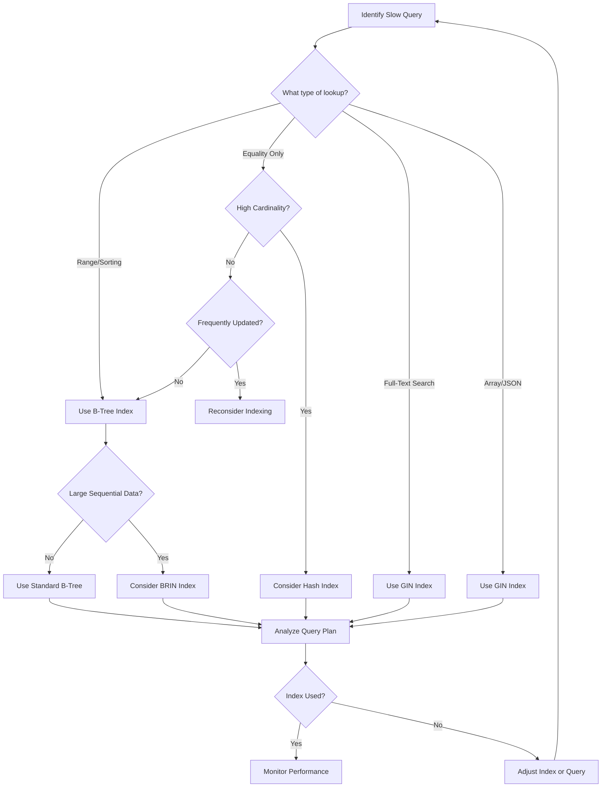
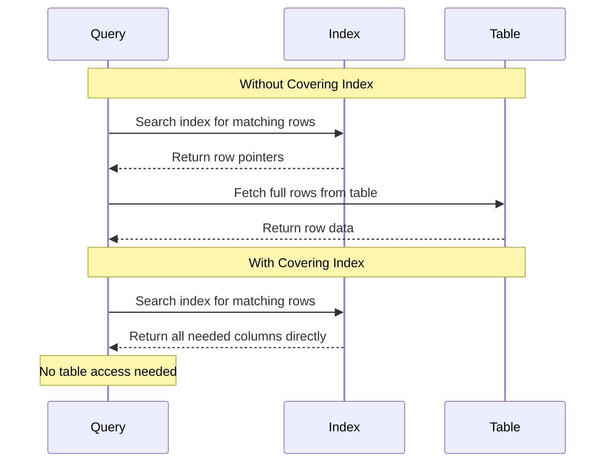

# How to Implement Index Optimization

Author: [nawazdhandala](https://github.com/nawazdhandala)

Tags: Database, Indexing, Performance, Optimization

Description: A comprehensive guide to database index optimization techniques that dramatically improve query performance and reduce resource consumption.

---

Database indexes are one of the most powerful tools for improving query performance. However, poorly designed indexes can actually hurt performance by consuming storage, slowing down writes, and confusing the query optimizer. This guide covers practical index optimization strategies that will help you get the most out of your database.

## Understanding Index Types

Different index types serve different purposes. Choosing the right type for your use case is the first step toward optimization.

### B-Tree Indexes

B-Tree indexes are the default and most commonly used index type. They work well for equality comparisons and range queries.

```sql
-- Create a B-Tree index on a single column
CREATE INDEX idx_users_email ON users(email);

-- B-Tree indexes excel at these query patterns:
-- Equality: WHERE email = 'user@example.com'
-- Range: WHERE created_at > '2026-01-01'
-- Prefix: WHERE name LIKE 'John%'
-- Sorting: ORDER BY created_at DESC
```

### Hash Indexes

Hash indexes are optimized for equality comparisons only. They cannot be used for range queries or sorting.

```sql
-- Create a Hash index (PostgreSQL syntax)
CREATE INDEX idx_users_uuid ON users USING HASH (uuid);

-- Hash indexes are faster for exact matches:
-- WHERE uuid = 'abc123-def456-ghi789'
```

### GIN (Generalized Inverted Index)

GIN indexes are ideal for columns containing multiple values, such as arrays or full-text search.

```sql
-- Create a GIN index for array columns
CREATE INDEX idx_posts_tags ON posts USING GIN (tags);

-- Create a GIN index for full-text search
CREATE INDEX idx_articles_content ON articles USING GIN (to_tsvector('english', content));

-- GIN indexes support these operations:
-- Array containment: WHERE tags @> ARRAY['database', 'performance']
-- Full-text search: WHERE to_tsvector('english', content) @@ to_tsquery('optimization')
```

### BRIN (Block Range Index)

BRIN indexes are compact indexes ideal for large tables where data is naturally ordered.

```sql
-- Create a BRIN index on a timestamp column
CREATE INDEX idx_logs_created_at ON logs USING BRIN (created_at);

-- BRIN indexes work best when:
-- 1. The table is very large (millions of rows)
-- 2. Data is inserted in order (like time-series data)
-- 3. You need to save storage space
```

## Index Selection Strategy



## Composite Index Design

Composite indexes contain multiple columns and require careful ordering to be effective.

### Column Ordering Rules

The order of columns in a composite index matters significantly. Follow these guidelines:

1. Place equality columns first
2. Place range columns last
3. Consider query frequency when ordering

```sql
-- Example: Users table with common query patterns

-- Query 1: Find active users in a department
-- WHERE department_id = 5 AND status = 'active'

-- Query 2: Find users created in a date range within a department
-- WHERE department_id = 5 AND created_at > '2026-01-01'

-- Optimal composite index for both queries:
CREATE INDEX idx_users_dept_status_created
ON users(department_id, status, created_at);

-- The index works because:
-- 1. department_id (equality) comes first
-- 2. status (equality) comes second
-- 3. created_at (range) comes last
```

### The Leftmost Prefix Rule

A composite index can satisfy queries that use a leftmost prefix of the indexed columns.

```sql
-- Given this composite index:
CREATE INDEX idx_orders_customer_status_date
ON orders(customer_id, status, order_date);

-- These queries CAN use the index:
SELECT * FROM orders WHERE customer_id = 100;
SELECT * FROM orders WHERE customer_id = 100 AND status = 'pending';
SELECT * FROM orders WHERE customer_id = 100 AND status = 'pending' AND order_date > '2026-01-01';

-- This query CANNOT use the index efficiently:
SELECT * FROM orders WHERE status = 'pending';
-- (It skips customer_id, breaking the leftmost prefix)
```

## Covering Indexes

A covering index includes all columns needed by a query, allowing the database to satisfy the query entirely from the index without accessing the table.

```sql
-- Original query that requires table access:
SELECT customer_id, order_date, total_amount
FROM orders
WHERE customer_id = 100 AND status = 'completed';

-- Create a covering index using INCLUDE (PostgreSQL 11+):
CREATE INDEX idx_orders_covering
ON orders(customer_id, status)
INCLUDE (order_date, total_amount);

-- Now the query reads only from the index (Index-Only Scan)
-- This is significantly faster for read-heavy workloads
```

### Covering Index Performance



## Index Maintenance Strategies

Indexes require regular maintenance to remain effective.

### Identifying Unused Indexes

```sql
-- PostgreSQL: Find unused indexes
SELECT
    schemaname,
    tablename,
    indexname,
    idx_scan as times_used,
    pg_size_pretty(pg_relation_size(indexrelid)) as index_size
FROM pg_stat_user_indexes
WHERE idx_scan = 0
AND indexrelid NOT IN (
    SELECT conindid FROM pg_constraint WHERE contype IN ('p', 'u')
)
ORDER BY pg_relation_size(indexrelid) DESC;

-- MySQL: Find unused indexes
SELECT
    object_schema,
    object_name,
    index_name
FROM performance_schema.table_io_waits_summary_by_index_usage
WHERE index_name IS NOT NULL
AND count_star = 0
AND object_schema NOT IN ('mysql', 'performance_schema');
```

### Identifying Duplicate Indexes

```sql
-- PostgreSQL: Find duplicate indexes
SELECT
    pg_size_pretty(sum(pg_relation_size(idx))::bigint) as size,
    (array_agg(idx))[1] as idx1,
    (array_agg(idx))[2] as idx2,
    (array_agg(idx))[3] as idx3
FROM (
    SELECT
        indexrelid::regclass as idx,
        (indrelid::text || E'\n' || indclass::text || E'\n' ||
         indkey::text || E'\n' || coalesce(indexprs::text, '') ||
         E'\n' || coalesce(indpred::text, '')) as key
    FROM pg_index
) sub
GROUP BY key
HAVING count(*) > 1
ORDER BY sum(pg_relation_size(idx)) DESC;
```

### Rebuilding Fragmented Indexes

```sql
-- PostgreSQL: Rebuild index without locking
REINDEX INDEX CONCURRENTLY idx_users_email;

-- PostgreSQL: Rebuild all indexes on a table
REINDEX TABLE CONCURRENTLY users;

-- MySQL: Rebuild index
ALTER TABLE users DROP INDEX idx_users_email, ADD INDEX idx_users_email (email);

-- MySQL: Optimize table (rebuilds all indexes)
OPTIMIZE TABLE users;
```

### Monitoring Index Bloat

```sql
-- PostgreSQL: Check index bloat
SELECT
    schemaname,
    tablename,
    indexname,
    pg_size_pretty(pg_relation_size(indexrelid)) as index_size,
    idx_scan as index_scans,
    idx_tup_read as tuples_read,
    idx_tup_fetch as tuples_fetched
FROM pg_stat_user_indexes
ORDER BY pg_relation_size(indexrelid) DESC
LIMIT 20;
```

## Practical Optimization Example

Here is a complete example of optimizing a slow query:

```sql
-- Step 1: Identify the slow query
-- This query takes 5 seconds on a table with 10 million rows
SELECT
    o.order_id,
    o.order_date,
    o.total_amount,
    c.customer_name
FROM orders o
JOIN customers c ON o.customer_id = c.customer_id
WHERE o.status = 'pending'
AND o.order_date > '2026-01-01'
AND o.region = 'US'
ORDER BY o.order_date DESC
LIMIT 100;

-- Step 2: Analyze the query plan
EXPLAIN (ANALYZE, BUFFERS, FORMAT TEXT)
SELECT ... (same query);

-- Output shows:
-- Seq Scan on orders (actual time=4532.123..4987.456 rows=100)
-- This indicates no index is being used

-- Step 3: Create an optimized composite index
-- Equality columns first (region, status), range column last (order_date)
CREATE INDEX idx_orders_region_status_date
ON orders(region, status, order_date DESC);

-- Step 4: For a covering index that avoids table access:
CREATE INDEX idx_orders_covering_v2
ON orders(region, status, order_date DESC)
INCLUDE (order_id, total_amount, customer_id);

-- Step 5: Verify the improvement
EXPLAIN (ANALYZE, BUFFERS, FORMAT TEXT)
SELECT ... (same query);

-- New output shows:
-- Index Only Scan using idx_orders_covering_v2 (actual time=0.045..0.892 rows=100)
-- Query now runs in under 1 millisecond
```

## Best Practices Summary

1. **Start with query analysis**: Use EXPLAIN ANALYZE to understand how queries execute before adding indexes.

2. **Index selectively**: Every index has a maintenance cost. Only create indexes for queries that need them.

3. **Order composite indexes correctly**: Equality columns first, range columns last, most selective columns early.

4. **Use covering indexes for read-heavy workloads**: They eliminate table lookups entirely.

5. **Monitor and maintain**: Regularly check for unused, duplicate, and bloated indexes.

6. **Test in staging**: Always test index changes with production-like data volumes before deploying.

7. **Consider write performance**: Heavy indexing can slow down INSERT, UPDATE, and DELETE operations.

8. **Use partial indexes when appropriate**: Index only the rows you actually query.

```sql
-- Partial index example: Only index active users
CREATE INDEX idx_users_active_email
ON users(email)
WHERE status = 'active';

-- This index is smaller and faster for queries like:
-- SELECT * FROM users WHERE email = 'user@example.com' AND status = 'active';
```

By following these index optimization strategies, you can significantly improve your database query performance while keeping maintenance overhead manageable.
