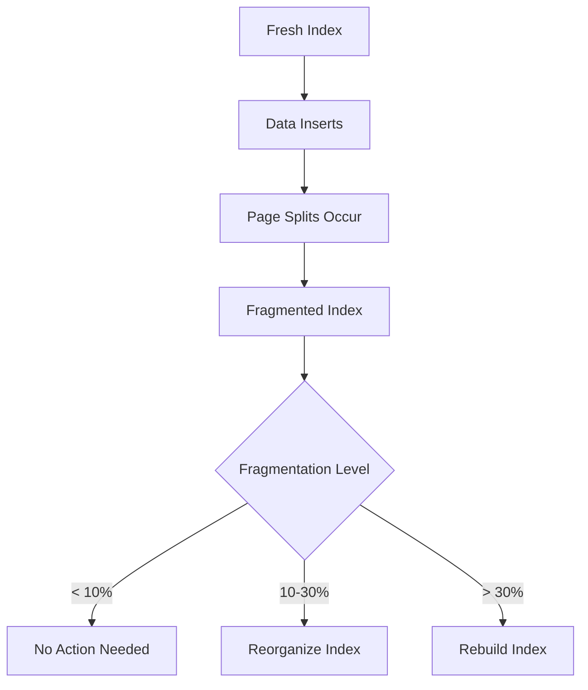
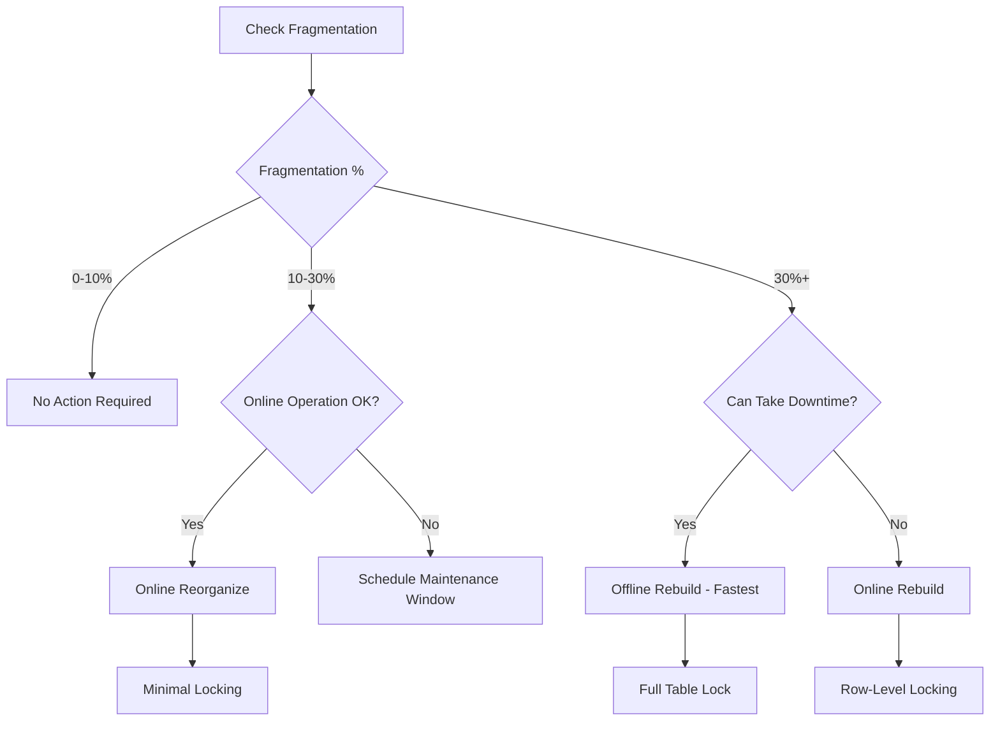
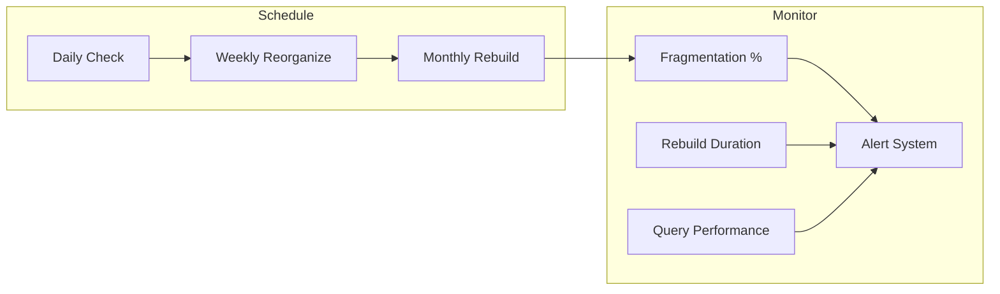

# How to Implement Index Rebuild Strategies

Author: [nawazdhandala](https://github.com/nawazdhandala)

Tags: Database, Indexing, Maintenance, Performance

Description: Learn to implement index rebuild strategies for defragmentation and performance restoration.

---

> Database indexes degrade over time. As data gets inserted, updated, and deleted, indexes become fragmented, leading to slower queries and wasted storage space. This guide covers practical strategies for identifying fragmented indexes and rebuilding them to restore peak performance.

Index fragmentation occurs when the logical order of index pages no longer matches the physical order on disk. This forces the database engine to perform additional I/O operations, slowing down query execution.

---

## Understanding Index Fragmentation

Index fragmentation comes in two forms:

| Type | Description | Impact |
|------|-------------|--------|
| Internal Fragmentation | Pages are not filled to capacity | Wasted space, more pages to read |
| External Fragmentation | Logical page order differs from physical order | Additional disk seeks, slower scans |

The following diagram shows how fragmentation develops over time:



---

## Detecting Index Fragmentation

Before rebuilding, you need to measure fragmentation levels. Each database system provides tools for this analysis.

### SQL Server Fragmentation Analysis

The `sys.dm_db_index_physical_stats` function returns detailed fragmentation information for all indexes in a database:

```sql
-- Query to find fragmented indexes in SQL Server
-- Returns indexes with more than 10% fragmentation
SELECT
    OBJECT_SCHEMA_NAME(ips.object_id) AS schema_name,
    OBJECT_NAME(ips.object_id) AS table_name,
    i.name AS index_name,
    ips.index_type_desc,
    ips.avg_fragmentation_in_percent,
    ips.page_count,
    ips.avg_page_space_used_in_percent
FROM sys.dm_db_index_physical_stats(
    DB_ID(),      -- Current database
    NULL,         -- All tables
    NULL,         -- All indexes
    NULL,         -- All partitions
    'SAMPLED'     -- Sampling mode for large tables
) AS ips
INNER JOIN sys.indexes AS i
    ON ips.object_id = i.object_id
    AND ips.index_id = i.index_id
WHERE ips.avg_fragmentation_in_percent > 10
    AND ips.page_count > 1000  -- Ignore small indexes
ORDER BY ips.avg_fragmentation_in_percent DESC;
```

### PostgreSQL Bloat Detection

PostgreSQL uses the `pgstattuple` extension to analyze index bloat:

```sql
-- Enable the extension first
CREATE EXTENSION IF NOT EXISTS pgstattuple;

-- Check index bloat for a specific table
SELECT
    schemaname,
    tablename,
    indexname,
    pg_size_pretty(pg_relation_size(indexrelid)) AS index_size,
    idx_scan AS index_scans,
    idx_tup_read AS tuples_read,
    idx_tup_fetch AS tuples_fetched
FROM pg_stat_user_indexes
WHERE schemaname = 'public'
ORDER BY pg_relation_size(indexrelid) DESC;

-- Detailed bloat analysis using pgstattuple
SELECT * FROM pgstattuple('your_index_name');
```

### MySQL Index Statistics

MySQL provides index statistics through the `INFORMATION_SCHEMA`:

```sql
-- Analyze table to update statistics first
ANALYZE TABLE your_table;

-- Check index cardinality and usage
SELECT
    TABLE_NAME,
    INDEX_NAME,
    COLUMN_NAME,
    CARDINALITY,
    INDEX_TYPE
FROM INFORMATION_SCHEMA.STATISTICS
WHERE TABLE_SCHEMA = 'your_database'
ORDER BY TABLE_NAME, INDEX_NAME, SEQ_IN_INDEX;
```

---

## Rebuild vs Reorganize Decision Flow

The choice between rebuilding and reorganizing depends on fragmentation level and operational constraints:



---

## Index Rebuild Strategies

### Strategy 1: Scheduled Offline Rebuild

This approach works best for systems with defined maintenance windows. It provides the fastest rebuild but requires exclusive table access.

```sql
-- SQL Server: Offline rebuild with optimal settings
-- Run during maintenance window only
ALTER INDEX ALL ON dbo.orders
REBUILD WITH (
    FILLFACTOR = 80,           -- Leave 20% free space for inserts
    SORT_IN_TEMPDB = ON,       -- Use tempdb to reduce log growth
    STATISTICS_NORECOMPUTE = OFF,  -- Update statistics after rebuild
    ONLINE = OFF               -- Fastest option, requires downtime
);

-- PostgreSQL: REINDEX rebuilds the index from scratch
-- Locks the table for writes during operation
REINDEX INDEX CONCURRENTLY idx_orders_customer_id;

-- MySQL: Rebuild using ALTER TABLE
ALTER TABLE orders DROP INDEX idx_customer_id,
    ADD INDEX idx_customer_id (customer_id);
```

### Strategy 2: Online Rebuild

Online rebuilds allow queries to continue during maintenance. This is essential for 24/7 systems.

```sql
-- SQL Server: Online rebuild with minimal blocking
-- Enterprise Edition required for ONLINE = ON
ALTER INDEX idx_orders_date ON dbo.orders
REBUILD WITH (
    ONLINE = ON,
    RESUMABLE = ON,           -- Can pause and resume
    MAX_DURATION = 60,        -- Minutes before auto-pause
    WAIT_AT_LOW_PRIORITY (
        MAX_DURATION = 10 MINUTES,
        ABORT_AFTER_WAIT = SELF  -- Abort rebuild, not user queries
    )
);

-- PostgreSQL 12+: REINDEX CONCURRENTLY
-- Does not block reads or writes
REINDEX INDEX CONCURRENTLY idx_orders_customer_id;

-- MySQL 8.0+: Instant DDL for supported operations
ALTER TABLE orders
    DROP INDEX idx_customer_id,
    ADD INDEX idx_customer_id (customer_id),
    ALGORITHM = INPLACE,
    LOCK = NONE;
```

### Strategy 3: Incremental Partition Rebuild

For partitioned tables, rebuild one partition at a time to minimize impact:

```sql
-- SQL Server: Rebuild specific partition
ALTER INDEX idx_orders_date ON dbo.orders
REBUILD PARTITION = 5
WITH (ONLINE = ON);

-- PostgreSQL: Rebuild partition index
REINDEX INDEX CONCURRENTLY orders_2024_01_pkey;
```

---

## Automated Rebuild Implementation

The following stored procedure automates index maintenance based on fragmentation thresholds:

```sql
-- SQL Server: Automated index maintenance procedure
CREATE OR ALTER PROCEDURE dbo.MaintainIndexes
    @FragmentationThreshold FLOAT = 10.0,
    @RebuildThreshold FLOAT = 30.0,
    @OnlineMode BIT = 1,
    @MaxDuration INT = 120  -- Minutes
AS
BEGIN
    SET NOCOUNT ON;

    DECLARE @sql NVARCHAR(MAX);
    DECLARE @indexName NVARCHAR(256);
    DECLARE @tableName NVARCHAR(256);
    DECLARE @schemaName NVARCHAR(256);
    DECLARE @fragmentation FLOAT;
    DECLARE @operation NVARCHAR(20);

    -- Create temp table for indexes to process
    CREATE TABLE #IndexesToMaintain (
        SchemaName NVARCHAR(256),
        TableName NVARCHAR(256),
        IndexName NVARCHAR(256),
        Fragmentation FLOAT,
        Operation NVARCHAR(20)
    );

    -- Find fragmented indexes
    INSERT INTO #IndexesToMaintain
    SELECT
        OBJECT_SCHEMA_NAME(ips.object_id),
        OBJECT_NAME(ips.object_id),
        i.name,
        ips.avg_fragmentation_in_percent,
        CASE
            WHEN ips.avg_fragmentation_in_percent >= @RebuildThreshold
                THEN 'REBUILD'
            ELSE 'REORGANIZE'
        END
    FROM sys.dm_db_index_physical_stats(DB_ID(), NULL, NULL, NULL, 'SAMPLED') ips
    INNER JOIN sys.indexes i
        ON ips.object_id = i.object_id AND ips.index_id = i.index_id
    WHERE ips.avg_fragmentation_in_percent >= @FragmentationThreshold
        AND ips.page_count > 1000
        AND i.name IS NOT NULL;

    -- Process each index
    DECLARE index_cursor CURSOR FOR
        SELECT SchemaName, TableName, IndexName, Fragmentation, Operation
        FROM #IndexesToMaintain
        ORDER BY Fragmentation DESC;

    OPEN index_cursor;
    FETCH NEXT FROM index_cursor
        INTO @schemaName, @tableName, @indexName, @fragmentation, @operation;

    WHILE @@FETCH_STATUS = 0
    BEGIN
        -- Build maintenance command
        IF @operation = 'REBUILD'
        BEGIN
            SET @sql = 'ALTER INDEX ' + QUOTENAME(@indexName) +
                       ' ON ' + QUOTENAME(@schemaName) + '.' + QUOTENAME(@tableName) +
                       ' REBUILD WITH (ONLINE = ' +
                       CASE WHEN @OnlineMode = 1 THEN 'ON' ELSE 'OFF' END + ')';
        END
        ELSE
        BEGIN
            SET @sql = 'ALTER INDEX ' + QUOTENAME(@indexName) +
                       ' ON ' + QUOTENAME(@schemaName) + '.' + QUOTENAME(@tableName) +
                       ' REORGANIZE';
        END

        -- Execute and log
        BEGIN TRY
            PRINT 'Executing: ' + @sql;
            EXEC sp_executesql @sql;
            PRINT 'Completed: ' + @indexName + ' (' + @operation + ')';
        END TRY
        BEGIN CATCH
            PRINT 'Error on ' + @indexName + ': ' + ERROR_MESSAGE();
        END CATCH

        FETCH NEXT FROM index_cursor
            INTO @schemaName, @tableName, @indexName, @fragmentation, @operation;
    END

    CLOSE index_cursor;
    DEALLOCATE index_cursor;

    DROP TABLE #IndexesToMaintain;
END;
```

---

## Scheduling and Monitoring

A robust maintenance strategy requires proper scheduling and monitoring:



### Recommended Schedule

| Operation | Frequency | Condition |
|-----------|-----------|-----------|
| Fragmentation Check | Daily | Always |
| Index Reorganize | Weekly | Fragmentation 10-30% |
| Index Rebuild | Monthly | Fragmentation > 30% |
| Statistics Update | After Rebuild | Always |

### Python Monitoring Script

This script checks fragmentation levels and sends alerts when thresholds are exceeded:

```python
# index_monitor.py
import psycopg2
import logging
from datetime import datetime

logging.basicConfig(level=logging.INFO)
logger = logging.getLogger(__name__)

class IndexMonitor:
    """Monitor index health and fragmentation levels"""

    def __init__(self, connection_string: str):
        self.conn_string = connection_string
        self.fragmentation_threshold = 30.0

    def check_index_health(self) -> list:
        """Query index statistics and return problematic indexes"""
        query = """
        SELECT
            schemaname,
            tablename,
            indexname,
            pg_size_pretty(pg_relation_size(indexrelid)) as size,
            idx_scan as scans
        FROM pg_stat_user_indexes
        WHERE idx_scan < 100  -- Potentially unused indexes
        ORDER BY pg_relation_size(indexrelid) DESC
        LIMIT 20;
        """

        with psycopg2.connect(self.conn_string) as conn:
            with conn.cursor() as cur:
                cur.execute(query)
                results = cur.fetchall()

        return results

    def send_alert(self, indexes: list):
        """Send alert for indexes needing attention"""
        if not indexes:
            logger.info("All indexes healthy")
            return

        logger.warning(f"Found {len(indexes)} indexes needing review")
        for idx in indexes:
            logger.warning(f"  {idx[0]}.{idx[1]}.{idx[2]} - Size: {idx[3]}")

# Usage
if __name__ == "__main__":
    monitor = IndexMonitor("postgresql://localhost/mydb")
    problematic = monitor.check_index_health()
    monitor.send_alert(problematic)
```

---

## Best Practices Summary

Following these guidelines will help maintain optimal index performance:

1. **Monitor regularly**: Check fragmentation levels at least weekly
2. **Set thresholds**: Reorganize at 10-30%, rebuild above 30%
3. **Use online operations**: Minimize downtime with online rebuilds
4. **Update statistics**: Always update statistics after rebuilding
5. **Consider fill factor**: Leave free space (80-90%) for tables with frequent inserts
6. **Test first**: Validate rebuild scripts in non-production environments

---

## Conclusion

Index maintenance is essential for sustained database performance. Regular monitoring combined with automated rebuild strategies ensures your queries remain fast as data grows. Start with weekly fragmentation checks, implement automated maintenance procedures, and monitor the results to find the right balance for your workload.

---

*Need to monitor your database performance? [OneUptime](https://oneuptime.com) provides database monitoring with query performance tracking, index health metrics, and automatic alerting when performance degrades.*

**Related Reading:**
- [How to Implement Connection Pooling in Python for PostgreSQL](https://oneuptime.com/blog/post/2025-01-06-python-connection-pooling-postgresql/view)
