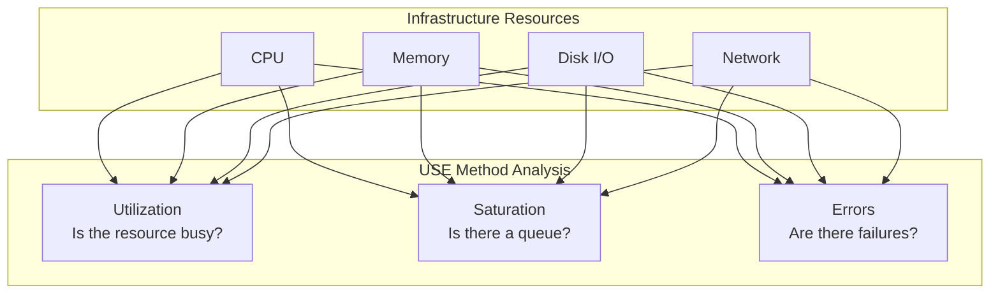
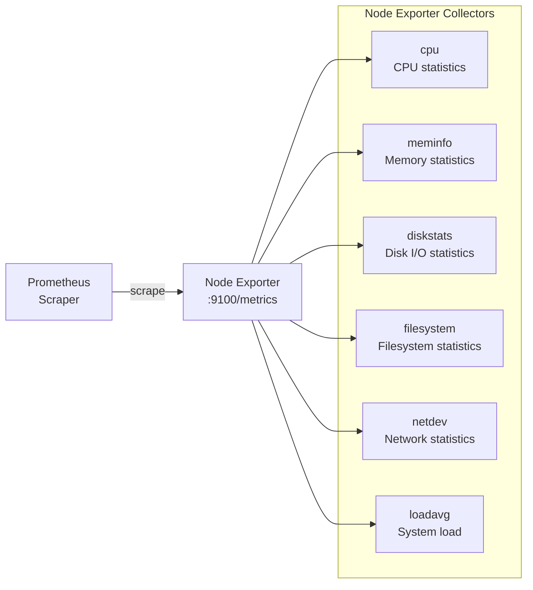
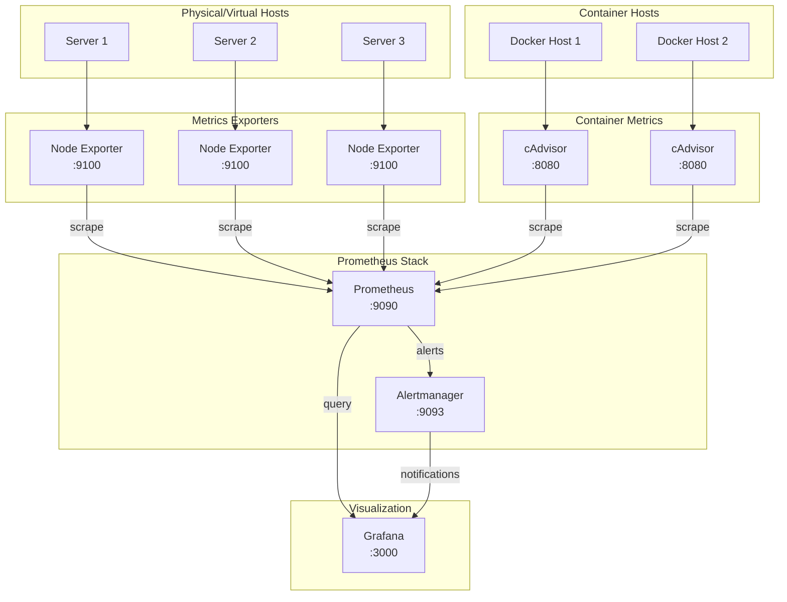

# How to Implement Infrastructure Metrics

Author: [nawazdhandala](https://github.com/nawazdhandala)

Tags: Observability, Metrics, Infrastructure, SRE

Description: Learn how to implement comprehensive infrastructure metrics for servers, containers, and cloud resources.

---

Infrastructure metrics form the foundation of any observability strategy. Without visibility into CPU, memory, disk, and network utilization, you are essentially flying blind. This guide walks you through implementing comprehensive infrastructure metrics using industry-standard tools and methodologies.

## Why Infrastructure Metrics Matter

Before diving into implementation, let us understand why infrastructure metrics are critical:

- **Capacity Planning**: Know when to scale before users experience slowdowns
- **Cost Optimization**: Identify underutilized resources that can be downsized
- **Incident Response**: Quickly correlate application issues with infrastructure bottlenecks
- **Performance Baselines**: Establish normal behavior to detect anomalies

## The USE Method

The USE Method, developed by Brendan Gregg, provides a systematic approach to analyzing system performance. USE stands for:

- **Utilization**: The percentage of time a resource is busy
- **Saturation**: The degree to which a resource has extra work it cannot service
- **Errors**: The count of error events



### Applying USE to Each Resource

| Resource | Utilization | Saturation | Errors |
|----------|-------------|------------|--------|
| CPU | CPU percentage | Run queue length | Hardware errors |
| Memory | Memory used percentage | Swap usage, OOM kills | Allocation failures |
| Disk | Disk busy percentage | Wait queue length | Read/write errors |
| Network | Bandwidth utilization | Dropped packets | Interface errors |

## Setting Up Node Exporter

Node Exporter is the standard tool for collecting hardware and OS metrics from Linux hosts. It exposes hundreds of metrics that Prometheus can scrape.

### Installation

```bash
# Download the latest Node Exporter release
# Check https://github.com/prometheus/node_exporter/releases for the current version
wget https://github.com/prometheus/node_exporter/releases/download/v1.7.0/node_exporter-1.7.0.linux-amd64.tar.gz

# Extract the archive
tar xvfz node_exporter-1.7.0.linux-amd64.tar.gz

# Move binary to a standard location
sudo mv node_exporter-1.7.0.linux-amd64/node_exporter /usr/local/bin/

# Verify the installation
node_exporter --version
```

### Creating a Systemd Service

Create a dedicated user and systemd service for production deployments:

```bash
# Create a system user for Node Exporter
# Using --no-create-home and --shell /bin/false for security
sudo useradd --no-create-home --shell /bin/false node_exporter
```

Create the systemd service file at `/etc/systemd/system/node_exporter.service`:

```ini
[Unit]
# Describe the service purpose
Description=Prometheus Node Exporter
# Ensure network is available before starting
After=network.target

[Service]
# Run as the dedicated user we created
User=node_exporter
Group=node_exporter
# Simple type since node_exporter stays in foreground
Type=simple
# The main executable with common collector flags
ExecStart=/usr/local/bin/node_exporter \
    --collector.filesystem.mount-points-exclude="^/(sys|proc|dev|host|etc)($$|/)" \
    --collector.netclass.ignored-devices="^(veth.*|docker.*|br-.*)$$" \
    --web.listen-address=:9100

# Restart on failure with a 3 second delay
Restart=on-failure
RestartSec=3

[Install]
# Start with multi-user target (standard runlevel)
WantedBy=multi-user.target
```

```bash
# Reload systemd to recognize the new service
sudo systemctl daemon-reload

# Enable the service to start on boot
sudo systemctl enable node_exporter

# Start the service immediately
sudo systemctl start node_exporter

# Verify it is running
sudo systemctl status node_exporter
```

### Key Metrics Exposed by Node Exporter

Node Exporter provides metrics in several categories:



## Configuring cAdvisor for Container Metrics

cAdvisor (Container Advisor) provides container users with resource usage and performance characteristics. It is essential for monitoring Docker and Kubernetes workloads.

### Running cAdvisor with Docker

```yaml
# docker-compose.yml for cAdvisor
# This configuration exposes container metrics on port 8080

version: '3.8'

services:
  cadvisor:
    # Use the official Google cAdvisor image
    image: gcr.io/cadvisor/cadvisor:v0.47.0
    container_name: cadvisor
    # Privileged mode required for accessing host metrics
    privileged: true
    ports:
      # Expose metrics endpoint
      - "8080:8080"
    volumes:
      # Mount host directories as read-only for security
      # Root filesystem for process information
      - /:/rootfs:ro
      # Cgroup information for resource limits
      - /sys:/sys:ro
      # Docker socket for container discovery
      - /var/run:/var/run:ro
      # Docker metadata and logs
      - /var/lib/docker/:/var/lib/docker:ro
      # Device information
      - /dev/disk/:/dev/disk:ro
    # Reduce resource overhead with these flags
    command:
      # Reduce housekeeping frequency for lower CPU usage
      - --housekeeping_interval=30s
      # Disable metrics we do not need
      - --disable_metrics=percpu,sched,tcp,udp,disk,diskIO,hugetlb,referenced_memory
      # Store only 2 minutes of data in memory
      - --storage_duration=2m
    restart: unless-stopped
```

### Key Container Metrics

cAdvisor exposes metrics prefixed with `container_`:

| Metric | Description |
|--------|-------------|
| `container_cpu_usage_seconds_total` | Cumulative CPU time consumed |
| `container_memory_usage_bytes` | Current memory usage |
| `container_memory_working_set_bytes` | Memory in active use |
| `container_fs_reads_bytes_total` | Cumulative bytes read |
| `container_fs_writes_bytes_total` | Cumulative bytes written |
| `container_network_receive_bytes_total` | Network bytes received |
| `container_network_transmit_bytes_total` | Network bytes transmitted |

## Prometheus Configuration

Now let us configure Prometheus to scrape both Node Exporter and cAdvisor:

```yaml
# prometheus.yml
# Main Prometheus configuration file

global:
  # How frequently to scrape targets
  scrape_interval: 15s
  # How frequently to evaluate rules
  evaluation_interval: 15s

# Alerting configuration
alerting:
  alertmanagers:
    - static_configs:
        - targets:
            - alertmanager:9093

# Rule files to load
rule_files:
  - "rules/infrastructure_alerts.yml"

# Scrape configurations
scrape_configs:
  # Prometheus self-monitoring
  - job_name: 'prometheus'
    static_configs:
      - targets: ['localhost:9090']

  # Node Exporter targets for bare metal and VMs
  - job_name: 'node_exporter'
    # Scrape node metrics every 15 seconds
    scrape_interval: 15s
    static_configs:
      - targets:
          - 'server1:9100'
          - 'server2:9100'
          - 'server3:9100'
        labels:
          # Add environment label for filtering
          env: 'production'
    # Relabel to add instance hostname
    relabel_configs:
      - source_labels: [__address__]
        regex: '([^:]+):\d+'
        target_label: hostname
        replacement: '${1}'

  # cAdvisor targets for container metrics
  - job_name: 'cadvisor'
    scrape_interval: 15s
    static_configs:
      - targets:
          - 'docker-host1:8080'
          - 'docker-host2:8080'
        labels:
          env: 'production'
    # Filter out pause containers and system containers
    metric_relabel_configs:
      - source_labels: [container_label_io_kubernetes_pod_name]
        regex: ''
        action: drop
```

## Essential Prometheus Infrastructure Queries

Here are the most important PromQL queries for monitoring infrastructure using the USE method:

### CPU Metrics

```promql
# CPU Utilization - percentage of CPU time spent not idle
# This gives per-instance CPU utilization over 5 minutes
100 - (
  avg by (instance) (
    rate(node_cpu_seconds_total{mode="idle"}[5m])
  ) * 100
)

# CPU Saturation - normalized load average
# Values above 1 indicate CPU saturation
node_load1 / count without (cpu) (node_cpu_seconds_total{mode="idle"})

# CPU Errors - context switches (high rate may indicate problems)
rate(node_context_switches_total[5m])
```

### Memory Metrics

```promql
# Memory Utilization - percentage of memory used
# Excludes buffers and cache which can be reclaimed
100 * (
  1 - (
    (node_memory_MemAvailable_bytes or node_memory_MemFree_bytes)
    / node_memory_MemTotal_bytes
  )
)

# Memory Saturation - major page faults indicate memory pressure
rate(node_vmstat_pgmajfault[5m])

# OOM Kill events - critical memory errors
increase(node_vmstat_oom_kill[1h])
```

### Disk Metrics

```promql
# Disk Utilization - percentage of time disk is busy
rate(node_disk_io_time_seconds_total[5m]) * 100

# Disk Saturation - average queue size
# Values consistently above 1 indicate saturation
rate(node_disk_io_time_weighted_seconds_total[5m])
/ rate(node_disk_io_time_seconds_total[5m])

# Disk Errors - failed read/write operations
rate(node_disk_read_time_seconds_total{device=~"sd.*"}[5m])

# Filesystem Usage - percentage of disk space used
100 * (
  node_filesystem_size_bytes{fstype!~"tmpfs|overlay"}
  - node_filesystem_avail_bytes{fstype!~"tmpfs|overlay"}
) / node_filesystem_size_bytes{fstype!~"tmpfs|overlay"}
```

### Network Metrics

```promql
# Network Utilization - bandwidth usage in bytes per second
# Receive traffic
rate(node_network_receive_bytes_total{device!~"lo|veth.*|docker.*"}[5m])

# Transmit traffic
rate(node_network_transmit_bytes_total{device!~"lo|veth.*|docker.*"}[5m])

# Network Saturation - dropped packets indicate network pressure
rate(node_network_receive_drop_total[5m])
+ rate(node_network_transmit_drop_total[5m])

# Network Errors - interface errors
rate(node_network_receive_errs_total[5m])
+ rate(node_network_transmit_errs_total[5m])
```

### Container Metrics (from cAdvisor)

```promql
# Container CPU Usage - percentage of allocated CPU
sum by (name) (
  rate(container_cpu_usage_seconds_total{name!=""}[5m])
) * 100

# Container Memory Usage - percentage of limit
container_memory_working_set_bytes{name!=""}
/ container_spec_memory_limit_bytes{name!=""} * 100

# Container Network I/O
sum by (name) (
  rate(container_network_receive_bytes_total{name!=""}[5m])
)

# Container Disk I/O
sum by (name) (
  rate(container_fs_writes_bytes_total{name!=""}[5m])
  + rate(container_fs_reads_bytes_total{name!=""}[5m])
)
```

## Infrastructure Metrics Architecture

Here is a complete picture of how infrastructure metrics flow through your monitoring stack:



## Setting Up Alerting Rules

Create meaningful alerts based on your infrastructure metrics. Save this as `rules/infrastructure_alerts.yml`:

```yaml
# infrastructure_alerts.yml
# Alert rules for infrastructure monitoring

groups:
  - name: infrastructure_alerts
    # Evaluate rules every 30 seconds
    interval: 30s
    rules:
      # CPU Alerts
      - alert: HighCPUUsage
        # Fire when CPU usage exceeds 80% for 5 minutes
        expr: |
          100 - (avg by (instance) (rate(node_cpu_seconds_total{mode="idle"}[5m])) * 100) > 80
        for: 5m
        labels:
          severity: warning
        annotations:
          summary: "High CPU usage on {{ $labels.instance }}"
          description: "CPU usage is {{ $value | printf \"%.1f\" }}% on {{ $labels.instance }}"

      - alert: CPUSaturation
        # Fire when load average exceeds CPU count
        expr: |
          node_load1 / count without (cpu) (node_cpu_seconds_total{mode="idle"}) > 1.5
        for: 5m
        labels:
          severity: warning
        annotations:
          summary: "CPU saturation on {{ $labels.instance }}"
          description: "Normalized load is {{ $value | printf \"%.2f\" }} on {{ $labels.instance }}"

      # Memory Alerts
      - alert: HighMemoryUsage
        # Fire when memory usage exceeds 85%
        expr: |
          100 * (1 - (node_memory_MemAvailable_bytes / node_memory_MemTotal_bytes)) > 85
        for: 5m
        labels:
          severity: warning
        annotations:
          summary: "High memory usage on {{ $labels.instance }}"
          description: "Memory usage is {{ $value | printf \"%.1f\" }}% on {{ $labels.instance }}"

      - alert: OOMKillDetected
        # Fire immediately when OOM kill occurs
        expr: |
          increase(node_vmstat_oom_kill[5m]) > 0
        for: 0m
        labels:
          severity: critical
        annotations:
          summary: "OOM Kill detected on {{ $labels.instance }}"
          description: "System killed processes due to memory pressure"

      # Disk Alerts
      - alert: DiskSpaceLow
        # Fire when disk space drops below 15%
        expr: |
          100 * (node_filesystem_avail_bytes{fstype!~"tmpfs|overlay"}
          / node_filesystem_size_bytes{fstype!~"tmpfs|overlay"}) < 15
        for: 5m
        labels:
          severity: warning
        annotations:
          summary: "Low disk space on {{ $labels.instance }}"
          description: "Disk {{ $labels.mountpoint }} has {{ $value | printf \"%.1f\" }}% free"

      - alert: DiskSpaceCritical
        # Fire when disk space drops below 5%
        expr: |
          100 * (node_filesystem_avail_bytes{fstype!~"tmpfs|overlay"}
          / node_filesystem_size_bytes{fstype!~"tmpfs|overlay"}) < 5
        for: 1m
        labels:
          severity: critical
        annotations:
          summary: "Critical disk space on {{ $labels.instance }}"
          description: "Disk {{ $labels.mountpoint }} has only {{ $value | printf \"%.1f\" }}% free"

      # Network Alerts
      - alert: NetworkPacketDrops
        # Fire when packet drops exceed threshold
        expr: |
          rate(node_network_receive_drop_total[5m])
          + rate(node_network_transmit_drop_total[5m]) > 100
        for: 5m
        labels:
          severity: warning
        annotations:
          summary: "Network packet drops on {{ $labels.instance }}"
          description: "{{ $value | printf \"%.0f\" }} packets/sec being dropped"

      # Container Alerts
      - alert: ContainerHighCPU
        # Fire when container uses more than 80% of its CPU limit
        expr: |
          sum by (name) (rate(container_cpu_usage_seconds_total{name!=""}[5m])) * 100 > 80
        for: 5m
        labels:
          severity: warning
        annotations:
          summary: "Container {{ $labels.name }} high CPU"
          description: "Container is using {{ $value | printf \"%.1f\" }}% CPU"

      - alert: ContainerHighMemory
        # Fire when container uses more than 85% of its memory limit
        expr: |
          container_memory_working_set_bytes{name!=""}
          / container_spec_memory_limit_bytes{name!=""} * 100 > 85
        for: 5m
        labels:
          severity: warning
        annotations:
          summary: "Container {{ $labels.name }} high memory"
          description: "Container is using {{ $value | printf \"%.1f\" }}% of memory limit"
```

## Best Practices for Infrastructure Metrics

### 1. Label Cardinality

Be mindful of label cardinality to avoid excessive memory usage:

```yaml
# Good - low cardinality labels
labels:
  env: production
  region: us-east-1
  service: api

# Bad - high cardinality labels (avoid these)
labels:
  user_id: "12345"        # Millions of unique values
  request_id: "abc-123"   # Infinite unique values
```

### 2. Retention and Storage

Configure appropriate retention based on your needs:

```yaml
# prometheus.yml storage configuration
storage:
  tsdb:
    # Keep 15 days of data locally
    retention.time: 15d
    # Limit storage to 50GB
    retention.size: 50GB
```

### 3. Recording Rules for Performance

Create recording rules to pre-compute expensive queries:

```yaml
# recording_rules.yml
groups:
  - name: infrastructure_recording
    interval: 1m
    rules:
      # Pre-compute CPU utilization
      - record: instance:node_cpu_utilization:avg5m
        expr: |
          100 - (avg by (instance) (rate(node_cpu_seconds_total{mode="idle"}[5m])) * 100)

      # Pre-compute memory utilization
      - record: instance:node_memory_utilization:ratio
        expr: |
          1 - (node_memory_MemAvailable_bytes / node_memory_MemTotal_bytes)

      # Pre-compute disk utilization
      - record: instance:node_filesystem_utilization:ratio
        expr: |
          1 - (node_filesystem_avail_bytes{fstype!~"tmpfs|overlay"}
          / node_filesystem_size_bytes{fstype!~"tmpfs|overlay"})
```

### 4. Service Discovery

For dynamic environments, use service discovery instead of static configs:

```yaml
# Example: EC2 service discovery
scrape_configs:
  - job_name: 'node_exporter'
    ec2_sd_configs:
      - region: us-east-1
        port: 9100
        filters:
          - name: tag:monitoring
            values: ['enabled']
    relabel_configs:
      # Use instance ID as the instance label
      - source_labels: [__meta_ec2_instance_id]
        target_label: instance
      # Add environment tag as label
      - source_labels: [__meta_ec2_tag_Environment]
        target_label: env
```

## Summary

Implementing infrastructure metrics involves several key steps:

1. **Choose a methodology** like USE to ensure comprehensive coverage
2. **Deploy exporters** such as Node Exporter and cAdvisor
3. **Configure Prometheus** to scrape and store metrics
4. **Write meaningful queries** using PromQL
5. **Set up alerts** for proactive incident detection
6. **Follow best practices** for long-term maintainability

With proper infrastructure metrics in place, you gain visibility into the health of your systems and can respond to issues before they impact users. Start with the basics covered in this guide and expand your monitoring as your infrastructure grows.

## Further Reading

- [Prometheus Documentation](https://prometheus.io/docs/)
- [Node Exporter GitHub](https://github.com/prometheus/node_exporter)
- [cAdvisor GitHub](https://github.com/google/cadvisor)
- [USE Method by Brendan Gregg](https://www.brendangregg.com/usemethod.html)
- [PromQL Cheat Sheet](https://promlabs.com/promql-cheat-sheet/)
