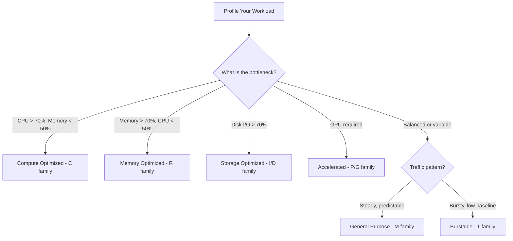
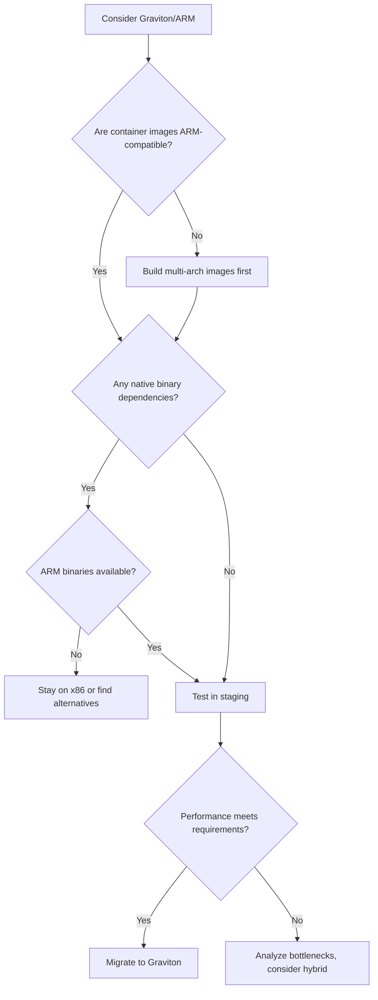
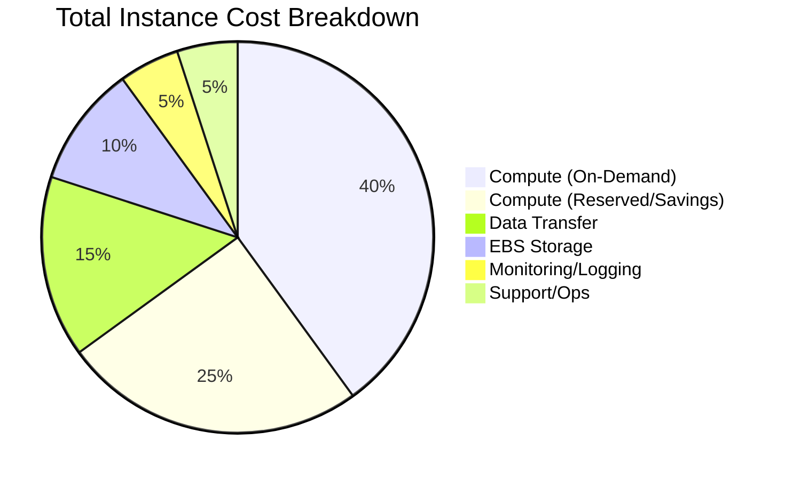
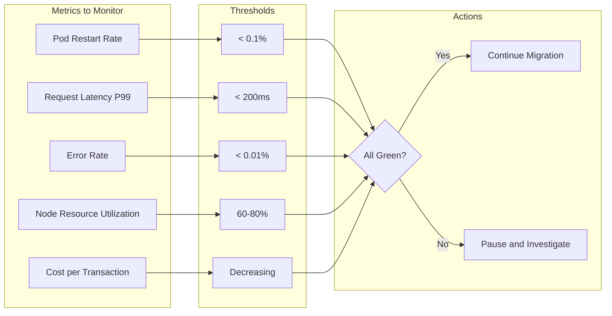

# How to Implement Instance Family Selection

Author: [nawazdhandala](https://github.com/nawazdhandala)

Tags: Cloud, Infrastructure, Cost Optimization, AWS

Description: Learn how to select the right instance family for your workload characteristics.

---

Cloud providers offer dozens of instance families, each optimized for different workload profiles. Picking the wrong one means overpaying for resources you do not need or starving your application of capacity it requires. This guide walks through the decision-making process for selecting instance families based on workload characteristics, cost-performance tradeoffs, and migration strategies.

## Instance Family Characteristics

Major cloud providers organize compute into families based on resource ratios and specialized hardware. Here is a breakdown of the primary categories on AWS (similar families exist on GCP, Azure, and other providers):

| Family | Use Case | vCPU:Memory Ratio | Notable Features |
| --- | --- | --- | --- |
| **M (General Purpose)** | Balanced workloads, web servers, small databases | 1:4 | Baseline for most applications |
| **C (Compute Optimized)** | CPU-bound tasks, batch processing, gaming servers | 1:2 | Higher clock speeds, more vCPUs per dollar |
| **R (Memory Optimized)** | In-memory caches, large databases, analytics | 1:8 | Large RAM capacity, suited for Redis/Memcached |
| **T (Burstable)** | Development, low-traffic sites, microservices | Variable | CPU credits, cost-effective for idle workloads |
| **I/D (Storage Optimized)** | Data warehouses, distributed filesystems | 1:4 | Local NVMe SSDs, high IOPS |
| **P/G/Inf (Accelerated)** | Machine learning, video encoding, HPC | Varies | GPUs, Inferentia, Trainium chips |

Understanding these ratios helps you match instances to your application's resource consumption patterns.

## Workload Profiling

Before selecting an instance family, profile your workload to understand its resource demands. The goal is to identify whether your application is CPU-bound, memory-bound, I/O-bound, or balanced.

### Step 1: Collect Baseline Metrics

Use your observability stack to gather metrics over a representative period (at least one week, including peak traffic):

```bash
# Example: Query Prometheus for CPU and memory utilization
# CPU utilization by container
avg(rate(container_cpu_usage_seconds_total{namespace="production"}[5m])) by (pod)

# Memory utilization by container
avg(container_memory_usage_bytes{namespace="production"}) by (pod)
```

### Step 2: Identify Resource Constraints

Analyze the collected data to find bottlenecks:

```python
import pandas as pd

# Load metrics from your observability platform
metrics = pd.read_csv('workload_metrics.csv')

# Calculate resource utilization ratios
metrics['cpu_util'] = metrics['cpu_used'] / metrics['cpu_allocated'] * 100
metrics['mem_util'] = metrics['mem_used'] / metrics['mem_allocated'] * 100
metrics['io_util'] = metrics['disk_iops'] / metrics['disk_iops_limit'] * 100

# Classify workload type
def classify_workload(row):
    if row['cpu_util'] > 70 and row['mem_util'] < 50:
        return 'cpu-bound'
    elif row['mem_util'] > 70 and row['cpu_util'] < 50:
        return 'memory-bound'
    elif row['io_util'] > 70:
        return 'io-bound'
    else:
        return 'balanced'

metrics['workload_type'] = metrics.apply(classify_workload, axis=1)

# Output workload classification summary
print(metrics.groupby('workload_type').size())
```

### Step 3: Map to Instance Families

Once you know your workload type, map it to the appropriate instance family:



## General Purpose vs Specialized Instances

The decision between general purpose (M-family) and specialized instances is one of the most impactful for cost optimization.

### When to Use General Purpose

General purpose instances are the safe default. Choose them when:

- Your workload has balanced CPU and memory usage
- You are uncertain about resource requirements (start here, then optimize)
- You need flexibility for diverse microservices on the same node pool
- Your application's resource profile changes frequently

```yaml
# Kubernetes node pool configuration for general purpose workloads
apiVersion: karpenter.sh/v1alpha5
kind: Provisioner
metadata:
  name: general-purpose
spec:
  requirements:
    - key: node.kubernetes.io/instance-type
      operator: In
      values:
        - m6i.large
        - m6i.xlarge
        - m6i.2xlarge
        - m7i.large
        - m7i.xlarge
  limits:
    resources:
      cpu: 1000
      memory: 2000Gi
```

### When to Use Specialized Instances

Specialized instances deliver better price-performance for specific workload patterns:

**Compute Optimized (C-family):**
- Batch processing jobs
- Video encoding
- Scientific modeling
- High-performance web servers
- Game servers

```yaml
# Karpenter provisioner for compute-intensive batch jobs
apiVersion: karpenter.sh/v1alpha5
kind: Provisioner
metadata:
  name: compute-optimized
spec:
  requirements:
    - key: node.kubernetes.io/instance-type
      operator: In
      values:
        - c6i.xlarge
        - c6i.2xlarge
        - c7i.xlarge
        - c7i.2xlarge
    - key: kubernetes.io/arch
      operator: In
      values:
        - amd64
  taints:
    - key: workload-type
      value: compute-intensive
      effect: NoSchedule
```

**Memory Optimized (R-family):**
- Redis/Memcached clusters
- In-memory databases (SAP HANA, Apache Ignite)
- Real-time analytics
- Large Java heaps

```yaml
# StatefulSet for Redis on memory-optimized nodes
apiVersion: apps/v1
kind: StatefulSet
metadata:
  name: redis-cluster
spec:
  selector:
    matchLabels:
      app: redis
  template:
    spec:
      nodeSelector:
        node.kubernetes.io/instance-type: r6i.2xlarge
      containers:
        - name: redis
          image: redis:7-alpine
          resources:
            requests:
              memory: "28Gi"
              cpu: "4"
            limits:
              memory: "30Gi"
              cpu: "6"
```

## Graviton/ARM Consideration

AWS Graviton (ARM-based) processors offer 20-40% better price-performance compared to equivalent x86 instances for many workloads. Similar ARM options exist on other clouds (Azure Ampere, GCP Tau T2A).

### Compatibility Checklist

Before migrating to ARM:

1. **Container images:** Ensure all images have ARM builds (linux/arm64)
2. **Dependencies:** Check that native libraries support ARM
3. **Build pipeline:** Add multi-architecture builds to CI/CD
4. **Performance testing:** Validate that ARM delivers expected improvements

```dockerfile
# Multi-architecture Dockerfile
FROM --platform=$BUILDPLATFORM node:20-alpine AS builder
WORKDIR /app
COPY package*.json ./
RUN npm ci
COPY . .
RUN npm run build

FROM --platform=$TARGETPLATFORM node:20-alpine
WORKDIR /app
COPY --from=builder /app/dist ./dist
COPY --from=builder /app/node_modules ./node_modules
CMD ["node", "dist/server.js"]
```

Build for multiple architectures:

```bash
# Build and push multi-arch image
docker buildx build \
  --platform linux/amd64,linux/arm64 \
  --tag myregistry/myapp:latest \
  --push .
```

### Graviton Migration Decision Tree



### Cost Comparison Example

Here is a typical cost comparison for a web application workload:

| Instance Type | vCPUs | Memory | Hourly Cost | Monthly Cost | Performance |
| --- | --- | --- | --- | --- | --- |
| m6i.xlarge (x86) | 4 | 16 GB | $0.192 | ~$140 | Baseline |
| m6g.xlarge (Graviton) | 4 | 16 GB | $0.154 | ~$112 | +10-20% |
| m7g.xlarge (Graviton3) | 4 | 16 GB | $0.163 | ~$119 | +25-30% |

For a fleet of 50 instances, switching from m6i to m7g saves approximately $1,000/month while improving performance.

## Cost-Performance Analysis

Selecting instance families is ultimately a cost-performance optimization problem. Here is a systematic approach:

### Step 1: Benchmark Your Workload

Run benchmarks on candidate instance types:

```python
#!/usr/bin/env python3
"""
Instance family benchmark runner.
Deploys test workload to different instance types and collects metrics.
"""

import boto3
import json
import time
from dataclasses import dataclass
from typing import List

@dataclass
class BenchmarkResult:
    instance_type: str
    throughput_rps: float
    p50_latency_ms: float
    p99_latency_ms: float
    hourly_cost: float

    @property
    def cost_per_request(self) -> float:
        """Cost per 1000 requests"""
        requests_per_hour = self.throughput_rps * 3600
        return (self.hourly_cost / requests_per_hour) * 1000

INSTANCE_TYPES = [
    ('m6i.xlarge', 0.192),
    ('m6g.xlarge', 0.154),
    ('c6i.xlarge', 0.170),
    ('c6g.xlarge', 0.136),
    ('r6i.xlarge', 0.252),
]

def run_benchmark(instance_type: str, duration_seconds: int = 300) -> dict:
    """Run load test against instance and collect metrics."""
    # Deploy test instance (pseudocode - implement with your IaC)
    # Run wrk or k6 benchmark
    # Collect results from observability platform
    pass

def analyze_results(results: List[BenchmarkResult]) -> str:
    """Generate cost-performance recommendation."""
    # Sort by cost per request (lower is better)
    sorted_results = sorted(results, key=lambda r: r.cost_per_request)

    best = sorted_results[0]
    report = f"""
    Cost-Performance Analysis
    ========================

    Recommended: {best.instance_type}
    - Throughput: {best.throughput_rps:.0f} req/s
    - P99 Latency: {best.p99_latency_ms:.1f}ms
    - Cost per 1K requests: ${best.cost_per_request:.4f}

    Full Comparison:
    """

    for r in sorted_results:
        report += f"\n    {r.instance_type}: ${r.cost_per_request:.4f}/1K req, {r.throughput_rps:.0f} rps"

    return report
```

### Step 2: Calculate Total Cost of Ownership

Consider all cost factors, not just instance pricing:



### Step 3: Build a Decision Matrix

Create a weighted scoring matrix for your specific needs:

```python
import pandas as pd

# Define weights based on your priorities
weights = {
    'cost_efficiency': 0.35,
    'performance': 0.30,
    'reliability': 0.20,
    'flexibility': 0.15
}

# Score each instance family (1-10 scale)
scores = pd.DataFrame({
    'family': ['M6i', 'M7g', 'C6i', 'C7g', 'R6i', 'T3'],
    'cost_efficiency': [6, 8, 7, 9, 5, 9],
    'performance': [7, 8, 9, 9, 7, 5],
    'reliability': [9, 8, 9, 8, 9, 7],
    'flexibility': [9, 7, 6, 6, 5, 8]
})

# Calculate weighted scores
scores['weighted_score'] = (
    scores['cost_efficiency'] * weights['cost_efficiency'] +
    scores['performance'] * weights['performance'] +
    scores['reliability'] * weights['reliability'] +
    scores['flexibility'] * weights['flexibility']
)

print(scores.sort_values('weighted_score', ascending=False))
```

## Migration Strategies

Once you have identified optimal instance families, plan a safe migration path.

### Strategy 1: Gradual Canary Migration

Start with a small percentage of traffic and gradually increase:

```yaml
# Karpenter provisioner with mixed instance types during migration
apiVersion: karpenter.sh/v1alpha5
kind: Provisioner
metadata:
  name: migration-canary
spec:
  requirements:
    - key: node.kubernetes.io/instance-type
      operator: In
      values:
        # Current instances (80% weight via priority)
        - m6i.xlarge
        - m6i.2xlarge
        # Target instances (20% weight)
        - m7g.xlarge
        - m7g.2xlarge
  weight: 10  # Adjust to control canary percentage
```

### Strategy 2: Blue-Green Node Pools

Create a parallel node pool with new instance types:

```bash
#!/bin/bash
# Blue-green node pool migration script

# Step 1: Create new node pool with target instance family
eksctl create nodegroup \
  --cluster=production \
  --name=workers-m7g \
  --node-type=m7g.xlarge \
  --nodes=0 \
  --nodes-min=0 \
  --nodes-max=50

# Step 2: Scale up new pool
eksctl scale nodegroup \
  --cluster=production \
  --name=workers-m7g \
  --nodes=10

# Step 3: Cordon old nodes (no new pods scheduled)
kubectl cordon -l eks.amazonaws.com/nodegroup=workers-m6i

# Step 4: Drain old nodes gracefully
kubectl drain -l eks.amazonaws.com/nodegroup=workers-m6i \
  --ignore-daemonsets \
  --delete-emptydir-data \
  --grace-period=300

# Step 5: Verify all pods running on new nodes
kubectl get pods -A -o wide | grep -v m7g

# Step 6: Delete old node pool
eksctl delete nodegroup \
  --cluster=production \
  --name=workers-m6i
```

### Strategy 3: Automated Right-Sizing with Karpenter

Let Karpenter automatically select optimal instances:

```yaml
apiVersion: karpenter.sh/v1alpha5
kind: Provisioner
metadata:
  name: default
spec:
  requirements:
    # Allow multiple families for optimization
    - key: karpenter.k8s.aws/instance-family
      operator: In
      values: ["m6i", "m6g", "m7i", "m7g", "c6i", "c6g", "r6i", "r6g"]
    # Prefer Graviton for cost savings
    - key: kubernetes.io/arch
      operator: In
      values: ["arm64", "amd64"]
    # Exclude small instances for production
    - key: karpenter.k8s.aws/instance-size
      operator: NotIn
      values: ["nano", "micro", "small"]
  # Consolidation removes underutilized nodes
  consolidation:
    enabled: true
  # Time-to-live for empty nodes
  ttlSecondsAfterEmpty: 60
```

### Migration Monitoring Dashboard

Track key metrics during migration:



## Implementation Checklist

Use this checklist when implementing instance family selection:

1. **Workload Profiling**
   - [ ] Collect CPU, memory, and I/O metrics for 7+ days
   - [ ] Identify peak usage patterns and bottlenecks
   - [ ] Classify workloads as CPU/memory/IO/balanced

2. **Instance Family Selection**
   - [ ] Match workload type to appropriate family
   - [ ] Evaluate Graviton/ARM compatibility
   - [ ] Calculate cost-performance ratios

3. **Testing**
   - [ ] Benchmark candidate instance types
   - [ ] Verify application compatibility (especially for ARM)
   - [ ] Load test under realistic conditions

4. **Migration Planning**
   - [ ] Choose migration strategy (canary/blue-green/automated)
   - [ ] Define rollback procedures
   - [ ] Set up monitoring dashboards

5. **Execution**
   - [ ] Start with non-critical workloads
   - [ ] Monitor key metrics during migration
   - [ ] Document learnings and update runbooks

## Conclusion

Instance family selection is not a one-time decision. Workloads evolve, new instance types launch regularly, and pricing changes. Build a quarterly review process to reassess your instance mix:

- Profile current workloads against original assumptions
- Evaluate new instance families (especially Graviton releases)
- Run cost-performance benchmarks on candidate types
- Plan migrations for significant savings opportunities

The goal is not to find the perfect instance type, but to systematically optimize cost-performance while maintaining reliability. Start with general purpose instances, measure everything, and specialize only when the data justifies it.
