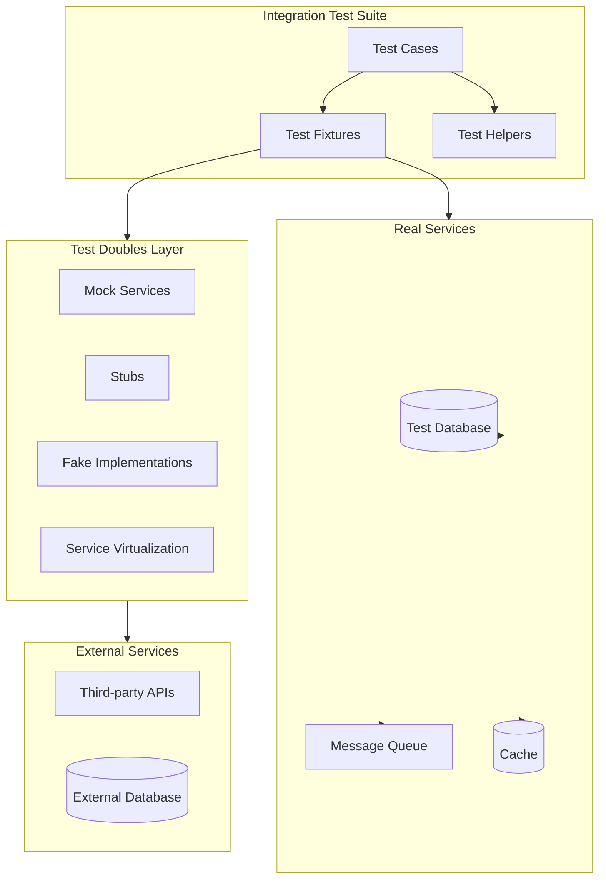

# How to Build Integration Testing Patterns

Author: [nawazdhandala](https://github.com/nawazdhandala)

Tags: Testing, Integration, Patterns, Microservices

Description: Learn proven integration testing patterns to validate service interactions and build reliable distributed systems.

---

Integration testing verifies that multiple components work together correctly. Unlike unit tests that isolate individual functions, integration tests validate the behavior of interconnected services, databases, and external APIs. This guide covers practical patterns for building robust integration test suites.

## Integration Test Categories

Integration tests fall into several categories based on scope and purpose:

### Narrow Integration Tests

These tests verify interactions between your code and a single external component:

- Database queries and transactions
- Message queue producers and consumers
- Cache operations
- File system interactions

### Broad Integration Tests

These tests verify interactions across multiple services:

- End-to-end API workflows
- Cross-service data consistency
- Distributed transaction handling
- Event-driven communication chains

### Contract Tests

These tests verify that services adhere to agreed-upon interfaces:

- Consumer-driven contracts
- Provider verification
- Schema validation

## Test Architecture Overview

The following diagram illustrates a typical integration test architecture:



## Test Doubles and Service Virtualization

Test doubles replace real dependencies during testing. Each type serves a specific purpose:

### Mocks

Mocks verify that specific interactions occurred. They record calls and allow assertions on behavior:

```typescript
// Mock example for verifying email service interaction
import { jest } from '@jest/globals';

interface EmailService {
    send(to: string, subject: string, body: string): Promise<boolean>;
}

describe('OrderService', () => {
    let emailService: jest.Mocked<EmailService>;
    let orderService: OrderService;

    beforeEach(() => {
        // Create a mock email service
        emailService = {
            send: jest.fn().mockResolvedValue(true)
        };
        orderService = new OrderService(emailService);
    });

    it('sends confirmation email after order placement', async () => {
        // Arrange
        const order = {
            id: 'order-123',
            customerEmail: 'customer@example.com',
            total: 99.99
        };

        // Act
        await orderService.placeOrder(order);

        // Assert - verify the mock was called correctly
        expect(emailService.send).toHaveBeenCalledWith(
            'customer@example.com',
            'Order Confirmation',
            expect.stringContaining('order-123')
        );
        expect(emailService.send).toHaveBeenCalledTimes(1);
    });
});
```

### Stubs

Stubs provide canned responses without verification logic:

```typescript
// Stub example for payment gateway
class PaymentGatewayStub implements PaymentGateway {
    private responses: Map<string, PaymentResult> = new Map();

    // Configure stub responses for specific scenarios
    configureResponse(cardNumber: string, result: PaymentResult): void {
        this.responses.set(cardNumber, result);
    }

    async processPayment(request: PaymentRequest): Promise<PaymentResult> {
        // Return configured response or default success
        const configured = this.responses.get(request.cardNumber);
        if (configured) {
            return configured;
        }

        return {
            success: true,
            transactionId: `stub-txn-${Date.now()}`,
            message: 'Payment processed (stub)'
        };
    }
}

describe('CheckoutService', () => {
    it('handles declined payment gracefully', async () => {
        // Arrange
        const paymentStub = new PaymentGatewayStub();
        paymentStub.configureResponse('4111111111111111', {
            success: false,
            transactionId: null,
            message: 'Card declined'
        });

        const checkoutService = new CheckoutService(paymentStub);

        // Act
        const result = await checkoutService.processCheckout({
            cardNumber: '4111111111111111',
            amount: 100.00
        });

        // Assert
        expect(result.status).toBe('payment_failed');
        expect(result.error).toBe('Card declined');
    });
});
```

### Fakes

Fakes are working implementations with simplified behavior:

```typescript
// Fake in-memory repository for testing
class FakeUserRepository implements UserRepository {
    private users: Map<string, User> = new Map();
    private idCounter = 1;

    async create(userData: CreateUserDto): Promise<User> {
        const user: User = {
            id: `user-${this.idCounter++}`,
            ...userData,
            createdAt: new Date(),
            updatedAt: new Date()
        };
        this.users.set(user.id, user);
        return user;
    }

    async findById(id: string): Promise<User | null> {
        return this.users.get(id) || null;
    }

    async findByEmail(email: string): Promise<User | null> {
        for (const user of this.users.values()) {
            if (user.email === email) {
                return user;
            }
        }
        return null;
    }

    async update(id: string, updates: Partial<User>): Promise<User> {
        const user = this.users.get(id);
        if (!user) {
            throw new Error(`User ${id} not found`);
        }
        const updated = { ...user, ...updates, updatedAt: new Date() };
        this.users.set(id, updated);
        return updated;
    }

    async delete(id: string): Promise<void> {
        this.users.delete(id);
    }

    // Test helper to reset state between tests
    clear(): void {
        this.users.clear();
        this.idCounter = 1;
    }
}
```

### Service Virtualization

Service virtualization simulates entire services with realistic behavior:

```typescript
// Service virtualization using WireMock-style approach
import nock from 'nock';

describe('InventoryService Integration', () => {
    beforeEach(() => {
        // Virtualize the warehouse API
        nock('https://warehouse-api.example.com')
            .get('/inventory/SKU-001')
            .reply(200, {
                sku: 'SKU-001',
                quantity: 50,
                location: 'Warehouse-A',
                lastUpdated: '2026-01-30T10:00:00Z'
            });

        nock('https://warehouse-api.example.com')
            .post('/inventory/reserve')
            .reply(201, (uri, requestBody: any) => ({
                reservationId: `res-${Date.now()}`,
                sku: requestBody.sku,
                quantity: requestBody.quantity,
                expiresAt: new Date(Date.now() + 3600000).toISOString()
            }));
    });

    afterEach(() => {
        nock.cleanAll();
    });

    it('reserves inventory for order', async () => {
        const inventoryService = new InventoryService();

        // Act
        const reservation = await inventoryService.reserveForOrder({
            sku: 'SKU-001',
            quantity: 5
        });

        // Assert
        expect(reservation.reservationId).toBeDefined();
        expect(reservation.quantity).toBe(5);
    });
});
```

## Database Integration Testing

Database tests require careful management of test data and isolation:

### Test Database Setup Pattern

```typescript
// Database test utilities
import { Pool } from 'pg';
import { migrate } from './migrations';

class TestDatabase {
    private pool: Pool;
    private schemaName: string;

    constructor() {
        // Each test suite gets a unique schema for isolation
        this.schemaName = `test_${Date.now()}_${Math.random().toString(36).substr(2, 9)}`;
    }

    async setup(): Promise<Pool> {
        // Connect to test database
        this.pool = new Pool({
            host: process.env.TEST_DB_HOST || 'localhost',
            port: parseInt(process.env.TEST_DB_PORT || '5432'),
            database: process.env.TEST_DB_NAME || 'test_db',
            user: process.env.TEST_DB_USER || 'test_user',
            password: process.env.TEST_DB_PASSWORD || 'test_pass'
        });

        // Create isolated schema
        await this.pool.query(`CREATE SCHEMA IF NOT EXISTS ${this.schemaName}`);
        await this.pool.query(`SET search_path TO ${this.schemaName}`);

        // Run migrations
        await migrate(this.pool, this.schemaName);

        return this.pool;
    }

    async teardown(): Promise<void> {
        // Drop the test schema and all its objects
        await this.pool.query(`DROP SCHEMA IF EXISTS ${this.schemaName} CASCADE`);
        await this.pool.end();
    }

    async truncateAll(): Promise<void> {
        // Truncate all tables for test isolation
        const result = await this.pool.query(`
            SELECT tablename FROM pg_tables
            WHERE schemaname = $1
        `, [this.schemaName]);

        for (const row of result.rows) {
            await this.pool.query(
                `TRUNCATE TABLE ${this.schemaName}.${row.tablename} CASCADE`
            );
        }
    }
}
```

### Transaction Rollback Pattern

Use transactions to isolate tests and ensure cleanup:

```typescript
// Transaction-based test isolation
describe('UserRepository Database Tests', () => {
    let db: TestDatabase;
    let pool: Pool;
    let client: PoolClient;

    beforeAll(async () => {
        db = new TestDatabase();
        pool = await db.setup();
    });

    afterAll(async () => {
        await db.teardown();
    });

    beforeEach(async () => {
        // Start a transaction for each test
        client = await pool.connect();
        await client.query('BEGIN');
    });

    afterEach(async () => {
        // Rollback to undo all changes from the test
        await client.query('ROLLBACK');
        client.release();
    });

    it('creates user with all required fields', async () => {
        const repo = new UserRepository(client);

        // Act
        const user = await repo.create({
            email: 'test@example.com',
            name: 'Test User',
            passwordHash: 'hashed_password'
        });

        // Assert
        expect(user.id).toBeDefined();
        expect(user.email).toBe('test@example.com');

        // Verify in database
        const result = await client.query(
            'SELECT * FROM users WHERE id = $1',
            [user.id]
        );
        expect(result.rows).toHaveLength(1);
        expect(result.rows[0].email).toBe('test@example.com');
    });

    it('enforces unique email constraint', async () => {
        const repo = new UserRepository(client);

        // Create first user
        await repo.create({
            email: 'duplicate@example.com',
            name: 'First User',
            passwordHash: 'hash1'
        });

        // Attempt duplicate
        await expect(repo.create({
            email: 'duplicate@example.com',
            name: 'Second User',
            passwordHash: 'hash2'
        })).rejects.toThrow(/unique constraint/i);
    });
});
```

### Data Builder Pattern

Create test data with sensible defaults:

```typescript
// Test data builder for complex objects
class UserBuilder {
    private user: Partial<User> = {
        email: 'default@example.com',
        name: 'Default User',
        role: 'user',
        status: 'active'
    };

    withEmail(email: string): UserBuilder {
        this.user.email = email;
        return this;
    }

    withName(name: string): UserBuilder {
        this.user.name = name;
        return this;
    }

    withRole(role: 'user' | 'admin' | 'moderator'): UserBuilder {
        this.user.role = role;
        return this;
    }

    withStatus(status: 'active' | 'inactive' | 'suspended'): UserBuilder {
        this.user.status = status;
        return this;
    }

    build(): CreateUserDto {
        return this.user as CreateUserDto;
    }

    // Factory method for common scenarios
    static admin(): UserBuilder {
        return new UserBuilder()
            .withEmail('admin@example.com')
            .withName('Admin User')
            .withRole('admin');
    }

    static inactive(): UserBuilder {
        return new UserBuilder()
            .withStatus('inactive');
    }
}

// Usage in tests
describe('User access control', () => {
    it('allows admin to access admin panel', async () => {
        const adminData = UserBuilder.admin().build();
        const admin = await userRepo.create(adminData);

        const canAccess = await accessControl.canAccessAdminPanel(admin.id);
        expect(canAccess).toBe(true);
    });
});
```

## API Integration Testing

Test API endpoints with realistic HTTP interactions:

### Supertest Pattern for Express APIs

```typescript
// API integration tests using supertest
import request from 'supertest';
import { app } from '../src/app';
import { TestDatabase } from './helpers/database';

describe('Orders API Integration', () => {
    let db: TestDatabase;
    let authToken: string;

    beforeAll(async () => {
        db = new TestDatabase();
        await db.setup();

        // Create test user and get auth token
        const response = await request(app)
            .post('/api/auth/register')
            .send({
                email: 'testuser@example.com',
                password: 'SecurePass123!',
                name: 'Test User'
            });

        authToken = response.body.token;
    });

    afterAll(async () => {
        await db.teardown();
    });

    beforeEach(async () => {
        await db.truncateAll();
    });

    describe('POST /api/orders', () => {
        it('creates order with valid data', async () => {
            // Arrange
            const orderData = {
                items: [
                    { productId: 'prod-1', quantity: 2, price: 29.99 },
                    { productId: 'prod-2', quantity: 1, price: 49.99 }
                ],
                shippingAddress: {
                    street: '123 Test St',
                    city: 'Test City',
                    zipCode: '12345',
                    country: 'US'
                }
            };

            // Act
            const response = await request(app)
                .post('/api/orders')
                .set('Authorization', `Bearer ${authToken}`)
                .send(orderData)
                .expect('Content-Type', /json/)
                .expect(201);

            // Assert response structure
            expect(response.body).toMatchObject({
                id: expect.any(String),
                status: 'pending',
                total: 109.97,
                items: expect.arrayContaining([
                    expect.objectContaining({ productId: 'prod-1' }),
                    expect.objectContaining({ productId: 'prod-2' })
                ])
            });

            // Verify order was persisted
            const getResponse = await request(app)
                .get(`/api/orders/${response.body.id}`)
                .set('Authorization', `Bearer ${authToken}`)
                .expect(200);

            expect(getResponse.body.id).toBe(response.body.id);
        });

        it('returns 401 without authentication', async () => {
            const response = await request(app)
                .post('/api/orders')
                .send({ items: [] })
                .expect(401);

            expect(response.body.error).toBe('Authentication required');
        });

        it('returns 400 with invalid order data', async () => {
            const response = await request(app)
                .post('/api/orders')
                .set('Authorization', `Bearer ${authToken}`)
                .send({ items: [] })  // Empty items array
                .expect(400);

            expect(response.body.errors).toContainEqual(
                expect.objectContaining({
                    field: 'items',
                    message: expect.stringContaining('at least one item')
                })
            );
        });
    });

    describe('GET /api/orders', () => {
        it('returns paginated list of user orders', async () => {
            // Create multiple orders
            for (let i = 0; i < 15; i++) {
                await request(app)
                    .post('/api/orders')
                    .set('Authorization', `Bearer ${authToken}`)
                    .send({
                        items: [{ productId: `prod-${i}`, quantity: 1, price: 10 }],
                        shippingAddress: {
                            street: '123 Test St',
                            city: 'Test City',
                            zipCode: '12345',
                            country: 'US'
                        }
                    });
            }

            // Get first page
            const firstPage = await request(app)
                .get('/api/orders?page=1&limit=10')
                .set('Authorization', `Bearer ${authToken}`)
                .expect(200);

            expect(firstPage.body.data).toHaveLength(10);
            expect(firstPage.body.pagination).toMatchObject({
                page: 1,
                limit: 10,
                total: 15,
                totalPages: 2
            });

            // Get second page
            const secondPage = await request(app)
                .get('/api/orders?page=2&limit=10')
                .set('Authorization', `Bearer ${authToken}`)
                .expect(200);

            expect(secondPage.body.data).toHaveLength(5);
        });
    });
});
```

### Contract Testing with Pact

Verify service contracts between consumers and providers:

```typescript
// Consumer contract test (frontend/client side)
import { Pact } from '@pact-foundation/pact';
import { ProductService } from '../src/services/ProductService';

describe('Product Service Contract', () => {
    const provider = new Pact({
        consumer: 'WebApp',
        provider: 'ProductService',
        port: 1234,
        log: process.cwd() + '/logs/pact.log',
        dir: process.cwd() + '/pacts'
    });

    beforeAll(() => provider.setup());
    afterAll(() => provider.finalize());
    afterEach(() => provider.verify());

    describe('get product by ID', () => {
        it('returns product when it exists', async () => {
            // Define the expected interaction
            await provider.addInteraction({
                state: 'product with ID prod-123 exists',
                uponReceiving: 'a request for product prod-123',
                withRequest: {
                    method: 'GET',
                    path: '/products/prod-123',
                    headers: {
                        Accept: 'application/json'
                    }
                },
                willRespondWith: {
                    status: 200,
                    headers: {
                        'Content-Type': 'application/json'
                    },
                    body: {
                        id: 'prod-123',
                        name: 'Test Product',
                        price: 29.99,
                        currency: 'USD',
                        inStock: true
                    }
                }
            });

            // Test the consumer
            const productService = new ProductService(provider.mockService.baseUrl);
            const product = await productService.getProduct('prod-123');

            expect(product).toEqual({
                id: 'prod-123',
                name: 'Test Product',
                price: 29.99,
                currency: 'USD',
                inStock: true
            });
        });

        it('returns 404 when product does not exist', async () => {
            await provider.addInteraction({
                state: 'product with ID nonexistent does not exist',
                uponReceiving: 'a request for nonexistent product',
                withRequest: {
                    method: 'GET',
                    path: '/products/nonexistent'
                },
                willRespondWith: {
                    status: 404,
                    body: {
                        error: 'Product not found'
                    }
                }
            });

            const productService = new ProductService(provider.mockService.baseUrl);

            await expect(productService.getProduct('nonexistent'))
                .rejects.toThrow('Product not found');
        });
    });
});
```

## Test Environment Management

Manage test infrastructure with Docker Compose:

```yaml
# docker-compose.test.yml
version: '3.8'

services:
  test-db:
    image: postgres:15
    environment:
      POSTGRES_DB: test_db
      POSTGRES_USER: test_user
      POSTGRES_PASSWORD: test_pass
    ports:
      - "5433:5432"
    healthcheck:
      test: ["CMD-SHELL", "pg_isready -U test_user -d test_db"]
      interval: 5s
      timeout: 5s
      retries: 5

  test-redis:
    image: redis:7
    ports:
      - "6380:6379"
    healthcheck:
      test: ["CMD", "redis-cli", "ping"]
      interval: 5s
      timeout: 5s
      retries: 5

  test-rabbitmq:
    image: rabbitmq:3-management
    ports:
      - "5673:5672"
      - "15673:15672"
    healthcheck:
      test: ["CMD", "rabbitmq-diagnostics", "check_running"]
      interval: 10s
      timeout: 5s
      retries: 5
```

### Test Container Pattern

Use Testcontainers for dynamic infrastructure:

```typescript
// Testcontainers integration
import { PostgreSqlContainer, StartedPostgreSqlContainer } from '@testcontainers/postgresql';
import { RedisContainer, StartedRedisContainer } from '@testcontainers/redis';

describe('Integration with Testcontainers', () => {
    let postgresContainer: StartedPostgreSqlContainer;
    let redisContainer: StartedRedisContainer;

    beforeAll(async () => {
        // Start containers in parallel
        [postgresContainer, redisContainer] = await Promise.all([
            new PostgreSqlContainer('postgres:15')
                .withDatabase('test_db')
                .withUsername('test_user')
                .withPassword('test_pass')
                .start(),
            new RedisContainer('redis:7')
                .start()
        ]);

        // Configure application with container connection details
        process.env.DATABASE_URL = postgresContainer.getConnectionUri();
        process.env.REDIS_URL = `redis://${redisContainer.getHost()}:${redisContainer.getPort()}`;
    }, 60000);  // Increased timeout for container startup

    afterAll(async () => {
        await Promise.all([
            postgresContainer?.stop(),
            redisContainer?.stop()
        ]);
    });

    it('performs operations with real infrastructure', async () => {
        // Test with actual PostgreSQL and Redis instances
        const userService = new UserService();

        const user = await userService.createUser({
            email: 'container-test@example.com',
            name: 'Container Test User'
        });

        // Verify caching works
        const cachedUser = await userService.getUserById(user.id);
        expect(cachedUser).toEqual(user);

        // Verify cache hit
        const cacheService = new CacheService();
        const cached = await cacheService.get(`user:${user.id}`);
        expect(cached).toBeDefined();
    });
});
```

## Best Practices Summary

1. **Isolate tests** - Each test should be independent and not affect others
2. **Use appropriate test doubles** - Choose mocks, stubs, or fakes based on verification needs
3. **Manage test data carefully** - Use builders and factories for consistent test data
4. **Clean up after tests** - Always reset state to prevent test pollution
5. **Test realistic scenarios** - Include edge cases, error conditions, and concurrent access
6. **Keep tests fast** - Use in-memory alternatives where possible, parallelize when safe
7. **Document test prerequisites** - Make setup requirements clear for other developers

## Conclusion

Integration testing validates that components work together correctly. By applying these patterns, you can build a robust test suite that catches integration issues early while maintaining reasonable test execution times. Start with narrow integration tests for individual dependencies, then expand to broader tests that verify end-to-end workflows.
