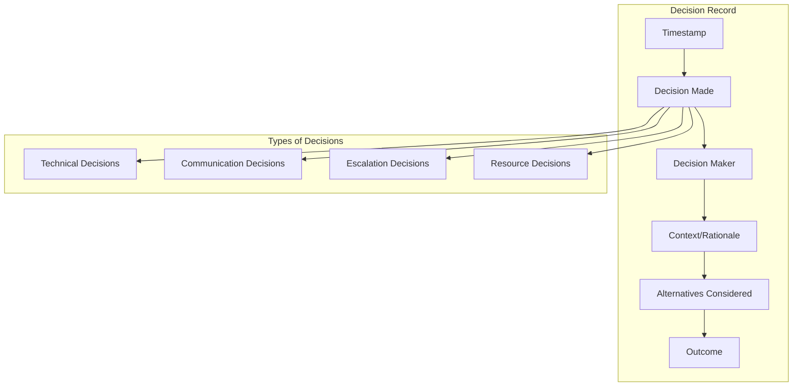

# How to Build Internal Communication

Author: [nawazdhandala](https://github.com/nawazdhandala)

Tags: Incident Management, Communication, SRE, Teams

Description: Learn how to establish effective internal communication during incidents.

---

## Why Internal Communication Matters During Incidents

When an incident strikes, the difference between a swift resolution and prolonged chaos often comes down to communication. Technical expertise alone cannot save you if your team is unable to coordinate effectively. Poor communication leads to duplicated efforts, missed context, and slower recovery times.

Effective internal communication during incidents ensures:

- **Rapid information sharing** across all stakeholders
- **Clear ownership** of tasks and responsibilities
- **Reduced cognitive load** on responders
- **Accurate documentation** for postmortems
- **Faster mean time to resolution (MTTR)**

---

## War Room Setup

A war room is a dedicated space (physical or virtual) where incident responders gather to coordinate their efforts. The key is to have a single source of truth where all communication happens.

### Virtual War Room Architecture


### Automated War Room Creation

Here is a practical example of automatically creating a war room when an incident is detected:

```javascript
// war-room-manager.js
const { WebClient } = require('@slack/web-api');

class WarRoomManager {
  constructor(slackToken) {
    this.slack = new WebClient(slackToken);
    this.activeWarRooms = new Map();
  }

  async createWarRoom(incident) {
    const channelName = `inc-${incident.id}-${this.sanitizeName(incident.title)}`;

    try {
      // Create dedicated incident channel
      const channel = await this.slack.conversations.create({
        name: channelName,
        is_private: false
      });

      // Set channel topic with incident details
      await this.slack.conversations.setTopic({
        channel: channel.channel.id,
        topic: `Severity: ${incident.severity} | Status: Active | Commander: TBD`
      });

      // Post initial incident summary
      await this.slack.chat.postMessage({
        channel: channel.channel.id,
        blocks: this.buildIncidentSummaryBlocks(incident)
      });

      // Invite on-call responders automatically
      await this.inviteOnCallResponders(channel.channel.id, incident.severity);

      this.activeWarRooms.set(incident.id, {
        channelId: channel.channel.id,
        channelName,
        createdAt: new Date()
      });

      return channel.channel.id;
    } catch (error) {
      console.error('Failed to create war room:', error);
      throw error;
    }
  }

  buildIncidentSummaryBlocks(incident) {
    return [
      {
        type: 'header',
        text: {
          type: 'plain_text',
          text: `Incident: ${incident.title}`
        }
      },
      {
        type: 'section',
        fields: [
          { type: 'mrkdwn', text: `*Severity:*\n${incident.severity}` },
          { type: 'mrkdwn', text: `*Status:*\nInvestigating` },
          { type: 'mrkdwn', text: `*Detected:*\n${incident.detectedAt}` },
          { type: 'mrkdwn', text: `*Affected Services:*\n${incident.services.join(', ')}` }
        ]
      },
      {
        type: 'section',
        text: {
          type: 'mrkdwn',
          text: `*Description:*\n${incident.description}`
        }
      },
      {
        type: 'actions',
        elements: [
          {
            type: 'button',
            text: { type: 'plain_text', text: 'Claim Incident Commander' },
            action_id: 'claim_ic',
            style: 'primary'
          },
          {
            type: 'button',
            text: { type: 'plain_text', text: 'View Runbook' },
            action_id: 'view_runbook',
            url: incident.runbookUrl
          }
        ]
      }
    ];
  }

  async inviteOnCallResponders(channelId, severity) {
    const responders = await this.getOnCallResponders(severity);

    if (responders.length > 0) {
      await this.slack.conversations.invite({
        channel: channelId,
        users: responders.join(',')
      });
    }
  }

  sanitizeName(name) {
    return name.toLowerCase()
      .replace(/[^a-z0-9-]/g, '-')
      .substring(0, 20);
  }
}

module.exports = WarRoomManager;
```

---

## Dedicated Incident Channels

Dedicated incident channels prevent noise pollution in your main channels and create a focused environment for incident resolution.

### Channel Naming Conventions

Consistent naming helps teams quickly identify and join relevant channels:

| Pattern | Example | Use Case |
|---------|---------|----------|
| `inc-{id}-{short-desc}` | `inc-1234-api-latency` | Active incidents |
| `inc-{id}-resolved` | `inc-1234-resolved` | Archived/resolved incidents |
| `sev1-{service}` | `sev1-payments` | Persistent high-severity channels |

### Channel Lifecycle Management


### Automated Channel Lifecycle

```python
# incident_channel_manager.py
import asyncio
from datetime import datetime, timedelta
from typing import Optional
from dataclasses import dataclass, field
from enum import Enum

class IncidentStatus(Enum):
    CREATED = "created"
    ACTIVE = "active"
    INVESTIGATING = "investigating"
    MITIGATING = "mitigating"
    MONITORING = "monitoring"
    RESOLVED = "resolved"
    ARCHIVED = "archived"

@dataclass
class IncidentChannel:
    incident_id: str
    channel_id: str
    status: IncidentStatus
    created_at: datetime
    resolved_at: Optional[datetime] = None
    archive_scheduled_at: Optional[datetime] = None
    participants: list = field(default_factory=list)
    timeline: list = field(default_factory=list)

class IncidentChannelManager:
    def __init__(self, slack_client, archive_delay_hours: int = 72):
        self.slack = slack_client
        self.archive_delay = timedelta(hours=archive_delay_hours)
        self.channels: dict[str, IncidentChannel] = {}

    async def transition_status(
        self,
        incident_id: str,
        new_status: IncidentStatus,
        user: str,
        note: str = ""
    ):
        channel = self.channels.get(incident_id)
        if not channel:
            raise ValueError(f"No channel found for incident {incident_id}")

        old_status = channel.status
        channel.status = new_status

        # Record timeline entry
        channel.timeline.append({
            "timestamp": datetime.utcnow().isoformat(),
            "from_status": old_status.value,
            "to_status": new_status.value,
            "user": user,
            "note": note
        })

        # Update channel topic
        await self.slack.conversations_setTopic(
            channel=channel.channel_id,
            topic=f"Status: {new_status.value.upper()} | Updated by {user}"
        )

        # Post status update to channel
        await self.slack.chat_postMessage(
            channel=channel.channel_id,
            text=f":rotating_light: Status changed: {old_status.value} -> {new_status.value}\n"
                 f"Updated by: {user}\n"
                 f"Note: {note or 'No additional notes'}"
        )

        # Handle resolved status
        if new_status == IncidentStatus.RESOLVED:
            channel.resolved_at = datetime.utcnow()
            channel.archive_scheduled_at = datetime.utcnow() + self.archive_delay
            await self.schedule_archive(incident_id)

        return channel

    async def schedule_archive(self, incident_id: str):
        channel = self.channels.get(incident_id)
        if not channel or not channel.archive_scheduled_at:
            return

        await self.slack.chat_postMessage(
            channel=channel.channel_id,
            text=f":file_folder: This channel will be archived on "
                 f"{channel.archive_scheduled_at.strftime('%Y-%m-%d %H:%M UTC')}.\n"
                 f"Please complete the postmortem before then."
        )

    async def archive_channel(self, incident_id: str):
        channel = self.channels.get(incident_id)
        if not channel:
            return

        # Export conversation history for records
        history = await self.export_channel_history(channel.channel_id)

        # Rename channel to indicate archived status
        await self.slack.conversations_rename(
            channel=channel.channel_id,
            name=f"archived-inc-{incident_id}"
        )

        # Archive the channel
        await self.slack.conversations_archive(channel=channel.channel_id)

        channel.status = IncidentStatus.ARCHIVED

        return history

    async def export_channel_history(self, channel_id: str) -> list:
        messages = []
        cursor = None

        while True:
            response = await self.slack.conversations_history(
                channel=channel_id,
                cursor=cursor,
                limit=200
            )
            messages.extend(response["messages"])

            cursor = response.get("response_metadata", {}).get("next_cursor")
            if not cursor:
                break

        return messages
```

---

## Role-Based Communication

Clear roles prevent chaos during incidents. Each role has specific communication responsibilities.

### Incident Response Roles


### Role Assignment System

```javascript
// role-manager.js
class IncidentRoleManager {
  constructor() {
    this.roles = {
      INCIDENT_COMMANDER: {
        name: 'Incident Commander',
        abbreviation: 'IC',
        responsibilities: [
          'Overall incident coordination',
          'Decision making authority',
          'Resource allocation',
          'Escalation decisions'
        ],
        communicationDuties: [
          'Provide regular status updates (every 15-30 min)',
          'Coordinate between all responders',
          'Approve external communications'
        ]
      },
      TECHNICAL_LEAD: {
        name: 'Technical Lead',
        abbreviation: 'TL',
        responsibilities: [
          'Lead technical investigation',
          'Coordinate debugging efforts',
          'Propose and implement fixes'
        ],
        communicationDuties: [
          'Report technical findings to IC',
          'Document investigation steps',
          'Coordinate with SMEs'
        ]
      },
      COMMUNICATIONS_LEAD: {
        name: 'Communications Lead',
        abbreviation: 'CL',
        responsibilities: [
          'Draft external communications',
          'Update status page',
          'Coordinate with customer support'
        ],
        communicationDuties: [
          'Prepare customer-facing updates',
          'Coordinate with marketing/PR if needed',
          'Document communication timeline'
        ]
      },
      SCRIBE: {
        name: 'Scribe',
        abbreviation: 'SC',
        responsibilities: [
          'Document incident timeline',
          'Record all decisions and actions',
          'Prepare postmortem draft'
        ],
        communicationDuties: [
          'Maintain real-time incident log',
          'Capture key decisions and rationale',
          'Track action items'
        ]
      }
    };

    this.assignments = new Map();
  }

  assignRole(incidentId, role, userId, userName) {
    if (!this.assignments.has(incidentId)) {
      this.assignments.set(incidentId, {});
    }

    const incidentRoles = this.assignments.get(incidentId);

    // Check if role is already assigned
    if (incidentRoles[role] && incidentRoles[role].userId !== userId) {
      return {
        success: false,
        message: `Role ${role} is already assigned to ${incidentRoles[role].userName}`
      };
    }

    incidentRoles[role] = {
      userId,
      userName,
      assignedAt: new Date(),
      role: this.roles[role]
    };

    return {
      success: true,
      message: `${userName} assigned as ${this.roles[role].name}`,
      roleInfo: this.roles[role]
    };
  }

  getRoleAssignments(incidentId) {
    return this.assignments.get(incidentId) || {};
  }

  generateRoleCard(incidentId) {
    const assignments = this.getRoleAssignments(incidentId);

    let card = '## Current Role Assignments\n\n';
    card += '| Role | Assignee | Since |\n';
    card += '|------|----------|-------|\n';

    for (const [roleKey, assignment] of Object.entries(assignments)) {
      const duration = this.formatDuration(assignment.assignedAt);
      card += `| ${assignment.role.name} | ${assignment.userName} | ${duration} |\n`;
    }

    // List unassigned roles
    const unassigned = Object.keys(this.roles).filter(
      role => !assignments[role]
    );

    if (unassigned.length > 0) {
      card += '\n### Unassigned Roles\n';
      unassigned.forEach(role => {
        card += `- ${this.roles[role].name}\n`;
      });
    }

    return card;
  }

  formatDuration(startTime) {
    const diff = Date.now() - startTime.getTime();
    const minutes = Math.floor(diff / 60000);
    const hours = Math.floor(minutes / 60);

    if (hours > 0) {
      return `${hours}h ${minutes % 60}m`;
    }
    return `${minutes}m`;
  }
}

module.exports = IncidentRoleManager;
```

---

## Real-Time Collaboration Tools

Effective incident response requires tools that enable real-time collaboration without context switching.

### Tool Integration Architecture


### Unified Incident Bot

```javascript
// incident-bot.js
const { App } = require('@slack/bolt');

class IncidentBot {
  constructor(config) {
    this.app = new App({
      token: config.slackToken,
      signingSecret: config.signingSecret,
      socketMode: true,
      appToken: config.appToken
    });

    this.setupCommands();
    this.setupActions();
    this.setupShortcuts();
  }

  setupCommands() {
    // Declare incident
    this.app.command('/incident', async ({ command, ack, respond }) => {
      await ack();

      await respond({
        blocks: [
          {
            type: 'section',
            text: {
              type: 'mrkdwn',
              text: 'Create a new incident report:'
            }
          },
          {
            type: 'actions',
            elements: [
              {
                type: 'button',
                text: { type: 'plain_text', text: 'SEV-1 (Critical)' },
                style: 'danger',
                action_id: 'create_sev1'
              },
              {
                type: 'button',
                text: { type: 'plain_text', text: 'SEV-2 (Major)' },
                style: 'primary',
                action_id: 'create_sev2'
              },
              {
                type: 'button',
                text: { type: 'plain_text', text: 'SEV-3 (Minor)' },
                action_id: 'create_sev3'
              }
            ]
          }
        ]
      });
    });

    // Status update command
    this.app.command('/incident-update', async ({ command, ack, respond, client }) => {
      await ack();

      await client.views.open({
        trigger_id: command.trigger_id,
        view: this.buildStatusUpdateModal()
      });
    });

    // Timeline command
    this.app.command('/timeline', async ({ command, ack, respond }) => {
      await ack();

      const timeline = await this.getIncidentTimeline(command.channel_id);
      await respond({
        blocks: this.formatTimeline(timeline)
      });
    });
  }

  setupActions() {
    // Handle status update submission
    this.app.view('status_update_modal', async ({ ack, body, view, client }) => {
      await ack();

      const values = view.state.values;
      const update = {
        status: values.status_block.status_select.selected_option.value,
        message: values.message_block.message_input.value,
        user: body.user.id,
        timestamp: new Date()
      };

      await this.postStatusUpdate(body.user.id, update, client);
    });

    // Handle role claim
    this.app.action('claim_ic', async ({ body, ack, client }) => {
      await ack();

      await client.chat.postMessage({
        channel: body.channel.id,
        text: `<@${body.user.id}> has claimed the Incident Commander role.`
      });

      await this.assignRole(body.channel.id, 'IC', body.user.id);
    });
  }

  setupShortcuts() {
    // Quick incident escalation
    this.app.shortcut('escalate_incident', async ({ shortcut, ack, client }) => {
      await ack();

      await client.views.open({
        trigger_id: shortcut.trigger_id,
        view: this.buildEscalationModal()
      });
    });
  }

  buildStatusUpdateModal() {
    return {
      type: 'modal',
      callback_id: 'status_update_modal',
      title: { type: 'plain_text', text: 'Update Incident Status' },
      submit: { type: 'plain_text', text: 'Post Update' },
      blocks: [
        {
          type: 'input',
          block_id: 'status_block',
          element: {
            type: 'static_select',
            action_id: 'status_select',
            options: [
              { text: { type: 'plain_text', text: 'Investigating' }, value: 'investigating' },
              { text: { type: 'plain_text', text: 'Identified' }, value: 'identified' },
              { text: { type: 'plain_text', text: 'Mitigating' }, value: 'mitigating' },
              { text: { type: 'plain_text', text: 'Monitoring' }, value: 'monitoring' },
              { text: { type: 'plain_text', text: 'Resolved' }, value: 'resolved' }
            ]
          },
          label: { type: 'plain_text', text: 'Status' }
        },
        {
          type: 'input',
          block_id: 'message_block',
          element: {
            type: 'plain_text_input',
            action_id: 'message_input',
            multiline: true,
            placeholder: { type: 'plain_text', text: 'Describe the current situation...' }
          },
          label: { type: 'plain_text', text: 'Update Message' }
        }
      ]
    };
  }

  formatTimeline(events) {
    const blocks = [
      {
        type: 'header',
        text: { type: 'plain_text', text: 'Incident Timeline' }
      }
    ];

    events.forEach(event => {
      blocks.push({
        type: 'section',
        text: {
          type: 'mrkdwn',
          text: `*${event.timestamp}* - ${event.type}\n${event.message}`
        }
      });
      blocks.push({ type: 'divider' });
    });

    return blocks;
  }

  async start() {
    await this.app.start();
    console.log('Incident Bot is running');
  }
}

module.exports = IncidentBot;
```

---

## Decision Documentation

Every decision made during an incident should be documented for postmortem analysis and organizational learning.

### Decision Log Structure



### Automated Decision Logger

```python
# decision_logger.py
from datetime import datetime
from typing import Optional, List
from dataclasses import dataclass, field
from enum import Enum
import json

class DecisionType(Enum):
    TECHNICAL = "technical"
    COMMUNICATION = "communication"
    ESCALATION = "escalation"
    RESOURCE = "resource"
    MITIGATION = "mitigation"

@dataclass
class Decision:
    id: str
    timestamp: datetime
    decision_type: DecisionType
    decision: str
    made_by: str
    rationale: str
    alternatives_considered: List[str] = field(default_factory=list)
    outcome: Optional[str] = None
    tags: List[str] = field(default_factory=list)

class DecisionLogger:
    def __init__(self, incident_id: str):
        self.incident_id = incident_id
        self.decisions: List[Decision] = []
        self._decision_counter = 0

    def log_decision(
        self,
        decision_type: DecisionType,
        decision: str,
        made_by: str,
        rationale: str,
        alternatives: List[str] = None,
        tags: List[str] = None
    ) -> Decision:
        """Log a new decision made during the incident."""
        self._decision_counter += 1

        new_decision = Decision(
            id=f"{self.incident_id}-D{self._decision_counter:03d}",
            timestamp=datetime.utcnow(),
            decision_type=decision_type,
            decision=decision,
            made_by=made_by,
            rationale=rationale,
            alternatives_considered=alternatives or [],
            tags=tags or []
        )

        self.decisions.append(new_decision)
        return new_decision

    def update_outcome(self, decision_id: str, outcome: str) -> Optional[Decision]:
        """Update the outcome of a previously logged decision."""
        for decision in self.decisions:
            if decision.id == decision_id:
                decision.outcome = outcome
                return decision
        return None

    def get_decisions_by_type(self, decision_type: DecisionType) -> List[Decision]:
        """Filter decisions by type."""
        return [d for d in self.decisions if d.decision_type == decision_type]

    def generate_decision_summary(self) -> str:
        """Generate a markdown summary of all decisions."""
        summary = f"# Decision Log for Incident {self.incident_id}\n\n"
        summary += f"Total Decisions: {len(self.decisions)}\n\n"

        # Group by type
        for dtype in DecisionType:
            type_decisions = self.get_decisions_by_type(dtype)
            if type_decisions:
                summary += f"## {dtype.value.title()} Decisions\n\n"
                for d in type_decisions:
                    summary += f"### {d.id}: {d.decision}\n"
                    summary += f"- **Time:** {d.timestamp.strftime('%Y-%m-%d %H:%M:%S UTC')}\n"
                    summary += f"- **Made by:** {d.made_by}\n"
                    summary += f"- **Rationale:** {d.rationale}\n"
                    if d.alternatives_considered:
                        summary += f"- **Alternatives:** {', '.join(d.alternatives_considered)}\n"
                    if d.outcome:
                        summary += f"- **Outcome:** {d.outcome}\n"
                    summary += "\n"

        return summary

    def export_to_json(self) -> str:
        """Export all decisions as JSON for integration with other tools."""
        return json.dumps({
            "incident_id": self.incident_id,
            "decisions": [
                {
                    "id": d.id,
                    "timestamp": d.timestamp.isoformat(),
                    "type": d.decision_type.value,
                    "decision": d.decision,
                    "made_by": d.made_by,
                    "rationale": d.rationale,
                    "alternatives": d.alternatives_considered,
                    "outcome": d.outcome,
                    "tags": d.tags
                }
                for d in self.decisions
            ]
        }, indent=2)


# Example usage during an incident
if __name__ == "__main__":
    logger = DecisionLogger("INC-2024-001")

    # Log a technical decision
    d1 = logger.log_decision(
        decision_type=DecisionType.TECHNICAL,
        decision="Roll back to previous deployment version v2.3.4",
        made_by="alice@company.com",
        rationale="New deployment introduced memory leak causing OOM kills",
        alternatives=["Hotfix the memory leak", "Scale up instances", "Restart affected pods"],
        tags=["rollback", "deployment", "memory"]
    )

    # Log an escalation decision
    d2 = logger.log_decision(
        decision_type=DecisionType.ESCALATION,
        decision="Page database team for assistance",
        made_by="bob@company.com",
        rationale="Query performance degradation beyond application team expertise",
        alternatives=["Continue investigating application layer"]
    )

    # Update outcome later
    logger.update_outcome(d1.id, "Successful - service restored within 5 minutes of rollback")

    print(logger.generate_decision_summary())
```

---

## Handoff Communication

Incidents often span multiple shifts. Effective handoffs ensure continuity and prevent information loss.

### Handoff Process Flow


### Handoff Management System

```javascript
// handoff-manager.js
class HandoffManager {
  constructor(slackClient, incidentTracker) {
    this.slack = slackClient;
    this.tracker = incidentTracker;
    this.pendingHandoffs = new Map();
  }

  async initiateHandoff(incidentId, outgoingUser, incomingUser) {
    const incident = await this.tracker.getIncident(incidentId);
    const channel = incident.warRoomChannel;

    // Generate comprehensive handoff document
    const handoffDoc = await this.generateHandoffDocument(incident, outgoingUser);

    // Post handoff template to channel
    const message = await this.slack.chat.postMessage({
      channel,
      blocks: [
        {
          type: 'header',
          text: { type: 'plain_text', text: 'Shift Handoff in Progress' }
        },
        {
          type: 'section',
          fields: [
            { type: 'mrkdwn', text: `*Outgoing:* <@${outgoingUser}>` },
            { type: 'mrkdwn', text: `*Incoming:* <@${incomingUser}>` }
          ]
        },
        { type: 'divider' },
        {
          type: 'section',
          text: { type: 'mrkdwn', text: '*Current Status Summary*' }
        },
        {
          type: 'section',
          text: { type: 'mrkdwn', text: handoffDoc.statusSummary }
        },
        { type: 'divider' },
        {
          type: 'section',
          text: { type: 'mrkdwn', text: '*Recent Actions (Last 2 Hours)*' }
        },
        {
          type: 'section',
          text: { type: 'mrkdwn', text: handoffDoc.recentActions }
        },
        { type: 'divider' },
        {
          type: 'section',
          text: { type: 'mrkdwn', text: '*Open Questions / Pending Items*' }
        },
        {
          type: 'section',
          text: { type: 'mrkdwn', text: handoffDoc.openQuestions }
        },
        { type: 'divider' },
        {
          type: 'section',
          text: { type: 'mrkdwn', text: '*Recommended Next Steps*' }
        },
        {
          type: 'section',
          text: { type: 'mrkdwn', text: handoffDoc.nextSteps }
        },
        {
          type: 'actions',
          elements: [
            {
              type: 'button',
              text: { type: 'plain_text', text: 'Accept Handoff' },
              style: 'primary',
              action_id: 'accept_handoff',
              value: JSON.stringify({ incidentId, outgoingUser, incomingUser })
            },
            {
              type: 'button',
              text: { type: 'plain_text', text: 'Request Sync Call' },
              action_id: 'request_sync',
              value: JSON.stringify({ incidentId, outgoingUser, incomingUser })
            }
          ]
        }
      ]
    });

    this.pendingHandoffs.set(incidentId, {
      messageTs: message.ts,
      outgoingUser,
      incomingUser,
      initiatedAt: new Date(),
      status: 'pending'
    });

    // Notify incoming responder
    await this.slack.chat.postMessage({
      channel: incomingUser,
      text: `You have a pending handoff for incident ${incident.title}. ` +
            `Please review the handoff document in <#${channel}>.`
    });

    return message;
  }

  async generateHandoffDocument(incident, outgoingUser) {
    const timeline = await this.tracker.getTimeline(incident.id);
    const recentEvents = timeline.filter(
      e => Date.now() - new Date(e.timestamp).getTime() < 2 * 60 * 60 * 1000
    );

    return {
      statusSummary: this.formatStatusSummary(incident),
      recentActions: this.formatRecentActions(recentEvents),
      openQuestions: await this.getOpenQuestions(incident.id),
      nextSteps: await this.getRecommendedNextSteps(incident)
    };
  }

  formatStatusSummary(incident) {
    return `
- **Severity:** ${incident.severity}
- **Status:** ${incident.status}
- **Duration:** ${this.formatDuration(incident.startedAt)}
- **Affected Services:** ${incident.affectedServices.join(', ')}
- **Customer Impact:** ${incident.customerImpact || 'Under assessment'}
- **Current Hypothesis:** ${incident.currentHypothesis || 'Still investigating'}
    `.trim();
  }

  formatRecentActions(events) {
    if (events.length === 0) {
      return '_No recent actions in the last 2 hours_';
    }

    return events
      .map(e => `- ${this.formatTime(e.timestamp)}: ${e.description}`)
      .join('\n');
  }

  async acceptHandoff(incidentId, incomingUser) {
    const handoff = this.pendingHandoffs.get(incidentId);
    if (!handoff) {
      throw new Error('No pending handoff found');
    }

    const incident = await this.tracker.getIncident(incidentId);

    // Update incident commander
    await this.tracker.updateIncidentCommander(incidentId, incomingUser);

    // Record in timeline
    await this.tracker.addTimelineEvent(incidentId, {
      type: 'handoff',
      description: `Handoff completed: <@${handoff.outgoingUser}> -> <@${incomingUser}>`,
      user: incomingUser
    });

    // Post confirmation
    await this.slack.chat.postMessage({
      channel: incident.warRoomChannel,
      text: `Handoff complete. <@${incomingUser}> is now the Incident Commander.`
    });

    handoff.status = 'completed';
    handoff.completedAt = new Date();

    return handoff;
  }

  formatDuration(startTime) {
    const diff = Date.now() - new Date(startTime).getTime();
    const hours = Math.floor(diff / 3600000);
    const minutes = Math.floor((diff % 3600000) / 60000);
    return `${hours}h ${minutes}m`;
  }

  formatTime(timestamp) {
    return new Date(timestamp).toLocaleTimeString('en-US', {
      hour: '2-digit',
      minute: '2-digit',
      timeZoneName: 'short'
    });
  }
}

module.exports = HandoffManager;
```

### Handoff Checklist

Use this checklist to ensure complete information transfer:

```markdown
## Handoff Checklist

### Before Handoff
- [ ] Document current incident status
- [ ] List all actions taken in current shift
- [ ] Note any pending actions or timers
- [ ] Identify open questions requiring follow-up
- [ ] Update all tracking systems

### During Handoff
- [ ] Walk through incident timeline
- [ ] Explain current hypothesis and evidence
- [ ] Review pending decisions
- [ ] Share relevant dashboards and logs
- [ ] Introduce active stakeholders

### After Handoff
- [ ] Incoming responder confirms understanding
- [ ] Update incident commander in all systems
- [ ] Notify stakeholders of handoff
- [ ] Outgoing responder available for questions (30 min buffer)
```

---

## Communication Templates

Standardized templates ensure consistent, clear communication during incidents.

### Status Update Template

```markdown
## Incident Status Update

**Incident:** [INC-XXXX] Brief Title
**Time:** YYYY-MM-DD HH:MM UTC
**Status:** Investigating | Identified | Mitigating | Monitoring | Resolved

### Current Situation
[2-3 sentences describing current state]

### Impact
- Affected services: [list]
- User impact: [description]
- Duration: [time since detection]

### Actions Taken
- [Action 1]
- [Action 2]

### Next Steps
- [Planned action 1]
- [Planned action 2]

### Next Update
Expected at: [time] or when significant change occurs
```

### Escalation Template

```markdown
## Escalation Request

**Incident:** [INC-XXXX]
**Requesting Team/Person:** [name]
**Current IC:** [name]

### Reason for Escalation
[Why additional help is needed]

### Specific Expertise Needed
- [ ] Database
- [ ] Networking
- [ ] Security
- [ ] Application specific: [name]
- [ ] Other: [specify]

### Current Status
[Brief summary]

### What We've Tried
[List of attempted solutions]

### Urgency
[Critical/High/Medium] - [Reason for urgency level]
```

---

## Putting It All Together

Effective internal communication during incidents requires a combination of well-designed processes, appropriate tooling, and consistent practice.

### Communication Flow Summary


### Key Takeaways

1. **Automate channel creation** to reduce friction when incidents occur
2. **Define clear roles** so everyone knows their communication responsibilities
3. **Use consistent templates** for status updates, escalations, and handoffs
4. **Document decisions** in real-time for postmortem analysis
5. **Practice handoffs** to ensure continuity across shifts
6. **Integrate your tools** to create a unified communication experience
7. **Review and iterate** on your communication processes regularly

By building robust internal communication practices, your team will respond to incidents more effectively, recover faster, and learn more from each experience.

---

## Further Reading

- [Effective Incident Postmortem Templates](https://oneuptime.com/blog/post/2025-09-09-effective-incident-postmortem-templates-ready-to-use-examples)
- [Designing an SRE On-Call Rotation](https://oneuptime.com/blog/post/2025-11-28-sre-on-call-rotation-design)
- [The Five Stages of SRE Maturity](https://oneuptime.com/blog/post/2025-09-01-the-five-stages-of-sre-maturity)
