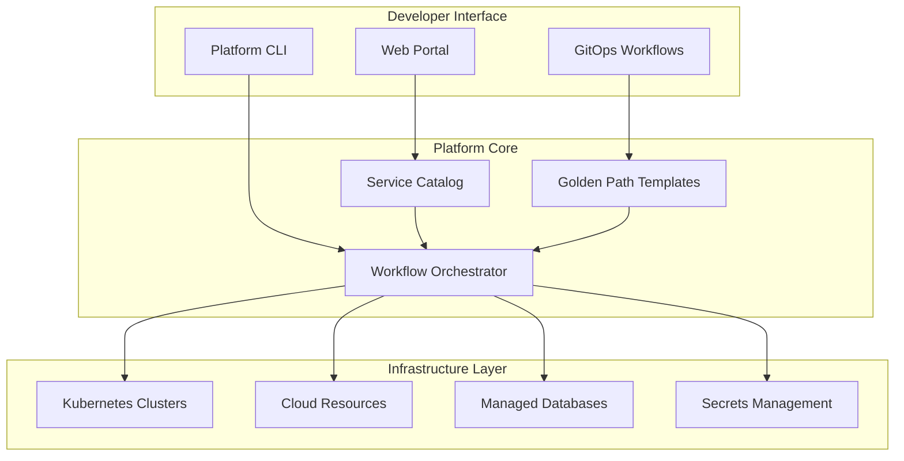
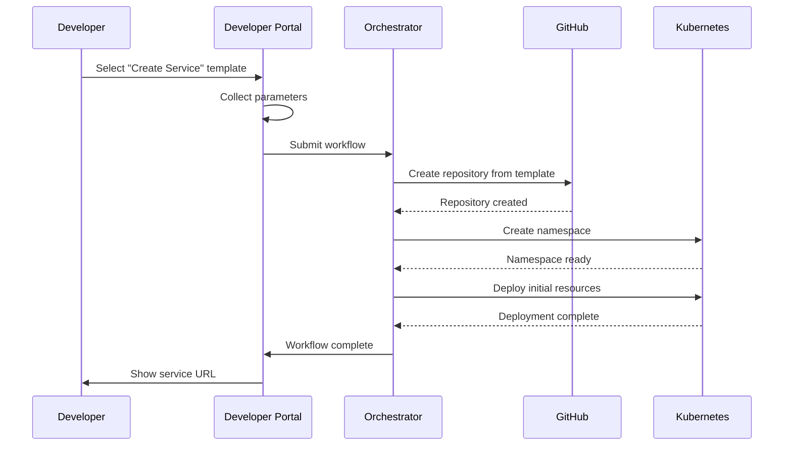

# How to Build Internal Developer Platform

Author: [nawazdhandala](https://www.github.com/nawazdhandala)

Tags: Platform Engineering, Developer Experience, DevOps, Infrastructure, Self-Service

Description: Build an internal developer platform with self-service infrastructure, golden paths, service catalog, and developer portal for improved productivity.

---

Engineering teams waste countless hours waiting for infrastructure. Developers file tickets, wait for approvals, then wait some more while operations manually provisions resources. An internal developer platform (IDP) eliminates this friction by providing self-service access to everything developers need to build, deploy, and run software.

This guide walks through building an IDP from scratch, covering the core components and how they fit together.

## What Makes Up an IDP

An internal developer platform consists of several interconnected systems that work together to abstract infrastructure complexity.



## Building the Service Catalog

The service catalog is the foundation of your IDP. It tracks every service, who owns it, and how it connects to other services.

Start with a simple data model that captures the essential information about each service.

```python
# models/service.py
# Core service model for the service catalog

from dataclasses import dataclass
from typing import Optional
from datetime import datetime
from enum import Enum

class ServiceLifecycle(Enum):
    """Lifecycle stages for services in the catalog"""
    EXPERIMENTAL = "experimental"
    DEVELOPMENT = "development"
    PRODUCTION = "production"
    DEPRECATED = "deprecated"

@dataclass
class ServiceMetadata:
    """Metadata attached to every service in the catalog"""
    name: str
    description: str
    owner_team: str
    lifecycle: ServiceLifecycle
    repository_url: str
    documentation_url: Optional[str] = None
    oncall_rotation: Optional[str] = None
    created_at: datetime = None

    def __post_init__(self):
        if self.created_at is None:
            self.created_at = datetime.utcnow()

@dataclass
class ServiceDependency:
    """Represents a dependency between services"""
    source_service: str
    target_service: str
    dependency_type: str  # "runtime", "build", "data"
    is_critical: bool = False
```

The catalog needs an API that developers and automation can query.

```python
# api/catalog.py
# REST API endpoints for the service catalog

from fastapi import FastAPI, HTTPException
from typing import List

app = FastAPI(title="Service Catalog API")

# In-memory store for demonstration
# Production would use PostgreSQL or similar
services_db = {}

@app.post("/services")
async def register_service(service: ServiceMetadata) -> dict:
    """
    Register a new service in the catalog.
    Called when teams create new services through templates.
    """
    if service.name in services_db:
        raise HTTPException(
            status_code=409,
            detail=f"Service {service.name} already exists"
        )

    services_db[service.name] = service
    return {"status": "registered", "service": service.name}

@app.get("/services/{service_name}")
async def get_service(service_name: str) -> ServiceMetadata:
    """Retrieve service details by name"""
    if service_name not in services_db:
        raise HTTPException(status_code=404, detail="Service not found")
    return services_db[service_name]

@app.get("/services")
async def list_services(
    team: str = None,
    lifecycle: str = None
) -> List[ServiceMetadata]:
    """
    List all services, optionally filtered by team or lifecycle.
    Powers the service discovery UI in the developer portal.
    """
    results = list(services_db.values())

    if team:
        results = [s for s in results if s.owner_team == team]
    if lifecycle:
        results = [s for s in results if s.lifecycle.value == lifecycle]

    return results
```

## Creating Golden Path Templates

Golden paths are opinionated templates that encode your organization's best practices. When developers create a new service, they get everything they need out of the box: CI/CD pipelines, monitoring, security scanning, and deployment configurations.

Structure your templates so they can generate complete, production-ready services.

```yaml
# templates/microservice/template.yaml
# Golden path template for creating new microservices

name: microservice
version: "1.0.0"
description: Create a production-ready microservice with CI/CD and observability

# Parameters collected from developers
parameters:
  - name: service_name
    type: string
    description: Name of the service (lowercase, hyphens only)
    pattern: "^[a-z][a-z0-9-]*$"
    required: true

  - name: language
    type: choice
    description: Programming language
    choices:
      - go
      - python
      - nodejs
    default: go

  - name: owner_team
    type: string
    description: Team that will own this service
    required: true

  - name: expose_public
    type: boolean
    description: Expose service to public internet
    default: false

# Files to generate from the template
outputs:
  - source: skeleton/{{ language }}/
    destination: /

  - source: common/Dockerfile.{{ language }}
    destination: Dockerfile

  - source: common/ci-pipeline.yaml
    destination: .github/workflows/ci.yaml

  - source: common/kubernetes/
    destination: k8s/
```

The template engine processes these files with the developer's inputs.

```python
# engine/template_processor.py
# Processes golden path templates to generate service scaffolding

import os
import yaml
from jinja2 import Environment, FileSystemLoader
from pathlib import Path

class TemplateProcessor:
    """
    Processes golden path templates and generates service scaffolding.
    Uses Jinja2 for templating with custom filters for Kubernetes names.
    """

    def __init__(self, templates_dir: str):
        self.templates_dir = Path(templates_dir)
        self.env = Environment(
            loader=FileSystemLoader(templates_dir),
            # Keep whitespace for YAML files
            trim_blocks=True,
            lstrip_blocks=True
        )

        # Add custom filters for common transformations
        self.env.filters['k8s_name'] = self._to_k8s_name
        self.env.filters['env_var'] = self._to_env_var

    def _to_k8s_name(self, value: str) -> str:
        """Convert string to valid Kubernetes resource name"""
        return value.lower().replace('_', '-')[:63]

    def _to_env_var(self, value: str) -> str:
        """Convert string to environment variable format"""
        return value.upper().replace('-', '_')

    def process_template(
        self,
        template_name: str,
        parameters: dict,
        output_dir: str
    ) -> list:
        """
        Process a template and write generated files to output directory.
        Returns list of generated file paths.
        """
        # Load template definition
        template_path = self.templates_dir / template_name / "template.yaml"
        with open(template_path) as f:
            template_def = yaml.safe_load(f)

        generated_files = []

        for output in template_def['outputs']:
            source_pattern = output['source']
            dest_pattern = output['destination']

            # Render the source path with parameters
            source = self.env.from_string(source_pattern).render(**parameters)
            dest = self.env.from_string(dest_pattern).render(**parameters)

            # Process the template file
            template = self.env.get_template(f"{template_name}/{source}")
            content = template.render(**parameters)

            # Write to output directory
            output_path = Path(output_dir) / dest
            output_path.parent.mkdir(parents=True, exist_ok=True)
            output_path.write_text(content)

            generated_files.append(str(output_path))

        return generated_files
```

## Building the Workflow Orchestrator

The orchestrator coordinates multi-step workflows like creating a new service, provisioning databases, or deploying to production. It needs to handle failures gracefully and provide visibility into what is happening.

```python
# orchestrator/workflow.py
# Workflow orchestrator for multi-step platform operations

from dataclasses import dataclass
from enum import Enum
from typing import Callable, Any
import asyncio
import logging

logger = logging.getLogger(__name__)

class StepStatus(Enum):
    PENDING = "pending"
    RUNNING = "running"
    SUCCESS = "success"
    FAILED = "failed"
    ROLLED_BACK = "rolled_back"

@dataclass
class WorkflowStep:
    """
    Single step in a workflow with optional rollback.
    Each step should be idempotent for safe retries.
    """
    name: str
    action: Callable
    rollback: Callable = None
    timeout_seconds: int = 300

class WorkflowOrchestrator:
    """
    Executes multi-step workflows with automatic rollback on failure.
    Tracks state so workflows can resume after interruptions.
    """

    def __init__(self, state_store):
        self.state_store = state_store

    async def execute_workflow(
        self,
        workflow_id: str,
        steps: list[WorkflowStep],
        context: dict
    ) -> dict:
        """
        Execute a workflow, rolling back on any failure.
        Context is passed to each step and can be modified by steps.
        """
        completed_steps = []

        try:
            for step in steps:
                logger.info(f"Executing step: {step.name}")

                # Update state before execution
                await self.state_store.update(
                    workflow_id,
                    step.name,
                    StepStatus.RUNNING
                )

                # Execute with timeout
                result = await asyncio.wait_for(
                    step.action(context),
                    timeout=step.timeout_seconds
                )

                # Merge result into context for next steps
                if result:
                    context.update(result)

                completed_steps.append(step)
                await self.state_store.update(
                    workflow_id,
                    step.name,
                    StepStatus.SUCCESS
                )

        except Exception as e:
            logger.error(f"Workflow failed at {step.name}: {e}")

            # Rollback completed steps in reverse order
            for completed_step in reversed(completed_steps):
                if completed_step.rollback:
                    try:
                        await completed_step.rollback(context)
                        await self.state_store.update(
                            workflow_id,
                            completed_step.name,
                            StepStatus.ROLLED_BACK
                        )
                    except Exception as rollback_error:
                        logger.error(
                            f"Rollback failed for {completed_step.name}: "
                            f"{rollback_error}"
                        )

            raise

        return context
```

## Building the Developer Portal

The developer portal brings everything together in a web interface. Developers can browse the service catalog, launch templates, and see their deployments.

```typescript
// portal/src/components/ServiceList.tsx
// Component for displaying services in the catalog

import React, { useState, useEffect } from 'react';

interface Service {
  name: string;
  description: string;
  owner_team: string;
  lifecycle: string;
  repository_url: string;
}

// Displays filterable list of services from the catalog
export function ServiceList() {
  const [services, setServices] = useState<Service[]>([]);
  const [teamFilter, setTeamFilter] = useState<string>('');
  const [loading, setLoading] = useState(true);

  useEffect(() => {
    // Fetch services from catalog API
    async function fetchServices() {
      const params = teamFilter ? `?team=${teamFilter}` : '';
      const response = await fetch(`/api/catalog/services${params}`);
      const data = await response.json();
      setServices(data);
      setLoading(false);
    }
    fetchServices();
  }, [teamFilter]);

  if (loading) {
    return <div>Loading services...</div>;
  }

  return (
    <div className="service-list">
      <div className="filters">
        <input
          type="text"
          placeholder="Filter by team..."
          value={teamFilter}
          onChange={(e) => setTeamFilter(e.target.value)}
        />
      </div>

      <table>
        <thead>
          <tr>
            <th>Service</th>
            <th>Owner</th>
            <th>Lifecycle</th>
          </tr>
        </thead>
        <tbody>
          {services.map((service) => (
            <tr key={service.name}>
              <td>
                <a href={`/services/${service.name}`}>
                  {service.name}
                </a>
                <p className="description">{service.description}</p>
              </td>
              <td>{service.owner_team}</td>
              <td>
                <span className={`badge ${service.lifecycle}`}>
                  {service.lifecycle}
                </span>
              </td>
            </tr>
          ))}
        </tbody>
      </table>
    </div>
  );
}
```

## Connecting to Infrastructure

Your IDP needs to provision actual infrastructure. Use a provider pattern to support multiple backends.

```go
// providers/kubernetes.go
// Kubernetes provider for provisioning workloads

package providers

import (
    "context"
    "fmt"

    metav1 "k8s.io/apimachinery/pkg/apis/meta/v1"
    "k8s.io/client-go/kubernetes"
)

// KubernetesProvider handles Kubernetes resource provisioning
type KubernetesProvider struct {
    client *kubernetes.Clientset
}

// ProvisionNamespace creates a namespace for a new service
// with standard labels and resource quotas
func (k *KubernetesProvider) ProvisionNamespace(
    ctx context.Context,
    serviceName string,
    team string,
) error {
    namespace := &corev1.Namespace{
        ObjectMeta: metav1.ObjectMeta{
            Name: serviceName,
            Labels: map[string]string{
                "managed-by":  "platform",
                "owner-team":  team,
                "service":     serviceName,
            },
        },
    }

    _, err := k.client.CoreV1().Namespaces().Create(
        ctx,
        namespace,
        metav1.CreateOptions{},
    )
    if err != nil {
        return fmt.Errorf("failed to create namespace: %w", err)
    }

    // Apply default resource quota
    return k.applyResourceQuota(ctx, serviceName)
}

// applyResourceQuota sets default limits for new namespaces
func (k *KubernetesProvider) applyResourceQuota(
    ctx context.Context,
    namespace string,
) error {
    quota := &corev1.ResourceQuota{
        ObjectMeta: metav1.ObjectMeta{
            Name:      "default-quota",
            Namespace: namespace,
        },
        Spec: corev1.ResourceQuotaSpec{
            Hard: corev1.ResourceList{
                corev1.ResourceCPU:    resource.MustParse("4"),
                corev1.ResourceMemory: resource.MustParse("8Gi"),
                corev1.ResourcePods:   resource.MustParse("20"),
            },
        },
    }

    _, err := k.client.CoreV1().ResourceQuotas(namespace).Create(
        ctx,
        quota,
        metav1.CreateOptions{},
    )
    return err
}
```

## Putting It All Together

When a developer wants to create a new service, the flow looks like this:



The key is making each component independently testable and replaceable. Start with the service catalog since everything else depends on knowing what services exist. Add golden paths for your most common use cases. Build the orchestrator to handle the workflows you need today, then extend it as requirements grow.

An IDP is never finished. Plan for iteration based on what developers actually use and where they still hit friction. The platform exists to serve developers, not the other way around.
