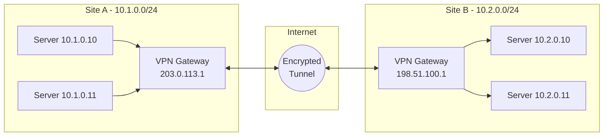
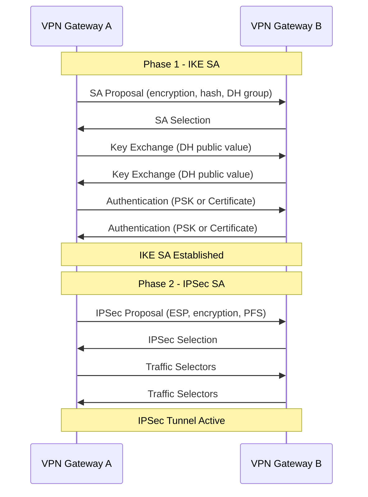
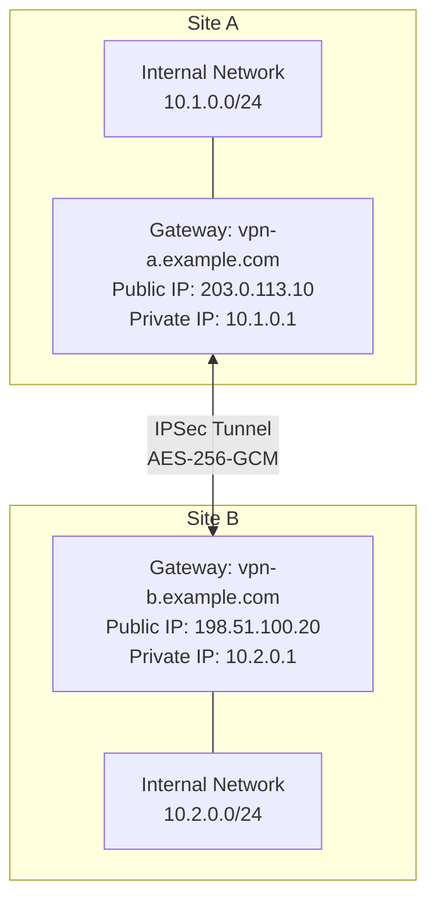
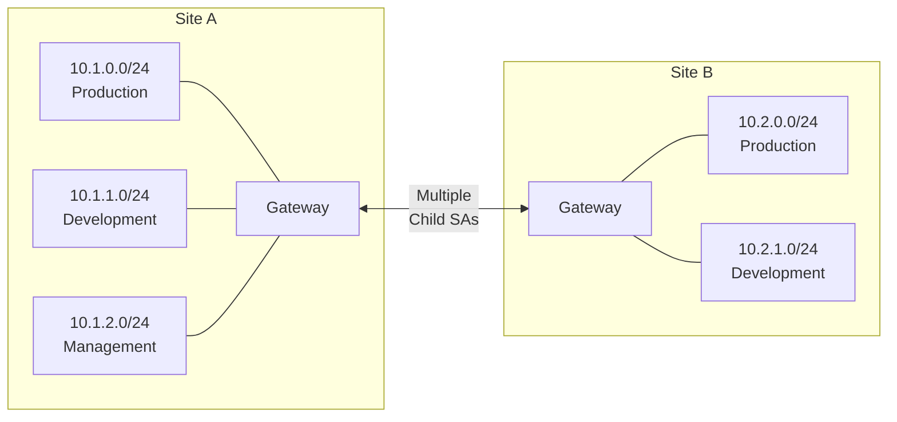
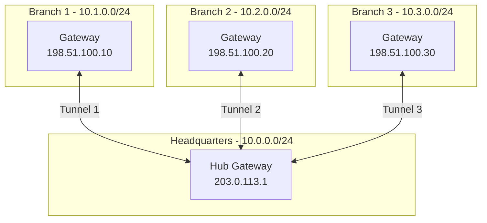
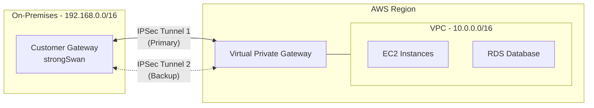
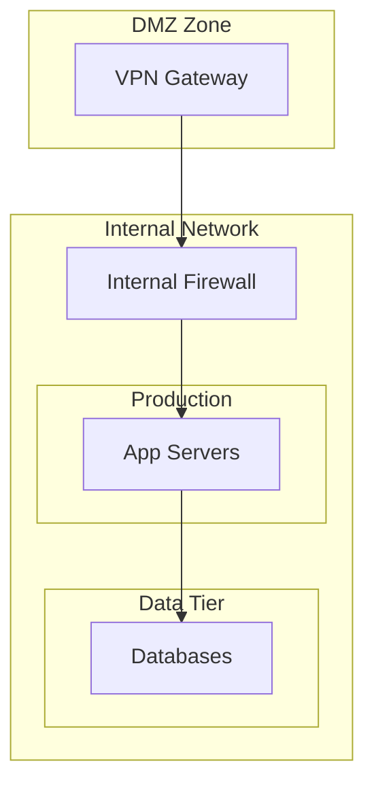

# How to Build IPSec VPN Tunnels

Author: [nawazdhandala](https://github.com/nawazdhandala)

Tags: IPSec, VPN, Security, Networking

Description: A comprehensive guide to building secure IPSec VPN tunnels between sites, covering IKE phases, authentication methods, encryption algorithms, and practical configuration examples for Linux and cloud environments.

---

IPSec (Internet Protocol Security) is the gold standard for site-to-site VPN connectivity. Unlike SSL VPNs designed for individual users, IPSec tunnels create encrypted pathways between entire networks. This guide walks you through building production-ready IPSec tunnels.

## Understanding IPSec Architecture

IPSec operates at the network layer (Layer 3), encrypting IP packets before they traverse untrusted networks. It consists of two main protocols:

- **AH (Authentication Header)**: Provides integrity and authentication but no encryption
- **ESP (Encapsulating Security Payload)**: Provides encryption, integrity, and authentication

In practice, ESP is used almost exclusively because it provides encryption.



## IKE Phases Explained

IPSec uses IKE (Internet Key Exchange) to establish secure tunnels. This happens in two phases.

### Phase 1: IKE SA Establishment

Phase 1 creates a secure, authenticated channel between VPN peers. This channel is used to negotiate Phase 2 parameters.



### Phase 2: IPSec SA Establishment

Phase 2 negotiates the actual IPSec tunnel parameters. Multiple Phase 2 tunnels can exist within a single Phase 1 SA.

**Key Phase 1 Parameters:**
- Encryption Algorithm (AES-256, AES-128)
- Hash Algorithm (SHA-256, SHA-384, SHA-512)
- Diffie-Hellman Group (14, 19, 20, 21)
- Authentication Method (PSK, RSA, ECDSA)
- SA Lifetime (typically 86400 seconds)

**Key Phase 2 Parameters:**
- ESP Encryption (AES-256-GCM, AES-256-CBC)
- ESP Integrity (SHA-256, SHA-384)
- PFS Group (same as Phase 1 DH group)
- SA Lifetime (typically 3600 seconds)

## Setting Up IPSec with strongSwan

strongSwan is the most widely used open-source IPSec implementation. Let's build a site-to-site tunnel.

### Installation

```bash
# Debian/Ubuntu
sudo apt update
sudo apt install strongswan strongswan-pki libcharon-extra-plugins

# RHEL/CentOS/Rocky
sudo dnf install epel-release
sudo dnf install strongswan

# Verify installation
ipsec version
```

### Network Topology

We'll configure this topology:



### Site A Configuration

Create the main configuration file:

```bash
# /etc/ipsec.conf on Site A (203.0.113.10)
config setup
    charondebug="ike 2, knl 2, cfg 2, net 2, esp 2, dmn 2, mgr 2"
    uniqueids=yes
    strictcrlpolicy=no

conn %default
    ikelifetime=86400s
    keylife=3600s
    rekeymargin=3m
    keyingtries=3
    keyexchange=ikev2
    authby=secret
    ike=aes256-sha256-modp2048!
    esp=aes256gcm16-modp2048!

conn site-to-site
    left=203.0.113.10
    leftsubnet=10.1.0.0/24
    leftid=@vpn-a.example.com
    right=198.51.100.20
    rightsubnet=10.2.0.0/24
    rightid=@vpn-b.example.com
    auto=start
    dpdaction=restart
    dpddelay=30s
    dpdtimeout=120s
```

Configure the pre-shared key:

```bash
# /etc/ipsec.secrets on Site A
@vpn-a.example.com @vpn-b.example.com : PSK "YourSuperSecretPreSharedKey123!@#"
```

### Site B Configuration

```bash
# /etc/ipsec.conf on Site B (198.51.100.20)
config setup
    charondebug="ike 2, knl 2, cfg 2, net 2, esp 2, dmn 2, mgr 2"
    uniqueids=yes
    strictcrlpolicy=no

conn %default
    ikelifetime=86400s
    keylife=3600s
    rekeymargin=3m
    keyingtries=3
    keyexchange=ikev2
    authby=secret
    ike=aes256-sha256-modp2048!
    esp=aes256gcm16-modp2048!

conn site-to-site
    left=198.51.100.20
    leftsubnet=10.2.0.0/24
    leftid=@vpn-b.example.com
    right=203.0.113.10
    rightsubnet=10.1.0.0/24
    rightid=@vpn-a.example.com
    auto=start
    dpdaction=restart
    dpddelay=30s
    dpdtimeout=120s
```

```bash
# /etc/ipsec.secrets on Site B
@vpn-b.example.com @vpn-a.example.com : PSK "YourSuperSecretPreSharedKey123!@#"
```

### Firewall Configuration

IPSec requires specific ports and protocols:

```bash
# Using iptables
# Allow IKE negotiation (UDP 500)
sudo iptables -A INPUT -p udp --dport 500 -j ACCEPT
sudo iptables -A OUTPUT -p udp --dport 500 -j ACCEPT

# Allow NAT-Traversal (UDP 4500)
sudo iptables -A INPUT -p udp --dport 4500 -j ACCEPT
sudo iptables -A OUTPUT -p udp --dport 4500 -j ACCEPT

# Allow ESP protocol
sudo iptables -A INPUT -p esp -j ACCEPT
sudo iptables -A OUTPUT -p esp -j ACCEPT

# Allow forwarding between tunnel interfaces
sudo iptables -A FORWARD -i eth0 -o eth0 -m policy --pol ipsec --dir in -j ACCEPT
sudo iptables -A FORWARD -i eth0 -o eth0 -m policy --pol ipsec --dir out -j ACCEPT

# Save rules
sudo iptables-save > /etc/iptables/rules.v4
```

Using firewalld:

```bash
sudo firewall-cmd --permanent --add-service=ipsec
sudo firewall-cmd --permanent --add-port=500/udp
sudo firewall-cmd --permanent --add-port=4500/udp
sudo firewall-cmd --reload
```

### Enable IP Forwarding

```bash
# Enable immediately
sudo sysctl -w net.ipv4.ip_forward=1

# Make permanent
echo "net.ipv4.ip_forward = 1" | sudo tee -a /etc/sysctl.d/99-ipsec.conf

# Disable rp_filter for IPSec
echo "net.ipv4.conf.all.rp_filter = 0" | sudo tee -a /etc/sysctl.d/99-ipsec.conf
echo "net.ipv4.conf.default.rp_filter = 0" | sudo tee -a /etc/sysctl.d/99-ipsec.conf

sudo sysctl -p /etc/sysctl.d/99-ipsec.conf
```

### Start the Tunnel

```bash
# Restart strongSwan
sudo systemctl restart strongswan-starter

# Or reload configuration
sudo ipsec reload

# Manually initiate connection
sudo ipsec up site-to-site

# Check status
sudo ipsec status
sudo ipsec statusall
```

## Certificate-Based Authentication

Pre-shared keys work but certificates are more secure and manageable at scale.

### Generate CA and Certificates

```bash
# Create directory structure
mkdir -p ~/pki/{cacerts,certs,private}
chmod 700 ~/pki

# Generate CA private key
ipsec pki --gen --type rsa --size 4096 --outform pem > ~/pki/private/ca-key.pem

# Generate CA certificate
ipsec pki --self --ca --lifetime 3650 \
    --in ~/pki/private/ca-key.pem \
    --type rsa --dn "CN=VPN Root CA" \
    --outform pem > ~/pki/cacerts/ca-cert.pem

# Generate Site A private key
ipsec pki --gen --type rsa --size 4096 --outform pem > ~/pki/private/site-a-key.pem

# Generate Site A certificate
ipsec pki --pub --in ~/pki/private/site-a-key.pem --type rsa | \
    ipsec pki --issue --lifetime 730 \
    --cacert ~/pki/cacerts/ca-cert.pem \
    --cakey ~/pki/private/ca-key.pem \
    --dn "CN=vpn-a.example.com" \
    --san vpn-a.example.com \
    --san @vpn-a.example.com \
    --san 203.0.113.10 \
    --flag serverAuth --flag ikeIntermediate \
    --outform pem > ~/pki/certs/site-a-cert.pem

# Generate Site B private key
ipsec pki --gen --type rsa --size 4096 --outform pem > ~/pki/private/site-b-key.pem

# Generate Site B certificate
ipsec pki --pub --in ~/pki/private/site-b-key.pem --type rsa | \
    ipsec pki --issue --lifetime 730 \
    --cacert ~/pki/cacerts/ca-cert.pem \
    --cakey ~/pki/private/ca-key.pem \
    --dn "CN=vpn-b.example.com" \
    --san vpn-b.example.com \
    --san @vpn-b.example.com \
    --san 198.51.100.20 \
    --flag serverAuth --flag ikeIntermediate \
    --outform pem > ~/pki/certs/site-b-cert.pem
```

### Install Certificates

```bash
# On Site A
sudo cp ~/pki/cacerts/ca-cert.pem /etc/ipsec.d/cacerts/
sudo cp ~/pki/certs/site-a-cert.pem /etc/ipsec.d/certs/
sudo cp ~/pki/private/site-a-key.pem /etc/ipsec.d/private/
sudo chmod 600 /etc/ipsec.d/private/site-a-key.pem

# On Site B
sudo cp ~/pki/cacerts/ca-cert.pem /etc/ipsec.d/cacerts/
sudo cp ~/pki/certs/site-b-cert.pem /etc/ipsec.d/certs/
sudo cp ~/pki/private/site-b-key.pem /etc/ipsec.d/private/
sudo chmod 600 /etc/ipsec.d/private/site-b-key.pem
```

### Certificate-Based Configuration

```bash
# /etc/ipsec.conf on Site A (certificate auth)
conn site-to-site-certs
    left=203.0.113.10
    leftsubnet=10.1.0.0/24
    leftcert=site-a-cert.pem
    leftid=@vpn-a.example.com
    right=198.51.100.20
    rightsubnet=10.2.0.0/24
    rightid=@vpn-b.example.com
    auto=start
    keyexchange=ikev2
    ike=aes256-sha256-modp2048!
    esp=aes256gcm16-modp2048!
```

```bash
# /etc/ipsec.secrets on Site A (certificate auth)
: RSA site-a-key.pem
```

## Multi-Subnet Tunnels

Real networks often have multiple subnets. Here's how to handle them:



### Configuration for Multiple Subnets

```bash
# /etc/ipsec.conf with multiple subnets
conn multi-subnet-tunnel
    left=203.0.113.10
    leftsubnet=10.1.0.0/24,10.1.1.0/24,10.1.2.0/24
    leftid=@vpn-a.example.com
    right=198.51.100.20
    rightsubnet=10.2.0.0/24,10.2.1.0/24
    rightid=@vpn-b.example.com
    auto=start
    keyexchange=ikev2
    authby=secret
    ike=aes256-sha256-modp2048!
    esp=aes256gcm16-modp2048!
```

For more granular control, create separate connections:

```bash
conn prod-to-prod
    also=base-config
    leftsubnet=10.1.0.0/24
    rightsubnet=10.2.0.0/24
    auto=start

conn dev-to-dev
    also=base-config
    leftsubnet=10.1.1.0/24
    rightsubnet=10.2.1.0/24
    auto=start

conn base-config
    left=203.0.113.10
    leftid=@vpn-a.example.com
    right=198.51.100.20
    rightid=@vpn-b.example.com
    keyexchange=ikev2
    authby=secret
    ike=aes256-sha256-modp2048!
    esp=aes256gcm16-modp2048!
```

## Hub and Spoke Topology

For connecting multiple branch offices to a central hub:



### Hub Configuration

```bash
# /etc/ipsec.conf on Hub
config setup
    charondebug="ike 1, knl 1, cfg 1"

conn %default
    keyexchange=ikev2
    ike=aes256-sha256-modp2048!
    esp=aes256gcm16-modp2048!
    dpdaction=restart
    dpddelay=30s
    auto=add

conn branch1
    left=203.0.113.1
    leftsubnet=10.0.0.0/24
    leftid=@hub.example.com
    right=198.51.100.10
    rightsubnet=10.1.0.0/24
    rightid=@branch1.example.com
    authby=secret

conn branch2
    left=203.0.113.1
    leftsubnet=10.0.0.0/24
    leftid=@hub.example.com
    right=198.51.100.20
    rightsubnet=10.2.0.0/24
    rightid=@branch2.example.com
    authby=secret

conn branch3
    left=203.0.113.1
    leftsubnet=10.0.0.0/24
    leftid=@hub.example.com
    right=198.51.100.30
    rightsubnet=10.3.0.0/24
    rightid=@branch3.example.com
    authby=secret
```

## AWS VPN Gateway Integration

Connecting your on-premises network to AWS VPC:



### strongSwan Configuration for AWS

AWS provides two tunnel endpoints for redundancy. Configure both:

```bash
# /etc/ipsec.conf for AWS VPN
config setup
    charondebug="ike 2, knl 2, cfg 2"

conn %default
    keyexchange=ikev2
    ike=aes256-sha256-modp2048!
    esp=aes256-sha256-modp2048!
    ikelifetime=28800s
    keylife=3600s
    rekeymargin=3m
    keyingtries=3
    installpolicy=yes
    dpdaction=restart
    dpddelay=10s
    dpdtimeout=30s

conn aws-tunnel1
    left=%defaultroute
    leftsubnet=192.168.0.0/16
    leftid=YOUR_PUBLIC_IP
    right=AWS_TUNNEL1_OUTSIDE_IP
    rightsubnet=10.0.0.0/16
    rightid=AWS_TUNNEL1_OUTSIDE_IP
    authby=secret
    auto=start
    mark=100

conn aws-tunnel2
    left=%defaultroute
    leftsubnet=192.168.0.0/16
    leftid=YOUR_PUBLIC_IP
    right=AWS_TUNNEL2_OUTSIDE_IP
    rightsubnet=10.0.0.0/16
    rightid=AWS_TUNNEL2_OUTSIDE_IP
    authby=secret
    auto=start
    mark=200
```

```bash
# /etc/ipsec.secrets for AWS
YOUR_PUBLIC_IP AWS_TUNNEL1_OUTSIDE_IP : PSK "aws-provided-psk-tunnel1"
YOUR_PUBLIC_IP AWS_TUNNEL2_OUTSIDE_IP : PSK "aws-provided-psk-tunnel2"
```

### AWS-Specific Routing

```bash
# Add routes for AWS VPC
sudo ip route add 10.0.0.0/16 via AWS_TUNNEL1_INSIDE_IP metric 100
sudo ip route add 10.0.0.0/16 via AWS_TUNNEL2_INSIDE_IP metric 200

# Or use BGP with VTI interfaces for dynamic routing
```

## Monitoring and Troubleshooting

### Essential Commands

```bash
# Check tunnel status
sudo ipsec status
sudo ipsec statusall

# View security associations
sudo ip xfrm state
sudo ip xfrm policy

# Monitor IKE daemon logs
sudo journalctl -u strongswan -f

# Test connectivity through tunnel
ping -c 4 10.2.0.10

# Trace packet path
sudo tcpdump -i eth0 esp or udp port 500 or udp port 4500
```

### Common Issues and Solutions

**Tunnel not establishing:**

```bash
# Check IKE negotiation
sudo ipsec status
# Look for "CONNECTING" or error states

# Verify peer is reachable
ping PEER_PUBLIC_IP

# Check firewall rules
sudo iptables -L -n | grep -E "500|4500|esp"

# Review logs for specific errors
sudo journalctl -u strongswan --since "5 minutes ago" | grep -i error
```

**Tunnel established but no traffic:**

```bash
# Check routing table
ip route show | grep 10.2.0

# Verify IPSec policies
sudo ip xfrm policy

# Check for NAT issues
sudo iptables -t nat -L -n

# Test with specific source
ping -I 10.1.0.10 10.2.0.10
```

**Intermittent disconnections:**

```bash
# Check DPD settings
# Increase dpddelay and dpdtimeout if on unreliable links

# Monitor rekey events
sudo journalctl -u strongswan | grep -i rekey

# Check for MTU issues
ping -M do -s 1400 PEER_INTERNAL_IP
```

### Health Check Script

```bash
#!/bin/bash
# ipsec-health-check.sh

PEER_INTERNAL_IP="10.2.0.1"
ALERT_EMAIL="admin@example.com"

check_tunnel() {
    ipsec status site-to-site | grep -q "ESTABLISHED"
    return $?
}

check_connectivity() {
    ping -c 3 -W 5 $PEER_INTERNAL_IP > /dev/null 2>&1
    return $?
}

if ! check_tunnel; then
    echo "$(date): Tunnel not established, attempting restart"
    ipsec down site-to-site
    sleep 2
    ipsec up site-to-site
    sleep 10

    if ! check_tunnel; then
        echo "Tunnel failed to establish" | mail -s "IPSec Alert" $ALERT_EMAIL
    fi
fi

if check_tunnel && ! check_connectivity; then
    echo "$(date): Tunnel up but no connectivity"
    echo "Tunnel established but ping failed" | mail -s "IPSec Alert" $ALERT_EMAIL
fi
```

### Prometheus Metrics

Export IPSec metrics for monitoring:

```bash
#!/bin/bash
# ipsec-exporter.sh - Run with node_exporter textfile collector

METRICS_FILE="/var/lib/node_exporter/textfile_collector/ipsec.prom"

# Get tunnel status
ESTABLISHED=$(ipsec status | grep -c "ESTABLISHED")
CONNECTING=$(ipsec status | grep -c "CONNECTING")
INSTALLED=$(ipsec status | grep -c "INSTALLED")

cat > $METRICS_FILE << EOF
# HELP ipsec_tunnels_established Number of established IPSec tunnels
# TYPE ipsec_tunnels_established gauge
ipsec_tunnels_established $ESTABLISHED

# HELP ipsec_tunnels_connecting Number of connecting IPSec tunnels
# TYPE ipsec_tunnels_connecting gauge
ipsec_tunnels_connecting $CONNECTING

# HELP ipsec_sas_installed Number of installed Security Associations
# TYPE ipsec_sas_installed gauge
ipsec_sas_installed $INSTALLED
EOF
```

## Security Best Practices

### Strong Cryptographic Settings

```bash
# Modern IKEv2 configuration (2024+)
ike=aes256gcm16-sha384-ecp384!
esp=aes256gcm16-ecp384!

# Avoid these deprecated algorithms:
# - 3DES (slow, small block size)
# - MD5, SHA1 (cryptographically weak)
# - DH groups 1, 2, 5 (too small)
```

### Perfect Forward Secrecy

Always enable PFS to ensure past sessions remain secure if long-term keys are compromised:

```bash
# Enable PFS in Phase 2
esp=aes256gcm16-modp2048!
# The modp2048 (or ecp384) enables PFS
```

### Secrets Management

```bash
# Never hardcode secrets in configs
# Use environment variables or secrets manager

# Generate strong PSK
openssl rand -base64 48

# Restrict secrets file permissions
sudo chmod 600 /etc/ipsec.secrets
sudo chown root:root /etc/ipsec.secrets
```

### Network Segmentation



Place VPN gateways in a DMZ and use internal firewalls to control traffic flow.

## Automation with Ansible

Automate IPSec deployments:

```yaml
# ipsec-tunnel.yml
---
- name: Configure IPSec VPN Tunnel
  hosts: vpn_gateways
  become: yes
  vars_files:
    - vault/ipsec-secrets.yml

  tasks:
    - name: Install strongSwan
      package:
        name: strongswan
        state: present

    - name: Configure ipsec.conf
      template:
        src: templates/ipsec.conf.j2
        dest: /etc/ipsec.conf
        owner: root
        group: root
        mode: '0644'
      notify: Restart strongSwan

    - name: Configure ipsec.secrets
      template:
        src: templates/ipsec.secrets.j2
        dest: /etc/ipsec.secrets
        owner: root
        group: root
        mode: '0600'
      notify: Restart strongSwan

    - name: Enable IP forwarding
      sysctl:
        name: net.ipv4.ip_forward
        value: '1'
        sysctl_set: yes
        state: present
        reload: yes

    - name: Configure firewall for IPSec
      firewalld:
        service: ipsec
        permanent: yes
        state: enabled

  handlers:
    - name: Restart strongSwan
      service:
        name: strongswan
        state: restarted
```

```jinja2
{# templates/ipsec.conf.j2 #}
config setup
    charondebug="ike 1, knl 1, cfg 1"

conn %default
    keyexchange=ikev2
    ike={{ ipsec_ike_algorithms }}
    esp={{ ipsec_esp_algorithms }}
    dpdaction=restart
    dpddelay=30s
    auto=start

conn {{ tunnel_name }}
    left={{ ansible_default_ipv4.address }}
    leftsubnet={{ local_subnet }}
    leftid=@{{ inventory_hostname }}
    right={{ peer_address }}
    rightsubnet={{ remote_subnet }}
    rightid=@{{ peer_id }}
    authby=secret
```

---

IPSec VPN tunnels provide enterprise-grade encryption for site-to-site connectivity. Start with pre-shared keys for simplicity, then migrate to certificates for production deployments. Monitor your tunnels actively, automate configuration management, and always use modern cryptographic algorithms. With proper setup, IPSec tunnels provide reliable, secure connectivity that can last for years.
