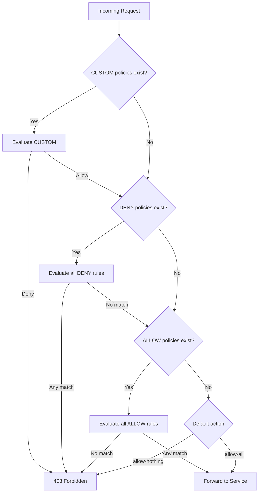
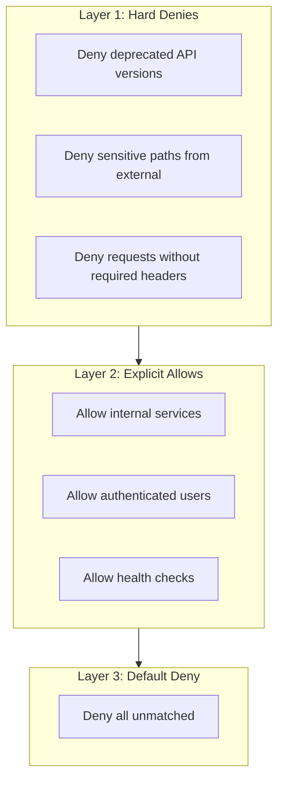

# How to Implement Istio AuthorizationPolicy Advanced

Author: [nawazdhandala](https://github.com/nawazdhandala)

Tags: Istio, Service Mesh, Security, Authorization

Description: Deep dive into advanced Istio AuthorizationPolicy patterns including complex conditions, nested principals, deny-first strategies, and multi-layer policy evaluation.

---

Basic AuthorizationPolicy rules get you started, but production environments demand more. This guide covers advanced patterns that handle real-world complexity: multi-condition rules, deny-first architectures, request attribute matching, and debugging policy conflicts.

## Policy Evaluation Deep Dive

Understanding how Istio evaluates multiple policies is critical when you have dozens of rules across namespaces.



Key points:
- DENY policies short-circuit evaluation. A single DENY match rejects the request immediately.
- ALLOW policies require at least one match when any ALLOW policy exists for the workload.
- No ALLOW policies means implicit allow (unless you have a default-deny in place).

## Source Principals: Beyond Service Accounts

The `principals` field accepts more than just service account identities. You can match on SPIFFE IDs, namespaces with wildcards, and negation patterns.

### Wildcard Principal Matching

Match all service accounts from a namespace pattern:

```yaml
apiVersion: security.istio.io/v1
kind: AuthorizationPolicy
metadata:
  name: allow-team-services
  namespace: api-gateway
spec:
  selector:
    matchLabels:
      app: gateway
  action: ALLOW
  rules:
    - from:
        - source:
            # Match any service account from namespaces starting with team-
            principals:
              - "cluster.local/ns/team-*/sa/*"
```

### Combining Principals with Negation

Allow all principals except specific ones:

```yaml
apiVersion: security.istio.io/v1
kind: AuthorizationPolicy
metadata:
  name: deny-legacy-services
  namespace: production
spec:
  selector:
    matchLabels:
      app: user-service
  action: DENY
  rules:
    - from:
        - source:
            # Block requests from deprecated services
            principals:
              - "cluster.local/ns/legacy/sa/*"
              - "cluster.local/ns/deprecated/sa/*"
    - from:
        - source:
            # Also block services without mTLS identity
            notPrincipals:
              - "*"
```

The second rule with `notPrincipals: ["*"]` catches requests where no principal could be determined, which happens when mTLS is not established.

### Request Principals for JWT Identity

When using JWT authentication, `requestPrincipals` contains the `iss/sub` from the token:

```yaml
apiVersion: security.istio.io/v1
kind: AuthorizationPolicy
metadata:
  name: allow-specific-users
  namespace: sensitive-data
spec:
  selector:
    matchLabels:
      app: data-export
  action: ALLOW
  rules:
    - from:
        - source:
            # Format: <issuer>/<subject>
            requestPrincipals:
              - "https://auth.company.com/admin@company.com"
              - "https://auth.company.com/export-bot@company.com"
```

## Advanced Path and Method Matching

### Path Patterns with Exclusions

Allow access to most paths but exclude sensitive ones:

```yaml
apiVersion: security.istio.io/v1
kind: AuthorizationPolicy
metadata:
  name: public-api-access
  namespace: api
spec:
  selector:
    matchLabels:
      app: public-api
  action: ALLOW
  rules:
    - from:
        - source:
            namespaces: ["frontend"]
      to:
        - operation:
            methods: ["GET", "POST"]
            paths:
              - "/api/v1/*"
              - "/api/v2/*"
            notPaths:
              - "/api/v1/admin/*"
              - "/api/v2/admin/*"
              - "/api/*/internal/*"
              - "*/debug"
              - "*/metrics"
```

### Method-Specific Path Rules

Different methods require different permissions:

```yaml
apiVersion: security.istio.io/v1
kind: AuthorizationPolicy
metadata:
  name: crud-permissions
  namespace: inventory
spec:
  selector:
    matchLabels:
      app: inventory-service
  action: ALLOW
  rules:
    # Read access for all authenticated services
    - from:
        - source:
            principals: ["*"]
      to:
        - operation:
            methods: ["GET", "HEAD", "OPTIONS"]
            paths: ["/inventory/*"]

    # Write access only from order service
    - from:
        - source:
            principals:
              - "cluster.local/ns/orders/sa/order-processor"
      to:
        - operation:
            methods: ["POST", "PUT", "PATCH"]
            paths: ["/inventory/*"]

    # Delete access only from admin service
    - from:
        - source:
            principals:
              - "cluster.local/ns/admin/sa/inventory-admin"
      to:
        - operation:
            methods: ["DELETE"]
            paths: ["/inventory/*"]
```

## Condition-Based Authorization

The `when` clause enables matching on request attributes beyond source and operation.

### Header-Based Conditions

Require specific headers for access:

```yaml
apiVersion: security.istio.io/v1
kind: AuthorizationPolicy
metadata:
  name: require-trace-header
  namespace: production
spec:
  selector:
    matchLabels:
      app: order-service
  action: ALLOW
  rules:
    - from:
        - source:
            namespaces: ["production"]
      to:
        - operation:
            paths: ["/orders/*"]
      when:
        # Require tracing header for observability
        - key: request.headers[x-request-id]
          notValues: [""]
        # Require API version header
        - key: request.headers[x-api-version]
          values: ["2024-01", "2024-06", "2025-01"]
```

### IP-Based Conditions

Restrict access based on source IP:

```yaml
apiVersion: security.istio.io/v1
kind: AuthorizationPolicy
metadata:
  name: restrict-by-ip
  namespace: admin
spec:
  selector:
    matchLabels:
      app: admin-console
  action: ALLOW
  rules:
    - from:
        - source:
            # Allow from specific IP ranges
            ipBlocks:
              - "10.0.0.0/8"      # Internal network
              - "172.16.0.0/12"   # VPN range
            notIpBlocks:
              - "10.0.99.0/24"   # Exclude compromised subnet
      when:
        # Additional check: require specific header from load balancer
        - key: request.headers[x-forwarded-for]
          notValues: [""]
```

### JWT Claim Conditions

Complex authorization based on JWT claims:

```yaml
apiVersion: security.istio.io/v1
kind: AuthorizationPolicy
metadata:
  name: tenant-isolation
  namespace: saas-platform
spec:
  selector:
    matchLabels:
      app: tenant-api
  action: ALLOW
  rules:
    - from:
        - source:
            requestPrincipals: ["https://auth.saas.com/*"]
      to:
        - operation:
            paths: ["/api/tenant/*"]
      when:
        # Require verified email
        - key: request.auth.claims[email_verified]
          values: ["true"]
        # Require active subscription
        - key: request.auth.claims[subscription_status]
          values: ["active", "trial"]
        # Require specific tenant scope
        - key: request.auth.claims[scope]
          values: ["tenant:read", "tenant:write", "tenant:admin"]
```

### Multiple Condition Groups

All conditions within a `when` block use AND logic. For OR logic, use multiple rules:

```yaml
apiVersion: security.istio.io/v1
kind: AuthorizationPolicy
metadata:
  name: flexible-access
  namespace: api
spec:
  selector:
    matchLabels:
      app: data-api
  action: ALLOW
  rules:
    # Rule 1: Internal services with service mesh identity
    - from:
        - source:
            principals:
              - "cluster.local/ns/backend/sa/*"
      when:
        - key: request.headers[x-internal]
          values: ["true"]

    # Rule 2: External users with valid JWT and premium tier
    - from:
        - source:
            requestPrincipals: ["*"]
      when:
        - key: request.auth.claims[tier]
          values: ["premium", "enterprise"]

    # Rule 3: Specific IP ranges for legacy systems
    - from:
        - source:
            ipBlocks: ["192.168.100.0/24"]
      when:
        - key: request.headers[x-legacy-auth]
          notValues: [""]
```

## Deny Rules: Defense in Depth

DENY policies create hard boundaries that ALLOW policies cannot override.

### Deny-First Architecture



### Protecting Sensitive Endpoints

```yaml
apiVersion: security.istio.io/v1
kind: AuthorizationPolicy
metadata:
  name: protect-pii-endpoints
  namespace: user-data
spec:
  selector:
    matchLabels:
      app: user-service
  action: DENY
  rules:
    # Deny PII access from non-approved services
    - from:
        - source:
            notPrincipals:
              - "cluster.local/ns/gdpr/sa/data-processor"
              - "cluster.local/ns/compliance/sa/auditor"
      to:
        - operation:
            paths:
              - "/users/*/pii"
              - "/users/*/ssn"
              - "/users/*/financial"

    # Deny bulk export from any service
    - to:
        - operation:
            paths: ["/users/export", "/users/bulk/*"]
      when:
        # Unless explicitly authorized with audit header
        - key: request.headers[x-audit-approval]
          notValues: ["approved"]
```

### Blocking Deprecated Features

```yaml
apiVersion: security.istio.io/v1
kind: AuthorizationPolicy
metadata:
  name: block-deprecated
  namespace: api
spec:
  action: DENY
  rules:
    # Block v1 API after deprecation date
    - to:
        - operation:
            paths: ["/api/v1/*"]
      when:
        - key: request.headers[x-allow-deprecated]
          notValues: ["true"]

    # Block legacy authentication method
    - when:
        - key: request.headers[authorization]
          values: ["Basic *"]

    # Block requests with known vulnerable user agents
    - when:
        - key: request.headers[user-agent]
          values:
            - "vulnerable-client/1.0"
            - "legacy-sdk/*"
```

## Multi-Namespace Policy Architecture

### Mesh-Wide Baseline

Apply security baselines across the entire mesh:

```yaml
# In istio-system namespace for mesh-wide effect
apiVersion: security.istio.io/v1
kind: AuthorizationPolicy
metadata:
  name: mesh-baseline-deny
  namespace: istio-system
spec:
  # No selector = applies to all workloads
  action: DENY
  rules:
    # Block requests to debug endpoints mesh-wide
    - to:
        - operation:
            paths:
              - "/debug/*"
              - "/actuator/*"
              - "/.well-known/admin/*"

    # Block requests without any identity
    - from:
        - source:
            notPrincipals: ["*"]
            notRequestPrincipals: ["*"]
      to:
        - operation:
            notPaths:
              - "/health"
              - "/ready"
              - "/live"
```

### Namespace Defaults with Overrides

```yaml
# Default deny for production namespace
apiVersion: security.istio.io/v1
kind: AuthorizationPolicy
metadata:
  name: default-deny
  namespace: production
spec: {}

---
# Allow health checks globally in namespace
apiVersion: security.istio.io/v1
kind: AuthorizationPolicy
metadata:
  name: allow-health
  namespace: production
spec:
  action: ALLOW
  rules:
    - to:
        - operation:
            methods: ["GET"]
            paths: ["/health", "/ready", "/live", "/healthz", "/readyz"]

---
# Allow intra-namespace communication
apiVersion: security.istio.io/v1
kind: AuthorizationPolicy
metadata:
  name: allow-same-namespace
  namespace: production
spec:
  action: ALLOW
  rules:
    - from:
        - source:
            namespaces: ["production"]

---
# Workload-specific override: allow monitoring
apiVersion: security.istio.io/v1
kind: AuthorizationPolicy
metadata:
  name: allow-metrics-scrape
  namespace: production
spec:
  selector:
    matchLabels:
      metrics: enabled
  action: ALLOW
  rules:
    - from:
        - source:
            namespaces: ["monitoring"]
      to:
        - operation:
            methods: ["GET"]
            paths: ["/metrics", "/prometheus"]
```

## External Authorization Integration

For authorization logic too complex for declarative policies, delegate to an external service.

### OPA Integration

```yaml
# Configure OPA as external authorizer
apiVersion: install.istio.io/v1alpha1
kind: IstioOperator
spec:
  meshConfig:
    extensionProviders:
      - name: opa-ext-authz
        envoyExtAuthzGrpc:
          service: opa.opa-system.svc.cluster.local
          port: 9191
          includeRequestBodyInCheck:
            maxRequestBytes: 8192
            allowPartialMessage: true
          timeout: 3s

---
apiVersion: security.istio.io/v1
kind: AuthorizationPolicy
metadata:
  name: opa-check-orders
  namespace: orders
spec:
  selector:
    matchLabels:
      app: order-service
  action: CUSTOM
  provider:
    name: opa-ext-authz
  rules:
    - to:
        - operation:
            paths: ["/orders/*"]
            methods: ["POST", "PUT", "DELETE"]
```

### Cascading Authorization

Use CUSTOM for complex checks, then layer with DENY for hard blocks:

```yaml
# First: DENY policies catch known bad patterns
apiVersion: security.istio.io/v1
kind: AuthorizationPolicy
metadata:
  name: hard-deny
  namespace: payments
spec:
  selector:
    matchLabels:
      app: payment-gateway
  action: DENY
  rules:
    - from:
        - source:
            ipBlocks: ["0.0.0.0/0"]
            notIpBlocks: ["10.0.0.0/8", "172.16.0.0/12"]
      to:
        - operation:
            paths: ["/payments/process"]

---
# Then: CUSTOM delegates complex logic to external service
apiVersion: security.istio.io/v1
kind: AuthorizationPolicy
metadata:
  name: custom-payment-authz
  namespace: payments
spec:
  selector:
    matchLabels:
      app: payment-gateway
  action: CUSTOM
  provider:
    name: payment-authorizer
  rules:
    - to:
        - operation:
            paths: ["/payments/*"]

---
# Finally: ALLOW for simple cases external authz should not handle
apiVersion: security.istio.io/v1
kind: AuthorizationPolicy
metadata:
  name: allow-health
  namespace: payments
spec:
  selector:
    matchLabels:
      app: payment-gateway
  action: ALLOW
  rules:
    - to:
        - operation:
            paths: ["/health", "/ready"]
```

## Debugging Complex Policy Sets

### Trace Policy Evaluation

Enable RBAC debug logging:

```bash
# Set debug level for specific pod
kubectl exec -n production deploy/api-service -c istio-proxy -- \
  curl -X POST "localhost:15000/logging?rbac=debug"

# Watch authorization decisions
kubectl logs -n production deploy/api-service -c istio-proxy -f | \
  grep "rbac"
```

### Check Effective Policy

```bash
# List all policies that could affect a workload
istioctl x authz check deploy/api-service -n production

# Output shows:
# - Which policies are loaded
# - Whether they match the workload
# - Effective rules after merging
```

### Policy Conflict Detection

```bash
# Analyze for configuration issues
istioctl analyze -n production

# Common warnings:
# - Overlapping selectors
# - Conflicting ALLOW/DENY rules
# - Missing default deny
```

### Test Specific Requests

Create a test pod to verify policies:

```bash
# Deploy debug pod in the source namespace
kubectl run -n frontend debug --rm -it --image=curlimages/curl -- sh

# Test request with headers
curl -v -H "Authorization: Bearer $TOKEN" \
  -H "x-api-version: 2024-01" \
  http://api-service.production.svc.cluster.local/api/resource

# Check response codes:
# 200 = allowed
# 403 = denied by policy
# 401 = authentication failed (RequestAuthentication)
```

## Performance Considerations

### Policy Count Impact

Each AuthorizationPolicy adds rules to the Envoy RBAC filter. Large rule sets increase:
- Memory usage in the sidecar
- Request latency (microseconds per rule evaluation)
- Configuration push time from istiod

Recommendations:
- Consolidate rules where possible
- Use namespace-level policies over per-workload
- Prefer wildcards over exhaustive lists
- Limit use of `when` conditions on high-traffic paths

### Caching Behavior

Istio caches authorization decisions when possible. To maximize cache hits:
- Keep condition keys consistent
- Avoid matching on volatile headers
- Use `requestPrincipals` from JWT (cached after validation) over raw header matching

## Production Checklist

Before deploying authorization policies:

1. Start with AUDIT action to observe behavior without enforcement
2. Review istioctl analyze output for all namespaces
3. Verify health check paths are excluded from deny rules
4. Test with representative traffic patterns in staging
5. Monitor 403 error rates after deployment
6. Document policy intent in annotations
7. Set up alerts for authorization failure spikes

Authorization policies form the backbone of zero-trust in your service mesh. Layer them carefully: hard denies first, explicit allows second, and default deny as your baseline. Test thoroughly, because a misconfigured policy can bring down services faster than any outage.
