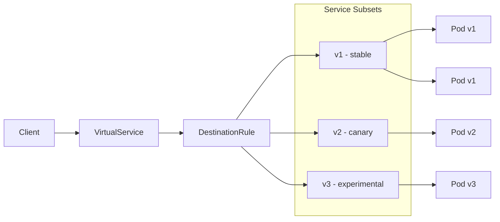
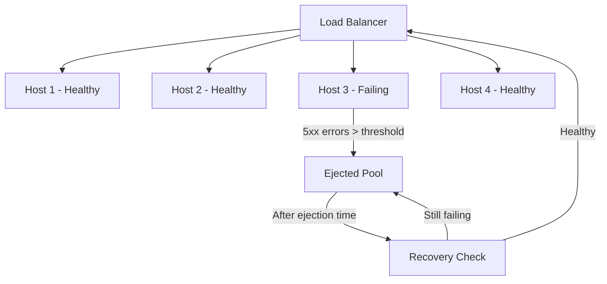
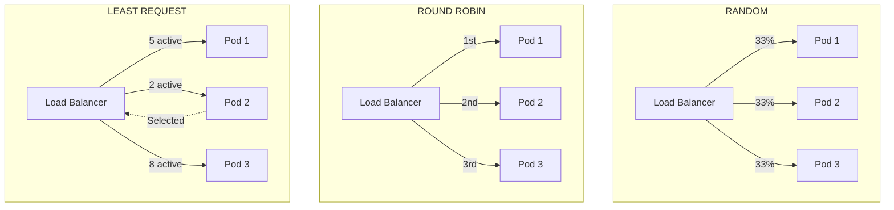
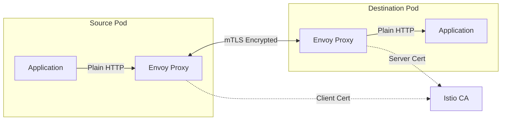

# How to Build Istio DestinationRule Advanced

Author: [nawazdhandala](https://github.com/nawazdhandala)

Tags: Istio, Kubernetes, ServiceMesh, LoadBalancing, TrafficManagement, mTLS

Description: Master advanced traffic policies, load balancing algorithms, and mutual TLS configuration using Istio DestinationRule for production service mesh deployments.

---

DestinationRule is where Istio's traffic management gets serious. While VirtualService controls how traffic is routed, DestinationRule defines what happens after routing decisions are made. It handles load balancing, connection pooling, outlier detection, and TLS settings for your service mesh.

## Understanding DestinationRule Architecture

DestinationRule applies configuration to traffic destined for a service after VirtualService routing occurs.



## Subset Definitions with Label Selectors

Subsets let you partition service endpoints based on pod labels. This enables canary deployments, A/B testing, and version-specific traffic policies.

### Basic Subset Configuration

```yaml
# Define subsets based on version labels
apiVersion: networking.istio.io/v1beta1
kind: DestinationRule
metadata:
  name: reviews-destination
  namespace: bookinfo
spec:
  host: reviews.bookinfo.svc.cluster.local
  subsets:
    # Stable production version
    - name: v1
      labels:
        version: v1
    # Canary release with new features
    - name: v2
      labels:
        version: v2
    # Experimental version for internal testing
    - name: v3
      labels:
        version: v3
```

### Multi-Label Subset Selectors

```yaml
# Target pods matching multiple labels
apiVersion: networking.istio.io/v1beta1
kind: DestinationRule
metadata:
  name: payment-service
  namespace: production
spec:
  host: payment.production.svc.cluster.local
  subsets:
    # High-priority payment processing pods
    - name: priority
      labels:
        app: payment
        tier: premium
        region: us-east
    # Standard processing pods
    - name: standard
      labels:
        app: payment
        tier: standard
    # Fallback pods for overflow
    - name: fallback
      labels:
        app: payment
        tier: fallback
```

### Subset with Traffic Policy Override

```yaml
# Each subset can have its own traffic policy
apiVersion: networking.istio.io/v1beta1
kind: DestinationRule
metadata:
  name: api-gateway
  namespace: production
spec:
  host: api-gateway.production.svc.cluster.local
  # Default traffic policy for all subsets
  trafficPolicy:
    connectionPool:
      tcp:
        maxConnections: 100
  subsets:
    - name: high-capacity
      labels:
        capacity: high
      # Override for high-capacity subset
      trafficPolicy:
        connectionPool:
          tcp:
            maxConnections: 1000
          http:
            h2UpgradePolicy: UPGRADE
    - name: standard
      labels:
        capacity: standard
      # Uses default traffic policy
```

## Traffic Policies: Connection Pool Settings

Connection pooling prevents your services from being overwhelmed and helps manage resource utilization.

### TCP Connection Pool

```yaml
apiVersion: networking.istio.io/v1beta1
kind: DestinationRule
metadata:
  name: database-pool
  namespace: production
spec:
  host: postgres.production.svc.cluster.local
  trafficPolicy:
    connectionPool:
      tcp:
        # Maximum number of TCP connections to the destination
        maxConnections: 100
        # TCP connection timeout in seconds
        connectTimeout: 30s
        # Time to keep idle connections alive
        tcpKeepalive:
          time: 7200s      # Start keepalive probes after 2 hours idle
          interval: 75s    # Send probes every 75 seconds
          probes: 10       # Close after 10 failed probes
```

### HTTP Connection Pool

```yaml
apiVersion: networking.istio.io/v1beta1
kind: DestinationRule
metadata:
  name: api-connection-pool
  namespace: production
spec:
  host: api.production.svc.cluster.local
  trafficPolicy:
    connectionPool:
      tcp:
        maxConnections: 1000
      http:
        # Maximum pending HTTP requests to a destination
        http1MaxPendingRequests: 1000
        # Maximum requests per connection (HTTP/1.1)
        http1MaxRequestsPerConnection: 100
        # Maximum concurrent HTTP/2 requests to a destination
        http2MaxRequests: 1000
        # Maximum retries that can be outstanding
        maxRetries: 3
        # Upgrade HTTP/1.1 to HTTP/2 when possible
        h2UpgradePolicy: UPGRADE
        # Idle timeout for upstream connections
        idleTimeout: 60s
```

### Combined Pool Configuration for High Traffic Services

```yaml
apiVersion: networking.istio.io/v1beta1
kind: DestinationRule
metadata:
  name: high-traffic-service
  namespace: production
spec:
  host: catalog.production.svc.cluster.local
  trafficPolicy:
    connectionPool:
      tcp:
        maxConnections: 5000
        connectTimeout: 10s
        tcpKeepalive:
          time: 300s
          interval: 30s
          probes: 5
      http:
        http1MaxPendingRequests: 5000
        http2MaxRequests: 10000
        maxRequestsPerConnection: 1000
        maxRetries: 5
        idleTimeout: 120s
        h2UpgradePolicy: UPGRADE
```

## Outlier Detection: Circuit Breaking

Outlier detection ejects unhealthy hosts from the load balancing pool, implementing circuit breaker patterns.



### Basic Outlier Detection

```yaml
apiVersion: networking.istio.io/v1beta1
kind: DestinationRule
metadata:
  name: reviews-outlier
  namespace: bookinfo
spec:
  host: reviews.bookinfo.svc.cluster.local
  trafficPolicy:
    outlierDetection:
      # Number of consecutive 5xx errors before ejection
      consecutive5xxErrors: 5
      # Time interval for error counting
      interval: 10s
      # Duration a host stays ejected
      baseEjectionTime: 30s
      # Maximum percentage of hosts that can be ejected
      maxEjectionPercent: 50
```

### Advanced Outlier Detection

```yaml
apiVersion: networking.istio.io/v1beta1
kind: DestinationRule
metadata:
  name: payment-circuit-breaker
  namespace: production
spec:
  host: payment.production.svc.cluster.local
  trafficPolicy:
    outlierDetection:
      # Consecutive gateway errors (502, 503, 504)
      consecutiveGatewayErrors: 3
      # Consecutive local origin failures (connection timeouts, TCP failures)
      consecutiveLocalOriginFailures: 5
      # General 5xx error threshold
      consecutive5xxErrors: 5
      # Scanning interval
      interval: 5s
      # Base ejection time (doubles with each ejection)
      baseEjectionTime: 30s
      # Maximum ejection time cap
      maxEjectionTime: 300s
      # Percentage of hosts that can be ejected
      maxEjectionPercent: 30
      # Minimum number of hosts to keep in rotation
      minHealthPercent: 50
      # Split external and local origin errors
      splitExternalLocalOriginErrors: true
```

### Outlier Detection with Subset Overrides

```yaml
apiVersion: networking.istio.io/v1beta1
kind: DestinationRule
metadata:
  name: api-resilience
  namespace: production
spec:
  host: api.production.svc.cluster.local
  # Default outlier detection
  trafficPolicy:
    outlierDetection:
      consecutive5xxErrors: 5
      interval: 10s
      baseEjectionTime: 30s
      maxEjectionPercent: 50
  subsets:
    - name: stable
      labels:
        version: stable
      # Stricter outlier detection for stable
      trafficPolicy:
        outlierDetection:
          consecutive5xxErrors: 3
          interval: 5s
          baseEjectionTime: 60s
          maxEjectionPercent: 30
    - name: canary
      labels:
        version: canary
      # More lenient for canary (expected failures)
      trafficPolicy:
        outlierDetection:
          consecutive5xxErrors: 10
          interval: 30s
          baseEjectionTime: 15s
          maxEjectionPercent: 100
```

## Load Balancing Algorithms

Istio supports multiple load balancing strategies to distribute traffic across service instances.



### RANDOM Load Balancing

```yaml
# Random selection distributes load evenly on average
apiVersion: networking.istio.io/v1beta1
kind: DestinationRule
metadata:
  name: random-lb
  namespace: production
spec:
  host: stateless-service.production.svc.cluster.local
  trafficPolicy:
    loadBalancer:
      simple: RANDOM
```

### ROUND_ROBIN Load Balancing

```yaml
# Sequential distribution across all healthy hosts
apiVersion: networking.istio.io/v1beta1
kind: DestinationRule
metadata:
  name: round-robin-lb
  namespace: production
spec:
  host: api.production.svc.cluster.local
  trafficPolicy:
    loadBalancer:
      simple: ROUND_ROBIN
```

### LEAST_REQUEST Load Balancing

```yaml
# Routes to host with fewest active requests
# Best for varying request durations
apiVersion: networking.istio.io/v1beta1
kind: DestinationRule
metadata:
  name: least-request-lb
  namespace: production
spec:
  host: compute-intensive.production.svc.cluster.local
  trafficPolicy:
    loadBalancer:
      simple: LEAST_REQUEST
```

### PASSTHROUGH Load Balancing

```yaml
# Let the destination service handle load balancing
# Useful for services with their own discovery
apiVersion: networking.istio.io/v1beta1
kind: DestinationRule
metadata:
  name: passthrough-lb
  namespace: production
spec:
  host: legacy-service.production.svc.cluster.local
  trafficPolicy:
    loadBalancer:
      simple: PASSTHROUGH
```

### Consistent Hash Load Balancing

```yaml
# Session affinity based on headers, cookies, or source IP
apiVersion: networking.istio.io/v1beta1
kind: DestinationRule
metadata:
  name: consistent-hash-lb
  namespace: production
spec:
  host: session-service.production.svc.cluster.local
  trafficPolicy:
    loadBalancer:
      consistentHash:
        # Hash based on HTTP header
        httpHeaderName: x-user-id
```

### Cookie-Based Session Affinity

```yaml
# Sticky sessions using cookies
apiVersion: networking.istio.io/v1beta1
kind: DestinationRule
metadata:
  name: cookie-affinity
  namespace: production
spec:
  host: web-app.production.svc.cluster.local
  trafficPolicy:
    loadBalancer:
      consistentHash:
        httpCookie:
          name: SERVERID
          # Cookie TTL
          ttl: 3600s
```

### Source IP Hash

```yaml
# Consistent routing based on client IP
apiVersion: networking.istio.io/v1beta1
kind: DestinationRule
metadata:
  name: source-ip-hash
  namespace: production
spec:
  host: cdn-origin.production.svc.cluster.local
  trafficPolicy:
    loadBalancer:
      consistentHash:
        useSourceIp: true
```

### Query Parameter Hash

```yaml
# Route based on query parameter for cache optimization
apiVersion: networking.istio.io/v1beta1
kind: DestinationRule
metadata:
  name: query-param-hash
  namespace: production
spec:
  host: search-service.production.svc.cluster.local
  trafficPolicy:
    loadBalancer:
      consistentHash:
        httpQueryParameterName: search_key
```

### Locality-Aware Load Balancing

```yaml
# Prefer local endpoints, failover to remote
apiVersion: networking.istio.io/v1beta1
kind: DestinationRule
metadata:
  name: locality-aware-lb
  namespace: production
spec:
  host: api.production.svc.cluster.local
  trafficPolicy:
    loadBalancer:
      localityLbSetting:
        enabled: true
        # Distribute remaining traffic when local is overloaded
        distribute:
          - from: us-east1/us-east1-a/*
            to:
              "us-east1/us-east1-a/*": 80
              "us-east1/us-east1-b/*": 20
          - from: us-east1/us-east1-b/*
            to:
              "us-east1/us-east1-b/*": 80
              "us-east1/us-east1-a/*": 20
        # Failover priority
        failover:
          - from: us-east1
            to: us-west1
          - from: us-west1
            to: eu-west1
    outlierDetection:
      consecutive5xxErrors: 5
      interval: 10s
      baseEjectionTime: 30s
```

## TLS Settings and Mutual TLS Configuration

Secure service-to-service communication with TLS and mTLS.



### ISTIO_MUTUAL TLS Mode

```yaml
# Automatic mTLS using Istio certificates
apiVersion: networking.istio.io/v1beta1
kind: DestinationRule
metadata:
  name: mtls-default
  namespace: production
spec:
  host: "*.production.svc.cluster.local"
  trafficPolicy:
    tls:
      # Uses Istio managed certificates
      mode: ISTIO_MUTUAL
```

### MUTUAL TLS with Custom Certificates

```yaml
# mTLS with your own certificates
apiVersion: networking.istio.io/v1beta1
kind: DestinationRule
metadata:
  name: custom-mtls
  namespace: production
spec:
  host: external-service.partner.com
  trafficPolicy:
    tls:
      mode: MUTUAL
      # Client certificate
      clientCertificate: /etc/certs/client.pem
      # Client private key
      privateKey: /etc/certs/client-key.pem
      # CA certificate to verify server
      caCertificates: /etc/certs/ca.pem
      # Expected server name in certificate
      sni: external-service.partner.com
```

### SIMPLE TLS Mode

```yaml
# One-way TLS (client verifies server only)
apiVersion: networking.istio.io/v1beta1
kind: DestinationRule
metadata:
  name: simple-tls
  namespace: production
spec:
  host: external-api.example.com
  trafficPolicy:
    tls:
      mode: SIMPLE
      # CA to verify external service certificate
      caCertificates: /etc/certs/external-ca.pem
      sni: external-api.example.com
```

### DISABLE TLS for Legacy Services

```yaml
# Disable TLS for legacy services that cannot support it
apiVersion: networking.istio.io/v1beta1
kind: DestinationRule
metadata:
  name: legacy-no-tls
  namespace: production
spec:
  host: legacy-service.production.svc.cluster.local
  trafficPolicy:
    tls:
      mode: DISABLE
```

### Port-Level TLS Configuration

```yaml
# Different TLS settings per port
apiVersion: networking.istio.io/v1beta1
kind: DestinationRule
metadata:
  name: multi-port-tls
  namespace: production
spec:
  host: multi-protocol-service.production.svc.cluster.local
  trafficPolicy:
    # Default TLS for all ports
    tls:
      mode: ISTIO_MUTUAL
    portLevelSettings:
      # HTTPS port
      - port:
          number: 443
        tls:
          mode: SIMPLE
          caCertificates: /etc/certs/ca.pem
      # gRPC port with mTLS
      - port:
          number: 9090
        tls:
          mode: ISTIO_MUTUAL
      # Metrics port without TLS
      - port:
          number: 9091
        tls:
          mode: DISABLE
```

### Subset-Specific TLS

```yaml
# Different TLS settings per subset
apiVersion: networking.istio.io/v1beta1
kind: DestinationRule
metadata:
  name: subset-tls
  namespace: production
spec:
  host: api.production.svc.cluster.local
  trafficPolicy:
    tls:
      mode: ISTIO_MUTUAL
  subsets:
    - name: internal
      labels:
        network: internal
      trafficPolicy:
        tls:
          mode: ISTIO_MUTUAL
    - name: external
      labels:
        network: external
      trafficPolicy:
        tls:
          mode: MUTUAL
          clientCertificate: /etc/certs/external-client.pem
          privateKey: /etc/certs/external-key.pem
          caCertificates: /etc/certs/external-ca.pem
```

## Complete Production Example

Here is a comprehensive DestinationRule combining all features for a production service.

```yaml
apiVersion: networking.istio.io/v1beta1
kind: DestinationRule
metadata:
  name: production-api-complete
  namespace: production
  labels:
    app: api
    team: platform
spec:
  host: api.production.svc.cluster.local

  # Global traffic policy
  trafficPolicy:
    # Connection pooling
    connectionPool:
      tcp:
        maxConnections: 1000
        connectTimeout: 10s
        tcpKeepalive:
          time: 300s
          interval: 30s
          probes: 5
      http:
        http1MaxPendingRequests: 1000
        http2MaxRequests: 2000
        maxRequestsPerConnection: 500
        maxRetries: 3
        idleTimeout: 60s
        h2UpgradePolicy: UPGRADE

    # Circuit breaker
    outlierDetection:
      consecutive5xxErrors: 5
      consecutiveGatewayErrors: 3
      interval: 10s
      baseEjectionTime: 30s
      maxEjectionTime: 300s
      maxEjectionPercent: 30
      minHealthPercent: 50
      splitExternalLocalOriginErrors: true

    # Load balancing with locality awareness
    loadBalancer:
      simple: LEAST_REQUEST
      localityLbSetting:
        enabled: true
        failover:
          - from: us-east1
            to: us-west1

    # mTLS encryption
    tls:
      mode: ISTIO_MUTUAL

  # Subset definitions
  subsets:
    # Stable production subset
    - name: stable
      labels:
        version: stable
        track: production
      trafficPolicy:
        connectionPool:
          tcp:
            maxConnections: 2000
          http:
            http2MaxRequests: 5000
        outlierDetection:
          consecutive5xxErrors: 3
          baseEjectionTime: 60s

    # Canary subset with relaxed settings
    - name: canary
      labels:
        version: canary
        track: canary
      trafficPolicy:
        connectionPool:
          tcp:
            maxConnections: 200
          http:
            http2MaxRequests: 500
        outlierDetection:
          consecutive5xxErrors: 10
          baseEjectionTime: 15s
          maxEjectionPercent: 100

    # Shadow subset for traffic mirroring
    - name: shadow
      labels:
        version: shadow
        track: testing
      trafficPolicy:
        connectionPool:
          tcp:
            maxConnections: 100
---
# Corresponding VirtualService for routing
apiVersion: networking.istio.io/v1beta1
kind: VirtualService
metadata:
  name: api-routing
  namespace: production
spec:
  hosts:
    - api.production.svc.cluster.local
  http:
    - match:
        - headers:
            x-canary:
              exact: "true"
      route:
        - destination:
            host: api.production.svc.cluster.local
            subset: canary
    - route:
        - destination:
            host: api.production.svc.cluster.local
            subset: stable
          weight: 95
        - destination:
            host: api.production.svc.cluster.local
            subset: canary
          weight: 5
      mirror:
        host: api.production.svc.cluster.local
        subset: shadow
      mirrorPercentage:
        value: 10.0
```

## Debugging DestinationRules

### Check Applied Configuration

```bash
# List all destination rules
kubectl get destinationrules -n production

# Describe a specific rule
kubectl describe destinationrule api-production -n production

# View Envoy proxy configuration
istioctl proxy-config cluster <pod-name> -n production

# Check endpoint health
istioctl proxy-config endpoint <pod-name> -n production | grep api
```

### Verify TLS Configuration

```bash
# Check mTLS status between services
istioctl authn tls-check <pod-name>.production api.production.svc.cluster.local

# View certificate details
istioctl proxy-config secret <pod-name> -n production
```

### Monitor Outlier Detection

```bash
# Check ejected hosts
istioctl proxy-config cluster <pod-name> -n production -o json | \
  jq '.[] | select(.name | contains("api")) | .outlierDetection'

# View Envoy stats for circuit breaking
kubectl exec <pod-name> -n production -c istio-proxy -- \
  curl localhost:15000/stats | grep outlier
```

## Best Practices

1. **Start conservative** - Begin with higher thresholds and lower connection limits, then tune based on observed traffic
2. **Use outlier detection** - Always configure circuit breaking to protect against cascading failures
3. **Enable mTLS** - Use ISTIO_MUTUAL mode for all internal services
4. **Match subsets to deployments** - Ensure pod labels align with subset selectors
5. **Test failover** - Regularly verify locality failover and outlier ejection work as expected
6. **Monitor metrics** - Watch Envoy stats for connection pool exhaustion and circuit breaker trips

---

DestinationRule is the backbone of Istio traffic management. Combined with VirtualService, it gives you precise control over how traffic flows through your mesh. Start with basic load balancing and mTLS, then add connection pooling and outlier detection as your traffic patterns become clearer.
