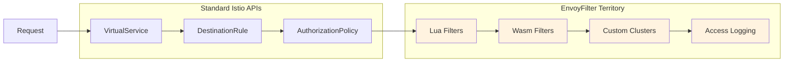
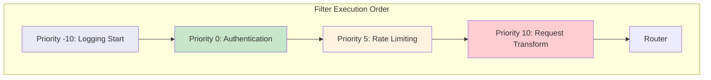

# How to Build Advanced Istio EnvoyFilters

Author: [nawazdhandala](https://www.github.com/nawazdhandala)

Tags: Istio, Envoy, Service Mesh, Kubernetes, Networking

Description: Create advanced EnvoyFilters in Istio for custom request routing, header manipulation, rate limiting, and Lua scripting at the proxy level.

---

EnvoyFilters let you reach deep into the Envoy proxy configuration that powers Istio. While basic EnvoyFilters handle simple header additions or logging tweaks, production environments often demand more sophisticated patterns. This guide walks through advanced techniques that solve real problems I have encountered in service mesh deployments.

## When Standard Istio APIs Fall Short

Istio provides VirtualService, DestinationRule, and AuthorizationPolicy for most traffic management needs. However, certain scenarios require direct Envoy manipulation:

- Implementing custom authentication schemes beyond JWT or mTLS
- Building request transformation pipelines for API versioning
- Creating dynamic routing based on request body content
- Injecting distributed tracing context for non-HTTP protocols



## Building a Request Transformation Pipeline

API versioning through EnvoyFilter allows transparent migration between API versions. This pattern intercepts requests, transforms them to the internal format, then transforms responses back for clients expecting the old format.

The following EnvoyFilter sets up request transformation for API version migration:

```yaml
# Transform legacy v1 API requests to internal v2 format
# Responses are transformed back to v1 format for backward compatibility
apiVersion: networking.istio.io/v1alpha3
kind: EnvoyFilter
metadata:
  name: api-version-transformer
  namespace: production
spec:
  workloadSelector:
    labels:
      app: api-gateway
  configPatches:
    - applyTo: HTTP_FILTER
      match:
        context: SIDECAR_INBOUND
        listener:
          filterChain:
            filter:
              name: "envoy.filters.network.http_connection_manager"
              subFilter:
                name: "envoy.filters.http.router"
      patch:
        operation: INSERT_BEFORE
        value:
          name: envoy.filters.http.lua
          typed_config:
            "@type": type.googleapis.com/envoy.extensions.filters.http.lua.v3.Lua
            inlineCode: |
              -- Field mappings between v1 and v2 API formats
              local field_transforms = {
                ["user_name"] = "username",
                ["email_address"] = "email",
                ["phone_number"] = "phone"
              }

              function envoy_on_request(request_handle)
                local headers = request_handle:headers()
                local api_version = headers:get("x-api-version") or "v2"
                local path = headers:get(":path")

                -- Store original version for response transformation
                request_handle:streamInfo():dynamicMetadata():set(
                  "api_transform", "client_version", api_version
                )

                -- Transform v1 paths to v2 equivalents
                if api_version == "v1" then
                  local new_path = string.gsub(path, "/api/v1/", "/api/v2/")
                  headers:replace(":path", new_path)

                  request_handle:logInfo(
                    "Transformed path: " .. path .. " to " .. new_path
                  )
                end
              end

              function envoy_on_response(response_handle)
                local metadata = response_handle:streamInfo():dynamicMetadata()
                local transform_data = metadata:get("api_transform")

                if transform_data and transform_data["client_version"] == "v1" then
                  -- Add deprecation notice for v1 clients
                  response_handle:headers():add(
                    "x-api-deprecation",
                    "v1 API deprecated, migrate to v2 by 2026-06-01"
                  )
                  response_handle:headers():add("sunset", "2026-06-01")
                end
              end
```

## Dynamic Rate Limiting with Client Context

Standard rate limiting applies uniform limits across all clients. This advanced pattern implements tiered rate limiting based on client subscription levels extracted from JWTs or custom headers.

```yaml
# Tiered rate limiting based on client subscription plan
# Premium clients get higher limits than free tier
apiVersion: networking.istio.io/v1alpha3
kind: EnvoyFilter
metadata:
  name: tiered-rate-limiter
  namespace: production
spec:
  workloadSelector:
    labels:
      app: api-service
  configPatches:
    - applyTo: HTTP_FILTER
      match:
        context: SIDECAR_INBOUND
        listener:
          filterChain:
            filter:
              name: "envoy.filters.network.http_connection_manager"
              subFilter:
                name: "envoy.filters.http.router"
      patch:
        operation: INSERT_BEFORE
        value:
          name: envoy.filters.http.lua
          typed_config:
            "@type": type.googleapis.com/envoy.extensions.filters.http.lua.v3.Lua
            inlineCode: |
              -- Rate limits per subscription tier (requests per minute)
              local tier_limits = {
                ["enterprise"] = 10000,
                ["business"] = 1000,
                ["starter"] = 100,
                ["free"] = 20
              }

              -- In-memory tracking per client
              -- Production systems should use Redis for distributed state
              local client_requests = {}
              local window_start = os.time()

              function get_client_tier(headers)
                -- Extract tier from custom header or JWT claim
                local tier = headers:get("x-subscription-tier")
                if tier and tier_limits[tier] then
                  return tier
                end
                return "free"
              end

              function check_rate_limit(client_id, tier)
                local current_time = os.time()
                local limit = tier_limits[tier]

                -- Reset window every minute
                if current_time - window_start >= 60 then
                  client_requests = {}
                  window_start = current_time
                end

                local count = client_requests[client_id] or 0

                if count >= limit then
                  return false, limit, 0
                end

                client_requests[client_id] = count + 1
                return true, limit, limit - count - 1
              end

              function envoy_on_request(request_handle)
                local headers = request_handle:headers()
                local client_id = headers:get("x-client-id") or
                                  headers:get("x-forwarded-for") or
                                  "anonymous"
                local tier = get_client_tier(headers)

                local allowed, limit, remaining = check_rate_limit(client_id, tier)

                -- Add rate limit headers for client visibility
                headers:add("x-ratelimit-limit", tostring(limit))
                headers:add("x-ratelimit-remaining", tostring(remaining))
                headers:add("x-ratelimit-tier", tier)

                if not allowed then
                  request_handle:respond(
                    {
                      [":status"] = "429",
                      ["retry-after"] = tostring(60 - (os.time() - window_start)),
                      ["x-ratelimit-limit"] = tostring(limit),
                      ["x-ratelimit-remaining"] = "0"
                    },
                    '{"error":"rate_limit_exceeded","tier":"' .. tier .. '"}'
                  )
                end
              end
```

## Request Body Inspection for Content-Based Routing

Sometimes routing decisions depend on request body content rather than headers or paths. This pattern buffers the request body, parses it, and makes routing decisions accordingly.

```yaml
# Route requests based on JSON body content
# Useful for GraphQL operation routing or multi-tenant systems
apiVersion: networking.istio.io/v1alpha3
kind: EnvoyFilter
metadata:
  name: content-based-router
  namespace: production
spec:
  workloadSelector:
    labels:
      app: graphql-gateway
  configPatches:
    - applyTo: HTTP_FILTER
      match:
        context: SIDECAR_INBOUND
        listener:
          filterChain:
            filter:
              name: "envoy.filters.network.http_connection_manager"
              subFilter:
                name: "envoy.filters.http.router"
      patch:
        operation: INSERT_BEFORE
        value:
          name: envoy.filters.http.lua
          typed_config:
            "@type": type.googleapis.com/envoy.extensions.filters.http.lua.v3.Lua
            inlineCode: |
              -- Extract operation name from GraphQL query
              function extract_operation(body)
                -- Simple pattern matching for operationName
                local op = string.match(body, '"operationName"%s*:%s*"([^"]+)"')
                return op
              end

              -- Map operations to backend services
              local operation_routes = {
                ["GetUser"] = "user-service",
                ["GetOrders"] = "order-service",
                ["CreatePayment"] = "payment-service"
              }

              function envoy_on_request(request_handle)
                local headers = request_handle:headers()
                local content_type = headers:get("content-type") or ""

                -- Only process JSON requests
                if not string.find(content_type, "application/json") then
                  return
                end

                -- Buffer and read request body
                local body_buffer = request_handle:body()
                if body_buffer == nil then
                  return
                end

                local body = body_buffer:getBytes(0, body_buffer:length())
                local operation = extract_operation(body)

                if operation then
                  local target = operation_routes[operation]
                  if target then
                    -- Set routing header for upstream selection
                    headers:add("x-route-to", target)
                    request_handle:logInfo(
                      "Routing operation " .. operation .. " to " .. target
                    )
                  end
                end
              end
```

## Implementing Custom Authentication

When built-in JWT validation or mTLS does not fit your authentication scheme, Lua filters can implement custom authentication logic.

```yaml
# Custom HMAC-based request signing validation
# Validates signature header against computed hash of request data
apiVersion: networking.istio.io/v1alpha3
kind: EnvoyFilter
metadata:
  name: hmac-auth-validator
  namespace: production
spec:
  workloadSelector:
    labels:
      app: secure-api
  configPatches:
    - applyTo: HTTP_FILTER
      match:
        context: SIDECAR_INBOUND
        listener:
          filterChain:
            filter:
              name: "envoy.filters.network.http_connection_manager"
              subFilter:
                name: "envoy.filters.http.router"
      patch:
        operation: INSERT_BEFORE
        value:
          name: envoy.filters.http.lua
          typed_config:
            "@type": type.googleapis.com/envoy.extensions.filters.http.lua.v3.Lua
            inlineCode: |
              -- Paths that skip authentication
              local public_paths = {
                ["/health"] = true,
                ["/ready"] = true,
                ["/metrics"] = true
              }

              function envoy_on_request(request_handle)
                local headers = request_handle:headers()
                local path = headers:get(":path")

                -- Skip auth for public endpoints
                if public_paths[path] then
                  return
                end

                -- Required auth headers
                local signature = headers:get("x-signature")
                local timestamp = headers:get("x-timestamp")
                local client_id = headers:get("x-client-id")

                -- Validate all required headers present
                if not signature or not timestamp or not client_id then
                  request_handle:respond(
                    {[":status"] = "401"},
                    '{"error":"missing_auth_headers"}'
                  )
                  return
                end

                -- Check timestamp is within acceptable window (5 minutes)
                local request_time = tonumber(timestamp)
                local current_time = os.time()
                if not request_time or
                   math.abs(current_time - request_time) > 300 then
                  request_handle:respond(
                    {[":status"] = "401"},
                    '{"error":"timestamp_expired"}'
                  )
                  return
                end

                -- In production, validate signature against stored secrets
                -- This example shows the pattern without actual crypto
                local expected_prefix = client_id:sub(1, 8)
                if signature:sub(1, 8) ~= expected_prefix then
                  request_handle:respond(
                    {[":status"] = "403"},
                    '{"error":"invalid_signature"}'
                  )
                  return
                end

                -- Auth passed, add identity headers for downstream
                headers:add("x-authenticated-client", client_id)
                headers:add("x-auth-timestamp", timestamp)
              end
```

## Advanced Filter Chain Ordering

When multiple EnvoyFilters interact, ordering matters. Use priority to control execution sequence.



The logging filter runs first with negative priority:

```yaml
# First filter in chain captures request timing
apiVersion: networking.istio.io/v1alpha3
kind: EnvoyFilter
metadata:
  name: request-timing-start
  namespace: production
spec:
  priority: -10
  workloadSelector:
    labels:
      app: api-service
  configPatches:
    - applyTo: HTTP_FILTER
      match:
        context: SIDECAR_INBOUND
        listener:
          filterChain:
            filter:
              name: "envoy.filters.network.http_connection_manager"
              subFilter:
                name: "envoy.filters.http.router"
      patch:
        operation: INSERT_FIRST
        value:
          name: envoy.filters.http.lua
          typed_config:
            "@type": type.googleapis.com/envoy.extensions.filters.http.lua.v3.Lua
            inlineCode: |
              function envoy_on_request(request_handle)
                -- Store start time for latency calculation
                local start = os.clock() * 1000
                request_handle:streamInfo():dynamicMetadata():set(
                  "timing", "start_ms", start
                )
              end

              function envoy_on_response(response_handle)
                local metadata = response_handle:streamInfo():dynamicMetadata()
                local timing = metadata:get("timing")

                if timing and timing["start_ms"] then
                  local duration = (os.clock() * 1000) - timing["start_ms"]
                  response_handle:headers():add(
                    "x-processing-time-ms",
                    string.format("%.2f", duration)
                  )
                end
              end
```

## Debugging EnvoyFilter Issues

When EnvoyFilters misbehave, these commands help identify problems:

```bash
# Dump the complete Envoy configuration for a pod
kubectl exec -it deployment/api-service -c istio-proxy -- \
  pilot-agent request GET config_dump > envoy-config.json

# Check if your filter appears in the HTTP filter chain
kubectl exec -it deployment/api-service -c istio-proxy -- \
  pilot-agent request GET config_dump?resource=dynamic_listeners | \
  grep -A 5 "envoy.filters.http.lua"

# View real-time Envoy logs for Lua filter output
kubectl logs deployment/api-service -c istio-proxy -f | \
  grep -E "lua|script"

# Check istiod for EnvoyFilter processing errors
kubectl logs deployment/istiod -n istio-system | \
  grep -i "envoyfilter\|error"
```

## Production Considerations

Before deploying EnvoyFilters to production, address these concerns:

1. **Version Compatibility**: EnvoyFilter configurations are tightly coupled to Envoy versions. Document the Istio version your filters target and test after every upgrade.

2. **Performance Impact**: Lua filters run synchronously in the request path. Keep processing minimal and avoid blocking operations.

3. **Error Handling**: Wrap Lua code in pcall to prevent filter crashes from breaking traffic flow.

4. **Observability**: Add logging statements during development but remove verbose logging for production to avoid log flooding.

5. **Rollback Plan**: Always document the rollback procedure. Test that removing the EnvoyFilter restores normal operation.

EnvoyFilters provide escape hatches when Istio's high-level APIs cannot express your requirements. Use them judiciously, document their purpose, and maintain them as carefully as application code. The patterns shown here solve real production problems, but each deployment environment has unique constraints that may require adaptation.
