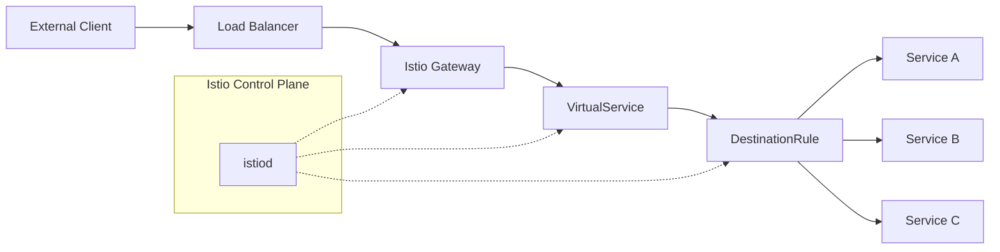
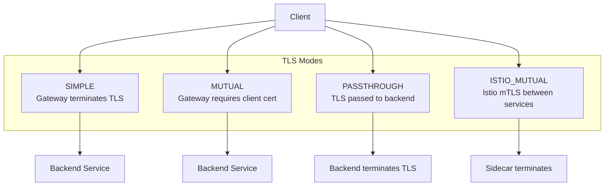
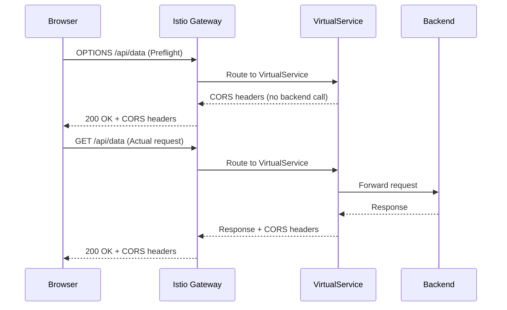
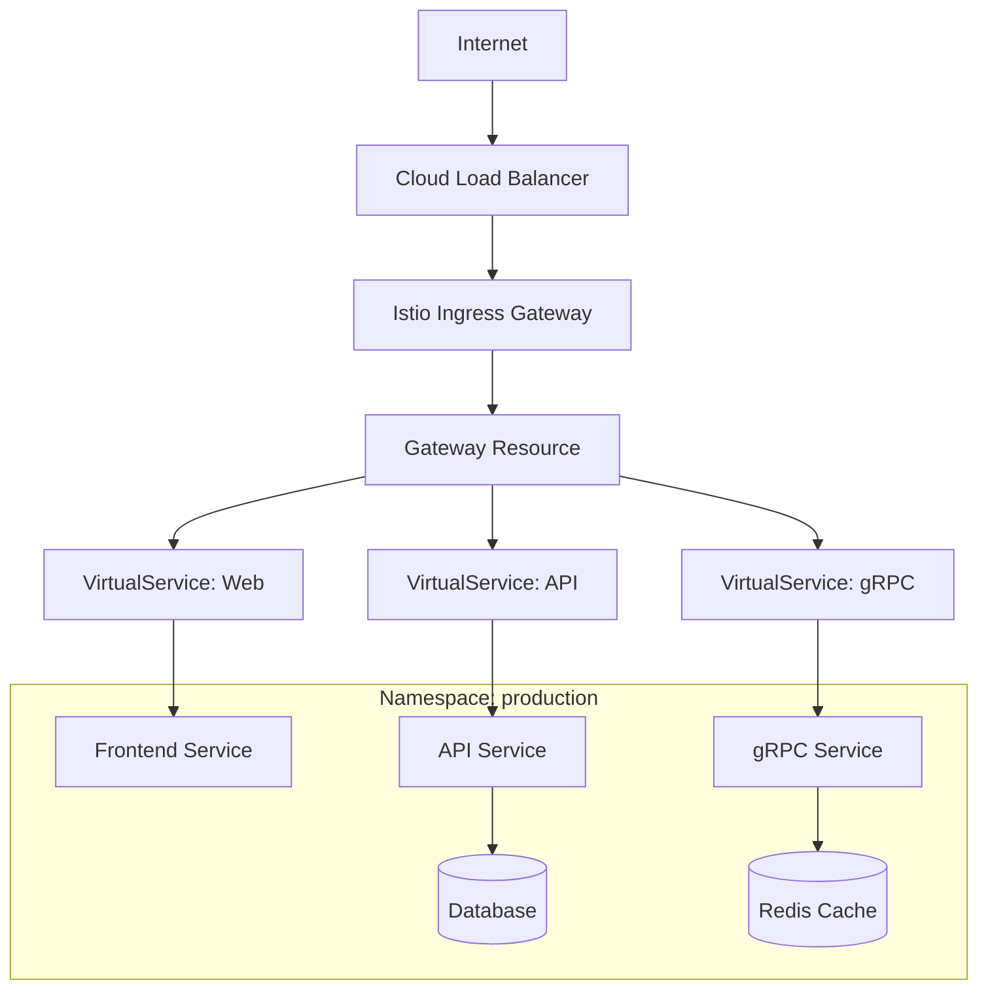

# How to Implement Istio Gateway Advanced

Author: [nawazdhandala](https://github.com/nawazdhandala)

Tags: Istio, Kubernetes, ServiceMesh, Ingress

Description: A comprehensive guide to configuring Istio Gateway for advanced ingress traffic management with TLS termination, multi-host routing, and CORS policies.

---

Istio Gateway is a powerful load balancer operating at the edge of your service mesh. Unlike Kubernetes Ingress, it provides fine-grained control over traffic entering your cluster. This guide covers advanced configurations for production environments.

## Understanding Istio Gateway Architecture

Before diving into configuration, let's understand how traffic flows through Istio Gateway.



The Gateway resource configures the Envoy proxy running in the ingress gateway pod. VirtualServices then define routing rules that attach to the Gateway.

## Gateway Resource for Multiple Hosts and Protocols

A single Gateway can handle multiple hosts with different protocols. This is essential for organizations managing multiple domains.

### Basic Multi-Host Gateway

```yaml
# gateway-multihost.yaml
# Handles traffic for multiple domains on different ports
apiVersion: networking.istio.io/v1beta1
kind: Gateway
metadata:
  name: multi-host-gateway
  namespace: istio-system
spec:
  selector:
    istio: ingressgateway  # Use the default Istio ingress gateway
  servers:
    # HTTPS server for api.example.com
    - port:
        number: 443
        name: https-api
        protocol: HTTPS
      hosts:
        - "api.example.com"
      tls:
        mode: SIMPLE
        credentialName: api-example-cert  # References a Kubernetes secret

    # HTTPS server for app.example.com
    - port:
        number: 443
        name: https-app
        protocol: HTTPS
      hosts:
        - "app.example.com"
      tls:
        mode: SIMPLE
        credentialName: app-example-cert

    # HTTP server for redirecting to HTTPS
    - port:
        number: 80
        name: http
        protocol: HTTP
      hosts:
        - "api.example.com"
        - "app.example.com"
      tls:
        httpsRedirect: true  # Redirect HTTP to HTTPS
```

### Gateway with Wildcard Hosts

```yaml
# gateway-wildcard.yaml
# Accepts traffic for all subdomains of example.com
apiVersion: networking.istio.io/v1beta1
kind: Gateway
metadata:
  name: wildcard-gateway
  namespace: istio-system
spec:
  selector:
    istio: ingressgateway
  servers:
    - port:
        number: 443
        name: https
        protocol: HTTPS
      hosts:
        - "*.example.com"  # Matches any subdomain
        - "example.com"    # Also match the apex domain
      tls:
        mode: SIMPLE
        credentialName: wildcard-example-cert
```

### Multi-Protocol Gateway (HTTP, HTTPS, TCP, gRPC)

```yaml
# gateway-multiprotocol.yaml
# Handles different protocols on different ports
apiVersion: networking.istio.io/v1beta1
kind: Gateway
metadata:
  name: multiprotocol-gateway
  namespace: istio-system
spec:
  selector:
    istio: ingressgateway
  servers:
    # HTTPS for web traffic
    - port:
        number: 443
        name: https
        protocol: HTTPS
      hosts:
        - "app.example.com"
      tls:
        mode: SIMPLE
        credentialName: app-cert

    # gRPC traffic (uses HTTP/2 over TLS)
    - port:
        number: 443
        name: grpc
        protocol: GRPC
      hosts:
        - "grpc.example.com"
      tls:
        mode: SIMPLE
        credentialName: grpc-cert

    # Raw TCP for database connections
    - port:
        number: 5432
        name: tcp-postgres
        protocol: TCP
      hosts:
        - "db.example.com"
      tls:
        mode: SIMPLE
        credentialName: db-cert

    # MongoDB traffic
    - port:
        number: 27017
        name: tcp-mongo
        protocol: MONGO
      hosts:
        - "mongo.example.com"
```

## TLS Termination with Certificate Management

Proper TLS configuration is critical for production. Istio supports multiple TLS modes and integrates with cert-manager for automatic certificate management.



### SIMPLE TLS Mode (Standard Termination)

```yaml
# gateway-tls-simple.yaml
# Standard TLS termination at the gateway
apiVersion: networking.istio.io/v1beta1
kind: Gateway
metadata:
  name: tls-gateway
  namespace: istio-system
spec:
  selector:
    istio: ingressgateway
  servers:
    - port:
        number: 443
        name: https
        protocol: HTTPS
      hosts:
        - "secure.example.com"
      tls:
        mode: SIMPLE
        credentialName: secure-example-cert  # TLS secret name
        minProtocolVersion: TLSV1_2          # Minimum TLS 1.2
        maxProtocolVersion: TLSV1_3          # Maximum TLS 1.3
        cipherSuites:                         # Restrict cipher suites
          - ECDHE-RSA-AES256-GCM-SHA384
          - ECDHE-RSA-AES128-GCM-SHA256
          - ECDHE-RSA-CHACHA20-POLY1305
```

### Creating TLS Secrets

```bash
# Create TLS secret from certificate files
kubectl create secret tls secure-example-cert \
  --cert=path/to/cert.pem \
  --key=path/to/key.pem \
  -n istio-system

# Verify the secret was created
kubectl get secret secure-example-cert -n istio-system
```

### Integration with cert-manager

```yaml
# certificate.yaml
# Automatically provisions and renews certificates
apiVersion: cert-manager.io/v1
kind: Certificate
metadata:
  name: secure-example-cert
  namespace: istio-system
spec:
  secretName: secure-example-cert
  issuerRef:
    name: letsencrypt-prod
    kind: ClusterIssuer
  dnsNames:
    - secure.example.com
    - www.secure.example.com
  duration: 2160h    # 90 days
  renewBefore: 360h  # Renew 15 days before expiry
```

### Mutual TLS (mTLS) for Client Authentication

```yaml
# gateway-mtls.yaml
# Requires clients to present valid certificates
apiVersion: networking.istio.io/v1beta1
kind: Gateway
metadata:
  name: mtls-gateway
  namespace: istio-system
spec:
  selector:
    istio: ingressgateway
  servers:
    - port:
        number: 443
        name: https-mtls
        protocol: HTTPS
      hosts:
        - "api.example.com"
      tls:
        mode: MUTUAL                       # Require client certificate
        credentialName: api-example-cert   # Server certificate
        # Client CA is loaded from the same secret or separate
```

```bash
# Create secret with both server cert and client CA
kubectl create secret generic api-example-cert \
  --from-file=tls.crt=server.crt \
  --from-file=tls.key=server.key \
  --from-file=ca.crt=client-ca.crt \
  -n istio-system
```

### TLS Passthrough

```yaml
# gateway-passthrough.yaml
# Passes encrypted traffic directly to backend
apiVersion: networking.istio.io/v1beta1
kind: Gateway
metadata:
  name: passthrough-gateway
  namespace: istio-system
spec:
  selector:
    istio: ingressgateway
  servers:
    - port:
        number: 443
        name: https-passthrough
        protocol: HTTPS
      hosts:
        - "legacy.example.com"
      tls:
        mode: PASSTHROUGH  # Do not terminate TLS
```

## Server Port Configuration and Protocol Selection

Understanding port configuration is essential for proper traffic handling.

### Port Configuration Reference

| Protocol | Port Number | Name Convention | Use Case |
|----------|-------------|-----------------|----------|
| HTTP | 80 | http | Unencrypted web traffic |
| HTTPS | 443 | https | Encrypted web traffic |
| HTTP2 | 443 | http2 | HTTP/2 over TLS |
| GRPC | 443 | grpc | gRPC services |
| TCP | Any | tcp-{name} | Raw TCP connections |
| TLS | Any | tls-{name} | TLS passthrough |
| MONGO | 27017 | mongo | MongoDB wire protocol |
| MYSQL | 3306 | mysql | MySQL wire protocol |

### Advanced Port Configuration

```yaml
# gateway-ports.yaml
# Demonstrates various port configurations
apiVersion: networking.istio.io/v1beta1
kind: Gateway
metadata:
  name: advanced-ports-gateway
  namespace: istio-system
spec:
  selector:
    istio: ingressgateway
  servers:
    # Standard HTTPS with specific TLS settings
    - port:
        number: 443
        name: https-primary
        protocol: HTTPS
        targetPort: 8443  # Optional: map to different container port
      hosts:
        - "app.example.com"
      tls:
        mode: SIMPLE
        credentialName: app-cert

    # HTTP/2 cleartext (h2c) for internal services
    - port:
        number: 8080
        name: http2-internal
        protocol: HTTP2
      hosts:
        - "internal.example.com"

    # Custom TCP port for legacy systems
    - port:
        number: 9000
        name: tcp-legacy
        protocol: TCP
      hosts:
        - "legacy.example.com"
```

### Configuring the Ingress Gateway Service

The Gateway resource configures Envoy, but you also need to expose ports on the LoadBalancer service.

```yaml
# ingress-gateway-service.yaml
# Expose additional ports on the ingress gateway
apiVersion: v1
kind: Service
metadata:
  name: istio-ingressgateway
  namespace: istio-system
spec:
  type: LoadBalancer
  selector:
    istio: ingressgateway
  ports:
    - name: http
      port: 80
      targetPort: 8080
    - name: https
      port: 443
      targetPort: 8443
    - name: tcp-postgres
      port: 5432
      targetPort: 5432
    - name: tcp-mongo
      port: 27017
      targetPort: 27017
    - name: grpc
      port: 9090
      targetPort: 9090
```

## Cross-Origin Resource Sharing (CORS) Settings

CORS configuration is handled in VirtualService, not Gateway. Here's how to configure it properly.



### Basic CORS Configuration

```yaml
# virtualservice-cors.yaml
# Configure CORS for API endpoints
apiVersion: networking.istio.io/v1beta1
kind: VirtualService
metadata:
  name: api-virtualservice
  namespace: default
spec:
  hosts:
    - "api.example.com"
  gateways:
    - istio-system/multi-host-gateway  # Reference the Gateway
  http:
    - match:
        - uri:
            prefix: /api/
      corsPolicy:
        allowOrigins:
          - exact: "https://app.example.com"
          - exact: "https://admin.example.com"
          - regex: "https://.*\\.example\\.com"  # Allow all subdomains
        allowMethods:
          - GET
          - POST
          - PUT
          - DELETE
          - PATCH
          - OPTIONS
        allowHeaders:
          - Authorization
          - Content-Type
          - X-Requested-With
          - X-Custom-Header
        exposeHeaders:
          - X-Request-ID
          - X-Response-Time
        maxAge: "24h"              # Cache preflight for 24 hours
        allowCredentials: true     # Allow cookies and auth headers
      route:
        - destination:
            host: api-service
            port:
              number: 8080
```

### Environment-Specific CORS

```yaml
# virtualservice-cors-production.yaml
# Strict CORS for production
apiVersion: networking.istio.io/v1beta1
kind: VirtualService
metadata:
  name: api-production
  namespace: production
spec:
  hosts:
    - "api.example.com"
  gateways:
    - istio-system/production-gateway
  http:
    - corsPolicy:
        allowOrigins:
          - exact: "https://app.example.com"  # Only allow production origin
        allowMethods:
          - GET
          - POST
        allowHeaders:
          - Authorization
          - Content-Type
        maxAge: "1h"
        allowCredentials: true
      route:
        - destination:
            host: api-service
            port:
              number: 8080
---
# virtualservice-cors-development.yaml
# Relaxed CORS for development
apiVersion: networking.istio.io/v1beta1
kind: VirtualService
metadata:
  name: api-development
  namespace: development
spec:
  hosts:
    - "api-dev.example.com"
  gateways:
    - istio-system/development-gateway
  http:
    - corsPolicy:
        allowOrigins:
          - regex: ".*"  # Allow any origin in development
        allowMethods:
          - GET
          - POST
          - PUT
          - DELETE
          - PATCH
          - OPTIONS
        allowHeaders:
          - "*"
        exposeHeaders:
          - "*"
        maxAge: "0s"  # No caching for development
        allowCredentials: true
      route:
        - destination:
            host: api-service
            port:
              number: 8080
```

## Complete Production Example

Here's a complete setup for a production environment with multiple services.

### Traffic Flow Overview



### Gateway Configuration

```yaml
# production-gateway.yaml
apiVersion: networking.istio.io/v1beta1
kind: Gateway
metadata:
  name: production-gateway
  namespace: istio-system
spec:
  selector:
    istio: ingressgateway
  servers:
    # HTTP to HTTPS redirect
    - port:
        number: 80
        name: http
        protocol: HTTP
      hosts:
        - "*.example.com"
      tls:
        httpsRedirect: true

    # HTTPS for web application
    - port:
        number: 443
        name: https-web
        protocol: HTTPS
      hosts:
        - "app.example.com"
        - "www.example.com"
      tls:
        mode: SIMPLE
        credentialName: web-tls-cert
        minProtocolVersion: TLSV1_2

    # HTTPS for API with stricter settings
    - port:
        number: 443
        name: https-api
        protocol: HTTPS
      hosts:
        - "api.example.com"
      tls:
        mode: SIMPLE
        credentialName: api-tls-cert
        minProtocolVersion: TLSV1_3  # API requires TLS 1.3

    # gRPC services
    - port:
        number: 443
        name: grpc
        protocol: GRPC
      hosts:
        - "grpc.example.com"
      tls:
        mode: SIMPLE
        credentialName: grpc-tls-cert
```

### VirtualService for Web Application

```yaml
# virtualservice-web.yaml
apiVersion: networking.istio.io/v1beta1
kind: VirtualService
metadata:
  name: web-virtualservice
  namespace: production
spec:
  hosts:
    - "app.example.com"
    - "www.example.com"
  gateways:
    - istio-system/production-gateway
  http:
    # Redirect www to non-www
    - match:
        - headers:
            ":authority":
              exact: "www.example.com"
      redirect:
        authority: "app.example.com"

    # Serve static assets with caching headers
    - match:
        - uri:
            prefix: /static/
      route:
        - destination:
            host: frontend-service
            port:
              number: 80
      headers:
        response:
          add:
            Cache-Control: "public, max-age=31536000"

    # Default route to frontend
    - route:
        - destination:
            host: frontend-service
            port:
              number: 80
```

### VirtualService for API with Rate Limiting Headers

```yaml
# virtualservice-api.yaml
apiVersion: networking.istio.io/v1beta1
kind: VirtualService
metadata:
  name: api-virtualservice
  namespace: production
spec:
  hosts:
    - "api.example.com"
  gateways:
    - istio-system/production-gateway
  http:
    # Health check endpoint (no CORS, no auth)
    - match:
        - uri:
            exact: /health
      route:
        - destination:
            host: api-service
            port:
              number: 8080

    # API v2 routes to new service
    - match:
        - uri:
            prefix: /api/v2/
      corsPolicy:
        allowOrigins:
          - exact: "https://app.example.com"
        allowMethods:
          - GET
          - POST
          - PUT
          - DELETE
        allowHeaders:
          - Authorization
          - Content-Type
        maxAge: "24h"
        allowCredentials: true
      route:
        - destination:
            host: api-v2-service
            port:
              number: 8080
      headers:
        response:
          add:
            X-API-Version: "2.0"

    # API v1 routes (default)
    - match:
        - uri:
            prefix: /api/v1/
        - uri:
            prefix: /api/  # Fallback for unversioned
      corsPolicy:
        allowOrigins:
          - exact: "https://app.example.com"
        allowMethods:
          - GET
          - POST
          - PUT
          - DELETE
        allowHeaders:
          - Authorization
          - Content-Type
        maxAge: "24h"
        allowCredentials: true
      route:
        - destination:
            host: api-service
            port:
              number: 8080
      headers:
        response:
          add:
            X-API-Version: "1.0"
```

### VirtualService for gRPC

```yaml
# virtualservice-grpc.yaml
apiVersion: networking.istio.io/v1beta1
kind: VirtualService
metadata:
  name: grpc-virtualservice
  namespace: production
spec:
  hosts:
    - "grpc.example.com"
  gateways:
    - istio-system/production-gateway
  http:  # gRPC uses HTTP/2
    - match:
        - headers:
            content-type:
              prefix: "application/grpc"
      route:
        - destination:
            host: grpc-service
            port:
              number: 9090
      retries:
        attempts: 3
        perTryTimeout: 5s
        retryOn: "unavailable,resource-exhausted"
```

## Debugging and Verification

### Check Gateway Configuration

```bash
# Verify Gateway is created
kubectl get gateway -n istio-system

# Check Gateway details
kubectl describe gateway production-gateway -n istio-system

# View Envoy configuration applied to ingress gateway
istioctl proxy-config listener deploy/istio-ingressgateway -n istio-system

# Check routes configured
istioctl proxy-config routes deploy/istio-ingressgateway -n istio-system
```

### Test TLS Configuration

```bash
# Test TLS connection
openssl s_client -connect api.example.com:443 -servername api.example.com

# Check certificate chain
curl -vI https://api.example.com 2>&1 | grep -A 6 "Server certificate"

# Verify TLS version
curl -vI https://api.example.com 2>&1 | grep "SSL connection"
```

### Test CORS Headers

```bash
# Test preflight request
curl -X OPTIONS https://api.example.com/api/v1/users \
  -H "Origin: https://app.example.com" \
  -H "Access-Control-Request-Method: POST" \
  -H "Access-Control-Request-Headers: Content-Type, Authorization" \
  -v

# Verify CORS headers in response
curl -X GET https://api.example.com/api/v1/users \
  -H "Origin: https://app.example.com" \
  -v 2>&1 | grep -i "access-control"
```

### Analyze Traffic Flow

```bash
# Watch traffic through the gateway
kubectl logs -f deploy/istio-ingressgateway -n istio-system

# Use Kiali for visual traffic analysis
istioctl dashboard kiali

# Check Envoy access logs
kubectl logs -f deploy/istio-ingressgateway -n istio-system | grep "api.example.com"
```

## Security Checklist

- [ ] Enable HTTPS redirect for all HTTP traffic
- [ ] Use TLS 1.2 as minimum protocol version
- [ ] Configure strong cipher suites
- [ ] Implement certificate rotation with cert-manager
- [ ] Use mutual TLS for sensitive APIs
- [ ] Configure strict CORS policies per environment
- [ ] Limit exposed ports to only what is needed
- [ ] Monitor certificate expiration
- [ ] Enable access logging for audit trails
- [ ] Test failover scenarios regularly

---

Istio Gateway provides enterprise-grade traffic management at the edge of your service mesh. By combining Gateway resources with VirtualServices and proper TLS configuration, you can build secure, scalable, and observable ingress infrastructure. Start with simple configurations and gradually add complexity as your requirements evolve.
