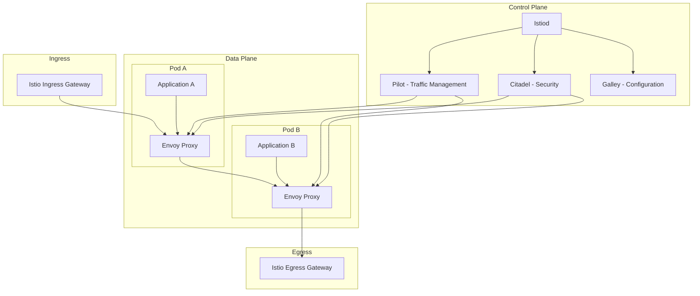
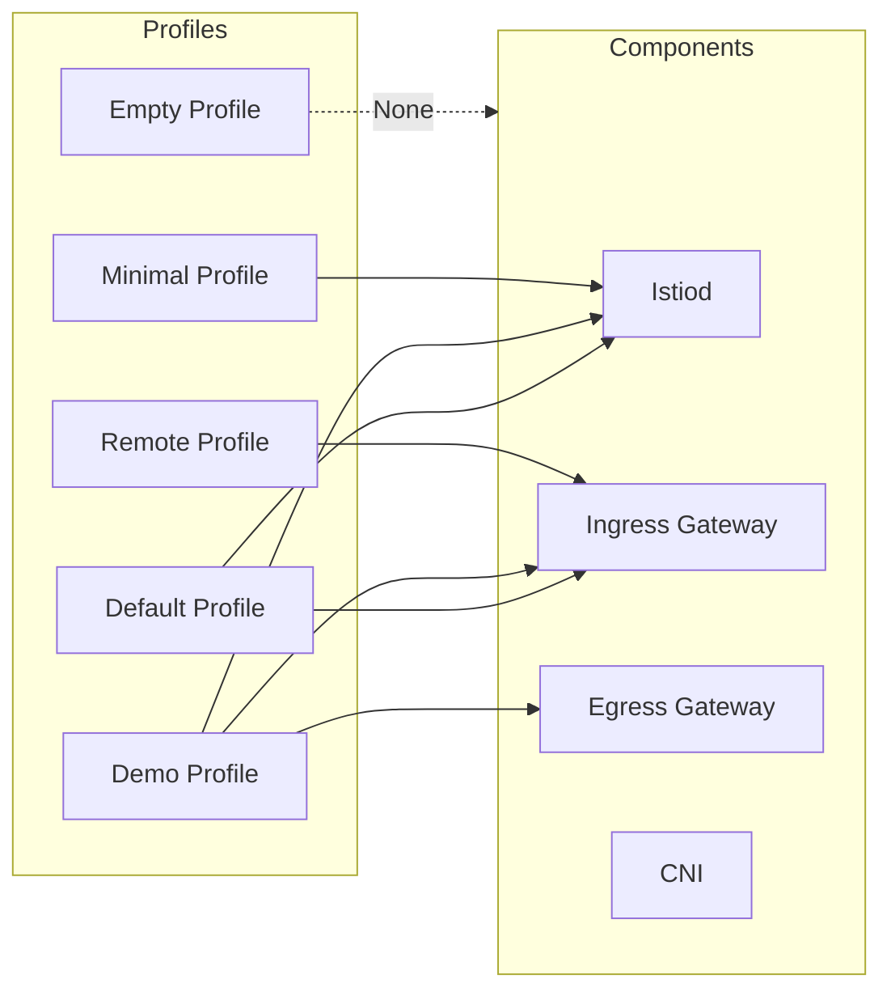

# How to Create Istio IstioOperator

Author: [nawazdhandala](https://github.com/nawazdhandala)

Tags: Istio, Kubernetes, ServiceMesh, Operator

Description: A comprehensive guide to installing and configuring Istio using IstioOperator for production-grade service mesh deployments.

---

IstioOperator is the declarative way to install and manage Istio in Kubernetes. Instead of using command-line flags, you define your desired Istio configuration in a YAML manifest and let the operator handle the installation and updates.

## Understanding Istio Architecture

Before diving into IstioOperator, let us understand what Istio deploys in your cluster.



### Key Components

| Component | Description |
|-----------|-------------|
| Istiod | Consolidated control plane (Pilot, Citadel, Galley) |
| Envoy Proxy | Sidecar proxy handling all traffic |
| Ingress Gateway | Entry point for external traffic |
| Egress Gateway | Exit point for outbound traffic |
| CNI Plugin | Optional network plugin for pod initialization |

## Installing the Istio Operator

First, install the Istio operator controller that will manage IstioOperator resources.

```bash
# Download istioctl (the Istio CLI)
curl -L https://istio.io/downloadIstio | sh -

# Move to the Istio directory
cd istio-1.20.0

# Add istioctl to PATH
export PATH=$PWD/bin:$PATH

# Install the Istio operator controller
istioctl operator init

# Verify operator is running
kubectl get pods -n istio-operator
```

Expected output:

```
NAME                              READY   STATUS    RESTARTS   AGE
istio-operator-5f7b8d6c6f-xxxxx   1/1     Running   0          30s
```

## IstioOperator Resource Specification

The IstioOperator custom resource defines your complete Istio configuration. Here is the basic structure.

```yaml
# Basic IstioOperator structure
apiVersion: install.istio.io/v1alpha1
kind: IstioOperator
metadata:
  name: istio-control-plane
  namespace: istio-system
spec:
  # Installation profile (default, demo, minimal, remote, empty)
  profile: default

  # Mesh configuration
  meshConfig:
    accessLogFile: /dev/stdout
    enableTracing: true
    defaultConfig:
      tracing:
        sampling: 100

  # Component configuration
  components:
    # Control plane components
    pilot:
      enabled: true

    # Ingress gateway
    ingressGateways:
      - name: istio-ingressgateway
        enabled: true

    # Egress gateway
    egressGateways:
      - name: istio-egressgateway
        enabled: false

    # CNI plugin
    cni:
      enabled: false

  # Global values
  values:
    global:
      proxy:
        resources:
          requests:
            cpu: 100m
            memory: 128Mi
          limits:
            cpu: 500m
            memory: 256Mi
```

## Profile Customization

Istio provides several built-in profiles for different use cases.

### Profile Comparison



### Default Profile

Best for production deployments with standard requirements.

```yaml
# default-profile.yaml
apiVersion: install.istio.io/v1alpha1
kind: IstioOperator
metadata:
  name: istio-default
  namespace: istio-system
spec:
  profile: default

  # Customize the default profile
  meshConfig:
    # Enable access logging to stdout
    accessLogFile: /dev/stdout

    # Set default proxy configuration
    defaultConfig:
      # Enable protocol detection timeout
      protocolDetectionTimeout: 5s

      # Configure tracing
      tracing:
        sampling: 10.0
        zipkin:
          address: zipkin.istio-system:9411

  components:
    pilot:
      enabled: true
      k8s:
        # Resource configuration for Istiod
        resources:
          requests:
            cpu: 500m
            memory: 2Gi
          limits:
            cpu: 1000m
            memory: 4Gi

        # Horizontal pod autoscaler
        hpaSpec:
          minReplicas: 2
          maxReplicas: 5
          metrics:
            - type: Resource
              resource:
                name: cpu
                targetAverageUtilization: 80

    ingressGateways:
      - name: istio-ingressgateway
        enabled: true
        k8s:
          resources:
            requests:
              cpu: 200m
              memory: 256Mi
            limits:
              cpu: 1000m
              memory: 1Gi

          # Service configuration
          service:
            type: LoadBalancer
            ports:
              - name: http2
                port: 80
                targetPort: 8080
              - name: https
                port: 443
                targetPort: 8443
```

Apply the configuration:

```bash
# Apply the IstioOperator resource
kubectl apply -f default-profile.yaml

# Watch the installation progress
kubectl get pods -n istio-system -w

# Verify installation
istioctl verify-install
```

### Demo Profile

Includes all components with relaxed resource requirements. Use for testing and learning.

```yaml
# demo-profile.yaml
apiVersion: install.istio.io/v1alpha1
kind: IstioOperator
metadata:
  name: istio-demo
  namespace: istio-system
spec:
  profile: demo

  meshConfig:
    # Enable access logging
    accessLogFile: /dev/stdout

    # Enable all Istio features for demo
    enableAutoMtls: true

    defaultConfig:
      # Higher sampling rate for demos
      tracing:
        sampling: 100.0

  components:
    # Egress gateway enabled in demo profile
    egressGateways:
      - name: istio-egressgateway
        enabled: true
        k8s:
          resources:
            requests:
              cpu: 50m
              memory: 64Mi
            limits:
              cpu: 200m
              memory: 128Mi

  values:
    global:
      proxy:
        # Lower resources for demo
        resources:
          requests:
            cpu: 10m
            memory: 40Mi
          limits:
            cpu: 200m
            memory: 256Mi
```

### Minimal Profile

Installs only Istiod. No gateways or additional components.

```yaml
# minimal-profile.yaml
apiVersion: install.istio.io/v1alpha1
kind: IstioOperator
metadata:
  name: istio-minimal
  namespace: istio-system
spec:
  profile: minimal

  meshConfig:
    accessLogFile: /dev/stdout

    defaultConfig:
      # Disable tracing by default
      tracing:
        sampling: 0

  components:
    pilot:
      enabled: true
      k8s:
        resources:
          requests:
            cpu: 200m
            memory: 512Mi
          limits:
            cpu: 500m
            memory: 1Gi

        # Run single replica for minimal footprint
        replicaCount: 1

        # Disable HPA
        hpaSpec:
          minReplicas: 1
          maxReplicas: 1

    # Explicitly disable gateways
    ingressGateways:
      - name: istio-ingressgateway
        enabled: false

    egressGateways:
      - name: istio-egressgateway
        enabled: false

  values:
    pilot:
      # Disable unnecessary features
      enableProtocolSniffingForOutbound: false
      enableProtocolSniffingForInbound: false
```

## Component Selection and Configuration

### Configuring Istiod (Pilot)

```yaml
# istiod-config.yaml
apiVersion: install.istio.io/v1alpha1
kind: IstioOperator
metadata:
  name: istio-production
  namespace: istio-system
spec:
  profile: default

  components:
    pilot:
      enabled: true
      k8s:
        # Pod annotations
        podAnnotations:
          prometheus.io/scrape: "true"
          prometheus.io/port: "15014"

        # Node affinity
        affinity:
          nodeAffinity:
            requiredDuringSchedulingIgnoredDuringExecution:
              nodeSelectorTerms:
                - matchExpressions:
                    - key: node-role.kubernetes.io/control-plane
                      operator: DoesNotExist

          # Anti-affinity for high availability
          podAntiAffinity:
            preferredDuringSchedulingIgnoredDuringExecution:
              - weight: 100
                podAffinityTerm:
                  labelSelector:
                    matchLabels:
                      app: istiod
                  topologyKey: kubernetes.io/hostname

        # Resource limits
        resources:
          requests:
            cpu: 500m
            memory: 2Gi
          limits:
            cpu: 2000m
            memory: 4Gi

        # Environment variables
        env:
          - name: PILOT_TRACE_SAMPLING
            value: "1"
          - name: PILOT_ENABLE_PROTOCOL_SNIFFING_FOR_OUTBOUND
            value: "true"

        # Horizontal Pod Autoscaler
        hpaSpec:
          minReplicas: 2
          maxReplicas: 10
          metrics:
            - type: Resource
              resource:
                name: cpu
                targetAverageUtilization: 75

        # Pod Disruption Budget
        podDisruptionBudget:
          minAvailable: 1
          selector:
            matchLabels:
              app: istiod
```

### Configuring Ingress Gateway

```yaml
# ingress-gateway-config.yaml
apiVersion: install.istio.io/v1alpha1
kind: IstioOperator
metadata:
  name: istio-with-ingress
  namespace: istio-system
spec:
  profile: default

  components:
    ingressGateways:
      - name: istio-ingressgateway
        enabled: true
        namespace: istio-system

        # Gateway label (used for Gateway resources)
        label:
          istio: ingressgateway
          app: istio-ingressgateway

        k8s:
          # Service configuration
          service:
            type: LoadBalancer

            # Cloud provider annotations
            annotations:
              # AWS NLB
              service.beta.kubernetes.io/aws-load-balancer-type: nlb
              service.beta.kubernetes.io/aws-load-balancer-cross-zone-load-balancing-enabled: "true"

            # Port configuration
            ports:
              - name: status-port
                port: 15021
                targetPort: 15021
              - name: http2
                port: 80
                targetPort: 8080
              - name: https
                port: 443
                targetPort: 8443
              - name: tcp
                port: 31400
                targetPort: 31400
              - name: tls
                port: 15443
                targetPort: 15443

          # Resource allocation
          resources:
            requests:
              cpu: 500m
              memory: 512Mi
            limits:
              cpu: 2000m
              memory: 2Gi

          # Autoscaling
          hpaSpec:
            minReplicas: 2
            maxReplicas: 10
            metrics:
              - type: Resource
                resource:
                  name: cpu
                  targetAverageUtilization: 70

          # Strategy for zero-downtime updates
          strategy:
            rollingUpdate:
              maxSurge: 100%
              maxUnavailable: 25%

          # Pod Disruption Budget
          podDisruptionBudget:
            minAvailable: 1

      # Additional internal gateway
      - name: istio-internal-gateway
        enabled: true
        namespace: istio-system
        label:
          istio: internal-gateway
        k8s:
          service:
            type: ClusterIP
            ports:
              - name: http2
                port: 80
                targetPort: 8080
              - name: https
                port: 443
                targetPort: 8443
          resources:
            requests:
              cpu: 100m
              memory: 128Mi
            limits:
              cpu: 500m
              memory: 512Mi
```

### Configuring Egress Gateway

```yaml
# egress-gateway-config.yaml
apiVersion: install.istio.io/v1alpha1
kind: IstioOperator
metadata:
  name: istio-with-egress
  namespace: istio-system
spec:
  profile: default

  components:
    egressGateways:
      - name: istio-egressgateway
        enabled: true
        namespace: istio-system

        label:
          istio: egressgateway
          app: istio-egressgateway

        k8s:
          service:
            type: ClusterIP
            ports:
              - name: http2
                port: 80
                targetPort: 8080
              - name: https
                port: 443
                targetPort: 8443

          resources:
            requests:
              cpu: 100m
              memory: 128Mi
            limits:
              cpu: 500m
              memory: 512Mi

          # Egress gateway should not scale aggressively
          hpaSpec:
            minReplicas: 1
            maxReplicas: 3
            metrics:
              - type: Resource
                resource:
                  name: cpu
                  targetAverageUtilization: 80

          # Environment variables for egress policies
          env:
            - name: ISTIO_META_REQUESTED_NETWORK_VIEW
              value: external
```

## Resource Requests and Limits Configuration

Proper resource configuration is critical for production deployments.

### Production Resource Configuration

```yaml
# production-resources.yaml
apiVersion: install.istio.io/v1alpha1
kind: IstioOperator
metadata:
  name: istio-production
  namespace: istio-system
spec:
  profile: default

  # Global proxy (sidecar) configuration
  values:
    global:
      proxy:
        # Sidecar proxy resources
        resources:
          requests:
            cpu: 100m
            memory: 128Mi
          limits:
            cpu: 1000m
            memory: 512Mi

        # Init container resources
        init:
          resources:
            requests:
              cpu: 10m
              memory: 10Mi
            limits:
              cpu: 100m
              memory: 50Mi

      # Proxy concurrency (number of worker threads)
      # 0 means use all available cores
      proxy_init:
        resources:
          requests:
            cpu: 10m
            memory: 10Mi
          limits:
            cpu: 100m
            memory: 50Mi

  components:
    # Istiod resources
    pilot:
      enabled: true
      k8s:
        resources:
          requests:
            cpu: 1000m
            memory: 2Gi
          limits:
            cpu: 2000m
            memory: 4Gi

        hpaSpec:
          minReplicas: 2
          maxReplicas: 5
          metrics:
            - type: Resource
              resource:
                name: cpu
                targetAverageUtilization: 70
            - type: Resource
              resource:
                name: memory
                targetAverageUtilization: 70

    # Ingress gateway resources
    ingressGateways:
      - name: istio-ingressgateway
        enabled: true
        k8s:
          resources:
            requests:
              cpu: 500m
              memory: 512Mi
            limits:
              cpu: 2000m
              memory: 2Gi

          hpaSpec:
            minReplicas: 3
            maxReplicas: 10
            metrics:
              - type: Resource
                resource:
                  name: cpu
                  targetAverageUtilization: 60

    # Egress gateway resources
    egressGateways:
      - name: istio-egressgateway
        enabled: true
        k8s:
          resources:
            requests:
              cpu: 200m
              memory: 256Mi
            limits:
              cpu: 1000m
              memory: 1Gi
```

### Per-Namespace Resource Overrides

You can override sidecar resources per namespace using annotations.

```yaml
# namespace-resource-override.yaml
apiVersion: v1
kind: Namespace
metadata:
  name: high-traffic-app
  labels:
    istio-injection: enabled
  annotations:
    # Override proxy resources for this namespace
    sidecar.istio.io/proxyCPU: "200m"
    sidecar.istio.io/proxyCPULimit: "2000m"
    sidecar.istio.io/proxyMemory: "256Mi"
    sidecar.istio.io/proxyMemoryLimit: "1Gi"
```

Or per deployment:

```yaml
# deployment-with-proxy-resources.yaml
apiVersion: apps/v1
kind: Deployment
metadata:
  name: high-traffic-service
spec:
  template:
    metadata:
      annotations:
        # Override proxy resources for this pod
        sidecar.istio.io/proxyCPU: "500m"
        sidecar.istio.io/proxyCPULimit: "2000m"
        sidecar.istio.io/proxyMemory: "512Mi"
        sidecar.istio.io/proxyMemoryLimit: "2Gi"
    spec:
      containers:
        - name: app
          image: my-app:latest
```

## Complete Production Example

Here is a complete production-ready IstioOperator configuration.

```yaml
# production-istio.yaml
apiVersion: install.istio.io/v1alpha1
kind: IstioOperator
metadata:
  name: istio-production
  namespace: istio-system
spec:
  profile: default

  # Mesh-wide configuration
  meshConfig:
    # Enable access logging
    accessLogFile: /dev/stdout
    accessLogFormat: |
      [%START_TIME%] "%REQ(:METHOD)% %REQ(X-ENVOY-ORIGINAL-PATH?:PATH)% %PROTOCOL%"
      %RESPONSE_CODE% %RESPONSE_FLAGS% %BYTES_RECEIVED% %BYTES_SENT%
      %DURATION% %RESP(X-ENVOY-UPSTREAM-SERVICE-TIME)%
      "%REQ(X-FORWARDED-FOR)%" "%REQ(USER-AGENT)%"
      "%REQ(X-REQUEST-ID)%" "%REQ(:AUTHORITY)%" "%UPSTREAM_HOST%"

    # Enable automatic mTLS
    enableAutoMtls: true

    # Tracing configuration
    enableTracing: true

    # Default proxy configuration
    defaultConfig:
      # Tracing settings
      tracing:
        sampling: 10.0
        zipkin:
          address: jaeger-collector.observability:9411

      # Hold application start until proxy is ready
      holdApplicationUntilProxyStarts: true

      # Proxy metadata
      proxyMetadata:
        ISTIO_META_DNS_CAPTURE: "true"
        ISTIO_META_DNS_AUTO_ALLOCATE: "true"

    # Outbound traffic policy
    outboundTrafficPolicy:
      mode: REGISTRY_ONLY

    # Root namespace for Istio config
    rootNamespace: istio-system

  # Component configuration
  components:
    # Control plane
    pilot:
      enabled: true
      k8s:
        # Replica count
        replicaCount: 2

        # Resources
        resources:
          requests:
            cpu: 1000m
            memory: 2Gi
          limits:
            cpu: 2000m
            memory: 4Gi

        # Pod anti-affinity for HA
        affinity:
          podAntiAffinity:
            requiredDuringSchedulingIgnoredDuringExecution:
              - labelSelector:
                  matchLabels:
                    app: istiod
                topologyKey: topology.kubernetes.io/zone

        # HPA
        hpaSpec:
          minReplicas: 2
          maxReplicas: 5
          metrics:
            - type: Resource
              resource:
                name: cpu
                targetAverageUtilization: 70

        # PDB
        podDisruptionBudget:
          minAvailable: 1

        # Environment overrides
        env:
          - name: PILOT_ENABLE_WORKLOAD_ENTRY_AUTOREGISTRATION
            value: "true"
          - name: PILOT_ENABLE_WORKLOAD_ENTRY_HEALTHCHECKS
            value: "true"

    # Ingress gateway
    ingressGateways:
      - name: istio-ingressgateway
        enabled: true
        k8s:
          service:
            type: LoadBalancer
            annotations:
              # Example for AWS
              service.beta.kubernetes.io/aws-load-balancer-type: nlb
              service.beta.kubernetes.io/aws-load-balancer-backend-protocol: tcp
            ports:
              - name: status-port
                port: 15021
                targetPort: 15021
              - name: http2
                port: 80
                targetPort: 8080
              - name: https
                port: 443
                targetPort: 8443

          resources:
            requests:
              cpu: 500m
              memory: 512Mi
            limits:
              cpu: 2000m
              memory: 2Gi

          affinity:
            podAntiAffinity:
              preferredDuringSchedulingIgnoredDuringExecution:
                - weight: 100
                  podAffinityTerm:
                    labelSelector:
                      matchLabels:
                        istio: ingressgateway
                    topologyKey: topology.kubernetes.io/zone

          hpaSpec:
            minReplicas: 3
            maxReplicas: 10
            metrics:
              - type: Resource
                resource:
                  name: cpu
                  targetAverageUtilization: 60

          podDisruptionBudget:
            minAvailable: 2

    # Egress gateway
    egressGateways:
      - name: istio-egressgateway
        enabled: true
        k8s:
          resources:
            requests:
              cpu: 200m
              memory: 256Mi
            limits:
              cpu: 1000m
              memory: 1Gi

          hpaSpec:
            minReplicas: 2
            maxReplicas: 5

    # CNI plugin for better security
    cni:
      enabled: true

  # Values for helm charts
  values:
    global:
      # Image configuration
      hub: docker.io/istio
      tag: 1.20.0

      # Logging
      logging:
        level: "default:info"

      # Proxy configuration
      proxy:
        resources:
          requests:
            cpu: 100m
            memory: 128Mi
          limits:
            cpu: 1000m
            memory: 512Mi

        # Lifecycle hooks
        lifecycle:
          preStop:
            exec:
              command:
                - /bin/sh
                - -c
                - sleep 5

      # Proxy init container
      proxy_init:
        resources:
          requests:
            cpu: 10m
            memory: 10Mi
          limits:
            cpu: 100m
            memory: 50Mi

    # Pilot values
    pilot:
      autoscaleEnabled: true
      autoscaleMin: 2
      autoscaleMax: 5

      # Enable protocol sniffing
      enableProtocolSniffingForOutbound: true
      enableProtocolSniffingForInbound: true

    # CNI values
    cni:
      excludeNamespaces:
        - istio-system
        - kube-system
      logLevel: info
```

## Applying and Managing IstioOperator

### Installation Commands

```bash
# Create the istio-system namespace
kubectl create namespace istio-system

# Apply the IstioOperator resource
kubectl apply -f production-istio.yaml

# Monitor the installation
kubectl get pods -n istio-system -w

# Check IstioOperator status
kubectl get istiooperators -n istio-system

# Detailed status
kubectl describe istiooperator istio-production -n istio-system
```

### Verification

```bash
# Verify installation
istioctl verify-install

# Check mesh configuration
istioctl proxy-config cluster -n istio-system deploy/istio-ingressgateway

# Analyze configuration for issues
istioctl analyze

# Check proxy status
istioctl proxy-status
```

### Updating Istio

```bash
# Edit the IstioOperator resource
kubectl edit istiooperator istio-production -n istio-system

# Or apply updated manifest
kubectl apply -f updated-istio.yaml

# The operator will reconcile changes automatically
kubectl get pods -n istio-system -w
```

### Uninstallation

```bash
# Delete the IstioOperator resource
kubectl delete istiooperator istio-production -n istio-system

# Remove the Istio operator
istioctl operator remove

# Clean up any remaining resources
kubectl delete namespace istio-system
kubectl delete namespace istio-operator
```

## Troubleshooting

### Common Issues

```bash
# Check operator logs
kubectl logs -n istio-operator -l name=istio-operator -f

# Check Istiod logs
kubectl logs -n istio-system -l app=istiod -f

# Check sidecar injection
kubectl describe namespace default | grep istio-injection

# Debug proxy configuration
istioctl proxy-config all <pod-name>.<namespace>

# Check for configuration errors
istioctl analyze -n default
```

### Resource Monitoring

```bash
# Check resource usage
kubectl top pods -n istio-system

# Check HPA status
kubectl get hpa -n istio-system

# Monitor gateway metrics
kubectl port-forward -n istio-system svc/istio-ingressgateway 15020:15020
# Then visit http://localhost:15020/stats/prometheus
```

---

IstioOperator provides a declarative, version-controlled way to manage your Istio installation. Start with a profile that matches your needs, customize components and resources for your workload, and let the operator handle the complexity of keeping Istio running smoothly. Remember to test configuration changes in a non-production environment before applying them to your production cluster.
