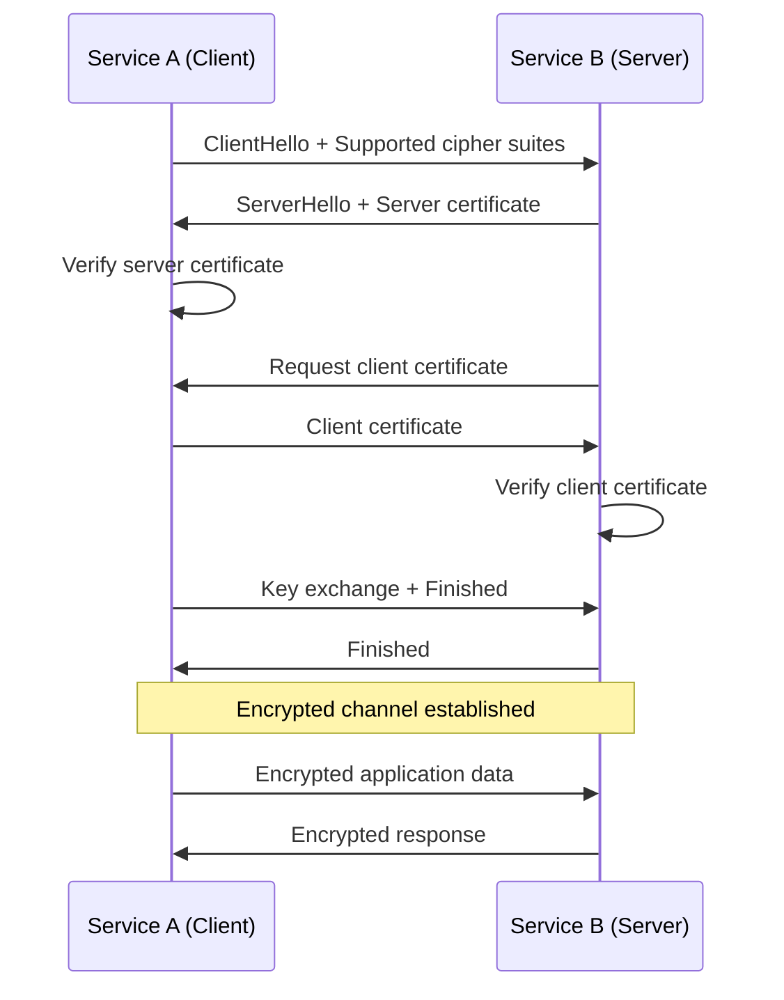
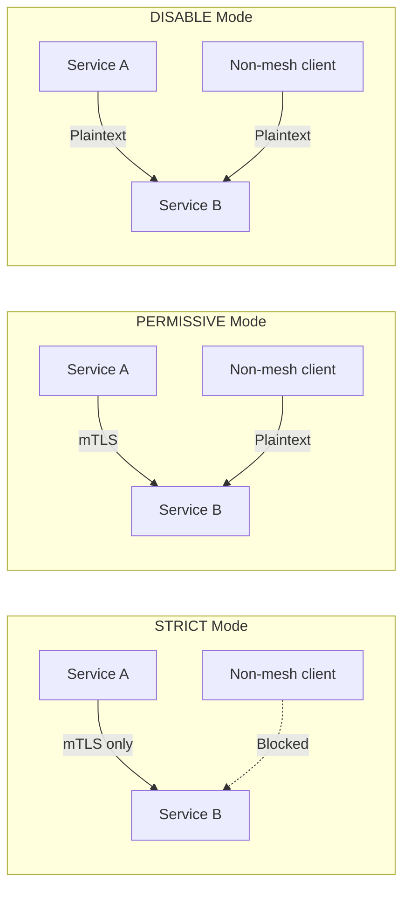
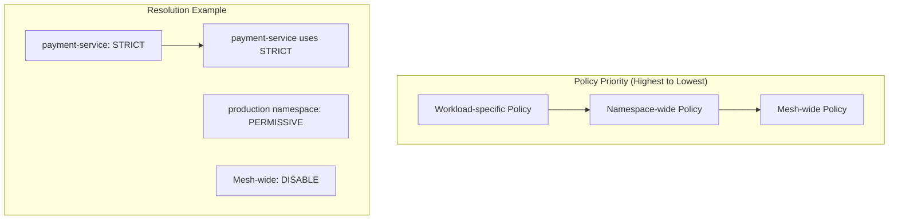
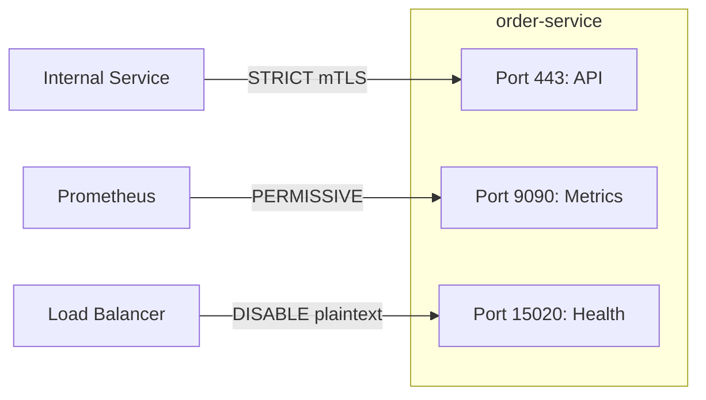
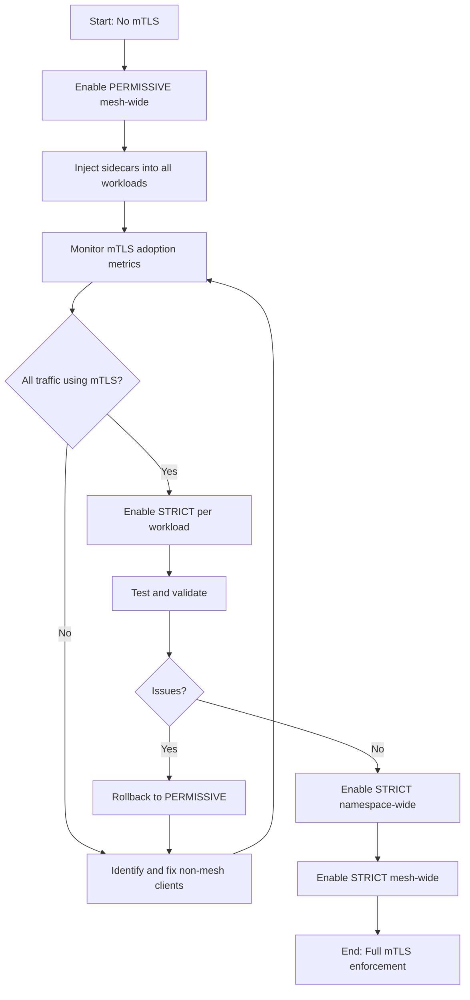

# How to Create Istio PeerAuthentication

Author: [nawazdhandala](https://github.com/nawazdhandala)

Tags: Istio, Kubernetes, ServiceMesh, mTLS

Description: Configure mutual TLS enforcement in Istio using PeerAuthentication policies for secure service-to-service communication.

---

In a microservices architecture, services constantly communicate with each other. Without encryption and mutual authentication, any compromised pod can intercept traffic or impersonate other services. Istio's PeerAuthentication resource lets you enforce mutual TLS (mTLS) to ensure all service-to-service traffic is encrypted and authenticated.

## What is Mutual TLS?

Regular TLS (like HTTPS) only verifies the server's identity. Mutual TLS goes further by requiring both parties to present certificates. The client verifies the server, and the server verifies the client.



With Istio, the sidecar proxies (Envoy) handle all the certificate management, rotation, and TLS handshakes automatically. You just need to configure the policies.

## PeerAuthentication Modes

Istio offers three mTLS modes:

| Mode | Description | Use Case |
|------|-------------|----------|
| STRICT | Only mTLS traffic allowed | Production workloads requiring full encryption |
| PERMISSIVE | Accept both mTLS and plaintext | Migration period, debugging |
| DISABLE | No mTLS enforcement | Legacy services that cannot support mTLS |



## Namespace-Wide PeerAuthentication

The most common approach is to apply a policy to an entire namespace.

### Enable STRICT mTLS for a Namespace

```yaml
# peer-auth-namespace.yaml
# Enforces mTLS for all workloads in the production namespace
apiVersion: security.istio.io/v1beta1
kind: PeerAuthentication
metadata:
  name: default
  namespace: production
spec:
  # Empty selector means this applies to all workloads in the namespace
  mtls:
    mode: STRICT
```

Apply the policy:

```bash
kubectl apply -f peer-auth-namespace.yaml
```

### Enable PERMISSIVE Mode for Migration

```yaml
# peer-auth-permissive.yaml
# Allows both mTLS and plaintext during migration
apiVersion: security.istio.io/v1beta1
kind: PeerAuthentication
metadata:
  name: default
  namespace: production
spec:
  mtls:
    mode: PERMISSIVE
```

## Mesh-Wide PeerAuthentication

To enforce mTLS across the entire mesh, create a policy in the Istio root namespace (usually `istio-system`).

```yaml
# peer-auth-mesh-wide.yaml
# Enforces mTLS across all namespaces in the mesh
apiVersion: security.istio.io/v1beta1
kind: PeerAuthentication
metadata:
  name: default
  namespace: istio-system  # Root namespace makes this mesh-wide
spec:
  mtls:
    mode: STRICT
```

The hierarchy of policies:
1. Workload-specific policies (highest priority)
2. Namespace-wide policies
3. Mesh-wide policies (lowest priority)



## Workload-Specific PeerAuthentication

Target specific workloads using label selectors.

### Single Workload Policy

```yaml
# peer-auth-workload.yaml
# Enforces STRICT mTLS only for the payment service
apiVersion: security.istio.io/v1beta1
kind: PeerAuthentication
metadata:
  name: payment-strict
  namespace: production
spec:
  # Target specific workloads by their labels
  selector:
    matchLabels:
      app: payment-service
  mtls:
    mode: STRICT
```

### Multiple Workloads with Same Policy

```yaml
# peer-auth-pci-zone.yaml
# Enforces STRICT mTLS for all PCI-compliant services
apiVersion: security.istio.io/v1beta1
kind: PeerAuthentication
metadata:
  name: pci-strict
  namespace: production
spec:
  selector:
    matchLabels:
      security-zone: pci
  mtls:
    mode: STRICT
```

### Exclude Specific Workloads from mTLS

When you have mesh-wide STRICT mode but need exceptions:

```yaml
# peer-auth-legacy-exception.yaml
# Disables mTLS for a legacy service that cannot support it
apiVersion: security.istio.io/v1beta1
kind: PeerAuthentication
metadata:
  name: legacy-exception
  namespace: production
spec:
  selector:
    matchLabels:
      app: legacy-service
  mtls:
    mode: DISABLE
```

## Port-Level mTLS Configuration

Sometimes a service exposes multiple ports with different security requirements. Use port-level overrides.

### Mixed Mode Per Port

```yaml
# peer-auth-port-level.yaml
# Different mTLS modes for different ports on the same service
apiVersion: security.istio.io/v1beta1
kind: PeerAuthentication
metadata:
  name: api-gateway-ports
  namespace: production
spec:
  selector:
    matchLabels:
      app: api-gateway
  mtls:
    mode: STRICT  # Default mode for unlisted ports
  portLevelMtls:
    # Health check port - allow plaintext for external load balancers
    8080:
      mode: DISABLE
    # Metrics port - allow Prometheus scraping without mTLS
    9090:
      mode: PERMISSIVE
    # Main API port - enforce strict mTLS
    443:
      mode: STRICT
```

### Common Port-Level Scenarios

```yaml
# peer-auth-monitoring.yaml
# Allow plaintext metrics scraping while keeping app traffic encrypted
apiVersion: security.istio.io/v1beta1
kind: PeerAuthentication
metadata:
  name: metrics-exception
  namespace: production
spec:
  selector:
    matchLabels:
      app: order-service
  mtls:
    mode: STRICT
  portLevelMtls:
    # Prometheus metrics endpoint
    15020:
      mode: DISABLE
    # Application metrics
    9090:
      mode: PERMISSIVE
```



## Migration Strategy: PERMISSIVE to STRICT

Migrating to strict mTLS requires careful planning. Here is a safe step-by-step approach.

### Step 1: Verify Istio Sidecar Injection

Ensure all workloads have the Istio sidecar:

```bash
# Check for pods without sidecars
kubectl get pods -A -o jsonpath='{range .items[*]}{.metadata.namespace}/{.metadata.name}: {range .spec.containers[*]}{.name} {end}{"\n"}{end}' | grep -v istio-proxy
```

### Step 2: Start with PERMISSIVE Mode

```yaml
# step1-permissive.yaml
apiVersion: security.istio.io/v1beta1
kind: PeerAuthentication
metadata:
  name: default
  namespace: production
spec:
  mtls:
    mode: PERMISSIVE
```

### Step 3: Monitor mTLS Adoption

Use Kiali or Prometheus to track mTLS usage:

```bash
# Check mTLS status with istioctl
istioctl x describe pod <pod-name> -n production

# Query Prometheus for mTLS metrics
# This shows the percentage of mTLS connections
curl -s "http://prometheus:9090/api/v1/query?query=sum(istio_requests_total{connection_security_policy=\"mutual_tls\"})/sum(istio_requests_total)" | jq '.data.result[0].value[1]'
```

### Step 4: Identify Non-mTLS Traffic

```bash
# Find services still using plaintext
istioctl proxy-config listeners <pod-name> -n production -o json | jq '.[] | select(.filterChains[].transportSocket == null) | .name'
```

### Step 5: Apply STRICT Mode Gradually

Start with non-critical namespaces:

```yaml
# step2-strict-staging.yaml
apiVersion: security.istio.io/v1beta1
kind: PeerAuthentication
metadata:
  name: default
  namespace: staging
spec:
  mtls:
    mode: STRICT
```

Then move to production workloads one by one:

```yaml
# step3-strict-workload.yaml
apiVersion: security.istio.io/v1beta1
kind: PeerAuthentication
metadata:
  name: api-strict
  namespace: production
spec:
  selector:
    matchLabels:
      app: api-service
  mtls:
    mode: STRICT
```

### Step 6: Enable Mesh-Wide STRICT Mode

Once all workloads are verified:

```yaml
# step4-strict-mesh.yaml
apiVersion: security.istio.io/v1beta1
kind: PeerAuthentication
metadata:
  name: default
  namespace: istio-system
spec:
  mtls:
    mode: STRICT
```



## Combining with DestinationRule

PeerAuthentication controls what traffic a workload accepts. DestinationRule controls what traffic a workload sends. For complete mTLS, configure both.

```yaml
# destination-rule-mtls.yaml
# Configures outbound mTLS for all services in the namespace
apiVersion: networking.istio.io/v1beta1
kind: DestinationRule
metadata:
  name: default
  namespace: production
spec:
  host: "*.production.svc.cluster.local"
  trafficPolicy:
    tls:
      mode: ISTIO_MUTUAL  # Use Istio-managed certificates
```

### DestinationRule TLS Modes

| Mode | Description |
|------|-------------|
| DISABLE | No TLS |
| SIMPLE | TLS without client certificate |
| MUTUAL | mTLS with user-provided certificates |
| ISTIO_MUTUAL | mTLS with Istio-managed certificates |

## Troubleshooting PeerAuthentication

### Check Current mTLS Status

```bash
# View authentication policies
kubectl get peerauthentications -A

# Check policy for specific workload
istioctl authn tls-check <pod-name> -n production
```

### Debug Connection Issues

```bash
# Check if sidecar is injected
kubectl get pod <pod-name> -n production -o jsonpath='{.spec.containers[*].name}'

# View proxy configuration
istioctl proxy-config cluster <pod-name> -n production

# Check for TLS errors in proxy logs
kubectl logs <pod-name> -n production -c istio-proxy | grep -i tls
```

### Common Issues and Solutions

**Issue: Connection refused after enabling STRICT mode**

Cause: Client does not have sidecar or is outside the mesh.

Solution:
```yaml
# Add exception for the port or use PERMISSIVE
apiVersion: security.istio.io/v1beta1
kind: PeerAuthentication
metadata:
  name: allow-external
  namespace: production
spec:
  selector:
    matchLabels:
      app: my-service
  portLevelMtls:
    8080:
      mode: PERMISSIVE
```

**Issue: Prometheus cannot scrape metrics**

Cause: Prometheus is outside the mesh and cannot present mTLS certificates.

Solution:
```yaml
# Allow plaintext on metrics port
apiVersion: security.istio.io/v1beta1
kind: PeerAuthentication
metadata:
  name: metrics-permissive
  namespace: production
spec:
  selector:
    matchLabels:
      app: my-service
  portLevelMtls:
    15020:
      mode: DISABLE
```

**Issue: Health checks failing from load balancer**

Cause: External load balancer cannot perform mTLS.

Solution: Use a dedicated health check port with mTLS disabled, or configure the load balancer to check the Envoy health endpoint.

## Complete Example: Production Setup

Here is a complete example for a production namespace with proper mTLS configuration.

```yaml
# production-mtls-config.yaml
---
# Namespace-wide strict mTLS
apiVersion: security.istio.io/v1beta1
kind: PeerAuthentication
metadata:
  name: default
  namespace: production
spec:
  mtls:
    mode: STRICT
---
# Exception for legacy service
apiVersion: security.istio.io/v1beta1
kind: PeerAuthentication
metadata:
  name: legacy-exception
  namespace: production
spec:
  selector:
    matchLabels:
      app: legacy-payment
  mtls:
    mode: DISABLE
---
# Port-level configuration for API gateway
apiVersion: security.istio.io/v1beta1
kind: PeerAuthentication
metadata:
  name: api-gateway-config
  namespace: production
spec:
  selector:
    matchLabels:
      app: api-gateway
  mtls:
    mode: STRICT
  portLevelMtls:
    # Health checks from external LB
    8081:
      mode: DISABLE
    # Prometheus metrics
    15020:
      mode: PERMISSIVE
---
# DestinationRule for outbound mTLS
apiVersion: networking.istio.io/v1beta1
kind: DestinationRule
metadata:
  name: default
  namespace: production
spec:
  host: "*.production.svc.cluster.local"
  trafficPolicy:
    tls:
      mode: ISTIO_MUTUAL
```

## Security Checklist

- [ ] Enable PERMISSIVE mode mesh-wide as a baseline
- [ ] Ensure all workloads have Istio sidecars injected
- [ ] Monitor mTLS adoption using Kiali or Prometheus
- [ ] Configure DestinationRules for outbound mTLS
- [ ] Add port-level exceptions only where necessary
- [ ] Document all DISABLE and PERMISSIVE exceptions
- [ ] Migrate to STRICT mode progressively
- [ ] Test authentication policies in staging first
- [ ] Set up alerts for mTLS certificate expiration
- [ ] Review and audit exceptions quarterly

---

PeerAuthentication is your first line of defense for service-to-service security in Istio. Start with PERMISSIVE mode to avoid disruption, monitor your traffic patterns, and progressively migrate to STRICT mode. Combined with AuthorizationPolicy for fine-grained access control, you can build a robust zero-trust architecture within your Kubernetes cluster.
