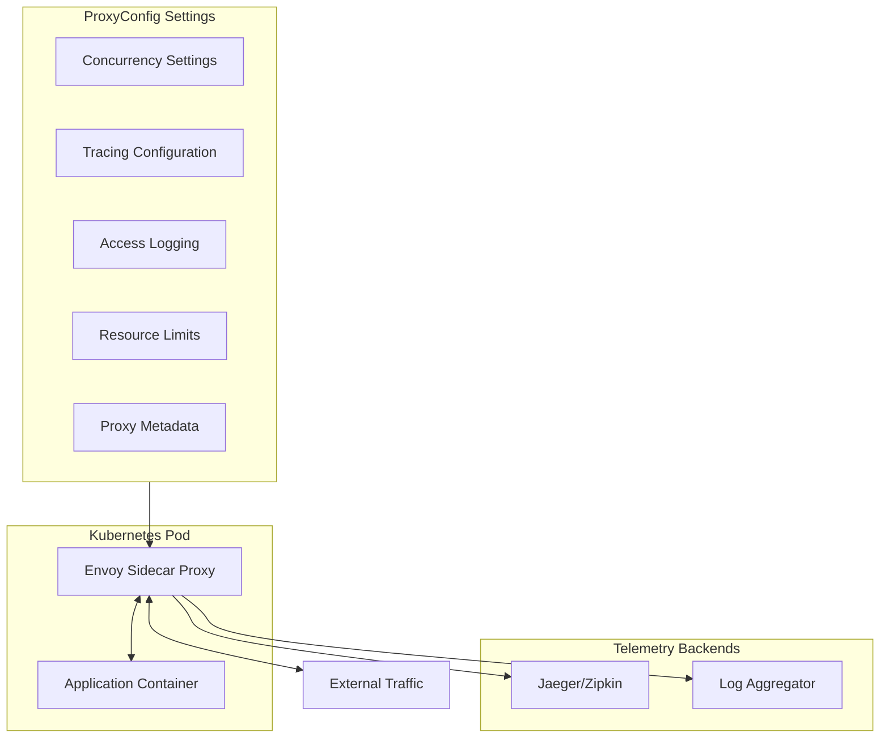
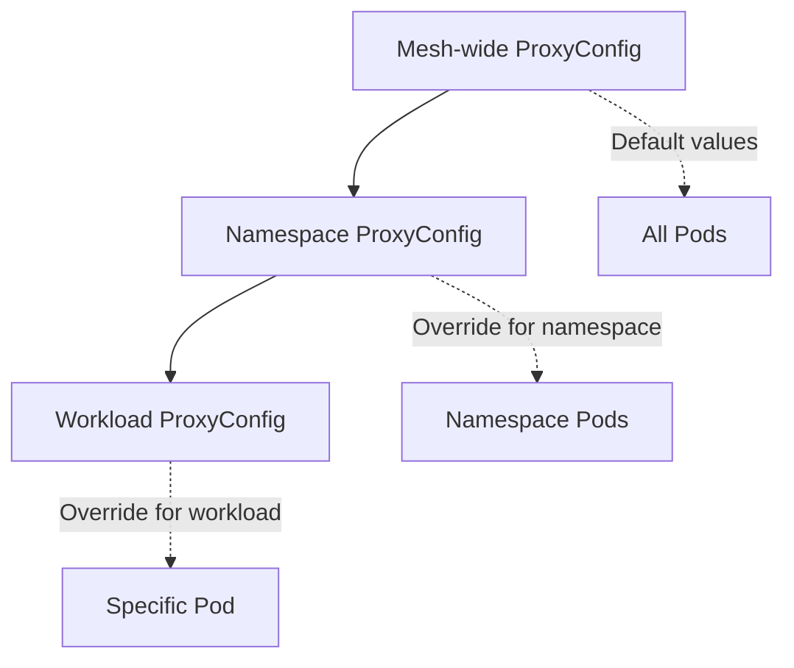
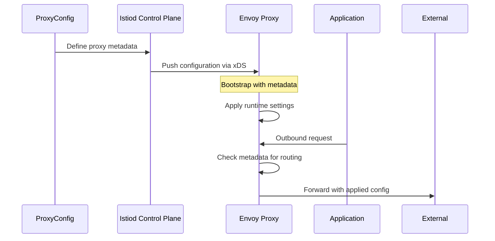

# How to Implement Istio ProxyConfig

Author: [nawazdhandala](https://github.com/nawazdhandala)

Tags: Istio, Kubernetes, ServiceMesh, Envoy

Description: A practical guide to configuring Istio sidecar proxies using ProxyConfig for fine-grained control over concurrency, tracing, logging, and runtime behavior.

---

Istio's sidecar proxy intercepts all traffic to and from your workloads. The default configuration works for most cases, but production environments often need fine-tuned proxy settings. ProxyConfig gives you that control without modifying your application code.

## Understanding ProxyConfig

ProxyConfig is an Istio resource that configures the Envoy sidecar proxy behavior. It controls how the proxy handles connections, reports telemetry, and manages resources.



### ProxyConfig Scope Levels

ProxyConfig can be applied at different scopes:

1. **Mesh-wide**: Default for all sidecars via MeshConfig
2. **Namespace**: Override for all workloads in a namespace
3. **Workload**: Specific configuration for individual pods



## Basic ProxyConfig Resource

Create a ProxyConfig resource to customize sidecar behavior:

```yaml
# proxyconfig-basic.yaml
# Basic ProxyConfig for a specific workload
apiVersion: networking.istio.io/v1beta1
kind: ProxyConfig
metadata:
  name: my-service-proxy-config
  namespace: production
spec:
  # Target specific workloads using selector
  selector:
    matchLabels:
      app: my-service
  # Number of worker threads for the proxy
  concurrency: 2
  # Environment variables for the proxy container
  environmentVariables:
    ISTIO_META_DNS_CAPTURE: "true"
```

Apply it:

```bash
kubectl apply -f proxyconfig-basic.yaml
```

## Concurrency and Resource Configuration

Concurrency controls how many worker threads the Envoy proxy uses. Setting this correctly prevents resource contention.

### Understanding Concurrency

```yaml
# proxyconfig-concurrency.yaml
# Configure proxy concurrency based on workload needs
apiVersion: networking.istio.io/v1beta1
kind: ProxyConfig
metadata:
  name: high-throughput-proxy
  namespace: production
spec:
  selector:
    matchLabels:
      app: api-gateway
  # Concurrency 0 means auto-detect based on CPU limits
  # Set explicitly for predictable behavior
  concurrency: 4
```

### Concurrency Guidelines

| Workload Type | Recommended Concurrency | Rationale |
|---------------|------------------------|-----------|
| Low traffic service | 1-2 | Minimize resource usage |
| Standard API | 2-4 | Balance throughput and resources |
| High throughput gateway | 4-8 | Handle concurrent connections |
| CPU-bound processing | Match CPU cores | Maximize parallelism |

### Resource Limits in Sidecar Injector

Configure resource limits through the sidecar injector ConfigMap or annotations:

```yaml
# deployment-with-proxy-resources.yaml
apiVersion: apps/v1
kind: Deployment
metadata:
  name: my-service
  namespace: production
spec:
  template:
    metadata:
      annotations:
        # Override default proxy resource requests
        sidecar.istio.io/proxyCPU: "100m"
        sidecar.istio.io/proxyCPULimit: "500m"
        sidecar.istio.io/proxyMemory: "128Mi"
        sidecar.istio.io/proxyMemoryLimit: "256Mi"
    spec:
      containers:
        - name: my-service
          image: my-service:latest
          resources:
            requests:
              cpu: "200m"
              memory: "256Mi"
            limits:
              cpu: "1000m"
              memory: "512Mi"
```

## Tracing Configuration

ProxyConfig lets you customize distributed tracing without changing application code.

### Configure Tracing Provider

```yaml
# proxyconfig-tracing.yaml
# Enable and configure distributed tracing
apiVersion: networking.istio.io/v1beta1
kind: ProxyConfig
metadata:
  name: tracing-config
  namespace: production
spec:
  selector:
    matchLabels:
      app: order-service
  # Tracing configuration
  tracing:
    # Sampling rate: 1.0 = 100%, 0.01 = 1%
    sampling: 10.0
    # Custom tags to add to all spans
    customTags:
      environment:
        literal:
          value: "production"
      version:
        environment:
          name: APP_VERSION
          defaultValue: "unknown"
      pod_name:
        environment:
          name: POD_NAME
```

### Tracing with Zipkin Backend

```yaml
# proxyconfig-zipkin.yaml
apiVersion: networking.istio.io/v1beta1
kind: ProxyConfig
metadata:
  name: zipkin-tracing
  namespace: production
spec:
  selector:
    matchLabels:
      app: payment-service
  tracing:
    sampling: 100.0
    # Use Zipkin collector
    zipkin:
      address: zipkin.observability.svc.cluster.local:9411
    customTags:
      service.name:
        literal:
          value: "payment-service"
```

### Configure Trace Context Propagation

```yaml
# meshconfig-tracing.yaml
# Mesh-wide tracing configuration in IstioOperator
apiVersion: install.istio.io/v1alpha1
kind: IstioOperator
spec:
  meshConfig:
    defaultConfig:
      tracing:
        sampling: 10.0
        # Propagate multiple trace context formats
        # Useful for multi-vendor environments
    extensionProviders:
      - name: jaeger
        opentelemetry:
          service: jaeger-collector.observability.svc.cluster.local
          port: 4317
```

## Access Logging Configuration

Configure access logs to capture request and response details for debugging and auditing.

### Enable Access Logging

```yaml
# proxyconfig-access-logging.yaml
apiVersion: networking.istio.io/v1beta1
kind: ProxyConfig
metadata:
  name: access-logging-config
  namespace: production
spec:
  selector:
    matchLabels:
      app: frontend
  # Access log file path
  # /dev/stdout sends logs to container stdout
  accessLogFile: "/dev/stdout"
  # Access log encoding: TEXT or JSON
  accessLogEncoding: JSON
```

### Custom Access Log Format

```yaml
# telemetry-access-log.yaml
# Use Telemetry API for advanced access log configuration
apiVersion: telemetry.istio.io/v1alpha1
kind: Telemetry
metadata:
  name: custom-access-log
  namespace: production
spec:
  selector:
    matchLabels:
      app: api-gateway
  accessLogging:
    - providers:
        - name: envoy
      filter:
        expression: "response.code >= 400"
```

### JSON Access Log with Custom Fields

```yaml
# envoyfilter-access-log.yaml
# Advanced: Custom access log format using EnvoyFilter
apiVersion: networking.istio.io/v1alpha3
kind: EnvoyFilter
metadata:
  name: custom-access-log-format
  namespace: production
spec:
  workloadSelector:
    labels:
      app: api-gateway
  configPatches:
    - applyTo: NETWORK_FILTER
      match:
        context: SIDECAR_INBOUND
        listener:
          filterChain:
            filter:
              name: "envoy.filters.network.http_connection_manager"
      patch:
        operation: MERGE
        value:
          typed_config:
            "@type": "type.googleapis.com/envoy.extensions.filters.network.http_connection_manager.v3.HttpConnectionManager"
            access_log:
              - name: envoy.access_loggers.file
                typed_config:
                  "@type": "type.googleapis.com/envoy.extensions.access_loggers.file.v3.FileAccessLog"
                  path: /dev/stdout
                  log_format:
                    json_format:
                      timestamp: "%START_TIME%"
                      method: "%REQ(:METHOD)%"
                      path: "%REQ(X-ENVOY-ORIGINAL-PATH?:PATH)%"
                      protocol: "%PROTOCOL%"
                      response_code: "%RESPONSE_CODE%"
                      response_flags: "%RESPONSE_FLAGS%"
                      duration_ms: "%DURATION%"
                      upstream_service_time: "%RESP(X-ENVOY-UPSTREAM-SERVICE-TIME)%"
                      x_request_id: "%REQ(X-REQUEST-ID)%"
                      user_agent: "%REQ(USER-AGENT)%"
                      client_ip: "%DOWNSTREAM_REMOTE_ADDRESS_WITHOUT_PORT%"
```

## Runtime Assertions and Proxy Metadata

Proxy metadata allows you to pass runtime configuration and feature flags to the Envoy proxy.

### Configure Proxy Metadata

```yaml
# proxyconfig-metadata.yaml
apiVersion: networking.istio.io/v1beta1
kind: ProxyConfig
metadata:
  name: proxy-metadata-config
  namespace: production
spec:
  selector:
    matchLabels:
      app: backend-service
  # Proxy metadata passed to Envoy bootstrap
  proxyMetadata:
    # Enable DNS capture for outbound traffic
    ISTIO_META_DNS_CAPTURE: "true"
    # Auto allocate service entry addresses
    ISTIO_META_DNS_AUTO_ALLOCATE: "true"
    # Custom metadata for routing decisions
    ISTIO_META_WORKLOAD_NAME: "backend-service"
    # Feature flags
    BOOTSTRAP_XDS_AGENT: "true"
```

### Environment Variables for Runtime Configuration

```yaml
# proxyconfig-env-vars.yaml
apiVersion: networking.istio.io/v1beta1
kind: ProxyConfig
metadata:
  name: runtime-config
  namespace: production
spec:
  selector:
    matchLabels:
      app: my-service
  environmentVariables:
    # Proxy log level: trace, debug, info, warning, error, critical
    ISTIO_META_PROXY_LOG_LEVEL: "warning"
    # Connection draining duration
    ISTIO_META_DRAIN_DURATION: "45s"
    # Enable Envoy admin endpoint (use with caution in production)
    ISTIO_META_ENABLE_STATS_FILTER: "true"
```

### Proxy Metadata Flow



## Practical Examples

### High-Performance API Gateway

```yaml
# proxyconfig-api-gateway.yaml
# Optimized configuration for high-traffic API gateway
apiVersion: networking.istio.io/v1beta1
kind: ProxyConfig
metadata:
  name: api-gateway-config
  namespace: istio-ingress
spec:
  selector:
    matchLabels:
      app: istio-ingressgateway
  # High concurrency for gateway workloads
  concurrency: 8
  # JSON logging for structured log aggregation
  accessLogFile: "/dev/stdout"
  accessLogEncoding: JSON
  # Tracing at lower rate for high volume
  tracing:
    sampling: 1.0
  # Runtime optimizations
  proxyMetadata:
    # Increase connection pool size
    ISTIO_META_UPSTREAM_CLUSTER_MAX_CONNECTIONS: "10000"
    # Enable HTTP/2 for upstream connections
    ISTIO_META_HTTP10: "false"
  environmentVariables:
    # Reduce drain time for faster rollouts
    ISTIO_META_DRAIN_DURATION: "30s"
```

### Debug Configuration for Troubleshooting

```yaml
# proxyconfig-debug.yaml
# Verbose configuration for debugging proxy issues
apiVersion: networking.istio.io/v1beta1
kind: ProxyConfig
metadata:
  name: debug-config
  namespace: staging
spec:
  selector:
    matchLabels:
      app: problematic-service
  # Detailed text logging
  accessLogFile: "/dev/stdout"
  accessLogEncoding: TEXT
  # Capture all traces
  tracing:
    sampling: 100.0
    customTags:
      debug:
        literal:
          value: "true"
  environmentVariables:
    # Enable debug logging
    ISTIO_META_PROXY_LOG_LEVEL: "debug"
  proxyMetadata:
    # Enable all stats
    ISTIO_META_ENABLE_STATS_FILTER: "true"
```

### Secure Service with Minimal Logging

```yaml
# proxyconfig-secure.yaml
# Configuration for security-sensitive workloads
apiVersion: networking.istio.io/v1beta1
kind: ProxyConfig
metadata:
  name: secure-service-config
  namespace: production
spec:
  selector:
    matchLabels:
      app: payment-processor
      security: pci
  # Minimal concurrency for security isolation
  concurrency: 2
  # Disable access logs to avoid PII exposure
  accessLogFile: ""
  # Low sampling to reduce trace data exposure
  tracing:
    sampling: 1.0
    customTags:
      compliance:
        literal:
          value: "pci-dss"
  proxyMetadata:
    # Disable stats to reduce attack surface
    ISTIO_META_ENABLE_STATS_FILTER: "false"
```

### Multi-Cluster Configuration

```yaml
# proxyconfig-multicluster.yaml
# Configuration for services in multi-cluster mesh
apiVersion: networking.istio.io/v1beta1
kind: ProxyConfig
metadata:
  name: multicluster-config
  namespace: production
spec:
  selector:
    matchLabels:
      app: cross-cluster-service
  proxyMetadata:
    # Cluster identification
    ISTIO_META_CLUSTER_ID: "cluster-east"
    # Network for cross-cluster routing
    ISTIO_META_NETWORK: "network-east"
    # DNS capture for ServiceEntry resolution
    ISTIO_META_DNS_CAPTURE: "true"
    ISTIO_META_DNS_AUTO_ALLOCATE: "true"
  tracing:
    sampling: 10.0
    customTags:
      cluster:
        literal:
          value: "cluster-east"
      region:
        literal:
          value: "us-east-1"
```

## Verifying ProxyConfig

### Check Applied Configuration

```bash
# View ProxyConfig resources
kubectl get proxyconfig -n production

# Describe specific ProxyConfig
kubectl describe proxyconfig my-service-proxy-config -n production

# Check if configuration is applied to a pod
istioctl proxy-config bootstrap <pod-name> -n production | grep -A 10 "metadata"
```

### Validate Proxy Configuration

```bash
# Get proxy configuration for a specific pod
istioctl proxy-config all <pod-name> -n production

# Check listener configuration
istioctl proxy-config listener <pod-name> -n production

# Verify tracing configuration
istioctl proxy-config bootstrap <pod-name> -n production | grep -A 20 "tracing"

# Check access log settings
istioctl proxy-config bootstrap <pod-name> -n production | grep -A 10 "access_log"
```

### Debug Configuration Issues

```bash
# Check Istiod logs for configuration push errors
kubectl logs -n istio-system deployment/istiod | grep -i error

# Verify proxy receives configuration
istioctl proxy-status

# Get proxy configuration diff
istioctl proxy-config diff <pod-name> -n production

# Analyze configuration for issues
istioctl analyze -n production
```

## Best Practices

### Configuration Management

1. **Use GitOps**: Store ProxyConfig in version control alongside other Kubernetes manifests
2. **Environment separation**: Different configurations for development, staging, and production
3. **Label selectors**: Use specific labels to target workloads accurately
4. **Documentation**: Comment each configuration setting with its purpose

### Performance Tuning

1. **Set concurrency explicitly**: Do not rely on auto-detection in production
2. **Match resources to workload**: API gateways need more resources than internal services
3. **Tune tracing sampling**: High sampling rates impact performance at scale
4. **Monitor proxy metrics**: Track envoy_server_memory_allocated and envoy_server_concurrency

### Security Considerations

1. **Minimize logging for sensitive data**: Disable access logs for PCI/HIPAA workloads
2. **Control tracing exposure**: Custom tags should not include sensitive information
3. **Restrict admin endpoints**: Disable Envoy admin in production unless needed
4. **Regular audits**: Review ProxyConfig changes as part of security reviews

---

ProxyConfig gives you fine-grained control over Istio sidecar behavior without touching application code. Start with sensible defaults, measure your workload characteristics, and tune configurations based on actual performance data. The key is matching proxy resources and features to your specific workload requirements.
