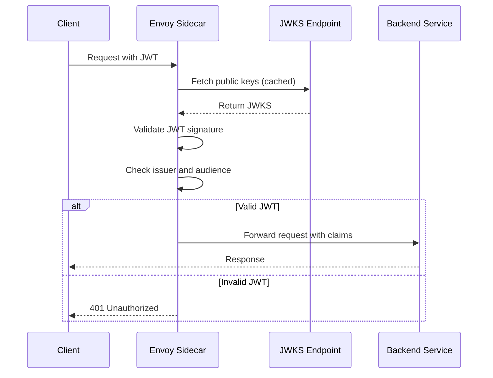
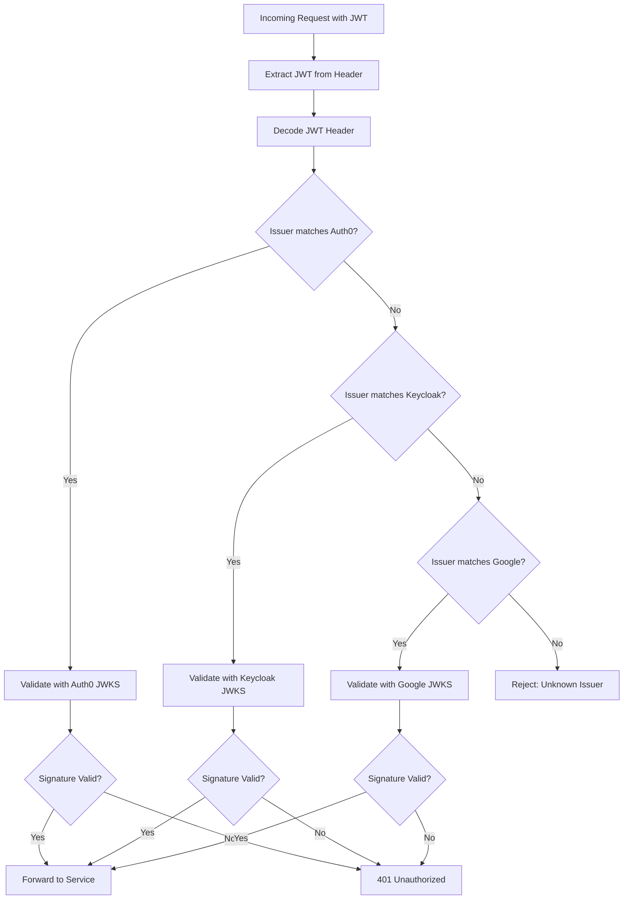

# How to Build Istio RequestAuthentication

Author: [nawazdhandala](https://github.com/nawazdhandala)

Tags: Istio, Kubernetes, ServiceMesh, JWT

Description: A practical guide to configuring Istio RequestAuthentication for JWT validation with multiple providers and token forwarding.

---

Istio RequestAuthentication lets you validate JSON Web Tokens (JWTs) at the service mesh layer. Instead of each microservice implementing its own JWT validation logic, Istio's Envoy proxies handle it for you. This centralizes authentication and keeps your application code focused on business logic.

## How JWT Validation Works in Istio

When a request arrives at an Istio sidecar proxy, the RequestAuthentication policy intercepts it. The proxy extracts the JWT from the request (typically from the Authorization header), validates the signature using public keys fetched from a JWKS endpoint, and checks claims like issuer and audience.



## Basic RequestAuthentication

Here is a minimal configuration that validates JWTs from a single issuer.

```yaml
# requestauthentication-basic.yaml
# Validates JWTs issued by Auth0
apiVersion: security.istio.io/v1
kind: RequestAuthentication
metadata:
  name: jwt-auth
  namespace: production
spec:
  # Apply to all workloads in the namespace
  selector:
    matchLabels:
      app: api-gateway
  jwtRules:
    # The issuer must match the 'iss' claim in the JWT
    - issuer: "https://your-tenant.auth0.com/"
      # JWKS URI where Istio fetches public keys
      jwksUri: "https://your-tenant.auth0.com/.well-known/jwks.json"
```

Apply the policy:

```bash
kubectl apply -f requestauthentication-basic.yaml
```

## JWT Rules Configuration

### Issuer and Audiences

The `issuer` field must exactly match the `iss` claim in the JWT. The `audiences` field validates the `aud` claim.

```yaml
# requestauthentication-audiences.yaml
# Validates JWTs with specific issuer and audience claims
apiVersion: security.istio.io/v1
kind: RequestAuthentication
metadata:
  name: jwt-auth-with-audiences
  namespace: production
spec:
  selector:
    matchLabels:
      app: api-gateway
  jwtRules:
    - issuer: "https://accounts.google.com"
      # JWKS endpoint for Google OAuth
      jwksUri: "https://www.googleapis.com/oauth2/v3/certs"
      # Only accept tokens intended for these audiences
      audiences:
        - "your-client-id.apps.googleusercontent.com"
        - "your-mobile-client-id.apps.googleusercontent.com"
```

If `audiences` is not specified, the audience claim is not validated. Always specify audiences in production to prevent token confusion attacks.

### JWKS URI for Public Key Retrieval

Istio fetches public keys from the JWKS URI to validate JWT signatures. The keys are cached and refreshed periodically.

```yaml
# requestauthentication-jwks.yaml
# Configuration with JWKS caching options
apiVersion: security.istio.io/v1
kind: RequestAuthentication
metadata:
  name: jwt-auth-jwks
  namespace: production
spec:
  selector:
    matchLabels:
      app: api-gateway
  jwtRules:
    - issuer: "https://your-keycloak.example.com/realms/production"
      # Keycloak JWKS endpoint
      jwksUri: "https://your-keycloak.example.com/realms/production/protocol/openid-connect/certs"
```

For identity providers, common JWKS URI patterns are:

| Provider | JWKS URI Pattern |
|----------|------------------|
| Auth0 | `https://{tenant}.auth0.com/.well-known/jwks.json` |
| Okta | `https://{domain}/oauth2/default/v1/keys` |
| Keycloak | `https://{host}/realms/{realm}/protocol/openid-connect/certs` |
| Google | `https://www.googleapis.com/oauth2/v3/certs` |
| Azure AD | `https://login.microsoftonline.com/{tenant}/discovery/v2.0/keys` |

### Custom Token Locations

By default, Istio looks for JWTs in the Authorization header with Bearer prefix. You can specify alternative locations.

```yaml
# requestauthentication-custom-locations.yaml
# Extract JWT from custom header or query parameter
apiVersion: security.istio.io/v1
kind: RequestAuthentication
metadata:
  name: jwt-auth-custom-location
  namespace: production
spec:
  selector:
    matchLabels:
      app: api-gateway
  jwtRules:
    - issuer: "https://auth.example.com"
      jwksUri: "https://auth.example.com/.well-known/jwks.json"
      # Look for JWT in these locations (checked in order)
      fromHeaders:
        # Standard Authorization header
        - name: Authorization
          prefix: "Bearer "
        # Custom header for legacy clients
        - name: X-Auth-Token
      fromParams:
        # Query parameter for WebSocket connections
        - "access_token"
```

## Multiple JWT Providers Configuration

Many applications need to accept JWTs from multiple identity providers. You can configure multiple `jwtRules` entries.

```yaml
# requestauthentication-multi-provider.yaml
# Accept JWTs from multiple identity providers
apiVersion: security.istio.io/v1
kind: RequestAuthentication
metadata:
  name: multi-provider-auth
  namespace: production
spec:
  selector:
    matchLabels:
      app: api-gateway
  jwtRules:
    # Auth0 for external users
    - issuer: "https://your-tenant.auth0.com/"
      jwksUri: "https://your-tenant.auth0.com/.well-known/jwks.json"
      audiences:
        - "external-api-client"
      # Forward original token to upstream services
      forwardOriginalToken: true

    # Keycloak for internal services
    - issuer: "https://keycloak.internal.example.com/realms/services"
      jwksUri: "https://keycloak.internal.example.com/realms/services/protocol/openid-connect/certs"
      audiences:
        - "internal-services"
      forwardOriginalToken: true

    # Google for G Suite users
    - issuer: "https://accounts.google.com"
      jwksUri: "https://www.googleapis.com/oauth2/v3/certs"
      audiences:
        - "your-google-client-id.apps.googleusercontent.com"
      forwardOriginalToken: true
```



## Forwarding Original Token to Upstream

When `forwardOriginalToken` is true, Istio forwards the original JWT to the upstream service. This lets your application extract custom claims or perform additional validation.

```yaml
# requestauthentication-forward-token.yaml
# Forward validated JWT to backend services
apiVersion: security.istio.io/v1
kind: RequestAuthentication
metadata:
  name: jwt-auth-forward
  namespace: production
spec:
  selector:
    matchLabels:
      app: api-gateway
  jwtRules:
    - issuer: "https://auth.example.com"
      jwksUri: "https://auth.example.com/.well-known/jwks.json"
      audiences:
        - "api-service"
      # Forward the original JWT to backend services
      forwardOriginalToken: true
      # Also forward specific claims as headers
      outputClaimToHeaders:
        # Extract 'sub' claim and add as X-User-Id header
        - header: "X-User-Id"
          claim: "sub"
        # Extract 'email' claim and add as X-User-Email header
        - header: "X-User-Email"
          claim: "email"
        # Extract custom 'roles' claim
        - header: "X-User-Roles"
          claim: "roles"
```

Your backend service can now access user information without parsing the JWT:

```python
# Backend service can read extracted claims from headers
from fastapi import FastAPI, Header

app = FastAPI()

@app.get("/profile")
async def get_profile(
    x_user_id: str = Header(...),
    x_user_email: str = Header(...),
    x_user_roles: str = Header(default="")
):
    return {
        "user_id": x_user_id,
        "email": x_user_email,
        "roles": x_user_roles.split(",") if x_user_roles else []
    }
```

## Combining with AuthorizationPolicy

RequestAuthentication only validates tokens. To actually require authentication, combine it with AuthorizationPolicy.

```yaml
# requestauthentication-with-authz.yaml
# Complete authentication and authorization setup
---
# Step 1: Validate JWTs (but allow unauthenticated requests through)
apiVersion: security.istio.io/v1
kind: RequestAuthentication
metadata:
  name: jwt-auth
  namespace: production
spec:
  selector:
    matchLabels:
      app: api-gateway
  jwtRules:
    - issuer: "https://auth.example.com"
      jwksUri: "https://auth.example.com/.well-known/jwks.json"
      audiences:
        - "api-service"
      forwardOriginalToken: true
---
# Step 2: Require valid JWT for all requests
apiVersion: security.istio.io/v1
kind: AuthorizationPolicy
metadata:
  name: require-jwt
  namespace: production
spec:
  selector:
    matchLabels:
      app: api-gateway
  action: ALLOW
  rules:
    - from:
        - source:
            # Require a valid JWT (any issuer configured above)
            requestPrincipals: ["*"]
---
# Step 3: Allow health checks without authentication
apiVersion: security.istio.io/v1
kind: AuthorizationPolicy
metadata:
  name: allow-health-checks
  namespace: production
spec:
  selector:
    matchLabels:
      app: api-gateway
  action: ALLOW
  rules:
    - to:
        - operation:
            paths: ["/health", "/ready", "/metrics"]
```

## Role-Based Access Control with JWT Claims

Use JWT claims to implement RBAC in Istio.

```yaml
# requestauthentication-rbac.yaml
# RBAC based on JWT claims
---
apiVersion: security.istio.io/v1
kind: RequestAuthentication
metadata:
  name: jwt-auth
  namespace: production
spec:
  selector:
    matchLabels:
      app: api-gateway
  jwtRules:
    - issuer: "https://auth.example.com"
      jwksUri: "https://auth.example.com/.well-known/jwks.json"
      forwardOriginalToken: true
---
# Allow admins to access admin endpoints
apiVersion: security.istio.io/v1
kind: AuthorizationPolicy
metadata:
  name: admin-access
  namespace: production
spec:
  selector:
    matchLabels:
      app: api-gateway
  action: ALLOW
  rules:
    - from:
        - source:
            requestPrincipals: ["*"]
      to:
        - operation:
            paths: ["/admin/*"]
      when:
        # Check 'roles' claim contains 'admin'
        - key: request.auth.claims[roles]
          values: ["admin"]
---
# Allow any authenticated user to access user endpoints
apiVersion: security.istio.io/v1
kind: AuthorizationPolicy
metadata:
  name: user-access
  namespace: production
spec:
  selector:
    matchLabels:
      app: api-gateway
  action: ALLOW
  rules:
    - from:
        - source:
            requestPrincipals: ["*"]
      to:
        - operation:
            paths: ["/api/v1/*"]
```

## Testing JWT Authentication

### Generate a Test JWT

Use a tool like jwt.io or this script to generate test tokens:

```bash
# Install jwt-cli
npm install -g jwt-cli

# Generate a test JWT (for testing only, use proper signing in production)
jwt sign \
  --algorithm RS256 \
  --secret @private-key.pem \
  '{"iss":"https://auth.example.com","sub":"user123","aud":"api-service","exp":1735689600}'
```

### Test Requests

```bash
# Test without token (should fail if AuthorizationPolicy requires JWT)
curl -v http://api-gateway.production.svc.cluster.local/api/v1/users
# Expected: 403 Forbidden

# Test with valid token
TOKEN="eyJhbGciOiJSUzI1NiIsInR5cCI6IkpXVCJ9..."
curl -v -H "Authorization: Bearer $TOKEN" \
  http://api-gateway.production.svc.cluster.local/api/v1/users
# Expected: 200 OK

# Test with invalid token
curl -v -H "Authorization: Bearer invalid-token" \
  http://api-gateway.production.svc.cluster.local/api/v1/users
# Expected: 401 Unauthorized
```

### Debug JWT Validation

```bash
# Check RequestAuthentication status
kubectl get requestauthentication -n production

# View Envoy proxy logs for JWT errors
kubectl logs -n production deployment/api-gateway -c istio-proxy | grep -i jwt

# Check if JWKS endpoint is reachable from the proxy
kubectl exec -n production deployment/api-gateway -c istio-proxy -- \
  curl -s https://auth.example.com/.well-known/jwks.json
```

## Production Best Practices

### Use Inline JWKS for Air-Gapped Environments

If your cluster cannot reach external JWKS endpoints, embed keys directly:

```yaml
# requestauthentication-inline-jwks.yaml
# Embed JWKS directly for air-gapped environments
apiVersion: security.istio.io/v1
kind: RequestAuthentication
metadata:
  name: jwt-auth-inline
  namespace: production
spec:
  selector:
    matchLabels:
      app: api-gateway
  jwtRules:
    - issuer: "https://auth.internal.example.com"
      # Embed JWKS directly instead of fetching from URI
      jwks: |
        {
          "keys": [
            {
              "kty": "RSA",
              "alg": "RS256",
              "use": "sig",
              "kid": "key-id-1",
              "n": "0vx7agoebGcQ...",
              "e": "AQAB"
            }
          ]
        }
```

### Namespace-Wide Authentication

Apply to all workloads in a namespace by omitting the selector:

```yaml
# requestauthentication-namespace.yaml
# Apply JWT validation to all workloads in namespace
apiVersion: security.istio.io/v1
kind: RequestAuthentication
metadata:
  name: jwt-auth-namespace
  namespace: production
spec:
  # No selector means it applies to all workloads
  jwtRules:
    - issuer: "https://auth.example.com"
      jwksUri: "https://auth.example.com/.well-known/jwks.json"
```

### Mesh-Wide Authentication

Apply to all workloads in the mesh using the root namespace:

```yaml
# requestauthentication-mesh.yaml
# Apply JWT validation mesh-wide
apiVersion: security.istio.io/v1
kind: RequestAuthentication
metadata:
  name: jwt-auth-mesh
  namespace: istio-system  # Root namespace for mesh-wide policies
spec:
  jwtRules:
    - issuer: "https://auth.example.com"
      jwksUri: "https://auth.example.com/.well-known/jwks.json"
```

## Common Issues and Solutions

| Issue | Cause | Solution |
|-------|-------|----------|
| 401 with valid token | JWKS fetch failed | Check network connectivity to JWKS endpoint |
| 401 with "Jwt issuer is not configured" | Issuer mismatch | Ensure `issuer` exactly matches `iss` claim |
| 401 with "Jwt audience is not allowed" | Audience mismatch | Add correct audience to `audiences` list |
| Token not validated | No AuthorizationPolicy | Add AuthorizationPolicy to require JWT |
| Claims not forwarded | Missing config | Set `forwardOriginalToken: true` |

---

Istio RequestAuthentication moves JWT validation from your application code to the service mesh layer. Combined with AuthorizationPolicy, it provides a powerful and centralized way to secure your microservices. Start with basic issuer validation, add audience checks, and gradually implement claim-based RBAC as your needs grow.
