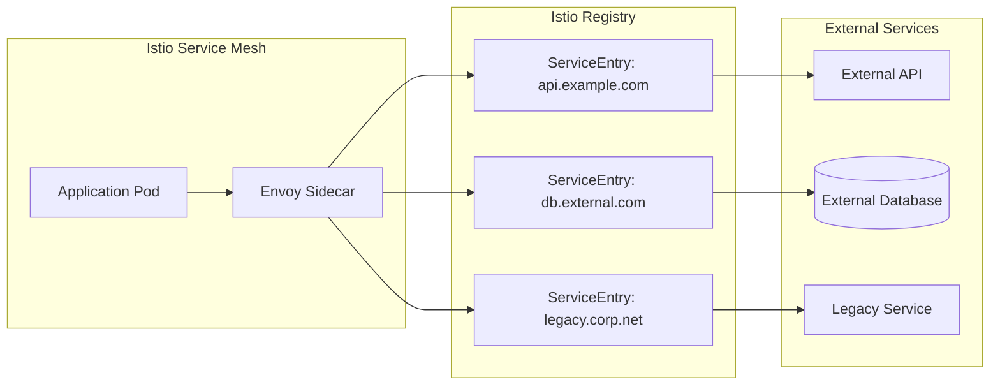
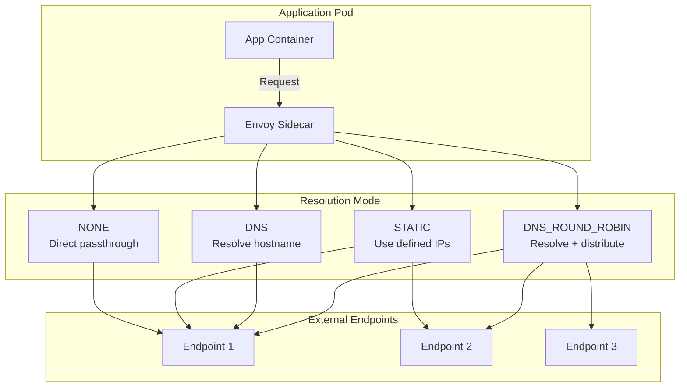
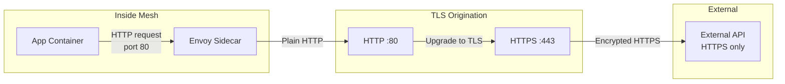

# How to Implement Istio ServiceEntry Advanced

Author: [nawazdhandala](https://github.com/nawazdhandala)

Tags: Istio, Kubernetes, ServiceMesh, ExternalServices

Description: Master Istio ServiceEntry patterns for integrating external services with DNS resolution, TLS origination, and health checking.

---

When your mesh services need to communicate with external APIs, databases, or third-party services, Istio ServiceEntry is your gateway to controlled, observable, and secure external traffic. This guide covers advanced patterns that go beyond basic configurations.

## Understanding ServiceEntry

ServiceEntry allows you to add external services to Istio's internal service registry. Once registered, you can apply traffic management, security policies, and observability to external traffic just like internal services.



## Resolution Modes Explained

Istio supports three resolution modes that determine how traffic reaches external endpoints.

### NONE - Direct IP Connection

Use when clients already know the exact IP addresses. Istio passes traffic through without DNS resolution.

```yaml
# ServiceEntry for a fixed IP endpoint
# Use case: On-premises database with static IP
apiVersion: networking.istio.io/v1beta1
kind: ServiceEntry
metadata:
  name: onprem-database
  namespace: production
spec:
  hosts:
    - db.internal.corp  # Hostname used by applications
  location: MESH_EXTERNAL
  ports:
    - number: 5432
      name: postgres
      protocol: TCP
  resolution: NONE  # No DNS resolution, use endpoint IPs directly
```

### STATIC - Explicit Endpoint IPs

Define specific IP addresses for endpoints. Useful when you know all endpoint IPs upfront and want explicit control.

```yaml
# ServiceEntry with static IP endpoints
# Use case: External service with known, stable IPs
apiVersion: networking.istio.io/v1beta1
kind: ServiceEntry
metadata:
  name: payment-gateway
  namespace: production
spec:
  hosts:
    - payments.provider.com
  location: MESH_EXTERNAL
  ports:
    - number: 443
      name: https
      protocol: HTTPS
  resolution: STATIC
  endpoints:
    # Primary endpoint in US region
    - address: 203.0.113.10
      ports:
        https: 443
      labels:
        region: us-east
        priority: primary
    # Secondary endpoint in EU region
    - address: 203.0.113.20
      ports:
        https: 443
      labels:
        region: eu-west
        priority: secondary
    # Disaster recovery endpoint
    - address: 203.0.113.30
      ports:
        https: 443
      labels:
        region: ap-south
        priority: dr
```

### DNS - Standard DNS Resolution

Istio resolves the hostname using DNS and caches the results. Best for services with dynamic IPs managed by DNS.

```yaml
# ServiceEntry with DNS resolution
# Use case: Cloud APIs with DNS-managed endpoints
apiVersion: networking.istio.io/v1beta1
kind: ServiceEntry
metadata:
  name: cloud-storage-api
  namespace: production
spec:
  hosts:
    - storage.googleapis.com
  location: MESH_EXTERNAL
  ports:
    - number: 443
      name: https
      protocol: HTTPS
  resolution: DNS  # Resolve hostname via DNS
```

### DNS_ROUND_ROBIN - Load Balanced DNS

Distributes traffic across all IP addresses returned by DNS. Ideal for external services that return multiple A records.

```yaml
# ServiceEntry with DNS round-robin
# Use case: External service behind DNS load balancing
apiVersion: networking.istio.io/v1beta1
kind: ServiceEntry
metadata:
  name: analytics-cluster
  namespace: production
spec:
  hosts:
    - analytics.dataservice.io
  location: MESH_EXTERNAL
  ports:
    - number: 443
      name: https
      protocol: HTTPS
  resolution: DNS_ROUND_ROBIN  # Distribute across all DNS results
```

## Traffic Flow Architecture



## Endpoint Health Checking

Configure active health checks to automatically remove unhealthy endpoints from the load balancing pool.

```yaml
# ServiceEntry with health checking via DestinationRule
apiVersion: networking.istio.io/v1beta1
kind: ServiceEntry
metadata:
  name: external-api-with-health
  namespace: production
spec:
  hosts:
    - api.external-service.com
  location: MESH_EXTERNAL
  ports:
    - number: 443
      name: https
      protocol: HTTPS
  resolution: STATIC
  endpoints:
    - address: 198.51.100.1
      ports:
        https: 443
    - address: 198.51.100.2
      ports:
        https: 443
    - address: 198.51.100.3
      ports:
        https: 443
---
# DestinationRule for health checking configuration
apiVersion: networking.istio.io/v1beta1
kind: DestinationRule
metadata:
  name: external-api-health-check
  namespace: production
spec:
  host: api.external-service.com
  trafficPolicy:
    connectionPool:
      tcp:
        maxConnections: 100
        connectTimeout: 5s
      http:
        h2UpgradePolicy: UPGRADE
        maxRequestsPerConnection: 100
    outlierDetection:
      # Eject endpoints after 5 consecutive 5xx errors
      consecutive5xxErrors: 5
      # Check every 30 seconds
      interval: 30s
      # Keep ejected for 60 seconds before retry
      baseEjectionTime: 60s
      # Maximum 50% of endpoints can be ejected
      maxEjectionPercent: 50
      # Consider gateway errors (502, 503, 504) as failures
      consecutiveGatewayErrors: 3
      # Minimum 2 healthy hosts required
      minHealthPercent: 20
```

### Advanced Health Check with HTTP Probing

```yaml
# Comprehensive health checking for HTTP endpoints
apiVersion: networking.istio.io/v1beta1
kind: DestinationRule
metadata:
  name: api-advanced-health
  namespace: production
spec:
  host: api.partner-service.com
  trafficPolicy:
    outlierDetection:
      # Consecutive errors before ejection
      consecutive5xxErrors: 3
      consecutiveGatewayErrors: 2
      # Split traffic based on locality
      splitExternalLocalOriginErrors: true
      # Failure detection timing
      interval: 10s
      baseEjectionTime: 30s
      maxEjectionPercent: 100
      # Success threshold to return to pool
      consecutiveLocalOriginFailures: 5
    connectionPool:
      tcp:
        maxConnections: 50
        connectTimeout: 3s
        tcpKeepalive:
          time: 7200s
          interval: 75s
          probes: 10
      http:
        maxRequestsPerConnection: 50
        maxRetries: 3
        idleTimeout: 60s
```

## TLS Origination for External HTTPS Services

When your application speaks plain HTTP internally but the external service requires HTTPS, configure TLS origination at the sidecar.



### Basic TLS Origination

```yaml
# ServiceEntry for external HTTPS service
apiVersion: networking.istio.io/v1beta1
kind: ServiceEntry
metadata:
  name: external-https-api
  namespace: production
spec:
  hosts:
    - api.secure-service.com
  location: MESH_EXTERNAL
  ports:
    # Application connects on port 80 (HTTP)
    - number: 80
      name: http-port
      protocol: HTTP
      targetPort: 443  # Forward to HTTPS port
    # Also allow direct HTTPS
    - number: 443
      name: https-port
      protocol: HTTPS
  resolution: DNS
---
# DestinationRule to originate TLS
apiVersion: networking.istio.io/v1beta1
kind: DestinationRule
metadata:
  name: external-https-api-tls
  namespace: production
spec:
  host: api.secure-service.com
  trafficPolicy:
    portLevelSettings:
      - port:
          number: 80
        tls:
          mode: SIMPLE  # Originate TLS for outbound connections
          sni: api.secure-service.com
```

### Mutual TLS (mTLS) Origination

For external services requiring client certificates:

```yaml
# ServiceEntry for mTLS external service
apiVersion: networking.istio.io/v1beta1
kind: ServiceEntry
metadata:
  name: mtls-external-service
  namespace: production
spec:
  hosts:
    - secure.partner-api.com
  location: MESH_EXTERNAL
  ports:
    - number: 443
      name: https
      protocol: HTTPS
  resolution: DNS
---
# DestinationRule with mTLS origination
apiVersion: networking.istio.io/v1beta1
kind: DestinationRule
metadata:
  name: mtls-external-tls-config
  namespace: production
spec:
  host: secure.partner-api.com
  trafficPolicy:
    tls:
      mode: MUTUAL
      # Client certificate for authentication
      clientCertificate: /etc/certs/client.pem
      # Client private key
      privateKey: /etc/certs/client-key.pem
      # CA certificate to verify server
      caCertificates: /etc/certs/ca.pem
      sni: secure.partner-api.com
```

### Using Kubernetes Secrets for TLS Credentials

```yaml
# First, create the secret with TLS credentials
# kubectl create secret generic partner-api-certs \
#   --from-file=cert=client.pem \
#   --from-file=key=client-key.pem \
#   --from-file=cacert=ca.pem \
#   -n istio-system

# DestinationRule referencing the secret
apiVersion: networking.istio.io/v1beta1
kind: DestinationRule
metadata:
  name: mtls-with-secret
  namespace: production
spec:
  host: secure.partner-api.com
  trafficPolicy:
    tls:
      mode: MUTUAL
      credentialName: partner-api-certs  # References the secret
      sni: secure.partner-api.com
```

## Practical Integration Patterns

### Pattern 1: Multi-Region External Database

```yaml
# ServiceEntry for geo-distributed database
apiVersion: networking.istio.io/v1beta1
kind: ServiceEntry
metadata:
  name: global-database
  namespace: production
spec:
  hosts:
    - db.global-service.com
  location: MESH_EXTERNAL
  ports:
    - number: 5432
      name: postgres
      protocol: TCP
  resolution: STATIC
  endpoints:
    - address: 10.1.1.10
      locality: us-east-1/us-east-1a
      labels:
        region: us-east
    - address: 10.2.1.10
      locality: eu-west-1/eu-west-1a
      labels:
        region: eu-west
    - address: 10.3.1.10
      locality: ap-southeast-1/ap-southeast-1a
      labels:
        region: ap-southeast
---
# DestinationRule for locality-aware routing
apiVersion: networking.istio.io/v1beta1
kind: DestinationRule
metadata:
  name: global-database-routing
  namespace: production
spec:
  host: db.global-service.com
  trafficPolicy:
    connectionPool:
      tcp:
        maxConnections: 100
        connectTimeout: 10s
    outlierDetection:
      consecutive5xxErrors: 5
      interval: 30s
      baseEjectionTime: 60s
    # Enable locality-aware load balancing
    localityLbSetting:
      enabled: true
      # Prefer local region, fail over to others
      failover:
        - from: us-east-1
          to: eu-west-1
        - from: eu-west-1
          to: us-east-1
        - from: ap-southeast-1
          to: us-east-1
```

### Pattern 2: External Service with Retry and Timeout

```yaml
# ServiceEntry for unreliable external API
apiVersion: networking.istio.io/v1beta1
kind: ServiceEntry
metadata:
  name: flaky-external-api
  namespace: production
spec:
  hosts:
    - api.third-party.io
  location: MESH_EXTERNAL
  ports:
    - number: 443
      name: https
      protocol: HTTPS
  resolution: DNS
---
# VirtualService for retry configuration
apiVersion: networking.istio.io/v1beta1
kind: VirtualService
metadata:
  name: flaky-api-retry
  namespace: production
spec:
  hosts:
    - api.third-party.io
  http:
    - timeout: 30s  # Total request timeout
      retries:
        attempts: 3  # Retry up to 3 times
        perTryTimeout: 10s  # Timeout per attempt
        retryOn: "5xx,reset,connect-failure,retriable-4xx"
      route:
        - destination:
            host: api.third-party.io
            port:
              number: 443
---
# DestinationRule for connection settings
apiVersion: networking.istio.io/v1beta1
kind: DestinationRule
metadata:
  name: flaky-api-destination
  namespace: production
spec:
  host: api.third-party.io
  trafficPolicy:
    connectionPool:
      tcp:
        maxConnections: 50
        connectTimeout: 5s
      http:
        maxRequestsPerConnection: 10
        maxRetries: 3
    outlierDetection:
      consecutive5xxErrors: 3
      interval: 10s
      baseEjectionTime: 30s
```

### Pattern 3: Legacy Service with Protocol Upgrade

```yaml
# ServiceEntry for legacy HTTP service that needs to be accessed as HTTPS internally
apiVersion: networking.istio.io/v1beta1
kind: ServiceEntry
metadata:
  name: legacy-http-service
  namespace: production
spec:
  hosts:
    - legacy.internal.corp
  addresses:
    - 192.168.1.100/32  # Legacy service IP
  location: MESH_EXTERNAL
  ports:
    - number: 80
      name: http
      protocol: HTTP
  resolution: STATIC
  endpoints:
    - address: 192.168.1.100
---
# VirtualService to add headers and transform requests
apiVersion: networking.istio.io/v1beta1
kind: VirtualService
metadata:
  name: legacy-service-transform
  namespace: production
spec:
  hosts:
    - legacy.internal.corp
  http:
    - match:
        - uri:
            prefix: /api/v2
      rewrite:
        uri: /api/v1  # Legacy uses v1 paths
      headers:
        request:
          add:
            X-Legacy-Client: "istio-mesh"
            X-Forwarded-Proto: "https"
      route:
        - destination:
            host: legacy.internal.corp
            port:
              number: 80
```

### Pattern 4: External Service Rate Limiting

```yaml
# ServiceEntry for rate-limited external API
apiVersion: networking.istio.io/v1beta1
kind: ServiceEntry
metadata:
  name: rate-limited-api
  namespace: production
spec:
  hosts:
    - api.limited-service.com
  location: MESH_EXTERNAL
  ports:
    - number: 443
      name: https
      protocol: HTTPS
  resolution: DNS
---
# DestinationRule to control request rate
apiVersion: networking.istio.io/v1beta1
kind: DestinationRule
metadata:
  name: rate-limited-api-config
  namespace: production
spec:
  host: api.limited-service.com
  trafficPolicy:
    connectionPool:
      tcp:
        maxConnections: 10  # Limit concurrent connections
        connectTimeout: 5s
      http:
        http1MaxPendingRequests: 50  # Queue limit
        http2MaxRequests: 100  # Max concurrent requests
        maxRequestsPerConnection: 5
        maxRetries: 2
    outlierDetection:
      # Handle 429 (rate limit) responses
      consecutive5xxErrors: 10
      consecutiveGatewayErrors: 5
      interval: 10s
      baseEjectionTime: 300s  # Back off for 5 minutes
```

## Complete Multi-Service Integration Example

```yaml
# Production-ready external service integration
# Includes: ServiceEntry, DestinationRule, VirtualService

# 1. ServiceEntry - Define the external service
apiVersion: networking.istio.io/v1beta1
kind: ServiceEntry
metadata:
  name: payment-processor
  namespace: production
  labels:
    app: payment-service
    environment: production
spec:
  hosts:
    - api.payments.example.com
  location: MESH_EXTERNAL
  ports:
    - number: 443
      name: https
      protocol: HTTPS
  resolution: DNS_ROUND_ROBIN
  exportTo:
    - "."  # Only visible in this namespace
    - "istio-system"
---
# 2. DestinationRule - Configure connection and TLS
apiVersion: networking.istio.io/v1beta1
kind: DestinationRule
metadata:
  name: payment-processor-config
  namespace: production
spec:
  host: api.payments.example.com
  trafficPolicy:
    tls:
      mode: SIMPLE
      sni: api.payments.example.com
    connectionPool:
      tcp:
        maxConnections: 100
        connectTimeout: 5s
        tcpKeepalive:
          time: 300s
          interval: 60s
      http:
        h2UpgradePolicy: UPGRADE
        maxRequestsPerConnection: 100
        maxRetries: 3
        idleTimeout: 300s
    outlierDetection:
      consecutive5xxErrors: 5
      consecutiveGatewayErrors: 3
      interval: 30s
      baseEjectionTime: 60s
      maxEjectionPercent: 50
    loadBalancer:
      simple: ROUND_ROBIN
---
# 3. VirtualService - Traffic routing and resilience
apiVersion: networking.istio.io/v1beta1
kind: VirtualService
metadata:
  name: payment-processor-routing
  namespace: production
spec:
  hosts:
    - api.payments.example.com
  http:
    # Charge endpoint - critical, longer timeout
    - match:
        - uri:
            prefix: /v1/charges
      timeout: 60s
      retries:
        attempts: 2
        perTryTimeout: 25s
        retryOn: "5xx,reset,connect-failure"
      route:
        - destination:
            host: api.payments.example.com
            port:
              number: 443
    # Status endpoint - less critical, shorter timeout
    - match:
        - uri:
            prefix: /v1/status
      timeout: 10s
      retries:
        attempts: 3
        perTryTimeout: 3s
        retryOn: "5xx,reset,connect-failure"
      route:
        - destination:
            host: api.payments.example.com
            port:
              number: 443
    # Default route
    - timeout: 30s
      retries:
        attempts: 3
        perTryTimeout: 10s
        retryOn: "5xx,reset,connect-failure"
      route:
        - destination:
            host: api.payments.example.com
            port:
              number: 443
```

## Debugging ServiceEntry Issues

### Verify ServiceEntry is Registered

```bash
# Check if ServiceEntry exists
kubectl get serviceentries -n production

# Describe for details
kubectl describe serviceentry payment-processor -n production

# Check Istio proxy configuration
istioctl proxy-config clusters <pod-name> -n production | grep payments
```

### Test Connectivity from Pod

```bash
# Exec into a pod and test
kubectl exec -it <pod-name> -n production -c istio-proxy -- \
  curl -v https://api.payments.example.com/health

# Check Envoy stats for the external service
kubectl exec -it <pod-name> -n production -c istio-proxy -- \
  pilot-agent request GET stats | grep payments
```

### Common Issues and Solutions

**Issue: Connection refused to external service**
- Verify ServiceEntry hosts match the DNS name used by application
- Check resolution mode matches your use case
- Ensure ports are correctly defined

**Issue: TLS handshake failures**
- Verify SNI is set correctly in DestinationRule
- Check if external service requires specific TLS version
- Confirm certificate chain is valid

**Issue: Requests timing out**
- Check outlierDetection settings are not too aggressive
- Verify external service is reachable from cluster
- Review connectionPool settings for bottlenecks

---

ServiceEntry transforms how your mesh interacts with the outside world. By combining resolution modes, health checking, and TLS origination, you gain the same level of control over external traffic that Istio provides for internal services. Start with basic ServiceEntries and progressively add DestinationRules and VirtualServices as your requirements grow.
