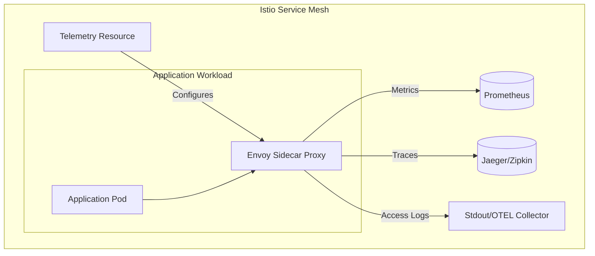
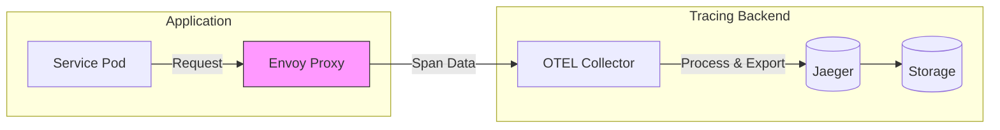
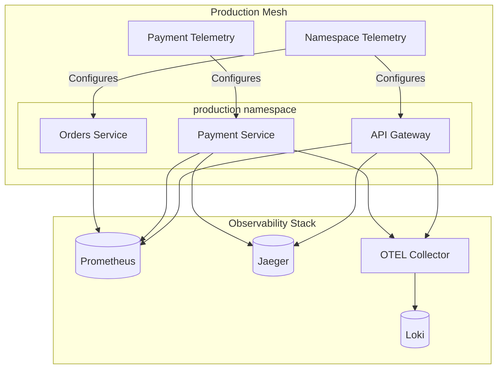

# How to Create Istio Telemetry API

Author: [nawazdhandala](https://github.com/nawazdhandala)

Tags: Istio, Kubernetes, ServiceMesh, Observability

Description: A practical guide to customizing metrics, traces, and access logging in Istio using the Telemetry API with Prometheus, Jaeger, and Zipkin providers.

---

Istio's Telemetry API gives you fine-grained control over observability data flowing through your service mesh. Instead of relying on global settings or mesh-wide configurations, you can customize metrics, tracing, and access logging per workload, per namespace, or mesh-wide.

## Understanding the Telemetry API Architecture

The Telemetry API was introduced in Istio 1.11 and became the recommended approach in Istio 1.14+. It replaces the older MeshConfig and EnvoyFilter-based approaches with a cleaner, more declarative model.



### Key Concepts

- **Telemetry Resource**: A Kubernetes CRD that defines observability behavior
- **Provider**: The backend system that receives telemetry data (Prometheus, Jaeger, Zipkin, OpenTelemetry)
- **Selector**: Determines which workloads the configuration applies to
- **Scope**: Mesh-wide (root namespace), namespace-wide, or workload-specific

## Provider Configuration

Before creating Telemetry resources, configure your providers in the MeshConfig.

### Configure Prometheus for Metrics

```yaml
# istio-config.yaml
apiVersion: install.istio.io/v1alpha1
kind: IstioOperator
spec:
  meshConfig:
    # Enable access logging to stdout
    accessLogFile: /dev/stdout

    # Define telemetry providers
    extensionProviders:
      # Prometheus provider for metrics
      - name: prometheus
        prometheus: {}

      # Jaeger provider for distributed tracing
      - name: jaeger
        zipkin:
          service: jaeger-collector.istio-system.svc.cluster.local
          port: 9411

      # Zipkin provider (alternative to Jaeger)
      - name: zipkin
        zipkin:
          service: zipkin.istio-system.svc.cluster.local
          port: 9411

      # OpenTelemetry Collector for traces
      - name: otel-tracing
        opentelemetry:
          service: otel-collector.observability.svc.cluster.local
          port: 4317

      # OpenTelemetry Collector for access logs
      - name: otel-access-logging
        envoyOtelAls:
          service: otel-collector.observability.svc.cluster.local
          port: 4317
```

Apply the configuration:

```bash
# Apply IstioOperator configuration
istioctl install -f istio-config.yaml -y

# Verify the configuration
istioctl analyze
```

## Telemetry Resource Structure

A Telemetry resource has three main sections: metrics, tracing, and accessLogging.

```yaml
apiVersion: telemetry.istio.io/v1alpha1
kind: Telemetry
metadata:
  name: example-telemetry
  namespace: default  # Namespace scope, or istio-system for mesh-wide
spec:
  # Optional: Target specific workloads
  selector:
    matchLabels:
      app: my-service

  # Metrics configuration
  metrics:
    - providers:
        - name: prometheus
      overrides:
        - match:
            metric: REQUEST_COUNT
          tagOverrides:
            custom_label:
              operation: UPSERT
              value: "my-value"

  # Tracing configuration
  tracing:
    - providers:
        - name: jaeger
      randomSamplingPercentage: 10.0

  # Access logging configuration
  accessLogging:
    - providers:
        - name: otel-access-logging
```

## Configuring Metrics

### Mesh-Wide Metrics Configuration

Apply this in the `istio-system` namespace for mesh-wide effect:

```yaml
# mesh-metrics.yaml
apiVersion: telemetry.istio.io/v1alpha1
kind: Telemetry
metadata:
  name: mesh-default
  namespace: istio-system  # Root namespace for mesh-wide config
spec:
  metrics:
    - providers:
        - name: prometheus
```

### Adding Custom Metric Labels

Add custom dimensions to standard Istio metrics:

```yaml
# custom-metrics.yaml
apiVersion: telemetry.istio.io/v1alpha1
kind: Telemetry
metadata:
  name: custom-metrics
  namespace: production
spec:
  # Apply to all workloads in the namespace
  metrics:
    - providers:
        - name: prometheus
      overrides:
        # Add environment label to all metrics
        - match:
            mode: CLIENT_AND_SERVER
          tagOverrides:
            environment:
              operation: UPSERT
              value: "production"

        # Add request_protocol to request count metric
        - match:
            metric: REQUEST_COUNT
            mode: SERVER
          tagOverrides:
            request_protocol:
              operation: UPSERT
              value: request.protocol

        # Add custom label from request header
        - match:
            metric: REQUEST_DURATION
            mode: SERVER
          tagOverrides:
            tenant_id:
              operation: UPSERT
              value: request.headers['x-tenant-id']
```

### Disabling Specific Metrics

Reduce metric cardinality by disabling unused metrics:

```yaml
# disable-metrics.yaml
apiVersion: telemetry.istio.io/v1alpha1
kind: Telemetry
metadata:
  name: reduce-metrics
  namespace: high-traffic-namespace
spec:
  metrics:
    - providers:
        - name: prometheus
      overrides:
        # Disable histogram metrics (high cardinality)
        - match:
            metric: REQUEST_DURATION
          disabled: true

        # Disable TCP metrics if not needed
        - match:
            metric: TCP_OPENED_CONNECTIONS
          disabled: true
        - match:
            metric: TCP_CLOSED_CONNECTIONS
          disabled: true
```

### Workload-Specific Metric Configuration

Apply different configurations to specific services:

```yaml
# payment-service-metrics.yaml
apiVersion: telemetry.istio.io/v1alpha1
kind: Telemetry
metadata:
  name: payment-service-telemetry
  namespace: production
spec:
  selector:
    matchLabels:
      app: payment-service
  metrics:
    - providers:
        - name: prometheus
      overrides:
        # Add payment-specific dimensions
        - match:
            metric: REQUEST_COUNT
          tagOverrides:
            payment_provider:
              operation: UPSERT
              value: request.headers['x-payment-provider']
            payment_method:
              operation: UPSERT
              value: request.headers['x-payment-method']

        # Remove high-cardinality label
        - match:
            metric: REQUEST_COUNT
          tagOverrides:
            request_id:
              operation: REMOVE
```

## Configuring Distributed Tracing

### Telemetry Data Flow for Tracing



### Basic Tracing Configuration

```yaml
# basic-tracing.yaml
apiVersion: telemetry.istio.io/v1alpha1
kind: Telemetry
metadata:
  name: mesh-tracing
  namespace: istio-system
spec:
  tracing:
    - providers:
        - name: jaeger
      # Sample 10% of traces
      randomSamplingPercentage: 10.0
```

### Sampling Rate Configuration

Different environments need different sampling rates:

```yaml
# production-tracing.yaml
apiVersion: telemetry.istio.io/v1alpha1
kind: Telemetry
metadata:
  name: production-tracing
  namespace: production
spec:
  tracing:
    - providers:
        - name: jaeger
      # Low sampling for high-traffic production
      randomSamplingPercentage: 1.0
---
# staging-tracing.yaml
apiVersion: telemetry.istio.io/v1alpha1
kind: Telemetry
metadata:
  name: staging-tracing
  namespace: staging
spec:
  tracing:
    - providers:
        - name: jaeger
      # Higher sampling for debugging
      randomSamplingPercentage: 50.0
---
# debug-tracing.yaml
apiVersion: telemetry.istio.io/v1alpha1
kind: Telemetry
metadata:
  name: debug-tracing
  namespace: debug
spec:
  tracing:
    - providers:
        - name: jaeger
      # 100% sampling for troubleshooting
      randomSamplingPercentage: 100.0
```

### Adding Custom Span Tags

Enrich traces with custom metadata:

```yaml
# custom-span-tags.yaml
apiVersion: telemetry.istio.io/v1alpha1
kind: Telemetry
metadata:
  name: custom-tracing
  namespace: production
spec:
  tracing:
    - providers:
        - name: jaeger
      randomSamplingPercentage: 5.0
      customTags:
        # Static tag
        environment:
          literal:
            value: "production"

        # Tag from request header
        user_id:
          header:
            name: x-user-id
            defaultValue: "anonymous"

        # Tag from environment variable
        build_version:
          environment:
            name: BUILD_VERSION
            defaultValue: "unknown"

        # Tag from pod label
        team:
          environment:
            name: TEAM_LABEL
            defaultValue: "platform"
```

### Workload-Specific Tracing

Increase sampling for critical services:

```yaml
# critical-service-tracing.yaml
apiVersion: telemetry.istio.io/v1alpha1
kind: Telemetry
metadata:
  name: checkout-tracing
  namespace: production
spec:
  selector:
    matchLabels:
      app: checkout-service
  tracing:
    - providers:
        - name: jaeger
      # Higher sampling for critical payment flow
      randomSamplingPercentage: 25.0
      customTags:
        flow:
          literal:
            value: "checkout"
        priority:
          literal:
            value: "critical"
```

### Multiple Tracing Providers

Send traces to multiple backends:

```yaml
# multi-provider-tracing.yaml
apiVersion: telemetry.istio.io/v1alpha1
kind: Telemetry
metadata:
  name: multi-tracing
  namespace: production
spec:
  tracing:
    # Send to Jaeger for real-time analysis
    - providers:
        - name: jaeger
      randomSamplingPercentage: 10.0

    # Also send to OTEL Collector for long-term storage
    - providers:
        - name: otel-tracing
      randomSamplingPercentage: 100.0
```

## Configuring Access Logging

### Basic Access Logging

```yaml
# basic-access-logging.yaml
apiVersion: telemetry.istio.io/v1alpha1
kind: Telemetry
metadata:
  name: mesh-access-logging
  namespace: istio-system
spec:
  accessLogging:
    - providers:
        - name: envoy
```

### OpenTelemetry Access Logging

Send access logs to an OTEL Collector:

```yaml
# otel-access-logging.yaml
apiVersion: telemetry.istio.io/v1alpha1
kind: Telemetry
metadata:
  name: otel-access-logs
  namespace: production
spec:
  accessLogging:
    - providers:
        - name: otel-access-logging
      # Optional: Filter which requests to log
      filter:
        expression: response.code >= 400
```

### Conditional Access Logging

Log only errors or slow requests:

```yaml
# conditional-access-logging.yaml
apiVersion: telemetry.istio.io/v1alpha1
kind: Telemetry
metadata:
  name: error-logging
  namespace: production
spec:
  accessLogging:
    - providers:
        - name: otel-access-logging
      filter:
        # Log all errors (4xx and 5xx)
        expression: response.code >= 400
---
apiVersion: telemetry.istio.io/v1alpha1
kind: Telemetry
metadata:
  name: slow-request-logging
  namespace: production
spec:
  selector:
    matchLabels:
      app: api-gateway
  accessLogging:
    - providers:
        - name: otel-access-logging
      filter:
        # Log requests slower than 1 second
        expression: response.duration > 1000
```

### Disable Access Logging for Health Checks

Reduce log noise by filtering health check requests:

```yaml
# exclude-health-checks.yaml
apiVersion: telemetry.istio.io/v1alpha1
kind: Telemetry
metadata:
  name: exclude-health-logs
  namespace: production
spec:
  accessLogging:
    - providers:
        - name: otel-access-logging
      filter:
        # Exclude health check endpoints
        expression: |
          !(request.url_path.startsWith('/health') ||
            request.url_path.startsWith('/ready') ||
            request.url_path.startsWith('/live') ||
            request.url_path == '/metrics')
```

## Complete Production Example

Here is a complete configuration for a production environment:



### IstioOperator Configuration

```yaml
# istio-production.yaml
apiVersion: install.istio.io/v1alpha1
kind: IstioOperator
metadata:
  name: production-istio
spec:
  profile: default
  meshConfig:
    accessLogFile: /dev/stdout
    accessLogFormat: |
      {"timestamp":"%START_TIME%","request_id":"%REQ(X-REQUEST-ID)%","method":"%REQ(:METHOD)%","path":"%REQ(X-ENVOY-ORIGINAL-PATH?:PATH)%","protocol":"%PROTOCOL%","response_code":"%RESPONSE_CODE%","response_flags":"%RESPONSE_FLAGS%","bytes_received":"%BYTES_RECEIVED%","bytes_sent":"%BYTES_SENT%","duration":"%DURATION%","upstream_host":"%UPSTREAM_HOST%","trace_id":"%REQ(X-B3-TRACEID)%"}

    extensionProviders:
      - name: prometheus
        prometheus: {}

      - name: jaeger
        zipkin:
          service: jaeger-collector.observability.svc.cluster.local
          port: 9411

      - name: otel-tracing
        opentelemetry:
          service: otel-collector.observability.svc.cluster.local
          port: 4317

      - name: otel-access-logging
        envoyOtelAls:
          service: otel-collector.observability.svc.cluster.local
          port: 4317

    defaultConfig:
      tracing:
        sampling: 1.0  # Default 1% sampling
```

### Namespace-Level Telemetry

```yaml
# production-namespace-telemetry.yaml
apiVersion: telemetry.istio.io/v1alpha1
kind: Telemetry
metadata:
  name: production-defaults
  namespace: production
spec:
  # Metrics configuration
  metrics:
    - providers:
        - name: prometheus
      overrides:
        # Add environment tag to all metrics
        - match:
            mode: CLIENT_AND_SERVER
          tagOverrides:
            environment:
              operation: UPSERT
              value: "production"
            namespace:
              operation: UPSERT
              value: "production"

  # Tracing configuration with low sampling
  tracing:
    - providers:
        - name: jaeger
      randomSamplingPercentage: 1.0
      customTags:
        environment:
          literal:
            value: "production"
        cluster:
          environment:
            name: CLUSTER_NAME
            defaultValue: "prod-us-east-1"

  # Access logging for errors only
  accessLogging:
    - providers:
        - name: otel-access-logging
      filter:
        expression: response.code >= 400 || response.duration > 2000
```

### Critical Service Override

```yaml
# payment-service-telemetry.yaml
apiVersion: telemetry.istio.io/v1alpha1
kind: Telemetry
metadata:
  name: payment-telemetry
  namespace: production
spec:
  selector:
    matchLabels:
      app: payment-service

  # Enhanced metrics for payment service
  metrics:
    - providers:
        - name: prometheus
      overrides:
        - match:
            mode: CLIENT_AND_SERVER
          tagOverrides:
            payment_provider:
              operation: UPSERT
              value: request.headers['x-payment-provider']
            card_type:
              operation: UPSERT
              value: request.headers['x-card-type']
            environment:
              operation: UPSERT
              value: "production"

  # Higher sampling for payment flows
  tracing:
    - providers:
        - name: jaeger
      randomSamplingPercentage: 25.0
      customTags:
        service_type:
          literal:
            value: "payment"
        compliance:
          literal:
            value: "pci-dss"

  # Log all payment requests
  accessLogging:
    - providers:
        - name: otel-access-logging
```

## Verifying Telemetry Configuration

### Check Applied Telemetry Resources

```bash
# List all Telemetry resources
kubectl get telemetry -A

# Describe a specific Telemetry resource
kubectl describe telemetry production-defaults -n production

# Check Istio proxy configuration
istioctl proxy-config log <pod-name> -n production
```

### Verify Metrics are Being Collected

```bash
# Port-forward to a pod's Envoy admin interface
kubectl port-forward <pod-name> 15000:15000 -n production

# Check Prometheus metrics endpoint
curl localhost:15000/stats/prometheus | grep istio_requests_total

# Verify custom labels are present
curl localhost:15000/stats/prometheus | grep environment
```

### Verify Tracing is Working

```bash
# Check trace headers are propagated
kubectl exec -n production <pod-name> -c istio-proxy -- \
  curl -sS localhost:15000/config_dump | jq '.configs[] | select(.["@type"]=="type.googleapis.com/envoy.admin.v3.BootstrapConfigDump") | .bootstrap.tracing'

# Port-forward to Jaeger UI
kubectl port-forward svc/jaeger-query 16686:16686 -n observability

# Open browser to http://localhost:16686
```

### Debug Telemetry Issues

```bash
# Check Envoy configuration for telemetry
istioctl proxy-config listener <pod-name> -n production -o json | jq '.[] | select(.name=="virtualOutbound")'

# View Envoy access logs
kubectl logs <pod-name> -c istio-proxy -n production -f

# Analyze Istio configuration
istioctl analyze -n production
```

## Best Practices

### Cardinality Management

- Avoid adding unbounded labels (user IDs, request IDs, timestamps)
- Use label value allowlists where possible
- Monitor metric cardinality in Prometheus

### Sampling Strategy

| Environment | Sampling Rate | Rationale |
|-------------|---------------|-----------|
| Production (high traffic) | 0.1% - 1% | Cost control, still captures anomalies |
| Production (low traffic) | 5% - 10% | More visibility with manageable volume |
| Staging | 25% - 50% | Debug capability without full volume |
| Development | 100% | Full visibility for debugging |
| Critical services | 10% - 25% | Higher visibility for important flows |

### Configuration Hierarchy

1. **Mesh-wide** (istio-system namespace): Default settings for all workloads
2. **Namespace-wide**: Override mesh defaults for specific namespaces
3. **Workload-specific**: Fine-tune for individual services using selectors

### Cost Optimization

- Disable unused metrics to reduce storage costs
- Use conditional access logging to reduce log volume
- Implement tiered sampling based on traffic volume
- Export to cost-effective backends for long-term storage

---

The Telemetry API provides a powerful, declarative way to customize observability in Istio. Start with mesh-wide defaults, then layer on namespace and workload-specific configurations as needed. Remember that more data is not always better. Focus on capturing the signals that help you diagnose issues and understand system behavior.
