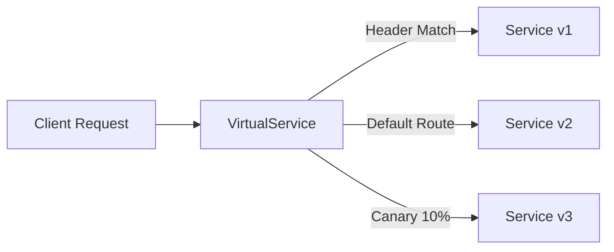
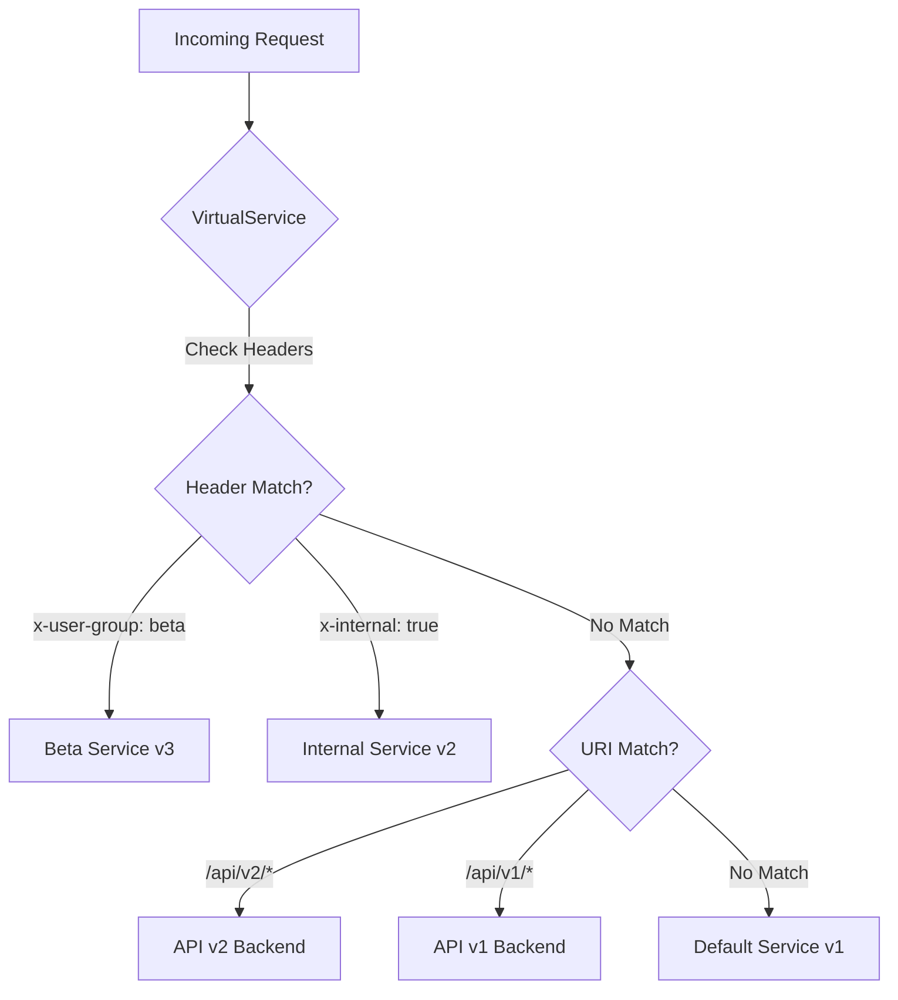
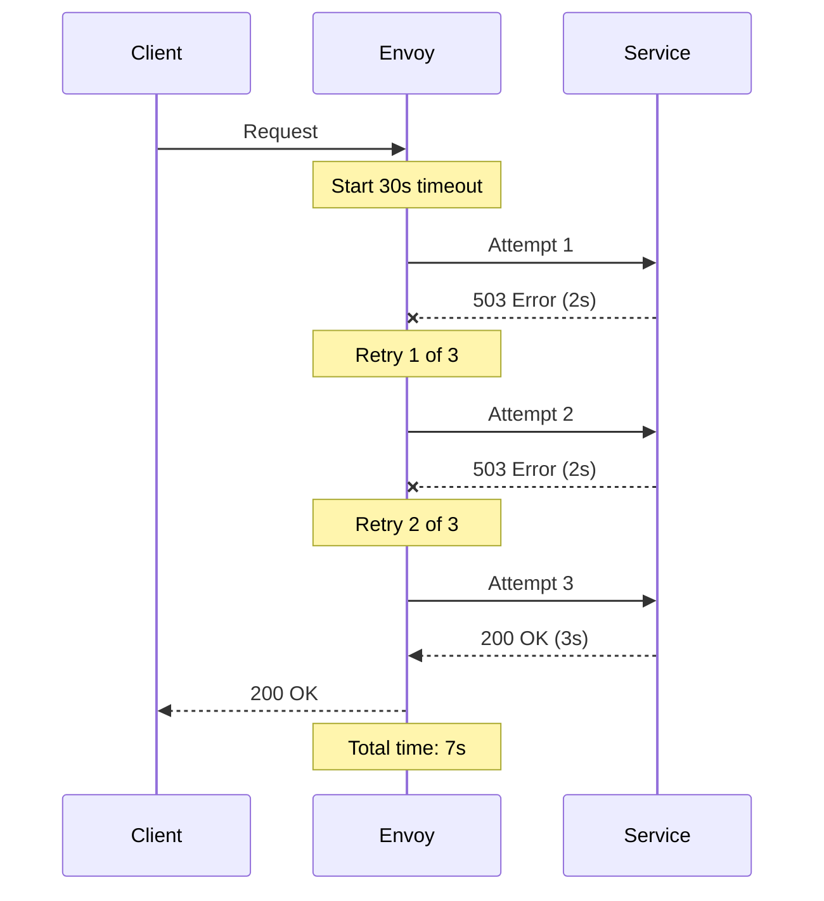

# How to Create Istio VirtualService Advanced Routing Rules

Author: [nawazdhandala](https://github.com/nawazdhandala)

Tags: Istio, Service Mesh, VirtualService, Traffic Management

Description: A practical guide to advanced Istio VirtualService configurations including header matching, fault injection, retries, timeouts, and traffic mirroring.

---

Istio VirtualService is where traffic management gets interesting. Basic routing is just the beginning. The real power comes when you start matching headers, injecting faults for chaos testing, configuring retries with exponential backoff, and mirroring production traffic to canary deployments. This guide walks through advanced patterns that will make your service mesh actually useful.

## VirtualService Fundamentals

A VirtualService defines how requests route to a service within the mesh. It decouples the client request from the actual destination, letting you control traffic without touching application code.



### Basic Structure

```yaml
apiVersion: networking.istio.io/v1beta1
kind: VirtualService
metadata:
  name: my-service
  namespace: production
spec:
  hosts:
    - my-service
  http:
    - route:
        - destination:
            host: my-service
            subset: v1
```

The `hosts` field specifies which services this VirtualService applies to. The `http` section contains routing rules evaluated in order.

## Header-Based Routing

Route traffic based on HTTP headers. This is essential for A/B testing, feature flags, and routing internal traffic differently from external requests.

### Match Specific Header Values

```yaml
apiVersion: networking.istio.io/v1beta1
kind: VirtualService
metadata:
  name: reviews-routing
  namespace: production
spec:
  hosts:
    - reviews
  http:
    # Route beta users to v3
    - match:
        - headers:
            x-user-group:
              exact: beta-testers
      route:
        - destination:
            host: reviews
            subset: v3
    # Route internal traffic to v2
    - match:
        - headers:
            x-internal-request:
              exact: "true"
      route:
        - destination:
            host: reviews
            subset: v2
    # Default route for everyone else
    - route:
        - destination:
            host: reviews
            subset: v1
```

### Header Matching Options

Istio supports multiple matching strategies:

```yaml
headers:
  my-header:
    exact: "value"        # Exact string match
    prefix: "val"         # Prefix match
    regex: "v[0-9]+"      # Regular expression match
```

### Match Multiple Conditions (AND Logic)

All conditions within a single `match` block must be true:

```yaml
- match:
    - headers:
        x-user-group:
          exact: premium
        x-region:
          exact: us-west
  route:
    - destination:
        host: reviews
        subset: premium-west
```

### Match Any Condition (OR Logic)

Multiple `match` blocks create OR logic:

```yaml
- match:
    - headers:
        x-user-group:
          exact: premium
    - headers:
        x-employee:
          exact: "true"
  route:
    - destination:
        host: reviews
        subset: v3
```

## URI-Based Routing

Route based on request paths. Combine with header matching for fine-grained control.

```yaml
apiVersion: networking.istio.io/v1beta1
kind: VirtualService
metadata:
  name: api-routing
  namespace: production
spec:
  hosts:
    - api-gateway
  http:
    # Route /api/v2/* to new backend
    - match:
        - uri:
            prefix: /api/v2/
      route:
        - destination:
            host: api-v2
            port:
              number: 8080
    # Route /api/v1/* to legacy backend
    - match:
        - uri:
            prefix: /api/v1/
      route:
        - destination:
            host: api-v1
            port:
              number: 8080
    # Rewrite paths before forwarding
    - match:
        - uri:
            prefix: /legacy/
      rewrite:
        uri: /api/v1/
      route:
        - destination:
            host: api-v1
```

## Traffic Flow Visualization

Here is how complex routing decisions flow through the mesh:



## Fault Injection for Chaos Engineering

Inject failures into your service mesh to test resilience. This is better than hoping your retry logic works.

### Inject Delays

Simulate slow services to test timeout handling:

```yaml
apiVersion: networking.istio.io/v1beta1
kind: VirtualService
metadata:
  name: ratings-delay
  namespace: production
spec:
  hosts:
    - ratings
  http:
    - fault:
        delay:
          percentage:
            value: 10
          fixedDelay: 5s
      route:
        - destination:
            host: ratings
            subset: v1
```

This adds a 5-second delay to 10% of requests. Watch your dashboards light up as upstream services timeout.

### Inject HTTP Errors

Return error responses without touching the actual service:

```yaml
apiVersion: networking.istio.io/v1beta1
kind: VirtualService
metadata:
  name: ratings-abort
  namespace: production
spec:
  hosts:
    - ratings
  http:
    - fault:
        abort:
          percentage:
            value: 20
          httpStatus: 503
      route:
        - destination:
            host: ratings
            subset: v1
```

20% of requests get a 503 Service Unavailable. Use this to verify circuit breakers actually trip.

### Combined Fault Injection

Stack delays and errors for maximum chaos:

```yaml
apiVersion: networking.istio.io/v1beta1
kind: VirtualService
metadata:
  name: chaos-testing
  namespace: staging
spec:
  hosts:
    - payment-service
  http:
    - match:
        - headers:
            x-chaos-test:
              exact: "true"
      fault:
        delay:
          percentage:
            value: 50
          fixedDelay: 3s
        abort:
          percentage:
            value: 25
          httpStatus: 500
      route:
        - destination:
            host: payment-service
            subset: v1
    - route:
        - destination:
            host: payment-service
            subset: v1
```

The chaos only triggers when `x-chaos-test: true` header is present. Production traffic stays clean.

## Retry Configuration

Automatic retries handle transient failures. Configure them properly or watch cascading failures take down your mesh.

### Basic Retry Policy

```yaml
apiVersion: networking.istio.io/v1beta1
kind: VirtualService
metadata:
  name: inventory-service
  namespace: production
spec:
  hosts:
    - inventory
  http:
    - route:
        - destination:
            host: inventory
            subset: v1
      retries:
        attempts: 3
        perTryTimeout: 2s
        retryOn: 5xx,reset,connect-failure,retriable-4xx
```

### Retry Configuration Options

| Field | Description |
|-------|-------------|
| `attempts` | Maximum retry count |
| `perTryTimeout` | Timeout per retry attempt |
| `retryOn` | Conditions that trigger retry |
| `retryRemoteLocalities` | Retry on different zones |

### Retry Conditions

Common `retryOn` values:

- `5xx`: Retry on 5xx response codes
- `gateway-error`: Retry on 502, 503, 504
- `reset`: Retry on connection reset
- `connect-failure`: Retry when connection fails
- `retriable-4xx`: Retry on 409 conflicts
- `refused-stream`: Retry on REFUSED_STREAM error

### Advanced Retry with Backoff

Combine retries with DestinationRule for exponential backoff:

```yaml
apiVersion: networking.istio.io/v1beta1
kind: DestinationRule
metadata:
  name: inventory-dr
  namespace: production
spec:
  host: inventory
  trafficPolicy:
    connectionPool:
      http:
        h2UpgradePolicy: UPGRADE
    outlierDetection:
      consecutive5xxErrors: 5
      interval: 30s
      baseEjectionTime: 30s
      maxEjectionPercent: 50
```

## Timeout Configuration

Set request timeouts to prevent slow services from blocking threads indefinitely.

### Route-Level Timeouts

```yaml
apiVersion: networking.istio.io/v1beta1
kind: VirtualService
metadata:
  name: search-service
  namespace: production
spec:
  hosts:
    - search
  http:
    - route:
        - destination:
            host: search
            subset: v1
      timeout: 10s
```

### Timeout with Retries

When combining timeouts with retries, the timeout applies to the entire request including all retry attempts:

```yaml
apiVersion: networking.istio.io/v1beta1
kind: VirtualService
metadata:
  name: search-service
  namespace: production
spec:
  hosts:
    - search
  http:
    - route:
        - destination:
            host: search
            subset: v1
      timeout: 30s
      retries:
        attempts: 3
        perTryTimeout: 8s
        retryOn: 5xx,reset
```

With 3 attempts at 8 seconds each, you need at least 24 seconds for all retries. The 30-second overall timeout gives some buffer.

### Timeout Flow



## Traffic Mirroring (Shadowing)

Send copies of production traffic to a test service without affecting responses. Perfect for testing new versions with real traffic.

```yaml
apiVersion: networking.istio.io/v1beta1
kind: VirtualService
metadata:
  name: reviews-mirroring
  namespace: production
spec:
  hosts:
    - reviews
  http:
    - route:
        - destination:
            host: reviews
            subset: v1
      mirror:
        host: reviews
        subset: v2
      mirrorPercentage:
        value: 100
```

### Mirror Flow

```mermaid
flowchart LR
    Client[Client] --> Envoy[Envoy Proxy]
    Envoy --> Primary[reviews v1]
    Envoy -.-> |Mirrored Copy| Shadow[reviews v2]
    Primary --> |Response| Client
    Shadow -.-> |Discarded| Nowhere[/dev/null]
```

The mirrored request is fire-and-forget. The response from v2 is discarded. Use this to:

- Compare v2 behavior with v1 using distributed tracing
- Load test v2 with real traffic patterns
- Validate v2 does not throw errors under production load

## Weighted Traffic Splitting

Gradually shift traffic between versions for canary deployments.

```yaml
apiVersion: networking.istio.io/v1beta1
kind: VirtualService
metadata:
  name: reviews-canary
  namespace: production
spec:
  hosts:
    - reviews
  http:
    - route:
        - destination:
            host: reviews
            subset: v1
          weight: 90
        - destination:
            host: reviews
            subset: v2
          weight: 10
```

### Progressive Rollout Strategy

```yaml
# Day 1: 5% canary
weight: 95 / 5

# Day 2: 25% canary
weight: 75 / 25

# Day 3: 50% canary
weight: 50 / 50

# Day 4: 100% new version
weight: 0 / 100
```

## Combining Everything: Production-Ready VirtualService

Here is a complete example combining multiple advanced features:

```yaml
apiVersion: networking.istio.io/v1beta1
kind: VirtualService
metadata:
  name: product-catalog
  namespace: production
spec:
  hosts:
    - product-catalog
    - catalog.example.com
  gateways:
    - mesh
    - product-gateway
  http:
    # Canary for beta users
    - match:
        - headers:
            x-user-group:
              exact: beta
      route:
        - destination:
            host: product-catalog
            subset: v2
      timeout: 15s
      retries:
        attempts: 2
        perTryTimeout: 5s
        retryOn: 5xx,reset

    # Chaos testing route (staging only)
    - match:
        - headers:
            x-chaos-test:
              exact: "true"
      fault:
        delay:
          percentage:
            value: 30
          fixedDelay: 2s
        abort:
          percentage:
            value: 10
          httpStatus: 503
      route:
        - destination:
            host: product-catalog
            subset: v1

    # Production traffic with canary
    - route:
        - destination:
            host: product-catalog
            subset: v1
          weight: 90
        - destination:
            host: product-catalog
            subset: v2
          weight: 10
      timeout: 10s
      retries:
        attempts: 3
        perTryTimeout: 3s
        retryOn: gateway-error,connect-failure,refused-stream
      mirror:
        host: product-catalog
        subset: v3-experimental
      mirrorPercentage:
        value: 5

---
apiVersion: networking.istio.io/v1beta1
kind: DestinationRule
metadata:
  name: product-catalog
  namespace: production
spec:
  host: product-catalog
  trafficPolicy:
    connectionPool:
      tcp:
        maxConnections: 100
      http:
        h2UpgradePolicy: UPGRADE
        maxRequestsPerConnection: 10
    loadBalancer:
      simple: LEAST_REQUEST
    outlierDetection:
      consecutive5xxErrors: 5
      interval: 10s
      baseEjectionTime: 30s
      maxEjectionPercent: 30
  subsets:
    - name: v1
      labels:
        version: v1
    - name: v2
      labels:
        version: v2
    - name: v3-experimental
      labels:
        version: v3
```

## Debugging VirtualService Issues

### Check VirtualService Status

```bash
# List all VirtualServices
kubectl get virtualservices -n production

# Describe specific VirtualService
kubectl describe virtualservice product-catalog -n production

# Check for configuration errors
istioctl analyze -n production
```

### Validate Configuration

```bash
# Verify routes resolve correctly
istioctl proxy-config routes deploy/product-catalog -n production

# Check cluster endpoints
istioctl proxy-config endpoints deploy/product-catalog -n production

# View Envoy configuration
istioctl proxy-config listener deploy/product-catalog -n production -o json
```

### Common Issues

**Issue: Routes not matching**
- Check host names match exactly
- Verify namespace selector in Gateway
- Ensure DestinationRule subsets exist

**Issue: Retries not working**
- Verify `retryOn` conditions match actual errors
- Check `perTryTimeout` is less than route timeout
- Ensure service returns retriable status codes

**Issue: Fault injection not triggering**
- Header matching is case-sensitive
- Percentage is a float (use `value: 10.0`)
- Check request path matches route

## Best Practices

1. **Start simple.** Add one feature at a time and verify it works before stacking more complexity.

2. **Use consistent naming.** Match VirtualService names to service names. It makes debugging easier.

3. **Set timeouts everywhere.** Default Istio timeout is 15 seconds. That is probably too long for most services.

4. **Limit retry attempts.** Three retries is usually enough. More just delays the inevitable failure.

5. **Test fault injection in staging first.** Breaking production on purpose requires practice.

6. **Monitor everything.** Export Istio metrics to your observability platform. You cannot manage what you cannot measure.

7. **Version your configurations.** Store VirtualServices in Git. Review changes like code.

---

VirtualService is the control plane for your traffic. Header matching, fault injection, retries, timeouts, and mirroring give you the tools to build resilient services and test them properly. Start with basic routing, add features incrementally, and always test in staging before production. Your on-call rotation will thank you.
