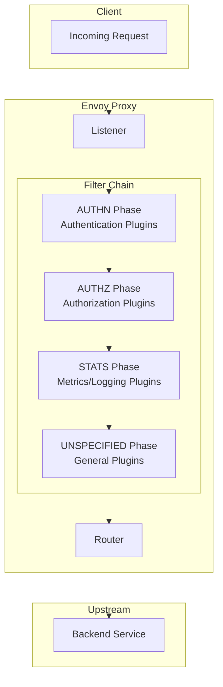
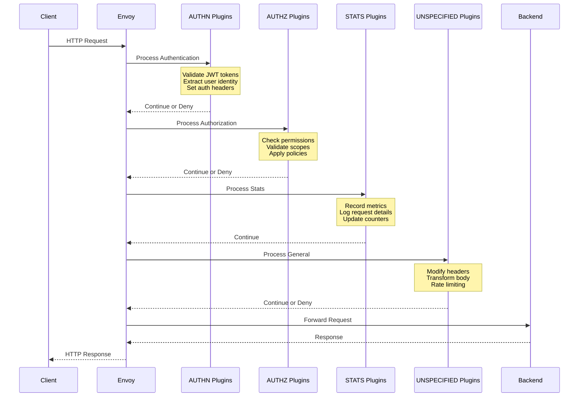

# How to Build Istio WasmPlugin

Author: [nawazdhandala](https://github.com/nawazdhandala)

Tags: Istio, Kubernetes, WebAssembly, Envoy

Description: Learn how to extend Envoy proxy functionality in Istio using WebAssembly plugins with the WasmPlugin resource.

---

WebAssembly (Wasm) plugins let you extend Envoy proxy behavior in Istio without rebuilding Envoy or writing C++. You can add custom authentication, authorization, observability, and traffic manipulation logic that runs at near-native speed.

## Understanding WasmPlugin Architecture

Istio's WasmPlugin resource deploys WebAssembly modules to Envoy sidecars. These modules execute within Envoy's filter chain, giving you access to request and response data at different processing phases.



### Plugin Execution Phases

| Phase | Order | Use Case |
|-------|-------|----------|
| AUTHN | First | Token validation, identity extraction |
| AUTHZ | Second | Access control, permission checks |
| STATS | Third | Metrics collection, request logging |
| UNSPECIFIED | Last | General request/response modification |

## WasmPlugin Resource Specification

The WasmPlugin CRD defines how Istio loads and configures your Wasm module.

### Basic WasmPlugin

```yaml
# wasmplugin-basic.yaml
# A minimal WasmPlugin configuration that loads a module from an OCI registry
apiVersion: extensions.istio.io/v1alpha1
kind: WasmPlugin
metadata:
  name: my-custom-plugin
  namespace: istio-system
spec:
  # Selector determines which workloads receive the plugin
  selector:
    matchLabels:
      app: my-service

  # URL points to the Wasm module location
  # Supports: oci://, http://, https://, file://
  url: oci://ghcr.io/myorg/my-wasm-plugin:v1.0.0

  # Phase determines when the plugin executes in the filter chain
  phase: AUTHN

  # Priority within the phase (lower runs first)
  priority: 10
```

### Complete WasmPlugin Specification

```yaml
# wasmplugin-complete.yaml
# Full WasmPlugin specification with all configuration options
apiVersion: extensions.istio.io/v1alpha1
kind: WasmPlugin
metadata:
  name: advanced-auth-plugin
  namespace: default
spec:
  # Target specific workloads
  selector:
    matchLabels:
      app: api-gateway
      version: v2

  # OCI image containing the Wasm module
  url: oci://ghcr.io/myorg/auth-plugin:v2.1.0

  # SHA256 verification for the module
  sha256: a]b1c2d3e4f5...

  # Plugin execution phase
  phase: AUTHN

  # Priority within phase (0-1000, lower = earlier)
  priority: 5

  # Plugin configuration passed to the module
  pluginConfig:
    jwt_issuer: "https://auth.example.com"
    jwt_audience: "api.example.com"
    cache_ttl_seconds: 300
    allowed_paths:
      - "/health"
      - "/ready"
      - "/metrics"

  # Plugin name (used for logging and debugging)
  pluginName: "advanced-auth"

  # VM configuration
  vmConfig:
    # Environment variables available to the Wasm module
    env:
      - name: LOG_LEVEL
        value: "debug"
      - name: SERVICE_NAME
        valueFrom:
          fieldRef:
            fieldPath: metadata.name
      - name: API_KEY
        valueFrom:
          secretKeyRef:
            name: plugin-secrets
            key: api-key

  # Image pull policy
  imagePullPolicy: IfNotPresent

  # Image pull secret for private registries
  imagePullSecret: ghcr-pull-secret

  # Fail open or closed if plugin fails to load
  failStrategy: FAIL_CLOSE

  # Match specific traffic
  match:
    - mode: CLIENT
      ports:
        - number: 8080
    - mode: SERVER
      ports:
        - number: 443
```

## Plugin Phases in Detail

Understanding when your plugin executes is critical for correct behavior.



### AUTHN Phase

Authentication plugins run first. Use this phase to:

- Validate JWT tokens
- Extract user identity from headers
- Set authentication context for downstream plugins

```yaml
# wasmplugin-authn.yaml
apiVersion: extensions.istio.io/v1alpha1
kind: WasmPlugin
metadata:
  name: jwt-validator
  namespace: istio-system
spec:
  selector:
    matchLabels:
      app: api-gateway
  url: oci://ghcr.io/myorg/jwt-validator:v1.0.0
  phase: AUTHN
  priority: 10
  pluginConfig:
    jwks_uri: "https://auth.example.com/.well-known/jwks.json"
    issuer: "https://auth.example.com"
    audience: "api.example.com"
```

### AUTHZ Phase

Authorization plugins run after authentication. Use this phase to:

- Check user permissions
- Validate OAuth scopes
- Apply fine-grained access control

```yaml
# wasmplugin-authz.yaml
apiVersion: extensions.istio.io/v1alpha1
kind: WasmPlugin
metadata:
  name: rbac-enforcer
  namespace: istio-system
spec:
  selector:
    matchLabels:
      app: api-gateway
  url: oci://ghcr.io/myorg/rbac-enforcer:v1.0.0
  phase: AUTHZ
  priority: 10
  pluginConfig:
    policy_endpoint: "http://policy-service.default.svc:8080"
    cache_enabled: true
    cache_ttl: 60
```

### STATS Phase

Stats plugins run after authorization. Use this phase to:

- Collect custom metrics
- Log request details
- Update monitoring systems

```yaml
# wasmplugin-stats.yaml
apiVersion: extensions.istio.io/v1alpha1
kind: WasmPlugin
metadata:
  name: custom-metrics
  namespace: istio-system
spec:
  selector:
    matchLabels:
      app: api-gateway
  url: oci://ghcr.io/myorg/custom-metrics:v1.0.0
  phase: STATS
  priority: 10
  pluginConfig:
    metrics_prefix: "custom_api"
    histogram_buckets: [0.01, 0.05, 0.1, 0.5, 1.0, 5.0]
```

## OCI Image Distribution

Package and distribute your Wasm modules using OCI registries.

### Building and Pushing Wasm Modules

```bash
# Build the Wasm module (example using Rust)
cargo build --target wasm32-wasi --release

# Copy the module
cp target/wasm32-wasi/release/my_plugin.wasm ./plugin.wasm

# Create OCI artifact using ORAS
oras push ghcr.io/myorg/my-wasm-plugin:v1.0.0 \
  --artifact-type application/vnd.module.wasm.content.layer.v1+wasm \
  plugin.wasm:application/vnd.module.wasm.content.layer.v1+wasm

# Verify the push
oras manifest fetch ghcr.io/myorg/my-wasm-plugin:v1.0.0
```

### Using Private Registries

```yaml
# Create image pull secret
kubectl create secret docker-registry ghcr-pull-secret \
  --docker-server=ghcr.io \
  --docker-username=myuser \
  --docker-password=mytoken \
  -n istio-system

# Reference in WasmPlugin
apiVersion: extensions.istio.io/v1alpha1
kind: WasmPlugin
metadata:
  name: private-plugin
  namespace: istio-system
spec:
  selector:
    matchLabels:
      app: my-service
  url: oci://ghcr.io/myorg/private-plugin:v1.0.0
  imagePullSecret: ghcr-pull-secret
```

### Module Verification

```yaml
# Verify module integrity with SHA256
apiVersion: extensions.istio.io/v1alpha1
kind: WasmPlugin
metadata:
  name: verified-plugin
  namespace: istio-system
spec:
  selector:
    matchLabels:
      app: my-service
  url: oci://ghcr.io/myorg/my-plugin:v1.0.0
  # Get SHA256: oras manifest fetch ghcr.io/myorg/my-plugin:v1.0.0 | jq -r '.layers[0].digest'
  sha256: sha256:abc123def456...
```

## Plugin Configuration

Pass configuration to your Wasm module through the pluginConfig field.

### Static Configuration

```yaml
# Configuration passed as JSON to the plugin
apiVersion: extensions.istio.io/v1alpha1
kind: WasmPlugin
metadata:
  name: rate-limiter
  namespace: istio-system
spec:
  selector:
    matchLabels:
      app: api-gateway
  url: oci://ghcr.io/myorg/rate-limiter:v1.0.0
  phase: UNSPECIFIED
  pluginConfig:
    # Rate limiting rules
    default_limit: 100
    default_window_seconds: 60

    # Per-path limits
    path_limits:
      - path: "/api/v1/search"
        limit: 20
        window_seconds: 60
      - path: "/api/v1/upload"
        limit: 5
        window_seconds: 300

    # Response when rate limited
    rate_limit_response:
      status_code: 429
      headers:
        Retry-After: "60"
      body: '{"error": "Rate limit exceeded"}'
```

### Environment Variables

```yaml
# Environment variables from various sources
apiVersion: extensions.istio.io/v1alpha1
kind: WasmPlugin
metadata:
  name: configurable-plugin
  namespace: default
spec:
  selector:
    matchLabels:
      app: my-service
  url: oci://ghcr.io/myorg/configurable-plugin:v1.0.0
  vmConfig:
    env:
      # Static value
      - name: LOG_LEVEL
        value: "info"

      # From pod metadata
      - name: POD_NAME
        valueFrom:
          fieldRef:
            fieldPath: metadata.name

      - name: POD_NAMESPACE
        valueFrom:
          fieldRef:
            fieldPath: metadata.namespace

      # From Secret
      - name: API_SECRET
        valueFrom:
          secretKeyRef:
            name: plugin-secrets
            key: api-secret

      # From ConfigMap
      - name: CONFIG_VALUE
        valueFrom:
          configMapKeyRef:
            name: plugin-config
            key: some-value
```

## Writing a Wasm Plugin

Here is a complete example of a Wasm plugin written in Rust using the proxy-wasm SDK.

### Cargo.toml

```toml
[package]
name = "header-modifier"
version = "1.0.0"
edition = "2021"

[lib]
crate-type = ["cdylib"]

[dependencies]
proxy-wasm = "0.2"
serde = { version = "1.0", features = ["derive"] }
serde_json = "1.0"
log = "0.4"
```

### Plugin Source Code

```rust
// src/lib.rs
// A WasmPlugin that adds custom headers and logs request information

use proxy_wasm::traits::*;
use proxy_wasm::types::*;
use serde::Deserialize;
use std::time::Duration;

// Plugin configuration structure
#[derive(Deserialize, Clone)]
struct PluginConfig {
    // Headers to add to requests
    request_headers: Vec<HeaderConfig>,
    // Headers to add to responses
    response_headers: Vec<HeaderConfig>,
    // Enable request logging
    enable_logging: bool,
    // Log level threshold
    log_level: String,
}

#[derive(Deserialize, Clone)]
struct HeaderConfig {
    name: String,
    value: String,
}

// Root context handles plugin lifecycle
struct HeaderModifierRoot {
    config: Option<PluginConfig>,
}

// HTTP context handles individual requests
struct HeaderModifierHttp {
    config: PluginConfig,
    request_start: u64,
}

// Entry point for the Wasm module
proxy_wasm::main! {{
    proxy_wasm::set_log_level(LogLevel::Info);
    proxy_wasm::set_root_context(|_| -> Box<dyn RootContext> {
        Box::new(HeaderModifierRoot { config: None })
    });
}}

impl Context for HeaderModifierRoot {}

impl RootContext for HeaderModifierRoot {
    // Called when plugin configuration is loaded
    fn on_configure(&mut self, _: usize) -> bool {
        // Read configuration from Istio WasmPlugin pluginConfig
        if let Some(config_bytes) = self.get_plugin_configuration() {
            match serde_json::from_slice::<PluginConfig>(&config_bytes) {
                Ok(config) => {
                    log::info!("Plugin configured successfully");
                    self.config = Some(config);
                    return true;
                }
                Err(e) => {
                    log::error!("Failed to parse config: {:?}", e);
                    return false;
                }
            }
        }

        // Use default configuration if none provided
        self.config = Some(PluginConfig {
            request_headers: vec![],
            response_headers: vec![],
            enable_logging: true,
            log_level: "info".to_string(),
        });
        true
    }

    // Create HTTP context for each request
    fn create_http_context(&self, _: u32) -> Option<Box<dyn HttpContext>> {
        Some(Box::new(HeaderModifierHttp {
            config: self.config.clone().unwrap_or(PluginConfig {
                request_headers: vec![],
                response_headers: vec![],
                enable_logging: false,
                log_level: "info".to_string(),
            }),
            request_start: 0,
        }))
    }

    fn get_type(&self) -> Option<ContextType> {
        Some(ContextType::HttpContext)
    }
}

impl Context for HeaderModifierHttp {}

impl HttpContext for HeaderModifierHttp {
    // Called when request headers are received
    fn on_http_request_headers(&mut self, _: usize, _: bool) -> Action {
        // Record request start time
        self.request_start = self.get_current_time()
            .duration_since(std::time::UNIX_EPOCH)
            .unwrap_or(Duration::ZERO)
            .as_millis() as u64;

        // Add configured request headers
        for header in &self.config.request_headers {
            self.add_http_request_header(&header.name, &header.value);
        }

        // Log request information
        if self.config.enable_logging {
            let path = self.get_http_request_header(":path")
                .unwrap_or_else(|| "unknown".to_string());
            let method = self.get_http_request_header(":method")
                .unwrap_or_else(|| "unknown".to_string());

            log::info!("Request: {} {}", method, path);
        }

        Action::Continue
    }

    // Called when response headers are received
    fn on_http_response_headers(&mut self, _: usize, _: bool) -> Action {
        // Add configured response headers
        for header in &self.config.response_headers {
            self.add_http_response_header(&header.name, &header.value);
        }

        // Calculate and log request duration
        if self.config.enable_logging {
            let now = self.get_current_time()
                .duration_since(std::time::UNIX_EPOCH)
                .unwrap_or(Duration::ZERO)
                .as_millis() as u64;

            let duration_ms = now - self.request_start;

            let status = self.get_http_response_header(":status")
                .unwrap_or_else(|| "unknown".to_string());

            log::info!("Response: status={} duration={}ms", status, duration_ms);

            // Add timing header to response
            self.add_http_response_header(
                "x-request-duration-ms",
                &duration_ms.to_string()
            );
        }

        Action::Continue
    }
}
```

### Build and Deploy

```bash
# Build the Wasm module
cargo build --target wasm32-wasi --release

# Optimize the module size (optional)
wasm-opt -Os -o plugin-optimized.wasm \
  target/wasm32-wasi/release/header_modifier.wasm

# Push to registry
oras push ghcr.io/myorg/header-modifier:v1.0.0 \
  plugin-optimized.wasm:application/vnd.module.wasm.content.layer.v1+wasm
```

### Deploy WasmPlugin

```yaml
# wasmplugin-header-modifier.yaml
apiVersion: extensions.istio.io/v1alpha1
kind: WasmPlugin
metadata:
  name: header-modifier
  namespace: istio-system
spec:
  selector:
    matchLabels:
      app: api-gateway
  url: oci://ghcr.io/myorg/header-modifier:v1.0.0
  phase: STATS
  priority: 10
  pluginConfig:
    request_headers:
      - name: "x-custom-header"
        value: "added-by-wasm"
      - name: "x-request-id"
        value: "generated-id"
    response_headers:
      - name: "x-processed-by"
        value: "wasm-plugin"
    enable_logging: true
    log_level: "info"
  vmConfig:
    env:
      - name: LOG_LEVEL
        value: "debug"
```

## Targeting Workloads

Control which workloads receive your plugin.

### Namespace-Wide Plugin

```yaml
# Apply to all workloads in namespace
apiVersion: extensions.istio.io/v1alpha1
kind: WasmPlugin
metadata:
  name: namespace-plugin
  namespace: production
spec:
  # Empty selector = all workloads in namespace
  url: oci://ghcr.io/myorg/plugin:v1.0.0
```

### Label-Based Selection

```yaml
# Target workloads by label
apiVersion: extensions.istio.io/v1alpha1
kind: WasmPlugin
metadata:
  name: labeled-plugin
  namespace: default
spec:
  selector:
    matchLabels:
      app: api-gateway
      tier: frontend
  url: oci://ghcr.io/myorg/plugin:v1.0.0
```

### Traffic Matching

```yaml
# Target specific ports and traffic modes
apiVersion: extensions.istio.io/v1alpha1
kind: WasmPlugin
metadata:
  name: traffic-matched-plugin
  namespace: default
spec:
  selector:
    matchLabels:
      app: my-service
  url: oci://ghcr.io/myorg/plugin:v1.0.0
  match:
    # Apply to outbound traffic on port 8080
    - mode: CLIENT
      ports:
        - number: 8080
    # Apply to inbound traffic on port 443
    - mode: SERVER
      ports:
        - number: 443
```

## Failure Handling

Configure how Envoy behaves when plugins fail.

```yaml
# Fail closed (reject traffic on plugin failure)
apiVersion: extensions.istio.io/v1alpha1
kind: WasmPlugin
metadata:
  name: critical-auth-plugin
  namespace: istio-system
spec:
  selector:
    matchLabels:
      app: api-gateway
  url: oci://ghcr.io/myorg/auth-plugin:v1.0.0
  phase: AUTHN
  # Reject traffic if plugin fails to load or execute
  failStrategy: FAIL_CLOSE

---
# Fail open (allow traffic on plugin failure)
apiVersion: extensions.istio.io/v1alpha1
kind: WasmPlugin
metadata:
  name: optional-metrics-plugin
  namespace: istio-system
spec:
  selector:
    matchLabels:
      app: api-gateway
  url: oci://ghcr.io/myorg/metrics-plugin:v1.0.0
  phase: STATS
  # Allow traffic if plugin fails
  failStrategy: FAIL_OPEN
```

## Debugging Wasm Plugins

### Check Plugin Status

```bash
# List WasmPlugins
kubectl get wasmplugins -A

# Describe specific plugin
kubectl describe wasmplugin my-plugin -n istio-system

# Check if module is loaded in Envoy
istioctl proxy-config wasm deploy/my-service -n default
```

### View Plugin Logs

```bash
# Enable debug logging for Wasm
kubectl exec -it deploy/my-service -c istio-proxy -- \
  curl -X POST localhost:15000/logging?wasm=debug

# View Envoy logs
kubectl logs deploy/my-service -c istio-proxy | grep wasm
```

### Common Issues

| Issue | Cause | Solution |
|-------|-------|----------|
| Plugin not loading | Invalid OCI URL | Verify URL and image pull secret |
| Config parse error | Invalid pluginConfig | Check JSON structure matches plugin expectations |
| Module crash | Bug in Wasm code | Check Envoy logs, add error handling |
| Performance issues | Heavy computation | Profile and optimize Wasm code |

---

WasmPlugin lets you extend Envoy with custom logic without the complexity of native C++ filters. Start with simple header manipulation, then build up to authentication, authorization, and observability plugins. Use OCI registries for distribution and leverage the phase system to control execution order. The proxy-wasm SDK makes it straightforward to write plugins in Rust, Go, or AssemblyScript.
