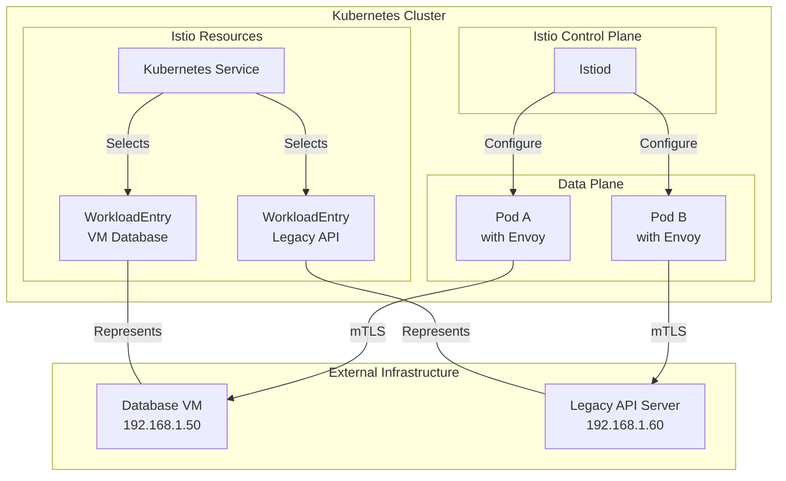
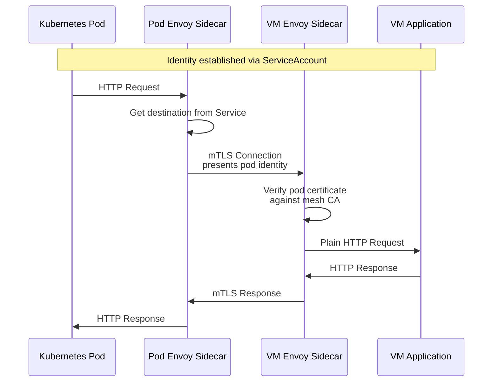
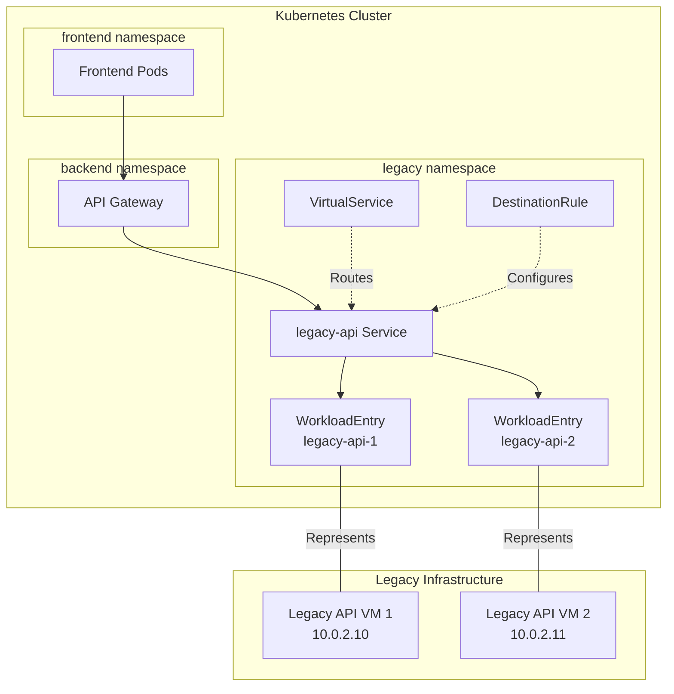

# How to Create Istio WorkloadEntry

Author: [nawazdhandala](https://github.com/nawazdhandala)

Tags: Istio, Service Mesh, Kubernetes, DevOps

Description: A practical guide to creating and managing Istio WorkloadEntry resources for integrating external services, VMs, and legacy systems into your service mesh.

---

Kubernetes pods are not the only workloads that need to participate in a service mesh. Databases running on dedicated VMs, legacy applications that cannot be containerized, and external services all need to be discoverable and manageable within the mesh. Istio WorkloadEntry solves this by representing non-Kubernetes workloads as first-class mesh citizens.

## What is a WorkloadEntry?

A WorkloadEntry is an Istio resource that represents a single instance of a workload running outside of Kubernetes. Think of it as a manual endpoint registration that tells Istio where to find your external services.



## Prerequisites

Before creating WorkloadEntry resources, ensure you have:

- A Kubernetes cluster with Istio 1.6 or later installed
- kubectl configured to access your cluster
- Network connectivity between your cluster and external workloads
- The istioctl CLI tool for troubleshooting

Verify your Istio installation:

```bash
# Check Istio version and status
istioctl version

# Verify Istiod is running
kubectl get pods -n istio-system -l app=istiod
```

## Basic WorkloadEntry Structure

A WorkloadEntry at its core needs to specify where the workload lives and how to identify it.

The following WorkloadEntry represents a MySQL database running on a VM:

```yaml
# workload-entry-mysql.yaml
# This WorkloadEntry makes a MySQL database on a VM
# discoverable to services in the mesh
apiVersion: networking.istio.io/v1beta1
kind: WorkloadEntry
metadata:
  # Unique name for this workload instance
  name: mysql-primary
  # Namespace where the workload will be discoverable
  namespace: database
spec:
  # IP address or hostname of the external workload
  # This is how the mesh will reach this service
  address: 192.168.1.50

  # Labels used for service selection and routing
  # These must match the Kubernetes Service selector
  labels:
    app: mysql
    version: v8
    role: primary

  # Ports exposed by this workload
  # Maps logical port names to actual port numbers
  ports:
    mysql: 3306
```

Apply the WorkloadEntry:

```bash
# Create the namespace if it does not exist
kubectl create namespace database --dry-run=client -o yaml | kubectl apply -f -

# Apply the WorkloadEntry
kubectl apply -f workload-entry-mysql.yaml

# Verify the WorkloadEntry was created
kubectl get workloadentry -n database
```

## Creating a Service for WorkloadEntry Discovery

A WorkloadEntry alone is not enough. You need a Kubernetes Service that selects the WorkloadEntry labels to enable service discovery.

The following Service makes the MySQL WorkloadEntry accessible via DNS:

```yaml
# service-mysql.yaml
# This Service enables DNS-based discovery of the MySQL WorkloadEntry
# Pods can connect to mysql.database.svc.cluster.local
apiVersion: v1
kind: Service
metadata:
  name: mysql
  namespace: database
  labels:
    app: mysql
spec:
  # Ports exposed by the service
  ports:
    - name: mysql
      port: 3306
      targetPort: 3306
      protocol: TCP

  # Selector matches WorkloadEntry labels
  # This is the link between Service and WorkloadEntry
  selector:
    app: mysql
```

Apply the Service:

```bash
# Apply the Service
kubectl apply -f service-mysql.yaml

# Check that the Service has endpoints
# The external IP should appear as an endpoint
kubectl get endpoints mysql -n database
```

## Complete WorkloadEntry Configuration

A production WorkloadEntry includes additional configuration for identity, networking, and health checking.

The following example shows a fully configured WorkloadEntry:

```yaml
# workload-entry-complete.yaml
# Comprehensive WorkloadEntry configuration for a payment service VM
apiVersion: networking.istio.io/v1beta1
kind: WorkloadEntry
metadata:
  name: payment-service-vm-1
  namespace: payments
  # Labels on the WorkloadEntry resource itself
  # Used for organizing and querying resources
  labels:
    app: payment-service
    managed-by: istio
spec:
  # IP address where the workload is reachable
  # Can also be a resolvable hostname
  address: 10.0.1.100

  # Labels for service selection and traffic routing
  # These are the labels that Services select on
  labels:
    app: payment-service
    version: v2
    # Custom labels for routing decisions
    environment: production
    region: us-west-2
    instance: vm-1

  # ServiceAccount identity for mTLS
  # The workload will authenticate as this identity
  # Must match a ServiceAccount in the namespace
  serviceAccount: payment-service-sa

  # Network identifier for multi-network meshes
  # Must match the network configuration in Istio
  network: vm-network

  # Locality information for load balancing
  # Format: region/zone/subzone
  # Used for locality-aware routing
  locality: us-west-2/us-west-2a

  # Weight for load balancing decisions
  # Higher weight means more traffic
  # Default is 1 if not specified
  weight: 100

  # Ports exposed by the workload
  # Each named port can be referenced in routing rules
  ports:
    # HTTP API port
    http-api: 8080
    # gRPC port for internal communication
    grpc: 9090
    # Prometheus metrics endpoint
    metrics: 9091
    # Health check endpoint
    health: 8081
```

## WorkloadEntry with ServiceAccount Identity

For mTLS to work correctly, WorkloadEntries need a ServiceAccount identity. The Istio sidecar on the external workload uses this identity for authentication.

First, create the ServiceAccount:

```yaml
# service-account-payment.yaml
# ServiceAccount used for WorkloadEntry identity
apiVersion: v1
kind: ServiceAccount
metadata:
  name: payment-service-sa
  namespace: payments
  labels:
    app: payment-service
```

The following diagram shows how identity flows in WorkloadEntry communication:



## Multiple WorkloadEntries for High Availability

Production deployments typically have multiple instances. Create separate WorkloadEntry resources for each instance.

The following configuration creates a highly available database cluster:

```yaml
# workload-entries-mysql-cluster.yaml
# Multiple WorkloadEntries for a MySQL cluster with primary and replicas
---
# Primary database instance
apiVersion: networking.istio.io/v1beta1
kind: WorkloadEntry
metadata:
  name: mysql-primary
  namespace: database
spec:
  address: 192.168.1.50
  labels:
    app: mysql
    role: primary
    # Instance identifier for debugging
    instance: mysql-1
  serviceAccount: mysql-sa
  locality: us-west-2/us-west-2a
  ports:
    mysql: 3306
    metrics: 9104
---
# First replica instance
apiVersion: networking.istio.io/v1beta1
kind: WorkloadEntry
metadata:
  name: mysql-replica-1
  namespace: database
spec:
  address: 192.168.1.51
  labels:
    app: mysql
    role: replica
    instance: mysql-2
  serviceAccount: mysql-sa
  locality: us-west-2/us-west-2b
  ports:
    mysql: 3306
    metrics: 9104
---
# Second replica instance
apiVersion: networking.istio.io/v1beta1
kind: WorkloadEntry
metadata:
  name: mysql-replica-2
  namespace: database
spec:
  address: 192.168.1.52
  labels:
    app: mysql
    role: replica
    instance: mysql-3
  serviceAccount: mysql-sa
  locality: us-west-2/us-west-2c
  ports:
    mysql: 3306
    metrics: 9104
```

Create separate Services for read and write traffic:

```yaml
# services-mysql-cluster.yaml
# Services for MySQL primary and replicas
---
# Service for write operations - selects only primary
apiVersion: v1
kind: Service
metadata:
  name: mysql-primary
  namespace: database
spec:
  ports:
    - name: mysql
      port: 3306
  selector:
    app: mysql
    role: primary
---
# Service for read operations - selects all replicas
apiVersion: v1
kind: Service
metadata:
  name: mysql-readonly
  namespace: database
spec:
  ports:
    - name: mysql
      port: 3306
  selector:
    app: mysql
    role: replica
---
# Service for all instances - useful for monitoring
apiVersion: v1
kind: Service
metadata:
  name: mysql
  namespace: database
spec:
  ports:
    - name: mysql
      port: 3306
    - name: metrics
      port: 9104
  selector:
    app: mysql
```

## WorkloadEntry with DestinationRule

Apply traffic policies to WorkloadEntry endpoints using DestinationRule resources.

The following DestinationRule configures connection pooling, load balancing, and circuit breaking:

```yaml
# destination-rule-mysql.yaml
# Traffic policies for MySQL WorkloadEntries
apiVersion: networking.istio.io/v1beta1
kind: DestinationRule
metadata:
  name: mysql-traffic-policy
  namespace: database
spec:
  # Target all MySQL services
  host: "*.database.svc.cluster.local"

  # Default traffic policy for all subsets
  trafficPolicy:
    # Connection pool settings
    connectionPool:
      tcp:
        # Maximum number of connections
        maxConnections: 100
        # Connection timeout
        connectTimeout: 10s
        # TCP keepalive settings
        tcpKeepalive:
          time: 7200s
          interval: 75s
          probes: 9

    # Load balancer configuration
    loadBalancer:
      # Use least connections for database traffic
      simple: LEAST_REQUEST
      # Enable locality-aware load balancing
      localityLbSetting:
        enabled: true

    # Outlier detection for circuit breaking
    outlierDetection:
      # Consecutive errors before ejection
      consecutive5xxErrors: 5
      consecutiveGatewayErrors: 5
      # Analysis interval
      interval: 10s
      # Time a host stays ejected
      baseEjectionTime: 30s
      # Maximum ejection percentage
      maxEjectionPercent: 50
      # Minimum healthy hosts percentage
      minHealthPercent: 30

  # Subsets for different routing scenarios
  subsets:
    # Primary database for writes
    - name: primary
      labels:
        role: primary
      trafficPolicy:
        connectionPool:
          tcp:
            # Lower connection limit for primary
            maxConnections: 50

    # Replicas for reads
    - name: replicas
      labels:
        role: replica
      trafficPolicy:
        connectionPool:
          tcp:
            # Higher connection limit for read replicas
            maxConnections: 200
```

## WorkloadEntry for External APIs

WorkloadEntry can represent external APIs that your services depend on. This enables traffic management and observability for external calls.

The following configuration integrates an external payment gateway:

```yaml
# workload-entry-payment-gateway.yaml
# WorkloadEntry for an external payment processor API
apiVersion: networking.istio.io/v1beta1
kind: WorkloadEntry
metadata:
  name: stripe-api-primary
  namespace: external-apis
spec:
  # Stripe API endpoint
  address: api.stripe.com
  labels:
    app: stripe-api
    provider: stripe
  # External services do not need ServiceAccount
  # They are outside the mesh trust domain
  ports:
    https: 443
---
# Backup endpoint for resilience
apiVersion: networking.istio.io/v1beta1
kind: WorkloadEntry
metadata:
  name: stripe-api-backup
  namespace: external-apis
spec:
  address: api.stripe.com
  labels:
    app: stripe-api
    provider: stripe
    backup: "true"
  ports:
    https: 443
```

Create a Service and DestinationRule for external API traffic management:

```yaml
# service-stripe-api.yaml
# Service for external Stripe API
apiVersion: v1
kind: Service
metadata:
  name: stripe-api
  namespace: external-apis
spec:
  ports:
    - name: https
      port: 443
  selector:
    app: stripe-api
---
# DestinationRule for Stripe API traffic policies
apiVersion: networking.istio.io/v1beta1
kind: DestinationRule
metadata:
  name: stripe-api-policy
  namespace: external-apis
spec:
  host: stripe-api.external-apis.svc.cluster.local
  trafficPolicy:
    # TLS settings for external HTTPS
    tls:
      mode: SIMPLE
      sni: api.stripe.com

    # Connection pool for rate limiting
    connectionPool:
      http:
        h2UpgradePolicy: UPGRADE
        http1MaxPendingRequests: 100
        http2MaxRequests: 1000
        maxRequestsPerConnection: 100
      tcp:
        maxConnections: 50
        connectTimeout: 5s

    # Circuit breaker settings
    outlierDetection:
      consecutive5xxErrors: 3
      interval: 30s
      baseEjectionTime: 60s
      maxEjectionPercent: 100
```

## WorkloadEntry with VirtualService Routing

Use VirtualService to implement advanced routing for WorkloadEntry endpoints.

The following configuration demonstrates traffic splitting and header-based routing:

```yaml
# virtual-service-mysql.yaml
# Advanced routing for MySQL WorkloadEntries
apiVersion: networking.istio.io/v1beta1
kind: VirtualService
metadata:
  name: mysql-routing
  namespace: database
spec:
  hosts:
    - mysql.database.svc.cluster.local

  # TCP routing rules for MySQL protocol
  tcp:
    # Route write traffic to primary
    - match:
        # Match connections from services labeled as writers
        - sourceLabels:
            db-access: write
      route:
        - destination:
            host: mysql.database.svc.cluster.local
            subset: primary
          weight: 100

    # Route read traffic to replicas with failover to primary
    - match:
        - sourceLabels:
            db-access: read
      route:
        - destination:
            host: mysql.database.svc.cluster.local
            subset: replicas
          weight: 90
        - destination:
            host: mysql.database.svc.cluster.local
            subset: primary
          weight: 10

    # Default route to primary for unspecified traffic
    - route:
        - destination:
            host: mysql.database.svc.cluster.local
            subset: primary
          weight: 100
```

For HTTP-based WorkloadEntries, use HTTP routing rules:

```yaml
# virtual-service-payment-api.yaml
# HTTP routing for payment API WorkloadEntry
apiVersion: networking.istio.io/v1beta1
kind: VirtualService
metadata:
  name: payment-api-routing
  namespace: payments
spec:
  hosts:
    - payment-api.payments.svc.cluster.local

  http:
    # Route canary traffic to v2
    - match:
        - headers:
            x-canary:
              exact: "true"
      route:
        - destination:
            host: payment-api.payments.svc.cluster.local
            subset: v2
          weight: 100
      # Retry configuration for canary
      retries:
        attempts: 3
        perTryTimeout: 2s
        retryOn: connect-failure,refused-stream,unavailable,retriable-4xx

    # Route based on user tier
    - match:
        - headers:
            x-user-tier:
              exact: "premium"
      route:
        - destination:
            host: payment-api.payments.svc.cluster.local
            subset: v1
          weight: 100
      # Lower timeout for premium users
      timeout: 5s

    # Default traffic split
    - route:
        - destination:
            host: payment-api.payments.svc.cluster.local
            subset: v1
          weight: 95
        - destination:
            host: payment-api.payments.svc.cluster.local
            subset: v2
          weight: 5
      # Default timeout
      timeout: 10s
      # Retry configuration
      retries:
        attempts: 3
        perTryTimeout: 3s
```

## Security with AuthorizationPolicy

Protect WorkloadEntry endpoints with AuthorizationPolicy resources.

The following configuration restricts access to the database:

```yaml
# authorization-policy-mysql.yaml
# Restrict access to MySQL WorkloadEntries
apiVersion: security.istio.io/v1beta1
kind: AuthorizationPolicy
metadata:
  name: mysql-access
  namespace: database
spec:
  # Apply to MySQL workloads
  selector:
    matchLabels:
      app: mysql

  # Default deny all traffic
  action: ALLOW

  rules:
    # Allow backend services to access database
    - from:
        - source:
            # Only allow specific service accounts
            principals:
              - cluster.local/ns/backend/sa/api-service-sa
              - cluster.local/ns/backend/sa/worker-service-sa
      to:
        - operation:
            # Only allow MySQL port
            ports:
              - "3306"

    # Allow monitoring to scrape metrics
    - from:
        - source:
            namespaces:
              - monitoring
      to:
        - operation:
            ports:
              - "9104"
```

## Observability for WorkloadEntries

Configure observability to monitor traffic to WorkloadEntry endpoints.

The following Telemetry resource enables access logging and metrics:

```yaml
# telemetry-workloadentry.yaml
# Observability configuration for WorkloadEntry traffic
apiVersion: telemetry.istio.io/v1alpha1
kind: Telemetry
metadata:
  name: workloadentry-telemetry
  namespace: database
spec:
  # Apply to all workloads in the namespace
  selector:
    matchLabels:
      app: mysql

  # Access logging configuration
  accessLogging:
    - providers:
        - name: envoy
      # Log all requests for debugging
      # Filter to errors in production
      filter:
        expression: "response.code >= 400 || connection.termination_details != ''"

  # Metrics configuration
  metrics:
    - providers:
        - name: prometheus
      # Override default metric tags
      overrides:
        - match:
            metric: REQUEST_COUNT
            mode: CLIENT_AND_SERVER
          tagOverrides:
            destination_workload:
              operation: UPSERT
              value: "workload_entry"
```

## Troubleshooting WorkloadEntry

Common issues and debugging techniques for WorkloadEntry configurations.

### Verify WorkloadEntry Registration

```bash
#!/bin/bash
# verify-workloadentry.sh
# Script to verify WorkloadEntry configuration

NAMESPACE="${1:-database}"
WORKLOAD="${2:-mysql}"

echo "=== WorkloadEntry Verification ==="

# List all WorkloadEntries in namespace
echo -e "\n1. WorkloadEntries in namespace $NAMESPACE:"
kubectl get workloadentry -n $NAMESPACE -o wide

# Check if Service exists and has endpoints
echo -e "\n2. Service endpoints:"
kubectl get endpoints $WORKLOAD -n $NAMESPACE -o yaml | grep -A 20 "subsets:"

# Verify Service selector matches WorkloadEntry labels
echo -e "\n3. Service selector:"
kubectl get service $WORKLOAD -n $NAMESPACE -o jsonpath='{.spec.selector}'
echo ""

# Check WorkloadEntry labels
echo -e "\n4. WorkloadEntry labels:"
kubectl get workloadentry -n $NAMESPACE -l app=$WORKLOAD -o jsonpath='{range .items[*]}{.metadata.name}: {.spec.labels}{"\n"}{end}'

# Test connectivity from a pod
echo -e "\n5. Testing connectivity:"
kubectl run test-connectivity --rm -it --restart=Never \
  --image=busybox \
  --namespace=$NAMESPACE \
  -- nc -zv $WORKLOAD.$NAMESPACE.svc.cluster.local 3306 2>&1 || true

echo -e "\n=== Verification Complete ==="
```

### Debug with istioctl

```bash
# Check proxy configuration for WorkloadEntry endpoints
istioctl proxy-config endpoints <pod-name> -n <namespace> | grep <workload-entry-ip>

# Verify clusters are configured correctly
istioctl proxy-config clusters <pod-name> -n <namespace> | grep <service-name>

# Check if routes are correct
istioctl proxy-config routes <pod-name> -n <namespace>

# Analyze configuration for issues
istioctl analyze -n database

# View detailed configuration
istioctl proxy-config all <pod-name> -n <namespace> -o json | jq '.configs'
```

### Common Issues Reference

| Issue | Symptoms | Solution |
|-------|----------|----------|
| Service has no endpoints | kubectl get endpoints shows empty | Verify Service selector matches WorkloadEntry labels |
| Connection refused | Timeout errors from pods | Check network connectivity and firewall rules |
| mTLS handshake failure | TLS errors in Envoy logs | Verify ServiceAccount exists and is correctly referenced |
| Routing not working | Traffic goes to wrong endpoint | Check VirtualService and DestinationRule configuration |
| No metrics for WorkloadEntry | Missing data in Prometheus | Verify Telemetry resource is applied |

## Complete Example: Legacy API Integration

This complete example demonstrates integrating a legacy REST API running on VMs into the service mesh.



### Complete Manifests

```yaml
# legacy-api-integration.yaml
# Complete integration of legacy API VMs into Istio mesh
---
# Namespace for legacy workloads
apiVersion: v1
kind: Namespace
metadata:
  name: legacy
  labels:
    istio-injection: enabled
---
# ServiceAccount for legacy API identity
apiVersion: v1
kind: ServiceAccount
metadata:
  name: legacy-api-sa
  namespace: legacy
---
# WorkloadEntry for first VM
apiVersion: networking.istio.io/v1beta1
kind: WorkloadEntry
metadata:
  name: legacy-api-1
  namespace: legacy
spec:
  address: 10.0.2.10
  labels:
    app: legacy-api
    version: v1
    instance: vm-1
  serviceAccount: legacy-api-sa
  locality: us-west-2/us-west-2a
  ports:
    http: 8080
    metrics: 9090
---
# WorkloadEntry for second VM
apiVersion: networking.istio.io/v1beta1
kind: WorkloadEntry
metadata:
  name: legacy-api-2
  namespace: legacy
spec:
  address: 10.0.2.11
  labels:
    app: legacy-api
    version: v1
    instance: vm-2
  serviceAccount: legacy-api-sa
  locality: us-west-2/us-west-2b
  ports:
    http: 8080
    metrics: 9090
---
# Service for discovery
apiVersion: v1
kind: Service
metadata:
  name: legacy-api
  namespace: legacy
spec:
  ports:
    - name: http
      port: 8080
      targetPort: 8080
    - name: metrics
      port: 9090
      targetPort: 9090
  selector:
    app: legacy-api
---
# DestinationRule for traffic policies
apiVersion: networking.istio.io/v1beta1
kind: DestinationRule
metadata:
  name: legacy-api
  namespace: legacy
spec:
  host: legacy-api.legacy.svc.cluster.local
  trafficPolicy:
    connectionPool:
      tcp:
        maxConnections: 100
        connectTimeout: 10s
      http:
        h2UpgradePolicy: DO_NOT_UPGRADE
        http1MaxPendingRequests: 100
        maxRequestsPerConnection: 10
    loadBalancer:
      simple: ROUND_ROBIN
      localityLbSetting:
        enabled: true
    outlierDetection:
      consecutive5xxErrors: 5
      interval: 30s
      baseEjectionTime: 30s
      maxEjectionPercent: 50
---
# VirtualService for routing
apiVersion: networking.istio.io/v1beta1
kind: VirtualService
metadata:
  name: legacy-api
  namespace: legacy
spec:
  hosts:
    - legacy-api.legacy.svc.cluster.local
  http:
    - route:
        - destination:
            host: legacy-api.legacy.svc.cluster.local
          weight: 100
      timeout: 30s
      retries:
        attempts: 3
        perTryTimeout: 10s
        retryOn: connect-failure,refused-stream,unavailable,retriable-4xx,reset
---
# AuthorizationPolicy for access control
apiVersion: security.istio.io/v1beta1
kind: AuthorizationPolicy
metadata:
  name: legacy-api-access
  namespace: legacy
spec:
  selector:
    matchLabels:
      app: legacy-api
  action: ALLOW
  rules:
    - from:
        - source:
            namespaces:
              - backend
              - frontend
      to:
        - operation:
            methods:
              - GET
              - POST
              - PUT
              - DELETE
            ports:
              - "8080"
    - from:
        - source:
            namespaces:
              - monitoring
      to:
        - operation:
            methods:
              - GET
            ports:
              - "9090"
```

Apply the complete configuration:

```bash
# Apply all resources
kubectl apply -f legacy-api-integration.yaml

# Verify the setup
kubectl get workloadentry,service,destinationrule,virtualservice,authorizationpolicy -n legacy

# Test connectivity from a pod in the backend namespace
kubectl exec -it deploy/api-gateway -n backend -- curl -v http://legacy-api.legacy.svc.cluster.local:8080/health
```

## Best Practices

When working with WorkloadEntry resources, follow these guidelines:

1. **Use meaningful names**: Name WorkloadEntries to reflect the instance they represent, such as mysql-primary or payment-api-vm-1.

2. **Apply consistent labels**: Use the same labeling scheme across WorkloadEntries and Kubernetes pods for unified traffic management.

3. **Configure health checks**: Use probe settings in WorkloadGroup or implement application-level health checks.

4. **Set up proper identity**: Always configure ServiceAccount for workloads that need mTLS authentication.

5. **Use locality for load balancing**: Configure locality labels to enable locality-aware routing and reduce latency.

6. **Monitor WorkloadEntry endpoints**: Include WorkloadEntry metrics in your observability stack to track health and performance.

7. **Document external dependencies**: Maintain documentation of all WorkloadEntry resources and the external systems they represent.

---

WorkloadEntry is the bridge between Kubernetes-native service mesh and the real world where not everything runs in containers. By properly configuring WorkloadEntry resources, you can extend Istio's traffic management, security, and observability features to VMs, legacy systems, and external services, creating a unified service mesh that spans your entire infrastructure.

## References

- [Istio WorkloadEntry API Reference](https://istio.io/latest/docs/reference/config/networking/workload-entry/)
- [Istio WorkloadGroup API Reference](https://istio.io/latest/docs/reference/config/networking/workload-group/)
- [Virtual Machine Installation](https://istio.io/latest/docs/setup/install/virtual-machine/)
- [Service Entry vs WorkloadEntry](https://istio.io/latest/docs/concepts/traffic-management/#service-entries)
