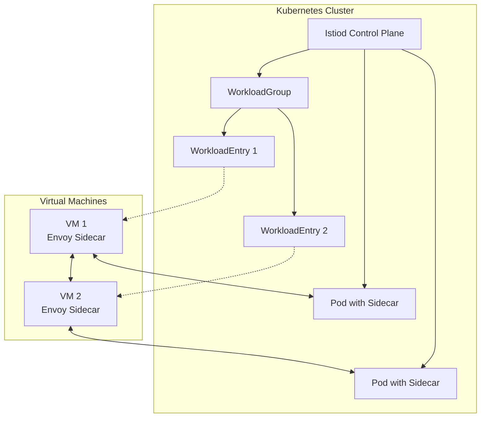
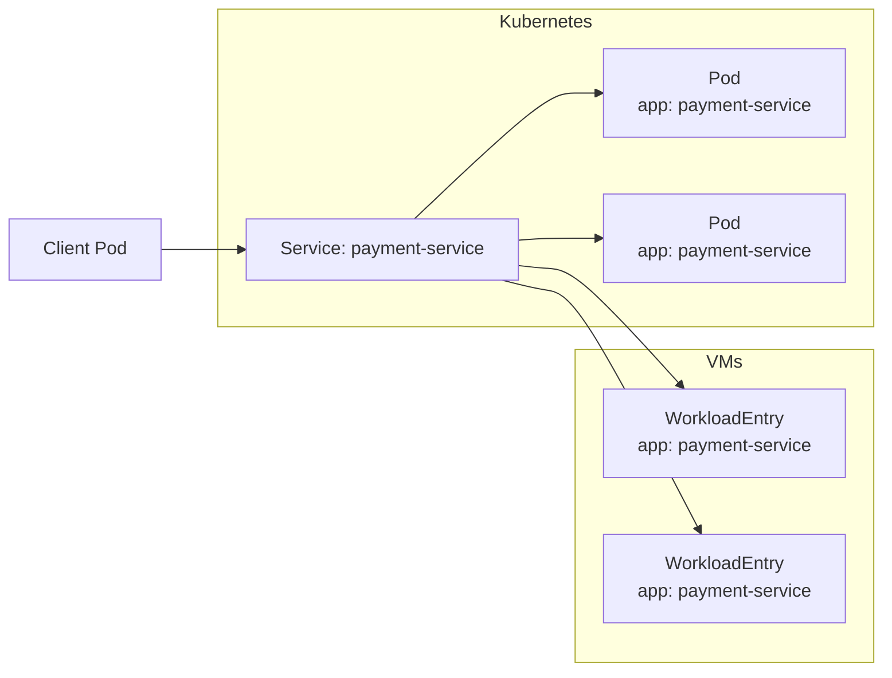
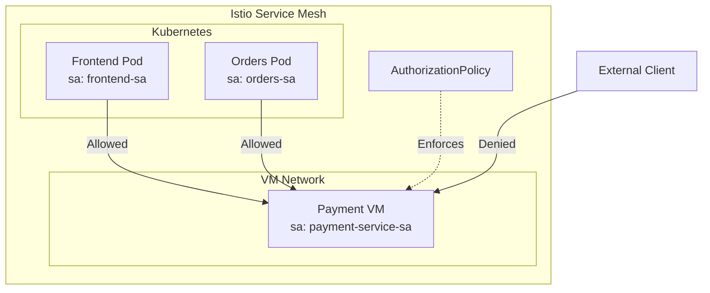

# How to Build Istio WorkloadGroup

Author: [nawazdhandala](https://github.com/nawazdhandala)

Tags: Istio, Kubernetes, ServiceMesh, VMs

Description: Register VM workloads with your Kubernetes service mesh using Istio WorkloadGroup for seamless hybrid infrastructure.

---

Not everything runs in Kubernetes. Legacy applications, databases with specific OS requirements, and hardware-dependent workloads often live on VMs. Istio WorkloadGroup lets you bring these VMs into your service mesh, giving them the same traffic management, security, and observability as your containerized workloads.

## How VM Integration Works

When you add a VM to an Istio mesh, the VM runs a sidecar proxy (Envoy) just like pods do. The WorkloadGroup defines the template for VM workloads, and WorkloadEntry resources represent individual VM instances.



## Prerequisites

Before you start, ensure you have:

- Istio 1.8+ installed with mesh expansion enabled
- VMs with network connectivity to the Kubernetes cluster
- DNS resolution working between VMs and the cluster

Enable mesh expansion in your Istio installation:

```yaml
# istio-operator.yaml
apiVersion: install.istio.io/v1alpha1
kind: IstioOperator
metadata:
  name: istio
  namespace: istio-system
spec:
  values:
    global:
      meshExpansion:
        enabled: true
      multiCluster:
        clusterName: main-cluster
    pilot:
      env:
        PILOT_ENABLE_WORKLOAD_ENTRY_AUTOREGISTRATION: "true"
        PILOT_ENABLE_WORKLOAD_ENTRY_HEALTHCHECKS: "true"
```

## Creating a WorkloadGroup

The WorkloadGroup defines common properties for a set of VM workloads. Think of it as a Deployment template for VMs.

```yaml
# workloadgroup.yaml
apiVersion: networking.istio.io/v1beta1
kind: WorkloadGroup
metadata:
  name: legacy-payment-service
  namespace: payments
spec:
  # Metadata applied to all WorkloadEntries in this group
  metadata:
    labels:
      app: payment-service
      version: v1
      environment: production
    annotations:
      sidecar.istio.io/statsInclusionPrefixes: "cluster.outbound"

  # Template for the workload
  template:
    # Service account for SPIFFE identity
    serviceAccount: payment-service-sa

    # Network the VM belongs to
    network: vm-network

    # Ports exposed by the workload
    ports:
      http: 8080
      grpc: 9090
      metrics: 9091

  # Health probe configuration
  probe:
    # Initial delay before probing starts
    initialDelaySeconds: 10

    # Time between probes
    periodSeconds: 10

    # Probe timeout
    timeoutSeconds: 5

    # Consecutive successes for healthy status
    successThreshold: 1

    # Consecutive failures for unhealthy status
    failureThreshold: 3

    # HTTP health check
    httpGet:
      path: /health
      port: 8080
      scheme: HTTP
```

Apply the WorkloadGroup:

```bash
kubectl apply -f workloadgroup.yaml
```

## WorkloadEntry Auto-Registration

Instead of manually creating WorkloadEntry resources, Istio can automatically register VMs when their sidecars connect to the control plane.

### Generate VM Bootstrap Files

Use `istioctl` to generate the files needed for VM onboarding:

```bash
# Create namespace if it does not exist
kubectl create namespace payments --dry-run=client -o yaml | kubectl apply -f -

# Create service account for the VM workload
kubectl create serviceaccount payment-service-sa -n payments --dry-run=client -o yaml | kubectl apply -f -

# Generate bootstrap files for the WorkloadGroup
istioctl x workload entry configure \
  --name legacy-payment-vm \
  --namespace payments \
  --workloadGroup legacy-payment-service \
  --clusterID main-cluster \
  --output ./vm-bootstrap-files/
```

This generates several files:

```
vm-bootstrap-files/
  cluster.env         # Environment variables for the sidecar
  istio-token         # JWT token for initial authentication
  mesh.yaml           # Mesh configuration
  root-cert.pem       # Root CA certificate
  hosts               # DNS entries to add to /etc/hosts
```

### Install Sidecar on the VM

Transfer the bootstrap files to your VM and run the installation:

```bash
#!/bin/bash
# install-sidecar.sh - Run this on the VM

# Set variables
ISTIO_VERSION="1.20.0"
VM_NAMESPACE="payments"
WORKLOAD_GROUP="legacy-payment-service"
SERVICE_ACCOUNT="payment-service-sa"

# Download Istio sidecar package
curl -LO "https://storage.googleapis.com/istio-release/releases/${ISTIO_VERSION}/deb/istio-sidecar.deb"

# Install the sidecar
sudo dpkg -i istio-sidecar.deb

# Copy bootstrap files to the correct locations
sudo mkdir -p /etc/certs
sudo mkdir -p /var/run/secrets/tokens
sudo mkdir -p /var/lib/istio/envoy
sudo mkdir -p /etc/istio/proxy

# Copy certificates
sudo cp root-cert.pem /etc/certs/root-cert.pem

# Copy the token
sudo cp istio-token /var/run/secrets/tokens/istio-token

# Copy cluster environment
sudo cp cluster.env /var/lib/istio/envoy/cluster.env

# Copy mesh config
sudo cp mesh.yaml /etc/istio/config/mesh

# Add hosts entries
sudo sh -c 'cat hosts >> /etc/hosts'

# Set ownership
sudo chown -R istio-proxy:istio-proxy /etc/certs /var/run/secrets /var/lib/istio /etc/istio

# Start the Istio sidecar service
sudo systemctl enable istio
sudo systemctl start istio
```

### Verify Auto-Registration

Once the sidecar connects, Istio automatically creates a WorkloadEntry:

```bash
# Check that the WorkloadEntry was created
kubectl get workloadentry -n payments

# Example output:
# NAME                        AGE   ADDRESS
# legacy-payment-vm-10.0.1.5  2m    10.0.1.5
```

The auto-registered WorkloadEntry looks like this:

```yaml
apiVersion: networking.istio.io/v1beta1
kind: WorkloadEntry
metadata:
  name: legacy-payment-vm-10.0.1.5
  namespace: payments
  labels:
    app: payment-service
    version: v1
    environment: production
  annotations:
    # Indicates this was auto-registered
    istio.io/autoRegistrationGroup: legacy-payment-service
spec:
  address: 10.0.1.5
  serviceAccount: payment-service-sa
  network: vm-network
  labels:
    app: payment-service
    version: v1
  ports:
    http: 8080
    grpc: 9090
    metrics: 9091
```

## Manual WorkloadEntry Configuration

For more control, you can manually create WorkloadEntry resources:

```yaml
# workloadentry-manual.yaml
apiVersion: networking.istio.io/v1beta1
kind: WorkloadEntry
metadata:
  name: legacy-db-server-1
  namespace: database
  labels:
    app: legacy-database
    instance: primary
spec:
  # IP address of the VM
  address: 10.0.2.10

  # Port mapping
  ports:
    postgres: 5432
    metrics: 9187

  # Service account for identity
  serviceAccount: legacy-db-sa

  # Network identifier
  network: vm-network

  # Locality for load balancing
  locality: us-west-2/us-west-2a

  # Weight for load balancing (default is 1)
  weight: 100

  # Labels for service selection
  labels:
    app: legacy-database
    version: v1
    tier: data
```

## Creating a Service for VM Workloads

To make VMs discoverable by other services, create a Kubernetes Service that selects the WorkloadEntry:

```yaml
# service.yaml
apiVersion: v1
kind: Service
metadata:
  name: payment-service
  namespace: payments
  labels:
    app: payment-service
spec:
  ports:
    - name: http
      port: 8080
      targetPort: 8080
    - name: grpc
      port: 9090
      targetPort: 9090
  selector:
    app: payment-service
```

The Service selector matches the labels on both pods and WorkloadEntries, allowing traffic to flow to either.



## Health Probes and Readiness Configuration

Istio can perform health checks on VM workloads and remove unhealthy instances from load balancing.

### HTTP Health Probe

```yaml
apiVersion: networking.istio.io/v1beta1
kind: WorkloadGroup
metadata:
  name: api-gateway-vms
  namespace: gateway
spec:
  metadata:
    labels:
      app: api-gateway
  template:
    serviceAccount: api-gateway-sa
    ports:
      http: 8080
  probe:
    initialDelaySeconds: 5
    periodSeconds: 10
    timeoutSeconds: 3
    successThreshold: 1
    failureThreshold: 3
    httpGet:
      path: /healthz
      port: 8080
      httpHeaders:
        - name: x-health-check
          value: "istio"
```

### TCP Health Probe

For services that do not have an HTTP endpoint:

```yaml
apiVersion: networking.istio.io/v1beta1
kind: WorkloadGroup
metadata:
  name: tcp-service-vms
  namespace: services
spec:
  metadata:
    labels:
      app: tcp-service
  template:
    serviceAccount: tcp-service-sa
    ports:
      tcp: 9000
  probe:
    initialDelaySeconds: 10
    periodSeconds: 15
    timeoutSeconds: 5
    failureThreshold: 3
    tcpSocket:
      port: 9000
```

### Exec Health Probe

Run a command inside the VM to determine health:

```yaml
apiVersion: networking.istio.io/v1beta1
kind: WorkloadGroup
metadata:
  name: custom-health-vms
  namespace: services
spec:
  metadata:
    labels:
      app: custom-service
  template:
    serviceAccount: custom-service-sa
    ports:
      http: 8080
  probe:
    initialDelaySeconds: 30
    periodSeconds: 60
    timeoutSeconds: 10
    failureThreshold: 2
    exec:
      command:
        - /usr/local/bin/health-check.sh
```

### Monitoring Health Status

Check the health status of WorkloadEntries:

```bash
# View health conditions on WorkloadEntries
kubectl get workloadentry -n payments -o jsonpath='{range .items[*]}{.metadata.name}{"\t"}{.status.conditions[*].type}{"\t"}{.status.conditions[*].status}{"\n"}{end}'

# Detailed health status
kubectl describe workloadentry legacy-payment-vm-10.0.1.5 -n payments
```

## Network Policies for VM Workloads

Istio uses AuthorizationPolicy to control traffic between services, including VMs.

### Allow Traffic from Specific Services

```yaml
# Allow only frontend to call payment-service (VMs and pods)
apiVersion: security.istio.io/v1beta1
kind: AuthorizationPolicy
metadata:
  name: payment-service-authz
  namespace: payments
spec:
  selector:
    matchLabels:
      app: payment-service
  action: ALLOW
  rules:
    - from:
        - source:
            principals:
              - cluster.local/ns/frontend/sa/frontend-sa
      to:
        - operation:
            methods: ["GET", "POST"]
            paths: ["/api/v1/*"]
```

### Deny Traffic from External Networks

```yaml
# Deny all traffic except from mesh services
apiVersion: security.istio.io/v1beta1
kind: AuthorizationPolicy
metadata:
  name: deny-external-to-vms
  namespace: payments
spec:
  selector:
    matchLabels:
      app: payment-service
  action: DENY
  rules:
    - from:
        - source:
            notNamespaces:
              - payments
              - frontend
              - orders
```

### mTLS Configuration for VMs

Ensure VMs use strict mTLS:

```yaml
apiVersion: security.istio.io/v1beta1
kind: PeerAuthentication
metadata:
  name: vm-mtls-strict
  namespace: payments
spec:
  selector:
    matchLabels:
      app: payment-service
  mtls:
    mode: STRICT
```

### Network Flow with Authorization



## Traffic Management for VM Workloads

### Canary Deployment Between VMs and Pods

Route traffic between VM and containerized versions of the same service:

```yaml
# VirtualService for traffic splitting
apiVersion: networking.istio.io/v1beta1
kind: VirtualService
metadata:
  name: payment-service-vs
  namespace: payments
spec:
  hosts:
    - payment-service
  http:
    - match:
        - headers:
            x-canary:
              exact: "true"
      route:
        - destination:
            host: payment-service
            subset: vm-version
          weight: 100
    - route:
        - destination:
            host: payment-service
            subset: k8s-version
          weight: 90
        - destination:
            host: payment-service
            subset: vm-version
          weight: 10
---
# DestinationRule to define subsets
apiVersion: networking.istio.io/v1beta1
kind: DestinationRule
metadata:
  name: payment-service-dr
  namespace: payments
spec:
  host: payment-service
  trafficPolicy:
    connectionPool:
      tcp:
        maxConnections: 100
      http:
        h2UpgradePolicy: UPGRADE
  subsets:
    - name: k8s-version
      labels:
        version: v2
        runtime: kubernetes
    - name: vm-version
      labels:
        version: v1
        runtime: vm
```

### Circuit Breaker for VM Workloads

Protect against slow or failing VMs:

```yaml
apiVersion: networking.istio.io/v1beta1
kind: DestinationRule
metadata:
  name: payment-service-circuit-breaker
  namespace: payments
spec:
  host: payment-service
  trafficPolicy:
    connectionPool:
      tcp:
        maxConnections: 50
      http:
        http1MaxPendingRequests: 100
        http2MaxRequests: 1000
        maxRequestsPerConnection: 100
    outlierDetection:
      consecutive5xxErrors: 5
      interval: 30s
      baseEjectionTime: 60s
      maxEjectionPercent: 50
      minHealthPercent: 30
```

## Complete Example: Hybrid Deployment

Here is a complete example integrating a legacy VM database with Kubernetes services:

```yaml
# 1. Namespace setup
apiVersion: v1
kind: Namespace
metadata:
  name: hybrid-app
  labels:
    istio-injection: enabled
---
# 2. Service account for VM workloads
apiVersion: v1
kind: ServiceAccount
metadata:
  name: legacy-db-sa
  namespace: hybrid-app
---
# 3. WorkloadGroup for database VMs
apiVersion: networking.istio.io/v1beta1
kind: WorkloadGroup
metadata:
  name: legacy-database
  namespace: hybrid-app
spec:
  metadata:
    labels:
      app: legacy-database
      tier: data
  template:
    serviceAccount: legacy-db-sa
    network: vm-network
    ports:
      postgres: 5432
      metrics: 9187
  probe:
    periodSeconds: 30
    tcpSocket:
      port: 5432
---
# 4. Service for the database
apiVersion: v1
kind: Service
metadata:
  name: legacy-database
  namespace: hybrid-app
spec:
  ports:
    - name: postgres
      port: 5432
      targetPort: 5432
  selector:
    app: legacy-database
---
# 5. Authorization policy
apiVersion: security.istio.io/v1beta1
kind: AuthorizationPolicy
metadata:
  name: legacy-db-policy
  namespace: hybrid-app
spec:
  selector:
    matchLabels:
      app: legacy-database
  action: ALLOW
  rules:
    - from:
        - source:
            principals:
              - cluster.local/ns/hybrid-app/sa/api-sa
      to:
        - operation:
            ports: ["5432"]
---
# 6. PeerAuthentication for mTLS
apiVersion: security.istio.io/v1beta1
kind: PeerAuthentication
metadata:
  name: legacy-db-mtls
  namespace: hybrid-app
spec:
  selector:
    matchLabels:
      app: legacy-database
  mtls:
    mode: STRICT
---
# 7. DestinationRule for connection management
apiVersion: networking.istio.io/v1beta1
kind: DestinationRule
metadata:
  name: legacy-db-dr
  namespace: hybrid-app
spec:
  host: legacy-database
  trafficPolicy:
    connectionPool:
      tcp:
        maxConnections: 20
        connectTimeout: 10s
    outlierDetection:
      consecutive5xxErrors: 3
      interval: 10s
      baseEjectionTime: 30s
```

## Troubleshooting VM Integration

### Check Sidecar Connection Status

```bash
# On the VM, check if the sidecar is running
sudo systemctl status istio

# Check sidecar logs
sudo journalctl -u istio -f

# Verify connectivity to istiod
curl -v http://istiod.istio-system.svc:15012/debug/adsz
```

### Verify WorkloadEntry Registration

```bash
# List all WorkloadEntries
kubectl get workloadentry -A

# Check for registration errors in istiod
kubectl logs -n istio-system -l app=istiod | grep -i workloadentry

# Verify the VM appears in the service endpoints
istioctl proxy-config endpoints deploy/frontend -n frontend | grep payment-service
```

### Debug Network Connectivity

```bash
# From the VM, test connectivity to a Kubernetes service
curl -v http://kubernetes-service.namespace.svc.cluster.local:8080

# Check if the sidecar is intercepting traffic
sudo iptables -t nat -L -n | grep ISTIO

# Verify certificates
openssl s_client -connect payment-service.payments.svc:8080 -CAfile /etc/certs/root-cert.pem
```

### Common Issues and Solutions

| Issue | Cause | Solution |
|-------|-------|----------|
| WorkloadEntry not created | Sidecar cannot reach istiod | Check network connectivity and firewall rules |
| mTLS handshake fails | Certificate mismatch | Regenerate bootstrap files with correct cluster ID |
| Service not reachable | DNS resolution failure | Verify /etc/hosts entries from bootstrap |
| Health check fails | Wrong port or path | Update probe configuration in WorkloadGroup |
| Traffic not routed | Missing Service selector | Ensure labels match between Service and WorkloadEntry |

---

Istio WorkloadGroup bridges the gap between VMs and Kubernetes, letting you modernize at your own pace. Your legacy systems get the same security, observability, and traffic management as your containerized workloads. Start by onboarding one VM, verify everything works, then scale to your entire fleet.
