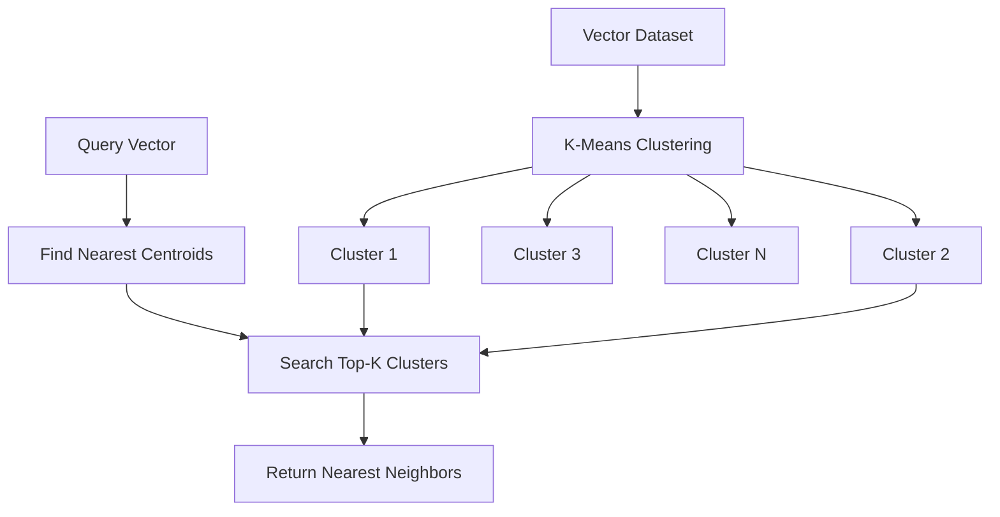
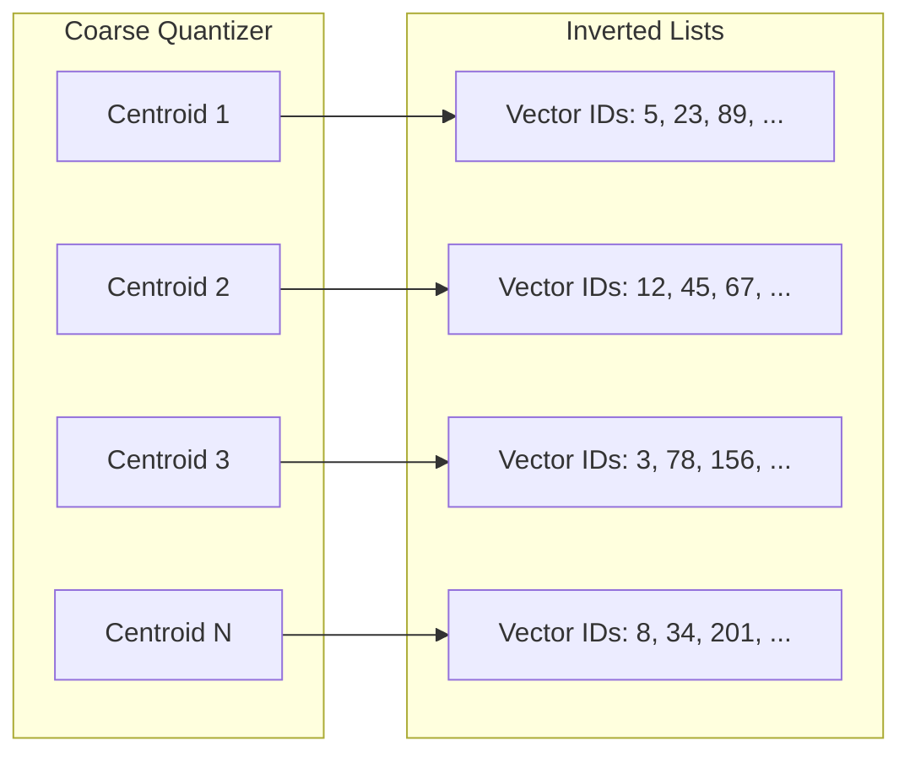
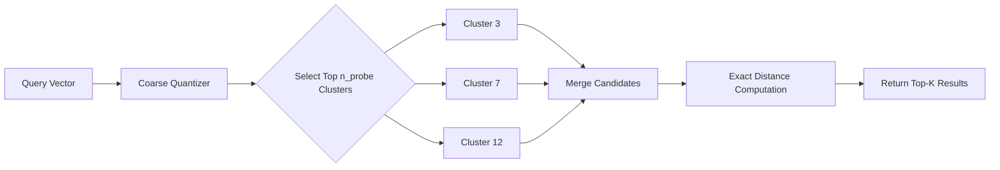
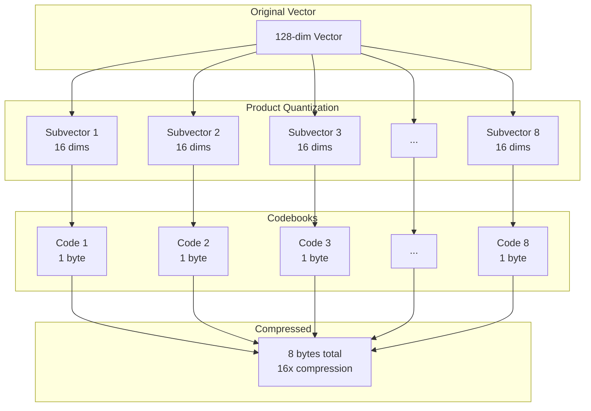

# How to Build IVF Index

Author: [nawazdhandala](https://github.com/nawazdhandala)

Tags: Vector Database, IVF, Indexing, Machine Learning

Description: Learn to implement Inverted File (IVF) indexing for vector databases with clustering, quantization, and search optimization for billion-scale similarity search.

---

Vector databases have become essential infrastructure for modern AI applications, powering everything from semantic search to recommendation systems. When dealing with millions or billions of vectors, brute-force similarity search becomes impractical. This is where Inverted File (IVF) indexing comes in - a technique that dramatically reduces search time by partitioning vectors into clusters.

In this guide, we will walk through building an IVF index from scratch, covering the theory, implementation details, and optimization strategies you need to deploy at scale.

## What is IVF Indexing?

IVF (Inverted File) indexing is an approximate nearest neighbor (ANN) search technique that works by:

1. Partitioning the vector space into clusters using k-means clustering
2. Assigning each vector to its nearest cluster centroid
3. During search, only examining vectors in the most promising clusters

This approach trades a small amount of accuracy for massive speed improvements - often achieving 10-100x faster searches while maintaining 95%+ recall.



## IVF Architecture Overview

The IVF index consists of two main components:

1. **Coarse Quantizer**: A set of cluster centroids that partition the vector space
2. **Inverted Lists**: For each centroid, a list of vectors assigned to that cluster



## Step 1: Implementing K-Means Clustering

The foundation of IVF is k-means clustering. Here is a production-ready implementation:

```python
import numpy as np
from typing import Tuple, List
import faiss

class KMeansQuantizer:
    """
    Coarse quantizer using k-means clustering for IVF index.
    """

    def __init__(self, n_clusters: int, dimension: int, n_iter: int = 20):
        """
        Initialize the k-means quantizer.

        Args:
            n_clusters: Number of clusters (typically sqrt(N) to 4*sqrt(N))
            dimension: Vector dimension
            n_iter: Number of k-means iterations
        """
        self.n_clusters = n_clusters
        self.dimension = dimension
        self.n_iter = n_iter
        self.centroids = None

    def train(self, vectors: np.ndarray) -> None:
        """
        Train k-means on the vector dataset.

        Args:
            vectors: Training vectors of shape (n_samples, dimension)
        """
        # Ensure vectors are float32 for FAISS compatibility
        vectors = vectors.astype(np.float32)

        # Initialize centroids using k-means++
        self.centroids = self._kmeans_plusplus_init(vectors)

        # Run Lloyd's algorithm
        for iteration in range(self.n_iter):
            # Assign vectors to nearest centroids
            assignments = self._assign_to_centroids(vectors)

            # Update centroids
            new_centroids = np.zeros_like(self.centroids)
            counts = np.zeros(self.n_clusters)

            for i, cluster_id in enumerate(assignments):
                new_centroids[cluster_id] += vectors[i]
                counts[cluster_id] += 1

            # Handle empty clusters
            for k in range(self.n_clusters):
                if counts[k] > 0:
                    new_centroids[k] /= counts[k]
                else:
                    # Reinitialize empty cluster with random vector
                    new_centroids[k] = vectors[np.random.randint(len(vectors))]

            self.centroids = new_centroids

    def _kmeans_plusplus_init(self, vectors: np.ndarray) -> np.ndarray:
        """
        Initialize centroids using k-means++ algorithm.
        """
        n_samples = len(vectors)
        centroids = np.zeros((self.n_clusters, self.dimension), dtype=np.float32)

        # Choose first centroid randomly
        centroids[0] = vectors[np.random.randint(n_samples)]

        # Choose remaining centroids
        for k in range(1, self.n_clusters):
            # Compute distances to nearest centroid
            distances = np.min([
                np.sum((vectors - centroids[j]) ** 2, axis=1)
                for j in range(k)
            ], axis=0)

            # Sample proportional to squared distance
            probabilities = distances / distances.sum()
            centroids[k] = vectors[np.random.choice(n_samples, p=probabilities)]

        return centroids

    def _assign_to_centroids(self, vectors: np.ndarray) -> np.ndarray:
        """
        Assign each vector to its nearest centroid.
        """
        # Compute distances using broadcasting
        distances = np.sum(
            (vectors[:, np.newaxis] - self.centroids) ** 2,
            axis=2
        )
        return np.argmin(distances, axis=1)

    def search(self, query: np.ndarray, n_probe: int) -> np.ndarray:
        """
        Find the n_probe nearest centroids for a query vector.

        Args:
            query: Query vector of shape (dimension,)
            n_probe: Number of clusters to probe

        Returns:
            Indices of nearest centroids
        """
        distances = np.sum((self.centroids - query) ** 2, axis=1)
        return np.argsort(distances)[:n_probe]
```

## Step 2: Building the Inverted Lists

Once we have our centroids, we build inverted lists that map each cluster to its member vectors:

```python
from collections import defaultdict
from dataclasses import dataclass
import numpy as np

@dataclass
class InvertedList:
    """Storage for vectors in a single cluster."""
    ids: List[int]           # Original vector IDs
    vectors: np.ndarray      # Vector data (optional, for flat storage)
    codes: np.ndarray        # Compressed codes (for PQ storage)

class IVFIndex:
    """
    Inverted File Index for approximate nearest neighbor search.
    """

    def __init__(
        self,
        dimension: int,
        n_clusters: int,
        metric: str = "l2"
    ):
        """
        Initialize IVF index.

        Args:
            dimension: Vector dimension
            n_clusters: Number of clusters for coarse quantizer
            metric: Distance metric ('l2' or 'ip' for inner product)
        """
        self.dimension = dimension
        self.n_clusters = n_clusters
        self.metric = metric

        self.quantizer = KMeansQuantizer(n_clusters, dimension)
        self.inverted_lists = [
            {"ids": [], "vectors": []}
            for _ in range(n_clusters)
        ]
        self.is_trained = False

    def train(self, vectors: np.ndarray) -> None:
        """
        Train the coarse quantizer on sample vectors.

        Args:
            vectors: Training vectors (can be a subset of full dataset)
        """
        print(f"Training coarse quantizer with {len(vectors)} vectors...")
        self.quantizer.train(vectors)
        self.is_trained = True
        print(f"Training complete. Created {self.n_clusters} clusters.")

    def add(self, vectors: np.ndarray, ids: np.ndarray = None) -> None:
        """
        Add vectors to the index.

        Args:
            vectors: Vectors to add, shape (n_vectors, dimension)
            ids: Optional vector IDs (defaults to sequential)
        """
        if not self.is_trained:
            raise RuntimeError("Index must be trained before adding vectors")

        if ids is None:
            ids = np.arange(len(vectors))

        # Assign vectors to clusters
        assignments = self.quantizer._assign_to_centroids(vectors)

        # Add to inverted lists
        for i, (vector, vector_id, cluster_id) in enumerate(
            zip(vectors, ids, assignments)
        ):
            self.inverted_lists[cluster_id]["ids"].append(vector_id)
            self.inverted_lists[cluster_id]["vectors"].append(vector)

        # Convert lists to arrays for efficiency
        for cluster_id in range(self.n_clusters):
            if self.inverted_lists[cluster_id]["vectors"]:
                self.inverted_lists[cluster_id]["vectors"] = np.array(
                    self.inverted_lists[cluster_id]["vectors"]
                )
```

## Step 3: Implementing Search with Probe Configuration

The `n_probe` parameter controls the accuracy-speed tradeoff:

```python
def search(
    self,
    query: np.ndarray,
    k: int,
    n_probe: int = 1
) -> Tuple[np.ndarray, np.ndarray]:
    """
    Search for k nearest neighbors.

    Args:
        query: Query vector, shape (dimension,)
        k: Number of nearest neighbors to return
        n_probe: Number of clusters to search (higher = more accurate but slower)

    Returns:
        Tuple of (distances, ids) for k nearest neighbors
    """
    # Find nearest clusters
    cluster_ids = self.quantizer.search(query, n_probe)

    # Collect candidates from probed clusters
    candidates = []
    candidate_ids = []

    for cluster_id in cluster_ids:
        inv_list = self.inverted_lists[cluster_id]
        if len(inv_list["ids"]) > 0:
            candidates.append(inv_list["vectors"])
            candidate_ids.extend(inv_list["ids"])

    if not candidates:
        return np.array([]), np.array([])

    # Concatenate all candidates
    candidates = np.vstack(candidates)
    candidate_ids = np.array(candidate_ids)

    # Compute exact distances for candidates
    if self.metric == "l2":
        distances = np.sum((candidates - query) ** 2, axis=1)
    else:  # inner product
        distances = -np.dot(candidates, query)

    # Get top-k
    top_k_indices = np.argsort(distances)[:k]

    return distances[top_k_indices], candidate_ids[top_k_indices]
```



## Step 4: Centroid Selection Strategies

The number and quality of centroids significantly impact index performance. Here are strategies for optimal centroid selection:

```python
def calculate_optimal_clusters(n_vectors: int, target_list_size: int = 1000) -> int:
    """
    Calculate optimal number of clusters.

    Rules of thumb:
    - n_clusters = sqrt(N) for balanced performance
    - n_clusters = 4 * sqrt(N) for higher accuracy
    - Each inverted list should have ~1000-10000 vectors

    Args:
        n_vectors: Total number of vectors
        target_list_size: Target vectors per cluster

    Returns:
        Recommended number of clusters
    """
    # Basic formula
    sqrt_n = int(np.sqrt(n_vectors))

    # Adjusted for target list size
    n_clusters_by_size = n_vectors // target_list_size

    # Use the larger value for better accuracy
    recommended = max(sqrt_n, n_clusters_by_size)

    # Round to power of 2 for memory alignment (optional)
    power_of_2 = 2 ** int(np.ceil(np.log2(recommended)))

    return min(power_of_2, n_vectors // 10)  # At least 10 vectors per cluster


class AdvancedCentroidSelection:
    """
    Advanced centroid selection strategies for IVF.
    """

    @staticmethod
    def hierarchical_kmeans(
        vectors: np.ndarray,
        n_clusters: int,
        branching_factor: int = 32
    ) -> np.ndarray:
        """
        Use hierarchical k-means for faster training on large datasets.

        Instead of running k-means with k=n_clusters directly,
        build a tree structure and extract leaf centroids.
        """
        if n_clusters <= branching_factor:
            # Direct k-means for small cluster counts
            quantizer = KMeansQuantizer(n_clusters, vectors.shape[1])
            quantizer.train(vectors)
            return quantizer.centroids

        # Build hierarchy
        n_levels = int(np.ceil(np.log(n_clusters) / np.log(branching_factor)))

        # First level clustering
        level_quantizer = KMeansQuantizer(branching_factor, vectors.shape[1])
        level_quantizer.train(vectors)

        # Recursive clustering within each cluster
        all_centroids = []
        assignments = level_quantizer._assign_to_centroids(vectors)

        centroids_per_branch = n_clusters // branching_factor

        for branch in range(branching_factor):
            branch_vectors = vectors[assignments == branch]
            if len(branch_vectors) > centroids_per_branch:
                branch_centroids = AdvancedCentroidSelection.hierarchical_kmeans(
                    branch_vectors,
                    centroids_per_branch,
                    branching_factor
                )
            else:
                branch_centroids = branch_vectors
            all_centroids.append(branch_centroids)

        return np.vstack(all_centroids)[:n_clusters]

    @staticmethod
    def balanced_clustering(
        vectors: np.ndarray,
        n_clusters: int,
        max_imbalance: float = 0.1
    ) -> Tuple[np.ndarray, np.ndarray]:
        """
        Create balanced clusters to ensure uniform search time.

        Standard k-means can create highly imbalanced clusters,
        leading to variable query latency. This method enforces
        approximate balance.
        """
        n_vectors = len(vectors)
        target_size = n_vectors // n_clusters
        min_size = int(target_size * (1 - max_imbalance))
        max_size = int(target_size * (1 + max_imbalance))

        # Initialize with k-means
        quantizer = KMeansQuantizer(n_clusters, vectors.shape[1])
        quantizer.train(vectors)

        # Iteratively rebalance
        for _ in range(10):  # Max rebalancing iterations
            assignments = quantizer._assign_to_centroids(vectors)
            cluster_sizes = np.bincount(assignments, minlength=n_clusters)

            # Check if balanced
            if np.all(cluster_sizes >= min_size) and np.all(cluster_sizes <= max_size):
                break

            # Move vectors from large clusters to small ones
            for cluster_id in range(n_clusters):
                if cluster_sizes[cluster_id] > max_size:
                    # Find vectors furthest from centroid
                    cluster_mask = assignments == cluster_id
                    cluster_vectors = vectors[cluster_mask]
                    distances = np.sum(
                        (cluster_vectors - quantizer.centroids[cluster_id]) ** 2,
                        axis=1
                    )

                    # Reassign furthest vectors
                    n_to_move = cluster_sizes[cluster_id] - max_size
                    furthest = np.argsort(distances)[-n_to_move:]

                    # Find nearest small cluster for each
                    for idx in furthest:
                        vector = cluster_vectors[idx]
                        centroid_distances = np.sum(
                            (quantizer.centroids - vector) ** 2,
                            axis=1
                        )
                        # Exclude current and full clusters
                        centroid_distances[cluster_id] = np.inf
                        for c in range(n_clusters):
                            if cluster_sizes[c] >= max_size:
                                centroid_distances[c] = np.inf

                        new_cluster = np.argmin(centroid_distances)
                        # Update assignment (simplified - actual implementation
                        # would update the assignments array)
                        cluster_sizes[cluster_id] -= 1
                        cluster_sizes[new_cluster] += 1

        return quantizer.centroids, assignments
```

## Step 5: Memory Optimization with Product Quantization

For billion-scale datasets, storing raw vectors is impractical. Product Quantization (PQ) compresses vectors to a fraction of their original size:

```python
class ProductQuantizer:
    """
    Product Quantization for memory-efficient vector storage.

    Splits vectors into subspaces and quantizes each independently.
    """

    def __init__(
        self,
        dimension: int,
        n_subquantizers: int = 8,
        n_bits: int = 8
    ):
        """
        Initialize Product Quantizer.

        Args:
            dimension: Vector dimension (must be divisible by n_subquantizers)
            n_subquantizers: Number of subspaces (M)
            n_bits: Bits per subquantizer code (typically 8 = 256 centroids)
        """
        assert dimension % n_subquantizers == 0

        self.dimension = dimension
        self.n_subquantizers = n_subquantizers
        self.n_bits = n_bits
        self.n_centroids = 2 ** n_bits  # 256 for 8 bits
        self.subvector_dim = dimension // n_subquantizers

        # Codebooks: one for each subspace
        self.codebooks = None  # Shape: (M, K, D/M)

    def train(self, vectors: np.ndarray) -> None:
        """
        Train PQ codebooks on sample vectors.
        """
        vectors = vectors.astype(np.float32)
        self.codebooks = np.zeros(
            (self.n_subquantizers, self.n_centroids, self.subvector_dim),
            dtype=np.float32
        )

        # Train each subquantizer independently
        for m in range(self.n_subquantizers):
            start_idx = m * self.subvector_dim
            end_idx = (m + 1) * self.subvector_dim
            subvectors = vectors[:, start_idx:end_idx]

            # K-means on subspace
            quantizer = KMeansQuantizer(self.n_centroids, self.subvector_dim)
            quantizer.train(subvectors)
            self.codebooks[m] = quantizer.centroids

    def encode(self, vectors: np.ndarray) -> np.ndarray:
        """
        Encode vectors to PQ codes.

        Args:
            vectors: Vectors to encode, shape (N, D)

        Returns:
            PQ codes, shape (N, M) with dtype uint8
        """
        n_vectors = len(vectors)
        codes = np.zeros((n_vectors, self.n_subquantizers), dtype=np.uint8)

        for m in range(self.n_subquantizers):
            start_idx = m * self.subvector_dim
            end_idx = (m + 1) * self.subvector_dim
            subvectors = vectors[:, start_idx:end_idx]

            # Find nearest centroid in this subspace
            distances = np.sum(
                (subvectors[:, np.newaxis] - self.codebooks[m]) ** 2,
                axis=2
            )
            codes[:, m] = np.argmin(distances, axis=1)

        return codes

    def decode(self, codes: np.ndarray) -> np.ndarray:
        """
        Decode PQ codes back to approximate vectors.
        """
        n_vectors = len(codes)
        vectors = np.zeros((n_vectors, self.dimension), dtype=np.float32)

        for m in range(self.n_subquantizers):
            start_idx = m * self.subvector_dim
            end_idx = (m + 1) * self.subvector_dim
            vectors[:, start_idx:end_idx] = self.codebooks[m][codes[:, m]]

        return vectors

    def compute_distance_tables(self, query: np.ndarray) -> np.ndarray:
        """
        Precompute distance tables for efficient search.

        Args:
            query: Query vector, shape (D,)

        Returns:
            Distance tables, shape (M, K)
        """
        tables = np.zeros((self.n_subquantizers, self.n_centroids), dtype=np.float32)

        for m in range(self.n_subquantizers):
            start_idx = m * self.subvector_dim
            end_idx = (m + 1) * self.subvector_dim
            subquery = query[start_idx:end_idx]

            # Distance from query subvector to all centroids in this subspace
            tables[m] = np.sum((self.codebooks[m] - subquery) ** 2, axis=1)

        return tables

    def asymmetric_distance(
        self,
        query: np.ndarray,
        codes: np.ndarray
    ) -> np.ndarray:
        """
        Compute asymmetric distances (ADC) for efficient search.

        Uses exact query but quantized database vectors.
        """
        tables = self.compute_distance_tables(query)

        # Sum distances across subspaces using precomputed tables
        distances = np.zeros(len(codes), dtype=np.float32)
        for m in range(self.n_subquantizers):
            distances += tables[m, codes[:, m]]

        return distances
```



## Step 6: Complete IVF-PQ Implementation

Here is the full IVF index with Product Quantization:

```python
class IVFPQIndex:
    """
    IVF index with Product Quantization for memory-efficient
    billion-scale similarity search.
    """

    def __init__(
        self,
        dimension: int,
        n_clusters: int,
        n_subquantizers: int = 8,
        n_bits: int = 8
    ):
        self.dimension = dimension
        self.n_clusters = n_clusters

        # Coarse quantizer
        self.coarse_quantizer = KMeansQuantizer(n_clusters, dimension)

        # Product quantizer for residuals
        self.pq = ProductQuantizer(dimension, n_subquantizers, n_bits)

        # Inverted lists store PQ codes instead of vectors
        self.inverted_lists = [
            {"ids": [], "codes": None}
            for _ in range(n_clusters)
        ]

        self.is_trained = False

    def train(self, vectors: np.ndarray) -> None:
        """
        Train both coarse quantizer and product quantizer.
        """
        vectors = vectors.astype(np.float32)

        # Train coarse quantizer
        print("Training coarse quantizer...")
        self.coarse_quantizer.train(vectors)

        # Compute residuals for PQ training
        print("Computing residuals...")
        assignments = self.coarse_quantizer._assign_to_centroids(vectors)
        residuals = vectors - self.coarse_quantizer.centroids[assignments]

        # Train PQ on residuals
        print("Training product quantizer...")
        self.pq.train(residuals)

        self.is_trained = True
        print("Training complete!")

    def add(self, vectors: np.ndarray, ids: np.ndarray = None) -> None:
        """
        Add vectors to the index.
        """
        if not self.is_trained:
            raise RuntimeError("Index must be trained first")

        vectors = vectors.astype(np.float32)

        if ids is None:
            ids = np.arange(len(vectors))

        # Assign to clusters
        assignments = self.coarse_quantizer._assign_to_centroids(vectors)

        # Compute residuals and encode
        residuals = vectors - self.coarse_quantizer.centroids[assignments]
        codes = self.pq.encode(residuals)

        # Add to inverted lists
        for cluster_id in range(self.n_clusters):
            mask = assignments == cluster_id
            if np.any(mask):
                self.inverted_lists[cluster_id]["ids"].extend(ids[mask].tolist())
                cluster_codes = codes[mask]
                if self.inverted_lists[cluster_id]["codes"] is None:
                    self.inverted_lists[cluster_id]["codes"] = cluster_codes
                else:
                    self.inverted_lists[cluster_id]["codes"] = np.vstack([
                        self.inverted_lists[cluster_id]["codes"],
                        cluster_codes
                    ])

    def search(
        self,
        query: np.ndarray,
        k: int,
        n_probe: int = 10
    ) -> Tuple[np.ndarray, np.ndarray]:
        """
        Search using asymmetric distance computation.
        """
        query = query.astype(np.float32)

        # Find nearest clusters
        cluster_ids = self.coarse_quantizer.search(query, n_probe)

        # Collect candidates and compute distances
        all_distances = []
        all_ids = []

        for cluster_id in cluster_ids:
            inv_list = self.inverted_lists[cluster_id]
            if inv_list["codes"] is None or len(inv_list["ids"]) == 0:
                continue

            # Compute residual for this cluster
            residual = query - self.coarse_quantizer.centroids[cluster_id]

            # Asymmetric distance computation
            distances = self.pq.asymmetric_distance(residual, inv_list["codes"])

            all_distances.extend(distances.tolist())
            all_ids.extend(inv_list["ids"])

        if not all_distances:
            return np.array([]), np.array([])

        # Get top-k
        all_distances = np.array(all_distances)
        all_ids = np.array(all_ids)

        top_k_indices = np.argsort(all_distances)[:k]

        return all_distances[top_k_indices], all_ids[top_k_indices]

    def memory_usage(self) -> dict:
        """
        Calculate memory usage of the index.
        """
        # Centroids
        centroid_memory = self.n_clusters * self.dimension * 4  # float32

        # PQ codebooks
        codebook_memory = (
            self.pq.n_subquantizers *
            self.pq.n_centroids *
            self.pq.subvector_dim * 4
        )

        # Inverted lists (PQ codes)
        n_vectors = sum(len(inv["ids"]) for inv in self.inverted_lists)
        codes_memory = n_vectors * self.pq.n_subquantizers  # uint8

        # IDs
        ids_memory = n_vectors * 8  # int64

        return {
            "centroids_mb": centroid_memory / (1024 ** 2),
            "codebooks_mb": codebook_memory / (1024 ** 2),
            "codes_mb": codes_memory / (1024 ** 2),
            "ids_mb": ids_memory / (1024 ** 2),
            "total_mb": (
                centroid_memory + codebook_memory + codes_memory + ids_memory
            ) / (1024 ** 2),
            "n_vectors": n_vectors,
            "bytes_per_vector": (codes_memory + ids_memory) / max(n_vectors, 1)
        }
```

## Performance Tuning Guide

### Choosing n_probe

The `n_probe` parameter directly controls the accuracy-speed tradeoff:

```python
def benchmark_nprobe(
    index: IVFPQIndex,
    queries: np.ndarray,
    ground_truth: np.ndarray,
    k: int = 10
) -> dict:
    """
    Benchmark different n_probe values to find optimal setting.
    """
    import time

    results = []

    for n_probe in [1, 2, 4, 8, 16, 32, 64, 128]:
        start = time.time()

        recalls = []
        for query, true_neighbors in zip(queries, ground_truth):
            _, predicted = index.search(query, k, n_probe=n_probe)

            # Calculate recall@k
            recall = len(set(predicted) & set(true_neighbors[:k])) / k
            recalls.append(recall)

        elapsed = time.time() - start
        avg_recall = np.mean(recalls)
        qps = len(queries) / elapsed

        results.append({
            "n_probe": n_probe,
            "recall": avg_recall,
            "qps": qps,
            "latency_ms": elapsed / len(queries) * 1000
        })

        print(f"n_probe={n_probe:3d}: recall={avg_recall:.3f}, QPS={qps:.1f}")

    return results
```

### Memory vs Accuracy Tradeoffs

| Configuration | Memory per Vector | Typical Recall@10 |
|---------------|-------------------|-------------------|
| IVF (flat) | 512 bytes (128d float32) | 99%+ |
| IVF-PQ8x8 | 16 bytes | 90-95% |
| IVF-PQ16x8 | 24 bytes | 95-98% |
| IVF-PQ32x4 | 20 bytes | 85-90% |

## Using FAISS for Production

For production deployments, use FAISS which provides optimized implementations:

```python
import faiss
import numpy as np

def create_faiss_ivf_index(
    dimension: int,
    n_clusters: int,
    use_gpu: bool = False
) -> faiss.Index:
    """
    Create a production-ready IVF-PQ index with FAISS.
    """
    # Coarse quantizer
    quantizer = faiss.IndexFlatL2(dimension)

    # IVF-PQ index
    # Parameters: dimension, n_clusters, n_subquantizers, n_bits
    index = faiss.IndexIVFPQ(quantizer, dimension, n_clusters, 16, 8)

    if use_gpu:
        # Move to GPU for faster search
        res = faiss.StandardGpuResources()
        index = faiss.index_cpu_to_gpu(res, 0, index)

    return index


def build_and_search_example():
    """
    Complete example of building and searching an IVF index.
    """
    # Configuration
    dimension = 128
    n_vectors = 1_000_000
    n_queries = 1000
    n_clusters = 4096  # 4 * sqrt(1M)

    # Generate sample data
    print("Generating sample data...")
    np.random.seed(42)
    vectors = np.random.randn(n_vectors, dimension).astype(np.float32)
    queries = np.random.randn(n_queries, dimension).astype(np.float32)

    # Normalize vectors (common for embedding models)
    vectors /= np.linalg.norm(vectors, axis=1, keepdims=True)
    queries /= np.linalg.norm(queries, axis=1, keepdims=True)

    # Build index
    print("Building IVF-PQ index...")
    index = create_faiss_ivf_index(dimension, n_clusters)

    # Train on subset
    train_size = min(n_vectors, 100_000)
    train_indices = np.random.choice(n_vectors, train_size, replace=False)
    index.train(vectors[train_indices])

    # Add all vectors
    index.add(vectors)

    print(f"Index contains {index.ntotal} vectors")

    # Search with different n_probe values
    k = 10
    for n_probe in [1, 8, 32, 128]:
        index.nprobe = n_probe

        import time
        start = time.time()
        distances, indices = index.search(queries, k)
        elapsed = time.time() - start

        qps = n_queries / elapsed
        print(f"n_probe={n_probe:3d}: {qps:.1f} QPS, latency={elapsed/n_queries*1000:.2f}ms")

    return index


# Run example
if __name__ == "__main__":
    index = build_and_search_example()
```

## Best Practices Summary

1. **Cluster Count**: Use `n_clusters = 4 * sqrt(N)` as a starting point. Adjust based on your accuracy requirements.

2. **Training Data**: Train on a representative sample of at least 30 * n_clusters vectors.

3. **Probe Configuration**: Start with `n_probe = n_clusters / 10` and tune based on recall measurements.

4. **Product Quantization**: Use `n_subquantizers = dimension / 8` for good compression with reasonable accuracy.

5. **Batch Operations**: Always add and search vectors in batches for better throughput.

6. **Memory Mapping**: For very large indexes, use memory-mapped files to avoid loading everything into RAM.

7. **Index Sharding**: For billion-scale datasets, shard the index across multiple machines.

## Conclusion

IVF indexing is a powerful technique for scaling vector search to billions of vectors. By combining coarse quantization with inverted lists, you can achieve sub-millisecond query latencies while maintaining high recall.

The key to success is understanding the tradeoffs:
- More clusters mean faster search but higher memory for centroids
- Higher n_probe increases recall but reduces throughput
- Product Quantization dramatically reduces memory but introduces quantization error

Start with the guidelines in this article, measure recall on your specific data, and tune parameters accordingly. For production systems, leverage optimized libraries like FAISS that provide GPU acceleration and advanced features like OPQ (Optimized Product Quantization) for even better performance.

Happy indexing!
