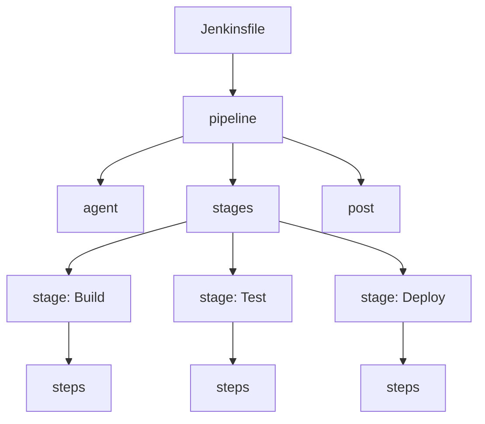
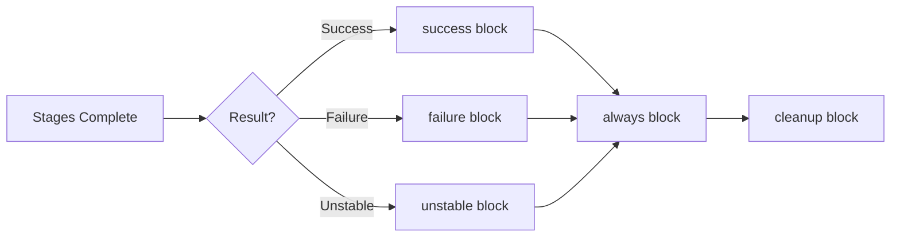

# How to Create Jenkins Declarative Pipelines

Author: [nawazdhandala](https://github.com/nawazdhandala)

Tags: Jenkins, Pipeline, CI/CD, Declarative

Description: A practical guide to writing Jenkins Declarative Pipelines with examples covering stages, agents, post actions, and environment variables.

---

Jenkins Declarative Pipelines give you a structured, readable way to define your CI/CD workflows as code. Instead of clicking through the UI or writing complex Scripted Pipelines, you get a clean syntax that enforces best practices.

## Declarative vs Scripted Pipelines

Jenkins supports two pipeline syntaxes:

| Aspect | Declarative | Scripted |
|--------|-------------|----------|
| Syntax | Structured, predefined sections | Groovy-based, freeform |
| Learning curve | Lower | Higher |
| Error handling | Built-in `post` section | Manual try/catch |
| Flexibility | Opinionated | Full Groovy power |

For most teams, Declarative is the right choice. It reads clearly, catches mistakes early, and works well with Blue Ocean.

## Basic Pipeline Structure



Here is a minimal Jenkinsfile:

```groovy
pipeline {
    agent any

    stages {
        stage('Build') {
            steps {
                echo 'Building the application...'
                sh 'npm install'
                sh 'npm run build'
            }
        }

        stage('Test') {
            steps {
                echo 'Running tests...'
                sh 'npm test'
            }
        }

        stage('Deploy') {
            steps {
                echo 'Deploying to staging...'
                sh './deploy.sh staging'
            }
        }
    }
}
```

Save this as `Jenkinsfile` in your repository root. Jenkins will discover and run it automatically if you set up a Multibranch Pipeline.

## Configuring Agents

The `agent` directive tells Jenkins where to run your pipeline.

### Run on Any Available Node

```groovy
pipeline {
    agent any
    stages {
        stage('Build') {
            steps {
                sh 'make build'
            }
        }
    }
}
```

### Run Inside a Docker Container

```groovy
pipeline {
    agent {
        docker {
            image 'node:20-alpine'
            args '-v /tmp:/tmp'
        }
    }
    stages {
        stage('Build') {
            steps {
                sh 'node --version'
                sh 'npm ci'
                sh 'npm run build'
            }
        }
    }
}
```

### Run on a Labeled Node

```groovy
pipeline {
    agent {
        label 'linux && docker'
    }
    stages {
        stage('Build') {
            steps {
                sh 'docker build -t myapp .'
            }
        }
    }
}
```

### Different Agents per Stage

```groovy
pipeline {
    agent none

    stages {
        stage('Build') {
            agent {
                docker { image 'node:20-alpine' }
            }
            steps {
                sh 'npm ci && npm run build'
                stash includes: 'dist/**', name: 'build-artifacts'
            }
        }

        stage('Test') {
            agent {
                docker { image 'node:20-alpine' }
            }
            steps {
                unstash 'build-artifacts'
                sh 'npm test'
            }
        }

        stage('Deploy') {
            agent {
                label 'production'
            }
            steps {
                unstash 'build-artifacts'
                sh './deploy.sh'
            }
        }
    }
}
```

## Environment Variables

Define environment variables at the pipeline or stage level.

### Global Environment Variables

```groovy
pipeline {
    agent any

    environment {
        APP_NAME = 'myapp'
        APP_VERSION = '1.0.0'
        DOCKER_REGISTRY = 'registry.example.com'
    }

    stages {
        stage('Build') {
            steps {
                sh 'echo "Building ${APP_NAME} version ${APP_VERSION}"'
                sh 'docker build -t ${DOCKER_REGISTRY}/${APP_NAME}:${APP_VERSION} .'
            }
        }
    }
}
```

### Stage-Specific Variables

```groovy
pipeline {
    agent any

    stages {
        stage('Build') {
            environment {
                NODE_ENV = 'production'
                BUILD_ID = "${env.BUILD_NUMBER}-${env.GIT_COMMIT[0..7]}"
            }
            steps {
                sh 'echo "Build ID: ${BUILD_ID}"'
                sh 'npm run build'
            }
        }
    }
}
```

### Using Credentials

```groovy
pipeline {
    agent any

    environment {
        DOCKER_CREDS = credentials('docker-hub-creds')
        AWS_ACCESS_KEY_ID = credentials('aws-access-key')
        AWS_SECRET_ACCESS_KEY = credentials('aws-secret-key')
    }

    stages {
        stage('Push') {
            steps {
                sh 'echo ${DOCKER_CREDS_PSW} | docker login -u ${DOCKER_CREDS_USR} --password-stdin'
                sh 'docker push myapp:latest'
            }
        }
    }
}
```

The `credentials()` helper handles username/password, secret text, and SSH keys. For username/password credentials, Jenkins creates `_USR` and `_PSW` variables automatically.

## Post Actions

The `post` section runs after stages complete, regardless of success or failure.



### Full Post Section Example

```groovy
pipeline {
    agent any

    stages {
        stage('Build') {
            steps {
                sh 'npm ci'
                sh 'npm run build'
            }
        }

        stage('Test') {
            steps {
                sh 'npm test -- --coverage'
            }
        }
    }

    post {
        always {
            echo 'Pipeline completed'
            archiveArtifacts artifacts: 'dist/**', allowEmptyArchive: true
            junit 'test-results/*.xml'
        }

        success {
            echo 'Build succeeded!'
            slackSend channel: '#builds', color: 'good', message: "Build ${env.BUILD_NUMBER} passed"
        }

        failure {
            echo 'Build failed!'
            slackSend channel: '#builds', color: 'danger', message: "Build ${env.BUILD_NUMBER} failed"
            mail to: 'team@example.com',
                 subject: "Build Failed: ${env.JOB_NAME}",
                 body: "Check console output at ${env.BUILD_URL}"
        }

        unstable {
            echo 'Build is unstable (flaky tests?)'
        }

        cleanup {
            cleanWs()
            sh 'docker system prune -f'
        }
    }
}
```

Post conditions:
- `always`: Runs every time
- `success`: Only on success
- `failure`: Only on failure
- `unstable`: When tests fail but build passes
- `changed`: When result differs from last build
- `cleanup`: Runs last, even if previous post blocks fail

## Parallel Stages

Run independent stages simultaneously to speed up builds.

```groovy
pipeline {
    agent any

    stages {
        stage('Build') {
            steps {
                sh 'npm ci'
                sh 'npm run build'
            }
        }

        stage('Quality Checks') {
            parallel {
                stage('Unit Tests') {
                    steps {
                        sh 'npm run test:unit'
                    }
                }

                stage('Integration Tests') {
                    agent {
                        docker { image 'docker/compose:latest' }
                    }
                    steps {
                        sh 'docker compose up -d'
                        sh 'npm run test:integration'
                        sh 'docker compose down'
                    }
                }

                stage('Lint') {
                    steps {
                        sh 'npm run lint'
                    }
                }

                stage('Security Scan') {
                    steps {
                        sh 'npm audit --audit-level=high'
                    }
                }
            }
        }

        stage('Deploy') {
            steps {
                sh './deploy.sh'
            }
        }
    }
}
```

## Conditional Execution with When

Skip stages based on conditions.

### Branch-Based Conditions

```groovy
pipeline {
    agent any

    stages {
        stage('Build') {
            steps {
                sh 'npm run build'
            }
        }

        stage('Deploy to Staging') {
            when {
                branch 'develop'
            }
            steps {
                sh './deploy.sh staging'
            }
        }

        stage('Deploy to Production') {
            when {
                branch 'main'
            }
            steps {
                sh './deploy.sh production'
            }
        }
    }
}
```

### Multiple Conditions

```groovy
pipeline {
    agent any

    stages {
        stage('Deploy') {
            when {
                allOf {
                    branch 'main'
                    environment name: 'DEPLOY_ENABLED', value: 'true'
                }
            }
            steps {
                sh './deploy.sh'
            }
        }

        stage('Nightly Build') {
            when {
                triggeredBy 'TimerTrigger'
            }
            steps {
                sh './run-nightly-tests.sh'
            }
        }

        stage('PR Preview') {
            when {
                changeRequest()
            }
            steps {
                sh './deploy-preview.sh'
            }
        }
    }
}
```

### Expression-Based Conditions

```groovy
pipeline {
    agent any

    stages {
        stage('Performance Tests') {
            when {
                expression { return env.RUN_PERF_TESTS == 'true' }
            }
            steps {
                sh './perf-tests.sh'
            }
        }

        stage('Skip CI') {
            when {
                not {
                    changelog '.*\\[skip ci\\].*'
                }
            }
            steps {
                sh 'npm run build'
            }
        }
    }
}
```

## Input and Approval Gates

Pause the pipeline and wait for user input.

```groovy
pipeline {
    agent any

    stages {
        stage('Build') {
            steps {
                sh 'npm run build'
            }
        }

        stage('Deploy to Staging') {
            steps {
                sh './deploy.sh staging'
            }
        }

        stage('Approval') {
            steps {
                input message: 'Deploy to production?', ok: 'Deploy',
                      submitter: 'admin,release-team'
            }
        }

        stage('Deploy to Production') {
            steps {
                sh './deploy.sh production'
            }
        }
    }
}
```

### Input with Parameters

```groovy
pipeline {
    agent any

    stages {
        stage('Select Environment') {
            steps {
                script {
                    def userInput = input message: 'Configure deployment',
                        parameters: [
                            choice(name: 'ENVIRONMENT', choices: ['staging', 'production'], description: 'Target environment'),
                            string(name: 'VERSION', defaultValue: 'latest', description: 'Version to deploy'),
                            booleanParam(name: 'RUN_MIGRATIONS', defaultValue: true, description: 'Run database migrations')
                        ]
                    env.DEPLOY_ENV = userInput.ENVIRONMENT
                    env.DEPLOY_VERSION = userInput.VERSION
                    env.RUN_MIGRATIONS = userInput.RUN_MIGRATIONS
                }
            }
        }

        stage('Deploy') {
            steps {
                sh './deploy.sh ${DEPLOY_ENV} ${DEPLOY_VERSION}'
            }
        }
    }
}
```

## Options and Triggers

Configure pipeline behavior with options.

```groovy
pipeline {
    agent any

    options {
        timeout(time: 30, unit: 'MINUTES')
        retry(2)
        timestamps()
        buildDiscarder(logRotator(numToKeepStr: '10'))
        disableConcurrentBuilds()
        skipStagesAfterUnstable()
    }

    triggers {
        cron('H 2 * * *')  // Nightly at 2 AM
        pollSCM('H/5 * * * *')  // Check SCM every 5 minutes
        upstream(upstreamProjects: 'lib-build', threshold: hudson.model.Result.SUCCESS)
    }

    stages {
        stage('Build') {
            options {
                timeout(time: 10, unit: 'MINUTES')
            }
            steps {
                sh 'npm run build'
            }
        }
    }
}
```

## Complete Production Pipeline

Here is a real-world pipeline that puts it all together.

```groovy
pipeline {
    agent any

    environment {
        APP_NAME = 'myapp'
        DOCKER_REGISTRY = 'registry.example.com'
        DOCKER_CREDS = credentials('docker-registry')
        KUBECONFIG = credentials('kubeconfig-prod')
    }

    options {
        timeout(time: 45, unit: 'MINUTES')
        timestamps()
        buildDiscarder(logRotator(numToKeepStr: '20'))
        disableConcurrentBuilds()
    }

    stages {
        stage('Checkout') {
            steps {
                checkout scm
                script {
                    env.GIT_COMMIT_SHORT = sh(script: 'git rev-parse --short HEAD', returnStdout: true).trim()
                    env.IMAGE_TAG = "${env.BRANCH_NAME}-${env.GIT_COMMIT_SHORT}"
                }
            }
        }

        stage('Build') {
            agent {
                docker {
                    image 'node:20-alpine'
                    reuseNode true
                }
            }
            steps {
                sh 'npm ci --prefer-offline'
                sh 'npm run build'
                stash includes: 'dist/**', name: 'build'
            }
        }

        stage('Test') {
            parallel {
                stage('Unit Tests') {
                    agent {
                        docker {
                            image 'node:20-alpine'
                            reuseNode true
                        }
                    }
                    steps {
                        sh 'npm run test:unit -- --coverage'
                    }
                    post {
                        always {
                            junit 'coverage/junit.xml'
                            publishHTML([
                                reportDir: 'coverage/lcov-report',
                                reportFiles: 'index.html',
                                reportName: 'Coverage Report'
                            ])
                        }
                    }
                }

                stage('Security Scan') {
                    steps {
                        sh 'npm audit --audit-level=high'
                    }
                }

                stage('Lint') {
                    agent {
                        docker {
                            image 'node:20-alpine'
                            reuseNode true
                        }
                    }
                    steps {
                        sh 'npm run lint'
                    }
                }
            }
        }

        stage('Build Image') {
            steps {
                unstash 'build'
                sh '''
                    docker build -t ${DOCKER_REGISTRY}/${APP_NAME}:${IMAGE_TAG} .
                    docker tag ${DOCKER_REGISTRY}/${APP_NAME}:${IMAGE_TAG} ${DOCKER_REGISTRY}/${APP_NAME}:latest
                '''
            }
        }

        stage('Push Image') {
            steps {
                sh '''
                    echo ${DOCKER_CREDS_PSW} | docker login ${DOCKER_REGISTRY} -u ${DOCKER_CREDS_USR} --password-stdin
                    docker push ${DOCKER_REGISTRY}/${APP_NAME}:${IMAGE_TAG}
                    docker push ${DOCKER_REGISTRY}/${APP_NAME}:latest
                '''
            }
        }

        stage('Deploy to Staging') {
            when {
                branch 'develop'
            }
            steps {
                sh 'kubectl --kubeconfig=${KUBECONFIG} set image deployment/${APP_NAME} ${APP_NAME}=${DOCKER_REGISTRY}/${APP_NAME}:${IMAGE_TAG} -n staging'
                sh 'kubectl --kubeconfig=${KUBECONFIG} rollout status deployment/${APP_NAME} -n staging --timeout=300s'
            }
        }

        stage('Deploy to Production') {
            when {
                branch 'main'
            }
            steps {
                input message: 'Deploy to production?', ok: 'Deploy', submitter: 'release-team'
                sh 'kubectl --kubeconfig=${KUBECONFIG} set image deployment/${APP_NAME} ${APP_NAME}=${DOCKER_REGISTRY}/${APP_NAME}:${IMAGE_TAG} -n production'
                sh 'kubectl --kubeconfig=${KUBECONFIG} rollout status deployment/${APP_NAME} -n production --timeout=300s'
            }
        }
    }

    post {
        always {
            cleanWs()
            sh 'docker rmi ${DOCKER_REGISTRY}/${APP_NAME}:${IMAGE_TAG} || true'
        }

        success {
            slackSend channel: '#deployments',
                      color: 'good',
                      message: "Deployed ${APP_NAME}:${IMAGE_TAG} successfully"
        }

        failure {
            slackSend channel: '#deployments',
                      color: 'danger',
                      message: "Failed to deploy ${APP_NAME}:${IMAGE_TAG}"
        }
    }
}
```

## Shared Libraries

For pipelines used across multiple projects, create a shared library.

```
jenkins-shared-library/
├── vars/
│   ├── buildNode.groovy
│   └── deployToK8s.groovy
└── src/
    └── com/
        └── example/
            └── Utils.groovy
```

**vars/buildNode.groovy:**

```groovy
def call(Map config = [:]) {
    def nodeVersion = config.nodeVersion ?: '20'

    pipeline {
        agent {
            docker { image "node:${nodeVersion}-alpine" }
        }

        stages {
            stage('Install') {
                steps {
                    sh 'npm ci'
                }
            }

            stage('Build') {
                steps {
                    sh 'npm run build'
                }
            }

            stage('Test') {
                steps {
                    sh 'npm test'
                }
            }
        }
    }
}
```

**Jenkinsfile using the library:**

```groovy
@Library('jenkins-shared-library') _

buildNode(nodeVersion: '20')
```

## Debugging Tips

### Print Environment Variables

```groovy
stage('Debug') {
    steps {
        sh 'printenv | sort'
    }
}
```

### Inspect Workspace

```groovy
stage('Debug') {
    steps {
        sh 'ls -la'
        sh 'pwd'
        sh 'cat package.json'
    }
}
```

### Use Replay

In the Jenkins UI, click "Replay" on any build to modify the Jenkinsfile and run it again without committing changes. This speeds up debugging significantly.

---

Declarative Pipelines make Jenkins configuration readable and maintainable. Start with a simple pipeline, add stages as needed, and use the `post` section to handle notifications and cleanup. Your CI/CD workflow lives in version control right next to your code.
