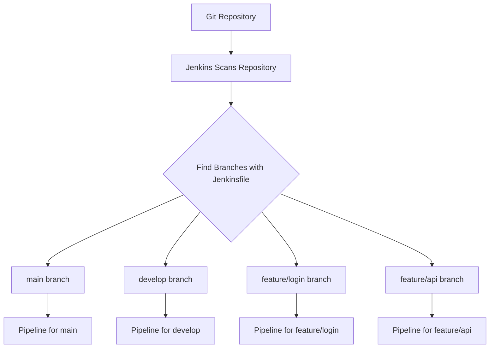
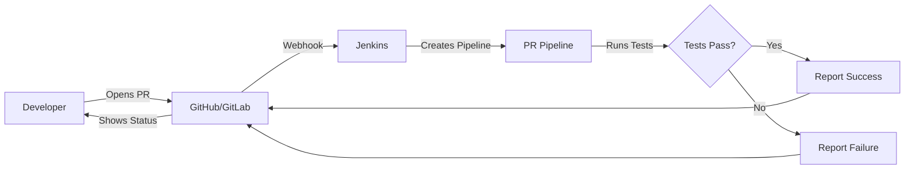
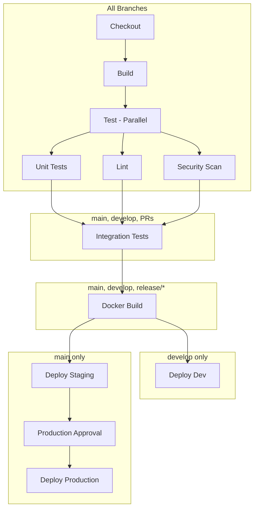
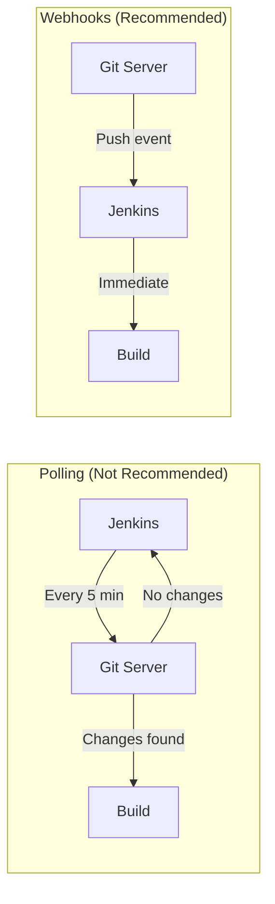
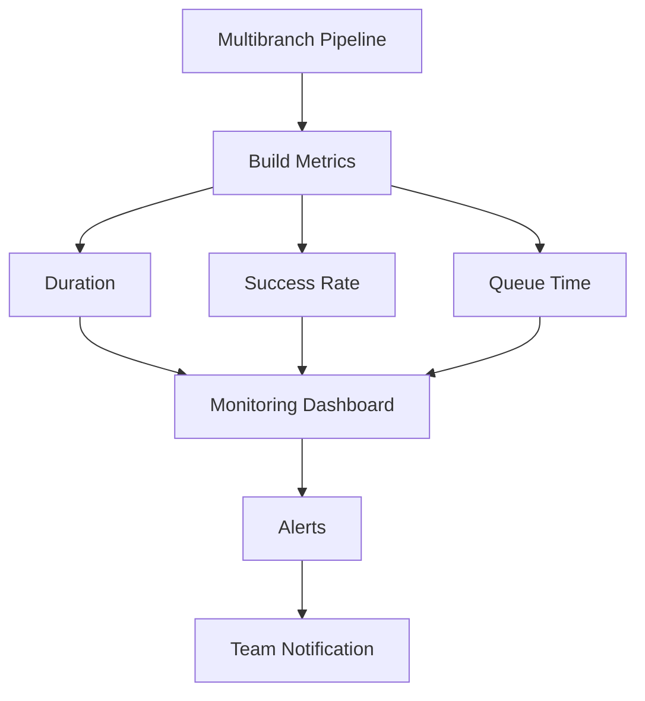

# How to Build Jenkins Multibranch Pipelines

Author: [nawazdhandala](https://github.com/nawazdhandala)

Tags: Jenkins, CI/CD, Multibranch, Git

Description: Learn how to build Jenkins Multibranch Pipelines to automatically discover branches, create pipelines per branch, and implement branch-specific CI/CD workflows for your Git repositories.

---

Managing CI/CD for projects with multiple branches can be challenging. Jenkins Multibranch Pipelines solve this by automatically discovering branches in your repository and creating individual pipelines for each one. No more manually creating jobs for every feature branch.

## What Are Multibranch Pipelines?

A Multibranch Pipeline is a Jenkins job type that automatically creates a pipeline for each branch in your repository that contains a Jenkinsfile. When you push a new branch with a Jenkinsfile, Jenkins discovers it and creates a corresponding pipeline. When you delete the branch, the pipeline is removed.



### Benefits of Multibranch Pipelines

1. **Automatic branch discovery** - New branches get pipelines automatically
2. **Branch isolation** - Each branch has its own build history and workspace
3. **Pull request integration** - Build and validate PRs before merging
4. **Clean up** - Deleted branches have their pipelines removed automatically
5. **Branch-specific behavior** - Different actions for main vs feature branches

## Prerequisites

Before setting up a Multibranch Pipeline, ensure you have:

- Jenkins 2.x or later installed
- Git plugin installed
- Pipeline plugin installed
- Credentials configured for your Git repository
- A repository with a Jenkinsfile in at least one branch

## Creating Your First Multibranch Pipeline

### Step 1: Create a New Multibranch Pipeline Job

1. From the Jenkins dashboard, click "New Item"
2. Enter a name for your pipeline (e.g., "my-app")
3. Select "Multibranch Pipeline"
4. Click "OK"

### Step 2: Configure Branch Sources

In the configuration page, add your Git repository:

```groovy
// Branch Sources configuration example
// Repository URL: https://github.com/yourorg/yourrepo.git
// Credentials: Select your GitHub credentials
// Behaviors:
//   - Discover branches (all branches)
//   - Discover pull requests from origin
//   - Discover pull requests from forks
```

Key configuration options:

| Option | Description |
|--------|-------------|
| Repository URL | Your Git repository URL |
| Credentials | Authentication for private repos |
| Discover branches | Which branches to create pipelines for |
| Discover PRs | Build pull requests automatically |
| Property strategy | Apply properties to discovered branches |

### Step 3: Configure Build Triggers

Set up automatic scanning to detect new branches:

```groovy
// Build Configuration - Scan Triggers
// Periodically if not otherwise run: enabled
// Interval: 1 minute (for active development) or 5 minutes (normal)
```

You can also trigger scans via webhooks for faster response times.

### Step 4: Configure Orphaned Item Strategy

Control how Jenkins handles deleted branches:

```groovy
// Orphaned Item Strategy
// Discard old items: enabled
// Days to keep old items: 7
// Max number of old items to keep: 10
```

This prevents deleted branches from consuming disk space indefinitely.

## Writing a Jenkinsfile for Multibranch Pipelines

The Jenkinsfile in each branch defines its pipeline. Here is a basic example:

```groovy
// Basic Multibranch Jenkinsfile
pipeline {
    agent any

    stages {
        stage('Checkout') {
            steps {
                // Checkout is automatic in multibranch pipelines
                echo "Building branch: ${env.BRANCH_NAME}"
                echo "Build number: ${env.BUILD_NUMBER}"
            }
        }

        stage('Build') {
            steps {
                sh 'npm install'
                sh 'npm run build'
            }
        }

        stage('Test') {
            steps {
                sh 'npm test'
            }
        }
    }
}
```

### Important Environment Variables

Multibranch Pipelines provide special environment variables:

```groovy
pipeline {
    agent any

    stages {
        stage('Info') {
            steps {
                // Branch being built
                echo "Branch: ${env.BRANCH_NAME}"

                // For PRs, the PR number
                echo "Change ID: ${env.CHANGE_ID}"

                // PR target branch
                echo "Change Target: ${env.CHANGE_TARGET}"

                // PR title
                echo "Change Title: ${env.CHANGE_TITLE}"

                // PR author
                echo "Change Author: ${env.CHANGE_AUTHOR}"

                // PR URL
                echo "Change URL: ${env.CHANGE_URL}"
            }
        }
    }
}
```

## Branch-Specific Pipeline Behavior

Use the `when` directive to run stages conditionally based on the branch:

```groovy
pipeline {
    agent any

    stages {
        stage('Build') {
            steps {
                sh 'npm install'
                sh 'npm run build'
            }
        }

        stage('Test') {
            steps {
                sh 'npm test'
            }
        }

        // Only deploy from main branch
        stage('Deploy to Production') {
            when {
                branch 'main'
            }
            steps {
                echo 'Deploying to production...'
                sh './deploy.sh production'
            }
        }

        // Deploy to staging from develop branch
        stage('Deploy to Staging') {
            when {
                branch 'develop'
            }
            steps {
                echo 'Deploying to staging...'
                sh './deploy.sh staging'
            }
        }

        // Run integration tests only for feature branches
        stage('Integration Tests') {
            when {
                branch pattern: "feature/*", comparator: "GLOB"
            }
            steps {
                sh 'npm run test:integration'
            }
        }
    }
}
```

### Advanced Branch Conditions

```groovy
pipeline {
    agent any

    stages {
        // Run for any branch except main
        stage('Code Analysis') {
            when {
                not {
                    branch 'main'
                }
            }
            steps {
                sh 'npm run lint'
            }
        }

        // Run for main OR develop
        stage('Build Docker Image') {
            when {
                anyOf {
                    branch 'main'
                    branch 'develop'
                }
            }
            steps {
                sh 'docker build -t myapp:${BRANCH_NAME} .'
            }
        }

        // Run for release branches using regex
        stage('Create Release') {
            when {
                branch pattern: "release/.*", comparator: "REGEXP"
            }
            steps {
                sh './create-release.sh'
            }
        }

        // Combine multiple conditions
        stage('Deploy') {
            when {
                allOf {
                    branch 'main'
                    environment name: 'DEPLOY_ENABLED', value: 'true'
                }
            }
            steps {
                sh './deploy.sh'
            }
        }
    }
}
```

## Pull Request Pipelines

Multibranch Pipelines can build pull requests automatically. This lets you validate changes before merging.



### Jenkinsfile for Pull Requests

```groovy
pipeline {
    agent any

    stages {
        stage('Build') {
            steps {
                sh 'npm install'
                sh 'npm run build'
            }
        }

        stage('Test') {
            steps {
                sh 'npm test'
            }
        }

        // Only for pull requests
        stage('PR Validation') {
            when {
                changeRequest()
            }
            steps {
                echo "Validating PR #${env.CHANGE_ID}"
                echo "PR Title: ${env.CHANGE_TITLE}"
                echo "Target Branch: ${env.CHANGE_TARGET}"

                // Run additional PR checks
                sh 'npm run lint'
                sh 'npm run test:coverage'
            }
        }

        // PR targeting main branch
        stage('Security Scan') {
            when {
                changeRequest target: 'main'
            }
            steps {
                echo 'Running security scan for PR to main'
                sh 'npm audit'
            }
        }
    }

    post {
        success {
            script {
                if (env.CHANGE_ID) {
                    // Comment on PR (requires GitHub plugin)
                    echo "PR #${env.CHANGE_ID} build succeeded"
                }
            }
        }
        failure {
            script {
                if (env.CHANGE_ID) {
                    echo "PR #${env.CHANGE_ID} build failed"
                }
            }
        }
    }
}
```

## GitHub Integration

### Setting Up GitHub Webhooks

Configure GitHub to notify Jenkins of new branches and PRs:

1. In GitHub, go to your repository Settings
2. Click Webhooks, then Add webhook
3. Set Payload URL to: `https://your-jenkins.com/github-webhook/`
4. Set Content type to: `application/json`
5. Select events: Push, Pull Request, Create, Delete

### GitHub Branch Source Plugin

Install the GitHub Branch Source plugin for enhanced integration:

```groovy
// In Jenkins configuration
// Branch Sources > GitHub
// Repository HTTPS URL: https://github.com/yourorg/yourrepo
// Behaviors:
//   - Discover branches (Exclude branches that are also filed as PRs)
//   - Discover pull requests from origin (Merging the PR with current target)
//   - Discover pull requests from forks (Same as origin)
```

### GitHub Status Checks

Report build status back to GitHub:

```groovy
pipeline {
    agent any

    stages {
        stage('Build') {
            steps {
                sh 'npm run build'
            }
        }

        stage('Test') {
            steps {
                sh 'npm test'
            }
        }
    }

    post {
        success {
            // Update GitHub commit status
            githubNotify(
                status: 'SUCCESS',
                description: 'Build passed',
                context: 'jenkins/build'
            )
        }
        failure {
            githubNotify(
                status: 'FAILURE',
                description: 'Build failed',
                context: 'jenkins/build'
            )
        }
    }
}
```

## Complete Multibranch Pipeline Example

Here is a production-ready Jenkinsfile that handles multiple scenarios:

```groovy
pipeline {
    agent none

    options {
        // Timeout for entire pipeline
        timeout(time: 30, unit: 'MINUTES')
        // Keep build history
        buildDiscarder(logRotator(numToKeepStr: '20'))
        // Show timestamps in console
        timestamps()
        // Skip checkout on agent none
        skipDefaultCheckout()
    }

    environment {
        APP_NAME = 'myapp'
        DOCKER_REGISTRY = 'registry.example.com'
        DOCKER_CREDS = credentials('docker-registry-creds')
    }

    stages {
        stage('Checkout') {
            agent any
            steps {
                checkout scm
                stash name: 'source', includes: '**'
            }
        }

        stage('Build') {
            agent {
                docker { image 'node:18-alpine' }
            }
            steps {
                unstash 'source'
                sh 'npm ci'
                sh 'npm run build'
                stash name: 'build', includes: 'dist/**,node_modules/**'
            }
        }

        stage('Test') {
            parallel {
                stage('Unit Tests') {
                    agent {
                        docker { image 'node:18-alpine' }
                    }
                    steps {
                        unstash 'build'
                        sh 'npm run test:unit'
                    }
                    post {
                        always {
                            junit 'test-results/unit/*.xml'
                        }
                    }
                }

                stage('Lint') {
                    agent {
                        docker { image 'node:18-alpine' }
                    }
                    steps {
                        unstash 'source'
                        sh 'npm ci'
                        sh 'npm run lint'
                    }
                }

                stage('Security Scan') {
                    agent {
                        docker { image 'node:18-alpine' }
                    }
                    steps {
                        unstash 'source'
                        sh 'npm audit --audit-level=high'
                    }
                }
            }
        }

        // Integration tests for non-feature branches
        stage('Integration Tests') {
            when {
                anyOf {
                    branch 'main'
                    branch 'develop'
                    changeRequest()
                }
            }
            agent {
                docker { image 'node:18-alpine' }
            }
            steps {
                unstash 'build'
                sh 'npm run test:integration'
            }
        }

        // Build and push Docker image
        stage('Docker Build') {
            when {
                anyOf {
                    branch 'main'
                    branch 'develop'
                    branch pattern: "release/.*", comparator: "REGEXP"
                }
            }
            agent { label 'docker' }
            steps {
                unstash 'source'
                unstash 'build'
                script {
                    def imageTag = "${env.BRANCH_NAME}-${env.BUILD_NUMBER}"
                    imageTag = imageTag.replaceAll('/', '-')

                    sh """
                        echo \$DOCKER_CREDS_PSW | docker login -u \$DOCKER_CREDS_USR --password-stdin ${DOCKER_REGISTRY}
                        docker build -t ${DOCKER_REGISTRY}/${APP_NAME}:${imageTag} .
                        docker push ${DOCKER_REGISTRY}/${APP_NAME}:${imageTag}
                    """

                    // Tag as latest for main branch
                    if (env.BRANCH_NAME == 'main') {
                        sh """
                            docker tag ${DOCKER_REGISTRY}/${APP_NAME}:${imageTag} ${DOCKER_REGISTRY}/${APP_NAME}:latest
                            docker push ${DOCKER_REGISTRY}/${APP_NAME}:latest
                        """
                    }
                }
            }
        }

        // Deploy to development
        stage('Deploy Dev') {
            when {
                branch 'develop'
            }
            agent { label 'deploy' }
            environment {
                KUBECONFIG = credentials('kubeconfig-dev')
            }
            steps {
                sh 'kubectl set image deployment/${APP_NAME} app=${DOCKER_REGISTRY}/${APP_NAME}:develop-${BUILD_NUMBER} -n development'
                sh 'kubectl rollout status deployment/${APP_NAME} -n development --timeout=5m'
            }
        }

        // Deploy to staging
        stage('Deploy Staging') {
            when {
                branch 'main'
            }
            agent { label 'deploy' }
            environment {
                KUBECONFIG = credentials('kubeconfig-staging')
            }
            steps {
                sh 'kubectl set image deployment/${APP_NAME} app=${DOCKER_REGISTRY}/${APP_NAME}:main-${BUILD_NUMBER} -n staging'
                sh 'kubectl rollout status deployment/${APP_NAME} -n staging --timeout=5m'
            }
        }

        // Production approval and deployment
        stage('Production Approval') {
            when {
                branch 'main'
            }
            steps {
                timeout(time: 24, unit: 'HOURS') {
                    input(
                        message: 'Deploy to production?',
                        ok: 'Deploy',
                        submitter: 'release-managers'
                    )
                }
            }
        }

        stage('Deploy Production') {
            when {
                branch 'main'
            }
            agent { label 'deploy' }
            environment {
                KUBECONFIG = credentials('kubeconfig-production')
            }
            steps {
                sh 'kubectl set image deployment/${APP_NAME} app=${DOCKER_REGISTRY}/${APP_NAME}:main-${BUILD_NUMBER} -n production'
                sh 'kubectl rollout status deployment/${APP_NAME} -n production --timeout=5m'
            }
        }
    }

    post {
        always {
            node('any') {
                cleanWs()
            }
        }
        success {
            script {
                if (env.CHANGE_ID) {
                    echo "PR #${env.CHANGE_ID} build succeeded"
                }
            }
        }
        failure {
            script {
                if (env.CHANGE_ID) {
                    echo "PR #${env.CHANGE_ID} build failed"
                }
                // Send notification on failure
                emailext(
                    subject: "Build Failed: ${env.JOB_NAME} #${env.BUILD_NUMBER}",
                    body: "Check console output at ${env.BUILD_URL}",
                    to: 'team@example.com'
                )
            }
        }
    }
}
```

## Pipeline Workflow Visualization

Here is how the pipeline stages flow for different branches:



## Configuring Branch Properties

Set different properties for different branches using the Organization Folder or configure in the Jenkinsfile:

```groovy
pipeline {
    agent any

    // Different options based on branch
    options {
        timestamps()
        buildDiscarder(logRotator(
            // Keep more builds for main
            numToKeepStr: env.BRANCH_NAME == 'main' ? '50' : '10'
        ))
    }

    triggers {
        // Poll SCM only for main branch
        pollSCM(env.BRANCH_NAME == 'main' ? 'H/5 * * * *' : '')
    }

    stages {
        stage('Build') {
            steps {
                sh 'npm run build'
            }
        }
    }
}
```

## Troubleshooting Multibranch Pipelines

### Common Issues and Solutions

**Branch not discovered:**
- Ensure the branch has a Jenkinsfile at the repository root
- Check that the branch pattern matches your discovery settings
- Trigger a manual scan from the job page

**PR not building:**
- Verify PR discovery is enabled in Branch Sources
- Check webhook configuration in your Git provider
- Ensure credentials have access to read PRs

**Builds stuck in queue:**
- Check agent availability
- Review executor count in Jenkins configuration
- Verify Docker agents can be provisioned

### Debugging Branch Discovery

```groovy
// Add to Jenkinsfile for debugging
pipeline {
    agent any

    stages {
        stage('Debug Info') {
            steps {
                echo "BRANCH_NAME: ${env.BRANCH_NAME}"
                echo "CHANGE_ID: ${env.CHANGE_ID ?: 'Not a PR'}"
                echo "CHANGE_TARGET: ${env.CHANGE_TARGET ?: 'Not a PR'}"
                echo "GIT_BRANCH: ${env.GIT_BRANCH}"
                echo "GIT_COMMIT: ${env.GIT_COMMIT}"
                sh 'git branch -a'
                sh 'git log --oneline -5'
            }
        }
    }
}
```

## Best Practices

### 1. Keep Jenkinsfiles Consistent

Use shared libraries to maintain consistency across branches:

```groovy
@Library('my-shared-library') _

// Use shared pipeline template
standardPipeline(
    appName: 'myapp',
    nodeVersion: '18',
    deployTargets: ['staging', 'production']
)
```

### 2. Protect Long-Running Branches

Configure branch protection in Jenkins:

- Disable automatic branch deletion for main/develop
- Set longer build retention for release branches
- Configure different timeout values

### 3. Optimize Scan Frequency

Balance responsiveness with Jenkins load:

```groovy
// Scan interval recommendations
// Active development: 1 minute
// Normal projects: 5 minutes
// Stable projects: 15 minutes or webhook-only
```

### 4. Use Webhooks Instead of Polling

Webhooks provide instant feedback and reduce Jenkins load:



### 5. Clean Up Old Branches

Configure orphaned item strategy to remove stale pipelines:

```groovy
// Recommended settings
// Days to keep old items: 7
// Max number of old items: 20
```

### 6. Separate Concerns with Folders

Organize related multibranch pipelines:

```
Jenkins/
├── frontend/
│   ├── web-app (multibranch)
│   ├── mobile-app (multibranch)
│   └── admin-portal (multibranch)
├── backend/
│   ├── api-service (multibranch)
│   └── auth-service (multibranch)
└── infrastructure/
    └── terraform (multibranch)
```

## Monitoring Your Pipelines

Track pipeline health and performance to identify issues early. Monitor build duration trends, failure rates, and queue times.



Key metrics to track:

- **Build duration by branch** - Identify slow branches
- **Failure rate by stage** - Find problematic stages
- **Queue time trends** - Detect capacity issues
- **Branch count over time** - Monitor repository growth

---

Jenkins Multibranch Pipelines transform how teams manage CI/CD for Git repositories. By automatically discovering branches and creating isolated pipelines, you reduce manual configuration and ensure every branch gets proper testing. Start with a simple Jenkinsfile, enable PR builds for code quality gates, and use branch conditions to customize deployment workflows. Monitor your pipeline performance with [OneUptime](https://oneuptime.com) to ensure your CI/CD infrastructure remains reliable and responsive as your project scales.
