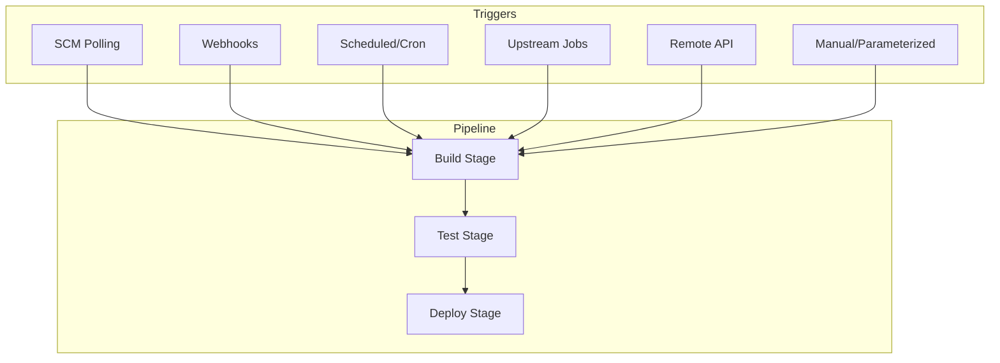
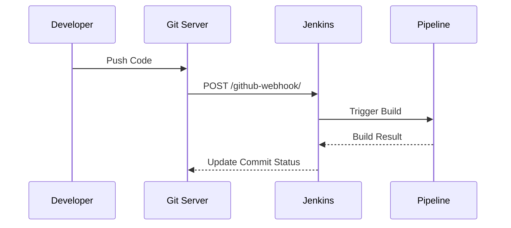
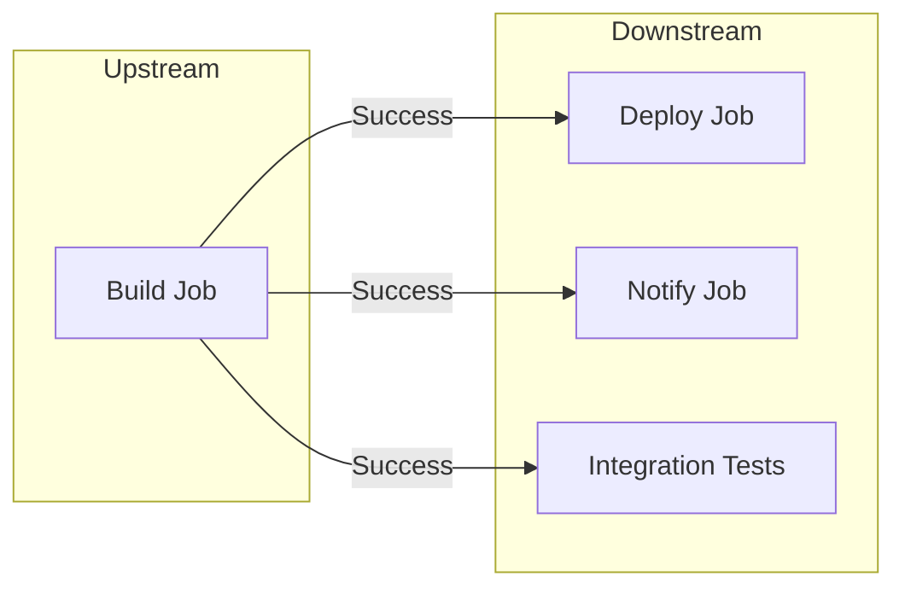
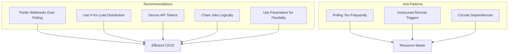

# How to Implement Jenkins Pipeline Triggers

Author: [nawazdhandala](https://github.com/nawazdhandala)

Tags: Jenkins, CI/CD, Triggers, Automation

Description: A comprehensive guide to implementing Jenkins pipeline triggers, covering SCM polling, webhooks, cron scheduling, upstream/downstream triggers, and advanced trigger patterns for automated CI/CD workflows.

---

Jenkins pipelines become truly powerful when they run automatically. Triggers determine when your pipelines execute - whether on code commits, scheduled times, or in response to other events. This guide covers every trigger type with practical examples you can use immediately.

## Understanding Jenkins Triggers



Trigger types at a glance:
1. **SCM Polling** - Jenkins checks for changes periodically
2. **Webhooks** - Git server notifies Jenkins of changes
3. **Cron/Scheduled** - Time-based execution
4. **Upstream/Downstream** - Chain jobs together
5. **Remote API** - Trigger via HTTP requests
6. **Parameterized** - Manual with input parameters

## SCM Polling Triggers

SCM polling makes Jenkins check your repository at regular intervals for changes.

### Basic Polling Configuration

```groovy
pipeline {
    agent any

    triggers {
        pollSCM('H/5 * * * *')  // Poll every 5 minutes
    }

    stages {
        stage('Build') {
            steps {
                echo 'Building after SCM change detected...'
                sh 'make build'
            }
        }
    }
}
```

### Understanding Poll SCM Syntax

The polling schedule uses cron syntax with Jenkins extensions:

```
MINUTE HOUR DOM MONTH DOW
  |      |   |    |    |
  |      |   |    |    +-- Day of Week (0-7, Sun=0 or 7)
  |      |   |    +------- Month (1-12)
  |      |   +------------ Day of Month (1-31)
  |      +---------------- Hour (0-23)
  +----------------------- Minute (0-59)
```

The `H` symbol spreads load by hashing the job name:

```groovy
triggers {
    // Poll every 15 minutes, offset by hash
    pollSCM('H/15 * * * *')

    // Poll hourly at a consistent minute
    pollSCM('H * * * *')

    // Poll every 2 hours during business hours
    pollSCM('H H(9-17)/2 * * 1-5')
}
```

### Polling Multiple Branches

```groovy
pipeline {
    agent any

    triggers {
        pollSCM('H/10 * * * *')
    }

    stages {
        stage('Checkout') {
            steps {
                checkout([
                    $class: 'GitSCM',
                    branches: [[name: '*/main'], [name: '*/develop']],
                    userRemoteConfigs: [[
                        url: 'https://github.com/myorg/myrepo.git',
                        credentialsId: 'github-creds'
                    ]]
                ])
            }
        }
    }
}
```

## Webhook Triggers

Webhooks are more efficient than polling. The Git server pushes notifications to Jenkins immediately when changes occur.



### GitHub Webhook Setup

1. Install the GitHub plugin in Jenkins
2. Configure your Jenkinsfile:

```groovy
pipeline {
    agent any

    triggers {
        githubPush()
    }

    stages {
        stage('Build') {
            steps {
                echo "Triggered by GitHub push to ${env.GIT_BRANCH}"
                sh 'npm install && npm run build'
            }
        }
    }
}
```

3. In GitHub repository settings, add a webhook:
   - Payload URL: `https://jenkins.example.com/github-webhook/`
   - Content type: `application/json`
   - Events: Push events, Pull request events

### GitLab Webhook Setup

```groovy
pipeline {
    agent any

    triggers {
        gitlab(
            triggerOnPush: true,
            triggerOnMergeRequest: true,
            branchFilterType: 'All'
        )
    }

    stages {
        stage('Build') {
            steps {
                echo "Triggered by GitLab event"
                updateGitlabCommitStatus name: 'build', state: 'running'
            }
        }
    }

    post {
        success {
            updateGitlabCommitStatus name: 'build', state: 'success'
        }
        failure {
            updateGitlabCommitStatus name: 'build', state: 'failed'
        }
    }
}
```

### Bitbucket Webhook Setup

```groovy
pipeline {
    agent any

    triggers {
        bitbucketPush()
    }

    stages {
        stage('Build') {
            steps {
                echo "Triggered by Bitbucket push"
                sh './gradlew build'
            }
        }
    }
}
```

### Generic Webhook Trigger

For custom webhook sources, use the Generic Webhook Trigger plugin:

```groovy
pipeline {
    agent any

    triggers {
        GenericTrigger(
            genericVariables: [
                [key: 'ref', value: '$.ref'],
                [key: 'commit', value: '$.after'],
                [key: 'repository', value: '$.repository.name']
            ],
            causeString: 'Triggered by $repository commit $commit',
            token: 'my-secret-token',
            tokenCredentialId: '',
            printContributedVariables: true,
            printPostContent: true,
            silentResponse: false,
            regexpFilterText: '$ref',
            regexpFilterExpression: 'refs/heads/(main|develop)'
        )
    }

    stages {
        stage('Build') {
            steps {
                echo "Building ref: ${ref}"
                echo "Commit: ${commit}"
                echo "Repository: ${repository}"
            }
        }
    }
}
```

Trigger with curl:

```bash
curl -X POST \
  "https://jenkins.example.com/generic-webhook-trigger/invoke?token=my-secret-token" \
  -H "Content-Type: application/json" \
  -d '{
    "ref": "refs/heads/main",
    "after": "abc123",
    "repository": {"name": "myapp"}
  }'
```

## Cron/Scheduled Triggers

Run pipelines on a fixed schedule regardless of code changes.

### Basic Cron Trigger

```groovy
pipeline {
    agent any

    triggers {
        cron('H 2 * * *')  // Run daily at 2 AM (hashed minute)
    }

    stages {
        stage('Nightly Build') {
            steps {
                echo 'Running scheduled nightly build'
                sh 'make clean && make build && make test'
            }
        }
    }
}
```

### Common Cron Patterns

```groovy
triggers {
    // Every 30 minutes
    cron('H/30 * * * *')

    // Every hour at minute 0
    cron('0 * * * *')

    // Daily at midnight
    cron('0 0 * * *')

    // Weekdays at 6 AM
    cron('0 6 * * 1-5')

    // Every Sunday at 3 AM
    cron('0 3 * * 0')

    // First day of each month at noon
    cron('0 12 1 * *')

    // Every 4 hours
    cron('H H/4 * * *')
}
```

### Combining Multiple Schedules

```groovy
pipeline {
    agent any

    triggers {
        // Multiple cron expressions
        cron('''
            H 0 * * 1-5
            H 12 * * 1-5
            H 18 * * 1-5
        ''')
    }

    stages {
        stage('Scheduled Task') {
            steps {
                echo "Running at: ${new Date()}"
            }
        }
    }
}
```

### Time Zone Configuration

```groovy
pipeline {
    agent any

    triggers {
        cron('TZ=America/New_York\nH 9 * * 1-5')  // 9 AM Eastern, weekdays
    }

    stages {
        stage('Morning Report') {
            steps {
                sh './generate-report.sh'
            }
        }
    }
}
```

## Upstream/Downstream Triggers

Chain pipelines together so one job triggers another.



### Upstream Trigger

Trigger when another job completes:

```groovy
pipeline {
    agent any

    triggers {
        upstream(
            upstreamProjects: 'build-job',
            threshold: hudson.model.Result.SUCCESS
        )
    }

    stages {
        stage('Deploy') {
            steps {
                echo 'Deploying after successful build'
                sh './deploy.sh'
            }
        }
    }
}
```

### Multiple Upstream Jobs

```groovy
pipeline {
    agent any

    triggers {
        upstream(
            upstreamProjects: 'build-frontend,build-backend,build-api',
            threshold: hudson.model.Result.SUCCESS
        )
    }

    stages {
        stage('Integration Tests') {
            steps {
                echo 'All builds complete, running integration tests'
                sh './run-integration-tests.sh'
            }
        }
    }
}
```

### Downstream Trigger (from Upstream)

Trigger downstream jobs from within a pipeline:

```groovy
pipeline {
    agent any

    stages {
        stage('Build') {
            steps {
                sh 'make build'
            }
        }

        stage('Trigger Downstream') {
            steps {
                // Trigger without waiting
                build job: 'deploy-staging', wait: false

                // Trigger and wait for completion
                build job: 'run-tests', wait: true

                // Trigger with parameters
                build job: 'deploy-production',
                    parameters: [
                        string(name: 'VERSION', value: env.BUILD_NUMBER),
                        booleanParam(name: 'SKIP_TESTS', value: false)
                    ]
            }
        }
    }
}
```

### Conditional Downstream Triggers

```groovy
pipeline {
    agent any

    stages {
        stage('Build') {
            steps {
                sh 'make build'
            }
        }

        stage('Trigger Based on Branch') {
            steps {
                script {
                    if (env.BRANCH_NAME == 'main') {
                        build job: 'deploy-production', wait: false
                    } else if (env.BRANCH_NAME == 'develop') {
                        build job: 'deploy-staging', wait: false
                    }
                }
            }
        }
    }
}
```

## Remote API Triggers

Trigger builds programmatically via Jenkins REST API.

### Enable Remote Triggering

```groovy
pipeline {
    agent any

    triggers {
        // No automatic trigger - API only
    }

    parameters {
        string(name: 'ENVIRONMENT', defaultValue: 'staging')
        string(name: 'VERSION', defaultValue: 'latest')
    }

    stages {
        stage('Deploy') {
            steps {
                echo "Deploying version ${params.VERSION} to ${params.ENVIRONMENT}"
            }
        }
    }
}
```

### Trigger via API

Using an API token:

```bash
# Get your API token from Jenkins user settings

# Trigger without parameters
curl -X POST \
  "https://jenkins.example.com/job/my-pipeline/build" \
  -u "username:api-token"

# Trigger with parameters
curl -X POST \
  "https://jenkins.example.com/job/my-pipeline/buildWithParameters" \
  -u "username:api-token" \
  -d "ENVIRONMENT=production" \
  -d "VERSION=v1.2.3"
```

### Token-Based Authentication

Create a dedicated build trigger token in your job configuration:

```bash
# Using build token
curl -X POST \
  "https://jenkins.example.com/job/my-pipeline/build?token=BUILD_TOKEN"

# With parameters
curl -X POST \
  "https://jenkins.example.com/job/my-pipeline/buildWithParameters?token=BUILD_TOKEN&ENVIRONMENT=staging"
```

### API Trigger from Scripts

```python
import requests
from requests.auth import HTTPBasicAuth

JENKINS_URL = "https://jenkins.example.com"
JOB_NAME = "my-pipeline"
USERNAME = "jenkins-user"
API_TOKEN = "your-api-token"

def trigger_build(parameters=None):
    if parameters:
        url = f"{JENKINS_URL}/job/{JOB_NAME}/buildWithParameters"
        response = requests.post(
            url,
            auth=HTTPBasicAuth(USERNAME, API_TOKEN),
            data=parameters
        )
    else:
        url = f"{JENKINS_URL}/job/{JOB_NAME}/build"
        response = requests.post(
            url,
            auth=HTTPBasicAuth(USERNAME, API_TOKEN)
        )

    if response.status_code == 201:
        print("Build triggered successfully")
        queue_url = response.headers.get('Location')
        return queue_url
    else:
        print(f"Failed to trigger build: {response.status_code}")
        return None

# Usage
trigger_build({'ENVIRONMENT': 'production', 'VERSION': 'v2.0.0'})
```

## Parameterized Triggers

Create flexible pipelines that accept input parameters.

### Basic Parameters

```groovy
pipeline {
    agent any

    parameters {
        string(
            name: 'BRANCH',
            defaultValue: 'main',
            description: 'Branch to build'
        )
        choice(
            name: 'ENVIRONMENT',
            choices: ['dev', 'staging', 'production'],
            description: 'Deployment target'
        )
        booleanParam(
            name: 'RUN_TESTS',
            defaultValue: true,
            description: 'Run test suite'
        )
        password(
            name: 'DEPLOY_KEY',
            defaultValue: '',
            description: 'Deployment API key'
        )
    }

    stages {
        stage('Build') {
            steps {
                echo "Building branch: ${params.BRANCH}"
                echo "Target environment: ${params.ENVIRONMENT}"
            }
        }

        stage('Test') {
            when {
                expression { params.RUN_TESTS == true }
            }
            steps {
                sh 'npm test'
            }
        }

        stage('Deploy') {
            steps {
                sh "deploy.sh --env ${params.ENVIRONMENT}"
            }
        }
    }
}
```

### Advanced Parameter Types

```groovy
pipeline {
    agent any

    parameters {
        // Multi-line text
        text(
            name: 'RELEASE_NOTES',
            defaultValue: '',
            description: 'Release notes for this deployment'
        )

        // File parameter
        file(
            name: 'CONFIG_FILE',
            description: 'Upload configuration file'
        )

        // Git parameter (requires Git Parameter plugin)
        gitParameter(
            name: 'TAG',
            type: 'PT_TAG',
            defaultValue: 'origin/main',
            description: 'Select a tag to deploy'
        )

        // Active choices (requires Active Choices plugin)
        activeChoice(
            name: 'REGION',
            choiceType: 'PT_SINGLE_SELECT',
            script: [
                $class: 'GroovyScript',
                script: [
                    script: '''
                        return ['us-east-1', 'us-west-2', 'eu-west-1']
                    '''
                ]
            ]
        )
    }

    stages {
        stage('Deploy') {
            steps {
                echo "Deploying tag ${params.TAG} to ${params.REGION}"
            }
        }
    }
}
```

## Combining Multiple Triggers

Real-world pipelines often need multiple trigger types.

```groovy
pipeline {
    agent any

    triggers {
        // Poll SCM every 5 minutes
        pollSCM('H/5 * * * *')

        // Also accept GitHub webhooks
        githubPush()

        // Run nightly at 2 AM
        cron('H 2 * * *')

        // Trigger after upstream build
        upstream(
            upstreamProjects: 'shared-library-build',
            threshold: hudson.model.Result.SUCCESS
        )
    }

    parameters {
        booleanParam(
            name: 'FORCE_FULL_BUILD',
            defaultValue: false,
            description: 'Force full rebuild'
        )
    }

    stages {
        stage('Determine Build Type') {
            steps {
                script {
                    if (params.FORCE_FULL_BUILD || currentBuild.getBuildCauses('hudson.triggers.TimerTrigger$TimerTriggerCause')) {
                        env.BUILD_TYPE = 'full'
                    } else {
                        env.BUILD_TYPE = 'incremental'
                    }
                    echo "Build type: ${env.BUILD_TYPE}"
                }
            }
        }

        stage('Build') {
            steps {
                sh "make ${env.BUILD_TYPE}-build"
            }
        }
    }
}
```

## Trigger Best Practices



### 1. Prefer Webhooks Over Polling

```groovy
// Preferred: Webhook-based trigger
triggers {
    githubPush()
}

// Fallback: Polling (only if webhooks unavailable)
triggers {
    pollSCM('H/15 * * * *')  // At least 15-minute intervals
}
```

### 2. Use Hash for Load Distribution

```groovy
// Good: Distributed load
triggers {
    cron('H H(0-6) * * *')  // Random time between midnight and 6 AM
}

// Avoid: Fixed times create thundering herd
triggers {
    cron('0 0 * * *')  // All jobs at exactly midnight
}
```

### 3. Handle Trigger Cause in Pipeline

```groovy
pipeline {
    agent any

    stages {
        stage('Check Trigger') {
            steps {
                script {
                    def causes = currentBuild.getBuildCauses()
                    causes.each { cause ->
                        echo "Triggered by: ${cause.shortDescription}"
                    }

                    // Check specific trigger types
                    if (currentBuild.getBuildCauses('hudson.triggers.SCMTrigger$SCMTriggerCause')) {
                        echo "This is an SCM-triggered build"
                    }
                    if (currentBuild.getBuildCauses('hudson.triggers.TimerTrigger$TimerTriggerCause')) {
                        echo "This is a scheduled build"
                    }
                    if (currentBuild.getBuildCauses('hudson.model.Cause$UserIdCause')) {
                        echo "This is a manual build"
                    }
                }
            }
        }
    }
}
```

### 4. Secure Remote Triggers

```groovy
pipeline {
    agent any

    options {
        // Require authentication for all builds
        buildDiscarder(logRotator(numToKeepStr: '10'))
    }

    stages {
        stage('Verify Trigger') {
            steps {
                script {
                    // Check if triggered by authorized source
                    def userCause = currentBuild.getBuildCauses('hudson.model.Cause$UserIdCause')
                    if (userCause) {
                        def userId = userCause[0].userId
                        def allowedUsers = ['admin', 'deploy-bot', 'jenkins-automation']
                        if (!allowedUsers.contains(userId)) {
                            error "User ${userId} not authorized to trigger this build"
                        }
                    }
                }
            }
        }
    }
}
```

### 5. Avoid Circular Dependencies

```groovy
// Job A
pipeline {
    triggers {
        upstream(upstreamProjects: 'job-c', threshold: hudson.model.Result.SUCCESS)
    }
    stages {
        stage('Build') {
            steps {
                build job: 'job-b', wait: false  // Triggers B
            }
        }
    }
}

// Job B - DO NOT trigger Job A or Job C
// This would create a circular dependency
```

## Multibranch Pipeline Triggers

For multibranch pipelines, triggers work per-branch.

```groovy
// Jenkinsfile in repository root
pipeline {
    agent any

    triggers {
        // Only poll SCM - webhooks handled at folder level
        pollSCM('H/10 * * * *')
    }

    stages {
        stage('Build') {
            steps {
                echo "Building branch: ${env.BRANCH_NAME}"
                sh 'make build'
            }
        }

        stage('Deploy') {
            when {
                branch 'main'
            }
            steps {
                sh './deploy.sh production'
            }
        }
    }
}
```

### Branch-Specific Triggers

```groovy
pipeline {
    agent any

    triggers {
        // Different schedules per branch
        cron(env.BRANCH_NAME == 'main' ? 'H 2 * * *' : '')
    }

    stages {
        stage('Build') {
            steps {
                sh 'make build'
            }
        }
    }
}
```

## Troubleshooting Triggers

### Trigger Not Firing

1. Check Jenkins system log for errors
2. Verify webhook delivery in Git provider
3. Confirm correct credentials and permissions

```groovy
pipeline {
    agent any

    triggers {
        pollSCM('H/5 * * * *')
    }

    stages {
        stage('Debug') {
            steps {
                script {
                    // Print all environment variables
                    sh 'env | sort'

                    // Check trigger causes
                    echo "Build causes: ${currentBuild.getBuildCauses()}"

                    // Check SCM polling log
                    echo "SCM polling log available in Jenkins job configuration"
                }
            }
        }
    }
}
```

### Webhook Not Received

```bash
# Test webhook endpoint
curl -v -X POST \
  "https://jenkins.example.com/github-webhook/" \
  -H "Content-Type: application/json" \
  -d '{"test": true}'

# Check Jenkins is accessible
curl -I https://jenkins.example.com/

# Verify firewall rules allow inbound connections
```

### Cron Not Running

```groovy
// Add logging to verify cron execution
pipeline {
    agent any

    triggers {
        cron('H/5 * * * *')
    }

    stages {
        stage('Verify Schedule') {
            steps {
                script {
                    def now = new Date()
                    echo "Current time: ${now}"
                    echo "Build number: ${env.BUILD_NUMBER}"

                    // Check if this was timer-triggered
                    def timerCause = currentBuild.getBuildCauses('hudson.triggers.TimerTrigger$TimerTriggerCause')
                    if (timerCause) {
                        echo "Triggered by cron schedule"
                    }
                }
            }
        }
    }
}
```

---

Jenkins pipeline triggers transform manual processes into automated workflows. Start with webhooks for immediate feedback on code changes, add scheduled triggers for nightly builds and maintenance tasks, and use upstream triggers to create sophisticated CI/CD pipelines. The key is matching the trigger type to your team's workflow needs.
