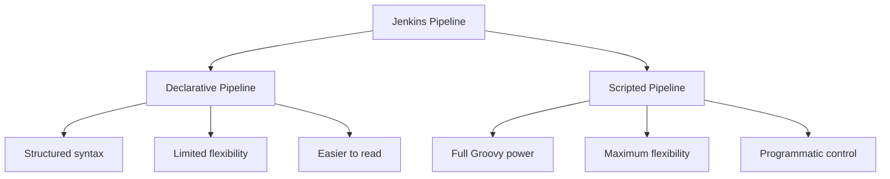
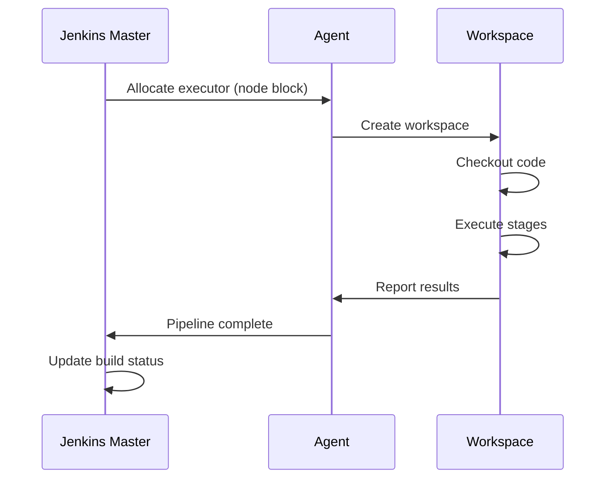
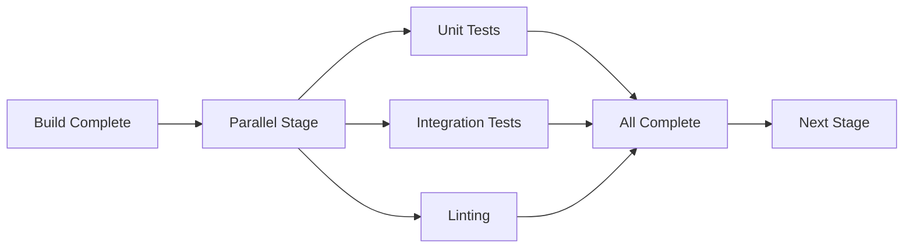
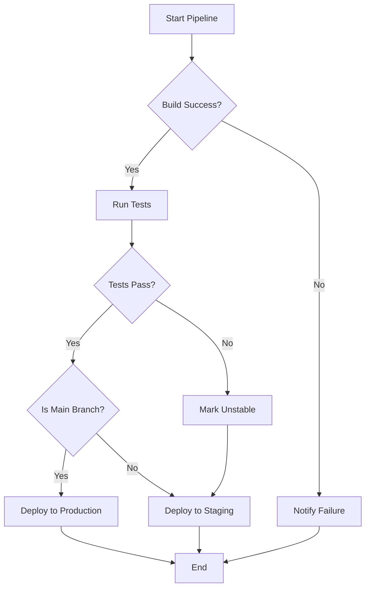
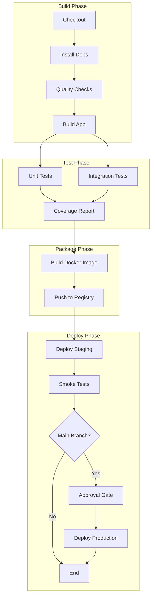

# How to Build Jenkins Scripted Pipelines

Author: [nawazdhandala](https://github.com/nawazdhandala)

Tags: Jenkins, CI/CD, Groovy, Pipelines

Description: A comprehensive guide to mastering Jenkins Scripted Pipelines. Learn the Groovy-based syntax, build stages, parallel execution, error handling, shared libraries, and best practices for creating powerful CI/CD workflows.

> Jenkins Scripted Pipelines give you the full power of Groovy to define complex build logic that declarative syntax simply cannot express.

Jenkins Pipelines come in two flavors: Declarative and Scripted. While Declarative pipelines offer a simpler, opinionated syntax, Scripted Pipelines provide the flexibility and power of a full programming language. When your CI/CD requirements grow beyond simple builds, Scripted Pipelines become essential.

This guide covers everything you need to know to build production-ready Jenkins Scripted Pipelines, from basic syntax to advanced patterns like shared libraries and parallel execution.

## Understanding the Two Pipeline Types

Before diving deep into Scripted Pipelines, it helps to understand how they differ from Declarative Pipelines.



**Declarative Pipelines** use a predefined structure with specific sections like `pipeline`, `stages`, and `steps`. They are easier to learn but constrain what you can do.

**Scripted Pipelines** use Groovy code directly, wrapped in a `node` block. They offer complete programmatic control over your build process.

## Your First Scripted Pipeline

A Scripted Pipeline starts with a `node` block that allocates an executor on a Jenkins agent. Here is a minimal example:

```groovy
// Basic Scripted Pipeline structure
// The node block allocates an executor on any available agent
node {
    // stage blocks organize your pipeline into logical sections
    stage('Checkout') {
        // Checkout code from the configured SCM
        checkout scm
    }

    stage('Build') {
        // Run shell commands using the sh step
        sh 'echo "Building the application..."'
        sh 'npm install'
        sh 'npm run build'
    }

    stage('Test') {
        sh 'npm test'
    }
}
```

This pipeline runs on any available agent, checks out the source code, builds the application, and runs tests. Each `stage` block creates a visual section in the Jenkins UI.

## The Node Block Explained

The `node` block is the foundation of Scripted Pipelines. It serves two purposes:

1. **Allocates an executor** on a Jenkins agent
2. **Creates a workspace** where your build runs

```groovy
// Run on any available agent
node {
    // Your pipeline code here
}

// Run on a specific agent with the 'linux' label
node('linux') {
    sh 'uname -a'
}

// Run on an agent with multiple labels
node('linux && docker') {
    sh 'docker --version'
}
```

You can also use multiple node blocks to run different parts of your pipeline on different agents:

```groovy
// Stages can run on different agents based on requirements
stage('Build on Linux') {
    node('linux') {
        checkout scm
        sh './build-linux.sh'
        stash name: 'linux-build', includes: 'dist/**'
    }
}

stage('Build on Windows') {
    node('windows') {
        checkout scm
        bat 'build-windows.bat'
        stash name: 'windows-build', includes: 'dist/**'
    }
}
```

## Pipeline Execution Flow

Understanding how a Scripted Pipeline executes helps you structure your code effectively.



The Jenkins master orchestrates the build, but actual execution happens on agents. This distributed architecture lets you scale builds across many machines.

## Working with Environment Variables

Scripted Pipelines give you programmatic access to environment variables:

```groovy
node {
    // Access built-in Jenkins environment variables
    echo "Build number: ${env.BUILD_NUMBER}"
    echo "Job name: ${env.JOB_NAME}"
    echo "Workspace: ${env.WORKSPACE}"

    // Set custom environment variables using withEnv
    withEnv(['APP_ENV=production', 'DEBUG=false']) {
        sh 'echo "Environment: $APP_ENV"'
        sh 'echo "Debug mode: $DEBUG"'
    }

    // Read environment variables from shell commands
    stage('Get Git Info') {
        env.GIT_COMMIT = sh(
            script: 'git rev-parse HEAD',
            returnStdout: true
        ).trim()

        env.GIT_BRANCH = sh(
            script: 'git rev-parse --abbrev-ref HEAD',
            returnStdout: true
        ).trim()

        echo "Building commit ${env.GIT_COMMIT} on branch ${env.GIT_BRANCH}"
    }
}
```

The `returnStdout: true` parameter captures command output as a string, which you can then assign to variables or environment variables.

## Handling Credentials Securely

Jenkins provides secure credential storage. Access credentials in Scripted Pipelines using the `withCredentials` block:

```groovy
node {
    stage('Deploy') {
        // Username and password credentials
        withCredentials([
            usernamePassword(
                credentialsId: 'docker-registry',
                usernameVariable: 'DOCKER_USER',
                passwordVariable: 'DOCKER_PASS'
            )
        ]) {
            sh '''
                echo "$DOCKER_PASS" | docker login -u "$DOCKER_USER" --password-stdin registry.example.com
                docker push registry.example.com/myapp:latest
            '''
        }

        // Secret text credential
        withCredentials([string(credentialsId: 'api-key', variable: 'API_KEY')]) {
            sh 'curl -H "Authorization: Bearer $API_KEY" https://api.example.com/deploy'
        }

        // SSH private key credential
        withCredentials([sshUserPrivateKey(
            credentialsId: 'deploy-key',
            keyFileVariable: 'SSH_KEY',
            usernameVariable: 'SSH_USER'
        )]) {
            sh '''
                ssh -i "$SSH_KEY" "$SSH_USER@production.example.com" "cd /app && ./deploy.sh"
            '''
        }
    }
}
```

Credentials are masked in the console output, preventing accidental exposure of secrets.

## Parallel Execution

One of the most powerful features of Scripted Pipelines is parallel execution. Run independent tasks simultaneously to reduce build time:

```groovy
node {
    stage('Checkout') {
        checkout scm
    }

    stage('Build') {
        sh 'npm install'
        sh 'npm run build'
    }

    // Run tests in parallel to reduce overall build time
    stage('Test') {
        parallel(
            'Unit Tests': {
                sh 'npm run test:unit'
            },
            'Integration Tests': {
                sh 'npm run test:integration'
            },
            'Linting': {
                sh 'npm run lint'
            }
        )
    }
}
```



### Parallel Execution Across Multiple Nodes

For resource-intensive tasks, run parallel branches on different agents:

```groovy
stage('Cross-Platform Build') {
    parallel(
        'Linux Build': {
            node('linux') {
                checkout scm
                sh './build-linux.sh'
                archiveArtifacts 'dist/linux/**'
            }
        },
        'macOS Build': {
            node('macos') {
                checkout scm
                sh './build-macos.sh'
                archiveArtifacts 'dist/macos/**'
            }
        },
        'Windows Build': {
            node('windows') {
                checkout scm
                bat 'build-windows.bat'
                archiveArtifacts 'dist/windows/**'
            }
        }
    )
}
```

Each parallel branch gets its own workspace on its respective agent, allowing true concurrent execution.

## Dynamic Pipeline Generation

Since Scripted Pipelines are Groovy code, you can generate pipeline structure dynamically:

```groovy
// Define environments to deploy to
def environments = ['dev', 'staging', 'production']

node {
    stage('Build') {
        checkout scm
        sh 'npm install && npm run build'
    }

    // Dynamically create deployment stages
    environments.each { env ->
        stage("Deploy to ${env}") {
            // Add approval for production
            if (env == 'production') {
                input message: "Deploy to production?", ok: "Deploy"
            }

            sh "./deploy.sh ${env}"
        }
    }
}
```

### Matrix Builds

Create matrix builds that test across multiple configurations:

```groovy
def nodeVersions = ['16', '18', '20']
def osPlatforms = ['linux', 'macos']

// Generate all combinations
def combinations = []
nodeVersions.each { nodeVer ->
    osPlatforms.each { os ->
        combinations.add([node: nodeVer, os: os])
    }
}

stage('Matrix Tests') {
    def parallelStages = [:]

    combinations.each { combo ->
        def stageName = "Node ${combo.node} on ${combo.os}"
        parallelStages[stageName] = {
            node(combo.os) {
                checkout scm
                sh "nvm use ${combo.node}"
                sh 'npm install'
                sh 'npm test'
            }
        }
    }

    parallel parallelStages
}
```

## Error Handling and Recovery

Robust pipelines handle failures gracefully. Groovy's try-catch-finally gives you fine-grained control:

```groovy
node {
    try {
        stage('Build') {
            checkout scm
            sh 'npm install'
            sh 'npm run build'
        }

        stage('Test') {
            sh 'npm test'
        }

        stage('Deploy') {
            sh './deploy.sh'
        }

        // Set build status on success
        currentBuild.result = 'SUCCESS'

    } catch (Exception e) {
        // Set build status on failure
        currentBuild.result = 'FAILURE'

        // Send notification
        emailext(
            subject: "Build Failed: ${env.JOB_NAME} #${env.BUILD_NUMBER}",
            body: "Check console output: ${env.BUILD_URL}",
            to: 'team@example.com'
        )

        // Re-throw to mark the build as failed
        throw e

    } finally {
        // Always run cleanup, regardless of success or failure
        stage('Cleanup') {
            sh 'docker system prune -f'
            cleanWs()  // Clean workspace
        }
    }
}
```

### Retry Logic

Retry flaky operations automatically:

```groovy
node {
    stage('Deploy with Retry') {
        retry(3) {
            // This block will be retried up to 3 times if it fails
            sh './deploy.sh'
        }
    }

    stage('Flaky Test with Timeout') {
        timeout(time: 10, unit: 'MINUTES') {
            retry(2) {
                sh 'npm run test:e2e'
            }
        }
    }
}
```

### Handling Unstable Builds

Sometimes you want to continue the pipeline even when certain stages fail:

```groovy
node {
    stage('Build') {
        checkout scm
        sh 'npm install && npm run build'
    }

    stage('Tests') {
        def testsPassed = true

        try {
            sh 'npm test'
        } catch (Exception e) {
            testsPassed = false
            currentBuild.result = 'UNSTABLE'
            echo "Tests failed but continuing pipeline"
        }

        // Continue with deployment only if tests passed
        if (testsPassed) {
            stage('Deploy') {
                sh './deploy.sh'
            }
        }
    }
}
```

## Pipeline Flow Control



Implement complex flow control with conditional logic:

```groovy
node {
    def shouldDeploy = false
    def targetEnv = 'staging'

    stage('Build') {
        checkout scm
        sh 'npm install && npm run build'
    }

    stage('Test') {
        try {
            sh 'npm test'
            shouldDeploy = true
        } catch (Exception e) {
            currentBuild.result = 'UNSTABLE'
            shouldDeploy = false
        }
    }

    // Conditional deployment based on branch
    if (env.BRANCH_NAME == 'main' && shouldDeploy) {
        stage('Approval') {
            input message: 'Deploy to production?', ok: 'Deploy'
        }
        targetEnv = 'production'
    }

    if (shouldDeploy) {
        stage("Deploy to ${targetEnv}") {
            sh "./deploy.sh ${targetEnv}"
        }
    }
}
```

## Shared Libraries

As your organization grows, you will want to share pipeline code across projects. Jenkins Shared Libraries let you create reusable pipeline components.

### Library Structure

```
vars/
  buildApp.groovy      # Global variables (callable from pipelines)
  deployToK8s.groovy
  notifySlack.groovy
src/
  org/
    example/
      Docker.groovy    # Groovy classes
      Kubernetes.groovy
resources/
  scripts/
    deploy.sh          # Resource files
```

### Creating a Shared Library Function

Create `vars/buildApp.groovy` in your shared library repository:

```groovy
// vars/buildApp.groovy
// This function can be called from any pipeline as buildApp()

def call(Map config = [:]) {
    // Set defaults
    def nodeVersion = config.nodeVersion ?: '18'
    def skipTests = config.skipTests ?: false

    node {
        stage('Checkout') {
            checkout scm
        }

        stage('Setup') {
            sh "nvm use ${nodeVersion}"
            sh 'npm ci'
        }

        stage('Build') {
            sh 'npm run build'
        }

        if (!skipTests) {
            stage('Test') {
                sh 'npm test'
            }
        }

        stage('Archive') {
            archiveArtifacts artifacts: 'dist/**', fingerprint: true
        }
    }
}
```

### Using the Shared Library

Configure the library in Jenkins (Manage Jenkins > Configure System > Global Pipeline Libraries), then use it in your Jenkinsfile:

```groovy
// Load the shared library
@Library('my-shared-library') _

// Use the buildApp function with custom configuration
buildApp(
    nodeVersion: '20',
    skipTests: false
)
```

### Creating More Complex Shared Functions

```groovy
// vars/deployToK8s.groovy
def call(Map config) {
    def namespace = config.namespace ?: 'default'
    def image = config.image
    def deployment = config.deployment

    if (!image || !deployment) {
        error "Missing required parameters: image and deployment"
    }

    node('kubectl') {
        stage('Update Deployment') {
            withCredentials([file(credentialsId: 'kubeconfig', variable: 'KUBECONFIG')]) {
                sh """
                    kubectl set image deployment/${deployment} \
                        ${deployment}=${image} \
                        -n ${namespace}
                """
            }
        }

        stage('Wait for Rollout') {
            withCredentials([file(credentialsId: 'kubeconfig', variable: 'KUBECONFIG')]) {
                sh """
                    kubectl rollout status deployment/${deployment} \
                        -n ${namespace} \
                        --timeout=300s
                """
            }
        }
    }
}
```

Usage:

```groovy
@Library('my-shared-library') _

node {
    stage('Build') {
        checkout scm
        sh 'docker build -t myapp:${BUILD_NUMBER} .'
        sh 'docker push registry.example.com/myapp:${BUILD_NUMBER}'
    }
}

deployToK8s(
    namespace: 'production',
    image: "registry.example.com/myapp:${env.BUILD_NUMBER}",
    deployment: 'myapp'
)
```

## Working with Artifacts

Archive and manage build artifacts:

```groovy
node {
    stage('Build') {
        checkout scm
        sh 'npm install'
        sh 'npm run build'

        // Archive artifacts for later retrieval
        archiveArtifacts(
            artifacts: 'dist/**',
            fingerprint: true,
            onlyIfSuccessful: true
        )
    }

    stage('Generate Reports') {
        sh 'npm run test:coverage'

        // Publish HTML reports
        publishHTML(target: [
            allowMissing: false,
            alwaysLinkToLastBuild: true,
            keepAll: true,
            reportDir: 'coverage',
            reportFiles: 'index.html',
            reportName: 'Coverage Report'
        ])

        // Publish JUnit test results
        junit 'test-results/**/*.xml'
    }
}
```

### Stash and Unstash

Pass artifacts between stages running on different nodes:

```groovy
stage('Build') {
    node('build-agent') {
        checkout scm
        sh 'npm install && npm run build'

        // Stash the build output
        stash name: 'build-artifacts', includes: 'dist/**'
    }
}

stage('Deploy') {
    node('deploy-agent') {
        // Retrieve the stashed artifacts
        unstash 'build-artifacts'

        sh 'ls -la dist/'
        sh './deploy.sh'
    }
}
```

## Complete Production Pipeline Example

Here is a complete pipeline that demonstrates many concepts working together:

```groovy
// Production-ready Jenkins Scripted Pipeline
// Demonstrates stages, parallel execution, error handling, and deployment

def appVersion = ''
def dockerImage = ''

node {
    try {
        stage('Checkout') {
            checkout scm

            // Get version from package.json
            appVersion = sh(
                script: "node -p \"require('./package.json').version\"",
                returnStdout: true
            ).trim()

            dockerImage = "registry.example.com/myapp:${appVersion}-${env.BUILD_NUMBER}"

            echo "Building version ${appVersion}"
        }

        stage('Install Dependencies') {
            sh 'npm ci'
        }

        stage('Quality Checks') {
            parallel(
                'Lint': {
                    sh 'npm run lint'
                },
                'Type Check': {
                    sh 'npm run typecheck'
                },
                'Security Audit': {
                    sh 'npm audit --production'
                }
            )
        }

        stage('Build') {
            sh 'npm run build'
        }

        stage('Test') {
            parallel(
                'Unit Tests': {
                    sh 'npm run test:unit -- --coverage'
                },
                'Integration Tests': {
                    sh 'npm run test:integration'
                }
            )

            // Publish test results
            junit 'test-results/**/*.xml'

            // Publish coverage
            publishHTML(target: [
                reportDir: 'coverage',
                reportFiles: 'index.html',
                reportName: 'Coverage Report'
            ])
        }

        stage('Build Docker Image') {
            sh "docker build -t ${dockerImage} ."

            withCredentials([usernamePassword(
                credentialsId: 'docker-registry',
                usernameVariable: 'DOCKER_USER',
                passwordVariable: 'DOCKER_PASS'
            )]) {
                sh '''
                    echo "$DOCKER_PASS" | docker login -u "$DOCKER_USER" --password-stdin registry.example.com
                '''
                sh "docker push ${dockerImage}"
            }
        }

        // Deploy to staging automatically
        stage('Deploy to Staging') {
            withCredentials([file(credentialsId: 'kubeconfig-staging', variable: 'KUBECONFIG')]) {
                sh """
                    kubectl set image deployment/myapp myapp=${dockerImage} -n staging
                    kubectl rollout status deployment/myapp -n staging --timeout=300s
                """
            }
        }

        // Run smoke tests against staging
        stage('Smoke Tests') {
            sh 'npm run test:smoke -- --env=staging'
        }

        // Production deployment requires approval
        if (env.BRANCH_NAME == 'main') {
            stage('Production Approval') {
                timeout(time: 24, unit: 'HOURS') {
                    input(
                        message: "Deploy ${appVersion} to production?",
                        ok: 'Deploy',
                        submitter: 'admin,release-managers'
                    )
                }
            }

            stage('Deploy to Production') {
                withCredentials([file(credentialsId: 'kubeconfig-production', variable: 'KUBECONFIG')]) {
                    sh """
                        kubectl set image deployment/myapp myapp=${dockerImage} -n production
                        kubectl rollout status deployment/myapp -n production --timeout=300s
                    """
                }
            }
        }

        currentBuild.result = 'SUCCESS'

    } catch (Exception e) {
        currentBuild.result = 'FAILURE'
        throw e

    } finally {
        // Send notifications
        def color = currentBuild.result == 'SUCCESS' ? 'good' : 'danger'
        def status = currentBuild.result ?: 'SUCCESS'

        slackSend(
            color: color,
            message: "${env.JOB_NAME} #${env.BUILD_NUMBER} - ${status}\nVersion: ${appVersion}\n${env.BUILD_URL}"
        )

        // Cleanup
        sh 'docker system prune -f || true'
        cleanWs()
    }
}
```

## Pipeline Architecture Overview



## Best Practices

### 1. Keep Pipelines in Source Control

Store your Jenkinsfile in the repository root. This ensures pipeline changes go through code review and are versioned with your application.

### 2. Use Explicit Timeouts

Prevent runaway builds from consuming resources:

```groovy
node {
    timeout(time: 30, unit: 'MINUTES') {
        stage('Build') {
            sh 'npm run build'
        }
    }
}
```

### 3. Clean Up After Yourself

Always clean workspaces and temporary resources:

```groovy
try {
    // Pipeline stages
} finally {
    cleanWs()
    sh 'docker system prune -f || true'
}
```

### 4. Use Descriptive Stage Names

Stage names appear in the Jenkins UI. Make them meaningful:

```groovy
// Good
stage('Build Docker Image')
stage('Deploy to Production')

// Avoid
stage('Step 1')
stage('Do stuff')
```

### 5. Fail Fast

Check prerequisites early:

```groovy
node {
    stage('Preflight Checks') {
        if (!fileExists('package.json')) {
            error 'Missing package.json - is this a Node.js project?'
        }

        if (!env.DEPLOY_KEY) {
            error 'DEPLOY_KEY environment variable not set'
        }
    }

    // Continue with build
}
```

### 6. Log Meaningfully

Add context to your pipeline output:

```groovy
echo "Building ${env.JOB_NAME} #${env.BUILD_NUMBER}"
echo "Branch: ${env.BRANCH_NAME}"
echo "Commit: ${env.GIT_COMMIT}"
```

## Debugging Pipelines

When pipelines fail, use these techniques to diagnose issues:

```groovy
node {
    stage('Debug Info') {
        // Print all environment variables
        sh 'printenv | sort'

        // Show workspace contents
        sh 'ls -la'

        // Check available tools
        sh 'which node npm docker kubectl || true'

        // Show disk space
        sh 'df -h'
    }
}
```

Use the Jenkins Replay feature to test pipeline changes without committing. From any build page, click "Replay" to edit and re-run the pipeline.

## Migrating from Declarative to Scripted

If you have existing Declarative Pipelines and need the flexibility of Scripted, you can mix both:

```groovy
// Start with Declarative for structure
pipeline {
    agent any

    stages {
        stage('Simple Stage') {
            steps {
                sh 'echo "Declarative step"'
            }
        }

        stage('Complex Stage') {
            steps {
                // Use script block to access Scripted Pipeline features
                script {
                    def items = ['a', 'b', 'c']
                    items.each { item ->
                        sh "echo Processing ${item}"
                    }
                }
            }
        }
    }
}
```

Or convert entirely to Scripted for maximum control.

## Conclusion

Jenkins Scripted Pipelines provide the power and flexibility to handle complex CI/CD requirements that Declarative syntax cannot express. Key takeaways:

- **Node blocks** allocate executors and create workspaces
- **Stage blocks** organize pipelines visually
- **Parallel execution** reduces build times
- **Try-catch-finally** enables robust error handling
- **Shared Libraries** let you reuse pipeline code across projects
- **Dynamic generation** creates pipelines programmatically

Start with simple pipelines and add complexity as needed. The full power of Groovy is available when you need it, but keep pipelines as simple as possible for maintainability.

With Scripted Pipelines, your CI/CD logic is code. Treat it with the same care you give your application code: version it, review it, test it, and refactor it when needed.
