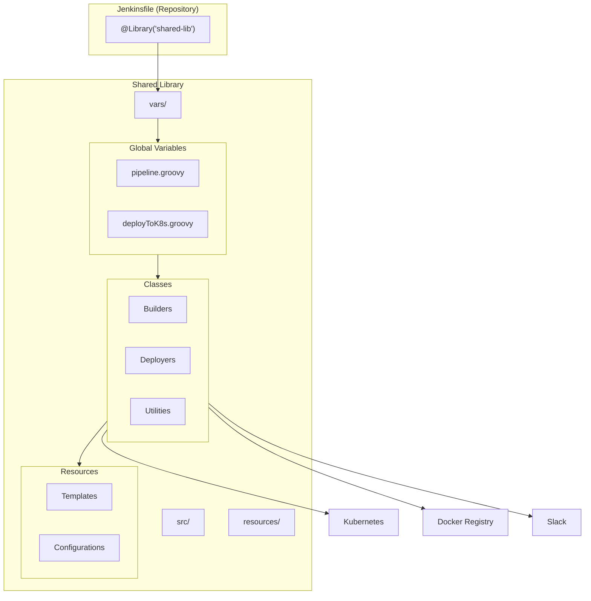

# How to Implement Jenkins Shared Libraries Advanced

Author: [nawazdhandala](https://www.github.com/nawazdhandala)

Tags: Jenkins, CI/CD, Groovy, DevOps, Automation

Description: Build reusable Jenkins shared libraries with global variables, custom steps, and pipeline templates for consistent CI/CD across projects.

---

If you have been working with Jenkins for a while, you have probably encountered the challenge of maintaining consistent pipeline code across dozens or hundreds of repositories. Copy-pasting Jenkinsfiles leads to drift, inconsistencies, and maintenance nightmares. Jenkins Shared Libraries solve this problem, but getting them right requires understanding some advanced patterns.

This guide builds on basic shared library knowledge and dives into sophisticated techniques that separate production-ready libraries from simple scripts.

## Advanced Directory Structure

While the basic structure includes `vars/`, `src/`, and `resources/`, production libraries benefit from additional organization.

```
(root)
+-- src/
|   +-- org/
|       +-- company/
|           +-- pipeline/
|           |   +-- StandardPipeline.groovy
|           |   +-- MicroservicePipeline.groovy
|           +-- builders/
|           |   +-- DockerBuilder.groovy
|           |   +-- GradleBuilder.groovy
|           +-- deployers/
|           |   +-- KubernetesDeployer.groovy
|           |   +-- LambdaDeployer.groovy
|           +-- utils/
|               +-- GitUtils.groovy
|               +-- SlackNotifier.groovy
+-- vars/
|   +-- standardPipeline.groovy
|   +-- dockerBuild.groovy
|   +-- deployToK8s.groovy
+-- resources/
|   +-- templates/
|   |   +-- deployment.yaml
|   |   +-- service.yaml
|   +-- config/
|       +-- environments.json
+-- test/
    +-- groovy/
        +-- org/company/
            +-- builders/
                +-- DockerBuilderTest.groovy
```

## Building a Pipeline DSL

One powerful pattern is creating a domain-specific language that lets developers configure pipelines declaratively while hiding complexity.

The following class serves as the entry point for your custom DSL. It collects configuration through a closure and delegates to specialized builders.

```groovy
// src/org/company/pipeline/PipelineBuilder.groovy
package org.company.pipeline

class PipelineBuilder implements Serializable {

    // Reference to pipeline script context
    def script

    // Configuration storage
    String projectName
    String language
    Map<String, Object> buildConfig = [:]
    Map<String, Object> deployConfig = [:]
    List<String> environments = []
    Closure customStages = null

    PipelineBuilder(script) {
        this.script = script
    }

    // DSL methods for fluent configuration
    def project(String name) {
        this.projectName = name
        return this
    }

    def lang(String language) {
        this.language = language
        return this
    }

    def build(Closure config) {
        // Evaluate closure to populate buildConfig
        config.delegate = buildConfig
        config.resolveStrategy = Closure.DELEGATE_FIRST
        config()
        return this
    }

    def deploy(Closure config) {
        config.delegate = deployConfig
        config.resolveStrategy = Closure.DELEGATE_FIRST
        config()
        return this
    }

    def stages(Closure customStages) {
        this.customStages = customStages
        return this
    }

    // Execute the pipeline with collected configuration
    def execute() {
        script.pipeline {
            agent any

            stages {
                stage('Checkout') {
                    steps {
                        checkout scm
                    }
                }

                stage('Build') {
                    steps {
                        script {
                            executeBuild()
                        }
                    }
                }

                stage('Test') {
                    steps {
                        script {
                            executeTests()
                        }
                    }
                }

                // Inject custom stages if provided
                if (customStages) {
                    customStages.delegate = script
                    customStages()
                }

                stage('Deploy') {
                    when {
                        branch 'main'
                    }
                    steps {
                        script {
                            executeDeploy()
                        }
                    }
                }
            }
        }
    }

    private void executeBuild() {
        // Delegate to language-specific builder
        switch(language) {
            case 'java':
                new GradleBuilder(script, buildConfig).build()
                break
            case 'node':
                new NodeBuilder(script, buildConfig).build()
                break
            case 'go':
                new GoBuilder(script, buildConfig).build()
                break
            default:
                script.error "Unsupported language: ${language}"
        }
    }

    private void executeTests() {
        script.sh buildConfig.testCommand ?: 'echo "No tests configured"'
    }

    private void executeDeploy() {
        new KubernetesDeployer(script, deployConfig).deploy()
    }
}
```

Now create the vars/ entry point that exposes this DSL to Jenkinsfiles.

```groovy
// vars/pipeline.groovy

import org.company.pipeline.PipelineBuilder

// This makes pipeline { ... } syntax available
def call(Closure body) {
    def builder = new PipelineBuilder(this)

    body.delegate = builder
    body.resolveStrategy = Closure.DELEGATE_FIRST
    body()

    builder.execute()
}
```

Teams can now write expressive Jenkinsfiles like this.

```groovy
// Jenkinsfile in any repository
@Library('company-shared-lib@v2.0') _

pipeline {
    project 'payment-service'
    lang 'java'

    build {
        jdkVersion = '17'
        gradleVersion = '8.0'
        testCommand = './gradlew test'
    }

    deploy {
        namespace = 'production'
        replicas = 3
        resources = [cpu: '500m', memory: '512Mi']
    }
}
```

## Implementing Conditional Stage Generation

Dynamic stage generation based on repository characteristics saves teams from maintaining complex conditional logic.

```groovy
// src/org/company/pipeline/StageGenerator.groovy
package org.company.pipeline

class StageGenerator implements Serializable {

    def script

    StageGenerator(script) {
        this.script = script
    }

    // Analyze repo and generate appropriate stages
    List<Map> generateStages() {
        def stages = []

        // Check for Dockerfile
        if (script.fileExists('Dockerfile')) {
            stages << [
                name: 'Docker Build',
                steps: { dockerBuildSteps() }
            ]
        }

        // Check for Helm charts
        if (script.fileExists('charts/')) {
            stages << [
                name: 'Helm Lint',
                steps: { helmLintSteps() }
            ]
        }

        // Check for Terraform
        if (script.fileExists('terraform/')) {
            stages << [
                name: 'Terraform Plan',
                steps: { terraformPlanSteps() }
            ]
        }

        // Check for database migrations
        if (script.fileExists('migrations/') || script.fileExists('db/migrate/')) {
            stages << [
                name: 'Migration Check',
                steps: { migrationCheckSteps() }
            ]
        }

        return stages
    }

    private void dockerBuildSteps() {
        script.sh 'docker build -t ${IMAGE_NAME}:${BUILD_NUMBER} .'
    }

    private void helmLintSteps() {
        script.sh 'helm lint charts/*'
    }

    private void terraformPlanSteps() {
        script.dir('terraform') {
            script.sh 'terraform init'
            script.sh 'terraform plan -out=tfplan'
        }
    }

    private void migrationCheckSteps() {
        script.echo 'Checking for pending migrations...'
        // Add migration validation logic
    }
}
```

## External Configuration Management

Hard-coding environment configurations in Groovy classes limits flexibility. Loading configurations from external files enables updates without library releases.

```json
// resources/config/environments.json
{
  "development": {
    "cluster": "dev-cluster",
    "namespace": "dev",
    "replicas": 1,
    "resources": {
      "cpu": "100m",
      "memory": "256Mi"
    },
    "ingress": {
      "enabled": false
    }
  },
  "staging": {
    "cluster": "staging-cluster",
    "namespace": "staging",
    "replicas": 2,
    "resources": {
      "cpu": "250m",
      "memory": "512Mi"
    },
    "ingress": {
      "enabled": true,
      "host": "staging.example.com"
    }
  },
  "production": {
    "cluster": "prod-cluster",
    "namespace": "production",
    "replicas": 3,
    "resources": {
      "cpu": "500m",
      "memory": "1Gi"
    },
    "ingress": {
      "enabled": true,
      "host": "api.example.com"
    }
  }
}
```

```groovy
// src/org/company/utils/ConfigLoader.groovy
package org.company.utils

import groovy.json.JsonSlurper

class ConfigLoader implements Serializable {

    def script
    Map environments

    ConfigLoader(script) {
        this.script = script
        loadConfig()
    }

    private void loadConfig() {
        // Load configuration from library resources
        def configText = script.libraryResource('config/environments.json')
        environments = new JsonSlurper().parseText(configText)
    }

    Map getEnvironment(String envName) {
        if (!environments.containsKey(envName)) {
            script.error "Unknown environment: ${envName}. Available: ${environments.keySet()}"
        }
        return environments[envName]
    }

    List<String> getAvailableEnvironments() {
        return environments.keySet().toList()
    }
}
```

## Mermaid: Library Architecture Overview



## Handling Secrets and Credentials

Production libraries need robust credential management that works across different credential types.

```groovy
// src/org/company/utils/CredentialManager.groovy
package org.company.utils

class CredentialManager implements Serializable {

    def script

    CredentialManager(script) {
        this.script = script
    }

    // Execute closure with multiple credential types
    def withCredentials(Map config, Closure body) {
        def credentialBindings = []

        // Handle username/password credentials
        if (config.usernamePassword) {
            config.usernamePassword.each { cred ->
                credentialBindings << script.usernamePassword(
                    credentialsId: cred.id,
                    usernameVariable: cred.userVar ?: 'USERNAME',
                    passwordVariable: cred.passVar ?: 'PASSWORD'
                )
            }
        }

        // Handle secret files
        if (config.secretFiles) {
            config.secretFiles.each { cred ->
                credentialBindings << script.file(
                    credentialsId: cred.id,
                    variable: cred.variable
                )
            }
        }

        // Handle SSH keys
        if (config.sshKeys) {
            config.sshKeys.each { cred ->
                credentialBindings << script.sshUserPrivateKey(
                    credentialsId: cred.id,
                    keyFileVariable: cred.keyVar ?: 'SSH_KEY',
                    usernameVariable: cred.userVar ?: 'SSH_USER'
                )
            }
        }

        // Execute with all credentials bound
        script.withCredentials(credentialBindings) {
            body()
        }
    }
}
```

Usage in a deployment step keeps credential handling clean and reusable.

```groovy
// vars/deployToK8s.groovy

import org.company.utils.CredentialManager

def call(Map config) {
    def credManager = new CredentialManager(this)

    credManager.withCredentials([
        secretFiles: [
            [id: config.kubeConfig ?: 'kubeconfig-prod', variable: 'KUBECONFIG']
        ]
    ]) {
        sh """
            kubectl set image deployment/${config.deployment} \\
                ${config.deployment}=${config.image} \\
                -n ${config.namespace}

            kubectl rollout status deployment/${config.deployment} \\
                -n ${config.namespace} \\
                --timeout=${config.timeout ?: 300}s
        """
    }
}
```

## Testing Strategies for Shared Libraries

Untested shared libraries become liabilities. Here is a practical testing approach using Jenkins Pipeline Unit.

```groovy
// test/groovy/org/company/builders/DockerBuilderTest.groovy
package org.company.builders

import com.lesfurets.jenkins.unit.BasePipelineTest
import org.junit.Before
import org.junit.Test

class DockerBuilderTest extends BasePipelineTest {

    def dockerBuilder
    def shellCommands = []

    @Before
    void setUp() {
        super.setUp()

        // Mock shell commands
        helper.registerAllowedMethod('sh', [String], { cmd ->
            shellCommands << cmd
        })

        helper.registerAllowedMethod('sh', [Map], { Map args ->
            shellCommands << args.script
            if (args.returnStdout) {
                return 'mocked-output'
            }
        })

        // Mock Docker methods
        helper.registerAllowedMethod('docker', [Closure], { closure ->
            closure.delegate = [
                build: { String tag -> shellCommands << "docker build -t ${tag}" },
                withRegistry: { String url, String creds, Closure body -> body() }
            ]
            closure()
        })

        dockerBuilder = new DockerBuilder(this, [
            imageName: 'test-image',
            tag: 'latest'
        ])
    }

    @Test
    void testBuildCreatesCorrectImageTag() {
        dockerBuilder.build()

        assert shellCommands.any { it.contains('docker build') }
        assert shellCommands.any { it.contains('test-image') }
    }

    @Test
    void testBuildWithCustomDockerfile() {
        dockerBuilder.config.dockerfile = 'Dockerfile.prod'
        dockerBuilder.build()

        assert shellCommands.any { it.contains('-f Dockerfile.prod') }
    }
}
```

## Version Compatibility and Migration

When releasing breaking changes, provide migration utilities that help teams upgrade smoothly.

```groovy
// vars/migrateToV2.groovy

def call() {
    echo "Checking for v1 patterns that need migration..."

    def deprecations = []

    // Check for deprecated method usage
    if (binding.hasVariable('deployToECS')) {
        deprecations << "deployToECS is deprecated. Use deployToK8s with EKS config instead."
    }

    // Check for old configuration patterns
    def jenkinsfile = readFile('Jenkinsfile')

    if (jenkinsfile.contains('dockerRegistry:')) {
        deprecations << "dockerRegistry parameter renamed to registry in v2"
    }

    if (jenkinsfile.contains('@Library(\'shared-lib\')')) {
        deprecations << "Please specify version: @Library('shared-lib@v2.0')"
    }

    if (deprecations) {
        echo "Migration warnings found:"
        deprecations.each { echo "  - ${it}" }

        // Fail build if strict mode enabled
        if (params.STRICT_MIGRATION) {
            error "Migration issues must be resolved before continuing"
        }
    } else {
        echo "No migration issues found. Ready for v2!"
    }
}
```

## Summary

Building advanced Jenkins Shared Libraries requires thinking beyond simple helper functions. By implementing proper DSLs, external configuration, credential management, and testing strategies, you create libraries that scale with your organization. The patterns covered here - pipeline builders, conditional stage generation, and version migration - form the foundation for maintainable CI/CD infrastructure.

Start by identifying repetitive patterns in your existing Jenkinsfiles, extract them into well-tested library code, and iterate based on team feedback. Your future self and your colleagues will thank you when a single library update propagates consistent improvements across hundreds of pipelines.

For monitoring your Jenkins pipelines and ensuring build reliability, consider using [OneUptime](https://oneuptime.com) to track build times, failure rates, and deployment metrics across your CI/CD infrastructure.
