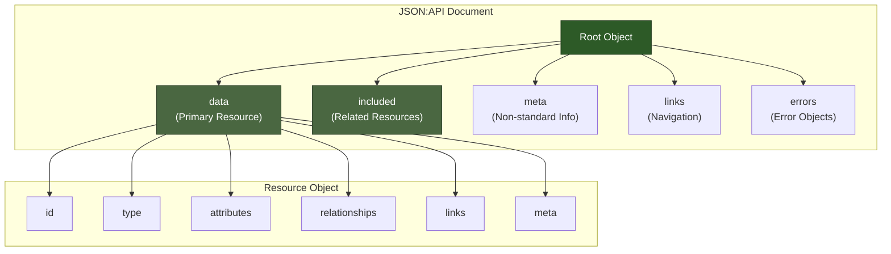
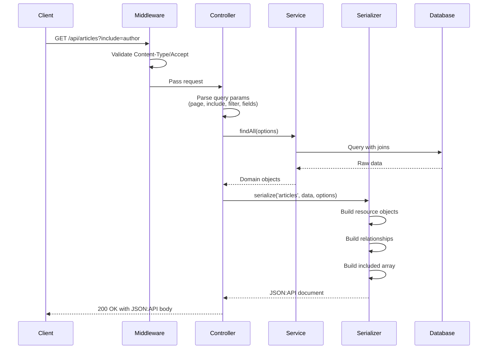
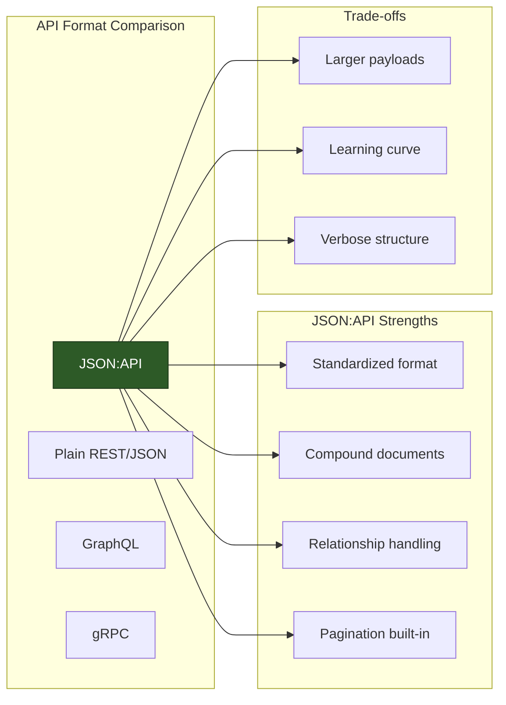

# How to Create JSON:API Format Implementation

Author: [nawazdhandala](https://github.com/nawazdhandala)

Tags: JSON:API, REST API, API Design, Backend Development, Node.js, Python, API Specification, Web Services

Description: Learn how to implement the JSON:API specification in your backend services. This guide covers the complete structure, relationships, pagination, filtering, and error handling with production-ready code examples.

---

JSON:API is a specification for building APIs in JSON. It standardizes how clients and servers communicate, reducing the guesswork around request and response formats. Unlike ad-hoc JSON APIs where every team invents their own conventions, JSON:API provides a consistent structure that developers can rely on across different services.

## Why Use JSON:API?

Before diving into implementation, let us understand what problems JSON:API solves:

- **Consistent Structure**: Every response follows the same format, making client code predictable
- **Efficient Data Fetching**: Compound documents reduce HTTP round trips
- **Standardized Relationships**: Clear conventions for linking resources
- **Built-in Pagination**: Standardized pagination metadata and links
- **Error Handling**: Structured error objects with detailed information
- **Sparse Fieldsets**: Clients can request only the fields they need

## JSON:API Document Structure

A JSON:API document has a specific structure. Here is how the main components relate to each other:



## Basic Response Structure

Let us start with a simple example. Here is a JSON:API response for a single article:

```json
{
  "data": {
    "type": "articles",
    "id": "1",
    "attributes": {
      "title": "Understanding JSON:API",
      "body": "JSON:API is a specification for building APIs...",
      "createdAt": "2026-01-30T10:00:00Z",
      "updatedAt": "2026-01-30T10:00:00Z"
    },
    "relationships": {
      "author": {
        "links": {
          "self": "/articles/1/relationships/author",
          "related": "/articles/1/author"
        },
        "data": { "type": "users", "id": "42" }
      },
      "comments": {
        "links": {
          "self": "/articles/1/relationships/comments",
          "related": "/articles/1/comments"
        },
        "data": [
          { "type": "comments", "id": "5" },
          { "type": "comments", "id": "12" }
        ]
      }
    },
    "links": {
      "self": "/articles/1"
    }
  },
  "included": [
    {
      "type": "users",
      "id": "42",
      "attributes": {
        "name": "Jane Smith",
        "email": "jane@example.com"
      },
      "links": {
        "self": "/users/42"
      }
    }
  ],
  "links": {
    "self": "/articles/1"
  }
}
```

Key observations:
- The `type` and `id` together uniquely identify a resource
- Attributes contain the resource data (but not relationships)
- Relationships link to other resources using type/id pairs
- The `included` array contains related resources to reduce HTTP requests

## Implementing JSON:API in Node.js

Let us build a complete JSON:API implementation for an article management system.

### Project Structure

```
src/
├── serializers/
│   ├── JsonApiSerializer.js
│   └── index.js
├── models/
│   ├── Article.js
│   └── User.js
├── controllers/
│   └── ArticleController.js
├── middleware/
│   └── jsonApiHeaders.js
└── app.js
```

### JSON:API Serializer

This serializer transforms your data models into JSON:API format.

```javascript
// src/serializers/JsonApiSerializer.js

class JsonApiSerializer {
  constructor(options = {}) {
    // Base URL for generating links
    this.baseUrl = options.baseUrl || '';
    // Registry of resource configurations
    this.types = new Map();
  }

  // Register a resource type with its configuration
  // This tells the serializer how to handle each type of resource
  register(type, config) {
    this.types.set(type, {
      type: type,
      // Function to extract attributes from a model
      attributes: config.attributes || [],
      // Relationship definitions
      relationships: config.relationships || {},
      // Custom links generator
      links: config.links || null,
      // Transform function for attribute values
      transform: config.transform || null
    });
    return this;
  }

  // Serialize a single resource or array of resources
  serialize(type, data, options = {}) {
    const config = this.types.get(type);
    if (!config) {
      throw new Error(`Unknown type: ${type}. Register it first.`);
    }

    const included = new Map();
    const result = {
      jsonapi: { version: '1.1' }
    };

    // Handle null data
    if (data === null) {
      result.data = null;
      return result;
    }

    // Serialize single resource or collection
    if (Array.isArray(data)) {
      result.data = data.map(item =>
        this.serializeResource(config, item, included, options)
      );
    } else {
      result.data = this.serializeResource(config, data, included, options);
    }

    // Add included resources if any were collected
    if (included.size > 0) {
      result.included = Array.from(included.values());
    }

    // Add top-level links
    if (options.links) {
      result.links = options.links;
    }

    // Add meta information
    if (options.meta) {
      result.meta = options.meta;
    }

    return result;
  }

  // Serialize a single resource object
  serializeResource(config, data, included, options) {
    const id = String(data.id);
    const resource = {
      type: config.type,
      id: id
    };

    // Build attributes object from the configured attribute list
    // Only include attributes that are specified in the config
    const attributes = {};
    const fields = options.fields?.[config.type] || config.attributes;

    for (const attr of fields) {
      if (config.attributes.includes(attr)) {
        let value = data[attr];
        // Apply transformation if defined
        if (config.transform && config.transform[attr]) {
          value = config.transform[attr](value, data);
        }
        if (value !== undefined) {
          attributes[attr] = value;
        }
      }
    }

    if (Object.keys(attributes).length > 0) {
      resource.attributes = attributes;
    }

    // Build relationships
    const relationships = {};
    for (const [relName, relConfig] of Object.entries(config.relationships)) {
      const relData = data[relName] || data[relConfig.dataKey || relName];

      if (relData !== undefined) {
        relationships[relName] = this.serializeRelationship(
          relName,
          relConfig,
          relData,
          id,
          config.type,
          included,
          options
        );
      }
    }

    if (Object.keys(relationships).length > 0) {
      resource.relationships = relationships;
    }

    // Add resource links
    resource.links = {
      self: `${this.baseUrl}/${config.type}/${id}`
    };

    if (config.links) {
      Object.assign(resource.links, config.links(data));
    }

    return resource;
  }

  // Serialize a relationship
  serializeRelationship(name, config, data, parentId, parentType, included, options) {
    const relationship = {
      links: {
        self: `${this.baseUrl}/${parentType}/${parentId}/relationships/${name}`,
        related: `${this.baseUrl}/${parentType}/${parentId}/${name}`
      }
    };

    // Handle to-one relationship
    if (!Array.isArray(data)) {
      if (data === null) {
        relationship.data = null;
      } else {
        relationship.data = {
          type: config.type,
          id: String(data.id || data)
        };

        // Include the related resource if requested and data is available
        if (options.include?.includes(name) && typeof data === 'object') {
          this.addToIncluded(config.type, data, included, options);
        }
      }
    } else {
      // Handle to-many relationship
      relationship.data = data.map(item => ({
        type: config.type,
        id: String(item.id || item)
      }));

      // Include related resources if requested
      if (options.include?.includes(name)) {
        for (const item of data) {
          if (typeof item === 'object') {
            this.addToIncluded(config.type, item, included, options);
          }
        }
      }
    }

    return relationship;
  }

  // Add a resource to the included array (avoiding duplicates)
  addToIncluded(type, data, included, options) {
    const config = this.types.get(type);
    if (!config) return;

    const key = `${type}:${data.id}`;
    if (!included.has(key)) {
      const resource = this.serializeResource(config, data, included, options);
      included.set(key, resource);
    }
  }

  // Serialize pagination links
  serializePaginationLinks(basePath, page, limit, total) {
    const totalPages = Math.ceil(total / limit);
    const links = {
      self: `${this.baseUrl}${basePath}?page[number]=${page}&page[size]=${limit}`
    };

    links.first = `${this.baseUrl}${basePath}?page[number]=1&page[size]=${limit}`;
    links.last = `${this.baseUrl}${basePath}?page[number]=${totalPages}&page[size]=${limit}`;

    if (page > 1) {
      links.prev = `${this.baseUrl}${basePath}?page[number]=${page - 1}&page[size]=${limit}`;
    }

    if (page < totalPages) {
      links.next = `${this.baseUrl}${basePath}?page[number]=${page + 1}&page[size]=${limit}`;
    }

    return links;
  }

  // Serialize error responses
  serializeError(errors) {
    if (!Array.isArray(errors)) {
      errors = [errors];
    }

    return {
      jsonapi: { version: '1.1' },
      errors: errors.map(err => ({
        id: err.id || undefined,
        status: String(err.status || 500),
        code: err.code || undefined,
        title: err.title || 'Error',
        detail: err.detail || err.message || 'An error occurred',
        source: err.source || undefined,
        meta: err.meta || undefined
      }))
    };
  }
}

module.exports = JsonApiSerializer;
```

### Setting Up Resource Types

Configure the serializer for your specific resource types.

```javascript
// src/serializers/index.js

const JsonApiSerializer = require('./JsonApiSerializer');

const serializer = new JsonApiSerializer({
  baseUrl: process.env.API_BASE_URL || 'http://localhost:3000/api'
});

// Register the articles resource type
// Define which attributes to include and how relationships work
serializer.register('articles', {
  attributes: ['title', 'body', 'slug', 'createdAt', 'updatedAt', 'publishedAt'],
  relationships: {
    author: {
      type: 'users'
    },
    comments: {
      type: 'comments'
    },
    tags: {
      type: 'tags'
    }
  },
  transform: {
    // Format dates as ISO strings
    createdAt: (value) => value?.toISOString?.() || value,
    updatedAt: (value) => value?.toISOString?.() || value,
    publishedAt: (value) => value?.toISOString?.() || value
  }
});

// Register the users resource type
serializer.register('users', {
  attributes: ['name', 'email', 'bio', 'avatarUrl', 'createdAt'],
  relationships: {
    articles: {
      type: 'articles'
    }
  },
  transform: {
    createdAt: (value) => value?.toISOString?.() || value
  }
});

// Register the comments resource type
serializer.register('comments', {
  attributes: ['body', 'createdAt'],
  relationships: {
    author: {
      type: 'users'
    },
    article: {
      type: 'articles'
    }
  },
  transform: {
    createdAt: (value) => value?.toISOString?.() || value
  }
});

// Register tags resource type
serializer.register('tags', {
  attributes: ['name', 'slug']
});

module.exports = serializer;
```

### Article Controller

The controller handles HTTP requests and uses the serializer for responses.

```javascript
// src/controllers/ArticleController.js

const serializer = require('../serializers');

class ArticleController {
  constructor(articleService) {
    this.articleService = articleService;
  }

  // GET /api/articles
  // Handles listing articles with pagination, filtering, and inclusion
  async listArticles(req, res) {
    try {
      // Parse JSON:API query parameters
      const page = parseInt(req.query['page[number]']) || 1;
      const limit = parseInt(req.query['page[size]']) || 10;
      const sort = req.query.sort || '-createdAt';
      const include = req.query.include?.split(',') || [];
      const filter = this.parseFilters(req.query.filter);
      const fields = this.parseFields(req.query.fields);

      // Fetch articles with options
      const { articles, total } = await this.articleService.findAll({
        page,
        limit,
        sort: this.parseSort(sort),
        filter,
        include
      });

      // Serialize the response
      const response = serializer.serialize('articles', articles, {
        include,
        fields,
        links: serializer.serializePaginationLinks('/api/articles', page, limit, total),
        meta: {
          totalCount: total,
          pageCount: Math.ceil(total / limit)
        }
      });

      res.json(response);
    } catch (error) {
      this.handleError(res, error);
    }
  }

  // GET /api/articles/:id
  // Fetches a single article with optional included resources
  async getArticle(req, res) {
    try {
      const { id } = req.params;
      const include = req.query.include?.split(',') || [];
      const fields = this.parseFields(req.query.fields);

      const article = await this.articleService.findById(id, { include });

      if (!article) {
        return res.status(404).json(serializer.serializeError({
          status: 404,
          title: 'Not Found',
          detail: `Article with id '${id}' does not exist`
        }));
      }

      const response = serializer.serialize('articles', article, {
        include,
        fields
      });

      res.json(response);
    } catch (error) {
      this.handleError(res, error);
    }
  }

  // POST /api/articles
  // Creates a new article from a JSON:API request body
  async createArticle(req, res) {
    try {
      // Validate JSON:API request format
      if (!req.body.data || req.body.data.type !== 'articles') {
        return res.status(400).json(serializer.serializeError({
          status: 400,
          title: 'Bad Request',
          detail: 'Request body must contain a data object with type "articles"'
        }));
      }

      const { attributes, relationships } = req.body.data;

      // Build article data from JSON:API format
      const articleData = {
        ...attributes,
        authorId: relationships?.author?.data?.id
      };

      // Handle tags relationship
      if (relationships?.tags?.data) {
        articleData.tagIds = relationships.tags.data.map(t => t.id);
      }

      const article = await this.articleService.create(articleData);

      const response = serializer.serialize('articles', article, {
        include: ['author']
      });

      res.status(201).json(response);
    } catch (error) {
      this.handleError(res, error);
    }
  }

  // PATCH /api/articles/:id
  // Updates an existing article
  async updateArticle(req, res) {
    try {
      const { id } = req.params;

      if (!req.body.data || req.body.data.type !== 'articles') {
        return res.status(400).json(serializer.serializeError({
          status: 400,
          title: 'Bad Request',
          detail: 'Request body must contain a data object with type "articles"'
        }));
      }

      // Verify ID matches
      if (req.body.data.id && req.body.data.id !== id) {
        return res.status(409).json(serializer.serializeError({
          status: 409,
          title: 'Conflict',
          detail: 'Resource ID in URL does not match ID in request body'
        }));
      }

      const { attributes, relationships } = req.body.data;

      const updateData = { ...attributes };

      if (relationships?.author?.data) {
        updateData.authorId = relationships.author.data.id;
      }

      const article = await this.articleService.update(id, updateData);

      if (!article) {
        return res.status(404).json(serializer.serializeError({
          status: 404,
          title: 'Not Found',
          detail: `Article with id '${id}' does not exist`
        }));
      }

      const response = serializer.serialize('articles', article);
      res.json(response);
    } catch (error) {
      this.handleError(res, error);
    }
  }

  // DELETE /api/articles/:id
  // Deletes an article
  async deleteArticle(req, res) {
    try {
      const { id } = req.params;
      const deleted = await this.articleService.delete(id);

      if (!deleted) {
        return res.status(404).json(serializer.serializeError({
          status: 404,
          title: 'Not Found',
          detail: `Article with id '${id}' does not exist`
        }));
      }

      res.status(204).send();
    } catch (error) {
      this.handleError(res, error);
    }
  }

  // GET /api/articles/:id/relationships/author
  // Returns the relationship data without the full resource
  async getAuthorRelationship(req, res) {
    try {
      const { id } = req.params;
      const article = await this.articleService.findById(id);

      if (!article) {
        return res.status(404).json(serializer.serializeError({
          status: 404,
          title: 'Not Found',
          detail: `Article with id '${id}' does not exist`
        }));
      }

      res.json({
        links: {
          self: `/api/articles/${id}/relationships/author`,
          related: `/api/articles/${id}/author`
        },
        data: article.authorId
          ? { type: 'users', id: String(article.authorId) }
          : null
      });
    } catch (error) {
      this.handleError(res, error);
    }
  }

  // PATCH /api/articles/:id/relationships/author
  // Updates the author relationship
  async updateAuthorRelationship(req, res) {
    try {
      const { id } = req.params;
      const { data } = req.body;

      // data can be null (remove relationship) or { type, id }
      const authorId = data?.id || null;

      const article = await this.articleService.update(id, { authorId });

      if (!article) {
        return res.status(404).json(serializer.serializeError({
          status: 404,
          title: 'Not Found',
          detail: `Article with id '${id}' does not exist`
        }));
      }

      res.json({
        links: {
          self: `/api/articles/${id}/relationships/author`,
          related: `/api/articles/${id}/author`
        },
        data: authorId ? { type: 'users', id: String(authorId) } : null
      });
    } catch (error) {
      this.handleError(res, error);
    }
  }

  // Parse JSON:API filter parameters
  // Supports: filter[field]=value and filter[field][operator]=value
  parseFilters(filterParams) {
    if (!filterParams) return {};

    const filters = {};
    for (const [key, value] of Object.entries(filterParams)) {
      filters[key] = value;
    }
    return filters;
  }

  // Parse JSON:API sort parameter
  // Supports: sort=field,-field (prefix with - for descending)
  parseSort(sortParam) {
    if (!sortParam) return { createdAt: 'desc' };

    const sortFields = {};
    const fields = sortParam.split(',');

    for (const field of fields) {
      if (field.startsWith('-')) {
        sortFields[field.substring(1)] = 'desc';
      } else {
        sortFields[field] = 'asc';
      }
    }

    return sortFields;
  }

  // Parse JSON:API sparse fieldsets
  // Supports: fields[type]=field1,field2
  parseFields(fieldsParams) {
    if (!fieldsParams) return null;

    const fields = {};
    for (const [type, fieldList] of Object.entries(fieldsParams)) {
      fields[type] = fieldList.split(',');
    }
    return fields;
  }

  // Central error handler
  handleError(res, error) {
    console.error('API Error:', error);

    if (error.name === 'ValidationError') {
      return res.status(422).json(serializer.serializeError({
        status: 422,
        title: 'Validation Error',
        detail: error.message,
        source: { pointer: error.path ? `/data/attributes/${error.path}` : undefined }
      }));
    }

    res.status(500).json(serializer.serializeError({
      status: 500,
      title: 'Internal Server Error',
      detail: 'An unexpected error occurred'
    }));
  }
}

module.exports = ArticleController;
```

### JSON:API Middleware

Set up proper headers and content negotiation.

```javascript
// src/middleware/jsonApiHeaders.js

// JSON:API requires the Content-Type header to be application/vnd.api+json
const JSON_API_CONTENT_TYPE = 'application/vnd.api+json';

function jsonApiHeaders(req, res, next) {
  // Set the correct Content-Type for responses
  res.set('Content-Type', JSON_API_CONTENT_TYPE);

  // Validate Content-Type for requests with bodies
  if (['POST', 'PATCH', 'PUT'].includes(req.method)) {
    const contentType = req.get('Content-Type');

    if (contentType && !contentType.includes(JSON_API_CONTENT_TYPE)) {
      return res.status(415).json({
        errors: [{
          status: '415',
          title: 'Unsupported Media Type',
          detail: `Content-Type must be ${JSON_API_CONTENT_TYPE}`
        }]
      });
    }
  }

  // Validate Accept header if present
  const accept = req.get('Accept');
  if (accept && accept !== '*/*' && !accept.includes(JSON_API_CONTENT_TYPE)) {
    return res.status(406).json({
      errors: [{
        status: '406',
        title: 'Not Acceptable',
        detail: `Accept header must include ${JSON_API_CONTENT_TYPE}`
      }]
    });
  }

  next();
}

module.exports = jsonApiHeaders;
```

### Express Application Setup

Wire everything together in the main application file.

```javascript
// src/app.js

const express = require('express');
const jsonApiHeaders = require('./middleware/jsonApiHeaders');
const ArticleController = require('./controllers/ArticleController');
const ArticleService = require('./services/ArticleService');

const app = express();

// Parse JSON bodies
app.use(express.json({ type: 'application/vnd.api+json' }));
app.use(express.json());

// Apply JSON:API middleware to all API routes
app.use('/api', jsonApiHeaders);

// Initialize services and controllers
const articleService = new ArticleService();
const articleController = new ArticleController(articleService);

// Article routes following JSON:API conventions
app.get('/api/articles', (req, res) => articleController.listArticles(req, res));
app.post('/api/articles', (req, res) => articleController.createArticle(req, res));
app.get('/api/articles/:id', (req, res) => articleController.getArticle(req, res));
app.patch('/api/articles/:id', (req, res) => articleController.updateArticle(req, res));
app.delete('/api/articles/:id', (req, res) => articleController.deleteArticle(req, res));

// Relationship endpoints
app.get('/api/articles/:id/relationships/author',
  (req, res) => articleController.getAuthorRelationship(req, res));
app.patch('/api/articles/:id/relationships/author',
  (req, res) => articleController.updateAuthorRelationship(req, res));

// Related resource endpoints
app.get('/api/articles/:id/author', async (req, res) => {
  const article = await articleService.findById(req.params.id, { include: ['author'] });
  if (!article || !article.author) {
    return res.status(404).json({
      errors: [{ status: '404', title: 'Not Found' }]
    });
  }
  res.json(serializer.serialize('users', article.author));
});

const PORT = process.env.PORT || 3000;
app.listen(PORT, () => {
  console.log(`JSON:API server running on port ${PORT}`);
});
```

## Request and Response Flow

Here is how a typical JSON:API request flows through the system:



## Implementing JSON:API in Python with Flask

For Python developers, here is how to implement JSON:API using Flask:

```python
# serializers/jsonapi.py

from typing import Any, Dict, List, Optional, Union
from dataclasses import dataclass
from datetime import datetime

@dataclass
class RelationshipConfig:
    """Configuration for a relationship"""
    type: str
    many: bool = False

class JsonApiSerializer:
    """Serializer for converting objects to JSON:API format"""

    def __init__(self, base_url: str = ''):
        self.base_url = base_url
        self.types: Dict[str, dict] = {}

    def register(self, type_name: str, attributes: List[str],
                 relationships: Optional[Dict[str, RelationshipConfig]] = None,
                 transform: Optional[Dict[str, callable]] = None):
        """Register a resource type with its configuration"""
        self.types[type_name] = {
            'type': type_name,
            'attributes': attributes,
            'relationships': relationships or {},
            'transform': transform or {}
        }

    def serialize(self, type_name: str, data: Any,
                  include: Optional[List[str]] = None,
                  meta: Optional[dict] = None,
                  links: Optional[dict] = None) -> dict:
        """Serialize data to JSON:API format"""
        config = self.types.get(type_name)
        if not config:
            raise ValueError(f"Unknown type: {type_name}")

        included = {}
        result = {'jsonapi': {'version': '1.1'}}

        if data is None:
            result['data'] = None
        elif isinstance(data, list):
            result['data'] = [
                self._serialize_resource(config, item, included, include or [])
                for item in data
            ]
        else:
            result['data'] = self._serialize_resource(
                config, data, included, include or []
            )

        if included:
            result['included'] = list(included.values())

        if links:
            result['links'] = links

        if meta:
            result['meta'] = meta

        return result

    def _serialize_resource(self, config: dict, data: Any,
                            included: dict, include: List[str]) -> dict:
        """Serialize a single resource object"""
        resource_id = str(self._get_attr(data, 'id'))
        resource = {
            'type': config['type'],
            'id': resource_id
        }

        # Build attributes
        attributes = {}
        for attr in config['attributes']:
            value = self._get_attr(data, attr)
            if value is not None:
                # Apply transform if defined
                if attr in config['transform']:
                    value = config['transform'][attr](value)
                # Handle datetime objects
                elif isinstance(value, datetime):
                    value = value.isoformat()
                attributes[attr] = value

        if attributes:
            resource['attributes'] = attributes

        # Build relationships
        relationships = {}
        for rel_name, rel_config in config['relationships'].items():
            rel_data = self._get_attr(data, rel_name)
            if rel_data is not None:
                relationships[rel_name] = self._serialize_relationship(
                    rel_name, rel_config, rel_data,
                    resource_id, config['type'],
                    included, include
                )

        if relationships:
            resource['relationships'] = relationships

        # Add self link
        resource['links'] = {
            'self': f"{self.base_url}/{config['type']}/{resource_id}"
        }

        return resource

    def _serialize_relationship(self, name: str, config: RelationshipConfig,
                                data: Any, parent_id: str, parent_type: str,
                                included: dict, include: List[str]) -> dict:
        """Serialize a relationship"""
        relationship = {
            'links': {
                'self': f"{self.base_url}/{parent_type}/{parent_id}/relationships/{name}",
                'related': f"{self.base_url}/{parent_type}/{parent_id}/{name}"
            }
        }

        if config.many:
            # To-many relationship
            relationship['data'] = [
                {'type': config.type, 'id': str(self._get_attr(item, 'id') or item)}
                for item in (data or [])
            ]
            # Add to included if requested
            if name in include:
                for item in (data or []):
                    if hasattr(item, 'id'):
                        self._add_to_included(config.type, item, included, include)
        else:
            # To-one relationship
            if data is None:
                relationship['data'] = None
            else:
                item_id = self._get_attr(data, 'id') or data
                relationship['data'] = {'type': config.type, 'id': str(item_id)}
                # Add to included if requested
                if name in include and hasattr(data, 'id'):
                    self._add_to_included(config.type, data, included, include)

        return relationship

    def _add_to_included(self, type_name: str, data: Any,
                         included: dict, include: List[str]):
        """Add a resource to the included collection"""
        config = self.types.get(type_name)
        if not config:
            return

        key = f"{type_name}:{self._get_attr(data, 'id')}"
        if key not in included:
            resource = self._serialize_resource(config, data, included, include)
            included[key] = resource

    def _get_attr(self, obj: Any, name: str) -> Any:
        """Get an attribute from an object (works with dicts and objects)"""
        if isinstance(obj, dict):
            return obj.get(name)
        return getattr(obj, name, None)

    def serialize_error(self, errors: Union[dict, List[dict]]) -> dict:
        """Serialize error responses"""
        if not isinstance(errors, list):
            errors = [errors]

        return {
            'jsonapi': {'version': '1.1'},
            'errors': [
                {
                    'status': str(err.get('status', 500)),
                    'title': err.get('title', 'Error'),
                    'detail': err.get('detail', 'An error occurred'),
                    'source': err.get('source'),
                    'code': err.get('code')
                }
                for err in errors
            ]
        }

    def pagination_links(self, base_path: str, page: int,
                         size: int, total: int) -> dict:
        """Generate pagination links"""
        total_pages = (total + size - 1) // size
        links = {
            'self': f"{self.base_url}{base_path}?page[number]={page}&page[size]={size}",
            'first': f"{self.base_url}{base_path}?page[number]=1&page[size]={size}",
            'last': f"{self.base_url}{base_path}?page[number]={total_pages}&page[size]={size}"
        }

        if page > 1:
            links['prev'] = f"{self.base_url}{base_path}?page[number]={page-1}&page[size]={size}"

        if page < total_pages:
            links['next'] = f"{self.base_url}{base_path}?page[number]={page+1}&page[size]={size}"

        return links
```

### Flask Application

```python
# app.py

from flask import Flask, request, jsonify, make_response
from serializers.jsonapi import JsonApiSerializer, RelationshipConfig
from functools import wraps

app = Flask(__name__)

# Initialize serializer
serializer = JsonApiSerializer(base_url='http://localhost:5000/api')

# Register resource types
serializer.register(
    'articles',
    attributes=['title', 'body', 'slug', 'created_at', 'updated_at'],
    relationships={
        'author': RelationshipConfig(type='users', many=False),
        'comments': RelationshipConfig(type='comments', many=True),
        'tags': RelationshipConfig(type='tags', many=True)
    }
)

serializer.register(
    'users',
    attributes=['name', 'email', 'bio'],
    relationships={
        'articles': RelationshipConfig(type='articles', many=True)
    }
)

serializer.register(
    'comments',
    attributes=['body', 'created_at'],
    relationships={
        'author': RelationshipConfig(type='users', many=False)
    }
)

JSON_API_CONTENT_TYPE = 'application/vnd.api+json'

def jsonapi_response(data, status=200):
    """Create a JSON:API response with correct headers"""
    response = make_response(jsonify(data), status)
    response.headers['Content-Type'] = JSON_API_CONTENT_TYPE
    return response

def validate_jsonapi_headers(f):
    """Decorator to validate JSON:API headers"""
    @wraps(f)
    def decorated(*args, **kwargs):
        # Check Content-Type for requests with bodies
        if request.method in ['POST', 'PATCH', 'PUT']:
            content_type = request.headers.get('Content-Type', '')
            if JSON_API_CONTENT_TYPE not in content_type:
                return jsonapi_response(
                    serializer.serialize_error({
                        'status': 415,
                        'title': 'Unsupported Media Type',
                        'detail': f'Content-Type must be {JSON_API_CONTENT_TYPE}'
                    }),
                    415
                )

        # Check Accept header
        accept = request.headers.get('Accept', '*/*')
        if accept != '*/*' and JSON_API_CONTENT_TYPE not in accept:
            return jsonapi_response(
                serializer.serialize_error({
                    'status': 406,
                    'title': 'Not Acceptable',
                    'detail': f'Accept header must include {JSON_API_CONTENT_TYPE}'
                }),
                406
            )

        return f(*args, **kwargs)
    return decorated

@app.route('/api/articles', methods=['GET'])
@validate_jsonapi_headers
def list_articles():
    # Parse query parameters
    page = request.args.get('page[number]', 1, type=int)
    size = request.args.get('page[size]', 10, type=int)
    include = request.args.get('include', '').split(',') if request.args.get('include') else []

    # Fetch articles (replace with actual database query)
    articles, total = article_service.find_all(page=page, size=size, include=include)

    # Serialize response
    response = serializer.serialize(
        'articles',
        articles,
        include=include,
        links=serializer.pagination_links('/api/articles', page, size, total),
        meta={'total_count': total}
    )

    return jsonapi_response(response)

@app.route('/api/articles/<article_id>', methods=['GET'])
@validate_jsonapi_headers
def get_article(article_id):
    include = request.args.get('include', '').split(',') if request.args.get('include') else []

    article = article_service.find_by_id(article_id, include=include)

    if not article:
        return jsonapi_response(
            serializer.serialize_error({
                'status': 404,
                'title': 'Not Found',
                'detail': f"Article with id '{article_id}' does not exist"
            }),
            404
        )

    response = serializer.serialize('articles', article, include=include)
    return jsonapi_response(response)

@app.route('/api/articles', methods=['POST'])
@validate_jsonapi_headers
def create_article():
    data = request.get_json()

    # Validate request format
    if not data.get('data') or data['data'].get('type') != 'articles':
        return jsonapi_response(
            serializer.serialize_error({
                'status': 400,
                'title': 'Bad Request',
                'detail': 'Request body must contain a data object with type "articles"'
            }),
            400
        )

    attributes = data['data'].get('attributes', {})
    relationships = data['data'].get('relationships', {})

    # Extract author from relationships
    author_id = None
    if relationships.get('author', {}).get('data'):
        author_id = relationships['author']['data']['id']

    # Create article
    article = article_service.create(
        title=attributes.get('title'),
        body=attributes.get('body'),
        author_id=author_id
    )

    response = serializer.serialize('articles', article, include=['author'])
    return jsonapi_response(response, 201)

@app.route('/api/articles/<article_id>', methods=['PATCH'])
@validate_jsonapi_headers
def update_article(article_id):
    data = request.get_json()

    if not data.get('data') or data['data'].get('type') != 'articles':
        return jsonapi_response(
            serializer.serialize_error({
                'status': 400,
                'title': 'Bad Request',
                'detail': 'Request body must contain a data object with type "articles"'
            }),
            400
        )

    # Verify ID matches
    if data['data'].get('id') and data['data']['id'] != article_id:
        return jsonapi_response(
            serializer.serialize_error({
                'status': 409,
                'title': 'Conflict',
                'detail': 'Resource ID in URL does not match ID in request body'
            }),
            409
        )

    attributes = data['data'].get('attributes', {})
    article = article_service.update(article_id, **attributes)

    if not article:
        return jsonapi_response(
            serializer.serialize_error({
                'status': 404,
                'title': 'Not Found',
                'detail': f"Article with id '{article_id}' does not exist"
            }),
            404
        )

    response = serializer.serialize('articles', article)
    return jsonapi_response(response)

@app.route('/api/articles/<article_id>', methods=['DELETE'])
@validate_jsonapi_headers
def delete_article(article_id):
    deleted = article_service.delete(article_id)

    if not deleted:
        return jsonapi_response(
            serializer.serialize_error({
                'status': 404,
                'title': 'Not Found',
                'detail': f"Article with id '{article_id}' does not exist"
            }),
            404
        )

    return '', 204

if __name__ == '__main__':
    app.run(debug=True, port=5000)
```

## Compound Documents and Inclusion

One of JSON:API's strengths is compound documents. Instead of making multiple requests, clients can request related resources in a single call:

```
GET /api/articles/1?include=author,comments.author
```

This request fetches the article, its author, its comments, and the author of each comment, all in one response:

```json
{
  "data": {
    "type": "articles",
    "id": "1",
    "attributes": {
      "title": "Understanding JSON:API"
    },
    "relationships": {
      "author": {
        "data": { "type": "users", "id": "42" }
      },
      "comments": {
        "data": [
          { "type": "comments", "id": "5" },
          { "type": "comments", "id": "12" }
        ]
      }
    }
  },
  "included": [
    {
      "type": "users",
      "id": "42",
      "attributes": { "name": "Jane Smith" }
    },
    {
      "type": "comments",
      "id": "5",
      "attributes": { "body": "Great article!" },
      "relationships": {
        "author": {
          "data": { "type": "users", "id": "99" }
        }
      }
    },
    {
      "type": "users",
      "id": "99",
      "attributes": { "name": "Bob Jones" }
    },
    {
      "type": "comments",
      "id": "12",
      "attributes": { "body": "Very helpful" },
      "relationships": {
        "author": {
          "data": { "type": "users", "id": "42" }
        }
      }
    }
  ]
}
```

Notice that user 42 appears only once in the `included` array even though they authored both the article and one of the comments.

## Sparse Fieldsets

Clients can request only specific fields to reduce payload size:

```
GET /api/articles?fields[articles]=title,slug&fields[users]=name
```

Response:

```json
{
  "data": [
    {
      "type": "articles",
      "id": "1",
      "attributes": {
        "title": "Understanding JSON:API",
        "slug": "understanding-jsonapi"
      }
    }
  ]
}
```

## Filtering and Sorting

JSON:API defines conventions for filtering and sorting:

```
GET /api/articles?filter[status]=published&filter[author]=42&sort=-createdAt,title
```

This requests published articles by author 42, sorted by creation date descending, then by title ascending.

## Error Handling

JSON:API errors provide structured information for debugging:

```json
{
  "errors": [
    {
      "id": "err-123",
      "status": "422",
      "code": "VALIDATION_ERROR",
      "title": "Invalid Attribute",
      "detail": "Title must be at least 5 characters long",
      "source": {
        "pointer": "/data/attributes/title"
      },
      "meta": {
        "minLength": 5,
        "actualLength": 3
      }
    },
    {
      "status": "422",
      "title": "Invalid Attribute",
      "detail": "Body is required",
      "source": {
        "pointer": "/data/attributes/body"
      }
    }
  ]
}
```

The `source.pointer` field uses JSON Pointer syntax to identify exactly which part of the request caused the error.

## JSON:API vs Other Formats

Here is how JSON:API compares to other API formats:



| Feature | JSON:API | Plain REST | GraphQL |
|---------|----------|------------|---------|
| Standardized format | Yes | No | Yes |
| Compound documents | Yes | Manual | Yes (queries) |
| Sparse fieldsets | Yes | Manual | Yes (queries) |
| Caching | HTTP caching | HTTP caching | Requires setup |
| Learning curve | Medium | Low | High |
| Client libraries | Many available | Build your own | Many available |

## Testing Your JSON:API Implementation

Here are example curl commands to test your implementation:

```bash
# Create an article
curl -X POST http://localhost:3000/api/articles \
  -H "Content-Type: application/vnd.api+json" \
  -H "Accept: application/vnd.api+json" \
  -d '{
    "data": {
      "type": "articles",
      "attributes": {
        "title": "Getting Started with JSON:API",
        "body": "This is the article content..."
      },
      "relationships": {
        "author": {
          "data": { "type": "users", "id": "1" }
        }
      }
    }
  }'

# Get article with included author and comments
curl "http://localhost:3000/api/articles/1?include=author,comments" \
  -H "Accept: application/vnd.api+json"

# List articles with pagination, filtering, and sparse fields
curl "http://localhost:3000/api/articles?page[number]=1&page[size]=5&filter[status]=published&fields[articles]=title,slug" \
  -H "Accept: application/vnd.api+json"

# Update an article
curl -X PATCH http://localhost:3000/api/articles/1 \
  -H "Content-Type: application/vnd.api+json" \
  -H "Accept: application/vnd.api+json" \
  -d '{
    "data": {
      "type": "articles",
      "id": "1",
      "attributes": {
        "title": "Updated Title"
      }
    }
  }'

# Delete an article
curl -X DELETE http://localhost:3000/api/articles/1 \
  -H "Accept: application/vnd.api+json"
```

## Conclusion

JSON:API provides a well-defined structure for building APIs that reduces bikeshedding and enables better tooling. While the specification adds some overhead compared to ad-hoc JSON responses, the consistency and features it provides make it worthwhile for many projects.

Key takeaways:

1. **Use type and id** to uniquely identify resources
2. **Separate attributes from relationships** in your response structure
3. **Include related resources** using compound documents to reduce HTTP requests
4. **Support sparse fieldsets** so clients can optimize payloads
5. **Follow the error format** for consistent error handling
6. **Use proper content negotiation** with the `application/vnd.api+json` media type

The JSON:API specification is comprehensive, and this guide covers the most common features. For advanced use cases like links with query parameters, resource linkage, and meta information, refer to the official specification at jsonapi.org.
