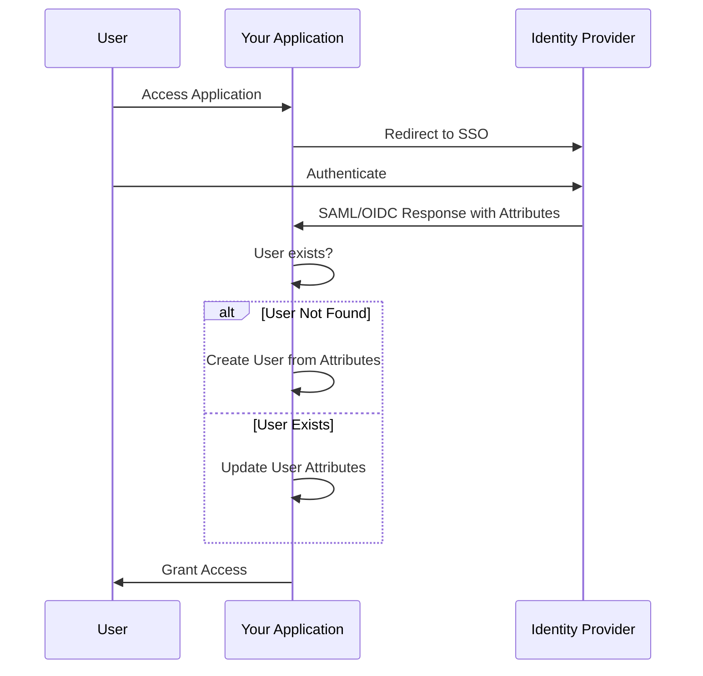
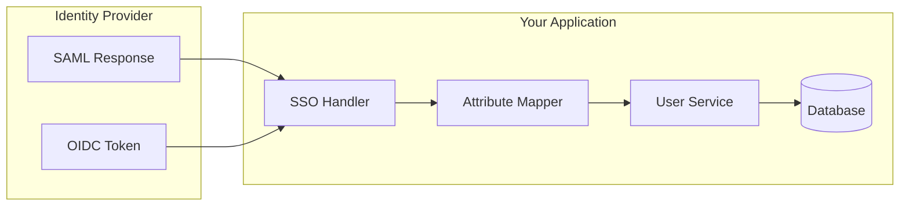

# How to Build Just-In-Time Provisioning

Author: [nawazdhandala](https://github.com/nawazdhandala)

Tags: Security, JIT Provisioning, SSO, Identity

Description: Learn to build just-in-time provisioning for automatic user creation during first login.

---

Managing user accounts manually is tedious and error-prone. When someone joins your organization, an admin creates their account. When they leave, another admin (hopefully) remembers to delete it. Just-In-Time (JIT) provisioning eliminates this overhead by creating user accounts automatically when users first authenticate through your identity provider.

## What is Just-In-Time Provisioning?

JIT provisioning creates user accounts on-demand during the SSO authentication flow. When a user logs in via SAML or OIDC for the first time, your application receives identity attributes from the IdP and automatically creates a local user record.



## Benefits of JIT Provisioning

| Manual Provisioning | JIT Provisioning |
|---------------------|------------------|
| Admin creates accounts before user can access | Users get access immediately on first login |
| Attributes become stale over time | Attributes update on every login |
| Orphaned accounts when offboarding is missed | Access revoked when IdP removes user |
| IT ticket required for new employee setup | Zero IT involvement for standard access |

## Architecture Overview

A JIT provisioning system needs three components: an SSO handler to process IdP responses, an attribute mapper to translate claims into user properties, and a user service to create or update records.



## Implementation Guide

### Step 1: Define Your User Schema

Start by defining what user attributes your application needs. Most applications require a subset of standard claims.

```typescript
// types/user.ts
interface JITUserAttributes {
  // Required - unique identifier from IdP
  externalId: string;

  // Standard claims
  email: string;
  firstName: string;
  lastName: string;

  // Optional claims
  department?: string;
  jobTitle?: string;
  groups?: string[];

  // Metadata
  identityProvider: string;
  lastLoginAt: Date;
}

interface User extends JITUserAttributes {
  id: string;
  createdAt: Date;
  updatedAt: Date;
  isActive: boolean;
}
```

### Step 2: Build the Attribute Mapper

The attribute mapper translates IdP-specific claim names into your application's user schema. Different IdPs use different claim names for the same data.

```typescript
// services/attributeMapper.ts
type ClaimMapping = Record<string, string>;

// Common claim mappings for popular IdPs
const CLAIM_MAPPINGS: Record<string, ClaimMapping> = {
  okta: {
    'sub': 'externalId',
    'email': 'email',
    'given_name': 'firstName',
    'family_name': 'lastName',
    'groups': 'groups',
  },
  azure: {
    'oid': 'externalId',
    'preferred_username': 'email',
    'given_name': 'firstName',
    'surname': 'lastName',
    'groups': 'groups',
  },
  google: {
    'sub': 'externalId',
    'email': 'email',
    'given_name': 'firstName',
    'family_name': 'lastName',
  },
};

export function mapAttributes(
  claims: Record<string, unknown>,
  provider: string
): JITUserAttributes {
  const mapping = CLAIM_MAPPINGS[provider];

  if (!mapping) {
    throw new Error(`Unknown identity provider: ${provider}`);
  }

  const mapped: Partial<JITUserAttributes> = {
    identityProvider: provider,
    lastLoginAt: new Date(),
  };

  // Apply the mapping
  for (const [claimName, fieldName] of Object.entries(mapping)) {
    if (claims[claimName] !== undefined) {
      mapped[fieldName as keyof JITUserAttributes] = claims[claimName];
    }
  }

  // Validate required fields
  if (!mapped.externalId || !mapped.email) {
    throw new Error('Missing required claims: externalId or email');
  }

  return mapped as JITUserAttributes;
}
```

### Step 3: Implement the User Service

The user service handles the core JIT logic: check if the user exists, create them if not, and update their attributes on subsequent logins.

```typescript
// services/userService.ts
import { db } from './database';
import { mapAttributes } from './attributeMapper';

export class UserService {

  // Main JIT provisioning method
  async provisionUser(
    claims: Record<string, unknown>,
    provider: string
  ): Promise<User> {
    const attributes = mapAttributes(claims, provider);

    // Try to find existing user by external ID
    let user = await this.findByExternalId(
      attributes.externalId,
      provider
    );

    if (user) {
      // User exists - update their attributes
      user = await this.updateUser(user.id, attributes);
      console.log(`JIT: Updated existing user ${user.email}`);
    } else {
      // New user - create account
      user = await this.createUser(attributes);
      console.log(`JIT: Created new user ${user.email}`);
    }

    return user;
  }

  private async findByExternalId(
    externalId: string,
    provider: string
  ): Promise<User | null> {
    return db.users.findFirst({
      where: {
        externalId,
        identityProvider: provider,
      },
    });
  }

  private async createUser(
    attributes: JITUserAttributes
  ): Promise<User> {
    return db.users.create({
      data: {
        ...attributes,
        isActive: true,
        createdAt: new Date(),
        updatedAt: new Date(),
      },
    });
  }

  private async updateUser(
    id: string,
    attributes: Partial<JITUserAttributes>
  ): Promise<User> {
    return db.users.update({
      where: { id },
      data: {
        ...attributes,
        updatedAt: new Date(),
      },
    });
  }
}
```

### Step 4: Integrate with SSO Handler

Wire the user service into your SSO callback handler. This example uses Passport.js with OIDC, but the pattern works with any SSO library.

```typescript
// auth/ssoHandler.ts
import passport from 'passport';
import { Strategy as OIDCStrategy } from 'passport-openidconnect';
import { UserService } from '../services/userService';

const userService = new UserService();

passport.use('oidc', new OIDCStrategy({
    issuer: process.env.OIDC_ISSUER,
    authorizationURL: process.env.OIDC_AUTH_URL,
    tokenURL: process.env.OIDC_TOKEN_URL,
    userInfoURL: process.env.OIDC_USERINFO_URL,
    clientID: process.env.OIDC_CLIENT_ID,
    clientSecret: process.env.OIDC_CLIENT_SECRET,
    callbackURL: '/auth/callback',
    scope: ['openid', 'profile', 'email', 'groups'],
  },
  async (issuer, profile, done) => {
    try {
      // Extract claims from the profile
      const claims = {
        sub: profile.id,
        email: profile.emails?.[0]?.value,
        given_name: profile.name?.givenName,
        family_name: profile.name?.familyName,
        groups: profile._json?.groups,
      };

      // Determine provider from issuer
      const provider = detectProvider(issuer);

      // JIT provision the user
      const user = await userService.provisionUser(claims, provider);

      return done(null, user);
    } catch (error) {
      return done(error, null);
    }
  }
));

function detectProvider(issuer: string): string {
  if (issuer.includes('okta.com')) return 'okta';
  if (issuer.includes('login.microsoftonline')) return 'azure';
  if (issuer.includes('accounts.google')) return 'google';
  return 'unknown';
}
```

### Step 5: Handle Group-Based Role Assignment

Many organizations map IdP groups to application roles. Add this logic to your attribute mapper.

```typescript
// services/roleMapper.ts
type RoleMapping = Record<string, string>;

const GROUP_TO_ROLE: RoleMapping = {
  'engineering': 'developer',
  'engineering-leads': 'admin',
  'support': 'viewer',
  'executives': 'admin',
};

export function mapGroupsToRoles(groups: string[]): string[] {
  const roles = new Set<string>();

  for (const group of groups) {
    // Normalize group name (lowercase, handle prefixes)
    const normalizedGroup = group.toLowerCase().replace(/^grp-/, '');

    const role = GROUP_TO_ROLE[normalizedGroup];
    if (role) {
      roles.add(role);
    }
  }

  // Default role if no matches
  if (roles.size === 0) {
    roles.add('viewer');
  }

  return Array.from(roles);
}
```

## Security Considerations

JIT provisioning requires careful handling to avoid security issues.

### Validate the IdP Response

Always verify that the SSO response comes from a trusted identity provider. Check the issuer, validate signatures, and reject expired tokens.

```typescript
// Verify the OIDC token before processing
function validateToken(token: string, expectedIssuer: string): boolean {
  const decoded = jwt.decode(token, { complete: true });

  // Check issuer matches configuration
  if (decoded.payload.iss !== expectedIssuer) {
    throw new Error('Token issuer mismatch');
  }

  // Check token is not expired
  if (decoded.payload.exp < Date.now() / 1000) {
    throw new Error('Token expired');
  }

  return true;
}
```

### Restrict Domain Access

Limit which email domains can be provisioned to prevent unauthorized access.

```typescript
const ALLOWED_DOMAINS = ['yourcompany.com', 'subsidiary.com'];

function validateEmailDomain(email: string): boolean {
  const domain = email.split('@')[1];
  return ALLOWED_DOMAINS.includes(domain);
}
```

### Log Provisioning Events

Keep an audit trail of all provisioning activity for security review.

```typescript
async function logProvisioningEvent(
  action: 'created' | 'updated',
  user: User,
  claims: Record<string, unknown>
): Promise<void> {
  await db.auditLogs.create({
    data: {
      eventType: `user.jit.${action}`,
      userId: user.id,
      email: user.email,
      provider: user.identityProvider,
      timestamp: new Date(),
      // Store claims for debugging (exclude sensitive data)
      metadata: JSON.stringify({
        groups: claims.groups,
        department: claims.department,
      }),
    },
  });
}
```

## Summary

JIT provisioning removes the friction of manual account creation while keeping user attributes synchronized with your identity provider. The implementation involves mapping IdP claims to your user schema, creating or updating users during SSO callbacks, and applying proper security controls.

| Component | Purpose |
|-----------|---------|
| Attribute Mapper | Translates IdP claims to user fields |
| User Service | Creates and updates user records |
| SSO Handler | Processes IdP responses and triggers provisioning |
| Role Mapper | Converts IdP groups to application roles |
| Audit Logger | Records provisioning events for security review |

With JIT provisioning in place, your users get immediate access through SSO while your IT team can focus on higher-value work than clicking through account creation forms.

**Related Reading:**

- [SSO Is a Security Basic, Not an Enterprise Perk](https://oneuptime.com/blog/post/2025-08-19-sso-is-a-security-basic-not-an-enterprise-perk/view)
- [Secure Your Status Page: Authentication Options](https://oneuptime.com/blog/post/2025-11-20-secure-your-status-page-authentication-options/view)
