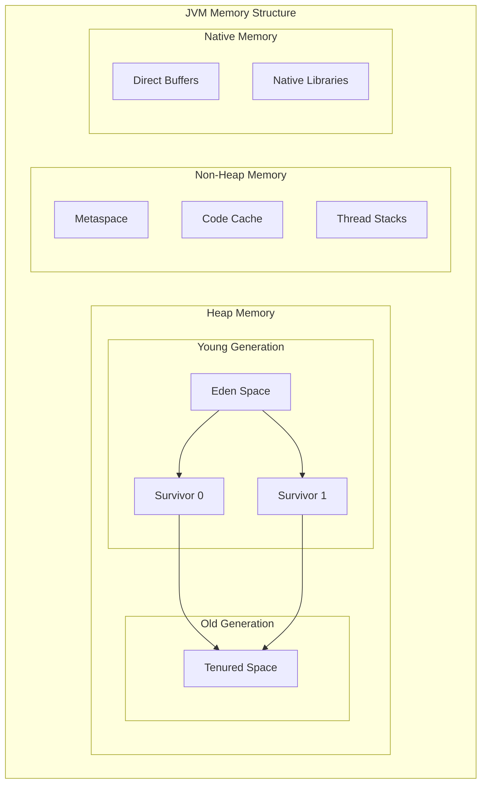
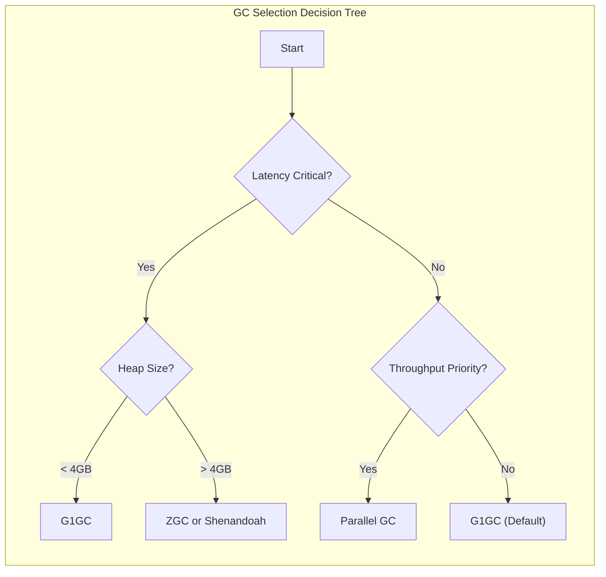
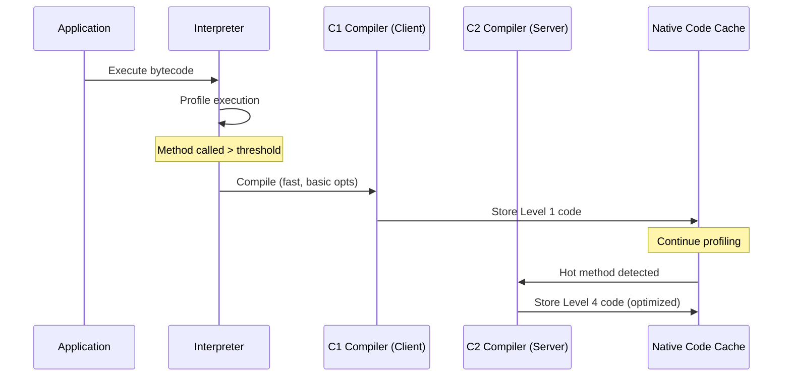

# How to Implement JVM Tuning Strategies

Author: [nawazdhandala](https://github.com/nawazdhandala)

Tags: Java, JVM, Performance, Tuning

Description: A comprehensive guide to optimizing Java applications through effective JVM tuning strategies for improved performance and resource utilization.

---

## Introduction

Java Virtual Machine (JVM) tuning is essential for optimizing the performance of Java applications. Whether you are running microservices, large enterprise applications, or data-intensive workloads, understanding how to configure the JVM can significantly impact throughput, latency, and resource efficiency. This guide covers the fundamental concepts and practical strategies for tuning your JVM.

## JVM Memory Model Overview

The JVM memory model is divided into several distinct regions, each serving a specific purpose. Understanding these regions is crucial for effective tuning.

### Memory Regions

1. **Heap Memory**: The primary area where objects are allocated. It is divided into Young Generation and Old Generation.
2. **Metaspace**: Stores class metadata (replaced PermGen in Java 8+).
3. **Stack Memory**: Each thread has its own stack for method calls and local variables.
4. **Code Cache**: Stores compiled native code generated by the JIT compiler.
5. **Native Memory**: Used for direct buffers and native libraries.

### JVM Memory Architecture Diagram



## Heap Sizing Strategies

Proper heap sizing is one of the most impactful tuning decisions you can make.

### Initial and Maximum Heap Size

```bash
# Set initial and maximum heap size to 4GB
java -Xms4g -Xmx4g -jar application.jar

# For containerized environments, use percentage-based sizing
java -XX:InitialRAMPercentage=50.0 -XX:MaxRAMPercentage=75.0 -jar application.jar
```

### Young Generation Sizing

The Young Generation size affects minor GC frequency and promotion rates.

```bash
# Set Young Generation size explicitly
java -Xms4g -Xmx4g -Xmn1g -jar application.jar

# Or use a ratio (Young = Heap / (NewRatio + 1))
java -Xms4g -Xmx4g -XX:NewRatio=2 -jar application.jar
```

### Heap Sizing Guidelines

| Workload Type | Initial Heap | Max Heap | Young Gen Ratio |
|---------------|--------------|----------|-----------------|
| Web Services  | 25% of RAM   | 50% of RAM | 1/3 of heap    |
| Batch Processing | 50% of RAM | 75% of RAM | 1/4 of heap   |
| In-Memory Cache | 60% of RAM | 80% of RAM | 1/8 of heap    |
| Microservices | Container limit based | Container limit based | Default |

### Practical Example: Heap Configuration for a Web Application

```java
/**
 * Sample configuration for a Spring Boot web application
 * Recommended JVM flags:
 * java -Xms2g -Xmx2g -XX:NewRatio=2 -XX:SurvivorRatio=8 -jar app.jar
 */
public class HeapMonitoringExample {

    public static void printHeapStatistics() {
        Runtime runtime = Runtime.getRuntime();

        // Get memory values in MB
        long maxMemory = runtime.maxMemory() / (1024 * 1024);
        long totalMemory = runtime.totalMemory() / (1024 * 1024);
        long freeMemory = runtime.freeMemory() / (1024 * 1024);
        long usedMemory = totalMemory - freeMemory;

        System.out.println("=== Heap Statistics ===");
        System.out.println("Max Memory (Xmx): " + maxMemory + " MB");
        System.out.println("Total Memory (Current Heap): " + totalMemory + " MB");
        System.out.println("Used Memory: " + usedMemory + " MB");
        System.out.println("Free Memory: " + freeMemory + " MB");
        System.out.println("Utilization: " + (usedMemory * 100 / totalMemory) + "%");
    }

    public static void main(String[] args) {
        // Print initial statistics
        printHeapStatistics();

        // Simulate memory allocation
        java.util.List<byte[]> allocations = new java.util.ArrayList<>();
        for (int i = 0; i < 100; i++) {
            // Allocate 10MB chunks
            allocations.add(new byte[10 * 1024 * 1024]);
            if (i % 10 == 0) {
                printHeapStatistics();
            }
        }
    }
}
```

## Garbage Collection Algorithm Selection

Choosing the right GC algorithm depends on your application requirements.

### GC Algorithm Comparison



### G1 Garbage Collector (Recommended Default)

G1GC is the default collector since Java 9 and provides a good balance between throughput and latency.

```bash
# Enable G1GC with tuning options
java -XX:+UseG1GC \
     -XX:MaxGCPauseMillis=200 \
     -XX:G1HeapRegionSize=16m \
     -XX:G1ReservePercent=10 \
     -XX:InitiatingHeapOccupancyPercent=45 \
     -jar application.jar
```

```java
/**
 * G1GC Tuning Example
 *
 * G1GC divides the heap into regions and collects the regions
 * with the most garbage first (Garbage First).
 *
 * Key tuning parameters:
 * - MaxGCPauseMillis: Target pause time (default 200ms)
 * - G1HeapRegionSize: Region size (1MB to 32MB, auto-calculated)
 * - InitiatingHeapOccupancyPercent: When to start concurrent marking
 */
public class G1GCTuningExample {

    // Configure these based on your pause time requirements
    private static final int TARGET_PAUSE_MS = 100;
    private static final int REGION_SIZE_MB = 16;

    public static void main(String[] args) {
        // Verify G1GC is being used
        java.util.List<java.lang.management.GarbageCollectorMXBean> gcBeans =
            java.lang.management.ManagementFactory.getGarbageCollectorMXBeans();

        System.out.println("Active Garbage Collectors:");
        for (java.lang.management.GarbageCollectorMXBean gc : gcBeans) {
            System.out.println("  - " + gc.getName());
            System.out.println("    Collection count: " + gc.getCollectionCount());
            System.out.println("    Collection time: " + gc.getCollectionTime() + "ms");
        }
    }
}
```

### ZGC for Low Latency Applications

ZGC is designed for applications requiring sub-millisecond pause times.

```bash
# Enable ZGC (Java 15+)
java -XX:+UseZGC \
     -XX:ZCollectionInterval=5 \
     -XX:ZAllocationSpikeTolerance=2.0 \
     -Xms8g -Xmx8g \
     -jar application.jar

# For Java 21+, use Generational ZGC
java -XX:+UseZGC -XX:+ZGenerational \
     -Xms8g -Xmx8g \
     -jar application.jar
```

### Parallel GC for Throughput

When maximum throughput is the priority over latency.

```bash
# Enable Parallel GC with tuning
java -XX:+UseParallelGC \
     -XX:ParallelGCThreads=8 \
     -XX:GCTimeRatio=19 \
     -XX:MaxGCPauseMillis=500 \
     -jar application.jar
```

## JIT Compiler Tuning

The Just-In-Time compiler converts bytecode to native machine code at runtime.

### JIT Compilation Workflow



### Tiered Compilation Settings

```bash
# Enable tiered compilation (default in modern JVMs)
java -XX:+TieredCompilation \
     -XX:TieredStopAtLevel=4 \
     -XX:CompileThreshold=10000 \
     -jar application.jar

# For faster startup (stop at C1)
java -XX:TieredStopAtLevel=1 -jar application.jar

# Disable tiered compilation for pure C2
java -XX:-TieredCompilation -jar application.jar
```

### Code Cache Tuning

```bash
# Increase code cache for large applications
java -XX:ReservedCodeCacheSize=512m \
     -XX:InitialCodeCacheSize=128m \
     -XX:CodeCacheExpansionSize=64k \
     -jar application.jar
```

```java
/**
 * JIT Compilation Monitoring Example
 *
 * Run with: java -XX:+PrintCompilation JITMonitorExample
 *
 * Compilation levels:
 * 0 - Interpreter
 * 1 - C1 with full optimization
 * 2 - C1 with limited profiling
 * 3 - C1 with full profiling
 * 4 - C2 with full optimization
 */
public class JITMonitorExample {

    // This method will be compiled by JIT after threshold invocations
    public static long computeSum(int iterations) {
        long sum = 0;
        for (int i = 0; i < iterations; i++) {
            sum += i;
        }
        return sum;
    }

    public static void main(String[] args) {
        System.out.println("Warming up JIT compiler...");

        // Warm up phase to trigger JIT compilation
        for (int i = 0; i < 100000; i++) {
            computeSum(100);
        }

        System.out.println("Warm up complete. Running benchmark...");

        // Measure performance after JIT compilation
        long startTime = System.nanoTime();
        long result = computeSum(1000000);
        long endTime = System.nanoTime();

        System.out.println("Result: " + result);
        System.out.println("Time: " + (endTime - startTime) / 1_000_000.0 + " ms");
    }
}
```

### Inlining Configuration

```bash
# Adjust inlining thresholds for better optimization
java -XX:MaxInlineSize=100 \
     -XX:FreqInlineSize=500 \
     -XX:InlineSmallCode=2000 \
     -jar application.jar
```

## Practical Tuning Profiles

### Profile 1: Low Latency Web Service

```bash
#!/bin/bash
# low-latency-profile.sh

java \
  -Xms4g -Xmx4g \
  -XX:+UseZGC \
  -XX:+ZGenerational \
  -XX:SoftMaxHeapSize=3500m \
  -XX:+AlwaysPreTouch \
  -XX:+UseNUMA \
  -XX:+DisableExplicitGC \
  -XX:+PerfDisableSharedMem \
  -Xlog:gc*:file=gc.log:time,uptime:filecount=5,filesize=10m \
  -jar application.jar
```

### Profile 2: High Throughput Batch Processing

```bash
#!/bin/bash
# throughput-profile.sh

java \
  -Xms8g -Xmx8g \
  -XX:+UseParallelGC \
  -XX:ParallelGCThreads=8 \
  -XX:GCTimeRatio=99 \
  -XX:+UseStringDeduplication \
  -XX:+UseCompressedOops \
  -XX:+OptimizeStringConcat \
  -XX:ReservedCodeCacheSize=512m \
  -Xlog:gc*:file=gc.log:time,uptime:filecount=5,filesize=10m \
  -jar batch-application.jar
```

### Profile 3: Container Optimized

```bash
#!/bin/bash
# container-profile.sh

java \
  -XX:+UseContainerSupport \
  -XX:InitialRAMPercentage=50.0 \
  -XX:MaxRAMPercentage=75.0 \
  -XX:+UseG1GC \
  -XX:MaxGCPauseMillis=100 \
  -XX:+UseStringDeduplication \
  -XX:+ExitOnOutOfMemoryError \
  -Xlog:gc*:file=/var/log/gc.log:time,uptime:filecount=3,filesize=5m \
  -jar application.jar
```

## Monitoring and Diagnostics

### Enable GC Logging

```bash
# Modern GC logging (Java 9+)
java -Xlog:gc*=info:file=gc.log:time,uptime,level,tags:filecount=5,filesize=10m \
     -jar application.jar

# Detailed GC logging for analysis
java -Xlog:gc*=debug:file=gc-debug.log:time,uptime,level,tags \
     -Xlog:gc+heap=trace:file=gc-heap.log:time,uptime \
     -jar application.jar
```

### JMX Monitoring Setup

```java
/**
 * JMX Memory Monitoring Example
 *
 * Enable JMX with:
 * -Dcom.sun.management.jmxremote
 * -Dcom.sun.management.jmxremote.port=9090
 * -Dcom.sun.management.jmxremote.authenticate=false
 * -Dcom.sun.management.jmxremote.ssl=false
 */
import java.lang.management.*;
import java.util.List;

public class JMXMemoryMonitor {

    public static void monitorMemoryPools() {
        List<MemoryPoolMXBean> pools = ManagementFactory.getMemoryPoolMXBeans();

        System.out.println("=== Memory Pool Statistics ===");
        for (MemoryPoolMXBean pool : pools) {
            MemoryUsage usage = pool.getUsage();
            System.out.println("\nPool: " + pool.getName());
            System.out.println("  Type: " + pool.getType());
            System.out.println("  Init: " + formatBytes(usage.getInit()));
            System.out.println("  Used: " + formatBytes(usage.getUsed()));
            System.out.println("  Committed: " + formatBytes(usage.getCommitted()));
            System.out.println("  Max: " + formatBytes(usage.getMax()));
        }
    }

    public static void monitorGCActivity() {
        List<GarbageCollectorMXBean> gcs = ManagementFactory.getGarbageCollectorMXBeans();

        System.out.println("\n=== GC Statistics ===");
        for (GarbageCollectorMXBean gc : gcs) {
            System.out.println("\nCollector: " + gc.getName());
            System.out.println("  Collection Count: " + gc.getCollectionCount());
            System.out.println("  Collection Time: " + gc.getCollectionTime() + " ms");
            System.out.println("  Memory Pools: " + String.join(", ", gc.getMemoryPoolNames()));
        }
    }

    private static String formatBytes(long bytes) {
        if (bytes < 0) return "N/A";
        if (bytes < 1024) return bytes + " B";
        if (bytes < 1024 * 1024) return String.format("%.2f KB", bytes / 1024.0);
        if (bytes < 1024 * 1024 * 1024) return String.format("%.2f MB", bytes / (1024.0 * 1024));
        return String.format("%.2f GB", bytes / (1024.0 * 1024 * 1024));
    }

    public static void main(String[] args) throws InterruptedException {
        while (true) {
            monitorMemoryPools();
            monitorGCActivity();
            System.out.println("\n--- Sleeping for 10 seconds ---\n");
            Thread.sleep(10000);
        }
    }
}
```

## Common Tuning Mistakes to Avoid

1. **Setting Xms different from Xmx**: This causes heap resizing overhead. Set them equal for production workloads.

2. **Ignoring container limits**: Always use `-XX:+UseContainerSupport` and RAM percentage flags in containers.

3. **Over-tuning GC parameters**: Start with defaults and adjust based on metrics, not assumptions.

4. **Neglecting metaspace**: Large applications with many classes may need explicit metaspace tuning.

5. **Disabling ergonomics**: Let the JVM auto-tune unless you have specific requirements.

## Summary

Effective JVM tuning requires understanding your application's workload characteristics and choosing appropriate configurations. Start with these key recommendations:

1. **Set heap size appropriately**: Use `-Xms` equal to `-Xmx` for predictable performance
2. **Choose the right GC**: G1GC for balanced workloads, ZGC for low latency, Parallel GC for throughput
3. **Enable monitoring**: Always configure GC logging and JMX for production systems
4. **Test changes**: Benchmark before and after tuning changes
5. **Iterate gradually**: Make one change at a time and measure the impact

Remember that the best configuration depends on your specific use case. Use profiling tools like JFR (Java Flight Recorder), async-profiler, or VisualVM to understand your application's behavior before making tuning decisions.
