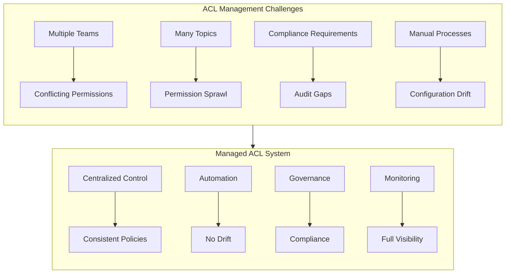
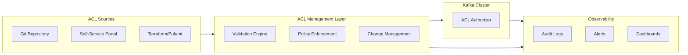
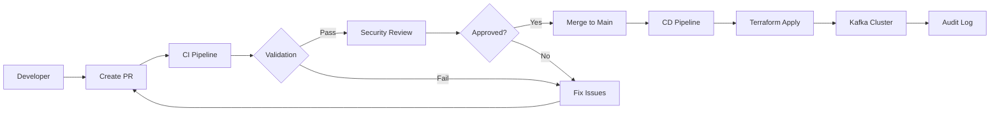
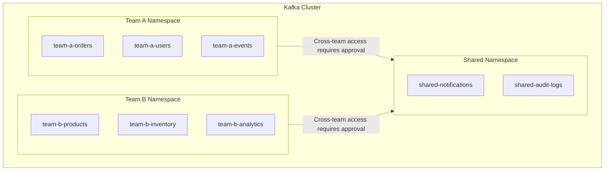
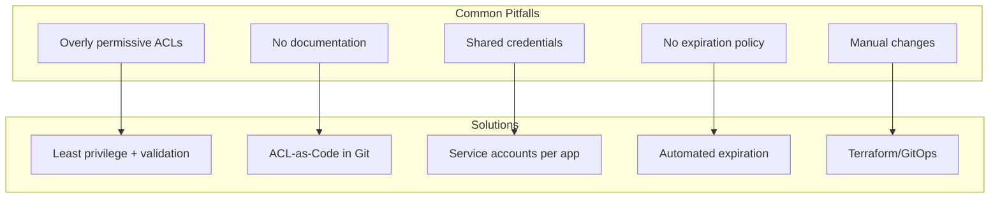

# How to Create Kafka ACL Management

Author: [nawazdhandala](https://github.com/nawazdhandala)

Tags: Kafka, Security, ACL, Authorization

Description: A comprehensive guide to building a Kafka ACL management system, covering lifecycle management, automation with Infrastructure-as-Code, multi-tenant governance, and monitoring strategies.

---

Managing Kafka ACLs at scale requires more than knowing the CLI commands. You need a systematic approach to handle ACL lifecycle, automate provisioning, enforce governance policies, and maintain audit trails. This guide shows you how to build a production-grade ACL management system.

## The ACL Management Challenge

As Kafka deployments grow, ACL management becomes increasingly complex.



### Why You Need ACL Management

| Problem | Impact | Solution |
|---------|--------|----------|
| Manual ACL creation | Slow onboarding, errors | Automated provisioning |
| No documentation | Unknown access patterns | ACL-as-Code with Git |
| Permission creep | Security vulnerabilities | Regular access reviews |
| No audit trail | Compliance failures | Change tracking |

## Designing an ACL Management System

A well-designed ACL management system has four core components.



## ACL Lifecycle Management

### Phase 1: Request and Approval

Define a clear process for ACL requests.

```yaml
# acl-request.yaml
apiVersion: kafka.acl/v1
kind: AclRequest
metadata:
  name: order-service-producer
  requestedBy: platform-team
  approvers:
    - security-team
    - kafka-admins
spec:
  principal: User:order-service
  environment: production
  permissions:
    - resource:
        type: topic
        name: orders
        patternType: literal
      operations:
        - Write
        - Describe
      justification: "Order service needs to publish order events"
    - resource:
        type: topic
        name: orders-dlq
        patternType: literal
      operations:
        - Write
      justification: "Dead letter queue for failed messages"
  expiresAt: "2027-01-30"
  reviewDate: "2026-07-30"
```

### Phase 2: Validation

Validate requests against policies before applying.

```python
# acl_validator.py
from dataclasses import dataclass
from typing import List, Optional
from enum import Enum
import re

class ResourceType(Enum):
    TOPIC = "topic"
    GROUP = "group"
    CLUSTER = "cluster"
    TRANSACTIONAL_ID = "transactional_id"

class Operation(Enum):
    READ = "Read"
    WRITE = "Write"
    CREATE = "Create"
    DELETE = "Delete"
    ALTER = "Alter"
    DESCRIBE = "Describe"
    ALL = "All"

@dataclass
class AclRequest:
    principal: str
    resource_type: ResourceType
    resource_name: str
    operations: List[Operation]
    environment: str
    justification: str
    expires_at: Optional[str] = None

@dataclass
class ValidationResult:
    valid: bool
    errors: List[str]
    warnings: List[str]

class AclValidator:
    def __init__(self, policies: dict):
        self.policies = policies
        self.restricted_topics = policies.get("restricted_topics", [])
        self.allowed_operations = policies.get("allowed_operations", {})
        self.naming_patterns = policies.get("naming_patterns", {})

    def validate(self, request: AclRequest) -> ValidationResult:
        errors = []
        warnings = []

        # Check principal naming convention
        if not self._validate_principal_name(request.principal):
            errors.append(
                f"Principal '{request.principal}' does not match naming convention"
            )

        # Check restricted topics
        if request.resource_name in self.restricted_topics:
            errors.append(
                f"Topic '{request.resource_name}' is restricted. "
                "Contact security team for access."
            )

        # Check operation restrictions
        env_ops = self.allowed_operations.get(request.environment, [])
        for op in request.operations:
            if op.value not in env_ops and Operation.ALL.value not in env_ops:
                errors.append(
                    f"Operation '{op.value}' not allowed in {request.environment}"
                )

        # Check for overly permissive requests
        if Operation.ALL in request.operations:
            warnings.append(
                "ALL operation is overly permissive. "
                "Consider specifying exact operations."
            )

        # Check wildcard usage
        if request.resource_name == "*":
            errors.append(
                "Wildcard resource names are not allowed. "
                "Use prefixed patterns instead."
            )

        # Check expiration
        if not request.expires_at:
            warnings.append(
                "No expiration date set. "
                "Consider setting an expiration for temporary access."
            )

        # Validate justification
        if len(request.justification) < 20:
            errors.append(
                "Justification must be at least 20 characters"
            )

        return ValidationResult(
            valid=len(errors) == 0,
            errors=errors,
            warnings=warnings
        )

    def _validate_principal_name(self, principal: str) -> bool:
        pattern = self.naming_patterns.get("principal", r"^User:[a-z][a-z0-9-]+$")
        return bool(re.match(pattern, principal))


# Example usage
if __name__ == "__main__":
    policies = {
        "restricted_topics": ["__consumer_offsets", "customer-pii"],
        "allowed_operations": {
            "production": ["Read", "Write", "Describe"],
            "development": ["Read", "Write", "Create", "Delete", "Describe"]
        },
        "naming_patterns": {
            "principal": r"^User:[a-z][a-z0-9-]+$"
        }
    }

    validator = AclValidator(policies)

    request = AclRequest(
        principal="User:order-service",
        resource_type=ResourceType.TOPIC,
        resource_name="orders",
        operations=[Operation.WRITE, Operation.DESCRIBE],
        environment="production",
        justification="Order service publishes order events to this topic"
    )

    result = validator.validate(request)
    print(f"Valid: {result.valid}")
    print(f"Errors: {result.errors}")
    print(f"Warnings: {result.warnings}")
```

### Phase 3: Provisioning

Apply validated ACLs to the cluster.

```python
# acl_provisioner.py
from confluent_kafka.admin import (
    AdminClient,
    AclBinding,
    AclBindingFilter,
    ResourceType,
    ResourcePatternType,
    AclOperation,
    AclPermissionType
)
from typing import List, Dict, Any
import logging

logging.basicConfig(level=logging.INFO)
logger = logging.getLogger(__name__)

class AclProvisioner:
    def __init__(self, config: Dict[str, Any]):
        self.admin = AdminClient(config)

    def create_acls(self, acl_bindings: List[AclBinding]) -> Dict[str, Any]:
        """Create multiple ACLs in a single operation."""
        results = {"success": [], "failed": []}

        try:
            futures = self.admin.create_acls(acl_bindings)

            for acl, future in futures.items():
                try:
                    future.result()
                    results["success"].append(str(acl))
                    logger.info(f"Created ACL: {acl}")
                except Exception as e:
                    results["failed"].append({"acl": str(acl), "error": str(e)})
                    logger.error(f"Failed to create ACL {acl}: {e}")

        except Exception as e:
            logger.error(f"Batch ACL creation failed: {e}")
            raise

        return results

    def delete_acls(self, filters: List[AclBindingFilter]) -> Dict[str, Any]:
        """Delete ACLs matching the given filters."""
        results = {"deleted": [], "failed": []}

        try:
            futures = self.admin.delete_acls(filters)

            for filter_obj, future in futures.items():
                try:
                    deleted = future.result()
                    results["deleted"].extend([str(acl) for acl in deleted])
                    logger.info(f"Deleted {len(deleted)} ACLs matching {filter_obj}")
                except Exception as e:
                    results["failed"].append(
                        {"filter": str(filter_obj), "error": str(e)}
                    )
                    logger.error(f"Failed to delete ACLs: {e}")

        except Exception as e:
            logger.error(f"Batch ACL deletion failed: {e}")
            raise

        return results

    def list_acls(
        self,
        filter_obj: AclBindingFilter = None
    ) -> List[AclBinding]:
        """List all ACLs or those matching a filter."""
        if filter_obj is None:
            filter_obj = AclBindingFilter(
                ResourcePatternType.ANY,
                ResourceType.ANY,
                None,
                None,
                AclOperation.ANY,
                AclPermissionType.ANY
            )

        try:
            future = self.admin.describe_acls(filter_obj)
            return list(future.result())
        except Exception as e:
            logger.error(f"Failed to list ACLs: {e}")
            raise

    def sync_acls(
        self,
        desired_acls: List[AclBinding],
        dry_run: bool = True
    ) -> Dict[str, Any]:
        """Sync ACLs to match desired state."""
        current_acls = set(self.list_acls())
        desired_set = set(desired_acls)

        to_create = desired_set - current_acls
        to_delete = current_acls - desired_set

        result = {
            "to_create": [str(acl) for acl in to_create],
            "to_delete": [str(acl) for acl in to_delete],
            "unchanged": len(current_acls & desired_set),
            "dry_run": dry_run
        }

        if not dry_run:
            if to_create:
                self.create_acls(list(to_create))
            if to_delete:
                filters = [
                    AclBindingFilter(
                        acl.restype,
                        acl.resource_pattern_type,
                        acl.name,
                        acl.principal,
                        acl.operation,
                        acl.permission_type
                    )
                    for acl in to_delete
                ]
                self.delete_acls(filters)

        return result


def build_acl_binding(
    principal: str,
    resource_type: str,
    resource_name: str,
    pattern_type: str,
    operation: str,
    permission: str = "ALLOW",
    host: str = "*"
) -> AclBinding:
    """Helper function to build ACL bindings."""
    resource_types = {
        "topic": ResourceType.TOPIC,
        "group": ResourceType.GROUP,
        "cluster": ResourceType.CLUSTER,
        "transactional_id": ResourceType.TRANSACTIONAL_ID
    }

    pattern_types = {
        "literal": ResourcePatternType.LITERAL,
        "prefixed": ResourcePatternType.PREFIXED
    }

    operations = {
        "read": AclOperation.READ,
        "write": AclOperation.WRITE,
        "create": AclOperation.CREATE,
        "delete": AclOperation.DELETE,
        "alter": AclOperation.ALTER,
        "describe": AclOperation.DESCRIBE,
        "all": AclOperation.ALL
    }

    permissions = {
        "allow": AclPermissionType.ALLOW,
        "deny": AclPermissionType.DENY
    }

    return AclBinding(
        resource_types[resource_type.lower()],
        pattern_types[pattern_type.lower()],
        resource_name,
        principal,
        host,
        operations[operation.lower()],
        permissions[permission.lower()]
    )
```

### Phase 4: Expiration and Cleanup

Implement automatic ACL expiration.

```python
# acl_expiration_handler.py
import json
from datetime import datetime, timedelta
from typing import List, Dict, Any
import logging

logger = logging.getLogger(__name__)

class AclExpirationHandler:
    def __init__(self, provisioner, metadata_store):
        self.provisioner = provisioner
        self.metadata_store = metadata_store

    def check_expiring_acls(self, days_ahead: int = 30) -> List[Dict[str, Any]]:
        """Find ACLs expiring within the specified number of days."""
        expiring = []
        cutoff_date = datetime.now() + timedelta(days=days_ahead)

        all_acls = self.metadata_store.get_all_acls()

        for acl in all_acls:
            if acl.get("expires_at"):
                expires = datetime.fromisoformat(acl["expires_at"])
                if expires <= cutoff_date:
                    days_until = (expires - datetime.now()).days
                    expiring.append({
                        "acl": acl,
                        "expires_at": acl["expires_at"],
                        "days_until_expiration": days_until,
                        "owner": acl.get("owner"),
                        "principal": acl.get("principal")
                    })

        return sorted(expiring, key=lambda x: x["days_until_expiration"])

    def remove_expired_acls(self, dry_run: bool = True) -> Dict[str, Any]:
        """Remove ACLs that have passed their expiration date."""
        now = datetime.now()
        expired = []
        removed = []

        all_acls = self.metadata_store.get_all_acls()

        for acl in all_acls:
            if acl.get("expires_at"):
                expires = datetime.fromisoformat(acl["expires_at"])
                if expires < now:
                    expired.append(acl)

        if not dry_run:
            for acl in expired:
                try:
                    self.provisioner.delete_acl(acl)
                    self.metadata_store.mark_as_removed(acl["id"])
                    removed.append(acl)
                    logger.info(f"Removed expired ACL: {acl['principal']} on {acl['resource_name']}")
                except Exception as e:
                    logger.error(f"Failed to remove ACL: {e}")

        return {
            "expired_count": len(expired),
            "removed_count": len(removed),
            "expired_acls": expired,
            "dry_run": dry_run
        }

    def send_expiration_notifications(self, days_ahead: int = 14) -> None:
        """Send notifications for ACLs expiring soon."""
        expiring = self.check_expiring_acls(days_ahead)

        # Group by owner
        by_owner = {}
        for item in expiring:
            owner = item.get("owner", "unknown")
            if owner not in by_owner:
                by_owner[owner] = []
            by_owner[owner].append(item)

        for owner, acls in by_owner.items():
            self._send_notification(owner, acls)

    def _send_notification(self, owner: str, acls: List[Dict]) -> None:
        """Send notification to ACL owner."""
        message = f"The following Kafka ACLs are expiring soon:\n\n"
        for acl in acls:
            message += (
                f"- Principal: {acl['principal']}, "
                f"Resource: {acl['acl'].get('resource_name')}, "
                f"Expires in: {acl['days_until_expiration']} days\n"
            )
        message += "\nPlease review and renew if needed."

        logger.info(f"Notification for {owner}: {message}")
        # Integrate with your notification system (Slack, email, etc.)
```

## Infrastructure as Code for ACLs

### Terraform Provider

Use Terraform to manage ACLs declaratively.

```hcl
# providers.tf
terraform {
  required_providers {
    kafka = {
      source  = "Mongey/kafka"
      version = "~> 0.5"
    }
  }
}

provider "kafka" {
  bootstrap_servers = ["kafka-1:9092", "kafka-2:9092", "kafka-3:9092"]

  tls_enabled    = true
  sasl_username  = var.kafka_admin_username
  sasl_password  = var.kafka_admin_password
  sasl_mechanism = "scram-sha256"
}
```

```hcl
# variables.tf
variable "kafka_admin_username" {
  description = "Kafka admin username"
  type        = string
  sensitive   = true
}

variable "kafka_admin_password" {
  description = "Kafka admin password"
  type        = string
  sensitive   = true
}

variable "environment" {
  description = "Deployment environment"
  type        = string
  default     = "production"
}
```

```hcl
# acls.tf

# Order Service - Producer ACLs
resource "kafka_acl" "order_service_write_orders" {
  resource_name       = "orders"
  resource_type       = "Topic"
  resource_pattern_type = "Literal"
  principal           = "User:order-service"
  host                = "*"
  operation           = "Write"
  permission_type     = "Allow"
}

resource "kafka_acl" "order_service_describe_orders" {
  resource_name       = "orders"
  resource_type       = "Topic"
  resource_pattern_type = "Literal"
  principal           = "User:order-service"
  host                = "*"
  operation           = "Describe"
  permission_type     = "Allow"
}

# Order Service - Consumer ACLs
resource "kafka_acl" "order_service_read_inventory" {
  resource_name       = "inventory"
  resource_type       = "Topic"
  resource_pattern_type = "Literal"
  principal           = "User:order-service"
  host                = "*"
  operation           = "Read"
  permission_type     = "Allow"
}

resource "kafka_acl" "order_service_group" {
  resource_name       = "order-service-group"
  resource_type       = "Group"
  resource_pattern_type = "Literal"
  principal           = "User:order-service"
  host                = "*"
  operation           = "Read"
  permission_type     = "Allow"
}

# Analytics Service - Prefixed ACLs for multiple topics
resource "kafka_acl" "analytics_read_events" {
  resource_name       = "events-"
  resource_type       = "Topic"
  resource_pattern_type = "Prefixed"
  principal           = "User:analytics-service"
  host                = "*"
  operation           = "Read"
  permission_type     = "Allow"
}

resource "kafka_acl" "analytics_group" {
  resource_name       = "analytics-"
  resource_type       = "Group"
  resource_pattern_type = "Prefixed"
  principal           = "User:analytics-service"
  host                = "*"
  operation           = "Read"
  permission_type     = "Allow"
}
```

```hcl
# modules/service-acls/main.tf
# Reusable module for standard service ACLs

variable "service_name" {
  description = "Name of the service"
  type        = string
}

variable "topics_read" {
  description = "Topics the service can read from"
  type        = list(string)
  default     = []
}

variable "topics_write" {
  description = "Topics the service can write to"
  type        = list(string)
  default     = []
}

variable "consumer_groups" {
  description = "Consumer groups the service can use"
  type        = list(string)
  default     = []
}

# Read ACLs
resource "kafka_acl" "read" {
  for_each = toset(var.topics_read)

  resource_name       = each.value
  resource_type       = "Topic"
  resource_pattern_type = "Literal"
  principal           = "User:${var.service_name}"
  host                = "*"
  operation           = "Read"
  permission_type     = "Allow"
}

resource "kafka_acl" "read_describe" {
  for_each = toset(var.topics_read)

  resource_name       = each.value
  resource_type       = "Topic"
  resource_pattern_type = "Literal"
  principal           = "User:${var.service_name}"
  host                = "*"
  operation           = "Describe"
  permission_type     = "Allow"
}

# Write ACLs
resource "kafka_acl" "write" {
  for_each = toset(var.topics_write)

  resource_name       = each.value
  resource_type       = "Topic"
  resource_pattern_type = "Literal"
  principal           = "User:${var.service_name}"
  host                = "*"
  operation           = "Write"
  permission_type     = "Allow"
}

resource "kafka_acl" "write_describe" {
  for_each = toset(var.topics_write)

  resource_name       = each.value
  resource_type       = "Topic"
  resource_pattern_type = "Literal"
  principal           = "User:${var.service_name}"
  host                = "*"
  operation           = "Describe"
  permission_type     = "Allow"
}

# Consumer Group ACLs
resource "kafka_acl" "group" {
  for_each = toset(var.consumer_groups)

  resource_name       = each.value
  resource_type       = "Group"
  resource_pattern_type = "Literal"
  principal           = "User:${var.service_name}"
  host                = "*"
  operation           = "Read"
  permission_type     = "Allow"
}
```

```hcl
# main.tf - Using the module

module "order_service_acls" {
  source = "./modules/service-acls"

  service_name = "order-service"
  topics_read  = ["inventory", "pricing"]
  topics_write = ["orders", "orders-dlq"]
  consumer_groups = ["order-service-group"]
}

module "notification_service_acls" {
  source = "./modules/service-acls"

  service_name = "notification-service"
  topics_read  = ["orders", "users"]
  topics_write = ["notifications", "notifications-dlq"]
  consumer_groups = ["notification-service-group"]
}

module "analytics_service_acls" {
  source = "./modules/service-acls"

  service_name = "analytics-service"
  topics_read  = ["orders", "inventory", "users", "notifications"]
  topics_write = ["analytics-aggregates"]
  consumer_groups = ["analytics-service-group"]
}
```

### GitOps Workflow

Implement GitOps for ACL management.



```yaml
# .github/workflows/kafka-acls.yml
name: Kafka ACL Management

on:
  pull_request:
    paths:
      - 'terraform/kafka-acls/**'
  push:
    branches:
      - main
    paths:
      - 'terraform/kafka-acls/**'

jobs:
  validate:
    runs-on: ubuntu-latest
    steps:
      - uses: actions/checkout@v4

      - name: Setup Terraform
        uses: hashicorp/setup-terraform@v3
        with:
          terraform_version: 1.6.0

      - name: Terraform Init
        working-directory: terraform/kafka-acls
        run: terraform init

      - name: Terraform Validate
        working-directory: terraform/kafka-acls
        run: terraform validate

      - name: Terraform Format Check
        working-directory: terraform/kafka-acls
        run: terraform fmt -check

  plan:
    needs: validate
    runs-on: ubuntu-latest
    if: github.event_name == 'pull_request'
    steps:
      - uses: actions/checkout@v4

      - name: Setup Terraform
        uses: hashicorp/setup-terraform@v3

      - name: Terraform Init
        working-directory: terraform/kafka-acls
        run: terraform init

      - name: Terraform Plan
        working-directory: terraform/kafka-acls
        run: terraform plan -no-color -out=tfplan
        env:
          TF_VAR_kafka_admin_username: ${{ secrets.KAFKA_ADMIN_USERNAME }}
          TF_VAR_kafka_admin_password: ${{ secrets.KAFKA_ADMIN_PASSWORD }}

      - name: Comment Plan on PR
        uses: actions/github-script@v7
        with:
          script: |
            const fs = require('fs');
            const plan = fs.readFileSync('terraform/kafka-acls/tfplan', 'utf8');
            github.rest.issues.createComment({
              issue_number: context.issue.number,
              owner: context.repo.owner,
              repo: context.repo.repo,
              body: '## Terraform Plan\n```\n' + plan + '\n```'
            });

  apply:
    needs: validate
    runs-on: ubuntu-latest
    if: github.event_name == 'push' && github.ref == 'refs/heads/main'
    environment: production
    steps:
      - uses: actions/checkout@v4

      - name: Setup Terraform
        uses: hashicorp/setup-terraform@v3

      - name: Terraform Init
        working-directory: terraform/kafka-acls
        run: terraform init

      - name: Terraform Apply
        working-directory: terraform/kafka-acls
        run: terraform apply -auto-approve
        env:
          TF_VAR_kafka_admin_username: ${{ secrets.KAFKA_ADMIN_USERNAME }}
          TF_VAR_kafka_admin_password: ${{ secrets.KAFKA_ADMIN_PASSWORD }}

      - name: Notify Slack
        uses: slackapi/slack-github-action@v1
        with:
          payload: |
            {
              "text": "Kafka ACLs updated in production",
              "blocks": [
                {
                  "type": "section",
                  "text": {
                    "type": "mrkdwn",
                    "text": "Kafka ACLs have been updated.\nCommit: ${{ github.sha }}\nAuthor: ${{ github.actor }}"
                  }
                }
              ]
            }
        env:
          SLACK_WEBHOOK_URL: ${{ secrets.SLACK_WEBHOOK_URL }}
```

## Multi-Tenant ACL Management

For organizations with multiple teams sharing Kafka clusters.

### Namespace-Based Isolation



### Team ACL Template

```python
# team_acl_manager.py
from dataclasses import dataclass, field
from typing import List, Dict, Set
import yaml

@dataclass
class TeamConfig:
    name: str
    prefix: str
    owners: List[str]
    members: List[str]
    allowed_shared_topics: List[str] = field(default_factory=list)

@dataclass
class TeamAclGenerator:
    team: TeamConfig
    environment: str

    def generate_producer_acls(self, service: str, topics: List[str]) -> List[Dict]:
        """Generate producer ACLs for a service."""
        acls = []
        principal = f"User:{self.team.prefix}-{service}"

        for topic in topics:
            # Validate topic belongs to team namespace
            if not self._is_allowed_topic(topic):
                raise ValueError(
                    f"Topic '{topic}' is not in team namespace '{self.team.prefix}' "
                    f"or allowed shared topics"
                )

            acls.append({
                "principal": principal,
                "resource_type": "topic",
                "resource_name": topic,
                "pattern_type": "literal",
                "operation": "Write",
                "permission": "Allow"
            })
            acls.append({
                "principal": principal,
                "resource_type": "topic",
                "resource_name": topic,
                "pattern_type": "literal",
                "operation": "Describe",
                "permission": "Allow"
            })

        return acls

    def generate_consumer_acls(
        self,
        service: str,
        topics: List[str],
        group: str
    ) -> List[Dict]:
        """Generate consumer ACLs for a service."""
        acls = []
        principal = f"User:{self.team.prefix}-{service}"

        # Validate consumer group belongs to team
        if not group.startswith(f"{self.team.prefix}-"):
            raise ValueError(
                f"Consumer group '{group}' must start with team prefix '{self.team.prefix}-'"
            )

        for topic in topics:
            if not self._is_allowed_topic(topic):
                raise ValueError(
                    f"Topic '{topic}' is not accessible to team '{self.team.name}'"
                )

            acls.append({
                "principal": principal,
                "resource_type": "topic",
                "resource_name": topic,
                "pattern_type": "literal",
                "operation": "Read",
                "permission": "Allow"
            })
            acls.append({
                "principal": principal,
                "resource_type": "topic",
                "resource_name": topic,
                "pattern_type": "literal",
                "operation": "Describe",
                "permission": "Allow"
            })

        # Consumer group ACL
        acls.append({
            "principal": principal,
            "resource_type": "group",
            "resource_name": group,
            "pattern_type": "literal",
            "operation": "Read",
            "permission": "Allow"
        })

        return acls

    def generate_team_admin_acls(self) -> List[Dict]:
        """Generate admin ACLs for team leads."""
        acls = []

        for owner in self.team.owners:
            principal = f"User:{owner}"

            # Allow managing topics with team prefix
            acls.append({
                "principal": principal,
                "resource_type": "topic",
                "resource_name": f"{self.team.prefix}-",
                "pattern_type": "prefixed",
                "operation": "All",
                "permission": "Allow"
            })

            # Allow managing consumer groups with team prefix
            acls.append({
                "principal": principal,
                "resource_type": "group",
                "resource_name": f"{self.team.prefix}-",
                "pattern_type": "prefixed",
                "operation": "All",
                "permission": "Allow"
            })

        return acls

    def _is_allowed_topic(self, topic: str) -> bool:
        """Check if topic is accessible to the team."""
        # Team's own namespace
        if topic.startswith(f"{self.team.prefix}-"):
            return True
        # Allowed shared topics
        if topic in self.team.allowed_shared_topics:
            return True
        # Shared namespace
        if topic.startswith("shared-"):
            return topic in self.team.allowed_shared_topics
        return False


def load_team_config(config_path: str) -> TeamConfig:
    """Load team configuration from YAML."""
    with open(config_path) as f:
        data = yaml.safe_load(f)

    return TeamConfig(
        name=data["name"],
        prefix=data["prefix"],
        owners=data["owners"],
        members=data["members"],
        allowed_shared_topics=data.get("allowed_shared_topics", [])
    )


# Example team configuration
EXAMPLE_CONFIG = """
name: Platform Team
prefix: platform
owners:
  - alice
  - bob
members:
  - charlie
  - diana
  - eve
allowed_shared_topics:
  - shared-notifications
  - shared-audit-logs
"""
```

## Monitoring and Alerting

### ACL Audit Events

```python
# acl_audit_collector.py
from dataclasses import dataclass
from datetime import datetime
from typing import Optional, List
import json
import logging

logger = logging.getLogger(__name__)

@dataclass
class AclAuditEvent:
    timestamp: datetime
    event_type: str  # created, deleted, modified
    principal: str
    resource_type: str
    resource_name: str
    operation: str
    permission: str
    actor: str  # Who made the change
    source: str  # terraform, api, manual
    metadata: Optional[dict] = None

    def to_dict(self) -> dict:
        return {
            "timestamp": self.timestamp.isoformat(),
            "event_type": self.event_type,
            "principal": self.principal,
            "resource_type": self.resource_type,
            "resource_name": self.resource_name,
            "operation": self.operation,
            "permission": self.permission,
            "actor": self.actor,
            "source": self.source,
            "metadata": self.metadata or {}
        }


class AclAuditCollector:
    def __init__(self, storage_backend, alert_manager):
        self.storage = storage_backend
        self.alerts = alert_manager

    def record_event(self, event: AclAuditEvent) -> None:
        """Record an ACL audit event."""
        # Store the event
        self.storage.store(event.to_dict())
        logger.info(f"Recorded ACL audit event: {event.event_type} - {event.principal}")

        # Check for alert conditions
        self._check_alerts(event)

    def _check_alerts(self, event: AclAuditEvent) -> None:
        """Check if event triggers any alerts."""
        # Alert on sensitive resource access
        sensitive_patterns = ["pii", "secret", "credential", "password"]
        for pattern in sensitive_patterns:
            if pattern in event.resource_name.lower():
                self.alerts.send_alert(
                    severity="high",
                    title="ACL change on sensitive resource",
                    message=(
                        f"ACL {event.event_type} for {event.principal} "
                        f"on {event.resource_name}"
                    ),
                    event=event.to_dict()
                )

        # Alert on wildcard permissions
        if event.operation == "All" or event.resource_name == "*":
            self.alerts.send_alert(
                severity="medium",
                title="Wildcard ACL created",
                message=(
                    f"Wildcard ACL {event.event_type}: {event.principal} "
                    f"has {event.operation} on {event.resource_name}"
                ),
                event=event.to_dict()
            )

        # Alert on out-of-hours changes
        if not self._is_business_hours(event.timestamp):
            self.alerts.send_alert(
                severity="low",
                title="ACL change outside business hours",
                message=f"ACL modified by {event.actor} at {event.timestamp}",
                event=event.to_dict()
            )

    def _is_business_hours(self, timestamp: datetime) -> bool:
        """Check if timestamp is within business hours."""
        hour = timestamp.hour
        weekday = timestamp.weekday()
        return weekday < 5 and 9 <= hour < 18

    def get_audit_report(
        self,
        start_date: datetime,
        end_date: datetime,
        principal: Optional[str] = None
    ) -> List[dict]:
        """Generate audit report for a time period."""
        filters = {
            "timestamp_start": start_date.isoformat(),
            "timestamp_end": end_date.isoformat()
        }
        if principal:
            filters["principal"] = principal

        events = self.storage.query(filters)

        return {
            "period": {
                "start": start_date.isoformat(),
                "end": end_date.isoformat()
            },
            "summary": {
                "total_events": len(events),
                "created": len([e for e in events if e["event_type"] == "created"]),
                "deleted": len([e for e in events if e["event_type"] == "deleted"]),
                "modified": len([e for e in events if e["event_type"] == "modified"])
            },
            "events": events
        }
```

### Prometheus Metrics

```python
# acl_metrics.py
from prometheus_client import Counter, Gauge, Histogram
import time

# ACL operation counters
acl_operations_total = Counter(
    'kafka_acl_operations_total',
    'Total number of ACL operations',
    ['operation', 'resource_type', 'status']
)

# Current ACL count
acl_count = Gauge(
    'kafka_acl_count',
    'Current number of ACLs',
    ['resource_type', 'permission_type']
)

# ACL by principal
acl_by_principal = Gauge(
    'kafka_acl_by_principal',
    'Number of ACLs per principal',
    ['principal']
)

# ACL sync duration
acl_sync_duration = Histogram(
    'kafka_acl_sync_duration_seconds',
    'Time taken to sync ACLs',
    buckets=[0.1, 0.5, 1.0, 2.0, 5.0, 10.0, 30.0]
)

# Expiring ACLs
acl_expiring_soon = Gauge(
    'kafka_acl_expiring_soon',
    'Number of ACLs expiring within 30 days'
)


class AclMetricsCollector:
    def __init__(self, provisioner, metadata_store):
        self.provisioner = provisioner
        self.metadata_store = metadata_store

    def collect_metrics(self):
        """Collect all ACL metrics."""
        acls = self.provisioner.list_acls()

        # Reset gauges
        acl_count._metrics.clear()
        acl_by_principal._metrics.clear()

        # Count by resource type and permission
        counts = {}
        principal_counts = {}

        for acl in acls:
            key = (acl.resource_type, acl.permission_type)
            counts[key] = counts.get(key, 0) + 1

            principal_counts[acl.principal] = principal_counts.get(acl.principal, 0) + 1

        for (resource_type, permission_type), count in counts.items():
            acl_count.labels(
                resource_type=resource_type,
                permission_type=permission_type
            ).set(count)

        for principal, count in principal_counts.items():
            acl_by_principal.labels(principal=principal).set(count)

        # Check expiring ACLs
        expiring = self._count_expiring_acls()
        acl_expiring_soon.set(expiring)

    def _count_expiring_acls(self) -> int:
        """Count ACLs expiring within 30 days."""
        from datetime import datetime, timedelta
        cutoff = datetime.now() + timedelta(days=30)
        count = 0

        for acl in self.metadata_store.get_all_acls():
            if acl.get("expires_at"):
                expires = datetime.fromisoformat(acl["expires_at"])
                if expires <= cutoff:
                    count += 1

        return count

    def record_operation(
        self,
        operation: str,
        resource_type: str,
        status: str
    ):
        """Record an ACL operation metric."""
        acl_operations_total.labels(
            operation=operation,
            resource_type=resource_type,
            status=status
        ).inc()

    def time_sync(self):
        """Context manager to time ACL sync operations."""
        return acl_sync_duration.time()
```

### Grafana Dashboard

```json
{
  "dashboard": {
    "title": "Kafka ACL Management",
    "panels": [
      {
        "title": "ACL Operations",
        "type": "graph",
        "targets": [
          {
            "expr": "sum(rate(kafka_acl_operations_total[5m])) by (operation)",
            "legendFormat": "{{operation}}"
          }
        ]
      },
      {
        "title": "Total ACLs by Resource Type",
        "type": "piechart",
        "targets": [
          {
            "expr": "sum(kafka_acl_count) by (resource_type)",
            "legendFormat": "{{resource_type}}"
          }
        ]
      },
      {
        "title": "ACLs per Principal (Top 10)",
        "type": "bargauge",
        "targets": [
          {
            "expr": "topk(10, kafka_acl_by_principal)",
            "legendFormat": "{{principal}}"
          }
        ]
      },
      {
        "title": "Expiring ACLs",
        "type": "stat",
        "targets": [
          {
            "expr": "kafka_acl_expiring_soon",
            "legendFormat": "Expiring in 30 days"
          }
        ]
      },
      {
        "title": "ACL Sync Duration",
        "type": "graph",
        "targets": [
          {
            "expr": "histogram_quantile(0.99, rate(kafka_acl_sync_duration_seconds_bucket[5m]))",
            "legendFormat": "p99"
          },
          {
            "expr": "histogram_quantile(0.50, rate(kafka_acl_sync_duration_seconds_bucket[5m]))",
            "legendFormat": "p50"
          }
        ]
      }
    ]
  }
}
```

## Best Practices Summary

### ACL Management Checklist

| Category | Practice | Priority |
|----------|----------|----------|
| Governance | Define ownership for all ACLs | High |
| Governance | Implement approval workflows | High |
| Governance | Set expiration dates | Medium |
| Automation | Use Infrastructure-as-Code | High |
| Automation | Implement GitOps workflow | High |
| Automation | Automate expiration cleanup | Medium |
| Security | Follow least privilege principle | High |
| Security | Use service accounts, not shared credentials | High |
| Security | Restrict wildcard usage | High |
| Monitoring | Track all ACL changes | High |
| Monitoring | Alert on sensitive resource access | High |
| Monitoring | Regular access reviews | Medium |

### Common Pitfalls to Avoid



---

Building a robust Kafka ACL management system requires investment upfront but pays dividends in security, compliance, and operational efficiency. Start with Infrastructure-as-Code, add validation and governance, then layer in monitoring and automation. Your future self will thank you when that compliance audit arrives.
