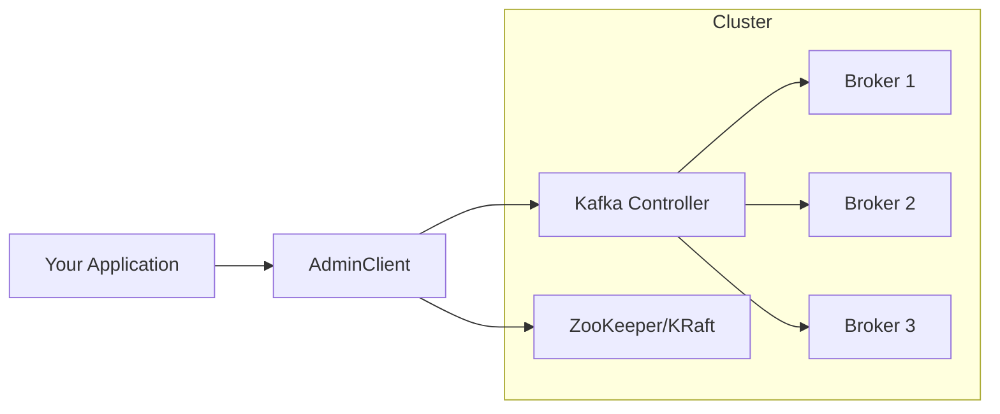
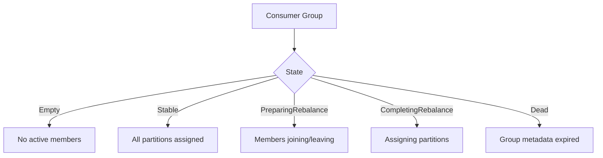

# How to Build Kafka Admin Client Operations

Author: [nawazdhandala](https://github.com/nawazdhandala)

Tags: Kafka, Messaging, Java, DevOps

Description: Learn to build production-ready Kafka admin operations for topic management, consumer group inspection, cluster configuration, and quota management using the Java AdminClient API.

---

Managing Kafka clusters programmatically is essential when you move beyond manual CLI commands. Whether you are building deployment automation, a self-service platform, or an observability tool, the Kafka AdminClient API gives you full control over cluster operations. This guide covers everything from basic topic management to advanced quota configurations with production-ready Java code.

## Why Use the AdminClient API

| Approach | Pros | Cons |
|----------|------|------|
| **CLI (kafka-topics.sh)** | Quick for one-off tasks | Hard to automate, no error handling |
| **AdminClient API** | Fully programmable, async, type-safe | Requires application code |
| **REST Proxy** | Language-agnostic | Extra infrastructure, limited operations |
| **Kubernetes Operators** | Declarative, GitOps-friendly | Only for K8s environments |

The AdminClient API is the right choice when you need fine-grained control, custom error handling, or integration with existing Java/Kotlin/Scala services.

## AdminClient Architecture



The AdminClient communicates with the Kafka controller for metadata operations and directly with brokers for certain queries. In KRaft mode (ZooKeeper-less), all coordination happens through the controller quorum.

## Setting Up the AdminClient

First, add the Kafka clients dependency to your project. Here we use Maven, but Gradle works similarly.

```xml
<!-- pom.xml -->
<dependency>
    <groupId>org.apache.kafka</groupId>
    <artifactId>kafka-clients</artifactId>
    <version>3.7.0</version>
</dependency>
```

Create a reusable AdminClient wrapper class that handles configuration and connection lifecycle properly.

```java
import org.apache.kafka.clients.admin.AdminClient;
import org.apache.kafka.clients.admin.AdminClientConfig;
import java.util.Properties;
import java.time.Duration;

public class KafkaAdminClientFactory {

    private final Properties baseConfig;

    public KafkaAdminClientFactory(String bootstrapServers) {
        this.baseConfig = new Properties();

        // Required: comma-separated list of broker addresses
        baseConfig.put(AdminClientConfig.BOOTSTRAP_SERVERS_CONFIG, bootstrapServers);

        // Connection timeout for initial broker connection
        baseConfig.put(AdminClientConfig.REQUEST_TIMEOUT_MS_CONFIG, 30000);

        // Time to wait for API responses
        baseConfig.put(AdminClientConfig.DEFAULT_API_TIMEOUT_MS_CONFIG, 60000);

        // Client identifier for logging and monitoring
        baseConfig.put(AdminClientConfig.CLIENT_ID_CONFIG, "admin-client-app");

        // Number of retries for transient failures
        baseConfig.put(AdminClientConfig.RETRIES_CONFIG, 3);
    }

    // Add SASL/SSL configuration for secured clusters
    public KafkaAdminClientFactory withSecurity(String protocol, String mechanism,
                                                 String jaasConfig) {
        baseConfig.put("security.protocol", protocol);
        baseConfig.put("sasl.mechanism", mechanism);
        baseConfig.put("sasl.jaas.config", jaasConfig);
        return this;
    }

    // Create a new AdminClient instance
    // Remember: AdminClient must be closed when done
    public AdminClient create() {
        return AdminClient.create(baseConfig);
    }
}
```

## Topic Management Operations

Topics are the core abstraction in Kafka. The AdminClient provides complete CRUD operations for topics.

### Creating Topics

This method creates topics with custom partition counts, replication factors, and configuration overrides.

```java
import org.apache.kafka.clients.admin.*;
import org.apache.kafka.common.config.TopicConfig;
import java.util.*;
import java.util.concurrent.ExecutionException;

public class TopicManager {

    private final AdminClient adminClient;

    public TopicManager(AdminClient adminClient) {
        this.adminClient = adminClient;
    }

    // Create a topic with full configuration control
    public void createTopic(String topicName, int partitions, short replicationFactor,
                           Map<String, String> configs) throws ExecutionException, InterruptedException {

        NewTopic newTopic = new NewTopic(topicName, partitions, replicationFactor);

        // Apply topic-level configurations
        if (configs != null && !configs.isEmpty()) {
            newTopic.configs(configs);
        }

        CreateTopicsResult result = adminClient.createTopics(
            Collections.singleton(newTopic),
            new CreateTopicsOptions().timeoutMs(30000)
        );

        // Wait for creation to complete and handle errors
        result.all().get();
        System.out.println("Topic created: " + topicName);
    }

    // Create a topic with common production defaults
    public void createProductionTopic(String topicName, int partitions)
            throws ExecutionException, InterruptedException {

        Map<String, String> configs = new HashMap<>();

        // Retain messages for 7 days
        configs.put(TopicConfig.RETENTION_MS_CONFIG, String.valueOf(7 * 24 * 60 * 60 * 1000L));

        // Use LZ4 compression for better throughput
        configs.put(TopicConfig.COMPRESSION_TYPE_CONFIG, "lz4");

        // Require all replicas to acknowledge writes
        configs.put(TopicConfig.MIN_IN_SYNC_REPLICAS_CONFIG, "2");

        // Clean up old segments aggressively
        configs.put(TopicConfig.SEGMENT_MS_CONFIG, String.valueOf(6 * 60 * 60 * 1000L));

        createTopic(topicName, partitions, (short) 3, configs);
    }
}
```

### Listing and Describing Topics

Query existing topics and their configurations for monitoring or debugging.

```java
// List all topics in the cluster
public Set<String> listTopics(boolean includeInternal)
        throws ExecutionException, InterruptedException {

    ListTopicsOptions options = new ListTopicsOptions()
        .listInternal(includeInternal)
        .timeoutMs(10000);

    ListTopicsResult result = adminClient.listTopics(options);
    return result.names().get();
}

// Get detailed information about specific topics
public Map<String, TopicDescription> describeTopics(Collection<String> topicNames)
        throws ExecutionException, InterruptedException {

    DescribeTopicsResult result = adminClient.describeTopics(topicNames);
    return result.allTopicNames().get();
}

// Print topic details in a readable format
public void printTopicDetails(String topicName)
        throws ExecutionException, InterruptedException {

    TopicDescription desc = describeTopics(Collections.singleton(topicName))
        .get(topicName);

    System.out.println("Topic: " + desc.name());
    System.out.println("Internal: " + desc.isInternal());
    System.out.println("Partitions: " + desc.partitions().size());

    for (TopicPartitionInfo partition : desc.partitions()) {
        System.out.printf("  Partition %d: Leader=%d, Replicas=%s, ISR=%s%n",
            partition.partition(),
            partition.leader().id(),
            partition.replicas().stream().map(n -> n.id()).toList(),
            partition.isr().stream().map(n -> n.id()).toList()
        );
    }
}
```

### Modifying and Deleting Topics

Change topic configurations or remove topics that are no longer needed.

```java
import org.apache.kafka.common.config.ConfigResource;
import org.apache.kafka.clients.admin.ConfigEntry;
import org.apache.kafka.clients.admin.Config;
import org.apache.kafka.clients.admin.AlterConfigOp;

// Update topic configuration dynamically
public void updateTopicConfig(String topicName, Map<String, String> newConfigs)
        throws ExecutionException, InterruptedException {

    ConfigResource resource = new ConfigResource(ConfigResource.Type.TOPIC, topicName);

    // Build list of config alterations
    Collection<AlterConfigOp> ops = new ArrayList<>();
    for (Map.Entry<String, String> entry : newConfigs.entrySet()) {
        ops.add(new AlterConfigOp(
            new ConfigEntry(entry.getKey(), entry.getValue()),
            AlterConfigOp.OpType.SET
        ));
    }

    Map<ConfigResource, Collection<AlterConfigOp>> configs = new HashMap<>();
    configs.put(resource, ops);

    adminClient.incrementalAlterConfigs(configs).all().get();
    System.out.println("Topic config updated: " + topicName);
}

// Increase partition count (cannot decrease)
public void addPartitions(String topicName, int newTotalPartitions)
        throws ExecutionException, InterruptedException {

    Map<String, NewPartitions> newPartitionsMap = new HashMap<>();
    newPartitionsMap.put(topicName, NewPartitions.increaseTo(newTotalPartitions));

    adminClient.createPartitions(newPartitionsMap).all().get();
    System.out.println("Partitions increased to " + newTotalPartitions);
}

// Delete topics permanently
public void deleteTopics(Collection<String> topicNames)
        throws ExecutionException, InterruptedException {

    DeleteTopicsResult result = adminClient.deleteTopics(topicNames);
    result.all().get();
    System.out.println("Topics deleted: " + topicNames);
}
```

## Consumer Group Management

Understanding consumer group state is critical for debugging lag issues and rebalancing problems.



### Listing and Describing Consumer Groups

Query consumer group metadata to understand application health and partition assignments.

```java
import org.apache.kafka.clients.admin.*;
import org.apache.kafka.clients.consumer.OffsetAndMetadata;
import org.apache.kafka.common.TopicPartition;

public class ConsumerGroupManager {

    private final AdminClient adminClient;

    public ConsumerGroupManager(AdminClient adminClient) {
        this.adminClient = adminClient;
    }

    // List all consumer groups
    public Collection<ConsumerGroupListing> listConsumerGroups()
            throws ExecutionException, InterruptedException {

        return adminClient.listConsumerGroups().all().get();
    }

    // Get detailed group information including members and assignments
    public ConsumerGroupDescription describeGroup(String groupId)
            throws ExecutionException, InterruptedException {

        DescribeConsumerGroupsResult result = adminClient
            .describeConsumerGroups(Collections.singleton(groupId));

        return result.describedGroups().get(groupId).get();
    }

    // Print consumer group details
    public void printGroupDetails(String groupId)
            throws ExecutionException, InterruptedException {

        ConsumerGroupDescription desc = describeGroup(groupId);

        System.out.println("Group: " + desc.groupId());
        System.out.println("State: " + desc.state());
        System.out.println("Coordinator: " + desc.coordinator());
        System.out.println("Assignment Strategy: " + desc.partitionAssignor());

        System.out.println("Members:");
        for (MemberDescription member : desc.members()) {
            System.out.printf("  %s (host: %s)%n",
                member.consumerId(), member.host());
            System.out.printf("    Assigned: %s%n",
                member.assignment().topicPartitions());
        }
    }
}
```

### Calculating Consumer Lag

Consumer lag tells you how far behind a consumer group is. This is essential for monitoring.

```java
// Calculate lag for all partitions in a consumer group
public Map<TopicPartition, Long> calculateLag(String groupId)
        throws ExecutionException, InterruptedException {

    // Get committed offsets for the group
    Map<TopicPartition, OffsetAndMetadata> committedOffsets = adminClient
        .listConsumerGroupOffsets(groupId)
        .partitionsToOffsetAndMetadata()
        .get();

    if (committedOffsets.isEmpty()) {
        return Collections.emptyMap();
    }

    // Get end offsets (latest messages) for each partition
    Map<TopicPartition, OffsetSpec> offsetSpecs = new HashMap<>();
    for (TopicPartition tp : committedOffsets.keySet()) {
        offsetSpecs.put(tp, OffsetSpec.latest());
    }

    Map<TopicPartition, ListOffsetsResult.ListOffsetsResultInfo> endOffsets =
        adminClient.listOffsets(offsetSpecs).all().get();

    // Calculate lag: end offset - committed offset
    Map<TopicPartition, Long> lagMap = new HashMap<>();
    for (TopicPartition tp : committedOffsets.keySet()) {
        long committed = committedOffsets.get(tp).offset();
        long end = endOffsets.get(tp).offset();
        lagMap.put(tp, end - committed);
    }

    return lagMap;
}

// Print lag summary
public void printLagSummary(String groupId)
        throws ExecutionException, InterruptedException {

    Map<TopicPartition, Long> lag = calculateLag(groupId);

    long totalLag = 0;
    for (Map.Entry<TopicPartition, Long> entry : lag.entrySet()) {
        System.out.printf("  %s: %d messages behind%n",
            entry.getKey(), entry.getValue());
        totalLag += entry.getValue();
    }

    System.out.println("Total lag: " + totalLag + " messages");
}
```

### Resetting Consumer Offsets

Sometimes you need to reset offsets to replay messages or skip problematic records.

```java
import org.apache.kafka.clients.consumer.OffsetResetStrategy;

// Reset offsets for a consumer group (group must be inactive)
public void resetOffsetsToEarliest(String groupId, String topicName)
        throws ExecutionException, InterruptedException {

    // First, get the topic partitions
    TopicDescription topicDesc = adminClient
        .describeTopics(Collections.singleton(topicName))
        .allTopicNames().get().get(topicName);

    // Get earliest offsets for all partitions
    Map<TopicPartition, OffsetSpec> offsetSpecs = new HashMap<>();
    for (TopicPartitionInfo partition : topicDesc.partitions()) {
        TopicPartition tp = new TopicPartition(topicName, partition.partition());
        offsetSpecs.put(tp, OffsetSpec.earliest());
    }

    Map<TopicPartition, ListOffsetsResult.ListOffsetsResultInfo> earliestOffsets =
        adminClient.listOffsets(offsetSpecs).all().get();

    // Build the offset map for reset
    Map<TopicPartition, OffsetAndMetadata> offsetsToReset = new HashMap<>();
    for (Map.Entry<TopicPartition, ListOffsetsResult.ListOffsetsResultInfo> entry :
            earliestOffsets.entrySet()) {
        offsetsToReset.put(entry.getKey(),
            new OffsetAndMetadata(entry.getValue().offset()));
    }

    // Perform the reset
    adminClient.alterConsumerGroupOffsets(groupId, offsetsToReset).all().get();
    System.out.println("Offsets reset to earliest for group: " + groupId);
}

// Reset offsets to a specific timestamp
public void resetOffsetsToTimestamp(String groupId, String topicName, long timestamp)
        throws ExecutionException, InterruptedException {

    TopicDescription topicDesc = adminClient
        .describeTopics(Collections.singleton(topicName))
        .allTopicNames().get().get(topicName);

    Map<TopicPartition, OffsetSpec> offsetSpecs = new HashMap<>();
    for (TopicPartitionInfo partition : topicDesc.partitions()) {
        TopicPartition tp = new TopicPartition(topicName, partition.partition());
        offsetSpecs.put(tp, OffsetSpec.forTimestamp(timestamp));
    }

    Map<TopicPartition, ListOffsetsResult.ListOffsetsResultInfo> timestampOffsets =
        adminClient.listOffsets(offsetSpecs).all().get();

    Map<TopicPartition, OffsetAndMetadata> offsetsToReset = new HashMap<>();
    for (Map.Entry<TopicPartition, ListOffsetsResult.ListOffsetsResultInfo> entry :
            timestampOffsets.entrySet()) {
        if (entry.getValue().offset() >= 0) {
            offsetsToReset.put(entry.getKey(),
                new OffsetAndMetadata(entry.getValue().offset()));
        }
    }

    adminClient.alterConsumerGroupOffsets(groupId, offsetsToReset).all().get();
    System.out.println("Offsets reset to timestamp " + timestamp);
}
```

## Cluster and Broker Operations

Query and modify broker configurations for cluster-wide tuning.

### Describing the Cluster

Get cluster metadata including broker information and controller status.

```java
public class ClusterManager {

    private final AdminClient adminClient;

    public ClusterManager(AdminClient adminClient) {
        this.adminClient = adminClient;
    }

    // Get cluster overview
    public void printClusterInfo() throws ExecutionException, InterruptedException {
        DescribeClusterResult cluster = adminClient.describeCluster();

        System.out.println("Cluster ID: " + cluster.clusterId().get());
        System.out.println("Controller: " + cluster.controller().get());

        System.out.println("Brokers:");
        for (Node node : cluster.nodes().get()) {
            System.out.printf("  ID: %d, Host: %s:%d, Rack: %s%n",
                node.id(), node.host(), node.port(), node.rack());
        }
    }

    // Check if cluster is healthy
    public boolean isClusterHealthy() throws ExecutionException, InterruptedException {
        DescribeClusterResult cluster = adminClient.describeCluster();

        // Check controller exists
        Node controller = cluster.controller().get();
        if (controller == null) {
            return false;
        }

        // Check minimum broker count
        Collection<Node> nodes = cluster.nodes().get();
        return nodes.size() >= 3;
    }
}
```

### Broker Configuration Management

Read and modify broker configurations dynamically without restarts.

```java
// Get current broker configuration
public Map<String, String> getBrokerConfig(int brokerId)
        throws ExecutionException, InterruptedException {

    ConfigResource resource = new ConfigResource(
        ConfigResource.Type.BROKER, String.valueOf(brokerId));

    DescribeConfigsResult result = adminClient
        .describeConfigs(Collections.singleton(resource));

    Config config = result.all().get().get(resource);

    Map<String, String> configMap = new HashMap<>();
    for (ConfigEntry entry : config.entries()) {
        // Only include non-default values
        if (!entry.isDefault()) {
            configMap.put(entry.name(), entry.value());
        }
    }

    return configMap;
}

// Update broker configuration dynamically
public void updateBrokerConfig(int brokerId, Map<String, String> newConfigs)
        throws ExecutionException, InterruptedException {

    ConfigResource resource = new ConfigResource(
        ConfigResource.Type.BROKER, String.valueOf(brokerId));

    Collection<AlterConfigOp> ops = new ArrayList<>();
    for (Map.Entry<String, String> entry : newConfigs.entrySet()) {
        ops.add(new AlterConfigOp(
            new ConfigEntry(entry.getKey(), entry.getValue()),
            AlterConfigOp.OpType.SET
        ));
    }

    Map<ConfigResource, Collection<AlterConfigOp>> configs = new HashMap<>();
    configs.put(resource, ops);

    adminClient.incrementalAlterConfigs(configs).all().get();
    System.out.println("Broker " + brokerId + " config updated");
}
```

## ACL Management

Access Control Lists secure your Kafka cluster by defining who can do what.

```java
import org.apache.kafka.common.acl.*;
import org.apache.kafka.common.resource.*;

public class AclManager {

    private final AdminClient adminClient;

    public AclManager(AdminClient adminClient) {
        this.adminClient = adminClient;
    }

    // Grant produce permission to a user for a topic
    public void grantProducePermission(String principal, String topicName)
            throws ExecutionException, InterruptedException {

        ResourcePattern resource = new ResourcePattern(
            ResourceType.TOPIC, topicName, PatternType.LITERAL);

        AccessControlEntry ace = new AccessControlEntry(
            principal,           // e.g., "User:producer-app"
            "*",                 // host (all hosts)
            AclOperation.WRITE,  // permission type
            AclPermissionType.ALLOW
        );

        AclBinding binding = new AclBinding(resource, ace);

        adminClient.createAcls(Collections.singleton(binding)).all().get();
        System.out.println("Produce permission granted to " + principal);
    }

    // Grant consume permission including group access
    public void grantConsumePermission(String principal, String topicName,
                                       String consumerGroup)
            throws ExecutionException, InterruptedException {

        List<AclBinding> bindings = new ArrayList<>();

        // Topic read permission
        bindings.add(new AclBinding(
            new ResourcePattern(ResourceType.TOPIC, topicName, PatternType.LITERAL),
            new AccessControlEntry(principal, "*", AclOperation.READ, AclPermissionType.ALLOW)
        ));

        // Consumer group permission
        bindings.add(new AclBinding(
            new ResourcePattern(ResourceType.GROUP, consumerGroup, PatternType.LITERAL),
            new AccessControlEntry(principal, "*", AclOperation.READ, AclPermissionType.ALLOW)
        ));

        adminClient.createAcls(bindings).all().get();
        System.out.println("Consume permission granted to " + principal);
    }

    // List all ACLs for a resource
    public Collection<AclBinding> listAcls(ResourceType resourceType, String name)
            throws ExecutionException, InterruptedException {

        ResourcePatternFilter filter = new ResourcePatternFilter(
            resourceType, name, PatternType.ANY);

        AclBindingFilter aclFilter = new AclBindingFilter(
            filter, AccessControlEntryFilter.ANY);

        return adminClient.describeAcls(aclFilter).values().get();
    }

    // Remove ACLs
    public void deleteAcl(AclBinding binding)
            throws ExecutionException, InterruptedException {

        AclBindingFilter filter = binding.toFilter();
        adminClient.deleteAcls(Collections.singleton(filter)).all().get();
        System.out.println("ACL deleted");
    }
}
```

## Quota Management

Quotas prevent runaway clients from overwhelming the cluster.

```java
import org.apache.kafka.common.quota.*;

public class QuotaManager {

    private final AdminClient adminClient;

    public QuotaManager(AdminClient adminClient) {
        this.adminClient = adminClient;
    }

    // Set producer throughput quota for a client
    public void setProducerQuota(String clientId, double bytesPerSecond)
            throws ExecutionException, InterruptedException {

        ClientQuotaEntity entity = new ClientQuotaEntity(
            Collections.singletonMap(ClientQuotaEntity.CLIENT_ID, clientId));

        ClientQuotaAlteration.Op op = new ClientQuotaAlteration.Op(
            "producer_byte_rate", bytesPerSecond);

        ClientQuotaAlteration alteration = new ClientQuotaAlteration(
            entity, Collections.singleton(op));

        adminClient.alterClientQuotas(Collections.singleton(alteration)).all().get();
        System.out.println("Producer quota set for " + clientId + ": " + bytesPerSecond + " bytes/sec");
    }

    // Set consumer throughput quota
    public void setConsumerQuota(String clientId, double bytesPerSecond)
            throws ExecutionException, InterruptedException {

        ClientQuotaEntity entity = new ClientQuotaEntity(
            Collections.singletonMap(ClientQuotaEntity.CLIENT_ID, clientId));

        ClientQuotaAlteration.Op op = new ClientQuotaAlteration.Op(
            "consumer_byte_rate", bytesPerSecond);

        ClientQuotaAlteration alteration = new ClientQuotaAlteration(
            entity, Collections.singleton(op));

        adminClient.alterClientQuotas(Collections.singleton(alteration)).all().get();
        System.out.println("Consumer quota set for " + clientId);
    }

    // Set request rate quota (requests per second)
    public void setRequestQuota(String user, double requestPercentage)
            throws ExecutionException, InterruptedException {

        ClientQuotaEntity entity = new ClientQuotaEntity(
            Collections.singletonMap(ClientQuotaEntity.USER, user));

        ClientQuotaAlteration.Op op = new ClientQuotaAlteration.Op(
            "request_percentage", requestPercentage);

        ClientQuotaAlteration alteration = new ClientQuotaAlteration(
            entity, Collections.singleton(op));

        adminClient.alterClientQuotas(Collections.singleton(alteration)).all().get();
        System.out.println("Request quota set for user " + user);
    }

    // List quotas for a client
    public Map<ClientQuotaEntity, Map<String, Double>> describeQuotas(String clientId)
            throws ExecutionException, InterruptedException {

        ClientQuotaFilter filter = ClientQuotaFilter.contains(
            Collections.singletonList(
                ClientQuotaFilterComponent.ofEntity(ClientQuotaEntity.CLIENT_ID, clientId)
            )
        );

        return adminClient.describeClientQuotas(filter).entities().get();
    }
}
```

## Complete Example: Admin Operations Service

Here is a complete service class that combines all operations with proper error handling and logging.

```java
import org.apache.kafka.clients.admin.*;
import org.apache.kafka.common.errors.*;
import org.slf4j.Logger;
import org.slf4j.LoggerFactory;
import java.io.Closeable;

public class KafkaAdminService implements Closeable {

    private static final Logger logger = LoggerFactory.getLogger(KafkaAdminService.class);

    private final AdminClient adminClient;
    private final TopicManager topicManager;
    private final ConsumerGroupManager consumerGroupManager;
    private final ClusterManager clusterManager;

    public KafkaAdminService(String bootstrapServers) {
        // Create AdminClient with production settings
        Properties config = new Properties();
        config.put(AdminClientConfig.BOOTSTRAP_SERVERS_CONFIG, bootstrapServers);
        config.put(AdminClientConfig.REQUEST_TIMEOUT_MS_CONFIG, 30000);
        config.put(AdminClientConfig.DEFAULT_API_TIMEOUT_MS_CONFIG, 60000);
        config.put(AdminClientConfig.RETRIES_CONFIG, 3);

        this.adminClient = AdminClient.create(config);
        this.topicManager = new TopicManager(adminClient);
        this.consumerGroupManager = new ConsumerGroupManager(adminClient);
        this.clusterManager = new ClusterManager(adminClient);
    }

    // Safe topic creation with existence check
    public boolean createTopicIfNotExists(String topicName, int partitions,
                                          short replication) {
        try {
            // Check if topic already exists
            Set<String> existingTopics = topicManager.listTopics(false);
            if (existingTopics.contains(topicName)) {
                logger.info("Topic {} already exists", topicName);
                return false;
            }

            topicManager.createTopic(topicName, partitions, replication, null);
            logger.info("Created topic {}", topicName);
            return true;

        } catch (TopicExistsException e) {
            logger.info("Topic {} was created concurrently", topicName);
            return false;
        } catch (Exception e) {
            logger.error("Failed to create topic {}", topicName, e);
            throw new RuntimeException("Topic creation failed", e);
        }
    }

    // Get comprehensive consumer group health report
    public ConsumerGroupHealth getConsumerGroupHealth(String groupId) {
        try {
            ConsumerGroupDescription desc = consumerGroupManager.describeGroup(groupId);
            Map<TopicPartition, Long> lag = consumerGroupManager.calculateLag(groupId);

            long totalLag = lag.values().stream().mapToLong(Long::longValue).sum();
            int memberCount = desc.members().size();

            return new ConsumerGroupHealth(
                groupId,
                desc.state().toString(),
                memberCount,
                lag.size(),
                totalLag,
                totalLag > 10000 ? "WARNING" : "HEALTHY"
            );

        } catch (Exception e) {
            logger.error("Failed to get health for group {}", groupId, e);
            return new ConsumerGroupHealth(groupId, "UNKNOWN", 0, 0, 0, "ERROR");
        }
    }

    // Safely delete a topic with confirmation
    public void deleteTopic(String topicName, boolean force) {
        try {
            if (!force) {
                // Check for active consumers
                for (ConsumerGroupListing group : consumerGroupManager.listConsumerGroups()) {
                    ConsumerGroupDescription desc = consumerGroupManager
                        .describeGroup(group.groupId());

                    for (MemberDescription member : desc.members()) {
                        for (TopicPartition tp : member.assignment().topicPartitions()) {
                            if (tp.topic().equals(topicName)) {
                                throw new IllegalStateException(
                                    "Topic has active consumers: " + group.groupId());
                            }
                        }
                    }
                }
            }

            topicManager.deleteTopics(Collections.singleton(topicName));
            logger.info("Deleted topic {}", topicName);

        } catch (Exception e) {
            logger.error("Failed to delete topic {}", topicName, e);
            throw new RuntimeException("Topic deletion failed", e);
        }
    }

    @Override
    public void close() {
        if (adminClient != null) {
            adminClient.close(Duration.ofSeconds(30));
            logger.info("AdminClient closed");
        }
    }

    // Health report data class
    public static class ConsumerGroupHealth {
        public final String groupId;
        public final String state;
        public final int memberCount;
        public final int partitionCount;
        public final long totalLag;
        public final String status;

        public ConsumerGroupHealth(String groupId, String state, int memberCount,
                                   int partitionCount, long totalLag, String status) {
            this.groupId = groupId;
            this.state = state;
            this.memberCount = memberCount;
            this.partitionCount = partitionCount;
            this.totalLag = totalLag;
            this.status = status;
        }
    }
}
```

## Usage Example

```java
public class Main {
    public static void main(String[] args) {
        try (KafkaAdminService admin = new KafkaAdminService("localhost:9092")) {

            // Create a topic
            admin.createTopicIfNotExists("orders", 12, (short) 3);

            // Check consumer group health
            KafkaAdminService.ConsumerGroupHealth health =
                admin.getConsumerGroupHealth("order-processor");

            System.out.println("Group: " + health.groupId);
            System.out.println("State: " + health.state);
            System.out.println("Members: " + health.memberCount);
            System.out.println("Total Lag: " + health.totalLag);
            System.out.println("Status: " + health.status);

        } catch (Exception e) {
            e.printStackTrace();
        }
    }
}
```

## Error Handling Best Practices

Different Kafka operations fail for different reasons. Handle them appropriately.

| Exception | Cause | Recovery |
|-----------|-------|----------|
| `TopicExistsException` | Topic already exists | Check existence before creating |
| `UnknownTopicOrPartitionException` | Topic does not exist | Verify topic name |
| `InvalidReplicationFactorException` | Not enough brokers | Reduce replication factor |
| `GroupNotEmptyException` | Consumers still active | Stop consumers first |
| `TimeoutException` | Cluster unreachable | Retry with backoff |
| `AuthorizationException` | Missing permissions | Check ACLs |

## Summary

| Operation | Method | Key Considerations |
|-----------|--------|-------------------|
| **Create Topic** | `createTopics()` | Set partitions, replication, configs |
| **Delete Topic** | `deleteTopics()` | Ensure no active consumers |
| **Describe Topics** | `describeTopics()` | Check ISR health |
| **List Groups** | `listConsumerGroups()` | Filter by state |
| **Calculate Lag** | `listOffsets()` + `listConsumerGroupOffsets()` | Critical for monitoring |
| **Reset Offsets** | `alterConsumerGroupOffsets()` | Group must be inactive |
| **Manage ACLs** | `createAcls()` / `deleteAcls()` | Requires authorizer enabled |
| **Set Quotas** | `alterClientQuotas()` | Protect cluster from abuse |

The Kafka AdminClient API gives you programmatic control over your entire cluster. Use it to build self-service platforms, automated deployment pipelines, or monitoring tools. Always close your AdminClient instances properly, handle exceptions gracefully, and test operations in staging before running them in production.
