# How to Create Kafka Connect Error Handling

Author: [nawazdhandala](https://github.com/nawazdhandala)

Tags: Kafka Connect, Error Handling, Dead Letter Queue, Resilience

Description: Learn to implement Kafka Connect error handling with dead letter queues, retry policies, and error reporters for production resilience.

---

Kafka Connect is a powerful framework for streaming data between Apache Kafka and external systems. However, in production environments, failures are inevitable - malformed records, network issues, schema mismatches, and transient errors can all disrupt your data pipelines. This guide covers comprehensive error handling strategies to build resilient Kafka Connect deployments.

## Understanding Kafka Connect Error Types

Before diving into solutions, let's understand the types of errors you'll encounter:


## Error Tolerance Configuration

Kafka Connect provides three error tolerance modes that determine how the framework handles failures:

### Error Tolerance Modes

| Mode | Behavior | Use Case |
|------|----------|----------|
| `none` | Fail immediately on any error | Development, strict data requirements |
| `all` | Skip problematic records and continue | Production with DLQ enabled |

```json
{
  "name": "jdbc-sink-connector",
  "config": {
    "connector.class": "io.confluent.connect.jdbc.JdbcSinkConnector",
    "topics": "orders",
    "connection.url": "jdbc:postgresql://localhost:5432/mydb",
    "errors.tolerance": "all",
    "errors.log.enable": true,
    "errors.log.include.messages": true
  }
}
```

The `errors.tolerance` setting is your first line of defense. Setting it to `all` prevents a single bad record from stopping your entire pipeline.

## Dead Letter Queue (DLQ) Configuration

A Dead Letter Queue captures failed records for later analysis and reprocessing. This is essential for production deployments where you cannot afford to lose data.


### Basic DLQ Configuration

```json
{
  "name": "elasticsearch-sink-connector",
  "config": {
    "connector.class": "io.confluent.connect.elasticsearch.ElasticsearchSinkConnector",
    "topics": "application-logs",
    "connection.url": "http://elasticsearch:9200",
    "type.name": "_doc",

    "errors.tolerance": "all",
    "errors.deadletterqueue.topic.name": "dlq-application-logs",
    "errors.deadletterqueue.topic.replication.factor": 3,
    "errors.deadletterqueue.context.headers.enable": true
  }
}
```

### Understanding DLQ Headers

When `errors.deadletterqueue.context.headers.enable` is set to `true`, each failed record includes valuable debugging information in its headers:

| Header | Description |
|--------|-------------|
| `__connect.errors.topic` | Original source topic |
| `__connect.errors.partition` | Original partition number |
| `__connect.errors.offset` | Original offset |
| `__connect.errors.connector.name` | Name of the failing connector |
| `__connect.errors.task.id` | Task ID that encountered the error |
| `__connect.errors.stage` | Processing stage where failure occurred |
| `__connect.errors.class.name` | Exception class name |
| `__connect.errors.exception.message` | Error message |
| `__connect.errors.exception.stacktrace` | Full stack trace |

### DLQ Consumer Example

Here is a Java consumer that processes DLQ records and extracts error context:

```java
import org.apache.kafka.clients.consumer.*;
import org.apache.kafka.common.header.Header;
import java.time.Duration;
import java.util.Collections;
import java.util.Properties;

public class DLQProcessor {

    public static void main(String[] args) {
        Properties props = new Properties();
        props.put(ConsumerConfig.BOOTSTRAP_SERVERS_CONFIG, "localhost:9092");
        props.put(ConsumerConfig.GROUP_ID_CONFIG, "dlq-processor");
        props.put(ConsumerConfig.KEY_DESERIALIZER_CLASS_CONFIG,
            "org.apache.kafka.common.serialization.StringDeserializer");
        props.put(ConsumerConfig.VALUE_DESERIALIZER_CLASS_CONFIG,
            "org.apache.kafka.common.serialization.StringDeserializer");

        try (KafkaConsumer<String, String> consumer = new KafkaConsumer<>(props)) {
            consumer.subscribe(Collections.singletonList("dlq-application-logs"));

            while (true) {
                ConsumerRecords<String, String> records = consumer.poll(Duration.ofMillis(100));

                for (ConsumerRecord<String, String> record : records) {
                    System.out.println("Failed Record Value: " + record.value());

                    // Extract error context from headers
                    for (Header header : record.headers()) {
                        String key = header.key();
                        String value = new String(header.value());

                        if (key.startsWith("__connect.errors")) {
                            System.out.println(key + ": " + value);
                        }
                    }

                    // Implement your reprocessing logic here
                    handleFailedRecord(record);
                }
            }
        }
    }

    private static void handleFailedRecord(ConsumerRecord<String, String> record) {
        // Log to monitoring system
        // Attempt data correction
        // Route to manual review queue
    }
}
```

## Retry Policies and Backoff Strategies

For transient failures, implementing retry logic can significantly improve pipeline reliability.


### Configuring Retries

```json
{
  "name": "http-sink-connector",
  "config": {
    "connector.class": "io.confluent.connect.http.HttpSinkConnector",
    "topics": "events",
    "http.api.url": "https://api.example.com/events",

    "errors.tolerance": "all",
    "errors.retry.timeout": "60000",
    "errors.retry.delay.max.ms": "10000",

    "errors.deadletterqueue.topic.name": "dlq-events",
    "errors.deadletterqueue.topic.replication.factor": 3,
    "errors.deadletterqueue.context.headers.enable": true
  }
}
```

### Retry Configuration Parameters

| Parameter | Default | Description |
|-----------|---------|-------------|
| `errors.retry.timeout` | 0 | Total time in ms to retry before giving up (0 = no retries) |
| `errors.retry.delay.max.ms` | 60000 | Maximum delay between retries |

The retry mechanism uses exponential backoff, starting from a small delay and increasing up to `errors.retry.delay.max.ms`.

## Custom Error Reporters

For advanced monitoring and alerting, you can implement custom error reporters that integrate with your observability stack.

### Error Reporter Interface

```java
package com.example.kafka.connect;

import org.apache.kafka.connect.errors.ConnectException;
import org.apache.kafka.connect.runtime.errors.ErrorReporter;
import org.apache.kafka.connect.sink.SinkRecord;
import io.micrometer.core.instrument.Counter;
import io.micrometer.core.instrument.MeterRegistry;
import io.micrometer.prometheus.PrometheusConfig;
import io.micrometer.prometheus.PrometheusMeterRegistry;

import java.util.Map;

public class PrometheusErrorReporter implements ErrorReporter {

    private Counter errorCounter;
    private Counter dlqCounter;
    private MeterRegistry registry;
    private String connectorName;

    @Override
    public void configure(Map<String, ?> configs) {
        this.connectorName = (String) configs.get("name");
        this.registry = new PrometheusMeterRegistry(PrometheusConfig.DEFAULT);

        this.errorCounter = Counter.builder("kafka_connect_errors_total")
            .tag("connector", connectorName)
            .description("Total number of errors encountered")
            .register(registry);

        this.dlqCounter = Counter.builder("kafka_connect_dlq_records_total")
            .tag("connector", connectorName)
            .description("Total records sent to DLQ")
            .register(registry);
    }

    @Override
    public void report(SinkRecord record, Throwable error) {
        errorCounter.increment();

        // Log structured error information
        System.err.println(String.format(
            "Error processing record - Topic: %s, Partition: %d, Offset: %d, Error: %s",
            record.topic(),
            record.kafkaPartition(),
            record.kafkaOffset(),
            error.getMessage()
        ));

        // Send alert for critical errors
        if (isCriticalError(error)) {
            sendAlert(record, error);
        }
    }

    @Override
    public void reportDLQ(SinkRecord record, Throwable error) {
        dlqCounter.increment();

        // Track DLQ metrics for monitoring dashboards
        System.out.println(String.format(
            "Record sent to DLQ - Topic: %s, Partition: %d, Offset: %d",
            record.topic(),
            record.kafkaPartition(),
            record.kafkaOffset()
        ));
    }

    private boolean isCriticalError(Throwable error) {
        return error instanceof ConnectException ||
               error.getMessage().contains("authentication") ||
               error.getMessage().contains("authorization");
    }

    private void sendAlert(SinkRecord record, Throwable error) {
        // Integrate with PagerDuty, Slack, or other alerting systems
    }

    @Override
    public void close() {
        // Cleanup resources
    }
}
```

### Registering the Custom Reporter

Add your error reporter to the connector configuration:

```json
{
  "name": "my-sink-connector",
  "config": {
    "connector.class": "com.example.MySinkConnector",
    "errors.tolerance": "all",
    "errors.deadletterqueue.topic.name": "dlq-topic",
    "errors.reporters": "com.example.kafka.connect.PrometheusErrorReporter"
  }
}
```

## Complete Production Configuration

Here is a comprehensive configuration that combines all error handling strategies:

```json
{
  "name": "production-jdbc-sink",
  "config": {
    "connector.class": "io.confluent.connect.jdbc.JdbcSinkConnector",
    "tasks.max": "3",
    "topics": "orders,payments,customers",

    "connection.url": "jdbc:postgresql://db-primary:5432/production",
    "connection.user": "${file:/secrets/db-credentials.properties:username}",
    "connection.password": "${file:/secrets/db-credentials.properties:password}",

    "insert.mode": "upsert",
    "pk.mode": "record_key",
    "pk.fields": "id",
    "auto.create": "false",
    "auto.evolve": "false",

    "errors.tolerance": "all",
    "errors.log.enable": "true",
    "errors.log.include.messages": "true",

    "errors.retry.timeout": "300000",
    "errors.retry.delay.max.ms": "30000",

    "errors.deadletterqueue.topic.name": "dlq-jdbc-sink",
    "errors.deadletterqueue.topic.replication.factor": "3",
    "errors.deadletterqueue.context.headers.enable": "true",

    "consumer.override.max.poll.records": "500",
    "consumer.override.max.poll.interval.ms": "300000"
  }
}
```

## Monitoring Error Handling

Effective monitoring is crucial for maintaining healthy pipelines. Here are key metrics to track:

```mermaid
flowchart TD
    subgraph Metrics Collection
        A[Kafka Connect JMX] --> B[Prometheus]
        C[Custom Error Reporter] --> B
        D[DLQ Consumer Lag] --> B
    end

    subgraph Visualization
        B --> E[Grafana Dashboard]
    end

    subgraph Alerting
        E --> F[Error Rate Threshold]
        E --> G[DLQ Growth Rate]
        E --> H[Connector Status]
        F --> I[PagerDuty/Slack]
        G --> I
        H --> I
    end
```



### Key JMX Metrics

Monitor these JMX metrics exposed by Kafka Connect:

| Metric | Description |
|--------|-------------|
| `kafka.connect:type=connector-task-metrics,connector=*,task=*` | Task-level metrics |
| `total-record-errors` | Total records that resulted in errors |
| `total-record-failures` | Records that failed after all retries |
| `total-records-skipped` | Records skipped due to errors |
| `deadletterqueue-produce-requests` | Number of DLQ produce requests |
| `deadletterqueue-produce-failures` | Failed DLQ produce attempts |

### Prometheus Scrape Configuration

```yaml
scrape_configs:
  - job_name: 'kafka-connect'
    static_configs:
      - targets: ['connect-1:8083', 'connect-2:8083', 'connect-3:8083']
    metrics_path: /metrics

  - job_name: 'kafka-connect-jmx'
    static_configs:
      - targets: ['connect-1:9999', 'connect-2:9999', 'connect-3:9999']
```

### Alerting Rules Example

```yaml
groups:
  - name: kafka-connect-alerts
    rules:
      - alert: KafkaConnectHighErrorRate
        expr: |
          rate(kafka_connect_connector_task_metrics_total_record_errors[5m]) > 10
        for: 5m
        labels:
          severity: warning
        annotations:
          summary: "High error rate in Kafka Connect"
          description: "Connector {{ $labels.connector }} has error rate > 10/s"

      - alert: KafkaConnectDLQGrowing
        expr: |
          rate(kafka_consumer_records_lag_max{topic=~"dlq-.*"}[10m]) > 0
        for: 15m
        labels:
          severity: critical
        annotations:
          summary: "DLQ is growing"
          description: "Dead letter queue {{ $labels.topic }} is accumulating records"

      - alert: KafkaConnectorFailed
        expr: |
          kafka_connect_connector_status == 0
        for: 1m
        labels:
          severity: critical
        annotations:
          summary: "Kafka Connector Failed"
          description: "Connector {{ $labels.connector }} has failed"
```

## DLQ Reprocessing Strategy

Once records land in the DLQ, you need a strategy to handle them:


### Automated DLQ Reprocessor

```java
import org.apache.kafka.clients.consumer.*;
import org.apache.kafka.clients.producer.*;
import org.apache.kafka.common.header.Header;

import java.time.Duration;
import java.util.*;

public class DLQReprocessor {

    private final KafkaConsumer<String, String> consumer;
    private final KafkaProducer<String, String> producer;
    private final Map<String, Integer> retryCount = new HashMap<>();
    private static final int MAX_RETRIES = 3;

    public DLQReprocessor(String bootstrapServers) {
        Properties consumerProps = new Properties();
        consumerProps.put(ConsumerConfig.BOOTSTRAP_SERVERS_CONFIG, bootstrapServers);
        consumerProps.put(ConsumerConfig.GROUP_ID_CONFIG, "dlq-reprocessor");
        consumerProps.put(ConsumerConfig.KEY_DESERIALIZER_CLASS_CONFIG,
            "org.apache.kafka.common.serialization.StringDeserializer");
        consumerProps.put(ConsumerConfig.VALUE_DESERIALIZER_CLASS_CONFIG,
            "org.apache.kafka.common.serialization.StringDeserializer");
        consumerProps.put(ConsumerConfig.AUTO_OFFSET_RESET_CONFIG, "earliest");

        this.consumer = new KafkaConsumer<>(consumerProps);

        Properties producerProps = new Properties();
        producerProps.put(ProducerConfig.BOOTSTRAP_SERVERS_CONFIG, bootstrapServers);
        producerProps.put(ProducerConfig.KEY_SERIALIZER_CLASS_CONFIG,
            "org.apache.kafka.common.serialization.StringSerializer");
        producerProps.put(ProducerConfig.VALUE_SERIALIZER_CLASS_CONFIG,
            "org.apache.kafka.common.serialization.StringSerializer");
        producerProps.put(ProducerConfig.ACKS_CONFIG, "all");

        this.producer = new KafkaProducer<>(producerProps);
    }

    public void process(String dlqTopic) {
        consumer.subscribe(Collections.singletonList(dlqTopic));

        while (true) {
            ConsumerRecords<String, String> records = consumer.poll(Duration.ofMillis(1000));

            for (ConsumerRecord<String, String> record : records) {
                String originalTopic = extractHeader(record, "__connect.errors.topic");
                String errorMessage = extractHeader(record, "__connect.errors.exception.message");
                String recordKey = record.key() != null ? record.key() : String.valueOf(record.offset());

                if (isRetryableError(errorMessage)) {
                    int currentRetries = retryCount.getOrDefault(recordKey, 0);

                    if (currentRetries < MAX_RETRIES) {
                        // Retry by producing back to original topic
                        ProducerRecord<String, String> retryRecord =
                            new ProducerRecord<>(originalTopic, record.key(), record.value());

                        producer.send(retryRecord, (metadata, exception) -> {
                            if (exception != null) {
                                System.err.println("Failed to reprocess: " + exception.getMessage());
                            } else {
                                System.out.println("Successfully reprocessed to " + originalTopic);
                            }
                        });

                        retryCount.put(recordKey, currentRetries + 1);
                    } else {
                        // Max retries exceeded - send to permanent failure topic
                        archiveRecord(record, "permanent-failures");
                    }
                } else {
                    // Non-retryable error - archive for manual review
                    archiveRecord(record, "manual-review-queue");
                }
            }

            consumer.commitSync();
        }
    }

    private String extractHeader(ConsumerRecord<String, String> record, String headerKey) {
        Header header = record.headers().lastHeader(headerKey);
        return header != null ? new String(header.value()) : "";
    }

    private boolean isRetryableError(String errorMessage) {
        return errorMessage.contains("timeout") ||
               errorMessage.contains("temporarily unavailable") ||
               errorMessage.contains("connection reset");
    }

    private void archiveRecord(ConsumerRecord<String, String> record, String archiveTopic) {
        ProducerRecord<String, String> archiveRecord =
            new ProducerRecord<>(archiveTopic, record.key(), record.value());

        // Copy original headers
        record.headers().forEach(header ->
            archiveRecord.headers().add(header));

        producer.send(archiveRecord);
    }

    public void close() {
        consumer.close();
        producer.close();
    }
}
```

## Best Practices Summary

1. **Always enable error tolerance in production** - Set `errors.tolerance=all` to prevent single bad records from stopping your pipeline.

2. **Configure DLQ with context headers** - Enable `errors.deadletterqueue.context.headers.enable` to capture debugging information.

3. **Set appropriate retry timeouts** - Use `errors.retry.timeout` for transient failures, but avoid infinite retries.

4. **Monitor DLQ growth** - Set up alerts when DLQ topics start accumulating records.

5. **Implement DLQ reprocessing** - Build automated or semi-automated workflows to handle failed records.

6. **Use structured logging** - Enable `errors.log.enable` and `errors.log.include.messages` for troubleshooting.

7. **Test failure scenarios** - Regularly test your error handling by simulating failures in non-production environments.

8. **Document error handling procedures** - Ensure your team knows how to respond to different types of failures.

## Conclusion

Robust error handling is essential for production Kafka Connect deployments. By combining error tolerance settings, dead letter queues, retry policies, and comprehensive monitoring, you can build resilient data pipelines that gracefully handle failures while preserving data integrity.

The key is finding the right balance between automatic recovery for transient issues and human intervention for problems that require investigation. With the configurations and patterns covered in this guide, you have the foundation to build fault-tolerant streaming pipelines that can handle the challenges of real-world production environments.
