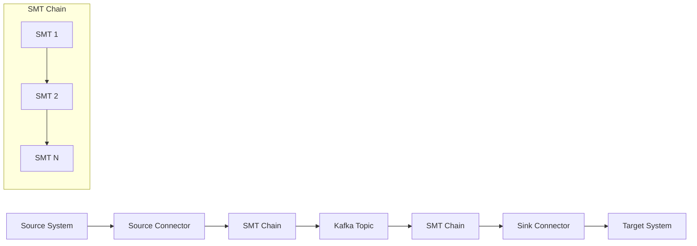
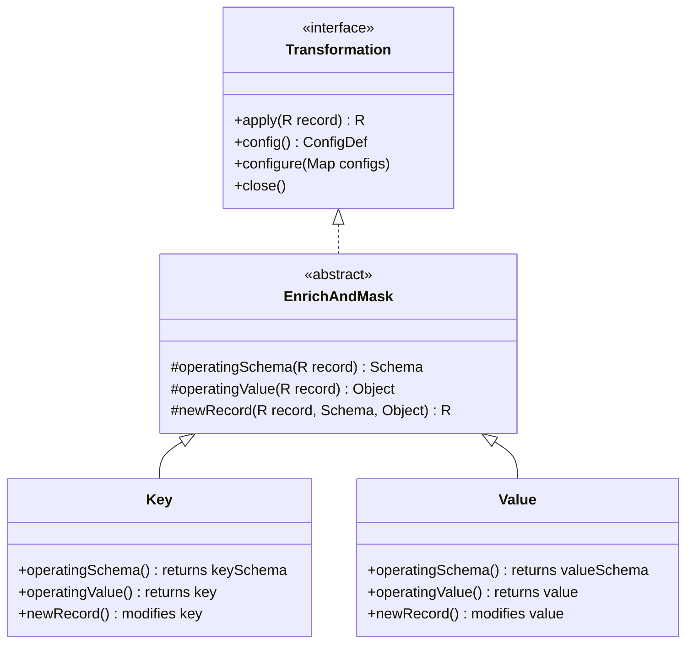
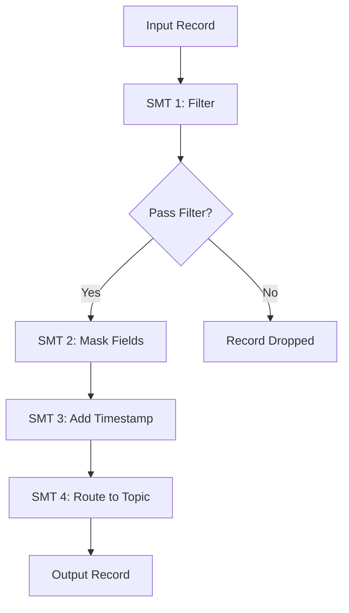
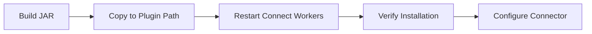

# How to Implement Kafka Connect SMT Custom

Author: [nawazdhandala](https://github.com/nawazdhandala)

Tags: Kafka Connect, SMT, Transformation, Data Integration

Description: Learn to implement custom Kafka Connect Single Message Transforms with configuration, value/key transformation, and chaining patterns.

---

## Introduction

Kafka Connect Single Message Transforms (SMTs) are powerful tools for modifying records as they flow through your Kafka Connect pipelines. While Kafka provides many built-in SMTs, you often need custom transformations tailored to your specific data requirements.

In this guide, we will walk through implementing custom SMTs from scratch, covering the essential interfaces, configuration management, transformation logic, and deployment strategies.

## Understanding SMT Architecture

Before diving into implementation, let us understand how SMTs fit into the Kafka Connect data flow.



SMTs operate on individual records, transforming them one at a time. They can modify:
- Record keys
- Record values
- Headers
- Topic names
- Partition assignments

## The Transformation Interface

Every custom SMT must implement the `Transformation<R>` interface where `R` extends `ConnectRecord<R>`. Here is the core interface structure:

```java
package org.apache.kafka.connect.transforms;

import org.apache.kafka.common.config.ConfigDef;
import org.apache.kafka.connect.connector.ConnectRecord;

public interface Transformation<R extends ConnectRecord<R>> extends Configurable, Closeable {

    R apply(R record);

    ConfigDef config();

    void close();

    void configure(Map<String, ?> configs);
}
```

## Implementing a Basic Custom SMT

Let us create a practical example - an SMT that adds a timestamp field and masks sensitive data.

### Step 1: Project Setup

First, create a Maven project with the necessary dependencies:

```xml
<?xml version="1.0" encoding="UTF-8"?>
<project xmlns="http://maven.apache.org/POM/4.0.0"
         xmlns:xsi="http://www.w3.org/2001/XMLSchema-instance"
         xsi:schemaLocation="http://maven.apache.org/POM/4.0.0
         http://maven.apache.org/xsd/maven-4.0.0.xsd">
    <modelVersion>4.0.0</modelVersion>

    <groupId>com.example</groupId>
    <artifactId>kafka-connect-custom-smt</artifactId>
    <version>1.0.0</version>
    <packaging>jar</packaging>

    <properties>
        <kafka.version>3.6.0</kafka.version>
        <java.version>11</java.version>
    </properties>

    <dependencies>
        <dependency>
            <groupId>org.apache.kafka</groupId>
            <artifactId>connect-api</artifactId>
            <version>${kafka.version}</version>
            <scope>provided</scope>
        </dependency>
        <dependency>
            <groupId>org.apache.kafka</groupId>
            <artifactId>connect-transforms</artifactId>
            <version>${kafka.version}</version>
            <scope>provided</scope>
        </dependency>
        <dependency>
            <groupId>junit</groupId>
            <artifactId>junit</artifactId>
            <version>4.13.2</version>
            <scope>test</scope>
        </dependency>
    </dependencies>

    <build>
        <plugins>
            <plugin>
                <groupId>org.apache.maven.plugins</groupId>
                <artifactId>maven-compiler-plugin</artifactId>
                <version>3.11.0</version>
                <configuration>
                    <source>${java.version}</source>
                    <target>${java.version}</target>
                </configuration>
            </plugin>
            <plugin>
                <groupId>org.apache.maven.plugins</groupId>
                <artifactId>maven-shade-plugin</artifactId>
                <version>3.5.0</version>
                <executions>
                    <execution>
                        <phase>package</phase>
                        <goals>
                            <goal>shade</goal>
                        </goals>
                    </execution>
                </executions>
            </plugin>
        </plugins>
    </build>
</project>
```

### Step 2: Create the SMT Implementation

Here is a complete implementation of a custom SMT that enriches records with processing metadata and masks sensitive fields:

```java
package com.example.kafka.connect.smt;

import org.apache.kafka.common.cache.Cache;
import org.apache.kafka.common.cache.LRUCache;
import org.apache.kafka.common.cache.SynchronizedCache;
import org.apache.kafka.common.config.ConfigDef;
import org.apache.kafka.connect.connector.ConnectRecord;
import org.apache.kafka.connect.data.Field;
import org.apache.kafka.connect.data.Schema;
import org.apache.kafka.connect.data.SchemaBuilder;
import org.apache.kafka.connect.data.Struct;
import org.apache.kafka.connect.transforms.Transformation;
import org.apache.kafka.connect.transforms.util.SimpleConfig;

import java.time.Instant;
import java.util.HashMap;
import java.util.List;
import java.util.Map;

import static org.apache.kafka.connect.transforms.util.Requirements.requireStruct;

public abstract class EnrichAndMask<R extends ConnectRecord<R>> implements Transformation<R> {

    public static final String OVERVIEW_DOC =
        "Enriches records with processing metadata and masks sensitive fields.";

    // Configuration keys
    public static final String TIMESTAMP_FIELD_CONFIG = "timestamp.field";
    public static final String MASK_FIELDS_CONFIG = "mask.fields";
    public static final String MASK_REPLACEMENT_CONFIG = "mask.replacement";
    public static final String SOURCE_ID_CONFIG = "source.id";

    // Default values
    private static final String TIMESTAMP_FIELD_DEFAULT = "processed_at";
    private static final String MASK_REPLACEMENT_DEFAULT = "****";
    private static final String SOURCE_ID_DEFAULT = "kafka-connect";

    // Configuration definition
    public static final ConfigDef CONFIG_DEF = new ConfigDef()
        .define(
            TIMESTAMP_FIELD_CONFIG,
            ConfigDef.Type.STRING,
            TIMESTAMP_FIELD_DEFAULT,
            ConfigDef.Importance.MEDIUM,
            "Name of the field to add for processing timestamp"
        )
        .define(
            MASK_FIELDS_CONFIG,
            ConfigDef.Type.LIST,
            "",
            ConfigDef.Importance.HIGH,
            "Comma-separated list of fields to mask"
        )
        .define(
            MASK_REPLACEMENT_CONFIG,
            ConfigDef.Type.STRING,
            MASK_REPLACEMENT_DEFAULT,
            ConfigDef.Importance.LOW,
            "Replacement string for masked values"
        )
        .define(
            SOURCE_ID_CONFIG,
            ConfigDef.Type.STRING,
            SOURCE_ID_DEFAULT,
            ConfigDef.Importance.LOW,
            "Identifier for the data source"
        );

    // Instance variables
    private String timestampField;
    private List<String> maskFields;
    private String maskReplacement;
    private String sourceId;

    // Schema cache for performance
    private Cache<Schema, Schema> schemaUpdateCache;

    @Override
    public void configure(Map<String, ?> configs) {
        SimpleConfig config = new SimpleConfig(CONFIG_DEF, configs);
        this.timestampField = config.getString(TIMESTAMP_FIELD_CONFIG);
        this.maskFields = config.getList(MASK_FIELDS_CONFIG);
        this.maskReplacement = config.getString(MASK_REPLACEMENT_CONFIG);
        this.sourceId = config.getString(SOURCE_ID_CONFIG);
        this.schemaUpdateCache = new SynchronizedCache<>(new LRUCache<>(16));
    }

    @Override
    public R apply(R record) {
        if (operatingValue(record) == null) {
            return record;
        }

        if (operatingSchema(record) == null) {
            return applySchemaless(record);
        } else {
            return applyWithSchema(record);
        }
    }

    private R applySchemaless(R record) {
        Map<String, Object> value = new HashMap<>((Map<String, Object>) operatingValue(record));

        // Add timestamp
        value.put(timestampField, Instant.now().toString());
        value.put("source_id", sourceId);

        // Mask sensitive fields
        for (String fieldToMask : maskFields) {
            if (value.containsKey(fieldToMask)) {
                value.put(fieldToMask, maskReplacement);
            }
        }

        return newRecord(record, null, value);
    }

    private R applyWithSchema(R record) {
        Struct value = requireStruct(operatingValue(record), "EnrichAndMask");
        Schema originalSchema = operatingSchema(record);

        // Get or create updated schema
        Schema updatedSchema = schemaUpdateCache.get(originalSchema);
        if (updatedSchema == null) {
            updatedSchema = makeUpdatedSchema(originalSchema);
            schemaUpdateCache.put(originalSchema, updatedSchema);
        }

        // Build new struct with updated values
        Struct updatedValue = new Struct(updatedSchema);

        // Copy existing fields, masking where necessary
        for (Field field : originalSchema.fields()) {
            Object fieldValue = value.get(field);
            if (maskFields.contains(field.name()) && fieldValue != null) {
                updatedValue.put(field.name(), maskReplacement);
            } else {
                updatedValue.put(field.name(), fieldValue);
            }
        }

        // Add enrichment fields
        updatedValue.put(timestampField, Instant.now().toString());
        updatedValue.put("source_id", sourceId);

        return newRecord(record, updatedSchema, updatedValue);
    }

    private Schema makeUpdatedSchema(Schema originalSchema) {
        SchemaBuilder builder = SchemaBuilder.struct()
            .name(originalSchema.name())
            .version(originalSchema.version())
            .doc(originalSchema.doc());

        // Copy existing fields
        for (Field field : originalSchema.fields()) {
            builder.field(field.name(), field.schema());
        }

        // Add new fields
        builder.field(timestampField, Schema.STRING_SCHEMA);
        builder.field("source_id", Schema.STRING_SCHEMA);

        return builder.build();
    }

    @Override
    public ConfigDef config() {
        return CONFIG_DEF;
    }

    @Override
    public void close() {
        schemaUpdateCache = null;
    }

    // Abstract methods for key/value flexibility
    protected abstract Schema operatingSchema(R record);
    protected abstract Object operatingValue(R record);
    protected abstract R newRecord(R record, Schema updatedSchema, Object updatedValue);

    // Inner classes for Key and Value transformations
    public static class Key<R extends ConnectRecord<R>> extends EnrichAndMask<R> {
        @Override
        protected Schema operatingSchema(R record) {
            return record.keySchema();
        }

        @Override
        protected Object operatingValue(R record) {
            return record.key();
        }

        @Override
        protected R newRecord(R record, Schema updatedSchema, Object updatedValue) {
            return record.newRecord(
                record.topic(),
                record.kafkaPartition(),
                updatedSchema,
                updatedValue,
                record.valueSchema(),
                record.value(),
                record.timestamp()
            );
        }
    }

    public static class Value<R extends ConnectRecord<R>> extends EnrichAndMask<R> {
        @Override
        protected Schema operatingSchema(R record) {
            return record.valueSchema();
        }

        @Override
        protected Object operatingValue(R record) {
            return record.value();
        }

        @Override
        protected R newRecord(R record, Schema updatedSchema, Object updatedValue) {
            return record.newRecord(
                record.topic(),
                record.kafkaPartition(),
                record.keySchema(),
                record.key(),
                updatedSchema,
                updatedValue,
                record.timestamp()
            );
        }
    }
}
```

## Understanding Key vs Value Transformations

The SMT pattern uses inner classes to separate key and value transformations. This is essential because Kafka records have distinct key and value components.



## Configuration Management

Proper configuration is crucial for flexible SMTs. The `ConfigDef` class provides:
- Type validation
- Default values
- Documentation
- Importance levels

Here is a more advanced configuration example with custom validators:

```java
public static final ConfigDef CONFIG_DEF = new ConfigDef()
    .define(
        TIMESTAMP_FIELD_CONFIG,
        ConfigDef.Type.STRING,
        TIMESTAMP_FIELD_DEFAULT,
        new ConfigDef.NonEmptyString(),
        ConfigDef.Importance.MEDIUM,
        "Name of the timestamp field"
    )
    .define(
        MASK_FIELDS_CONFIG,
        ConfigDef.Type.LIST,
        "",
        ConfigDef.Importance.HIGH,
        "Fields to mask"
    )
    .define(
        MAX_CACHE_SIZE_CONFIG,
        ConfigDef.Type.INT,
        16,
        ConfigDef.Range.atLeast(1),
        ConfigDef.Importance.LOW,
        "Maximum schema cache size"
    );
```

## SMT Chaining Patterns

You can chain multiple SMTs together for complex transformations. The order matters - transforms execute sequentially.



### Connector Configuration with Chained SMTs

```json
{
  "name": "jdbc-source-connector",
  "config": {
    "connector.class": "io.confluent.connect.jdbc.JdbcSourceConnector",
    "connection.url": "jdbc:postgresql://localhost:5432/mydb",
    "table.whitelist": "users,orders",
    "mode": "incrementing",
    "incrementing.column.name": "id",
    "topic.prefix": "db-",

    "transforms": "maskPII,addMetadata,routeTopic",

    "transforms.maskPII.type": "com.example.kafka.connect.smt.EnrichAndMask$Value",
    "transforms.maskPII.mask.fields": "ssn,credit_card,password",
    "transforms.maskPII.mask.replacement": "REDACTED",
    "transforms.maskPII.timestamp.field": "ingested_at",
    "transforms.maskPII.source.id": "jdbc-source-01",

    "transforms.addMetadata.type": "org.apache.kafka.connect.transforms.InsertField$Value",
    "transforms.addMetadata.static.field": "environment",
    "transforms.addMetadata.static.value": "production",

    "transforms.routeTopic.type": "org.apache.kafka.connect.transforms.RegexRouter",
    "transforms.routeTopic.regex": "db-(.*)",
    "transforms.routeTopic.replacement": "processed-$1"
  }
}
```

## Writing Unit Tests

Testing your SMTs is essential. Here is a comprehensive test class:

```java
package com.example.kafka.connect.smt;

import org.apache.kafka.connect.data.Schema;
import org.apache.kafka.connect.data.SchemaBuilder;
import org.apache.kafka.connect.data.Struct;
import org.apache.kafka.connect.source.SourceRecord;
import org.junit.After;
import org.junit.Before;
import org.junit.Test;

import java.util.HashMap;
import java.util.Map;

import static org.junit.Assert.*;

public class EnrichAndMaskTest {

    private EnrichAndMask<SourceRecord> transform;

    @Before
    public void setUp() {
        transform = new EnrichAndMask.Value<>();
    }

    @After
    public void tearDown() {
        transform.close();
    }

    @Test
    public void testSchemalessTransform() {
        Map<String, String> config = new HashMap<>();
        config.put("mask.fields", "password,ssn");
        config.put("mask.replacement", "***");
        config.put("timestamp.field", "processed_at");
        config.put("source.id", "test-source");
        transform.configure(config);

        Map<String, Object> value = new HashMap<>();
        value.put("username", "john_doe");
        value.put("password", "secret123");
        value.put("ssn", "123-45-6789");
        value.put("email", "john@example.com");

        SourceRecord record = new SourceRecord(
            null, null,
            "test-topic", 0,
            null, null,
            null, value
        );

        SourceRecord transformed = transform.apply(record);
        Map<String, Object> transformedValue = (Map<String, Object>) transformed.value();

        assertEquals("john_doe", transformedValue.get("username"));
        assertEquals("***", transformedValue.get("password"));
        assertEquals("***", transformedValue.get("ssn"));
        assertEquals("john@example.com", transformedValue.get("email"));
        assertNotNull(transformedValue.get("processed_at"));
        assertEquals("test-source", transformedValue.get("source_id"));
    }

    @Test
    public void testSchemaTransform() {
        Map<String, String> config = new HashMap<>();
        config.put("mask.fields", "credit_card");
        config.put("timestamp.field", "enriched_at");
        transform.configure(config);

        Schema schema = SchemaBuilder.struct()
            .field("customer_id", Schema.INT64_SCHEMA)
            .field("name", Schema.STRING_SCHEMA)
            .field("credit_card", Schema.STRING_SCHEMA)
            .build();

        Struct value = new Struct(schema)
            .put("customer_id", 12345L)
            .put("name", "Jane Smith")
            .put("credit_card", "4111-1111-1111-1111");

        SourceRecord record = new SourceRecord(
            null, null,
            "customers", 0,
            null, null,
            schema, value
        );

        SourceRecord transformed = transform.apply(record);
        Struct transformedValue = (Struct) transformed.value();

        assertEquals(12345L, transformedValue.get("customer_id"));
        assertEquals("Jane Smith", transformedValue.get("name"));
        assertEquals("****", transformedValue.get("credit_card"));
        assertNotNull(transformedValue.get("enriched_at"));
    }

    @Test
    public void testNullValuePassthrough() {
        Map<String, String> config = new HashMap<>();
        config.put("mask.fields", "password");
        transform.configure(config);

        SourceRecord record = new SourceRecord(
            null, null,
            "test-topic", 0,
            null, null,
            null, null
        );

        SourceRecord transformed = transform.apply(record);
        assertNull(transformed.value());
    }
}
```

## Deployment

### Building the JAR

Build your SMT as a fat JAR using Maven:

```bash
mvn clean package
```

### Installing the SMT



Copy the JAR to your Kafka Connect plugin path:

```bash
# Create plugin directory
mkdir -p /opt/kafka-connect/plugins/custom-smt

# Copy JAR
cp target/kafka-connect-custom-smt-1.0.0.jar /opt/kafka-connect/plugins/custom-smt/
```

### Configure Plugin Path

In your `connect-distributed.properties` or `connect-standalone.properties`:

```properties
plugin.path=/opt/kafka-connect/plugins
```

### Docker Deployment

For containerized environments, create a custom Dockerfile:

```dockerfile
FROM confluentinc/cp-kafka-connect:7.5.0

# Copy custom SMT
COPY target/kafka-connect-custom-smt-1.0.0.jar /usr/share/java/kafka-connect-custom-smt/

# Set plugin path
ENV CONNECT_PLUGIN_PATH="/usr/share/java,/usr/share/confluent-hub-components"
```

## Monitoring and Debugging

### Enable DEBUG Logging

Add logging to your SMT for troubleshooting:

```java
import org.slf4j.Logger;
import org.slf4j.LoggerFactory;

public abstract class EnrichAndMask<R extends ConnectRecord<R>> implements Transformation<R> {

    private static final Logger LOG = LoggerFactory.getLogger(EnrichAndMask.class);

    @Override
    public R apply(R record) {
        LOG.debug("Processing record from topic: {}, partition: {}",
            record.topic(), record.kafkaPartition());

        // ... transformation logic

        LOG.trace("Transformed record: {}", transformedRecord);
        return transformedRecord;
    }
}
```

### Metrics Integration

Consider adding metrics for production monitoring:

```java
import org.apache.kafka.common.metrics.Metrics;
import org.apache.kafka.common.metrics.Sensor;
import org.apache.kafka.common.metrics.stats.Avg;
import org.apache.kafka.common.metrics.stats.Max;
import org.apache.kafka.common.metrics.stats.Rate;

// In your SMT class
private Sensor transformationTimeSensor;

@Override
public void configure(Map<String, ?> configs) {
    // ... other configuration

    Metrics metrics = new Metrics();
    transformationTimeSensor = metrics.sensor("transform-time");
    transformationTimeSensor.add(
        metrics.metricName("transform-avg-time", "smt"),
        new Avg()
    );
    transformationTimeSensor.add(
        metrics.metricName("transform-max-time", "smt"),
        new Max()
    );
}
```

## Best Practices

1. **Schema Caching**: Always cache transformed schemas to avoid recreation overhead
2. **Null Handling**: Gracefully handle null keys, values, and schemas
3. **Idempotency**: Design transforms to be idempotent when possible
4. **Error Handling**: Use dead letter queues for records that fail transformation
5. **Testing**: Write comprehensive unit tests covering edge cases
6. **Documentation**: Document configuration options clearly
7. **Performance**: Minimize object creation in the hot path

## Common Pitfalls to Avoid

- **Modifying Input Records**: Always create new records instead of modifying inputs
- **Ignoring Schema Evolution**: Handle schema changes gracefully
- **Blocking Operations**: Avoid I/O or network calls in the apply method
- **Memory Leaks**: Properly implement the close method
- **Missing Configuration Validation**: Validate all configuration parameters

## Conclusion

Custom Kafka Connect SMTs provide a powerful mechanism for data transformation in your streaming pipelines. By following the patterns and practices outlined in this guide, you can create robust, efficient, and maintainable transformations.

Key takeaways:
- Implement the Transformation interface with both Key and Value inner classes
- Use ConfigDef for proper configuration management
- Cache schemas for performance
- Chain SMTs for complex transformation pipelines
- Test thoroughly and monitor in production

The flexibility of custom SMTs allows you to handle virtually any data transformation requirement while keeping your Kafka Connect pipelines clean and maintainable.
