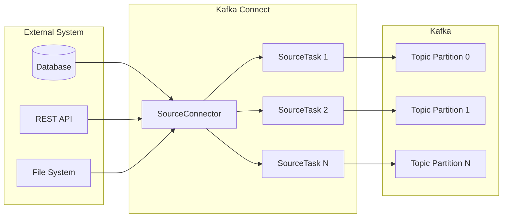

# How to Create Kafka Connect Source Connector Custom

Author: [nawazdhandala](https://github.com/nawazdhandala)

Tags: Kafka, Connect, Connectors, Integration

Description: Build custom Kafka Connect source connectors to ingest data from any system with proper offset management and configuration handling.

---

Kafka Connect provides a framework for streaming data between Apache Kafka and external systems. While dozens of pre-built connectors exist, you will eventually need to build a custom connector for a proprietary system or unique data source. This guide walks through building a production-ready source connector from scratch.

## Understanding Source Connectors

A source connector pulls data from an external system and publishes it to Kafka topics. The connector framework handles parallelism, offset tracking, and fault tolerance. You focus on the data extraction logic.



### Connector Architecture Components

| Component | Responsibility |
|-----------|---------------|
| SourceConnector | Configuration validation, task creation, task configuration distribution |
| SourceTask | Data polling, record creation, offset tracking |
| SourceRecord | Single data record with topic, partition, key, value, and offset |
| Converter | Serialization of keys and values (JSON, Avro, Protobuf) |

## Project Setup

Create a Maven project with the required dependencies.

```xml
<?xml version="1.0" encoding="UTF-8"?>
<project xmlns="http://maven.apache.org/POM/4.0.0"
         xmlns:xsi="http://www.w3.org/2001/XMLSchema-instance"
         xsi:schemaLocation="http://maven.apache.org/POM/4.0.0
         http://maven.apache.org/xsd/maven-4.0.0.xsd">
    <modelVersion>4.0.0</modelVersion>

    <groupId>com.example</groupId>
    <artifactId>custom-source-connector</artifactId>
    <version>1.0.0</version>
    <packaging>jar</packaging>

    <properties>
        <java.version>11</java.version>
        <kafka.version>3.6.0</kafka.version>
        <maven.compiler.source>${java.version}</maven.compiler.source>
        <maven.compiler.target>${java.version}</maven.compiler.target>
    </properties>

    <dependencies>
        <!-- Kafka Connect API - provided by the runtime -->
        <dependency>
            <groupId>org.apache.kafka</groupId>
            <artifactId>connect-api</artifactId>
            <version>${kafka.version}</version>
            <scope>provided</scope>
        </dependency>

        <!-- JSON processing for our example data source -->
        <dependency>
            <groupId>com.fasterxml.jackson.core</groupId>
            <artifactId>jackson-databind</artifactId>
            <version>2.15.2</version>
        </dependency>

        <!-- HTTP client for REST API data source -->
        <dependency>
            <groupId>org.apache.httpcomponents.client5</groupId>
            <artifactId>httpclient5</artifactId>
            <version>5.2.1</version>
        </dependency>

        <!-- Testing -->
        <dependency>
            <groupId>junit</groupId>
            <artifactId>junit</artifactId>
            <version>4.13.2</version>
            <scope>test</scope>
        </dependency>

        <dependency>
            <groupId>org.mockito</groupId>
            <artifactId>mockito-core</artifactId>
            <version>5.5.0</version>
            <scope>test</scope>
        </dependency>
    </dependencies>

    <build>
        <plugins>
            <!-- Package all dependencies into a single JAR -->
            <plugin>
                <groupId>org.apache.maven.plugins</groupId>
                <artifactId>maven-shade-plugin</artifactId>
                <version>3.5.0</version>
                <executions>
                    <execution>
                        <phase>package</phase>
                        <goals>
                            <goal>shade</goal>
                        </goals>
                        <configuration>
                            <transformers>
                                <transformer implementation="org.apache.maven.plugins.shade.resource.ManifestResourceTransformer">
                                    <mainClass>com.example.connector.ApiSourceConnector</mainClass>
                                </transformer>
                            </transformers>
                        </configuration>
                    </execution>
                </executions>
            </plugin>
        </plugins>
    </build>
</project>
```

## Implementing the SourceConnector Class

The SourceConnector class handles lifecycle management and configuration. It does not fetch data directly, but creates and configures tasks that do the actual work.

```java
package com.example.connector;

import org.apache.kafka.common.config.ConfigDef;
import org.apache.kafka.common.config.ConfigException;
import org.apache.kafka.connect.connector.Task;
import org.apache.kafka.connect.source.SourceConnector;
import org.slf4j.Logger;
import org.slf4j.LoggerFactory;

import java.util.ArrayList;
import java.util.HashMap;
import java.util.List;
import java.util.Map;

/**
 * ApiSourceConnector manages the lifecycle of source tasks that pull data
 * from an external REST API. The connector validates configuration and
 * distributes work across multiple tasks for parallelism.
 */
public class ApiSourceConnector extends SourceConnector {

    private static final Logger log = LoggerFactory.getLogger(ApiSourceConnector.class);

    // Store the original configuration for task creation
    private Map<String, String> configProperties;

    /**
     * Returns the version of this connector. Used for logging and monitoring.
     */
    @Override
    public String version() {
        return "1.0.0";
    }

    /**
     * Called when the connector starts. Validate and store the configuration.
     * This method should fail fast if configuration is invalid.
     */
    @Override
    public void start(Map<String, String> props) {
        log.info("Starting ApiSourceConnector with config: {}", props);

        // Validate configuration before storing
        try {
            new ApiSourceConnectorConfig(props);
        } catch (ConfigException e) {
            throw new ConfigException("Invalid connector configuration", e);
        }

        this.configProperties = props;
    }

    /**
     * Returns the Task class that performs the actual data fetching.
     */
    @Override
    public Class<? extends Task> taskClass() {
        return ApiSourceTask.class;
    }

    /**
     * Creates configuration for each task. The number of tasks is determined
     * by the tasks.max configuration. Each task can handle different partitions
     * or endpoints of the data source.
     */
    @Override
    public List<Map<String, String>> taskConfigs(int maxTasks) {
        log.info("Creating {} task configurations", maxTasks);

        List<Map<String, String>> taskConfigs = new ArrayList<>();

        // Get the endpoints to distribute across tasks
        String endpoints = configProperties.get(ApiSourceConnectorConfig.API_ENDPOINTS_CONFIG);
        String[] endpointList = endpoints.split(",");

        // Distribute endpoints across tasks
        // If we have more tasks than endpoints, some tasks will be idle
        // If we have more endpoints than tasks, some tasks will handle multiple endpoints
        for (int i = 0; i < maxTasks; i++) {
            Map<String, String> taskConfig = new HashMap<>(configProperties);

            // Calculate which endpoints this task handles
            List<String> taskEndpoints = new ArrayList<>();
            for (int j = i; j < endpointList.length; j += maxTasks) {
                taskEndpoints.add(endpointList[j].trim());
            }

            if (!taskEndpoints.isEmpty()) {
                taskConfig.put(ApiSourceConnectorConfig.TASK_ENDPOINTS_CONFIG,
                    String.join(",", taskEndpoints));
                taskConfig.put(ApiSourceConnectorConfig.TASK_ID_CONFIG, String.valueOf(i));
                taskConfigs.add(taskConfig);
            }
        }

        return taskConfigs;
    }

    /**
     * Called when the connector is stopped. Clean up any resources.
     */
    @Override
    public void stop() {
        log.info("Stopping ApiSourceConnector");
        // Nothing to clean up in this example
    }

    /**
     * Returns the configuration definition for this connector.
     * Kafka Connect uses this for validation and documentation.
     */
    @Override
    public ConfigDef config() {
        return ApiSourceConnectorConfig.CONFIG_DEF;
    }
}
```

## Defining Connector Configuration

Configuration definitions provide validation, documentation, and default values. Define all configuration options in a dedicated class.

```java
package com.example.connector;

import org.apache.kafka.common.config.AbstractConfig;
import org.apache.kafka.common.config.ConfigDef;
import org.apache.kafka.common.config.ConfigDef.Importance;
import org.apache.kafka.common.config.ConfigDef.Type;
import org.apache.kafka.common.config.ConfigDef.Width;

import java.util.Map;

/**
 * Configuration class for the API Source Connector.
 * Defines all configuration options with validation, defaults, and documentation.
 */
public class ApiSourceConnectorConfig extends AbstractConfig {

    // API connection settings
    public static final String API_BASE_URL_CONFIG = "api.base.url";
    private static final String API_BASE_URL_DOC = "Base URL for the REST API";

    public static final String API_ENDPOINTS_CONFIG = "api.endpoints";
    private static final String API_ENDPOINTS_DOC = "Comma-separated list of API endpoints to poll";

    public static final String API_KEY_CONFIG = "api.key";
    private static final String API_KEY_DOC = "API key for authentication";

    // Polling settings
    public static final String POLL_INTERVAL_MS_CONFIG = "poll.interval.ms";
    private static final String POLL_INTERVAL_MS_DOC = "Interval between polls in milliseconds";
    private static final long POLL_INTERVAL_MS_DEFAULT = 5000L;

    public static final String BATCH_SIZE_CONFIG = "batch.size";
    private static final String BATCH_SIZE_DOC = "Maximum number of records to fetch per poll";
    private static final int BATCH_SIZE_DEFAULT = 100;

    // Kafka settings
    public static final String TOPIC_PREFIX_CONFIG = "topic.prefix";
    private static final String TOPIC_PREFIX_DOC = "Prefix for Kafka topic names";
    private static final String TOPIC_PREFIX_DEFAULT = "api-data-";

    // Connection settings
    public static final String CONNECTION_TIMEOUT_MS_CONFIG = "connection.timeout.ms";
    private static final String CONNECTION_TIMEOUT_MS_DOC = "HTTP connection timeout in milliseconds";
    private static final int CONNECTION_TIMEOUT_MS_DEFAULT = 30000;

    public static final String REQUEST_TIMEOUT_MS_CONFIG = "request.timeout.ms";
    private static final String REQUEST_TIMEOUT_MS_DOC = "HTTP request timeout in milliseconds";
    private static final int REQUEST_TIMEOUT_MS_DEFAULT = 60000;

    // Retry settings
    public static final String MAX_RETRIES_CONFIG = "max.retries";
    private static final String MAX_RETRIES_DOC = "Maximum number of retries for failed requests";
    private static final int MAX_RETRIES_DEFAULT = 3;

    public static final String RETRY_BACKOFF_MS_CONFIG = "retry.backoff.ms";
    private static final String RETRY_BACKOFF_MS_DOC = "Time to wait between retries in milliseconds";
    private static final long RETRY_BACKOFF_MS_DEFAULT = 1000L;

    // Internal task configuration (not user-configurable)
    public static final String TASK_ENDPOINTS_CONFIG = "task.endpoints";
    public static final String TASK_ID_CONFIG = "task.id";

    // Configuration definition with groups for better organization
    public static final ConfigDef CONFIG_DEF = new ConfigDef()
        // API Connection group
        .define(
            API_BASE_URL_CONFIG,
            Type.STRING,
            ConfigDef.NO_DEFAULT_VALUE,
            Importance.HIGH,
            API_BASE_URL_DOC,
            "API Connection",
            1,
            Width.LONG,
            "API Base URL"
        )
        .define(
            API_ENDPOINTS_CONFIG,
            Type.STRING,
            ConfigDef.NO_DEFAULT_VALUE,
            Importance.HIGH,
            API_ENDPOINTS_DOC,
            "API Connection",
            2,
            Width.LONG,
            "API Endpoints"
        )
        .define(
            API_KEY_CONFIG,
            Type.PASSWORD,
            "",
            Importance.HIGH,
            API_KEY_DOC,
            "API Connection",
            3,
            Width.LONG,
            "API Key"
        )
        // Polling group
        .define(
            POLL_INTERVAL_MS_CONFIG,
            Type.LONG,
            POLL_INTERVAL_MS_DEFAULT,
            ConfigDef.Range.atLeast(100),
            Importance.MEDIUM,
            POLL_INTERVAL_MS_DOC,
            "Polling",
            1,
            Width.SHORT,
            "Poll Interval (ms)"
        )
        .define(
            BATCH_SIZE_CONFIG,
            Type.INT,
            BATCH_SIZE_DEFAULT,
            ConfigDef.Range.between(1, 10000),
            Importance.MEDIUM,
            BATCH_SIZE_DOC,
            "Polling",
            2,
            Width.SHORT,
            "Batch Size"
        )
        // Kafka group
        .define(
            TOPIC_PREFIX_CONFIG,
            Type.STRING,
            TOPIC_PREFIX_DEFAULT,
            Importance.MEDIUM,
            TOPIC_PREFIX_DOC,
            "Kafka",
            1,
            Width.MEDIUM,
            "Topic Prefix"
        )
        // Connection group
        .define(
            CONNECTION_TIMEOUT_MS_CONFIG,
            Type.INT,
            CONNECTION_TIMEOUT_MS_DEFAULT,
            ConfigDef.Range.atLeast(1000),
            Importance.LOW,
            CONNECTION_TIMEOUT_MS_DOC,
            "Connection",
            1,
            Width.SHORT,
            "Connection Timeout"
        )
        .define(
            REQUEST_TIMEOUT_MS_CONFIG,
            Type.INT,
            REQUEST_TIMEOUT_MS_DEFAULT,
            ConfigDef.Range.atLeast(1000),
            Importance.LOW,
            REQUEST_TIMEOUT_MS_DOC,
            "Connection",
            2,
            Width.SHORT,
            "Request Timeout"
        )
        // Retry group
        .define(
            MAX_RETRIES_CONFIG,
            Type.INT,
            MAX_RETRIES_DEFAULT,
            ConfigDef.Range.between(0, 10),
            Importance.LOW,
            MAX_RETRIES_DOC,
            "Retries",
            1,
            Width.SHORT,
            "Max Retries"
        )
        .define(
            RETRY_BACKOFF_MS_CONFIG,
            Type.LONG,
            RETRY_BACKOFF_MS_DEFAULT,
            ConfigDef.Range.atLeast(0),
            Importance.LOW,
            RETRY_BACKOFF_MS_DOC,
            "Retries",
            2,
            Width.SHORT,
            "Retry Backoff"
        );

    public ApiSourceConnectorConfig(Map<String, String> props) {
        super(CONFIG_DEF, props);
    }

    // Convenience getters for type-safe access
    public String getApiBaseUrl() {
        return getString(API_BASE_URL_CONFIG);
    }

    public String getApiEndpoints() {
        return getString(API_ENDPOINTS_CONFIG);
    }

    public String getApiKey() {
        return getPassword(API_KEY_CONFIG).value();
    }

    public long getPollIntervalMs() {
        return getLong(POLL_INTERVAL_MS_CONFIG);
    }

    public int getBatchSize() {
        return getInt(BATCH_SIZE_CONFIG);
    }

    public String getTopicPrefix() {
        return getString(TOPIC_PREFIX_CONFIG);
    }

    public int getConnectionTimeoutMs() {
        return getInt(CONNECTION_TIMEOUT_MS_CONFIG);
    }

    public int getRequestTimeoutMs() {
        return getInt(REQUEST_TIMEOUT_MS_CONFIG);
    }

    public int getMaxRetries() {
        return getInt(MAX_RETRIES_CONFIG);
    }

    public long getRetryBackoffMs() {
        return getLong(RETRY_BACKOFF_MS_CONFIG);
    }
}
```

## Implementing the SourceTask Class

The SourceTask performs the actual data fetching. It runs in a loop, polling the external system and returning records to the Kafka Connect framework.

```java
package com.example.connector;

import com.fasterxml.jackson.databind.JsonNode;
import com.fasterxml.jackson.databind.ObjectMapper;
import org.apache.kafka.connect.data.Schema;
import org.apache.kafka.connect.data.SchemaBuilder;
import org.apache.kafka.connect.data.Struct;
import org.apache.kafka.connect.source.SourceRecord;
import org.apache.kafka.connect.source.SourceTask;
import org.slf4j.Logger;
import org.slf4j.LoggerFactory;

import java.net.URI;
import java.net.http.HttpClient;
import java.net.http.HttpRequest;
import java.net.http.HttpResponse;
import java.time.Duration;
import java.util.ArrayList;
import java.util.Collections;
import java.util.HashMap;
import java.util.List;
import java.util.Map;

/**
 * ApiSourceTask fetches data from REST API endpoints and creates SourceRecords.
 * Each task handles one or more endpoints, polling them at configured intervals.
 */
public class ApiSourceTask extends SourceTask {

    private static final Logger log = LoggerFactory.getLogger(ApiSourceTask.class);

    // Schema for the data we produce
    private static final Schema VALUE_SCHEMA = SchemaBuilder.struct()
        .name("com.example.ApiRecord")
        .field("id", Schema.STRING_SCHEMA)
        .field("timestamp", Schema.INT64_SCHEMA)
        .field("endpoint", Schema.STRING_SCHEMA)
        .field("data", Schema.STRING_SCHEMA)
        .build();

    private static final Schema KEY_SCHEMA = Schema.STRING_SCHEMA;

    private ApiSourceConnectorConfig config;
    private HttpClient httpClient;
    private ObjectMapper objectMapper;
    private String[] endpoints;
    private String taskId;
    private long lastPollTime;

    // Track offsets per endpoint
    private Map<String, Long> endpointOffsets;

    @Override
    public String version() {
        return "1.0.0";
    }

    /**
     * Initialize the task with configuration. Set up HTTP client and
     * restore any previously committed offsets.
     */
    @Override
    public void start(Map<String, String> props) {
        log.info("Starting ApiSourceTask with config: {}", props);

        config = new ApiSourceConnectorConfig(props);
        taskId = props.get(ApiSourceConnectorConfig.TASK_ID_CONFIG);

        // Parse endpoints assigned to this task
        String endpointConfig = props.get(ApiSourceConnectorConfig.TASK_ENDPOINTS_CONFIG);
        endpoints = endpointConfig != null ? endpointConfig.split(",") : new String[0];

        log.info("Task {} handling endpoints: {}", taskId, String.join(", ", endpoints));

        // Initialize HTTP client with timeouts
        httpClient = HttpClient.newBuilder()
            .connectTimeout(Duration.ofMillis(config.getConnectionTimeoutMs()))
            .build();

        objectMapper = new ObjectMapper();
        endpointOffsets = new HashMap<>();
        lastPollTime = 0;

        // Restore offsets from Kafka Connect's offset storage
        restoreOffsets();
    }

    /**
     * Restore previously committed offsets. This allows the connector to
     * resume from where it left off after a restart.
     */
    private void restoreOffsets() {
        for (String endpoint : endpoints) {
            Map<String, Object> sourcePartition = createSourcePartition(endpoint);
            Map<String, Object> storedOffset = context.offsetStorageReader()
                .offset(sourcePartition);

            if (storedOffset != null && storedOffset.containsKey("position")) {
                long position = (Long) storedOffset.get("position");
                endpointOffsets.put(endpoint, position);
                log.info("Restored offset for endpoint {}: {}", endpoint, position);
            } else {
                endpointOffsets.put(endpoint, 0L);
                log.info("No stored offset for endpoint {}, starting from 0", endpoint);
            }
        }
    }

    /**
     * Poll for new data. This method is called repeatedly by the framework.
     * Returns an empty list if no data is available or if not enough time
     * has passed since the last poll.
     */
    @Override
    public List<SourceRecord> poll() throws InterruptedException {
        // Respect poll interval to avoid hammering the API
        long currentTime = System.currentTimeMillis();
        long timeSinceLastPoll = currentTime - lastPollTime;

        if (timeSinceLastPoll < config.getPollIntervalMs()) {
            Thread.sleep(config.getPollIntervalMs() - timeSinceLastPoll);
        }

        lastPollTime = System.currentTimeMillis();
        List<SourceRecord> records = new ArrayList<>();

        // Poll each endpoint assigned to this task
        for (String endpoint : endpoints) {
            try {
                List<SourceRecord> endpointRecords = pollEndpoint(endpoint);
                records.addAll(endpointRecords);
            } catch (Exception e) {
                log.error("Error polling endpoint {}: {}", endpoint, e.getMessage());
                // Continue with other endpoints, don't fail the entire poll
            }
        }

        log.debug("Poll returning {} records", records.size());
        return records;
    }

    /**
     * Poll a single endpoint for new data. Uses the stored offset to fetch
     * only new records.
     */
    private List<SourceRecord> pollEndpoint(String endpoint) throws Exception {
        List<SourceRecord> records = new ArrayList<>();
        long currentOffset = endpointOffsets.getOrDefault(endpoint, 0L);

        // Build the API URL with offset parameter
        String url = String.format("%s%s?offset=%d&limit=%d",
            config.getApiBaseUrl(),
            endpoint,
            currentOffset,
            config.getBatchSize());

        log.debug("Fetching from URL: {}", url);

        // Build HTTP request with authentication
        HttpRequest.Builder requestBuilder = HttpRequest.newBuilder()
            .uri(URI.create(url))
            .timeout(Duration.ofMillis(config.getRequestTimeoutMs()))
            .GET();

        // Add API key header if configured
        String apiKey = config.getApiKey();
        if (apiKey != null && !apiKey.isEmpty()) {
            requestBuilder.header("Authorization", "Bearer " + apiKey);
        }
        requestBuilder.header("Accept", "application/json");

        HttpRequest request = requestBuilder.build();

        // Execute request with retries
        HttpResponse<String> response = executeWithRetries(request);

        if (response.statusCode() != 200) {
            log.warn("API returned status {}: {}", response.statusCode(), response.body());
            return records;
        }

        // Parse response and create records
        JsonNode root = objectMapper.readTree(response.body());
        JsonNode dataArray = root.path("data");

        if (dataArray.isArray()) {
            for (JsonNode item : dataArray) {
                SourceRecord record = createRecord(endpoint, item, currentOffset);
                records.add(record);
                currentOffset++;
            }
        }

        // Update the offset for this endpoint
        endpointOffsets.put(endpoint, currentOffset);

        return records;
    }

    /**
     * Execute an HTTP request with retry logic for transient failures.
     */
    private HttpResponse<String> executeWithRetries(HttpRequest request) throws Exception {
        int attempts = 0;
        Exception lastException = null;

        while (attempts <= config.getMaxRetries()) {
            try {
                return httpClient.send(request, HttpResponse.BodyHandlers.ofString());
            } catch (Exception e) {
                lastException = e;
                attempts++;

                if (attempts <= config.getMaxRetries()) {
                    long backoff = config.getRetryBackoffMs() * attempts;
                    log.warn("Request failed, retrying in {}ms (attempt {}/{}): {}",
                        backoff, attempts, config.getMaxRetries(), e.getMessage());
                    Thread.sleep(backoff);
                }
            }
        }

        throw lastException;
    }

    /**
     * Create a SourceRecord from API data. The record includes partition
     * and offset information for exactly-once semantics.
     */
    private SourceRecord createRecord(String endpoint, JsonNode item, long offset) {
        // Source partition identifies where this data came from
        Map<String, Object> sourcePartition = createSourcePartition(endpoint);

        // Source offset tracks our position in the data source
        Map<String, Object> sourceOffset = new HashMap<>();
        sourceOffset.put("position", offset + 1);

        // Extract fields from the JSON
        String id = item.path("id").asText();
        long timestamp = item.has("timestamp")
            ? item.path("timestamp").asLong()
            : System.currentTimeMillis();

        // Build the value struct
        Struct value = new Struct(VALUE_SCHEMA)
            .put("id", id)
            .put("timestamp", timestamp)
            .put("endpoint", endpoint)
            .put("data", item.toString());

        // Determine the target topic
        String topic = config.getTopicPrefix() + endpoint.replace("/", "-").replaceFirst("^-", "");

        return new SourceRecord(
            sourcePartition,
            sourceOffset,
            topic,
            null,  // partition - let Kafka decide
            KEY_SCHEMA,
            id,
            VALUE_SCHEMA,
            value,
            timestamp
        );
    }

    /**
     * Create a source partition map that uniquely identifies this data source.
     */
    private Map<String, Object> createSourcePartition(String endpoint) {
        Map<String, Object> partition = new HashMap<>();
        partition.put("api", config.getApiBaseUrl());
        partition.put("endpoint", endpoint);
        return partition;
    }

    /**
     * Called when the task is stopped. Clean up any resources.
     */
    @Override
    public void stop() {
        log.info("Stopping ApiSourceTask {}", taskId);
        // HttpClient doesn't need explicit closing in Java 11+
    }
}
```

## Offset Management Patterns

Proper offset management ensures data is not lost or duplicated. Here are different strategies depending on your data source.

### Timestamp-Based Offsets

Use this pattern when your data source provides timestamps.

```java
/**
 * Timestamp-based offset tracking. Useful when the data source
 * orders records by timestamp.
 */
public class TimestampOffsetTracker {

    private final Map<String, Long> lastTimestamps = new HashMap<>();

    /**
     * Creates a source offset based on the record timestamp.
     */
    public Map<String, Object> createOffset(String partition, long timestamp) {
        Map<String, Object> offset = new HashMap<>();
        offset.put("timestamp", timestamp);
        return offset;
    }

    /**
     * Restores the last processed timestamp from stored offsets.
     */
    public long restoreTimestamp(SourceTaskContext context, Map<String, Object> partition) {
        Map<String, Object> stored = context.offsetStorageReader().offset(partition);

        if (stored != null && stored.containsKey("timestamp")) {
            return (Long) stored.get("timestamp");
        }

        // Default to 24 hours ago if no offset exists
        return System.currentTimeMillis() - Duration.ofHours(24).toMillis();
    }

    /**
     * Updates the offset after successfully processing a record.
     */
    public void updateOffset(String partition, long timestamp) {
        lastTimestamps.put(partition, Math.max(
            lastTimestamps.getOrDefault(partition, 0L),
            timestamp
        ));
    }
}
```

### Sequence-Based Offsets

Use this pattern when your data source provides sequential IDs.

```java
/**
 * Sequence-based offset tracking. Useful for database tables
 * with auto-incrementing primary keys.
 */
public class SequenceOffsetTracker {

    /**
     * Creates a source offset based on the sequence ID.
     */
    public Map<String, Object> createOffset(long sequenceId) {
        Map<String, Object> offset = new HashMap<>();
        offset.put("sequence_id", sequenceId);
        return offset;
    }

    /**
     * Builds a query to fetch records after the stored offset.
     */
    public String buildIncrementalQuery(String table, String idColumn, long lastId, int limit) {
        return String.format(
            "SELECT * FROM %s WHERE %s > %d ORDER BY %s LIMIT %d",
            table, idColumn, lastId, idColumn, limit
        );
    }
}
```

### Composite Offsets

Use this pattern when you need to track multiple dimensions.

```java
/**
 * Composite offset tracking for complex data sources that require
 * tracking multiple offset dimensions.
 */
public class CompositeOffsetTracker {

    /**
     * Creates a composite offset with multiple tracking dimensions.
     */
    public Map<String, Object> createOffset(
            long sequenceId,
            long timestamp,
            String checksum) {

        Map<String, Object> offset = new HashMap<>();
        offset.put("sequence_id", sequenceId);
        offset.put("timestamp", timestamp);
        offset.put("checksum", checksum);
        return offset;
    }

    /**
     * Validates that records haven't been modified since last poll.
     * Useful for detecting data source issues.
     */
    public boolean validateContinuity(
            Map<String, Object> previousOffset,
            Map<String, Object> currentOffset) {

        if (previousOffset == null) {
            return true;
        }

        long prevSeq = (Long) previousOffset.get("sequence_id");
        long currSeq = (Long) currentOffset.get("sequence_id");

        // Sequence IDs should be monotonically increasing
        return currSeq > prevSeq;
    }
}
```

## Connector Packaging

Package the connector for deployment to Kafka Connect.

### Create the Connector Manifest

The manifest file tells Kafka Connect about your connector.

```properties
# src/main/resources/META-INF/services/org.apache.kafka.connect.source.SourceConnector
com.example.connector.ApiSourceConnector
```

### Build the Package

```bash
# Build the shaded JAR with all dependencies
mvn clean package

# The output JAR will be in target/custom-source-connector-1.0.0.jar
```

### Create a Connect Plugin Directory

```bash
# Create the plugin directory structure
mkdir -p /opt/kafka-connect/plugins/custom-source-connector

# Copy the JAR to the plugin directory
cp target/custom-source-connector-1.0.0.jar \
   /opt/kafka-connect/plugins/custom-source-connector/

# If you have additional dependencies not in the shaded JAR
# cp additional-dependency.jar /opt/kafka-connect/plugins/custom-source-connector/
```

### Configure Kafka Connect to Load the Plugin

Add the plugin path to your Connect worker configuration.

```properties
# connect-distributed.properties or connect-standalone.properties
plugin.path=/opt/kafka-connect/plugins
```

## Deploying and Running the Connector

### Standalone Mode (Development)

Create a connector properties file for standalone mode.

```properties
# api-source-connector.properties
name=api-source-connector
connector.class=com.example.connector.ApiSourceConnector
tasks.max=3

# API configuration
api.base.url=https://api.example.com
api.endpoints=/users,/orders,/products
api.key=${file:/opt/kafka-connect/secrets/api-key.txt:api_key}

# Polling configuration
poll.interval.ms=10000
batch.size=100

# Topic configuration
topic.prefix=api-data-

# Connection settings
connection.timeout.ms=30000
request.timeout.ms=60000

# Retry settings
max.retries=3
retry.backoff.ms=1000
```

Run in standalone mode.

```bash
# Start Kafka Connect in standalone mode
connect-standalone.sh \
    /opt/kafka/config/connect-standalone.properties \
    /opt/kafka-connect/config/api-source-connector.properties
```

### Distributed Mode (Production)

Create the connector using the REST API.

```bash
# Create connector via REST API
curl -X POST http://localhost:8083/connectors \
  -H "Content-Type: application/json" \
  -d '{
    "name": "api-source-connector",
    "config": {
      "connector.class": "com.example.connector.ApiSourceConnector",
      "tasks.max": "3",
      "api.base.url": "https://api.example.com",
      "api.endpoints": "/users,/orders,/products",
      "api.key": "${file:/opt/kafka-connect/secrets/api-key.txt:api_key}",
      "poll.interval.ms": "10000",
      "batch.size": "100",
      "topic.prefix": "api-data-",
      "connection.timeout.ms": "30000",
      "request.timeout.ms": "60000",
      "max.retries": "3",
      "retry.backoff.ms": "1000",
      "key.converter": "org.apache.kafka.connect.storage.StringConverter",
      "value.converter": "org.apache.kafka.connect.json.JsonConverter",
      "value.converter.schemas.enable": "true"
    }
  }'
```

### Check Connector Status

```bash
# List all connectors
curl http://localhost:8083/connectors

# Get connector status
curl http://localhost:8083/connectors/api-source-connector/status

# Get connector configuration
curl http://localhost:8083/connectors/api-source-connector/config

# Restart a failed task
curl -X POST http://localhost:8083/connectors/api-source-connector/tasks/0/restart
```

## Testing Your Connector

### Unit Tests for the Task

```java
package com.example.connector;

import org.apache.kafka.connect.source.SourceRecord;
import org.apache.kafka.connect.source.SourceTaskContext;
import org.apache.kafka.connect.storage.OffsetStorageReader;
import org.junit.Before;
import org.junit.Test;
import org.mockito.Mock;
import org.mockito.MockitoAnnotations;

import java.util.HashMap;
import java.util.List;
import java.util.Map;

import static org.junit.Assert.*;
import static org.mockito.Mockito.*;

public class ApiSourceTaskTest {

    private ApiSourceTask task;

    @Mock
    private SourceTaskContext context;

    @Mock
    private OffsetStorageReader offsetReader;

    @Before
    public void setUp() {
        MockitoAnnotations.openMocks(this);

        task = new ApiSourceTask();
        task.initialize(context);

        when(context.offsetStorageReader()).thenReturn(offsetReader);
        when(offsetReader.offset(any())).thenReturn(null);
    }

    @Test
    public void testStartInitializesCorrectly() {
        Map<String, String> props = createTestConfig();

        task.start(props);

        assertEquals("1.0.0", task.version());
    }

    @Test
    public void testOffsetRestoration() {
        Map<String, String> props = createTestConfig();

        // Simulate stored offset
        Map<String, Object> storedOffset = new HashMap<>();
        storedOffset.put("position", 100L);
        when(offsetReader.offset(any())).thenReturn(storedOffset);

        task.start(props);

        // The task should resume from position 100
        // Verify by checking logs or internal state
    }

    @Test
    public void testPollReturnsEmptyWhenNoData() throws InterruptedException {
        Map<String, String> props = createTestConfig();
        // Configure with a mock API that returns empty data

        task.start(props);
        List<SourceRecord> records = task.poll();

        // Should return empty list, not null
        assertNotNull(records);
    }

    @Test
    public void testRecordSchemaIsValid() {
        Map<String, String> props = createTestConfig();
        task.start(props);

        // Create a test record and verify schema
        // This would require mocking the HTTP response
    }

    private Map<String, String> createTestConfig() {
        Map<String, String> props = new HashMap<>();
        props.put(ApiSourceConnectorConfig.API_BASE_URL_CONFIG, "http://localhost:8080");
        props.put(ApiSourceConnectorConfig.API_ENDPOINTS_CONFIG, "/test");
        props.put(ApiSourceConnectorConfig.TASK_ENDPOINTS_CONFIG, "/test");
        props.put(ApiSourceConnectorConfig.TASK_ID_CONFIG, "0");
        props.put(ApiSourceConnectorConfig.POLL_INTERVAL_MS_CONFIG, "100");
        return props;
    }
}
```

### Integration Tests with Embedded Kafka

```java
package com.example.connector;

import org.apache.kafka.clients.consumer.ConsumerConfig;
import org.apache.kafka.clients.consumer.ConsumerRecord;
import org.apache.kafka.clients.consumer.ConsumerRecords;
import org.apache.kafka.clients.consumer.KafkaConsumer;
import org.apache.kafka.common.serialization.StringDeserializer;
import org.apache.kafka.connect.json.JsonDeserializer;
import org.junit.ClassRule;
import org.junit.Test;
import org.testcontainers.containers.KafkaContainer;
import org.testcontainers.utility.DockerImageName;

import java.time.Duration;
import java.util.Collections;
import java.util.Properties;

import static org.junit.Assert.*;

/**
 * Integration tests using Testcontainers for Kafka.
 */
public class ApiSourceConnectorIntegrationTest {

    @ClassRule
    public static KafkaContainer kafka = new KafkaContainer(
        DockerImageName.parse("confluentinc/cp-kafka:7.4.0")
    );

    @Test
    public void testConnectorProducesRecords() {
        // This test would:
        // 1. Start an embedded Kafka Connect worker
        // 2. Deploy the connector with a mock API
        // 3. Consume records from the target topic
        // 4. Verify the records match expected data

        Properties consumerProps = new Properties();
        consumerProps.put(ConsumerConfig.BOOTSTRAP_SERVERS_CONFIG, kafka.getBootstrapServers());
        consumerProps.put(ConsumerConfig.GROUP_ID_CONFIG, "test-group");
        consumerProps.put(ConsumerConfig.AUTO_OFFSET_RESET_CONFIG, "earliest");
        consumerProps.put(ConsumerConfig.KEY_DESERIALIZER_CLASS_CONFIG, StringDeserializer.class);
        consumerProps.put(ConsumerConfig.VALUE_DESERIALIZER_CLASS_CONFIG, StringDeserializer.class);

        try (KafkaConsumer<String, String> consumer = new KafkaConsumer<>(consumerProps)) {
            consumer.subscribe(Collections.singletonList("api-data-test"));

            ConsumerRecords<String, String> records = consumer.poll(Duration.ofSeconds(30));

            // Verify records were produced
            // assertTrue(records.count() > 0);
        }
    }
}
```

### Configuration Validation Tests

```java
package com.example.connector;

import org.apache.kafka.common.config.ConfigException;
import org.junit.Test;

import java.util.HashMap;
import java.util.Map;

import static org.junit.Assert.*;

public class ApiSourceConnectorConfigTest {

    @Test
    public void testValidConfiguration() {
        Map<String, String> props = new HashMap<>();
        props.put(ApiSourceConnectorConfig.API_BASE_URL_CONFIG, "https://api.example.com");
        props.put(ApiSourceConnectorConfig.API_ENDPOINTS_CONFIG, "/users,/orders");

        ApiSourceConnectorConfig config = new ApiSourceConnectorConfig(props);

        assertEquals("https://api.example.com", config.getApiBaseUrl());
        assertEquals("/users,/orders", config.getApiEndpoints());
        assertEquals(5000L, config.getPollIntervalMs());  // default value
    }

    @Test(expected = ConfigException.class)
    public void testMissingRequiredConfig() {
        Map<String, String> props = new HashMap<>();
        // Missing required api.base.url

        new ApiSourceConnectorConfig(props);
    }

    @Test(expected = ConfigException.class)
    public void testInvalidPollInterval() {
        Map<String, String> props = new HashMap<>();
        props.put(ApiSourceConnectorConfig.API_BASE_URL_CONFIG, "https://api.example.com");
        props.put(ApiSourceConnectorConfig.API_ENDPOINTS_CONFIG, "/users");
        props.put(ApiSourceConnectorConfig.POLL_INTERVAL_MS_CONFIG, "50");  // below minimum

        new ApiSourceConnectorConfig(props);
    }

    @Test
    public void testPasswordConfigIsProtected() {
        Map<String, String> props = new HashMap<>();
        props.put(ApiSourceConnectorConfig.API_BASE_URL_CONFIG, "https://api.example.com");
        props.put(ApiSourceConnectorConfig.API_ENDPOINTS_CONFIG, "/users");
        props.put(ApiSourceConnectorConfig.API_KEY_CONFIG, "secret-api-key");

        ApiSourceConnectorConfig config = new ApiSourceConnectorConfig(props);

        // Password values should not appear in toString
        assertFalse(config.toString().contains("secret-api-key"));
    }
}
```

## Monitoring and Troubleshooting

### JMX Metrics

Kafka Connect exposes metrics via JMX. Add custom metrics to your connector.

```java
import org.apache.kafka.common.metrics.Metrics;
import org.apache.kafka.common.metrics.Sensor;
import org.apache.kafka.common.metrics.stats.CumulativeCount;
import org.apache.kafka.common.metrics.stats.Rate;

/**
 * Custom metrics for monitoring connector performance.
 */
public class ConnectorMetrics {

    private final Sensor recordsSensor;
    private final Sensor errorsSensor;
    private final Sensor latencySensor;

    public ConnectorMetrics(Metrics metrics, String connectorName) {
        // Records processed metric
        recordsSensor = metrics.sensor("records-processed");
        recordsSensor.add(
            metrics.metricName("records-total", "connector-metrics",
                "Total records processed", "connector", connectorName),
            new CumulativeCount()
        );
        recordsSensor.add(
            metrics.metricName("records-per-second", "connector-metrics",
                "Records processed per second", "connector", connectorName),
            new Rate()
        );

        // Error metric
        errorsSensor = metrics.sensor("errors");
        errorsSensor.add(
            metrics.metricName("errors-total", "connector-metrics",
                "Total errors", "connector", connectorName),
            new CumulativeCount()
        );
    }

    public void recordProcessed() {
        recordsSensor.record();
    }

    public void recordError() {
        errorsSensor.record();
    }
}
```

### Common Issues and Solutions

| Issue | Cause | Solution |
|-------|-------|----------|
| Connector stuck in UNASSIGNED | Worker doesn't have the plugin | Check plugin.path configuration |
| Tasks repeatedly failing | Configuration error or API issues | Check task status and logs |
| Duplicate records | Offset not committed before failure | Implement idempotent consumers |
| Missing records | Offset committed before processing | Use source record timestamps |
| Memory issues | Large batch sizes or memory leaks | Reduce batch size, check for leaks |
| Slow throughput | Network latency or rate limiting | Increase tasks.max, tune polling |

### Debugging Commands

```bash
# Check connector plugins loaded
curl http://localhost:8083/connector-plugins

# Get detailed connector status with stack traces
curl http://localhost:8083/connectors/api-source-connector/status | jq

# View Connect worker logs
docker logs kafka-connect 2>&1 | grep -i "api-source"

# Check consumer group lag for the connect offsets topic
kafka-consumer-groups.sh --bootstrap-server localhost:9092 \
    --describe --group connect-api-source-connector

# Verify records in target topic
kafka-console-consumer.sh --bootstrap-server localhost:9092 \
    --topic api-data-users --from-beginning --max-messages 5
```

---

Building a custom Kafka Connect source connector requires implementing the SourceConnector and SourceTask classes, defining proper configuration, managing offsets correctly, and thorough testing. Start with a simple connector that polls a single endpoint, then add parallelism, retry logic, and monitoring as your requirements grow. The framework handles the hard parts of distributed data streaming, letting you focus on the integration logic specific to your data source.
