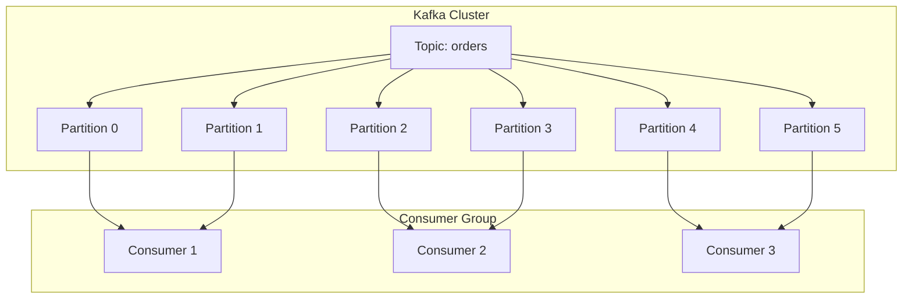
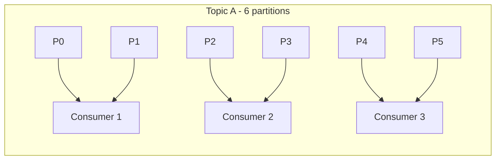
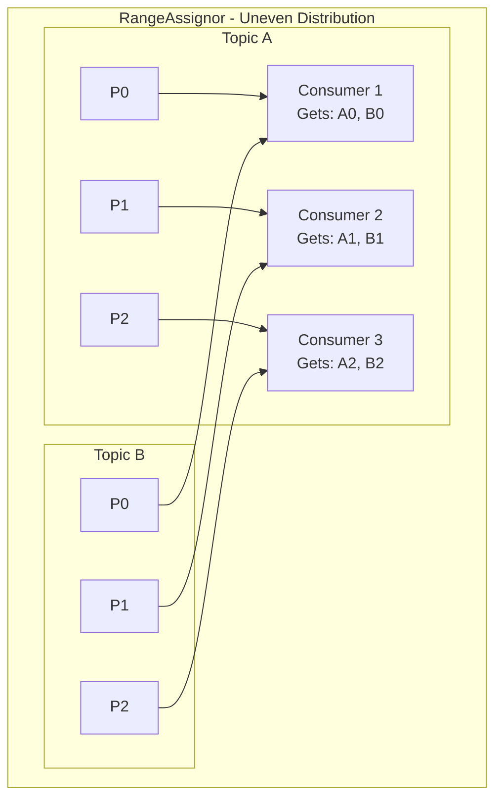
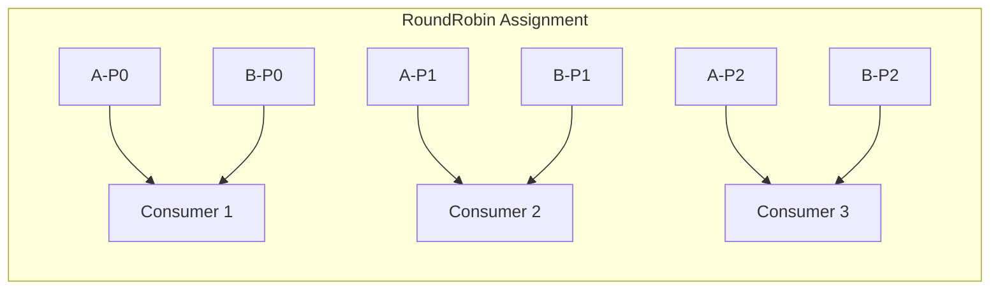
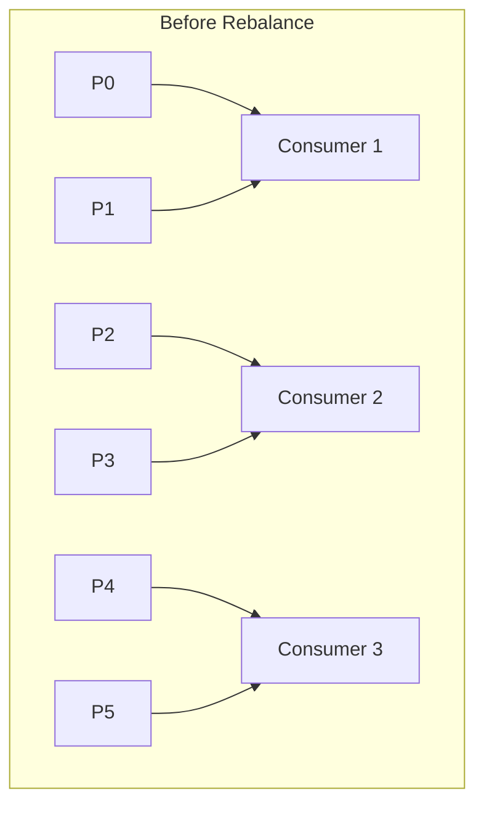
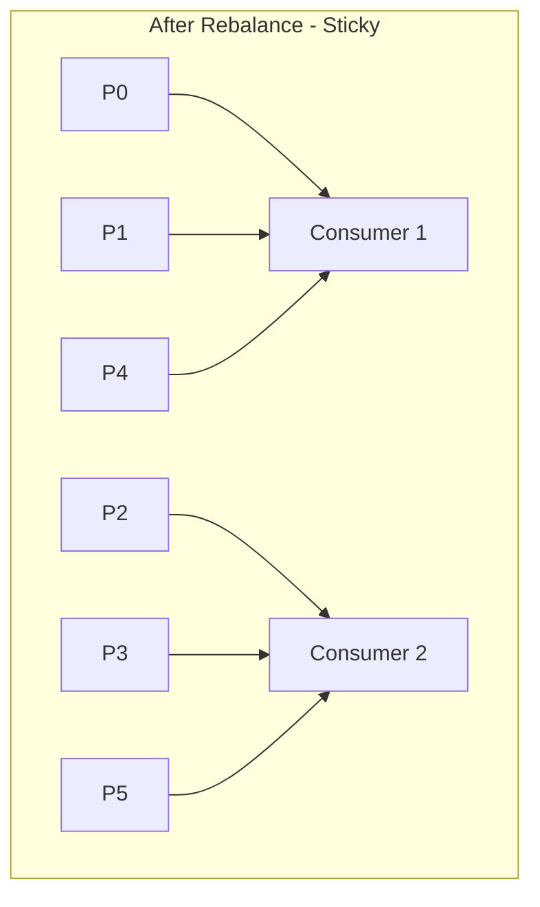
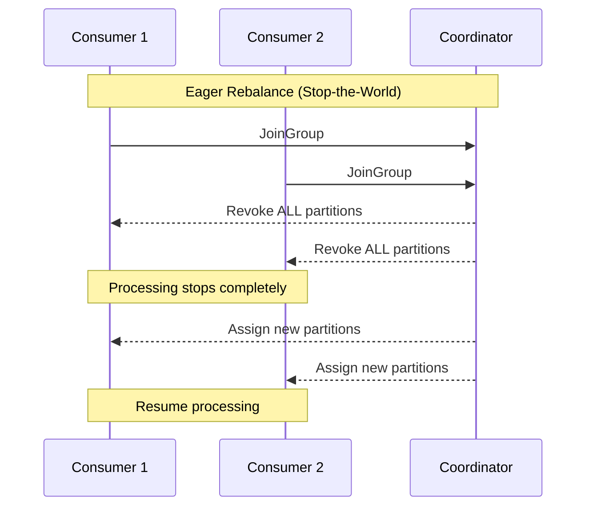
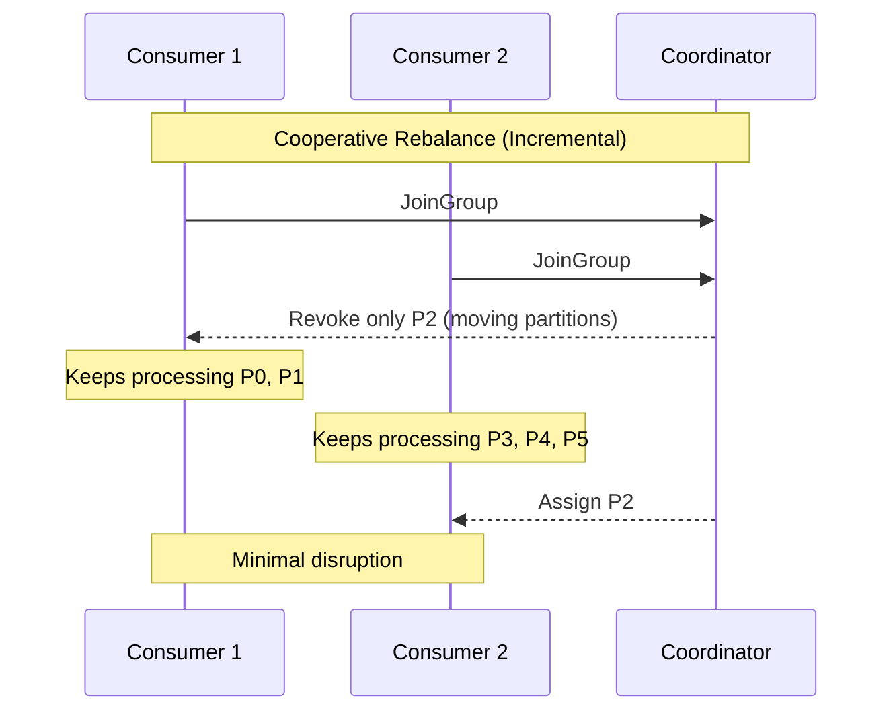
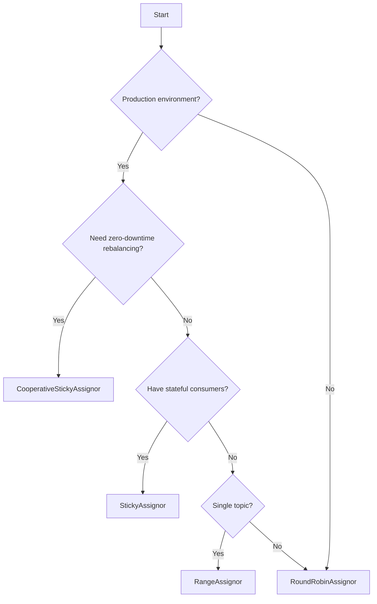

# How to Implement Kafka Consumer Assignment Strategies

Author: [nawazdhandala](https://github.com/nawazdhandala)

Tags: Kafka, Consumers, Partitioning, Distributed Systems

Description: A practical guide to configuring and understanding Kafka partition assignment strategies for optimal consumer group performance.

---

When consumers join a Kafka consumer group, the group coordinator must decide which partitions each consumer will read from. This decision is made by the partition assignment strategy. Choosing the right strategy affects load balancing, rebalance efficiency, and overall throughput.

## Understanding Partition Assignment

Before diving into strategies, let's understand how partition assignment works.



The assignment strategy determines the mapping between partitions and consumers. Each partition is assigned to exactly one consumer within a group, but a consumer can handle multiple partitions.

## The Four Built-in Assignment Strategies

| Strategy | Balance | Sticky | Cooperative | Best For |
|----------|---------|--------|-------------|----------|
| RangeAssignor | Per-topic | No | No | Single topic, simple setups |
| RoundRobinAssignor | Global | No | No | Multi-topic, fresh starts |
| StickyAssignor | Global | Yes | No | Minimizing rebalance impact |
| CooperativeStickyAssignor | Global | Yes | Yes | Production, zero-downtime |

---

## RangeAssignor

The default strategy in Kafka. It assigns partitions on a per-topic basis by dividing partitions into contiguous ranges.

### How It Works



For each topic:
1. Sort partitions by number
2. Sort consumers by member ID
3. Divide partitions evenly, assigning ranges to each consumer

### Configuration (Java)

```java
Properties props = new Properties();
props.put(ConsumerConfig.BOOTSTRAP_SERVERS_CONFIG, "localhost:9092");
props.put(ConsumerConfig.GROUP_ID_CONFIG, "my-group");
props.put(ConsumerConfig.KEY_DESERIALIZER_CLASS_CONFIG, StringDeserializer.class.getName());
props.put(ConsumerConfig.VALUE_DESERIALIZER_CLASS_CONFIG, StringDeserializer.class.getName());

// RangeAssignor is the default, but you can set it explicitly
props.put(ConsumerConfig.PARTITION_ASSIGNMENT_STRATEGY_CONFIG,
    RangeAssignor.class.getName());

KafkaConsumer<String, String> consumer = new KafkaConsumer<>(props);
consumer.subscribe(Arrays.asList("orders", "inventory"));
```

### Configuration (Python)

```python
from kafka import KafkaConsumer

consumer = KafkaConsumer(
    'orders',
    'inventory',
    bootstrap_servers=['localhost:9092'],
    group_id='my-group',
    partition_assignment_strategy=[
        'kafka.coordinator.assignors.range.RangeAssignor'
    ]
)
```

### The Uneven Distribution Problem

RangeAssignor has a significant drawback with multiple topics. Consider 3 consumers subscribing to 2 topics, each with 3 partitions:



This looks balanced, but with 2 topics of 4 partitions each and 3 consumers:

- Consumer 1: A0, A1, B0, B1 (4 partitions)
- Consumer 2: A2, A3, B2, B3 (4 partitions)
- Consumer 3: Nothing extra

If partition counts don't divide evenly, Consumer 1 gets extra partitions from each topic. With many topics, this imbalance compounds.

---

## RoundRobinAssignor

Distributes all partitions across all consumers in a circular fashion, regardless of topic.

### How It Works



1. Collect all partitions from all subscribed topics
2. Sort partitions (topic name + partition number)
3. Sort consumers by member ID
4. Assign partitions round-robin style

### Configuration (Java)

```java
Properties props = new Properties();
props.put(ConsumerConfig.BOOTSTRAP_SERVERS_CONFIG, "localhost:9092");
props.put(ConsumerConfig.GROUP_ID_CONFIG, "my-group");
props.put(ConsumerConfig.KEY_DESERIALIZER_CLASS_CONFIG, StringDeserializer.class.getName());
props.put(ConsumerConfig.VALUE_DESERIALIZER_CLASS_CONFIG, StringDeserializer.class.getName());

props.put(ConsumerConfig.PARTITION_ASSIGNMENT_STRATEGY_CONFIG,
    RoundRobinAssignor.class.getName());

KafkaConsumer<String, String> consumer = new KafkaConsumer<>(props);
```

### Configuration (Spring Boot)

```yaml
spring:
  kafka:
    consumer:
      bootstrap-servers: localhost:9092
      group-id: my-group
      properties:
        partition.assignment.strategy: org.apache.kafka.clients.consumer.RoundRobinAssignor
```

### Limitations

RoundRobinAssignor improves balance but has two problems:

1. **Complete reassignment on rebalance**: When a consumer joins or leaves, all partitions may be reassigned, causing processing interruption
2. **Heterogeneous subscriptions**: If consumers subscribe to different topics, round-robin can produce suboptimal results

---

## StickyAssignor

Introduced in Kafka 0.11, StickyAssignor optimizes for two goals:
1. Balance partitions as evenly as possible
2. Minimize partition movement during rebalances

### How It Works



When Consumer 3 leaves:



Notice that P0, P1 stay with Consumer 1, and P2, P3 stay with Consumer 2. Only P4 and P5 (from the departed consumer) are redistributed.

### Configuration (Java)

```java
Properties props = new Properties();
props.put(ConsumerConfig.BOOTSTRAP_SERVERS_CONFIG, "localhost:9092");
props.put(ConsumerConfig.GROUP_ID_CONFIG, "my-group");
props.put(ConsumerConfig.KEY_DESERIALIZER_CLASS_CONFIG, StringDeserializer.class.getName());
props.put(ConsumerConfig.VALUE_DESERIALIZER_CLASS_CONFIG, StringDeserializer.class.getName());

props.put(ConsumerConfig.PARTITION_ASSIGNMENT_STRATEGY_CONFIG,
    StickyAssignor.class.getName());

KafkaConsumer<String, String> consumer = new KafkaConsumer<>(props);
```

### Configuration (Node.js with kafkajs)

```javascript
const { Kafka } = require('kafkajs');

const kafka = new Kafka({
  clientId: 'my-app',
  brokers: ['localhost:9092']
});

const consumer = kafka.consumer({
  groupId: 'my-group',
  partitionAssignors: [
    // kafkajs uses StickyAssignor by default
    require('kafkajs').PartitionAssignors.roundRobin
  ]
});

// For sticky behavior (default in kafkajs)
const consumerSticky = kafka.consumer({
  groupId: 'my-group'
  // Default assignor is already sticky-like
});
```

### Why Stickiness Matters

Without stickiness, every rebalance can shuffle all partition assignments. This causes:

- **State loss**: If consumers maintain local caches or state based on partition data, complete reassignment invalidates all of it
- **Duplicate processing**: During the rebalance, uncommitted offsets may be processed again by different consumers
- **Increased latency**: Consumers must rebuild state and catch up on new partitions

---

## CooperativeStickyAssignor

The most advanced built-in strategy, available since Kafka 2.4. It combines sticky assignment with cooperative rebalancing.

### Eager vs Cooperative Rebalancing





With cooperative rebalancing, consumers only stop processing the specific partitions being reassigned. Other partitions continue without interruption.

### Configuration (Java)

```java
Properties props = new Properties();
props.put(ConsumerConfig.BOOTSTRAP_SERVERS_CONFIG, "localhost:9092");
props.put(ConsumerConfig.GROUP_ID_CONFIG, "my-group");
props.put(ConsumerConfig.KEY_DESERIALIZER_CLASS_CONFIG, StringDeserializer.class.getName());
props.put(ConsumerConfig.VALUE_DESERIALIZER_CLASS_CONFIG, StringDeserializer.class.getName());

props.put(ConsumerConfig.PARTITION_ASSIGNMENT_STRATEGY_CONFIG,
    CooperativeStickyAssignor.class.getName());

KafkaConsumer<String, String> consumer = new KafkaConsumer<>(props);
```

### Configuration (librdkafka / Confluent clients)

```python
from confluent_kafka import Consumer

config = {
    'bootstrap.servers': 'localhost:9092',
    'group.id': 'my-group',
    'partition.assignment.strategy': 'cooperative-sticky',
    'auto.offset.reset': 'earliest'
}

consumer = Consumer(config)
consumer.subscribe(['orders'])
```

### Configuration (Go with confluent-kafka-go)

```go
package main

import (
    "github.com/confluentinc/confluent-kafka-go/kafka"
)

func main() {
    consumer, err := kafka.NewConsumer(&kafka.ConfigMap{
        "bootstrap.servers":               "localhost:9092",
        "group.id":                         "my-group",
        "partition.assignment.strategy":    "cooperative-sticky",
        "auto.offset.reset":                "earliest",
    })
    if err != nil {
        panic(err)
    }

    consumer.SubscribeTopics([]string{"orders"}, nil)
}
```

### Complete Java Consumer Example

```java
import org.apache.kafka.clients.consumer.*;
import org.apache.kafka.common.TopicPartition;
import org.apache.kafka.common.serialization.StringDeserializer;

import java.time.Duration;
import java.util.*;

public class CooperativeConsumer {
    public static void main(String[] args) {
        Properties props = new Properties();
        props.put(ConsumerConfig.BOOTSTRAP_SERVERS_CONFIG, "localhost:9092");
        props.put(ConsumerConfig.GROUP_ID_CONFIG, "order-processors");
        props.put(ConsumerConfig.KEY_DESERIALIZER_CLASS_CONFIG, StringDeserializer.class.getName());
        props.put(ConsumerConfig.VALUE_DESERIALIZER_CLASS_CONFIG, StringDeserializer.class.getName());

        // Use CooperativeStickyAssignor for minimal rebalance disruption
        props.put(ConsumerConfig.PARTITION_ASSIGNMENT_STRATEGY_CONFIG,
            CooperativeStickyAssignor.class.getName());

        // Recommended settings for cooperative rebalancing
        props.put(ConsumerConfig.SESSION_TIMEOUT_MS_CONFIG, 45000);
        props.put(ConsumerConfig.HEARTBEAT_INTERVAL_MS_CONFIG, 15000);
        props.put(ConsumerConfig.MAX_POLL_INTERVAL_MS_CONFIG, 300000);

        KafkaConsumer<String, String> consumer = new KafkaConsumer<>(props);

        // Rebalance listener to track partition changes
        consumer.subscribe(Arrays.asList("orders"), new ConsumerRebalanceListener() {
            @Override
            public void onPartitionsRevoked(Collection<TopicPartition> partitions) {
                System.out.println("Partitions revoked: " + partitions);
                // Commit offsets for revoked partitions
                // With cooperative, only moving partitions are revoked
            }

            @Override
            public void onPartitionsAssigned(Collection<TopicPartition> partitions) {
                System.out.println("Partitions assigned: " + partitions);
                // Initialize state for new partitions
            }

            @Override
            public void onPartitionsLost(Collection<TopicPartition> partitions) {
                System.out.println("Partitions lost: " + partitions);
                // Handle unexpected partition loss
            }
        });

        try {
            while (true) {
                ConsumerRecords<String, String> records = consumer.poll(Duration.ofMillis(100));
                for (ConsumerRecord<String, String> record : records) {
                    processRecord(record);
                }
                consumer.commitSync();
            }
        } finally {
            consumer.close();
        }
    }

    private static void processRecord(ConsumerRecord<String, String> record) {
        System.out.printf("Partition: %d, Offset: %d, Key: %s, Value: %s%n",
            record.partition(), record.offset(), record.key(), record.value());
    }
}
```

---

## Choosing the Right Strategy

### Decision Flowchart



### Recommendations by Use Case

| Scenario | Recommended Strategy | Reason |
|----------|---------------------|--------|
| Development/Testing | RoundRobinAssignor | Simple, predictable |
| Production with stateful processing | CooperativeStickyAssignor | Minimal state invalidation |
| Legacy Kafka (< 2.4) | StickyAssignor | Best option available |
| Simple single-topic consumption | RangeAssignor | Default, works fine |
| High-throughput with frequent scaling | CooperativeStickyAssignor | Continuous processing during scale |

---

## Migrating from Eager to Cooperative

If you're running StickyAssignor and want to migrate to CooperativeStickyAssignor, you need a rolling upgrade approach.

### Step 1: Add Both Strategies

```java
// Temporary configuration during migration
props.put(ConsumerConfig.PARTITION_ASSIGNMENT_STRATEGY_CONFIG,
    CooperativeStickyAssignor.class.getName() + "," + StickyAssignor.class.getName());
```

### Step 2: Deploy to All Consumers

Roll out this configuration to all consumers in the group. The group will continue using the eager protocol until all members support cooperative.

### Step 3: Remove Eager Strategy

Once all consumers are updated:

```java
// Final configuration
props.put(ConsumerConfig.PARTITION_ASSIGNMENT_STRATEGY_CONFIG,
    CooperativeStickyAssignor.class.getName());
```

---

## Monitoring Partition Assignment

### Kafka CLI

```bash
# View consumer group details including partition assignment
kafka-consumer-groups.sh --bootstrap-server localhost:9092 \
    --describe --group order-processors
```

Output shows which consumer owns which partitions:

```
GROUP            TOPIC    PARTITION  CURRENT-OFFSET  LOG-END-OFFSET  LAG   CONSUMER-ID                                    HOST
order-processors orders   0          1000            1050            50    consumer-1-abc123                              /10.0.0.1
order-processors orders   1          2000            2100            100   consumer-1-abc123                              /10.0.0.1
order-processors orders   2          1500            1520            20    consumer-2-def456                              /10.0.0.2
order-processors orders   3          3000            3000            0     consumer-2-def456                              /10.0.0.2
```

### JMX Metrics

Key metrics to monitor:

| Metric | Description |
|--------|-------------|
| `kafka.consumer:type=consumer-coordinator-metrics,client-id=*,assigned-partitions` | Number of partitions assigned |
| `kafka.consumer:type=consumer-coordinator-metrics,client-id=*,rebalance-total` | Total rebalance count |
| `kafka.consumer:type=consumer-coordinator-metrics,client-id=*,rebalance-latency-avg` | Average rebalance duration |
| `kafka.consumer:type=consumer-coordinator-metrics,client-id=*,last-rebalance-seconds-ago` | Time since last rebalance |

---

## Common Issues and Solutions

### Issue: Frequent Rebalances

**Symptoms**: Consumers constantly rebalancing, high latency, duplicate processing

**Causes and fixes**:

```java
// Increase session timeout if processing takes long
props.put(ConsumerConfig.SESSION_TIMEOUT_MS_CONFIG, 45000);

// Ensure heartbeat is frequent enough (should be < session.timeout / 3)
props.put(ConsumerConfig.HEARTBEAT_INTERVAL_MS_CONFIG, 15000);

// Increase max poll interval for slow processing
props.put(ConsumerConfig.MAX_POLL_INTERVAL_MS_CONFIG, 600000);

// Reduce records per poll to process faster
props.put(ConsumerConfig.MAX_POLL_RECORDS_CONFIG, 100);
```

### Issue: Uneven Partition Distribution

**Symptoms**: Some consumers have many more partitions than others

**Solution**: Switch from RangeAssignor to RoundRobinAssignor or CooperativeStickyAssignor

### Issue: Long Rebalance Times

**Symptoms**: Processing stops for extended periods during scaling

**Solution**: Use CooperativeStickyAssignor

```java
// Before (eager, stop-the-world)
props.put(ConsumerConfig.PARTITION_ASSIGNMENT_STRATEGY_CONFIG,
    StickyAssignor.class.getName());

// After (cooperative, incremental)
props.put(ConsumerConfig.PARTITION_ASSIGNMENT_STRATEGY_CONFIG,
    CooperativeStickyAssignor.class.getName());
```

---

## Summary

| Strategy | When to Use |
|----------|-------------|
| RangeAssignor | Default option, single topic, simple use cases |
| RoundRobinAssignor | Multiple topics, need even distribution, can tolerate full rebalances |
| StickyAssignor | Stateful consumers, want to minimize partition movement, Kafka < 2.4 |
| CooperativeStickyAssignor | Production workloads, need continuous processing during rebalances |

For most production deployments, CooperativeStickyAssignor is the best choice. It provides balanced assignment, minimizes partition movement, and allows continuous processing during rebalances. Start with it unless you have specific requirements that suggest otherwise.

---

**Related Reading:**

- [Apache Kafka Documentation: Consumer Configuration](https://kafka.apache.org/documentation/#consumerconfigs)
- [KIP-429: Incremental Cooperative Rebalancing](https://cwiki.apache.org/confluence/display/KAFKA/KIP-429%3A+Kafka+Consumer+Incremental+Rebalance+Protocol)
