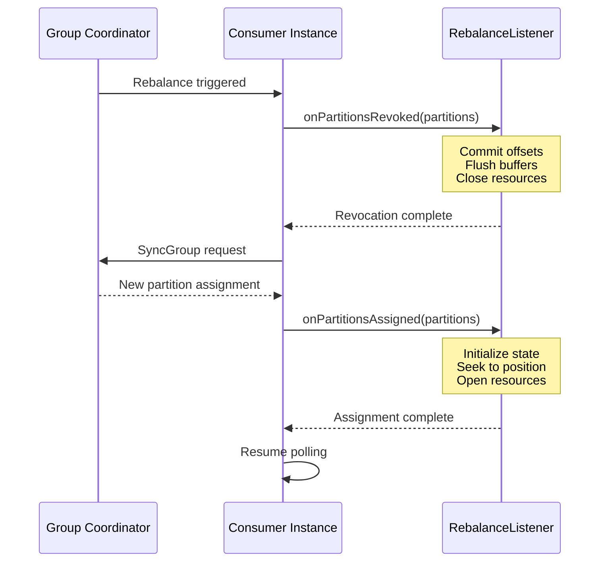
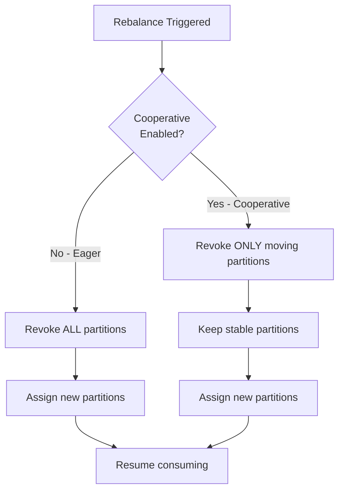

# How to Create Kafka Consumer Rebalance Listeners

Author: [nawazdhandala](https://github.com/nawazdhandala)

Tags: Kafka, Consumers, Rebalancing, Reliability

Description: A practical guide to implementing ConsumerRebalanceListener in Java for handling partition assignments, offset management, and graceful state transitions during Kafka consumer group rebalances.

---

Kafka consumer groups are dynamic. Consumers join, leave, crash, or get stuck. When this happens, Kafka triggers a rebalance to redistribute partitions among the remaining consumers. Without a rebalance listener, your application has no idea when partitions are about to be taken away or when new ones arrive. This blind spot leads to duplicate processing, lost offsets, and data inconsistency.

## Why Rebalance Listeners Matter

| Scenario | Without Listener | With Listener |
|----------|------------------|---------------|
| Consumer crashes | In-flight offsets lost | Offsets committed before revocation |
| New consumer joins | State corruption risk | State cleared and rebuilt |
| Partition reassignment | Duplicate processing | Exactly-once semantics preserved |
| Rolling deployment | Message loss during handoff | Clean handoff with flushed buffers |

## The Rebalance Lifecycle



## Basic ConsumerRebalanceListener Implementation

The `ConsumerRebalanceListener` interface has two methods: `onPartitionsRevoked` and `onPartitionsAssigned`. Here is a minimal implementation:

```java
import org.apache.kafka.clients.consumer.*;
import org.apache.kafka.common.TopicPartition;
import java.util.Collection;

public class BasicRebalanceListener implements ConsumerRebalanceListener {

    private final KafkaConsumer<String, String> consumer;

    public BasicRebalanceListener(KafkaConsumer<String, String> consumer) {
        this.consumer = consumer;
    }

    @Override
    public void onPartitionsRevoked(Collection<TopicPartition> partitions) {
        System.out.println("Partitions revoked: " + partitions);

        // Commit current offsets before partitions are taken away
        consumer.commitSync();
    }

    @Override
    public void onPartitionsAssigned(Collection<TopicPartition> partitions) {
        System.out.println("Partitions assigned: " + partitions);

        // Partitions are ready to consume
    }
}
```

Use it when subscribing:

```java
Properties props = new Properties();
props.put(ConsumerConfig.BOOTSTRAP_SERVERS_CONFIG, "localhost:9092");
props.put(ConsumerConfig.GROUP_ID_CONFIG, "my-consumer-group");
props.put(ConsumerConfig.KEY_DESERIALIZER_CLASS_CONFIG,
    "org.apache.kafka.common.serialization.StringDeserializer");
props.put(ConsumerConfig.VALUE_DESERIALIZER_CLASS_CONFIG,
    "org.apache.kafka.common.serialization.StringDeserializer");
props.put(ConsumerConfig.ENABLE_AUTO_COMMIT_CONFIG, "false");

KafkaConsumer<String, String> consumer = new KafkaConsumer<>(props);
BasicRebalanceListener listener = new BasicRebalanceListener(consumer);

consumer.subscribe(List.of("orders"), listener);

while (true) {
    ConsumerRecords<String, String> records = consumer.poll(Duration.ofMillis(100));
    for (ConsumerRecord<String, String> record : records) {
        processRecord(record);
    }
    consumer.commitAsync();
}
```

## Handling Offset Management During Rebalance

The basic listener commits all offsets. In practice, you want to commit only the offsets for records you have actually processed. This requires tracking offsets per partition:

```java
public class OffsetTrackingRebalanceListener implements ConsumerRebalanceListener {

    private final KafkaConsumer<String, String> consumer;
    private final Map<TopicPartition, OffsetAndMetadata> currentOffsets;

    public OffsetTrackingRebalanceListener(
            KafkaConsumer<String, String> consumer,
            Map<TopicPartition, OffsetAndMetadata> currentOffsets) {
        this.consumer = consumer;
        this.currentOffsets = currentOffsets;
    }

    @Override
    public void onPartitionsRevoked(Collection<TopicPartition> partitions) {
        System.out.println("Committing offsets before revocation: " + currentOffsets);

        // Only commit offsets for partitions being revoked
        Map<TopicPartition, OffsetAndMetadata> toCommit = new HashMap<>();
        for (TopicPartition partition : partitions) {
            OffsetAndMetadata offset = currentOffsets.get(partition);
            if (offset != null) {
                toCommit.put(partition, offset);
            }
        }

        if (!toCommit.isEmpty()) {
            try {
                consumer.commitSync(toCommit);
                System.out.println("Successfully committed: " + toCommit);
            } catch (CommitFailedException e) {
                System.err.println("Failed to commit offsets: " + e.getMessage());
            }
        }

        // Clear tracked offsets for revoked partitions
        for (TopicPartition partition : partitions) {
            currentOffsets.remove(partition);
        }
    }

    @Override
    public void onPartitionsAssigned(Collection<TopicPartition> partitions) {
        System.out.println("Partitions assigned: " + partitions);
        // Offsets will be fetched automatically on next poll
    }
}
```

Update your consume loop to track offsets:

```java
Map<TopicPartition, OffsetAndMetadata> currentOffsets = new ConcurrentHashMap<>();
OffsetTrackingRebalanceListener listener =
    new OffsetTrackingRebalanceListener(consumer, currentOffsets);

consumer.subscribe(List.of("orders"), listener);

while (true) {
    ConsumerRecords<String, String> records = consumer.poll(Duration.ofMillis(100));

    for (ConsumerRecord<String, String> record : records) {
        processRecord(record);

        // Track the next offset to commit (current offset + 1)
        TopicPartition partition = new TopicPartition(record.topic(), record.partition());
        currentOffsets.put(partition,
            new OffsetAndMetadata(record.offset() + 1, "processed"));
    }

    if (!records.isEmpty()) {
        consumer.commitAsync(currentOffsets, (offsets, exception) -> {
            if (exception != null) {
                System.err.println("Async commit failed: " + exception.getMessage());
            }
        });
    }
}
```

## Production-Ready Listener with State Management

Real applications maintain state per partition: caches, batch buffers, file handles, or database transactions. The rebalance listener must clean up state for revoked partitions and initialize state for assigned ones:

```java
public class StatefulRebalanceListener implements ConsumerRebalanceListener {

    private final KafkaConsumer<String, String> consumer;
    private final Map<TopicPartition, OffsetAndMetadata> currentOffsets;
    private final Map<TopicPartition, PartitionState> partitionStates;
    private final StateStore stateStore;

    public StatefulRebalanceListener(
            KafkaConsumer<String, String> consumer,
            Map<TopicPartition, OffsetAndMetadata> currentOffsets,
            StateStore stateStore) {
        this.consumer = consumer;
        this.currentOffsets = currentOffsets;
        this.partitionStates = new ConcurrentHashMap<>();
        this.stateStore = stateStore;
    }

    @Override
    public void onPartitionsRevoked(Collection<TopicPartition> partitions) {
        System.out.println("=== Revocation started for: " + partitions);

        for (TopicPartition partition : partitions) {
            PartitionState state = partitionStates.get(partition);

            if (state != null) {
                // Flush any pending batches
                state.flushBatch();

                // Close resources
                state.close();

                partitionStates.remove(partition);
            }
        }

        // Commit processed offsets
        Map<TopicPartition, OffsetAndMetadata> toCommit = new HashMap<>();
        for (TopicPartition partition : partitions) {
            OffsetAndMetadata offset = currentOffsets.remove(partition);
            if (offset != null) {
                toCommit.put(partition, offset);
            }
        }

        if (!toCommit.isEmpty()) {
            try {
                consumer.commitSync(toCommit, Duration.ofSeconds(10));
                System.out.println("Committed offsets: " + toCommit);
            } catch (Exception e) {
                System.err.println("Commit failed during revocation: " + e.getMessage());
            }
        }

        System.out.println("=== Revocation completed");
    }

    @Override
    public void onPartitionsAssigned(Collection<TopicPartition> partitions) {
        System.out.println("=== Assignment started for: " + partitions);

        for (TopicPartition partition : partitions) {
            // Load state from external store if available
            PartitionState state = new PartitionState(partition);

            // Check if we have saved state
            SavedState saved = stateStore.load(partition);
            if (saved != null) {
                state.restore(saved);

                // Seek to the saved offset if we have one
                if (saved.getLastProcessedOffset() >= 0) {
                    consumer.seek(partition, saved.getLastProcessedOffset() + 1);
                    System.out.println("Seeking " + partition + " to offset " +
                        (saved.getLastProcessedOffset() + 1));
                }
            }

            partitionStates.put(partition, state);
        }

        System.out.println("=== Assignment completed");
    }

    public PartitionState getState(TopicPartition partition) {
        return partitionStates.get(partition);
    }
}
```

Supporting classes:

```java
public class PartitionState {
    private final TopicPartition partition;
    private final List<String> batchBuffer;
    private static final int BATCH_SIZE = 100;

    public PartitionState(TopicPartition partition) {
        this.partition = partition;
        this.batchBuffer = new ArrayList<>();
    }

    public void addToBatch(String value) {
        batchBuffer.add(value);
        if (batchBuffer.size() >= BATCH_SIZE) {
            flushBatch();
        }
    }

    public void flushBatch() {
        if (!batchBuffer.isEmpty()) {
            System.out.println("Flushing " + batchBuffer.size() +
                " records for " + partition);
            // Write batch to database/file/etc
            batchBuffer.clear();
        }
    }

    public void restore(SavedState saved) {
        // Restore any in-progress state
    }

    public void close() {
        System.out.println("Closing state for " + partition);
    }
}

public interface StateStore {
    SavedState load(TopicPartition partition);
    void save(TopicPartition partition, SavedState state);
}

public class SavedState {
    private final long lastProcessedOffset;
    private final Map<String, Object> customState;

    public SavedState(long lastProcessedOffset, Map<String, Object> customState) {
        this.lastProcessedOffset = lastProcessedOffset;
        this.customState = customState;
    }

    public long getLastProcessedOffset() {
        return lastProcessedOffset;
    }

    public Map<String, Object> getCustomState() {
        return customState;
    }
}
```

## Rebalance Flow with Cooperative Sticky Assignor

Kafka 2.4+ introduced cooperative rebalancing. Instead of revoking all partitions at once, the consumer keeps partitions that are not moving. This reduces downtime during rebalances:



Enable cooperative rebalancing:

```java
props.put(ConsumerConfig.PARTITION_ASSIGNMENT_STRATEGY_CONFIG,
    "org.apache.kafka.clients.consumer.CooperativeStickyAssignor");
```

With cooperative rebalancing, `onPartitionsRevoked` is called only for partitions that are moving to another consumer. Your listener code does not need to change, but the behavior improves significantly: consumers keep processing stable partitions while only the moving partitions experience downtime.

## Handling onPartitionsLost

In some failure scenarios, partitions are lost rather than gracefully revoked. This happens when the consumer misses heartbeats and the coordinator assumes it is dead:

```java
public class RobustRebalanceListener implements ConsumerRebalanceListener {

    private final KafkaConsumer<String, String> consumer;
    private final Map<TopicPartition, OffsetAndMetadata> currentOffsets;
    private final Map<TopicPartition, PartitionState> partitionStates;

    // ... constructor

    @Override
    public void onPartitionsRevoked(Collection<TopicPartition> partitions) {
        // Called during graceful rebalance
        // Safe to commit offsets here
        commitOffsetsForPartitions(partitions);
        cleanupState(partitions);
    }

    @Override
    public void onPartitionsAssigned(Collection<TopicPartition> partitions) {
        initializeState(partitions);
    }

    @Override
    public void onPartitionsLost(Collection<TopicPartition> partitions) {
        // Called when partitions were already reassigned to another consumer
        // DO NOT commit offsets - another consumer may have already processed ahead
        System.out.println("Partitions lost (not revoked): " + partitions);

        // Only clean up local state, do not commit
        cleanupState(partitions);
    }

    private void commitOffsetsForPartitions(Collection<TopicPartition> partitions) {
        Map<TopicPartition, OffsetAndMetadata> toCommit = new HashMap<>();
        for (TopicPartition partition : partitions) {
            OffsetAndMetadata offset = currentOffsets.remove(partition);
            if (offset != null) {
                toCommit.put(partition, offset);
            }
        }

        if (!toCommit.isEmpty()) {
            try {
                consumer.commitSync(toCommit, Duration.ofSeconds(5));
            } catch (Exception e) {
                System.err.println("Commit failed: " + e.getMessage());
            }
        }
    }

    private void cleanupState(Collection<TopicPartition> partitions) {
        for (TopicPartition partition : partitions) {
            PartitionState state = partitionStates.remove(partition);
            if (state != null) {
                state.flushBatch();
                state.close();
            }
        }
    }

    private void initializeState(Collection<TopicPartition> partitions) {
        for (TopicPartition partition : partitions) {
            partitionStates.put(partition, new PartitionState(partition));
        }
    }
}
```

The difference between `onPartitionsRevoked` and `onPartitionsLost`:

| Method | When Called | Safe to Commit? | Partitions Still Owned? |
|--------|-------------|-----------------|-------------------------|
| `onPartitionsRevoked` | Graceful rebalance | Yes | Yes, until method returns |
| `onPartitionsLost` | Consumer presumed dead | No | No, already reassigned |

## Seeking to Specific Offsets on Assignment

Sometimes you need to start consuming from a specific position rather than the committed offset. Common scenarios include replaying data, skipping corrupt messages, or implementing time-based consumption:

```java
@Override
public void onPartitionsAssigned(Collection<TopicPartition> partitions) {
    for (TopicPartition partition : partitions) {
        // Option 1: Start from beginning
        // consumer.seekToBeginning(List.of(partition));

        // Option 2: Start from end
        // consumer.seekToEnd(List.of(partition));

        // Option 3: Seek to specific offset
        // consumer.seek(partition, 12345);

        // Option 4: Seek to timestamp
        Map<TopicPartition, Long> timestamps = new HashMap<>();
        timestamps.put(partition, System.currentTimeMillis() - 3600000); // 1 hour ago

        Map<TopicPartition, OffsetAndTimestamp> offsets =
            consumer.offsetsForTimes(timestamps);

        OffsetAndTimestamp offsetAndTimestamp = offsets.get(partition);
        if (offsetAndTimestamp != null) {
            consumer.seek(partition, offsetAndTimestamp.offset());
            System.out.println("Seeking " + partition + " to offset " +
                offsetAndTimestamp.offset() + " (timestamp: " +
                offsetAndTimestamp.timestamp() + ")");
        }
    }
}
```

## Testing Rebalance Listeners

Test your listener by simulating rebalances:

```java
@Test
void testRebalanceCommitsOffsets() {
    // Setup
    Map<TopicPartition, OffsetAndMetadata> offsets = new ConcurrentHashMap<>();
    TopicPartition tp0 = new TopicPartition("test", 0);
    TopicPartition tp1 = new TopicPartition("test", 1);

    offsets.put(tp0, new OffsetAndMetadata(100));
    offsets.put(tp1, new OffsetAndMetadata(200));

    MockConsumer<String, String> mockConsumer = new MockConsumer<>(OffsetResetStrategy.EARLIEST);
    OffsetTrackingRebalanceListener listener =
        new OffsetTrackingRebalanceListener(mockConsumer, offsets);

    // Trigger revocation
    listener.onPartitionsRevoked(List.of(tp0));

    // Verify offset for tp0 was committed
    Map<TopicPartition, OffsetAndMetadata> committed = mockConsumer.committed(Set.of(tp0));
    assertEquals(100, committed.get(tp0).offset());

    // Verify tp0 removed from tracking but tp1 remains
    assertFalse(offsets.containsKey(tp0));
    assertTrue(offsets.containsKey(tp1));
}

@Test
void testPartitionStateCleanup() {
    // Setup state for multiple partitions
    TopicPartition tp0 = new TopicPartition("test", 0);
    TopicPartition tp1 = new TopicPartition("test", 1);

    StatefulRebalanceListener listener = createListener();
    listener.onPartitionsAssigned(List.of(tp0, tp1));

    // Add data to state
    listener.getState(tp0).addToBatch("record1");
    listener.getState(tp1).addToBatch("record2");

    // Revoke only tp0
    listener.onPartitionsRevoked(List.of(tp0));

    // tp0 state should be cleaned, tp1 should remain
    assertNull(listener.getState(tp0));
    assertNotNull(listener.getState(tp1));
}
```

## Common Pitfalls and How to Avoid Them

**1. Blocking in rebalance callbacks**

The rebalance listener runs on the consumer thread. Long operations block heartbeats and can trigger cascading rebalances:

```java
// Bad: Blocking network call
@Override
public void onPartitionsRevoked(Collection<TopicPartition> partitions) {
    for (TopicPartition partition : partitions) {
        httpClient.post("/api/flush", partition); // Might take 30 seconds
    }
}

// Good: Use timeouts
@Override
public void onPartitionsRevoked(Collection<TopicPartition> partitions) {
    try {
        CompletableFuture.allOf(
            partitions.stream()
                .map(p -> CompletableFuture.runAsync(() -> flushPartition(p)))
                .toArray(CompletableFuture[]::new)
        ).get(10, TimeUnit.SECONDS);
    } catch (TimeoutException e) {
        System.err.println("Flush timed out, some data may be reprocessed");
    }
}
```

**2. Forgetting to handle empty revocation**

With cooperative rebalancing, `onPartitionsRevoked` may be called with an empty collection:

```java
@Override
public void onPartitionsRevoked(Collection<TopicPartition> partitions) {
    if (partitions.isEmpty()) {
        return; // Nothing to do
    }
    // ... rest of revocation logic
}
```

**3. Not disabling auto-commit**

If auto-commit is enabled, offsets may be committed before your listener flushes buffers:

```java
// Always disable auto-commit when using rebalance listeners
props.put(ConsumerConfig.ENABLE_AUTO_COMMIT_CONFIG, "false");
```

## Summary

| Phase | Action | Key Consideration |
|-------|--------|-------------------|
| **Revoked** | Flush buffers, commit offsets, close resources | Keep it fast to avoid rebalance timeouts |
| **Lost** | Clean up state only, do NOT commit | Another consumer owns these partitions now |
| **Assigned** | Initialize state, optionally seek | Restore from external store if needed |

Rebalance listeners give you control over partition lifecycle events. Use them to commit offsets precisely, manage partition-specific state, and handle edge cases like partition loss. Combined with cooperative rebalancing and proper offset tracking, your Kafka consumers will handle group membership changes gracefully without data loss or duplicate processing.
